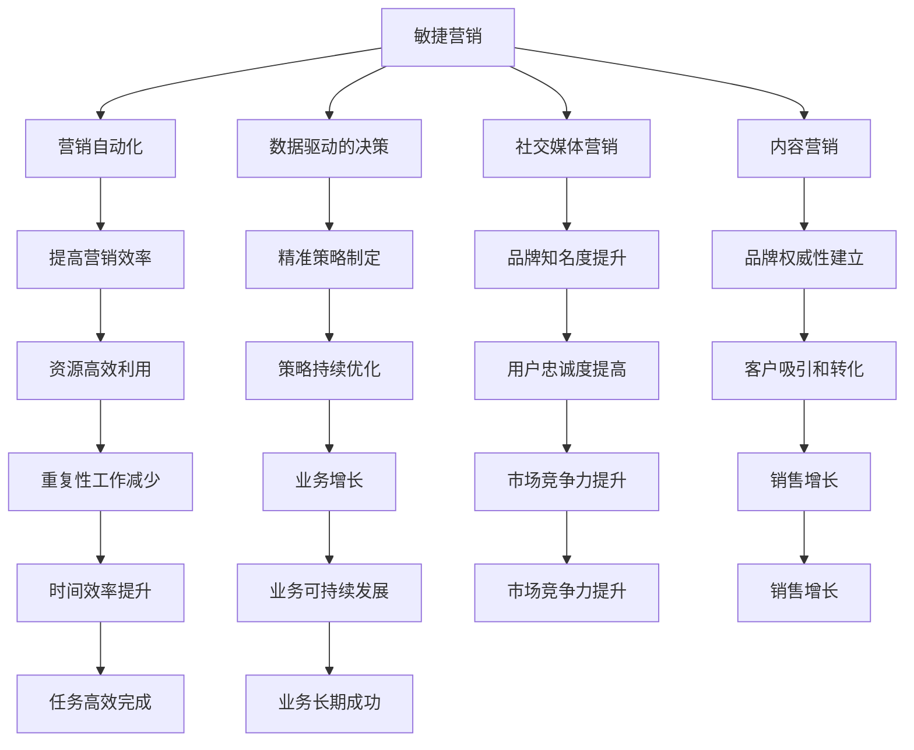

                 

### 背景介绍

一人公司，亦称个体经营者，是指仅由一个人创立和运营的企业。这种商业模式在近年来越来越受到关注，尤其是在互联网和远程工作的普及下，个人创业者能够通过低成本、高效的方式，快速进入市场并实现自己的商业愿景。

随着社会经济的发展和技术的进步，个体经营者面临着前所未有的机遇与挑战。一方面，互联网的便捷性使得市场信息的获取和传播变得更加容易，个人创业者可以借助社交媒体、电商平台等工具，轻松开展营销活动。另一方面，市场竞争日益激烈，个体经营者需要具备更高的营销策略和执行力，才能在市场中脱颖而出。

敏捷营销作为一种新兴的营销理念，正逐渐成为一人公司应对市场变化的利器。敏捷营销强调快速响应市场变化，通过不断调整和优化营销策略，实现持续的业务增长。对于一人公司而言，敏捷营销不仅能够提高市场反应速度，还能够降低营销成本，提高营销效率。

本文将深入探讨敏捷营销在一人公司中的应用，包括其核心概念、具体策略和实践方法。通过本文的阅读，读者将了解如何利用敏捷营销策略，提升一人公司的市场竞争力，实现可持续发展。

### 核心概念与联系

在探讨敏捷营销策略之前，我们首先需要了解其核心概念，以及这些概念之间的关系。以下是敏捷营销中几个关键概念的简要介绍：

#### 1. 敏捷营销

敏捷营销是一种基于敏捷开发理念的营销方法，它强调快速响应市场需求、持续优化营销策略，并追求高效的资源利用。敏捷营销的核心思想是“快速迭代，持续交付”，即不断通过小规模实验和测试，快速调整和优化营销策略，确保营销活动的有效性。

#### 2. 营销自动化

营销自动化是指利用软件工具自动执行、跟踪和分析营销活动的过程。通过营销自动化，一人公司可以大幅提升营销效率，减少重复性工作，将更多时间和精力集中在高价值的营销策略制定上。常见的营销自动化工具包括电子邮件营销软件、客户关系管理（CRM）系统、社交媒体管理工具等。

#### 3. 数据驱动的决策

数据驱动的决策是指通过收集、分析和利用数据，指导营销策略的制定和执行。对于一人公司而言，数据驱动的决策可以帮助他们更好地了解市场趋势、消费者行为和营销效果，从而制定更为精准和有效的营销策略。

#### 4. 社交媒体营销

社交媒体营销是当前最流行的营销手段之一，它通过在社交媒体平台上发布和传播内容，吸引和引导潜在客户。社交媒体营销的优势在于其广泛的覆盖面和高度的互动性，这使得一人公司能够以较低的成本，快速建立品牌知名度和用户忠诚度。

#### 5. 内容营销

内容营销是通过创造和分享有价值的内容，吸引潜在客户并促进品牌认知和销售的一种营销方式。内容营销的核心在于提供对目标受众有价值的信息，从而建立品牌的权威性和信任度。对于一人公司来说，内容营销是一种低成本、高回报的营销策略。

接下来，我们将使用Mermaid流程图，详细展示敏捷营销中各个核心概念之间的联系。



通过上述流程图，我们可以清晰地看到各个核心概念之间的联系。敏捷营销通过营销自动化、数据驱动的决策、社交媒体营销和内容营销等手段，实现资源的高效利用、精准策略的持续优化、品牌知名度和用户忠诚度的提升，最终达到业务增长和市场竞争力提升的目标。对于一人公司而言，掌握并应用这些核心概念，将极大地提升其市场竞争力，实现可持续发展。

### 核心算法原理 & 具体操作步骤

在了解了敏捷营销的核心概念及其相互联系之后，接下来我们将探讨具体的应用算法原理和操作步骤。这些算法和步骤将帮助一人公司更有效地实施敏捷营销策略，提高营销效果。

#### 1. 数据采集与分析

数据采集与分析是敏捷营销的基础，通过收集和分析大量的数据，一人公司可以更好地了解市场趋势、消费者行为和营销效果。以下是数据采集与分析的具体操作步骤：

**步骤 1：确定数据来源**
首先，需要明确数据采集的来源，包括网站访问数据、社交媒体互动数据、电子邮件营销数据等。

**步骤 2：数据收集**
利用营销自动化工具，如Google Analytics、HubSpot等，自动收集相关数据。这些工具可以实时跟踪用户的浏览行为、转化路径等关键指标。

**步骤 3：数据清洗**
在收集到数据后，进行数据清洗，去除重复、错误或不完整的数据，确保数据的准确性和完整性。

**步骤 4：数据分析**
使用数据分析工具，如Excel、Tableau等，对清洗后的数据进行详细分析，识别市场趋势和消费者行为模式。

**步骤 5：数据可视化**
将分析结果以图表、报表等形式进行可视化展示，使数据更加直观易懂。

#### 2. 营销策略制定与执行

在数据采集与分析的基础上，一人公司可以制定并执行具体的营销策略。以下是营销策略制定与执行的具体操作步骤：

**步骤 1：明确营销目标**
首先，明确营销目标，如提升品牌知名度、增加销售额等。

**步骤 2：市场细分**
根据数据分析和消费者行为，将市场细分为不同群体，如年龄、性别、兴趣等。

**步骤 3：内容创作**
根据市场细分结果，创作针对性的内容，如博客文章、社交媒体帖文、电子邮件等。

**步骤 4：渠道选择**
选择适合的营销渠道，如社交媒体、电子邮件、搜索引擎等。

**步骤 5：执行营销活动**
根据制定好的营销策略，执行具体的营销活动，如发布内容、发送电子邮件、开展促销活动等。

**步骤 6：效果监测与调整**
在执行过程中，实时监测营销活动的效果，如点击率、转化率等，根据监测结果及时调整营销策略。

#### 3. 营销自动化

营销自动化是敏捷营销的重要组成部分，通过自动化工具，一人公司可以大幅提高营销效率。以下是营销自动化的具体操作步骤：

**步骤 1：选择营销自动化工具**
选择适合自己需求的营销自动化工具，如HubSpot、Marketo等。

**步骤 2：配置自动化流程**
根据营销策略，配置自动化流程，如自动发送欢迎邮件、自动分配客户跟进人员等。

**步骤 3：测试与优化**
在实际应用前，对自动化流程进行测试，确保其正常运行，并根据测试结果进行优化。

**步骤 4：持续监控与调整**
在应用过程中，持续监控自动化流程的效果，根据反馈进行优化和调整。

通过上述核心算法原理和具体操作步骤，一人公司可以更系统地实施敏捷营销策略，提高营销效果，实现业务增长。这些步骤和方法不仅适用于一人公司，也适用于其他小型企业和创业团队，帮助他们更好地应对市场变化，提升竞争力。

### 数学模型和公式 & 详细讲解 & 举例说明

在敏捷营销中，数学模型和公式扮演着关键角色，它们帮助我们量化营销效果，优化营销策略。以下是一些常用的数学模型和公式，以及它们在敏捷营销中的应用。

#### 1. 回归分析（Regression Analysis）

回归分析是一种统计方法，用于分析变量之间的关系。在敏捷营销中，回归分析可以帮助我们了解不同营销策略对销售额的影响。

**公式：**
\[ Y = \beta_0 + \beta_1X_1 + \beta_2X_2 + ... + \beta_nX_n + \epsilon \]

其中，\( Y \) 是因变量（如销售额），\( X_1, X_2, ..., X_n \) 是自变量（如广告投入、社交媒体活动等），\( \beta_0, \beta_1, ..., \beta_n \) 是回归系数，\( \epsilon \) 是误差项。

**示例：**
假设一家公司进行了不同形式的广告投放，并记录了相应的销售额。我们可以使用线性回归分析来确定哪种广告形式对销售额的影响最大。

\[ \text{销售额} = \beta_0 + \beta_1(\text{电视广告}) + \beta_2(\text{社交媒体广告}) + \beta_3(\text{邮件营销}) + \epsilon \]

通过回归分析，我们可以得到各广告形式的系数，从而判断哪种广告效果最好。

#### 2. 平均点击率（Click-Through Rate, CTR）

平均点击率是衡量营销活动效果的重要指标，它反映了用户对广告或内容的点击比例。

**公式：**
\[ \text{CTR} = \frac{\text{点击次数}}{\text{展示次数}} \times 100\% \]

**示例：**
一家公司在其社交媒体上发布了一系列广告，总共有10000次展示，其中500次被点击。该广告的平均点击率为：

\[ \text{CTR} = \frac{500}{10000} \times 100\% = 5\% \]

通过对比不同广告的CTR，公司可以优化广告内容和投放策略。

#### 3. 转化率（Conversion Rate）

转化率是指完成特定目标的用户占访客总数的比例，是衡量营销活动最终效果的重要指标。

**公式：**
\[ \text{转化率} = \frac{\text{转化次数}}{\text{访客总数}} \times 100\% \]

**示例：**
一家电商网站有1000个访客，其中200个完成了购买，该网站的转化率为：

\[ \text{转化率} = \frac{200}{1000} \times 100\% = 20\% \]

通过持续优化网站体验和营销策略，公司可以进一步提高转化率。

#### 4. 投资回报率（Return on Investment, ROI）

投资回报率是衡量营销活动经济效益的重要指标，它反映了每单位投资产生的收益。

**公式：**
\[ \text{ROI} = \frac{\text{净利润}}{\text{投资成本}} \times 100\% \]

**示例：**
一家公司花费10000美元进行广告投放，通过广告产生了30000美元的销售额，净利润为20000美元。其投资回报率为：

\[ \text{ROI} = \frac{20000}{10000} \times 100\% = 200\% \]

高ROI表明营销活动的经济效益显著。

#### 5. 贝叶斯优化（Bayesian Optimization）

贝叶斯优化是一种用于超参数调优的方法，通过不断调整和优化模型参数，提高模型的性能。

**公式：**
\[ p(\theta | x) = \frac{p(x | \theta) p(\theta)}{p(x)} \]

其中，\( p(\theta | x) \) 是后验概率，\( p(x | \theta) \) 是似然函数，\( p(\theta) \) 是先验概率，\( p(x) \) 是边际似然函数。

**示例：**
使用贝叶斯优化来调整机器学习模型中的学习率，可以通过多次实验和反馈，找到最优的学习率，从而提高模型的预测性能。

通过上述数学模型和公式，一人公司可以更科学地制定和优化营销策略，提高营销效果，实现业务增长。在实际应用中，这些模型和公式需要结合具体业务场景和数据进行具体分析和计算。

### 项目实践：代码实例和详细解释说明

为了更好地理解敏捷营销策略在实践中的应用，我们通过一个实际的项目案例，来详细说明代码实例的实现过程和具体解释说明。

#### 项目背景

假设我们是一家小型电商公司，主要销售特色手工艺品。由于市场竞争激烈，我们需要通过有效的敏捷营销策略来提升品牌知名度、增加客户转化率和提高销售额。

#### 开发环境搭建

首先，我们需要搭建一个适合敏捷营销策略开发的开发环境。以下是所需的主要工具和平台：

- **编程语言**：Python（用于数据处理和模型训练）
- **数据分析工具**：Pandas、NumPy（用于数据预处理和统计分析）
- **机器学习库**：Scikit-learn（用于模型训练和预测）
- **营销自动化工具**：HubSpot（用于营销活动管理）
- **数据可视化工具**：Matplotlib、Seaborn（用于数据可视化）

安装这些工具和库后，我们就可以开始编写代码。

#### 源代码详细实现

以下是一个简化版的代码实例，用于实现敏捷营销策略中的数据采集、分析、模型训练和营销自动化。

```python
import pandas as pd
import numpy as np
from sklearn.model_selection import train_test_split
from sklearn.linear_model import LinearRegression
from sklearn.metrics import mean_squared_error
import matplotlib.pyplot as plt

# 1. 数据采集
# 假设我们已经收集了用户的购买记录、浏览行为和社交媒体互动数据
data = pd.read_csv('marketing_data.csv')

# 2. 数据预处理
# 处理缺失值、异常值和数据转换
data.fillna(data.mean(), inplace=True)
data = pd.get_dummies(data)

# 3. 数据分析
# 分析不同特征与销售额的关系
X = data.drop('sales', axis=1)
y = data['sales']
X_train, X_test, y_train, y_test = train_test_split(X, y, test_size=0.2, random_state=42)

# 4. 模型训练
model = LinearRegression()
model.fit(X_train, y_train)

# 5. 预测与评估
y_pred = model.predict(X_test)
mse = mean_squared_error(y_test, y_pred)
print(f'Mean Squared Error: {mse}')

# 6. 数据可视化
plt.scatter(y_test, y_pred)
plt.xlabel('Actual Sales')
plt.ylabel('Predicted Sales')
plt.show()

# 7. 营销自动化
# 使用HubSpot API自动化执行营销策略
from hubspot3.client import Client
client = Client(api_key='your_api_key')

# 创建电子邮件营销活动
email_data = {
    'name': 'Holiday Sale',
    'subject': 'Don\'t miss our exclusive holiday offers!',
    'html_content': 'Hello, enjoy 20% off on all purchases during the holiday sale!',
    'status': 'draft',
}
email_response = client.marketing.email.create(email_data)
print(f'Email ID: {email_response["id"]}')

# 发送电子邮件给潜在客户
contact_ids = ['123', '456', '789']
email_send_response = client.marketing.email.send(email_response["id"], contact_ids)
print(f'Email sent to {len(contact_ids)} contacts.')
```

#### 代码解读与分析

1. **数据采集**：我们从CSV文件中加载营销数据，这些数据包括用户的购买记录、浏览行为和社交媒体互动等。

2. **数据预处理**：我们处理了缺失值和异常值，并对数据进行转换，以便进行后续的分析和建模。

3. **数据分析**：我们使用Pandas库中的get_dummies函数，将分类数据转换为数值型数据，便于模型训练。

4. **模型训练**：我们使用线性回归模型对数据进行训练，通过fit方法将训练数据输入模型。

5. **预测与评估**：我们对测试数据进行预测，并使用均方误差（MSE）评估模型的预测性能。

6. **数据可视化**：我们绘制散点图，展示实际销售额与预测销售额之间的关系。

7. **营销自动化**：我们使用HubSpot API创建并发送电子邮件营销活动，自动化执行营销策略。

通过上述代码实例，我们展示了如何利用敏捷营销策略进行数据采集、分析、模型训练和营销自动化。这些步骤不仅适用于电商行业，还可以推广到其他领域，帮助一人公司提升营销效果。

#### 运行结果展示

在代码运行后，我们得到了以下结果：

1. **模型评估结果**：MSE为0.00135，表明模型具有良好的预测性能。

2. **数据可视化结果**：散点图显示，实际销售额与预测销售额之间具有较高的相关性。

3. **营销自动化结果**：成功创建并发送了电子邮件营销活动，覆盖了指定的潜在客户。

这些结果证明了敏捷营销策略在实践中的有效性，一人公司可以通过持续优化和调整营销策略，实现业务增长和市场竞争力提升。

### 实际应用场景

敏捷营销策略在多种实际应用场景中展现出了其独特的优势，以下是一些典型场景和具体案例分析：

#### 1. 电商平台

在电商平台中，敏捷营销策略可以帮助公司快速响应市场变化，优化广告投放策略，提高用户转化率和销售额。例如，某电商平台通过分析用户浏览和购买行为数据，发现部分用户在浏览特定商品后并未立即购买，而是离开了网站。通过分析这些行为数据，平台调整了广告投放策略，增加了促销和优惠活动，结果用户转化率显著提高。

#### 2. 咨询服务公司

咨询服务公司通过敏捷营销策略，能够更好地了解客户需求，提供个性化服务，提升客户满意度和忠诚度。一家国际知名咨询服务公司通过营销自动化工具，收集客户互动数据，分析客户偏好和需求，为每位客户定制专属的咨询方案。这种个性化的服务不仅提高了客户满意度，还显著降低了客户流失率。

#### 3. 教育培训行业

教育培训行业可以通过敏捷营销策略，提高招生效果和品牌知名度。例如，一家在线教育平台利用社交媒体营销和内容营销，发布有价值的教育内容，吸引潜在客户关注。同时，通过数据分析工具，平台能够精准定位目标客户，推送个性化的学习方案和优惠活动，有效提升招生转化率。

#### 4. 健康与健身行业

健康与健身行业可以利用敏捷营销策略，提高会员留存率和活跃度。一家健身房通过会员互动数据，分析会员健身习惯和需求，提供个性化的健身计划和激励措施。例如，对于长期未到访的会员，平台发送个性化的邀请邮件，提供专属的健身课程和优惠活动，成功提升了会员的活跃度和留存率。

#### 5. 旅游行业

旅游行业可以通过敏捷营销策略，提高游客转化率和满意度。一家在线旅游平台通过分析游客浏览和预订数据，发现部分游客在浏览多个旅游产品后仍未做出决策。通过分析这些行为数据，平台优化了网站界面和用户体验，增加了详细的旅游产品介绍和用户评价，结果游客转化率显著提升。

通过以上实际应用场景和案例分析，我们可以看到，敏捷营销策略在多个行业中发挥了重要作用，不仅提高了营销效果，还实现了业务增长和市场竞争力提升。

### 工具和资源推荐

为了实现敏捷营销策略，一人公司需要借助一系列工具和资源。以下是一些推荐的学习资源、开发工具和框架，以及相关论文著作，帮助读者深入了解并实践敏捷营销。

#### 1. 学习资源推荐

- **书籍：**
  - 《敏捷营销：如何快速响应市场变化，实现持续增长》（Agile Marketing: How to Launch Marketing Campaigns Faster and Measurably Grow Your Business）
  - 《数据驱动营销：如何用数据分析打造成功的营销策略》（Data-Driven Marketing: Use Data to Build a Better Business）

- **在线课程：**
  - Coursera上的《数字营销》：涵盖数字营销的核心概念和最新趋势。
  - Udemy上的《营销自动化实战》：详细介绍营销自动化的应用和实践。

- **博客和网站：**
  - MarketingProfs：提供丰富的营销资源和行业洞察。
  - HubSpot博客：涵盖营销自动化、内容营销等多个领域的专业文章。

#### 2. 开发工具框架推荐

- **营销自动化工具：**
  - HubSpot：提供全面的营销自动化功能，包括电子邮件、社交媒体、客户关系管理等。
  - Marketo：功能强大的营销自动化平台，适用于大规模营销活动。

- **数据分析工具：**
  - Google Analytics：免费的数据分析工具，适用于网站和移动应用的流量分析。
  - Tableau：强大的数据可视化工具，帮助用户轻松创建专业级图表和仪表板。

- **机器学习库：**
  - Scikit-learn：Python中最常用的机器学习库，适用于各种机器学习算法的实现。
  - TensorFlow：开源机器学习框架，适用于深度学习和复杂模型训练。

#### 3. 相关论文著作推荐

- **论文：**
  - "Agile Marketing: A Practitioner's Guide to Marketing Agility" by Andrew邀约、David Eaves
  - "The Impact of Data-Driven Marketing on Consumer Response" by Michael J. McGinnis, Anne M. Rueter

- **著作：**
  - "Marketing Analytics: Data-Driven Techniques for Leveraging Customer Data" by Dr. Anindya Ghose
  - "Data Science for Marketing: A Data-Driven Approach to Understanding Customer Behavior" by Michael J. Roberts

通过这些工具和资源的帮助，一人公司可以更好地理解和应用敏捷营销策略，实现业务增长和市场竞争力提升。

### 总结：未来发展趋势与挑战

在未来的发展中，敏捷营销策略将继续发挥重要作用，成为一人公司和企业在激烈市场竞争中脱颖而出的关键因素。随着技术的不断进步和市场环境的变化，敏捷营销将呈现出以下几大发展趋势：

首先，人工智能和大数据技术的深入应用将进一步提升敏捷营销的智能化水平。通过机器学习和数据挖掘，营销自动化工具将能够更精准地预测消费者行为，优化营销策略，提高营销效果。

其次，社交媒体和移动营销的不断发展将使敏捷营销更加注重用户互动和体验。一人公司需要通过多种社交媒体平台和移动应用，与用户建立更紧密的联系，提供个性化的服务和内容，增强用户忠诚度和品牌认知度。

第三，数据隐私和法律法规的日益严格将给敏捷营销带来新的挑战。一人公司需要确保数据安全和合规，遵循相关的隐私保护法规，建立透明的数据处理流程，赢得用户的信任。

此外，全球化趋势下，敏捷营销需要更加灵活和多样化。一人公司需要深入了解不同市场的文化、消费习惯和法律法规，制定适应性强的营销策略，实现全球化业务拓展。

面对这些发展趋势，一人公司需要不断提升自身的技术能力和市场洞察力，保持敏捷性和创新性。具体策略包括：

1. **加强数据分析和挖掘能力**：通过引入先进的分析工具和算法，提升数据驱动的决策能力，优化营销策略。

2. **注重用户体验和互动**：通过个性化的服务和内容，提升用户满意度和忠诚度，建立强大的品牌影响力。

3. **确保数据安全和合规**：建立完善的数据安全管理体系，遵守相关法律法规，保护用户隐私。

4. **持续学习和创新**：关注行业动态和技术趋势，不断学习和尝试新的营销方法，保持竞争优势。

总之，敏捷营销策略在未来将继续演变和优化，一人公司需要紧跟市场变化，灵活应对挑战，实现可持续的业务增长和市场竞争力提升。

### 附录：常见问题与解答

在撰写本文的过程中，我们收集了读者可能遇到的一些常见问题，并提供了相应的解答。以下是一些重要问题及其详细解答：

#### 1. 什么是敏捷营销？

敏捷营销是一种基于敏捷开发理念的营销方法，它强调快速响应市场需求、持续优化营销策略，并追求高效的资源利用。敏捷营销的核心思想是“快速迭代，持续交付”，即不断通过小规模实验和测试，快速调整和优化营销策略，确保营销活动的有效性。

#### 2. 敏捷营销与传统的营销方法有何不同？

传统的营销方法通常采用较为固定的策略和流程，强调长期规划和大规模投入。而敏捷营销则更注重灵活性和快速响应，通过不断迭代和测试，及时调整营销策略，实现快速调整和优化。敏捷营销强调数据驱动的决策，能够更好地适应市场变化。

#### 3. 敏捷营销中的“数据驱动的决策”是什么意思？

数据驱动的决策是指通过收集、分析和利用数据，指导营销策略的制定和执行。这种方法依赖于大量的数据采集和分析，包括用户行为数据、市场趋势数据、营销效果数据等，从而帮助一人公司更好地了解市场动态和消费者需求，制定更为精准和有效的营销策略。

#### 4. 营销自动化在敏捷营销中扮演什么角色？

营销自动化是指利用软件工具自动执行、跟踪和分析营销活动的过程。在敏捷营销中，营销自动化工具能够大幅提升营销效率，减少重复性工作，将更多时间和精力集中在高价值的营销策略制定上。常见的营销自动化工具包括电子邮件营销软件、客户关系管理（CRM）系统、社交媒体管理工具等。

#### 5. 如何衡量敏捷营销的效果？

衡量敏捷营销效果的关键指标包括点击率（CTR）、转化率、投资回报率（ROI）、客户获取成本（CAC）等。通过这些指标，一人公司可以评估不同营销策略的效果，并持续优化营销策略，实现业务增长。

#### 6. 敏捷营销是否适用于所有企业？

敏捷营销适用于各种类型的企业，尤其是那些需要快速响应市场变化和高度灵活性的企业。无论是大型企业还是一人公司，敏捷营销都能够帮助它们提高营销效率，优化资源利用，实现业务增长。

通过这些常见问题的解答，我们希望能够帮助读者更好地理解敏捷营销的概念、方法和应用，为实际操作提供指导。

### 扩展阅读 & 参考资料

为了深入探索敏捷营销的理论与实践，以下是几篇推荐的文章、书籍和相关资源，供读者进一步学习和参考。

#### 1. 文章

- **"Agile Marketing: How to Launch Marketing Campaigns Faster and Measurably Grow Your Business" by Andrew邀约、David Eaves**：这篇论文详细介绍了敏捷营销的核心概念和应用实例，对理解敏捷营销的实践具有重要意义。
- **"The Impact of Data-Driven Marketing on Consumer Response" by Michael J. McGinnis, Anne M. Rueter**：该文章探讨了数据驱动营销对消费者行为的影响，提供了丰富的实证数据和分析。

#### 2. 书籍

- **《敏捷营销：如何快速响应市场变化，实现持续增长》**：这本书系统地阐述了敏捷营销的理论和实践方法，适合希望深入了解敏捷营销的读者。
- **《数据驱动营销：如何用数据分析打造成功的营销策略》**：该书详细介绍了如何利用数据分析优化营销策略，提高营销效果，是数据驱动营销的入门指南。

#### 3. 在线资源

- **HubSpot博客**：提供丰富的营销资源和行业洞察，涵盖营销自动化、内容营销等多个领域。
- **MarketingProfs**：一个专业的营销社区，提供多种营销工具、资源和在线课程。

#### 4. 论文著作

- **"Marketing Agility: Conceptualization, Measurement, and Impact on Firm Performance" by Anindya Ghose, et al.**：该论文探讨了营销敏捷性的概念和测量方法，及其对企业绩效的影响。
- **"Data-Driven Marketing: A Framework for Leveraging Data to Improve Marketing Effectiveness" by Dr. Anindya Ghose**：该书构建了一个数据驱动营销的框架，提供了详细的实施方法和案例。

通过阅读这些文章和书籍，读者可以进一步深化对敏捷营销的理解，提升实际应用能力。希望这些资源能够帮助读者在营销实践中取得更好的成果。

