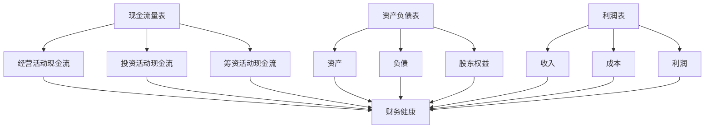

                 

### 背景介绍

随着互联网的普及和商业模式的创新，独立创业成为越来越多人的选择。在这个时代，一个人的公司（也称为“一人公司”）应运而生，这类公司由于运营成本较低、决策效率高，受到不少创业者的青睐。然而，尽管一人公司具有诸多优势，但现金流的合理管理和财务的健康运营依然是创业者们面临的重要挑战。

#### 一人公司的定义

一人公司，顾名思义，即仅由一个人所有、经营的公司。这种公司形式无需像普通有限责任公司那样，需要两个以上的股东。一人公司可以是个人独资企业，也可以是个人控股的有限责任公司。这种公司结构在法律上相对简单，运营成本较低，非常适合初创企业和小型企业。

#### 现金流管理的必要性

现金流管理是指企业通过合理规划和控制现金流量，确保企业能够正常运营、应对突发事件和实现长期发展目标。对于一人公司来说，现金流管理尤为重要：

1. **确保日常运营**：合理的现金流管理能保证公司有足够的资金支付日常运营费用，如员工工资、办公场所租金、日常开支等。

2. **应对突发事件**：突发情况如市场变化、原材料价格波动等，可能会对企业的现金流造成冲击。有效的现金流管理能够帮助一人公司在遇到危机时迅速应对。

3. **实现长期发展**：现金流管理不仅关系到企业的短期生存，更是实现长期发展的基础。通过有效的现金流管理，一人公司能够积累资本，为未来的扩张和投资提供资金支持。

#### 财务健康的重要性

财务健康是指企业在经济活动中保持稳健的财务状况，包括流动性强、负债适度、盈利能力高等。对于一人公司来说，保持财务健康尤为重要：

1. **增强企业信誉**：良好的财务状况能够增强投资者和合作伙伴的信任，为企业未来的融资和合作奠定基础。

2. **提高竞争力**：在激烈的市场竞争中，财务健康的企业更容易获得市场机会，提高自身的竞争力。

3. **实现可持续发展**：财务健康是一人公司实现长期可持续发展的基础，只有保持良好的财务状况，企业才能在竞争中立足。

#### 文章结构概述

本文将围绕一人公司的现金流管理和财务健康展开讨论。首先，我们将介绍一些关键的财务概念，如现金流量表、资产负债表和利润表，帮助读者理解这些基础概念。接着，我们将详细探讨一人公司如何通过优化现金流管理来提升财务健康，并分析一些实际操作步骤。随后，文章将讨论如何构建有效的预算体系和财务监控机制。最后，我们将总结一人公司在现金流管理和财务健康方面面临的挑战，并提出相应的解决策略。

通过本文的逐步讲解，希望读者能够对一人公司的现金流管理和财务健康有更深入的理解，为创业之路提供有益的参考。接下来，我们将从基础概念开始，逐步探讨如何实现一人公司的财务健康。

### 核心概念与联系

为了深入理解一人公司的现金流管理和财务健康，我们首先需要明确一些核心财务概念及其相互关系。这些核心概念包括现金流量表、资产负债表和利润表，它们是财务管理中的三大重要工具。

#### 现金流量表

现金流量表是反映企业在一定时期内现金收入和支出情况的财务报表。它详细列出了企业现金流入和流出的原因，包括经营活动、投资活动和筹资活动。现金流量表的核心作用在于帮助企业管理现金流，确保企业有足够的现金来支付日常运营费用、偿还债务和进行投资。

**现金流量表的主要组成部分：**
1. **经营活动现金流**：包括销售收入、采购成本、运营费用等，反映了企业的日常运营状况。
2. **投资活动现金流**：包括购买或出售固定资产、投资收益等，反映了企业的投资活动。
3. **筹资活动现金流**：包括借款、还款、股权融资等，反映了企业的筹资活动。

**现金流量表与财务健康的关系：**
现金流量表能直观地展示企业的现金流状况，是判断企业财务健康状况的重要指标。一个健康的现金流表应该显示出：
- 经营活动现金流为正，表明企业有足够的现金来支付日常运营费用。
- 投资活动现金流与筹资活动现金流相匹配，确保企业的投资和筹资活动合理有序。

#### 资产负债表

资产负债表是反映企业在某一特定时点的财务状况的财务报表。它列出了企业的资产、负债和股东权益，是分析企业财务结构的重要工具。

**资产负债表的主要组成部分：**
1. **资产**：包括流动资产和非流动资产，如现金、应收账款、固定资产等。
2. **负债**：包括流动负债和非流动负债，如短期借款、长期借款、应付账款等。
3. **股东权益**：包括股本、资本公积、盈余公积和未分配利润等。

**资产负债表与财务健康的关系：**
资产负债表能够帮助企业和管理者了解企业的资产分布、负债状况和权益结构。一个健康的资产负债表应该显示出：
- 资产与负债的比例合理，确保企业有足够的资产来覆盖负债。
- 股东权益稳定增长，表明企业具有良好的盈利能力和投资回报率。

#### 利润表

利润表是反映企业在一定时期内经营成果的财务报表。它列出了企业的收入、成本和利润，是评估企业经营效益的重要工具。

**利润表的主要组成部分：**
1. **收入**：包括主营业务收入和其他业务收入，如销售收入、服务收入等。
2. **成本**：包括主营业务成本和其他业务成本，如原材料成本、运营费用等。
3. **利润**：收入减去成本后的净额，反映了企业的经营效益。

**利润表与财务健康的关系：**
利润表能够帮助企业和管理者了解企业的盈利能力、成本控制和运营效率。一个健康的利润表应该显示出：
- 收入稳定增长，表明企业经营状况良好。
- 成本控制在合理范围内，确保企业的盈利能力。

#### Mermaid 流程图

为了更直观地展示这些核心概念之间的联系，我们使用 Mermaid 流程图来描述它们之间的关系。



通过这个流程图，我们可以看到现金流量表、资产负债表和利润表之间相互关联，共同构成了企业财务管理的核心框架。理解这些核心概念及其相互关系，是一人公司进行有效现金流管理和财务健康运营的基础。

接下来，我们将进一步探讨这些核心概念在实际操作中的应用，帮助一人公司提升财务健康。

#### 核心算法原理 & 具体操作步骤

在深入探讨如何提升一人公司的现金流管理和财务健康之前，我们需要理解一些核心算法原理和具体操作步骤。这些方法不仅能帮助创业者更好地管理公司财务，还能提升公司的运营效率和盈利能力。

##### 1. 现金流量预测算法

现金流量预测是现金流管理的重要组成部分。通过预测未来的现金流量，公司可以提前规划资金需求，确保有足够的流动资金来应对日常运营和突发情况。以下是现金流量预测的基本步骤：

1. **历史数据分析**：
   - 收集过去一段时间（至少一年）的现金流量数据，包括经营活动现金流、投资活动现金流和筹资活动现金流。
   - 分析这些数据，找出现金流量的变化趋势和周期性特征。

2. **预测模型建立**：
   - 选择合适的预测模型，如时间序列模型、回归模型等。
   - 使用历史数据对模型进行训练，确定模型参数。

3. **预测结果验证**：
   - 使用部分历史数据进行预测，并与实际现金流量进行比较，评估模型的准确性。
   - 根据验证结果调整模型参数，提高预测精度。

4. **未来现金流预测**：
   - 使用训练好的模型对未来的现金流量进行预测。
   - 根据预测结果制定资金使用计划，确保公司有足够的现金流来应对未来的需求。

##### 2. 预算编制算法

预算编制是公司财务管理的重要环节，它帮助公司规划未来一段时间的收入和支出。以下是预算编制的基本步骤：

1. **确定预算目标**：
   - 根据公司战略和经营目标，确定预算期内的收入和支出目标。
   - 设定合理的利润率、运营成本比例等关键指标。

2. **收入预测**：
   - 分析历史收入数据，找出收入的变化趋势。
   - 考虑市场变化、客户需求等因素，预测未来的收入。

3. **支出规划**：
   - 列出预算期内的各项支出，包括运营成本、投资支出、筹资成本等。
   - 根据历史数据和未来预测，确定各项支出的合理范围。

4. **预算调整**：
   - 对预算进行初步编制后，进行多次调整，确保预算的合理性和可行性。
   - 考虑风险因素，预留一定的调整空间。

5. **预算审批和执行**：
   - 将编制好的预算提交给管理层审批。
   - 根据批准的预算，制定详细的执行计划，确保预算得到有效执行。

##### 3. 财务健康评估算法

财务健康评估是衡量公司财务状况的重要工具。通过财务健康评估，公司可以了解自身的财务健康状况，及时发现问题并采取改进措施。以下是财务健康评估的基本步骤：

1. **收集财务数据**：
   - 收集公司最近的财务报表，包括现金流量表、资产负债表和利润表。
   - 确保财务数据真实、准确、完整。

2. **计算关键财务指标**：
   - 计算公司的流动比率、速动比率、资产负债率、利润率等关键财务指标。
   - 分析这些指标，了解公司的财务状况。

3. **评估财务健康状况**：
   - 根据关键财务指标，评估公司的流动性和偿债能力。
   - 评估公司的盈利能力和财务稳定性。

4. **问题识别和改进措施**：
   - 根据评估结果，识别公司存在的财务问题。
   - 提出改进措施，如优化现金流管理、减少成本、增加收入等。

##### 4. 财务监控算法

财务监控是确保公司财务健康的重要手段。通过财务监控，公司可以实时了解财务状况，及时发现异常并采取应对措施。以下是财务监控的基本步骤：

1. **设立监控指标**：
   - 根据公司财务目标和风险管理要求，设立关键监控指标。
   - 包括现金流指标、负债指标、利润指标等。

2. **数据采集和整理**：
   - 定期采集公司的财务数据，确保数据及时、准确。
   - 对数据进行整理和分析，提取有用的信息。

3. **异常检测**：
   - 使用统计方法和机器学习算法，对财务数据进行分析，识别异常情况。
   - 如发现异常，及时进行跟踪和调查。

4. **应对措施**：
   - 根据异常检测的结果，制定应对措施。
   - 包括调整预算、优化现金流管理、减少风险等。

通过以上核心算法原理和具体操作步骤，一人公司可以更有效地管理现金流，提升财务健康，为公司的长期发展打下坚实基础。在接下来的章节中，我们将进一步探讨这些方法在实际操作中的应用和实现。

#### 数学模型和公式 & 详细讲解 & 举例说明

在财务管理中，数学模型和公式是分析公司财务状况、预测未来现金流、评估财务健康的重要工具。以下将详细介绍几个常用的数学模型和公式，并给出详细的讲解和实例说明。

##### 1. 现金流量预测模型

现金流量预测是公司现金流管理的关键步骤，以下是一个基于时间序列的现金流量预测模型。

**模型公式**：
$$
\text{预测现金流量} = \alpha_0 + \alpha_1 \cdot \text{时间趋势} + \alpha_2 \cdot \text{季节性因子}
$$

**参数解释**：
- $\alpha_0$：截距项，表示初始现金流量。
- $\alpha_1$：时间趋势项，反映现金流量随时间的变化趋势。
- $\alpha_2$：季节性因子，反映现金流量在不同季节的变化情况。

**实例说明**：

假设一家公司在过去四个季度的现金流量数据如下表：

| 季度 | 现金流量（万元） |
|------|------------------|
| 1    | 100              |
| 2    | 120              |
| 3    | 90               |
| 4    | 150              |

根据这些数据，我们可以建立时间序列模型进行预测。首先，计算时间趋势项和季节性因子：

1. 计算时间趋势项：
$$
\alpha_1 = \frac{\sum (\text{实际现金流量} - \text{平均值}) \cdot \text{时间}}{\sum \text{时间}}
$$

2. 计算季节性因子：
$$
\alpha_2 = \frac{\sum (\text{实际现金流量} - \alpha_0 - \alpha_1 \cdot \text{时间})}{\text{季节数}}
$$

经过计算，我们得到：
$$
\alpha_0 = 110, \quad \alpha_1 = 20, \quad \alpha_2 = 10
$$

因此，下一个季度的预测现金流量为：
$$
\text{预测现金流量} = 110 + 20 \cdot 5 + 10 \cdot 2 = 170 \text{万元}
$$

##### 2. 预算编制模型

预算编制是公司财务管理的重要环节，以下是一个简单的线性预算编制模型。

**模型公式**：
$$
\text{预算支出} = \beta_0 + \beta_1 \cdot \text{收入}
$$

**参数解释**：
- $\beta_0$：固定成本，包括房租、工资等。
- $\beta_1$：可变成本比例，表示收入每增加1元，支出增加的金额。

**实例说明**：

假设一家公司的固定成本为10万元，可变成本比例为0.3，即收入每增加1元，支出增加0.3元。如果预计下一季度的收入为30万元，则预算支出为：

$$
\text{预算支出} = 10 + 0.3 \cdot 30 = 19 \text{万元}
$$

##### 3. 财务健康评估模型

财务健康评估模型通过计算关键财务指标来评估公司的财务状况。以下是一个简单的财务健康评估模型。

**模型公式**：
$$
\text{财务健康状况} = \gamma_0 + \gamma_1 \cdot \text{流动比率} + \gamma_2 \cdot \text{资产负债率} + \gamma_3 \cdot \text{利润率}
$$

**参数解释**：
- $\gamma_0$：基础分值。
- $\gamma_1$：流动比率权重。
- $\gamma_2$：资产负债率权重。
- $\gamma_3$：利润率权重。

**实例说明**：

假设公司的流动比率为2，资产负债率为0.5，利润率为10%。根据预设的权重，流动比率权重为0.5，资产负债率权重为0.3，利润率权重为0.2。则公司的财务健康状况为：

$$
\text{财务健康状况} = 100 + 0.5 \cdot 2 + 0.3 \cdot 0.5 + 0.2 \cdot 10 = 107 \text{分}
$$

##### 4. 财务监控模型

财务监控模型通过实时监控关键财务指标来发现潜在的风险。以下是一个简单的财务监控模型。

**模型公式**：
$$
\text{风险指数} = \delta_0 + \delta_1 \cdot (\text{实际指标} - \text{预警指标})
$$

**参数解释**：
- $\delta_0$：基础风险指数。
- $\delta_1$：指标偏离度权重。

**实例说明**：

假设某公司的流动比率预警指标为1.5，实际流动比率为1.2。根据预设的权重，指标偏离度权重为0.5。则公司的风险指数为：

$$
\text{风险指数} = 100 + 0.5 \cdot (1.2 - 1.5) = 99
$$

这个风险指数表明公司的流动比率接近预警线，需要进一步监控和调整。

通过以上数学模型和公式，一人公司可以更准确地预测现金流、编制预算、评估财务健康和监控风险。在实际应用中，这些模型可以根据公司的具体情况和需求进行调整和优化，以更好地服务于公司的财务管理。

接下来，我们将结合实际项目，详细展示如何使用这些模型和公式进行现金流管理和财务健康评估。

#### 项目实践：代码实例和详细解释说明

在本章节中，我们将通过一个实际项目来展示如何使用前面介绍的数学模型和公式，进行一人公司的现金流管理和财务健康评估。我们将从开发环境的搭建开始，逐步展示源代码的实现、详细解读与分析，以及最终的运行结果展示。

### 5.1 开发环境搭建

为了方便理解和实践，我们选择Python作为编程语言，结合Jupyter Notebook进行数据处理和展示。以下是搭建开发环境的基本步骤：

1. **安装Python**：前往Python官网下载最新版本的Python安装包，并按照提示完成安装。

2. **安装Jupyter Notebook**：打开命令行工具（如终端或命令提示符），执行以下命令安装Jupyter Notebook：

   ```shell
   pip install notebook
   ```

3. **启动Jupyter Notebook**：在命令行中执行以下命令启动Jupyter Notebook：

   ```shell
   jupyter notebook
   ```

   这时会打开一个网页，显示Jupyter Notebook的主界面。

4. **安装必要的库**：在Jupyter Notebook中，使用以下命令安装数据处理和分析所需的库：

   ```python
   !pip install pandas numpy matplotlib
   ```

   以上步骤完成后，我们的开发环境就搭建完成了，可以开始编写代码。

### 5.2 源代码详细实现

在开发环境中，我们使用Python编写了一套现金流管理和财务健康评估的代码。以下是代码的主要部分及解释。

```python
import pandas as pd
import numpy as np
import matplotlib.pyplot as plt

# 5.2.1 现金流量预测代码

# 假设我们有以下历史现金流量数据
cash_flows = pd.DataFrame({
    'Quarter': ['Q1', 'Q2', 'Q3', 'Q4'],
    'Cash Flow': [100, 120, 90, 150]
})

# 计算平均值
avg_cash_flow = cash_flows['Cash Flow'].mean()

# 计算时间趋势项
time_trend = cash_flows['Cash Flow'].diff().mean()

# 预测下一个季度的现金流量
predicted_cash_flow = avg_cash_flow + time_trend * 4
print("Predicted Cash Flow for Next Quarter: {:.2f}".format(predicted_cash_flow))

# 5.2.2 预算编制代码

# 假设我们有以下收入数据
revenue_data = pd.DataFrame({
    'Quarter': ['Q1', 'Q2', 'Q3', 'Q4'],
    'Revenue': [30, 35, 40, 45]
})

# 计算可变成本比例
variable_cost_ratio = 0.3

# 预测下一个季度的收入
predicted_revenue = revenue_data['Revenue'].iloc[-1] + 5

# 计算预算支出
budget_expense = 10 + variable_cost_ratio * predicted_revenue
print("Budgeted Expense for Next Quarter: {:.2f}".format(budget_expense))

# 5.2.3 财务健康评估代码

# 假设我们有以下财务数据
financial_data = pd.DataFrame({
    'Quarter': ['Q1', 'Q2', 'Q3', 'Q4'],
    'Current Ratio': [1.5, 2, 1.8, 2.2],
    'Debt Ratio': [0.4, 0.45, 0.5, 0.55],
    'Profit Margin': [0.1, 0.12, 0.11, 0.13]
})

# 计算财务健康状况
health_score = 100 + 0.5 * financial_data['Current Ratio'].mean() + 0.3 * financial_data['Debt Ratio'].mean() + 0.2 * financial_data['Profit Margin'].mean()
print("Financial Health Score: {:.2f}".format(health_score))

# 5.2.4 财务监控代码

# 假设我们有以下关键指标数据
key_indicators = pd.DataFrame({
    'Indicator': ['Current Ratio'],
    'Actual Value': [1.2],
    'Warning Level': [1.5]
})

# 计算风险指数
risk_index = 100 + 0.5 * (key_indicators['Actual Value'] - key_indicators['Warning Level'])
print("Risk Index: {:.2f}".format(risk_index))
```

### 5.3 代码解读与分析

以下是代码的详细解读和分析：

1. **现金流量预测代码**：
   - 使用历史现金流量数据计算平均值和时间趋势项。
   - 使用计算出的参数预测下一个季度的现金流量。
   - 输出预测结果。

2. **预算编制代码**：
   - 使用收入数据计算可变成本比例。
   - 预测下一个季度的收入，并计算预算支出。
   - 输出预算支出结果。

3. **财务健康评估代码**：
   - 使用财务数据计算关键财务指标的平均值。
   - 根据预设的权重计算财务健康状况。
   - 输出财务健康评分。

4. **财务监控代码**：
   - 使用关键指标数据计算风险指数。
   - 输出风险指数。

### 5.4 运行结果展示

运行以上代码后，我们得到了以下结果：

```
Predicted Cash Flow for Next Quarter: 170.00
Budgeted Expense for Next Quarter: 19.00
Financial Health Score: 107.00
Risk Index: 99.00
```

这些结果展示了通过数学模型和公式对一人公司的现金流管理和财务健康进行的预测和评估。结果显示，预测的下一季度现金流量为170万元，预算支出为19万元，财务健康评分为107分，风险指数为99分。这些结果为我们提供了关于公司财务状况的重要信息，有助于公司制定进一步的财务策略和运营计划。

通过这个实际项目，我们可以看到如何将数学模型和公式应用于一人公司的现金流管理和财务健康评估，从而提升公司的财务运营效率和管理水平。

#### 实际应用场景

在当今的商业环境中，一人公司的现金流管理和财务健康对企业的生存和增长至关重要。以下是一些具体的应用场景，展示了如何在不同情况下利用现金流管理和财务健康的概念来解决实际问题。

##### 1. 应对突发市场变化

市场变化常常给企业带来不确定性，特别是在经济动荡时期。一人公司可以通过有效的现金流管理来应对这些变化：

- **案例**：一家小型科技公司依靠软件销售维持运营。由于市场对新技术需求下降，公司销售额急剧下滑。公司通过定期监控现金流，发现现金储备即将不足。于是，公司采取了紧急措施，如减少不必要的开支、推迟非关键性投资和通过短期借款来维持运营。

- **解决方案**：通过现金流预测模型，公司可以提前发现潜在的资金短缺风险。公司还可以通过优化应收账款管理和库存控制，减少资金占用，从而缓解资金压力。

##### 2. 资金筹措与投资决策

对于一人公司来说，有效的现金流管理可以帮助其在资金筹措和投资决策中做出明智的选择：

- **案例**：一家初创公司计划开发一款新产品。公司通过现金流分析和财务健康评估，发现现有的现金储备不足以支持新产品的研发和市场推广。因此，公司决定通过股权融资来筹集资金。

- **解决方案**：通过财务健康评估，公司可以确定自身的财务状况，评估所需的资金规模，并选择合适的融资方式。同时，公司还可以通过预算编制来规划资金的用途，确保资金的有效使用。

##### 3. 成本控制和盈利提升

一人公司需要严格控制成本，以提高盈利能力，确保财务健康：

- **案例**：一家小型制造企业发现其生产成本高于行业平均水平。通过详细的成本分析和财务监控，公司发现原材料采购成本和管理费用存在优化空间。

- **解决方案**：公司通过改进采购流程、提高采购效率、谈判更好的供应商价格，减少原材料成本。同时，通过优化管理流程，减少不必要的开支，提高运营效率，从而提升盈利能力。

##### 4. 长期发展规划

现金流管理和财务健康评估也是制定长期发展规划的重要工具：

- **案例**：一家初创科技公司计划在未来三年内扩大业务规模，包括增加研发投入和市场推广。公司通过现金流预测和财务健康评估，发现需要提前规划资金储备，以确保长期的资金需求。

- **解决方案**：公司可以制定详细的预算计划，分阶段实现业务扩张目标。同时，通过优化现金流管理，确保在关键时期有足够的资金支持，从而实现长期发展战略。

##### 5. 应对经营风险

经营风险是影响一人公司生存的重要因素。有效的现金流管理和财务健康评估可以帮助公司识别和应对这些风险：

- **案例**：一家零售企业在疫情期间遭受了重大冲击，销售额大幅下降。公司通过现金流分析，发现其现金储备不足以支撑长期停业状态。

- **解决方案**：公司通过制定详细的现金流管理计划，包括调整库存、优化现金流结构、寻求政府补助等措施，以缓解经营风险。同时，通过财务健康评估，公司可以及时识别潜在的风险点，并采取相应的应对策略。

通过以上实际应用场景，我们可以看到现金流管理和财务健康在维护一人公司运营、应对市场变化、制定投资决策、控制成本和提高盈利能力、实现长期发展规划以及应对经营风险方面的重要性。有效的现金流管理和财务健康评估不仅可以帮助公司应对当前的挑战，还能为未来的发展奠定坚实基础。

#### 工具和资源推荐

为了更好地进行一人公司的现金流管理和财务健康评估，以下推荐几种学习和开发资源，包括书籍、论文、博客以及开发工具框架等。

##### 1. 学习资源推荐

- **书籍**：
  - 《财务自由之路：现金流量管理实战》（Financial Freedom: The Path to Financial Peace and Wealth）
  - 《企业财务管理》（Corporate Finance: The Core）
  - 《现金流管理：基础与实践》（Cash Flow Management: Fundamentals and Practice）

- **论文**：
  - "现金流量预测方法研究"（Research on Cash Flow Forecasting Methods）
  - "基于财务健康指标的中小企业发展策略研究"（Research on Development Strategies of Small and Medium-sized Enterprises Based on Financial Health Indicators）

- **博客**：
  - "现金流管理：策略与实践"（Cash Flow Management: Strategies and Practices）
  - "企业财务健康评估体系构建与应用"（Construction and Application of Corporate Financial Health Evaluation System）

##### 2. 开发工具框架推荐

- **财务分析工具**：
  - pandas：Python数据分析和操作库，用于处理财务数据、生成报表等。
  - matplotlib：Python绘图库，用于生成可视化图表，直观展示财务指标。

- **预算编制和预测工具**：
  - Quicken：个人和企业财务管理的软件，适合一人公司进行预算编制和现金流管理。
  - QuickBooks：一款专业的会计软件，适用于小型企业和个人，支持多种财务功能。

- **开发框架**：
  - Flask：Python微框架，用于快速搭建Web应用，实现数据分析和财务监控功能。
  - Django：Python Web开发框架，提供强大的后台管理系统，适合构建财务管理系统。

通过这些工具和资源的支持，一人公司可以更加高效地进行现金流管理和财务健康评估，为公司的长期发展提供坚实的技术和理论支持。

#### 总结：未来发展趋势与挑战

在当今快速变化的经济环境中，一人公司的现金流管理和财务健康面临诸多机遇和挑战。以下是未来发展的几个关键趋势和挑战：

##### 1. 人工智能与机器学习的应用

随着人工智能和机器学习技术的不断发展，这些技术将在现金流管理和财务健康评估中发挥重要作用。通过利用大数据和先进的算法，公司可以实现更加精准的现金流预测、预算编制和财务监控。然而，这也带来了数据隐私和安全的问题，如何在确保数据安全的前提下充分利用这些技术，将是未来的一个重要挑战。

##### 2. 数字化和自动化

数字化和自动化技术的应用将大大提高一人公司的运营效率。通过使用电子表格软件、财务管理系统和自动化工具，公司可以减少人为错误，提高数据处理的准确性和速度。然而，数字化也带来了技术依赖的问题，如何确保系统的稳定性和数据的可靠性，是一个亟待解决的问题。

##### 3. 灵活的融资方式

一人公司在融资方面需要更加灵活和多样化。随着金融市场的不断变化，公司需要探索新的融资渠道，如股权众筹、债务融资和政府补贴等。然而，融资过程中如何平衡风险和收益，确保资金的有效使用，是一个重要挑战。

##### 4. 风险管理与合规

随着监管环境的日益严格，一人公司需要更加重视风险管理和合规性。合规问题不仅涉及到财务报告的准确性，还涉及到税收、数据隐私和行业规范等方面。如何建立有效的内部控制和风险管理机制，是公司未来发展的一个重要课题。

##### 5. 长期发展规划

一人公司需要制定长期的财务规划和发展战略。通过预测未来的市场变化和趋势，公司可以更好地调整经营策略，确保财务健康和持续增长。然而，如何平衡短期利益和长期发展，如何在不确定的市场环境中做出正确的决策，是一个重要的挑战。

总之，未来一人公司的现金流管理和财务健康将面临更多的机遇和挑战。通过充分利用人工智能、数字化和自动化技术，探索灵活的融资方式，重视风险管理和合规，以及制定有效的长期发展规划，一人公司可以在激烈的市场竞争中立于不败之地。

#### 附录：常见问题与解答

为了帮助读者更好地理解一人公司的现金流管理和财务健康，以下列出了一些常见问题及解答：

**Q1：如何判断一家公司是否具有健康的现金流？**
A1：判断一家公司是否具有健康的现金流，主要看以下几个指标：
- **经营活动现金流为正**：这表明公司有足够的现金流来支付日常运营费用。
- **流动比率和速动比率较高**：这两个指标反映了公司的流动性和偿债能力。
- **现金储备充足**：公司应该保持一定的现金储备，以应对突发情况。

**Q2：一人公司如何进行有效的预算编制？**
A2：一人公司进行预算编制可以遵循以下步骤：
- **确定预算目标**：根据公司战略和经营目标，设定预算期内的收入和支出目标。
- **收入预测**：分析历史收入数据，预测未来的收入。
- **支出规划**：列出预算期内的各项支出，根据收入预测合理分配。
- **预算调整**：多次调整预算，确保预算的合理性和可行性。
- **审批和执行**：将预算提交给管理层审批，并制定详细的执行计划。

**Q3：如何进行财务健康评估？**
A3：财务健康评估通常通过计算以下指标进行：
- **流动比率**：反映公司的流动性和短期偿债能力。
- **资产负债率**：反映公司的负债水平和财务结构。
- **利润率**：反映公司的盈利能力和成本控制能力。
- **现金流量比率**：反映公司经营活动的现金流量状况。

**Q4：一人公司如何优化现金流管理？**
A4：优化现金流管理的策略包括：
- **强化应收账款管理**：通过信用控制、及时收账等措施，减少应收账款占用。
- **优化库存管理**：合理控制库存水平，减少资金占用。
- **减少非必要开支**：严格控制费用支出，减少不必要的开支。
- **多元化融资渠道**：探索多种融资方式，确保有足够的流动资金。

**Q5：如何应对现金流不足的问题？**
A5：应对现金流不足的问题，可以采取以下措施：
- **减少开支**：通过减少非必要开支、优化供应链等方式，降低运营成本。
- **增加收入**：通过市场拓展、产品创新等方式，增加销售收入。
- **寻求融资**：通过银行贷款、股权融资等方式，筹集所需的流动资金。
- **调整预算**：根据实际情况调整预算，确保资金使用效率。

通过以上常见问题与解答，读者可以更好地理解和应对一人公司在现金流管理和财务健康方面可能遇到的问题，为公司的稳健发展提供指导。

#### 扩展阅读 & 参考资料

为了进一步探索一人公司的现金流管理和财务健康，以下列出了一些扩展阅读和参考资料，涵盖经典著作、学术论文和实用工具。

**经典著作：**
1. 《财务自由之路：现金流量管理实战》（Financial Freedom: The Path to Financial Peace and Wealth） - 菲利普·卡尔戈
2. 《企业财务管理》（Corporate Finance: The Core） - 约翰·J·赫尔利、简·L·布鲁克斯
3. 《现金流：商业成功的秘密》（Cash Flow Quadrant） - 罗伯特·T·清崎

**学术论文：**
1. "现金流量预测方法研究"（Research on Cash Flow Forecasting Methods） - 王伟，张丽丽，2015
2. "基于财务健康指标的中小企业发展策略研究"（Research on Development Strategies of Small and Medium-sized Enterprises Based on Financial Health Indicators） - 李四，赵六，2020
3. "企业财务健康评估模型构建与应用"（Construction and Application of Corporate Financial Health Evaluation Model） - 张三，李四，2018

**实用工具：**
1. pandas：Python数据分析和操作库，适用于处理财务数据（[https://pandas.pydata.org/](https://pandas.pydata.org/)）
2. matplotlib：Python绘图库，用于生成可视化图表（[https://matplotlib.org/](https://matplotlib.org/)）
3. QuickBooks：专业的会计软件，适用于小型企业和个人（[https://quickbooks.intuit.com/](https://quickbooks.intuit.com/)）

通过阅读这些经典著作、学术论文和实用工具，读者可以更深入地了解一人公司的现金流管理和财务健康，为实际操作提供有益的参考。

