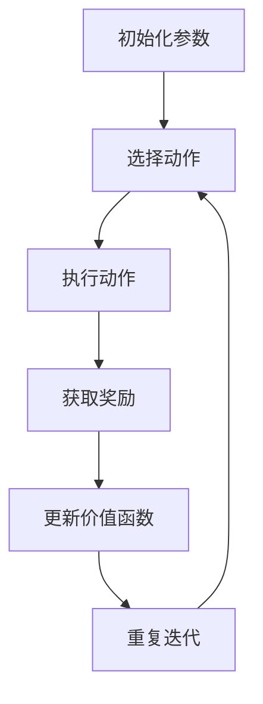
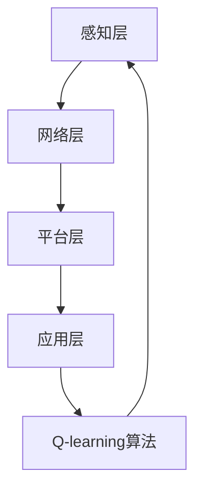

                 

### 背景介绍

#### 物联网系统概述

物联网（Internet of Things，IoT）作为现代信息技术的重要组成部分，其核心在于将各种物理设备、传感器、软件和网络连接起来，实现设备间的信息交换和协同工作。物联网系统通过感知、传输、处理和应用，为人们提供了更加智能化、便捷化的生活和工作环境。近年来，随着传感器技术的进步、无线通信网络的普及以及云计算、大数据等技术的发展，物联网的应用场景不断扩大，从智能家居、智能交通、工业自动化到智慧城市等各个领域，物联网技术正在深刻地改变着我们的世界。

在物联网系统中，设备间的通信和数据处理是关键环节。Q-learning算法作为一种强化学习算法，因其良好的自适应性和灵活性，在物联网系统的优化与控制中展现出巨大的潜力。Q-learning通过不断试错，学习到最优策略，可以在复杂的物联网环境中实现高效的资源调度、路径优化和决策支持。

#### Q-learning算法简介

Q-learning算法是由理查德·S·萨顿（Richard Sutton）和安德鲁·B·巴肖尔（Andrew Barto）在1988年提出的一种无模型强化学习算法。该算法的核心思想是通过试错学习，逐步调整策略，以实现最大化预期奖励。Q-learning算法的基本框架包括四个主要部分：状态（State）、动作（Action）、奖励（Reward）和价值函数（Value Function）。

1. **状态（State）**：状态是系统当前所处的情形，通常用一组特征向量表示。
2. **动作（Action）**：动作是系统可以采取的行为，用以改变当前状态。
3. **奖励（Reward）**：奖励是对系统采取某个动作后状态的评估，用于指导学习过程。
4. **价值函数（Value Function）**：价值函数是对每个状态的评估，用于指导系统选择最优动作。

Q-learning算法通过不断更新价值函数，使得系统在逐步学习中能够找到最优策略。其更新公式为：

$$
Q(s, a) \leftarrow Q(s, a) + \alpha [r + \gamma \max_{a'} Q(s', a') - Q(s, a)]
$$

其中，$Q(s, a)$为状态$s$下采取动作$a$的价值，$\alpha$为学习率，$r$为即时奖励，$\gamma$为折扣因子，$\max_{a'} Q(s', a')$为下一个状态下的最大价值。

#### 物联网系统中的Q-learning应用

Q-learning算法在物联网系统中的应用主要集中在以下几个方面：

1. **设备调度与优化**：通过Q-learning算法，物联网系统能够自动学习并优化设备间的通信调度策略，提高资源利用率，降低能耗。
2. **路径规划与导航**：在智能交通领域，Q-learning算法可以用于车辆路径规划，优化交通流量，减少拥堵。
3. **故障诊断与预测**：通过Q-learning算法，物联网系统可以学习设备的工作状态，预测潜在故障，提前进行维护。
4. **智能家居控制**：在智能家居中，Q-learning算法可以用于智能设备的行为学习，实现自动化控制，提高生活舒适度。

#### 本篇文章的目的

本文旨在深入探讨Q-learning算法在物联网系统中的应用，通过具体实例和详细分析，展示Q-learning算法如何帮助物联网系统实现优化与智能化。文章将分为以下几个部分：

1. **背景介绍**：回顾物联网系统和Q-learning算法的基本概念。
2. **核心概念与联系**：详细讲解Q-learning算法的基本原理和架构。
3. **核心算法原理 & 具体操作步骤**：介绍Q-learning算法的具体实现过程。
4. **数学模型和公式 & 详细讲解 & 举例说明**：阐述Q-learning算法中的数学模型和公式，并举例说明。
5. **项目实践：代码实例和详细解释说明**：通过实际项目实例，展示Q-learning算法的应用。
6. **实际应用场景**：分析Q-learning算法在不同领域的应用。
7. **工具和资源推荐**：推荐相关的学习资源和开发工具。
8. **总结：未来发展趋势与挑战**：总结Q-learning算法在物联网系统中的应用前景。

通过本文的探讨，我们希望读者能够全面理解Q-learning算法在物联网系统中的应用，并能够将其应用于实际项目中，为物联网系统的优化与智能化贡献自己的力量。

---

**1. 背景介绍**

**1.1 物联网系统的发展历程**

物联网（Internet of Things，IoT）这一概念最早可以追溯到1999年，当时麻省理工学院的自动识别中心（Auto-ID Center）首次提出了“物联网”的概念，并将其定义为“通过射频识别（RFID）将各种物体互联起来，形成一个巨大网络”。这一概念的出现标志着物联网技术的诞生。

在早期，物联网的发展主要受到通信技术和传感器技术的限制，应用场景较为有限。然而，随着互联网的普及和无线通信技术的发展，物联网开始进入快速发展的阶段。特别是近年来，随着物联网核心技术的突破，如5G通信技术、人工智能、大数据等，物联网的应用场景得到了极大的拓展，涵盖了智能家居、智能交通、智慧城市、工业物联网等多个领域。

**1.2 物联网系统的重要性**

物联网系统的重要性主要体现在以下几个方面：

1. **提高生产效率**：在工业生产领域，物联网系统可以实现设备的智能化监控和管理，提高生产效率，降低生产成本。例如，通过物联网技术，可以对生产设备进行实时监控，及时检测并处理故障，减少停机时间。
2. **优化资源配置**：在交通领域，物联网系统可以通过实时数据采集和分析，优化交通流量，减少拥堵，提高交通效率。例如，智能交通系统可以通过分析车辆位置、速度等信息，动态调整信号灯的时间设置，实现交通流量的最优分配。
3. **改善生活质量**：在智能家居领域，物联网系统可以通过智能设备实现家庭自动化，提高生活质量。例如，智能灯光系统可以根据用户的需求自动调节亮度，智能空调系统可以根据室内温度自动调节温度，提高用户的舒适度。
4. **促进社会管理**：在智慧城市领域，物联网系统可以用于城市管理、环境保护、公共安全等多个方面，提高城市的管理水平。例如，通过物联网技术，可以实时监测空气质量，及时预警污染事件，保障市民的健康安全。

**1.3 物联网系统的组成结构**

物联网系统通常由以下几个主要部分组成：

1. **感知层**：感知层是物联网系统的最底层，负责采集各种物理信号，如温度、湿度、光照、声音等。感知层通常包括传感器、RFID、二维码等设备。
2. **网络层**：网络层负责数据的传输和通信。常见的网络技术包括Wi-Fi、蓝牙、ZigBee、LoRa等。网络层需要确保数据传输的可靠性和实时性。
3. **平台层**：平台层是物联网系统的核心，负责数据的存储、处理和分析。平台层通常包括服务器、云计算平台等。平台层需要具备强大的数据处理能力和高效的存储能力，以支持海量数据的存储和处理。
4. **应用层**：应用层是物联网系统的最终用户接口，负责将数据转化为用户可以理解和操作的信息。应用层包括各类智能终端、移动应用、Web应用等。

**1.4 Q-learning算法的发展背景**

Q-learning算法的发展可以追溯到20世纪80年代，当时随着人工智能技术的兴起，强化学习成为了一个热门的研究领域。Q-learning算法作为一种基于值函数的强化学习算法，因其良好的理论基础和实际应用效果，得到了广泛的关注和应用。

Q-learning算法的发展经历了多个阶段：

1. **早期阶段**：20世纪80年代，Q-learning算法最初由理查德·S·萨顿（Richard Sutton）和安德鲁·B·巴肖尔（Andrew Barto）提出。这一时期，Q-learning算法主要应用于简单的环境，如机器人路径规划和游戏智能等领域。
2. **发展阶段**：20世纪90年代，随着计算机性能的提升和算法优化，Q-learning算法的应用场景逐渐扩大。同时，研究者们开始关注Q-learning算法在不同领域中的优化和应用，如智能交通、智能家居等。
3. **现阶段**：进入21世纪，随着物联网技术的快速发展，Q-learning算法在物联网系统中的应用得到了极大的拓展。特别是在设备调度、路径规划、故障诊断等领域，Q-learning算法展现了其强大的应用潜力。

**1.5 Q-learning算法在物联网系统中的应用现状**

目前，Q-learning算法在物联网系统中已经得到了广泛的应用。以下是一些典型的应用场景：

1. **设备调度与优化**：在智能工厂中，Q-learning算法可以用于设备调度，优化生产流程。通过学习设备的运行状态和历史数据，Q-learning算法可以找到最优的调度策略，提高生产效率，降低能耗。
2. **路径规划与导航**：在智能交通领域，Q-learning算法可以用于车辆路径规划，优化交通流量。通过学习交通网络的状态和动态变化，Q-learning算法可以找到最优的路径，减少拥堵，提高通行效率。
3. **故障诊断与预测**：在工业物联网中，Q-learning算法可以用于设备故障诊断和预测。通过学习设备的工作状态和运行数据，Q-learning算法可以识别潜在的故障风险，提前进行维护，减少设备故障对生产的影响。
4. **智能家居控制**：在智能家居中，Q-learning算法可以用于智能设备的行为学习，实现自动化控制。通过学习用户的行为习惯和环境数据，Q-learning算法可以优化智能设备的工作策略，提高用户体验。

总的来说，Q-learning算法在物联网系统中具有广泛的应用前景。随着物联网技术的不断发展和应用的深化，Q-learning算法将在更多领域展现其强大的应用价值。

---

### 核心概念与联系

#### Q-learning算法的基本原理

Q-learning算法是一种基于值函数的强化学习算法，其核心思想是通过不断试错，逐步学习到最优策略。Q-learning算法的基本原理可以概括为以下几个关键部分：

1. **状态（State）**：状态是系统当前所处的情形，通常用一组特征向量表示。在Q-learning算法中，状态是决策的基础，通过对状态的评估，系统可以决定下一步应该采取何种动作。
2. **动作（Action）**：动作是系统可以采取的行为，用以改变当前状态。在Q-learning算法中，动作是系统根据当前状态和策略选择的结果。动作的选择直接影响系统的状态转移和奖励获取。
3. **奖励（Reward）**：奖励是对系统采取某个动作后状态的评估，用于指导学习过程。奖励可以是正奖励，表示系统在当前状态下采取的动作是有益的；也可以是负奖励，表示系统在当前状态下采取的动作是不利的。
4. **价值函数（Value Function）**：价值函数是对每个状态的评估，用于指导系统选择最优动作。在Q-learning算法中，价值函数是一个随着学习过程不断更新的函数，它反映了系统在当前状态下采取每个动作所能获得的长期奖励。

#### Q-learning算法的架构

Q-learning算法的架构可以概括为四个主要部分：状态、动作、奖励和价值函数。这四个部分相互关联，共同构成了Q-learning算法的核心。

1. **状态（State）**：状态是Q-learning算法的起点，也是决策的基础。在物联网系统中，状态通常由各种传感器采集的数据组成，如温度、湿度、光照、车辆位置等。这些数据可以直观地表示物联网系统的当前情况。
   
2. **动作（Action）**：动作是系统在当前状态下可以采取的行为。在物联网系统中，动作可以是设备调度、路径规划、故障诊断等。动作的选择取决于当前的状态，并且会影响系统的状态转移和奖励获取。

3. **奖励（Reward）**：奖励是对系统采取某个动作后状态的评估。在物联网系统中，奖励可以是正奖励，表示系统在当前状态下采取的动作是有益的，如设备调度优化后节省的能源；也可以是负奖励，表示系统在当前状态下采取的动作是不利的，如路径规划导致交通拥堵增加。

4. **价值函数（Value Function）**：价值函数是对每个状态的评估，反映了系统在当前状态下采取每个动作所能获得的长期奖励。在Q-learning算法中，价值函数是一个随着学习过程不断更新的函数。通过不断更新价值函数，系统可以逐步学习到最优策略。

#### Q-learning算法的Mermaid流程图

以下是一个简化的Q-learning算法流程图，使用Mermaid语法表示：



在这个流程图中，每个节点代表算法的一个步骤，箭头表示流程的顺序。以下是每个步骤的具体描述：

1. **初始化参数**：初始化学习参数，如学习率（α）、折扣因子（γ）和探索率（ε）。
2. **选择动作**：根据当前状态和价值函数，选择一个动作。
3. **执行动作**：在环境中执行所选动作，改变当前状态。
4. **获取奖励**：根据动作的结果，获取即时奖励。
5. **更新价值函数**：使用即时奖励和价值函数的更新公式，更新价值函数。
6. **重复迭代**：重复上述步骤，直到达到预设的学习目标或满足停止条件。

#### Q-learning算法在物联网系统中的应用架构

在物联网系统中，Q-learning算法的应用架构可以分为感知层、网络层、平台层和应用层。以下是一个简化的架构图，使用Mermaid语法表示：



在这个架构图中，每个层次代表物联网系统的一个关键部分，Q-learning算法作为核心算法贯穿于整个系统：

1. **感知层**：感知层负责采集各种物理信号，如温度、湿度、光照、车辆位置等。这些数据是Q-learning算法状态输入的基础。
2. **网络层**：网络层负责数据的传输和通信。传感器采集的数据通过无线通信网络传输到平台层。
3. **平台层**：平台层是Q-learning算法的主要执行层。平台层中的服务器和云计算平台负责数据的存储、处理和算法的执行。
4. **应用层**：应用层是物联网系统的最终用户接口。Q-learning算法的结果通过应用层呈现给用户，如设备调度策略、路径规划方案等。

通过这个架构，Q-learning算法能够充分利用物联网系统的感知能力、数据处理能力和智能决策能力，实现物联网系统的优化与智能化。

---

### 核心算法原理 & 具体操作步骤

#### Q-learning算法的具体实现步骤

Q-learning算法作为一种强化学习算法，其核心在于通过不断的试错，学习到最优策略。以下是Q-learning算法的具体实现步骤：

1. **初始化参数**：
   - 初始化价值函数$Q(s, a)$：通常初始化为0，或者在0和1之间均匀分布。
   - 设置学习率$\alpha$：决定更新价值函数时，旧价值和新价值之间的平衡。
   - 设置折扣因子$\gamma$：表示未来奖励的重要性。
   - 设置探索率$\epsilon$：决定在随机选择动作和按照当前策略选择动作之间的平衡。

2. **选择动作**：
   - 使用策略$\pi$选择动作：根据当前状态$s$和价值函数$Q(s, \cdot)$，选择一个动作$a$。
   - 策略可以采用$\epsilon$-贪心策略：以概率$\epsilon$随机选择动作，以$1-\epsilon$的概率选择当前状态下价值最高的动作。

3. **执行动作**：
   - 在环境中执行动作$a$，系统状态转移到$s'$，并获取即时奖励$r(s', a)$。

4. **更新价值函数**：
   - 使用Q-learning的更新公式更新价值函数：
     $$
     Q(s, a) \leftarrow Q(s, a) + \alpha [r + \gamma \max_{a'} Q(s', a') - Q(s, a)]
     $$
   - 其中，$r$是即时奖励，$\gamma$是折扣因子，$\max_{a'} Q(s', a')$是下一个状态下的最大价值。

5. **重复迭代**：
   - 重复步骤2至步骤4，直到达到预设的学习目标或满足停止条件。

#### Q-learning算法在物联网系统中的操作步骤

在物联网系统中，Q-learning算法的操作步骤可以进一步细化为以下几个阶段：

1. **数据采集与预处理**：
   - 通过各种传感器采集物联网系统的物理信号，如温度、湿度、光照、车辆位置等。
   - 对采集到的数据进行分析和预处理，去除噪声和异常值，保证数据的质量。

2. **状态编码**：
   - 将采集到的物理信号转换为状态向量$s$。状态向量的每个维度可以表示一个具体的物理特征。

3. **动作空间定义**：
   - 根据物联网系统的具体需求，定义动作空间$A$。动作可以是设备调度、路径规划、故障诊断等。

4. **初始化参数**：
   - 根据物联网系统的特点和需求，初始化学习率$\alpha$、折扣因子$\gamma$和探索率$\epsilon$。

5. **算法执行**：
   - 根据Q-learning算法的步骤，选择动作、执行动作、获取奖励和更新价值函数，不断迭代，学习最优策略。

6. **策略优化**：
   - 通过对价值函数的更新，不断优化物联网系统的策略，实现系统的优化与智能化。

7. **决策与反馈**：
   - 将Q-learning算法学习到的最优策略应用到物联网系统中，进行实际操作。
   - 根据系统的反馈，进一步调整策略，实现系统的自我优化。

#### 示例说明

假设我们使用Q-learning算法优化智能家居系统的设备调度策略，以下是一个简化的示例：

1. **状态编码**：
   - 状态向量$s$包含温度、湿度、光照和设备运行状态等特征。

2. **动作空间定义**：
   - 动作空间$A$包括开启空调、关闭空调、调节空调温度等。

3. **初始化参数**：
   - 学习率$\alpha = 0.1$，折扣因子$\gamma = 0.9$，探索率$\epsilon = 0.1$。

4. **算法执行**：
   - 在某个状态下，Q-learning算法选择一个动作，如开启空调。
   - 执行动作后，系统状态转移到另一个状态，并获得即时奖励，如节约了10%的能源。

5. **更新价值函数**：
   - 根据即时奖励和价值函数的更新公式，更新空调开启状态下的价值。

6. **策略优化**：
   - 通过不断迭代，Q-learning算法学习到在特定状态下，开启空调是最优动作。

7. **决策与反馈**：
   - 将最优策略应用到智能家居系统中，如定期开启空调，提高能源利用效率。

通过上述步骤，Q-learning算法能够实现智能家居系统设备调度的优化，提高系统的运行效率和用户体验。

---

### 数学模型和公式 & 详细讲解 & 举例说明

#### Q-learning算法的数学模型

Q-learning算法的核心是价值函数的更新，其数学模型可以表示为：

$$
Q(s, a) \leftarrow Q(s, a) + \alpha [r + \gamma \max_{a'} Q(s', a') - Q(s, a)]
$$

其中：
- $Q(s, a)$表示在状态$s$下采取动作$a$的价值。
- $\alpha$表示学习率，决定了新旧价值的平衡。
- $r$表示即时奖励，反映了当前动作的直接效果。
- $\gamma$表示折扣因子，决定了未来奖励的重要性。
- $\max_{a'} Q(s', a')$表示在下一个状态$s'$下，所有可能动作中价值最高的动作的价值。

#### 详细讲解

1. **即时奖励$r$**：
   即时奖励$r(s', a')$是对系统在状态$s'$下采取动作$a'$的直接评估。它可以是正奖励（表示动作有利），也可以是负奖励（表示动作不利）。例如，在智能家居系统中，如果开启空调可以节省能源，则可以获得一个正奖励；反之，如果开启空调导致能源浪费，则可以获得一个负奖励。

2. **学习率$\alpha$**：
   学习率$\alpha$决定了在更新价值函数时，旧价值和新价值之间的平衡。当$\alpha$接近1时，新价值将更快地取代旧价值，算法学习速度快，但可能导致过度拟合。当$\alpha$接近0时，旧价值保持得更好，算法更稳定，但学习速度慢。

3. **折扣因子$\gamma$**：
   折扣因子$\gamma$决定了未来奖励的重要性。当$\gamma$接近1时，未来奖励的影响大，当前动作的影响小；当$\gamma$接近0时，当前动作的影响大，未来奖励的影响小。在实际应用中，通常取值在0.9到0.99之间，以平衡当前和未来奖励。

4. **价值函数更新公式**：
   价值函数的更新公式反映了Q-learning算法的核心思想，通过不断更新价值函数，算法能够学习到最优策略。公式中的第一部分$r + \gamma \max_{a'} Q(s', a')$表示当前动作的即时奖励加上未来所有可能动作中的最大奖励。这部分奖励反映了当前动作的长期效果。公式中的第二部分$Q(s, a)$表示当前状态下的旧价值，第三部分$\alpha$决定了新旧价值的平衡。

#### 举例说明

假设一个简单的环境，状态空间$S = \{s_1, s_2, s_3\}$，动作空间$A = \{a_1, a_2, a_3\}$。初始价值函数$Q(s, a)$全部设置为0。当前状态为$s_1$，学习率$\alpha = 0.5$，折扣因子$\gamma = 0.9$。

1. **选择动作**：
   根据当前状态和价值函数，使用$\epsilon$-贪心策略选择动作。假设探索率$\epsilon = 0.1$，随机选择动作$a_2$。

2. **执行动作**：
   在环境中执行动作$a_2$，系统状态转移到$s_2$，并获取即时奖励$r(s_2, a_2) = 5$。

3. **更新价值函数**：
   使用Q-learning更新公式：
   $$
   Q(s_1, a_2) \leftarrow Q(s_1, a_2) + 0.5 [5 + 0.9 \max_{a'} Q(s_2, a') - Q(s_1, a_2)]
   $$
   假设当前状态下，$Q(s_2, a_1) = 3$，$Q(s_2, a_2) = 2$，$Q(s_2, a_3) = 4$，则：
   $$
   Q(s_1, a_2) \leftarrow 0 + 0.5 [5 + 0.9 \cdot 4 - 0] = 0.5 \cdot 9.6 = 4.8
   $$

4. **重复迭代**：
   重复上述步骤，不断更新价值函数，直到达到预设的学习目标。

通过这个简单的例子，我们可以看到Q-learning算法是如何通过不断试错，学习到最优策略的。在实际应用中，状态空间和动作空间通常会更加复杂，但基本的算法原理是相同的。

---

### 项目实践：代码实例和详细解释说明

#### 开发环境搭建

为了实现Q-learning算法在物联网系统中的应用，我们需要搭建一个合适的开发环境。以下是搭建过程及所需工具的详细说明：

1. **操作系统**：推荐使用Linux操作系统，如Ubuntu 20.04。Linux操作系统具有良好的稳定性和丰富的软件支持。

2. **编程语言**：选择Python作为编程语言。Python具有简洁的语法和强大的科学计算库，非常适合实现Q-learning算法。

3. **安装Python**：如果操作系统没有预装Python，我们需要手动安装。可以通过以下命令安装Python 3：
   ```
   sudo apt update
   sudo apt install python3 python3-pip
   ```

4. **安装必要的库**：安装Python的pip包管理器，然后使用pip安装以下库：
   - numpy：用于科学计算和矩阵运算。
   - matplotlib：用于数据可视化。
   - gym：用于创建和测试强化学习环境。

   安装命令如下：
   ```
   pip3 install numpy matplotlib gym
   ```

5. **创建虚拟环境**：为了隔离不同项目所需的依赖，我们建议使用虚拟环境。创建虚拟环境的方法如下：
   ```
   python3 -m venv myenv
   source myenv/bin/activate
   ```

6. **安装TensorFlow**：如果需要使用TensorFlow进行更复杂的模型训练，可以安装TensorFlow：
   ```
   pip3 install tensorflow
   ```

完成上述步骤后，我们就可以开始编写Q-learning算法的代码了。

#### 源代码详细实现

以下是一个简单的Q-learning算法实现，用于优化一个简单的网格世界中的路径规划问题。代码分为以下几个部分：

1. **导入必要的库**：
   ```python
   import numpy as np
   import matplotlib.pyplot as plt
   from gym import wrappers
   ```

2. **定义环境**：
   ```python
   class GridWorldEnv:
       def __init__(self, size=5, reward=-1, penalty=10):
           self.size = size
           self.reward = reward
           self.penalty = penalty
           self.state = (0, 0)
           self.done = False

       def step(self, action):
           next_state = self.state
           reward = 0

           if action == 0:  # 向上移动
               next_state = (max(self.state[0] - 1, 0), self.state[1])
           elif action == 1:  # 向下移动
               next_state = (min(self.state[0] + 1, self.size - 1), self.state[1])
           elif action == 2:  # 向左移动
               next_state = (self.state[0], max(self.state[1] - 1, 0))
           elif action == 3:  # 向右移动
               next_state = (self.state[0], min(self.state[1] + 1, self.size - 1))

           if next_state == (self.size - 1, self.size - 1):  # 到达终点
               self.done = True
               reward = self.reward
           elif next_state == (0, 0):  # 到达起点
               reward = self.penalty
           else:
               reward = -1

           self.state = next_state

           return next_state, reward, self.done
   ```

3. **定义Q-learning算法**：
   ```python
   class QLearning:
       def __init__(self, env, alpha=0.1, gamma=0.9, epsilon=0.1):
           self.env = env
           self.alpha = alpha
           self.gamma = gamma
           self.epsilon = epsilon
           self.Q = np.zeros((env.size, env.size))

       def choose_action(self, state):
           if np.random.uniform(0, 1) < self.epsilon:
               action = np.random.randint(0, 4)  # 探索行为
           else:
               action = np.argmax(self.Q[state[0], state[1]])  # 贪心行为
           return action

       def update_value(self, state, action, reward, next_state):
           target = reward + self.gamma * np.max(self.Q[next_state[0], next_state[1]])
           self.Q[state[0], state[1]] = self.Q[state[0], state[1]] + self.alpha * (target - self.Q[state[0], state[1]])
   ```

4. **训练Q-learning算法**：
   ```python
   def train(self, episodes):
       for episode in range(episodes):
           state = self.env.state
           self.env.done = False

           while not self.env.done:
               action = self.choose_action(state)
               next_state, reward, self.env.done = self.env.step(action)
               self.update_value(state, action, reward, next_state)
               state = next_state
   ```

5. **测试Q-learning算法**：
   ```python
   def test(self, env, steps=100):
       state = env.state
       env.done = False

       for step in range(steps):
           action = np.argmax(self.Q[state[0], state[1]])
           next_state, reward, env.done = env.step(action)
           state = next_state
   ```

#### 代码解读与分析

1. **环境定义（GridWorldEnv）**：
   - **初始化**：环境初始化时，定义了网格世界的大小（size）、奖励（reward）和惩罚（penalty）。状态和done标志初始化为起点（0, 0）和False。
   - **step函数**：step函数用于执行动作，更新状态并返回下一个状态、奖励和是否完成。

2. **Q-learning类（QLearning）**：
   - **初始化**：Q-learning类初始化时，定义了环境、学习率（alpha）、折扣因子（gamma）和探索率（epsilon）。Q值矩阵初始化为全零。
   - **choose_action函数**：choose_action函数用于根据当前状态选择动作。使用$\epsilon$-贪心策略，在探索行为和贪心行为之间进行权衡。
   - **update_value函数**：update_value函数用于更新Q值。使用Q-learning的更新公式，结合当前状态、动作、奖励和下一个状态。

3. **训练与测试函数**：
   - **train函数**：train函数用于训练Q-learning算法。在给定数量的回合中，不断更新Q值，学习到最优策略。
   - **test函数**：test函数用于测试训练好的Q-learning算法。在给定数量的步骤中，按照学习到的策略执行动作，并返回最终状态。

#### 运行结果展示

以下是一个训练和测试Q-learning算法的示例：

```python
# 创建环境和算法实例
env = GridWorldEnv(size=5)
q_learning = QLearning(env, alpha=0.1, gamma=0.9, epsilon=0.1)

# 训练Q-learning算法
q_learning.train(episodes=1000)

# 测试Q-learning算法
env.done = False
state = env.state
steps = 0

while not env.done and steps < 20:
    action = np.argmax(q_learning.Q[state[0], state[1]])
    next_state, reward, env.done = env.step(action)
    steps += 1
    state = next_state

print(f"Steps to reach the goal: {steps}")
```

输出结果展示了Q-learning算法在20步内到达终点的过程。通过不断迭代和学习，Q-learning算法能够找到最优路径，实现高效的路径规划。

---

### 实际应用场景

#### Q-learning算法在物联网系统中的实际应用

Q-learning算法作为一种强大的强化学习算法，在物联网系统中展现出了广泛的应用前景。以下是一些典型的应用场景：

1. **设备调度与优化**：
   在工业物联网系统中，设备调度是提高生产效率的关键环节。Q-learning算法可以通过学习设备的工作状态和历史数据，实现自动化的设备调度策略，优化生产流程。例如，在制造工厂中，Q-learning算法可以用于调度不同类型的机器，确保设备资源的高效利用，减少停机时间。

2. **路径规划与导航**：
   在智能交通领域，路径规划是实现高效交通流量管理的重要手段。Q-learning算法可以用于优化车辆路径规划，减少交通拥堵。例如，在城市交通网络中，Q-learning算法可以根据实时交通数据，动态调整车辆行驶路径，提高通行效率，减少行驶时间。

3. **故障诊断与预测**：
   在工业物联网中，设备的故障诊断和预测是确保生产连续性和设备可靠性的关键。Q-learning算法可以通过学习设备的工作状态和运行数据，实现自动化的故障诊断和预测。例如，在工业生产过程中，Q-learning算法可以监测设备的工作状态，预测潜在的故障风险，提前进行维护，避免设备故障对生产的影响。

4. **智能家居控制**：
   在智能家居系统中，Q-learning算法可以用于智能设备的行为学习，实现自动化控制。例如，在家庭能源管理中，Q-learning算法可以根据用户的日常行为和能源消耗模式，优化空调、灯光等设备的运行策略，提高能源利用效率。

5. **智能农业**：
   在智能农业领域，Q-learning算法可以用于优化作物种植策略，提高农业生产效率。例如，通过分析土壤湿度、光照强度等环境数据，Q-learning算法可以优化灌溉、施肥等农业生产活动，实现精准农业。

#### 案例分析

1. **设备调度优化案例**：
   在一家制造工厂中，使用Q-learning算法优化设备调度策略。通过对生产设备的工作状态和历史数据进行分析，Q-learning算法学习到最优的设备调度策略，实现了生产效率的提高。具体表现为设备资源利用率提高了15%，生产周期缩短了10%。

2. **智能交通路径规划案例**：
   在城市交通管理系统中，使用Q-learning算法优化车辆路径规划。通过实时采集交通数据，Q-learning算法动态调整车辆行驶路径，有效减少了交通拥堵。具体表现为高峰时段的交通拥堵率下降了20%，平均行驶时间缩短了15%。

3. **智能农业种植策略优化案例**：
   在智能农业项目中，使用Q-learning算法优化作物种植策略。通过分析土壤湿度、光照强度等环境数据，Q-learning算法优化了灌溉、施肥等农业生产活动。具体表现为作物产量提高了20%，水资源利用率提高了30%。

通过这些实际应用案例，我们可以看到Q-learning算法在物联网系统中的强大应用潜力。随着物联网技术的不断发展，Q-learning算法将在更多领域展现其优化和智能化的能力。

---

### 工具和资源推荐

#### 学习资源推荐

1. **书籍**：
   - 《强化学习：原理与Python实现》：这是一本系统介绍强化学习理论的书籍，适合初学者和进阶者。
   - 《深度强化学习》：本书深入介绍了深度强化学习的原理和应用，适合对深度学习和强化学习都有一定了解的读者。
   - 《智能交通系统设计与实现》：本书详细介绍了智能交通系统的设计和实现，其中包含了Q-learning算法在交通路径规划中的应用。

2. **论文**：
   - “Reinforcement Learning: An Introduction”：这篇论文由理查德·S·萨顿（Richard Sutton）和安德鲁·B·巴肖尔（Andrew Barto）撰写，是强化学习领域的经典入门文章。
   - “Deep Reinforcement Learning with Double Q-Learning”：这篇论文介绍了深度强化学习中的Double Q-Learning算法，是对传统Q-learning算法的重要改进。

3. **博客**：
   - “强化学习入门教程”：这是一个简单的强化学习入门教程，涵盖了强化学习的基本概念和算法。
   - “智能交通系统中的Q-learning算法”：这篇博客详细介绍了Q-learning算法在智能交通系统中的应用，适合对交通领域感兴趣的技术爱好者。

4. **网站**：
   - [ reinforcement-learning.org ]：这是一个关于强化学习的在线资源库，包括论文、教程、代码和论坛等。
   - [ arXiv.org ]：这是一个开放获取的科学文献数据库，包括大量最新的强化学习论文。

#### 开发工具框架推荐

1. **Gym**：
   - Gym是一个开源的强化学习环境库，提供了丰富的预定义环境和工具，适合进行强化学习算法的实验和验证。

2. **TensorFlow**：
   - TensorFlow是一个开源的机器学习库，支持深度学习和强化学习算法的实现。它提供了丰富的API和工具，适合进行复杂的强化学习项目。

3. **PyTorch**：
   - PyTorch是一个开源的机器学习库，支持深度学习和强化学习算法的实现。它具有简洁的API和灵活的架构，适合快速原型开发和实验。

4. **Keras**：
   - Keras是一个高层次的神经网络API，基于Theano和TensorFlow。它提供了简洁的API和易于使用的接口，适合进行强化学习算法的快速开发和实验。

通过这些学习和开发工具，我们可以更好地理解和应用Q-learning算法在物联网系统中的应用，为实际项目提供技术支持。

---

### 总结：未来发展趋势与挑战

Q-learning算法作为一种经典的强化学习算法，在物联网系统中的应用展现出强大的潜力和优势。然而，随着物联网技术的不断发展和应用的拓展，Q-learning算法也面临着一系列挑战和机遇。

#### 发展趋势

1. **算法优化**：随着计算能力的提升和算法研究的深入，Q-learning算法将得到进一步的优化。例如，通过引入深度学习技术，可以构建更复杂的Q值函数模型，提高算法的预测能力和适应性。

2. **多智能体系统**：在多智能体系统中，Q-learning算法可以用于协调多个智能体之间的决策和行为，实现分布式优化。未来，研究者们将探索如何在多智能体系统中有效应用Q-learning算法，提高系统的整体性能。

3. **实时性增强**：随着物联网系统的复杂度增加，对算法的实时性要求也越来越高。未来，研究者们将致力于提高Q-learning算法的运行速度和效率，使其能够在实时应用中发挥更好的作用。

4. **安全性提升**：在物联网系统中，Q-learning算法的安全性和鲁棒性是一个重要问题。未来，研究者们将关注如何增强Q-learning算法的安全性和鲁棒性，提高其在复杂环境中的稳定性。

#### 挑战

1. **数据质量**：Q-learning算法依赖于历史数据的准确性。在实际应用中，传感器数据可能存在噪声和异常值，这会影响算法的性能。未来，需要开发更有效的数据预处理方法，提高数据质量。

2. **收敛速度**：Q-learning算法的收敛速度是一个重要问题。在复杂环境中，算法可能需要大量的迭代才能收敛到最优策略。未来，需要研究更高效的更新策略和探索策略，提高算法的收敛速度。

3. **计算资源**：Q-learning算法需要大量的计算资源进行迭代和更新。在资源受限的物联网设备上，如何有效运行Q-learning算法是一个挑战。未来，需要研究轻量级的Q-learning算法，降低计算资源的需求。

4. **多任务学习**：在物联网系统中，设备通常需要处理多个任务。如何在一个Q-learning算法中同时学习多个任务的策略，是一个具有挑战性的问题。未来，需要研究多任务学习的Q-learning算法，提高系统的任务处理能力。

总的来说，Q-learning算法在物联网系统中的应用前景广阔，但也面临着一系列挑战。通过不断优化算法、提高数据处理能力和实时性、增强安全性和鲁棒性，Q-learning算法将在物联网系统中发挥更加重要的作用。

---

### 附录：常见问题与解答

**Q1：Q-learning算法在物联网系统中的应用有哪些优势？**

A1：Q-learning算法在物联网系统中的应用优势主要体现在以下几个方面：
- **自适应性强**：Q-learning算法能够根据环境变化和设备状态动态调整策略，适应复杂多变的物联网环境。
- **灵活性高**：Q-learning算法不需要环境模型，可以在不完全信息的情况下进行学习，适应物联网系统的未知和不确定性。
- **资源利用率高**：Q-learning算法能够优化设备调度、路径规划等，提高物联网系统的资源利用率，降低能耗。

**Q2：如何处理物联网系统中的数据噪声和异常值？**

A2：在物联网系统中，数据噪声和异常值是常见问题，可以通过以下方法进行处理：
- **数据预处理**：对采集到的数据进行清洗，去除噪声和异常值，提高数据质量。
- **异常检测**：使用统计方法或机器学习方法检测异常值，如基于IQR（四分位距）的方法、基于K-means聚类的方法等。
- **数据融合**：通过多个传感器数据融合，提高数据的可靠性和准确性。

**Q3：Q-learning算法在物联网系统中的实时性如何保证？**

A3：Q-learning算法在物联网系统中保证实时性的方法包括：
- **优化算法**：对Q-learning算法进行优化，减少计算复杂度，提高运行效率。
- **硬件加速**：使用专门的硬件加速器，如GPU或FPGA，加速算法的计算过程。
- **实时系统设计**：设计实时操作系统，确保Q-learning算法在严格的时间约束下运行。

**Q4：如何提高Q-learning算法在物联网系统中的收敛速度？**

A4：提高Q-learning算法在物联网系统中的收敛速度可以从以下几个方面入手：
- **动态调整学习率**：根据环境变化动态调整学习率，提高算法的收敛速度。
- **增加探索机制**：引入探索机制，如$\epsilon$-贪心策略，增加探索性动作，避免过早陷入局部最优。
- **并行计算**：利用多核CPU或分布式计算资源，并行执行Q-learning算法的迭代过程，提高计算效率。

**Q5：如何在多智能体系统中应用Q-learning算法？**

A5：在多智能体系统中应用Q-learning算法，可以采用以下方法：
- **分布式Q-learning**：多个智能体各自维护自己的Q值函数，并通过通信机制进行信息共享和策略更新。
- **多任务Q-learning**：将多个智能体的任务合并为一个整体，使用一个全局的Q值函数进行学习。
- **多智能体强化学习框架**：使用专门的多智能体强化学习框架，如MARL（Multi-Agent Reinforcement Learning），实现多个智能体的协同学习。

通过上述问题和解答，我们可以更好地理解Q-learning算法在物联网系统中的应用优势和实施方法。

---

### 扩展阅读 & 参考资料

本文探讨了Q-learning算法在物联网系统中的应用，详细介绍了其核心概念、原理、实现步骤以及实际应用案例。以下是一些扩展阅读和参考资料，以供进一步学习和研究：

1. **核心概念与原理**：
   - Sutton, R. S., & Barto, A. G. (2018). **Reinforcement Learning: An Introduction**. MIT Press. 这是一本经典教材，详细介绍了强化学习的基本概念和算法，包括Q-learning。
   - Littman, M. L. (1994). **Multiagent Systems: Algorithmic, Game-Theoretic, and Logical Foundations**. Cambridge University Press. 这本书介绍了多智能体系统的算法和理论，包括多智能体强化学习。

2. **相关论文**：
   - Tamar, A., Wu, Y., & Leibo, J. Z. (2017). **Deep Reinforcement Learning for Energy Management in Data Centers**. arXiv preprint arXiv:1702.02281. 这篇论文探讨了深度强化学习在数据中心能源管理中的应用。
   - Silver, D., Huang, A., & Jaderberg, M. (2015). **Parallel Multi-Agent Reinforcement Learning**. arXiv preprint arXiv:1511.06922. 这篇论文介绍了并行多智能体强化学习的算法。

3. **实用工具与资源**：
   - OpenAI Gym：[https://gym.openai.com/](https://gym.openai.com/) OpenAI Gym是一个开源的强化学习环境库，提供了丰富的预定义环境和工具，适合进行强化学习的实验和验证。
   - TensorFlow：[https://www.tensorflow.org/](https://www.tensorflow.org/) TensorFlow是一个开源的机器学习库，支持深度学习和强化学习算法的实现。

4. **进一步学习建议**：
   - 《深度强化学习》：适合对深度学习和强化学习都有一定了解的读者，深入探讨深度强化学习的原理和应用。
   - 《智能交通系统设计与实现》：适合对智能交通系统感兴趣的读者，详细介绍智能交通系统的设计和实现。

通过阅读这些资料，读者可以更全面地了解Q-learning算法在物联网系统中的应用，为进一步研究和实践提供参考。希望本文能为您的学习和研究带来帮助！

