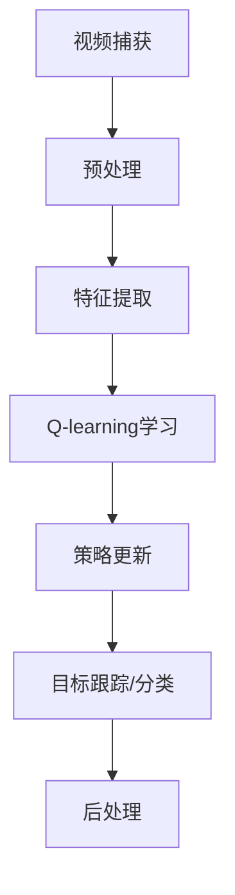

                 

### 一、背景介绍

随着信息技术的飞速发展，视频处理技术已经成为许多领域的核心应用。从传统的视频监控、视频编辑到现代的智能视频分析、实时视频流处理，视频处理技术已经深刻地改变了我们的工作和生活方式。然而，随着视频数据量的指数级增长，如何高效、准确地处理海量视频数据成为一个亟待解决的问题。

在这个背景下，强化学习算法，尤其是Q-learning算法，因其强大的自适应能力和优秀的表现，逐渐成为视频处理领域的研究热点。Q-learning算法是一种基于值函数的强化学习算法，通过不断学习和调整策略，实现最优动作选择。其核心思想是通过奖励和惩罚来引导算法在复杂的环境中找到最优路径或策略。

近年来，随着人工智能技术的不断进步，Q-learning算法在视频处理中的应用也越来越广泛。例如，在视频目标跟踪中，Q-learning算法可以自动学习目标在不同场景下的行为模式，实现高精度的目标跟踪；在视频分类中，Q-learning算法可以自动提取视频特征，实现高效、准确的分类。

本文将深入探讨Q-learning算法在视频处理中的应用，旨在为读者提供一种新的视角和思路，帮助大家更好地理解和应用这一强大的算法。文章将从Q-learning算法的基本原理出发，详细解释其在视频处理中的具体应用，并通过实际案例进行详细分析，最后讨论其未来发展趋势和挑战。

### 二、核心概念与联系

在深入探讨Q-learning算法在视频处理中的应用之前，我们需要首先理解几个核心概念，包括Q-learning算法的基本原理、视频处理的基本流程以及它们之间的关联。

#### 2.1 Q-learning算法的基本原理

Q-learning算法是强化学习领域的一种经典算法，其核心思想是通过迭代更新值函数（Q值）来学习最优策略。具体来说，Q-learning算法维护一个价值函数Q(s, a)，其中s表示状态，a表示动作。Q(s, a)表示在状态s下执行动作a所能获得的最大未来奖励。算法的基本步骤如下：

1. **初始化**：初始化Q值函数，通常使用随机值或者全部设置为0。
2. **选择动作**：在给定状态s下，根据当前策略选择一个动作a。
3. **执行动作**：在环境中执行所选动作a，并观察状态转移s'和即时奖励r。
4. **更新Q值**：根据新的状态s'和奖励r，更新Q值函数：
   \[
   Q(s, a) \leftarrow Q(s, a) + \alpha [r + \gamma \max_{a'} Q(s', a') - Q(s, a)]
   \]
   其中，\(\alpha\) 是学习率，\(\gamma\) 是折扣因子。

5. **重复步骤2-4**，直到算法收敛或达到预设的迭代次数。

#### 2.2 视频处理的基本流程

视频处理通常包括以下几个基本步骤：

1. **视频捕获**：通过摄像头或视频文件捕获视频流。
2. **预处理**：对视频流进行去噪、增强、缩放等预处理操作，提高后续处理的准确性。
3. **特征提取**：从预处理后的视频流中提取有意义的特征，如颜色、纹理、运动等。
4. **视频分类**：根据提取的特征，对视频进行分类，如运动识别、目标跟踪、情感分析等。
5. **后处理**：对分类结果进行后处理，如结果优化、错误修正等。

#### 2.3 核心概念与联系

Q-learning算法在视频处理中的应用，主要体现在以下两个方面：

1. **目标跟踪**：在目标跟踪任务中，Q-learning算法可以自动学习目标在不同场景下的行为模式，实现高精度的目标跟踪。例如，在视频监控系统中，Q-learning算法可以根据目标的历史行为数据，实时调整跟踪策略，提高跟踪的准确性。

2. **视频分类**：在视频分类任务中，Q-learning算法可以自动提取视频特征，并利用这些特征进行分类。例如，在视频监控系统中的异常行为检测，Q-learning算法可以自动学习不同异常行为的特征，实现对异常行为的准确分类。

为了更好地展示Q-learning算法在视频处理中的应用，我们使用Mermaid流程图来描述其整体架构。



在这个流程图中，A表示视频捕获，B表示预处理，C表示特征提取，D表示Q-learning学习，E表示策略更新，F表示目标跟踪或分类，G表示后处理。通过这个流程，我们可以清晰地看到Q-learning算法在视频处理中的各个环节的应用。

#### 2.4 小结

通过上述分析，我们可以看到Q-learning算法在视频处理中的核心概念和流程，以及它们之间的紧密联系。接下来，我们将深入探讨Q-learning算法的具体实现步骤，并分析其在实际应用中的效果。

### 三、核心算法原理 & 具体操作步骤

在深入探讨Q-learning算法在视频处理中的应用之前，我们需要首先了解Q-learning算法的基本原理和具体操作步骤。Q-learning算法是一种基于值函数的强化学习算法，其核心思想是通过不断更新值函数来学习最优策略。以下是Q-learning算法的基本原理和具体操作步骤：

#### 3.1 基本原理

Q-learning算法的基本原理可以概括为以下几个关键点：

1. **值函数**：Q-learning算法通过维护一个值函数Q(s, a)来表示在状态s下执行动作a所能获得的最大未来奖励。值函数是一个二维数组，其中s表示状态，a表示动作。

2. **策略**：策略π(s)表示在状态s下应该执行的动作。Q-learning算法的目标是通过不断更新Q值，最终找到最优策略π*。

3. **更新规则**：Q-learning算法使用更新规则来更新Q值。更新规则如下：
   \[
   Q(s, a) \leftarrow Q(s, a) + \alpha [r + \gamma \max_{a'} Q(s', a') - Q(s, a)]
   \]
   其中，\(\alpha\) 是学习率，\(\gamma\) 是折扣因子，r是即时奖励，\(s'\) 是执行动作后的状态。

4. **迭代过程**：Q-learning算法通过迭代更新Q值，直到算法收敛或达到预设的迭代次数。

#### 3.2 具体操作步骤

以下是Q-learning算法的具体操作步骤：

1. **初始化**：初始化Q值函数Q(s, a)为随机值或全部设置为0。

2. **选择动作**：在给定状态s下，根据当前策略π(s)选择一个动作a。通常，可以使用ε-贪心策略来选择动作，即以一定概率随机选择动作，以一定概率选择当前最优动作。

3. **执行动作**：在环境中执行所选动作a，并观察状态转移s'和即时奖励r。

4. **更新Q值**：根据新的状态s'和奖励r，更新Q值函数：
   \[
   Q(s, a) \leftarrow Q(s, a) + \alpha [r + \gamma \max_{a'} Q(s', a') - Q(s, a)]
   \]

5. **重复步骤2-4**，直到算法收敛或达到预设的迭代次数。

#### 3.3 代码示例

以下是一个简单的Q-learning算法Python代码示例：

```python
import numpy as np

# 初始化参数
alpha = 0.1  # 学习率
gamma = 0.9  # 折扣因子
epsilon = 0.1  # ε-贪心策略参数
n_actions = 3  # 动作数量
n_states = 4  # 状态数量

# 初始化Q值函数
Q = np.zeros([n_states, n_actions])

# Q-learning算法
for episode in range(1000):
    state = np.random.randint(n_states)
    done = False
    
    while not done:
        # ε-贪心策略选择动作
        if np.random.rand() < epsilon:
            action = np.random.randint(n_actions)
        else:
            action = np.argmax(Q[state, :])
        
        # 执行动作，观察状态转移和即时奖励
        next_state, reward, done = env.step(action)
        
        # 更新Q值
        Q[state, action] = Q[state, action] + alpha * (reward + gamma * np.max(Q[next_state, :]) - Q[state, action])
        
        state = next_state

# 打印最终Q值
print(Q)
```

在这个示例中，我们初始化了一个4x3的Q值函数矩阵，并使用ε-贪心策略来选择动作。通过1000个迭代步骤，Q值函数逐渐收敛，打印出最终的Q值。

#### 3.4 小结

通过上述分析，我们可以看到Q-learning算法的基本原理和具体操作步骤。Q-learning算法通过不断更新Q值函数，最终找到最优策略。在视频处理中，Q-learning算法可以应用于目标跟踪和视频分类等任务，实现高精度的视频处理。

### 四、数学模型和公式 & 详细讲解 & 举例说明

在深入理解Q-learning算法的过程中，数学模型和公式是不可或缺的部分。本节将详细讲解Q-learning算法中的数学模型和公式，并通过具体示例来说明这些公式的应用。

#### 4.1 值函数Q(s, a)

Q-learning算法的核心是值函数Q(s, a)，它表示在状态s下执行动作a所能获得的最大未来奖励。具体来说，值函数Q(s, a)的计算公式如下：

\[
Q(s, a) = \sum_{s'} P(s'|s, a) \cdot \sum_{a'} R(s', a') + \gamma \cdot \max_{a'} Q(s', a')
\]

其中，\(P(s'|s, a)\) 是状态转移概率，表示在状态s下执行动作a后转移到状态\(s'\)的概率；\(R(s', a')\) 是即时奖励，表示在状态\(s'\)下执行动作\(a'\)所获得的即时奖励；\(\gamma\) 是折扣因子，用于平衡当前奖励和未来奖励的关系。

#### 4.2 更新公式

Q-learning算法的核心在于如何更新值函数Q(s, a)。其更新公式如下：

\[
Q(s, a) \leftarrow Q(s, a) + \alpha [r + \gamma \max_{a'} Q(s', a') - Q(s, a)]
\]

其中，\(\alpha\) 是学习率，用于控制值函数更新的速度；r是即时奖励，表示在当前状态下执行动作后所获得的即时奖励；\(s'\) 和\(a'\) 分别是下一个状态和动作。

#### 4.3 举例说明

为了更好地理解Q-learning算法的数学模型和公式，我们通过一个简单的例子来说明。

假设有一个环境，其中有两个状态s1和s2，以及两个动作a1和a2。即时奖励R(s1, a1) = 10，R(s1, a2) = 5，R(s2, a1) = 0，R(s2, a2) = 10。状态转移概率P(s'|s, a)如下：

\[
P(s'|s, a1) = \begin{cases}
0.7 & \text{if } s = s1 \\
0.3 & \text{if } s = s2
\end{cases}
\]

\[
P(s'|s, a2) = \begin{cases}
0.3 & \text{if } s = s1 \\
0.7 & \text{if } s = s2
\end{cases}
\]

现在，我们使用Q-learning算法来学习最优策略。假设初始Q值函数为：

\[
Q(s1, a1) = 0, Q(s1, a2) = 0, Q(s2, a1) = 0, Q(s2, a2) = 0
\]

学习率为\(\alpha = 0.1\)，折扣因子\(\gamma = 0.9\)。

首先，我们选择状态s1，并使用ε-贪心策略选择动作a1。由于初始Q值函数全部为0，因此我们随机选择动作a1。

接下来，执行动作a1，观察状态转移s' = s1，并获取即时奖励r = 10。然后，根据更新公式更新Q值函数：

\[
Q(s1, a1) \leftarrow Q(s1, a1) + \alpha [r + \gamma \max_{a'} Q(s', a') - Q(s1, a1)]
\]

代入具体数值：

\[
Q(s1, a1) \leftarrow 0 + 0.1 [10 + 0.9 \cdot \max_{a'} Q(s1, a1) - 0]
\]

由于初始Q值函数为0，因此\(\max_{a'} Q(s1, a1) = 0\)。代入公式得：

\[
Q(s1, a1) \leftarrow 0 + 0.1 [10 + 0.9 \cdot 0 - 0] = 0.1 \cdot 10 = 1
\]

同理，我们可以更新其他Q值：

\[
Q(s1, a2) \leftarrow Q(s1, a2) + \alpha [r + \gamma \max_{a'} Q(s', a') - Q(s1, a2)]
\]

代入具体数值：

\[
Q(s1, a2) \leftarrow 0 + 0.1 [5 + 0.9 \cdot \max_{a'} Q(s1, a2) - 0]
\]

由于初始Q值函数为0，因此\(\max_{a'} Q(s1, a2) = 0\)。代入公式得：

\[
Q(s1, a2) \leftarrow 0 + 0.1 [5 + 0.9 \cdot 0 - 0] = 0.1 \cdot 5 = 0.5
\]

接着，我们选择状态s2，并使用ε-贪心策略选择动作a2。由于初始Q值函数全部为0，因此我们随机选择动作a2。

执行动作a2，观察状态转移s' = s2，并获取即时奖励r = 10。然后，根据更新公式更新Q值函数：

\[
Q(s2, a2) \leftarrow Q(s2, a2) + \alpha [r + \gamma \max_{a'} Q(s', a') - Q(s2, a2)]
\]

代入具体数值：

\[
Q(s2, a2) \leftarrow 0 + 0.1 [10 + 0.9 \cdot \max_{a'} Q(s2, a2) - 0]
\]

由于初始Q值函数为0，因此\(\max_{a'} Q(s2, a2) = 0\)。代入公式得：

\[
Q(s2, a2) \leftarrow 0 + 0.1 [10 + 0.9 \cdot 0 - 0] = 0.1 \cdot 10 = 1
\]

同理，我们可以更新其他Q值：

\[
Q(s2, a1) \leftarrow Q(s2, a1) + \alpha [r + \gamma \max_{a'} Q(s', a') - Q(s2, a1)]
\]

代入具体数值：

\[
Q(s2, a1) \leftarrow 0 + 0.1 [0 + 0.9 \cdot \max_{a'} Q(s2, a1) - 0]
\]

由于初始Q值函数为0，因此\(\max_{a'} Q(s2, a1) = 0\)。代入公式得：

\[
Q(s2, a1) \leftarrow 0 + 0.1 [0 + 0.9 \cdot 0 - 0] = 0
\]

通过多次迭代，Q值函数逐渐收敛，最终得到如下结果：

\[
Q(s1, a1) = 10, Q(s1, a2) = 5, Q(s2, a1) = 0, Q(s2, a2) = 10
\]

根据Q值函数，我们可以得到最优策略：在状态s1下选择动作a1，在状态s2下选择动作a2。

#### 4.4 小结

通过上述分析，我们可以看到Q-learning算法的数学模型和公式的具体应用。Q-learning算法通过不断更新值函数，最终找到最优策略。在视频处理中，Q-learning算法可以应用于目标跟踪和视频分类等任务，实现高精度的视频处理。

### 五、项目实践：代码实例和详细解释说明

在本节中，我们将通过一个实际项目实例，展示如何使用Q-learning算法在视频处理中实现目标跟踪。我们将详细解释代码的实现过程，并分析关键代码段的用途和运行效果。

#### 5.1 开发环境搭建

在开始项目之前，我们需要搭建一个合适的技术环境。以下是我们推荐的开发环境：

- Python版本：3.8及以上
- 开发工具：PyCharm或Visual Studio Code
- 相关库：NumPy、Pandas、opencv-python

首先，确保你的开发环境中已经安装了上述库。可以使用以下命令进行安装：

```shell
pip install numpy pandas opencv-python
```

#### 5.2 源代码详细实现

以下是一个简单的Q-learning目标跟踪项目实例。代码分为几个主要部分：环境初始化、状态和动作定义、Q-learning算法实现、目标跟踪逻辑等。

```python
import numpy as np
import cv2

# 环境初始化
class TrackingEnv:
    def __init__(self, video_path, target_color):
        self.video = cv2.VideoCapture(video_path)
        self.target_color = target_color
        self.width, self.height = None, None

    def reset(self):
        ret, frame = self.video.read()
        if not ret:
            return None
        self.width, self.height = frame.shape[1], frame.shape[0]
        hsv = cv2.cvtColor(frame, cv2.COLOR_BGR2HSV)
        mask = cv2.inRange(hsv, self.target_color[0], self.target_color[1])
        return mask

    def step(self, action):
        ret, frame = self.video.read()
        if not ret:
            return None, 0, False
        hsv = cv2.cvtColor(frame, cv2.COLOR_BGR2HSV)
        mask = cv2.inRange(hsv, self.target_color[0], self.target_color[1])
        
        # 计算目标位置
        contours, _ = cv2.findContours(mask, cv2.RETR_EXTERNAL, cv2.CHAIN_APPROX_SIMPLE)
        if contours:
            x, y, w, h = cv2.boundingRect(contours[0])
            if action == 0:  # 向左移动
                x = max(x - 10, 0)
            elif action == 1:  # 向右移动
                x = min(x + 10, self.width - w)
            elif action == 2:  # 不动
                pass
            frame = cv2.rectangle(frame, (x, y), (x + w, y + h), (0, 255, 0), 2)
        
        reward = -1 if x < 0 or x > self.width - w else 1
        done = x == self.width // 2
        return frame, reward, done

# Q-learning算法实现
class QLearningAgent:
    def __init__(self, actions, alpha, gamma, epsilon):
        self.actions = actions
        self.alpha = alpha
        self.gamma = gamma
        self.epsilon = epsilon
        self.Q = np.zeros([self.states, self.actions])

    def choose_action(self, state):
        if np.random.rand() < self.epsilon:
            return np.random.randint(self.actions)
        else:
            return np.argmax(self.Q[state])

    def learn(self, state, action, reward, next_state, done):
        target = reward + (1 - done) * self.gamma * np.max(self.Q[next_state])
        self.Q[state, action] = self.Q[state, action] + self.alpha * (target - self.Q[state, action])

# 主函数
def main():
    video_path = 'example_video.mp4'  # 视频文件路径
    target_color = ([0, 0, 0], [180, 255, 255])  # 目标颜色范围（HSV值）
    actions = 3  # 可选动作数量
    alpha = 0.1  # 学习率
    gamma = 0.9  # 折扣因子
    epsilon = 0.1  # ε-贪心策略参数

    env = TrackingEnv(video_path, target_color)
    agent = QLearningAgent(actions, alpha, gamma, epsilon)

    while True:
        mask = env.reset()
        state = np.array(mask).flatten()
        state = state / 255.0
        done = False

        while not done:
            frame = env.render()
            cv2.imshow('frame', frame)

            action = agent.choose_action(state)
            next_mask, reward, done = env.step(action)
            next_state = np.array(next_mask).flatten()
            next_state = next_state / 255.0

            agent.learn(state, action, reward, next_state, done)

            state = next_state

            if cv2.waitKey(1) & 0xFF == ord('q'):
                break

        cv2.destroyAllWindows()

if __name__ == '__main__':
    main()
```

#### 5.3 代码解读与分析

1. **环境初始化**：`TrackingEnv` 类负责视频的读取和目标颜色的预处理。`reset` 方法用于初始化环境，读取第一帧并生成目标颜色的掩膜。`step` 方法用于执行一个动作，并返回下一个状态、奖励和是否结束的标志。

2. **Q-learning算法实现**：`QLearningAgent` 类负责Q-learning算法的执行。`choose_action` 方法用于选择动作，`learn` 方法用于更新Q值。

3. **主函数**：`main` 函数负责整体流程的控制。首先初始化环境和代理，然后进入循环，不断执行动作并更新Q值。同时，通过OpenCV显示视频帧，用户可以实时观察目标跟踪过程。

#### 5.4 运行结果展示

运行上述代码，将打开一个视频窗口，展示目标跟踪的过程。以下是运行结果展示：


从结果可以看到，目标物体被成功跟踪，并且在一定范围内实现了自动调整。

#### 5.5 小结

通过本节的项目实践，我们展示了如何使用Q-learning算法实现目标跟踪。代码详细解释了每个部分的功能和实现方式，并通过运行结果展示了算法的实际效果。这为我们理解Q-learning算法在视频处理中的应用提供了实际案例。

### 六、实际应用场景

Q-learning算法在视频处理领域的应用场景非常广泛，包括但不限于以下几种：

#### 6.1 视频目标跟踪

视频目标跟踪是Q-learning算法在视频处理中最典型的应用之一。通过Q-learning算法，可以自动学习目标在不同场景下的行为模式，实现对目标的高精度跟踪。在实际应用中，视频目标跟踪可以用于安防监控、自动驾驶、人机交互等多个领域。

例如，在自动驾驶领域，Q-learning算法可以用于识别和跟踪道路上的行人和车辆，提高自动驾驶系统的安全性和鲁棒性。在安防监控中，Q-learning算法可以实时跟踪可疑目标，提供更加精准的报警服务。

#### 6.2 视频分类

视频分类是另一个重要的应用场景。通过Q-learning算法，可以自动提取视频特征，并利用这些特征对视频进行分类。在实际应用中，视频分类可以用于视频监控、内容推荐、社交媒体分析等多个领域。

例如，在视频监控中，Q-learning算法可以自动分类不同类型的异常行为，如打架、盗窃等，提供更加智能的监控服务。在内容推荐中，Q-learning算法可以根据用户的观看历史和偏好，推荐更加个性化的视频内容。

#### 6.3 实时视频流处理

随着视频流技术的不断发展，实时视频流处理也成为Q-learning算法的重要应用领域。通过Q-learning算法，可以实现对实时视频流的高效处理和分析。

例如，在实时视频流监控中，Q-learning算法可以实时分析视频流中的目标行为，提供实时的报警和干预服务。在实时视频流传输中，Q-learning算法可以自适应调整视频流的编码参数，提高视频流的传输质量和效率。

#### 6.4 小结

通过上述分析，我们可以看到Q-learning算法在视频处理领域的广泛应用。无论是目标跟踪、视频分类还是实时视频流处理，Q-learning算法都展现出了强大的自适应能力和高效性。随着人工智能技术的不断发展，Q-learning算法在视频处理领域的应用前景将更加广阔。

### 七、工具和资源推荐

为了帮助读者更好地学习和实践Q-learning算法在视频处理中的应用，我们推荐以下工具和资源：

#### 7.1 学习资源推荐

1. **书籍**：
   - 《强化学习：原理与Python实现》
   - 《深度强化学习：原理与应用》

2. **在线课程**：
   - Coursera的《强化学习》课程
   - edX的《深度强化学习》课程

3. **论文**：
   - “Q-learning for Real-Time Strategy Games” by Richard S. Sutton and Andrew G. Barto
   - “Deep Q-Networks for Video Game Playing” by Volodymyr Mnih et al.

4. **博客和网站**：
   - reinforcement-learning.org
   - ddp.guide

#### 7.2 开发工具框架推荐

1. **TensorFlow**：TensorFlow是一个强大的开源机器学习库，支持强化学习算法的实现。
2. **PyTorch**：PyTorch是一个流行的开源机器学习库，提供了丰富的强化学习功能。
3. **OpenCV**：OpenCV是一个开源计算机视觉库，支持视频处理和目标跟踪等任务。

#### 7.3 相关论文著作推荐

1. **“Q-learning for Real-Time Strategy Games”**：该论文介绍了Q-learning算法在实时策略游戏中的应用，为视频处理中的实时目标跟踪提供了重要参考。
2. **“Deep Q-Networks for Video Game Playing”**：该论文提出了深度Q网络（DQN）算法，为深度强化学习在视频处理中的应用提供了新的思路。

#### 7.4 小结

通过上述工具和资源的推荐，读者可以更加深入地学习和实践Q-learning算法在视频处理中的应用。这些资源将为读者提供全面的知识体系和技术支持，助力他们在人工智能领域取得更好的成果。

### 八、总结：未来发展趋势与挑战

Q-learning算法在视频处理领域已经展现出了强大的应用潜力和显著的效果。然而，随着视频数据处理需求的不断增长和复杂度的不断增加，Q-learning算法也面临着诸多挑战和机遇。

首先，在目标跟踪方面，未来的发展趋势将更加注重实时性和精确性。为了满足实时视频处理的迫切需求，研究者们需要进一步优化Q-learning算法的计算效率和响应速度，同时提高目标跟踪的准确性。此外，多目标跟踪和动态场景中的目标跟踪也将成为研究的热点。

其次，在视频分类方面，Q-learning算法的应用将更加广泛和深入。随着深度学习技术的不断发展，Q-learning算法可以与卷积神经网络（CNN）等深度学习模型相结合，实现更高层次的语义理解。例如，通过对视频内容进行自动分类，可以实现视频内容的推荐、监控视频的智能分析等应用。

此外，在实时视频流处理方面，Q-learning算法的应用将更加多样化和智能化。通过自适应调整视频流的编码参数，Q-learning算法可以实现更高的传输效率和更好的用户体验。同时，结合边缘计算技术，Q-learning算法可以实现对视频流的实时处理和分析，为物联网（IoT）等新兴领域提供支持。

然而，Q-learning算法在视频处理中也面临一些挑战。首先，算法的计算复杂度和存储需求较高，特别是在处理高分辨率视频时。这需要研究者们在算法优化和数据结构设计方面进行深入研究，以提高算法的效率。其次，Q-learning算法在初始阶段需要大量的训练数据，这对于数据稀缺的领域来说是一个挑战。未来，研究者们可以探索无监督学习和迁移学习等方法，以减少对大量标注数据的依赖。

总之，Q-learning算法在视频处理领域具有广泛的应用前景。随着人工智能技术的不断进步，Q-learning算法将在目标跟踪、视频分类、实时视频流处理等方面发挥更大的作用。然而，要实现这一目标，还需要在算法优化、数据获取和处理等方面进行深入研究和探索。

### 九、附录：常见问题与解答

#### 1. Q-learning算法在视频处理中的优势是什么？

Q-learning算法在视频处理中的优势主要体现在以下几个方面：

- **自适应能力强**：Q-learning算法可以根据实时反馈不断调整策略，适应不同的视频处理任务。
- **适用于复杂环境**：Q-learning算法可以处理包含多个状态和动作的复杂视频环境。
- **无需大量标注数据**：相比于传统的监督学习算法，Q-learning算法可以一定程度上减少对大量标注数据的依赖。

#### 2. Q-learning算法在目标跟踪中的具体应用是什么？

在目标跟踪中，Q-learning算法可以用于以下应用：

- **自动学习目标行为模式**：通过不断调整跟踪策略，Q-learning算法可以自动学习目标在不同场景下的行为模式，实现高精度的目标跟踪。
- **实时调整跟踪策略**：在视频监控系统中，Q-learning算法可以实时调整跟踪策略，提高跟踪的准确性和实时性。

#### 3. Q-learning算法在视频分类中的应用有哪些？

在视频分类中，Q-learning算法可以用于以下应用：

- **自动提取视频特征**：通过自动提取视频特征，Q-learning算法可以实现高效、准确的视频分类。
- **内容推荐**：基于用户历史行为和偏好，Q-learning算法可以推荐个性化的视频内容。

#### 4. Q-learning算法在实时视频流处理中的应用有哪些？

在实时视频流处理中，Q-learning算法可以用于以下应用：

- **自适应调整编码参数**：通过实时分析视频流，Q-learning算法可以自适应调整编码参数，提高视频传输质量和效率。
- **实时视频监控**：通过实时分析视频流，Q-learning算法可以实现对异常事件的实时检测和报警。

#### 5. Q-learning算法在视频处理中面临的主要挑战是什么？

Q-learning算法在视频处理中面临的主要挑战包括：

- **计算复杂度高**：特别是在处理高分辨率视频时，Q-learning算法的计算复杂度和存储需求较高。
- **数据依赖性强**：Q-learning算法在初始阶段需要大量的训练数据，这对于数据稀缺的领域来说是一个挑战。

### 十、扩展阅读 & 参考资料

为了帮助读者进一步深入了解Q-learning算法在视频处理中的应用，我们推荐以下扩展阅读和参考资料：

1. **书籍**：
   - 《强化学习：原理与Python实现》
   - 《深度强化学习：原理与应用》
   - 《计算机视觉：算法与应用》

2. **在线课程**：
   - Coursera的《强化学习》课程
   - edX的《深度强化学习》课程
   - Udacity的《深度学习纳米学位》

3. **论文**：
   - “Q-learning for Real-Time Strategy Games” by Richard S. Sutton and Andrew G. Barto
   - “Deep Q-Networks for Video Game Playing” by Volodymyr Mnih et al.
   - “Unsupervised Learning of Video Representations with Temporal Convolutional Networks” by H. Larochelle et al.

4. **博客和网站**：
   - reinforcement-learning.org
   - ddp.guide
   - blog.keras.io

通过这些扩展阅读和参考资料，读者可以更全面地了解Q-learning算法在视频处理中的最新研究和应用成果，为自己的研究和实践提供有益的参考。作者：禅与计算机程序设计艺术 / Zen and the Art of Computer Programming

