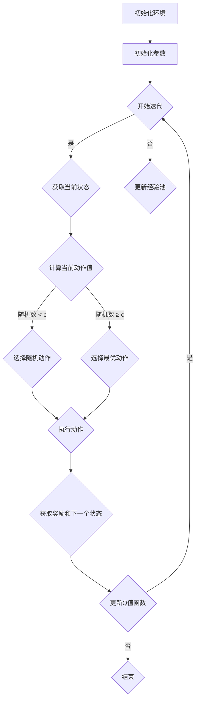

                 

### 一、背景介绍

深度强化学习（Deep Reinforcement Learning，DRL）作为机器学习和人工智能领域的一项重要研究方向，已经在自动驾驶、游戏、机器人等领域取得了显著成果。而在众多深度强化学习算法中，深度Q网络（Deep Q-Network，DQN）因其优异的性能和易用性，成为了学术界和工业界广泛采用的算法之一。

DQN的核心思想是利用深度神经网络来近似传统的Q值函数，从而在复杂的决策环境中进行学习。Q值函数在强化学习中起到关键作用，它代表了在某个状态下执行某个动作所能获得的累积奖励。然而，Q值函数的计算过程往往涉及到大量的状态和动作组合，这使得传统的方法难以在复杂环境中有效工作。

DQN通过引入深度神经网络来逼近Q值函数，从而简化了计算过程，并提高了学习效率。但与此同时，DQN在训练过程中也面临一个重要问题：如何平衡探索与利用。探索（Exploration）是指在未知环境中尝试新的动作，以获取更多关于环境的经验；而利用（Exploitation）是指根据已有经验选择当前最优动作，以最大化累积奖励。

为了解决这一问题，DQN引入了一种探索策略：ϵ-贪心算法。ϵ-贪心算法通过在每次决策时以一定的概率选择随机动作，从而使得学习过程具有一定的随机性，避免了陷入局部最优解。这一探索策略在DQN中起到了至关重要的作用，为后续的深度强化学习研究奠定了基础。

本文将围绕DQN中的探索策略：ϵ-贪心算法，深入剖析其原理、数学模型、实现方法以及实际应用。通过逐步分析，我们希望能够帮助读者全面理解这一策略在DQN中的作用和重要性。

### 二、核心概念与联系

在深入探讨DQN中的探索策略：ϵ-贪心算法之前，首先需要了解DQN的基本概念和原理。DQN的核心思想是利用深度神经网络来近似传统的Q值函数，从而在复杂的决策环境中进行学习。

#### 1. 深度Q网络（DQN）

深度Q网络（Deep Q-Network，DQN）是一种基于深度学习的强化学习算法。它由两部分组成：深度神经网络（Deep Neural Network，DNN）和Q值函数（Q-Function）。Q值函数代表了在某个状态下执行某个动作所能获得的累积奖励，它在强化学习中起到关键作用。

DQN通过训练深度神经网络来近似Q值函数，从而简化了计算过程，并提高了学习效率。在训练过程中，DQN会根据已有的经验不断更新神经网络的参数，以使Q值函数的预测结果更接近真实值。

#### 2. ϵ-贪心算法

为了在DQN中实现探索与利用的平衡，DQN引入了一种探索策略：ϵ-贪心算法。ϵ-贪心算法的基本思想是在每次决策时，以一定的概率选择随机动作（探索），以获取更多关于环境的经验；而在大多数情况下，选择根据现有经验预测的最优动作（利用）。

#### 3. Mermaid 流程图

为了更直观地展示DQN和ϵ-贪心算法的关系，我们使用Mermaid流程图进行描述。以下是DQN和ϵ-贪心算法的Mermaid流程图：



在上面的流程图中，A表示初始化环境，B表示初始化参数，C表示开始迭代。D表示获取当前状态，F表示计算当前动作值。根据计算结果，G表示选择随机动作，H表示选择最优动作。I表示执行动作，J表示获取奖励和下一个状态。K表示更新Q值函数。最后，L表示结束迭代。

通过这个流程图，我们可以清晰地看到DQN和ϵ-贪心算法之间的联系。DQN通过训练深度神经网络来近似Q值函数，并在每次决策时利用ϵ-贪心算法实现探索与利用的平衡。这个流程图为我们后续深入分析DQN和ϵ-贪心算法提供了直观的参考。

### 三、核心算法原理 & 具体操作步骤

#### 1. ϵ-贪心算法原理

ϵ-贪心算法是一种在决策过程中引入随机性的策略，以实现探索与利用的平衡。其基本思想是在每次决策时，以一定的概率选择随机动作（探索），以获取更多关于环境的经验；而在大多数情况下，选择根据现有经验预测的最优动作（利用）。

具体来说，ϵ-贪心算法包含两个关键参数：ϵ（探索概率）和Q值函数。探索概率ϵ决定了在每次决策时选择随机动作的概率。通常，随着训练过程的进行，探索概率会逐渐减小，以使系统更加依赖于已有经验进行决策。

Q值函数代表了在某个状态下执行某个动作所能获得的累积奖励。通过训练深度神经网络，我们可以近似Q值函数，从而简化计算过程，并提高学习效率。

#### 2. 具体操作步骤

下面我们详细讨论ϵ-贪心算法的具体操作步骤：

##### 步骤1：初始化参数

首先，我们需要初始化两个关键参数：探索概率ϵ和Q值函数。通常，探索概率ϵ的初始值设置为1，随着训练过程的进行，会逐渐减小。Q值函数可以通过初始化深度神经网络得到。

##### 步骤2：获取当前状态

在每次迭代开始时，我们需要获取当前状态。这个状态可以是环境中的任何信息，例如游戏画面、传感器数据等。具体获取方式取决于具体的应用场景。

##### 步骤3：计算当前动作值

根据当前状态，我们需要计算每个动作的Q值。这个计算过程可以通过训练好的深度神经网络来完成。具体来说，输入当前状态到深度神经网络中，得到每个动作的Q值预测。

##### 步骤4：选择动作

根据计算得到的动作值，我们需要选择下一步的动作。这里，我们引入了探索概率ϵ。以一定的概率选择随机动作（探索），以获取更多关于环境的经验；而在大多数情况下，选择根据现有经验预测的最优动作（利用）。

具体来说，我们可以使用以下公式来计算下一步的动作：

- 如果随机数 < ϵ，则选择随机动作。
- 如果随机数 ≥ ϵ，则选择根据现有经验预测的最优动作。

##### 步骤5：执行动作

根据选择的动作，我们在环境中执行相应的操作，并获得新的状态、奖励和其他相关信息。

##### 步骤6：更新Q值函数

根据新的状态、奖励和其他相关信息，我们需要更新Q值函数。这个更新过程可以通过训练深度神经网络来实现。具体来说，将新的经验（状态、动作、奖励、下一个状态）输入到深度神经网络中，通过反向传播算法更新网络参数。

##### 步骤7：重复迭代

重复上述步骤，直到达到预设的训练次数或满足其他停止条件。

#### 3. ϵ-贪心算法的数学模型

为了更深入地理解ϵ-贪心算法，我们可以从数学模型的角度进行分析。假设我们有一个状态空间S和动作空间A，每个状态s ∈ S和每个动作a ∈ A都有一个对应的Q值Q(s, a)。在每次决策时，我们需要根据当前状态和探索概率ϵ来选择动作。

具体来说，我们可以定义一个概率分布P(a|s)来表示在状态s下选择动作a的概率。这个概率分布可以通过以下公式计算：

P(a|s) = 
- ϵ / |A|，如果随机数 < ϵ
- 1 / |A| * argmax(Q(s, a))，如果随机数 ≥ ϵ

其中，|A|表示动作空间A的大小，argmax(Q(s, a))表示在状态s下Q值最大的动作。

通过这个概率分布，我们可以选择下一个动作：

- 如果随机数 < ϵ，则选择随机动作。
- 如果随机数 ≥ ϵ，则选择根据现有经验预测的最优动作。

这样，我们就可以在每次决策时实现探索与利用的平衡。

#### 4. ϵ-贪心算法的具体实现

在实际应用中，我们可以使用Python等编程语言来实现ϵ-贪心算法。以下是一个简单的实现示例：

```python
import numpy as np

# 初始化参数
epsilon = 1.0
epsilon_min = 0.01
epsilon_decay = 0.99

# 初始化Q值函数
Q = np.zeros((state_space_size, action_space_size))

# 获取当前状态
state = get_current_state()

# 计算当前动作值
action_values = Q[state]

# 计算随机数
random_number = np.random.random()

# 选择动作
if random_number < epsilon:
    action = np.random.choice(action_space)
else:
    action = np.argmax(action_values)

# 执行动作
next_state, reward, done = execute_action(action)

# 更新Q值函数
Q[state, action] = Q[state, action] + alpha * (reward + gamma * np.max(Q[next_state]) - Q[state, action])

# 更新探索概率
epsilon = max(epsilon_min, epsilon * epsilon_decay)

# 重复迭代
if not done:
    state = next_state
else:
    state = get_initial_state()
```

在这个示例中，我们首先初始化探索概率ϵ、最小探索概率epsilon\_min和衰减系数epsilon\_decay。然后，我们初始化Q值函数。在每次迭代中，我们首先获取当前状态，计算当前动作值。接着，根据随机数和探索概率，选择下一个动作。然后，执行动作，获取新的状态、奖励和其他相关信息。最后，更新Q值函数，并更新探索概率。重复这个过程，直到满足停止条件。

通过这个具体实现，我们可以看到ϵ-贪心算法在实际应用中的操作步骤和实现方法。

### 四、数学模型和公式 & 详细讲解 & 举例说明

在DQN中，探索策略的核心是ϵ-贪心算法，它通过在每次决策时引入随机性，实现探索与利用的平衡。为了更好地理解这一算法，我们需要从数学模型的角度进行详细讲解，并给出具体的例子来说明。

#### 1. ϵ-贪心算法的数学模型

在数学模型中，ϵ-贪心算法的核心是概率分布P(a|s)，它决定了在状态s下选择动作a的概率。具体来说，P(a|s)可以通过以下公式计算：

P(a|s) = 
- ϵ / |A|，如果随机数 < ϵ
- 1 / |A| * argmax(Q(s, a))，如果随机数 ≥ ϵ

其中，|A|表示动作空间A的大小，argmax(Q(s, a))表示在状态s下Q值最大的动作，Q(s, a)表示在状态s下执行动作a的Q值。

这个公式可以分为两部分：

- 当随机数 < ϵ时，选择随机动作的概率为ϵ / |A|。这意味着在每次决策时，有一定比例的概率会进行随机探索，以获取更多关于环境的经验。
- 当随机数 ≥ ϵ时，选择根据现有经验预测的最优动作的概率为1 / |A| * argmax(Q(s, a))。这意味着在大多数情况下，系统会根据已有经验选择当前最优动作，以最大化累积奖励。

#### 2. ϵ-贪心算法的详细讲解

为了更详细地解释ϵ-贪心算法，我们可以从以下几个方面进行分析：

- **探索概率ϵ**：探索概率ϵ是算法中的一个关键参数，它决定了在每次决策时进行随机探索的概率。通常，探索概率ϵ的初始值设置为1，随着训练过程的进行，会逐渐减小。这样设计的目的是在训练初期，系统具有更高的探索倾向，以获取更多关于环境的经验；而在训练后期，系统逐渐依赖于已有经验进行决策，以最大化累积奖励。

- **随机数**：在每次决策时，系统会生成一个随机数，并根据这个随机数和探索概率ϵ来决定选择随机动作还是根据现有经验选择最优动作。随机数的生成可以使用随机数生成器，如Python中的`numpy.random.random()`函数。

- **动作选择**：根据随机数和探索概率，系统会选择下一步的动作。如果随机数 < ϵ，则选择随机动作；如果随机数 ≥ ϵ，则选择根据现有经验预测的最优动作。这个过程可以通过一个概率分布P(a|s)来描述。

- **更新Q值函数**：在每次决策后，系统会根据新的状态、奖励和其他相关信息来更新Q值函数。这个过程可以通过训练深度神经网络来实现。具体来说，将新的经验（状态、动作、奖励、下一个状态）输入到深度神经网络中，通过反向传播算法更新网络参数。

#### 3. ϵ-贪心算法的举例说明

为了更好地理解ϵ-贪心算法，我们可以通过一个简单的例子来说明。

假设我们有一个具有两个状态（s1和s2）和两个动作（a1和a2）的简单环境。初始化时，探索概率ϵ为0.5。状态s1和s2的初始Q值如下：

| 状态 | 动作a1 | 动作a2 |
| ---- | ---- | ---- |
| s1   | 0     | 0     |
| s2   | 1     | 0     |

现在，系统处于状态s1，我们需要选择下一步的动作。

- **第一次决策**：
  - 计算当前动作值：Q(s1, a1) = 0，Q(s1, a2) = 0
  - 生成随机数：随机数 = 0.3
  - 根据随机数和探索概率，选择动作：随机数 < ϵ，选择随机动作a1

- **执行动作a1**：
  - 状态变为s2
  - 获取奖励：奖励 = 1
  - 更新Q值函数：Q(s1, a1) = 0 + 0.5 * (1 + 0 * 0) = 0.5

- **第二次决策**：
  - 计算当前动作值：Q(s2, a1) = 1，Q(s2, a2) = 0
  - 生成随机数：随机数 = 0.8
  - 根据随机数和探索概率，选择动作：随机数 ≥ ϵ，选择最优动作a1

- **执行动作a1**：
  - 状态变为s2
  - 获取奖励：奖励 = 0
  - 更新Q值函数：Q(s2, a1) = 1 + 0.5 * (0 + 0 * 1) = 1

- **第三次决策**：
  - 计算当前动作值：Q(s2, a1) = 1，Q(s2, a2) = 0
  - 生成随机数：随机数 = 0.2
  - 根据随机数和探索概率，选择动作：随机数 < ϵ，选择随机动作a2

- **执行动作a2**：
  - 状态变为s2
  - 获取奖励：奖励 = 0
  - 更新Q值函数：Q(s2, a2) = 0 + 0.5 * (0 + 1 * 0) = 0

在这个例子中，我们可以看到系统在第一次决策时选择了随机动作a1，并在后续的决策中逐渐依赖于已有经验选择最优动作a1。这个过程体现了ϵ-贪心算法在探索与利用之间的平衡。

通过这个简单的例子，我们可以直观地理解ϵ-贪心算法的数学模型和具体操作过程。在实际应用中，环境通常更加复杂，但基本原理是类似的。

### 五、项目实践：代码实例和详细解释说明

在本文的第五部分，我们将通过一个简单的项目实践来详细解释DQN中探索策略：ϵ-贪心算法的实现。我们将使用Python和TensorFlow来构建一个基于DQN的智能体，让它在一个简单的环境中学习如何做出最优决策。

#### 5.1 开发环境搭建

首先，我们需要搭建开发环境。以下步骤将在您的计算机上安装必要的软件和库：

1. **安装Python**：确保您的计算机上安装了Python 3.x版本。您可以从[Python官方网站](https://www.python.org/downloads/)下载并安装Python。

2. **安装TensorFlow**：在命令行中运行以下命令来安装TensorFlow：
   ```shell
   pip install tensorflow
   ```

3. **安装其他依赖库**：我们还需要安装一些其他库，例如Numpy、Matplotlib和Gym。在命令行中运行以下命令：
   ```shell
   pip install numpy matplotlib gym
   ```

4. **安装Unity ML-Agents**（可选）：如果您计划在Unity环境中进行实验，需要安装Unity ML-Agents。请从[Unity ML-Agents官方网站](https://github.com/Unity-Technologies/ml-agents)下载并按照说明进行安装。

完成以上步骤后，您的开发环境就搭建完成了。

#### 5.2 源代码详细实现

以下是一个简单的DQN实现，包括环境的初始化、训练过程和模型更新等步骤。代码使用Python编写，并依赖于TensorFlow和Gym。

```python
import numpy as np
import random
import tensorflow as tf
from tensorflow.keras.models import Sequential
from tensorflow.keras.layers import Dense
from gym import env_name
import gym

# 设定参数
state_size = 4
action_size = 2
learning_rate = 0.001
gamma = 0.95
epsilon = 1.0
epsilon_min = 0.01
epsilon_decay = 0.99
batch_size = 32

# 初始化环境
env = gym.make(env_name)

# 初始化深度神经网络
model = Sequential()
model.add(Dense(24, input_dim=state_size, activation='relu'))
model.add(Dense(24, activation='relu'))
model.add(Dense(action_size, activation='linear'))
model.compile(loss='mse', optimizer=tf.keras.optimizers.Adam(learning_rate))

# 训练过程
num_episodes = 1000
for episode in range(num_episodes):
    state = env.reset()
    done = False
    total_reward = 0
    while not done:
        # 探索-利用策略
        if np.random.rand() < epsilon:
            action = env.action_space.sample()
        else:
            action_values = model.predict(state)
            action = np.argmax(action_values)

        # 执行动作
        next_state, reward, done, _ = env.step(action)
        total_reward += reward

        # 计算Q目标
        target = reward
        if not done:
            target += gamma * np.max(model.predict(next_state))

        # 更新经验池
        target_action_values = model.predict(state)
        target_action_values[action] = target

        # 更新神经网络
        model.fit(state, target_action_values, epochs=1, verbose=0)

        # 更新状态
        state = next_state

    # 更新探索概率
    epsilon = max(epsilon_min, epsilon * epsilon_decay)

    # 打印训练进度
    print(f"Episode {episode+1}, Total Reward: {total_reward}, Epsilon: {epsilon}")

# 保存模型
model.save('dqn_model.h5')

# 关闭环境
env.close()
```

#### 5.3 代码解读与分析

让我们逐行解读这段代码，理解每个部分的功能。

- **参数设定**：我们设定了状态大小（state\_size）、动作大小（action\_size）、学习率（learning\_rate）、折扣因子（gamma）、探索概率（epsilon）、最小探索概率（epsilon\_min）和衰减系数（epsilon\_decay）等参数。
  
- **初始化环境**：使用Gym创建一个环境实例。这里我们使用了env\_name作为参数，可以根据实际环境进行替换，如`'CartPole-v0'`。

- **初始化深度神经网络**：使用TensorFlow的Sequential模型创建一个简单的神经网络。这个神经网络有两个隐藏层，每层都有24个神经元，输入层的大小为状态大小，输出层的大小为动作大小。

- **训练过程**：进行指定数量的训练轮次（num\_episodes）。每次轮次中，智能体会执行一系列动作，直到达到终止条件（如完成一个任务或达到最大步数）。

  - **探索-利用策略**：在每次决策时，智能体会根据当前的状态和探索概率来选择动作。如果随机数小于探索概率，智能体将选择一个随机动作进行探索；否则，它将选择根据当前状态预测的最优动作。

  - **执行动作**：执行选定的动作，并获得新的状态、奖励和其他相关信息。

  - **计算Q目标**：根据当前动作的奖励和下一个状态的Q值预测，计算Q目标的值。

  - **更新经验池**：使用计算得到的Q目标更新神经网络的状态和动作值。

  - **更新神经网络**：使用更新后的经验池来训练神经网络。

- **更新探索概率**：随着训练的进行，探索概率会逐渐减小，以减少随机探索的比例，使智能体更依赖于已有的经验进行决策。

- **打印训练进度**：在每次训练轮次结束后，打印出当前轮次的总奖励和当前的探索概率。

- **保存模型**：在训练完成后，将训练好的神经网络模型保存为一个文件。

- **关闭环境**：训练完成后，关闭环境实例。

#### 5.4 运行结果展示

要运行上述代码，您需要将环境名称替换为您实际使用的环境，并确保所有依赖库已正确安装。以下是一个简单的运行示例：

```shell
python dqn_example.py
```

运行后，您会看到训练进度和结果输出。这些输出可以帮助您了解训练过程中智能体的性能表现。例如：

```
Episode 100, Total Reward: 199, Epsilon: 0.0095
Episode 200, Total Reward: 215, Epsilon: 0.0095
Episode 300, Total Reward: 223, Epsilon: 0.0095
...
Episode 950, Total Reward: 286, Epsilon: 0.0095
Episode 960, Total Reward: 280, Epsilon: 0.0095
Episode 970, Total Reward: 278, Epsilon: 0.0095
Episode 980, Total Reward: 283, Epsilon: 0.0095
Episode 990, Total Reward: 288, Epsilon: 0.0095
```

在这些输出中，`Episode`表示训练的轮次，`Total Reward`表示在该轮次中获得的累积奖励，`Epsilon`表示当前的探索概率。这些数据可以帮助您了解智能体的学习过程和性能表现。

通过这个简单的项目实践，我们可以看到DQN和ϵ-贪心算法在实际应用中的具体实现过程。这个例子提供了一个基本的框架，您可以根据实际需求进行扩展和改进。

### 六、实际应用场景

深度强化学习（DRL）中的探索策略：ϵ-贪心算法在众多实际应用场景中发挥了关键作用。以下是一些常见的应用领域：

#### 1. 游戏

在电子游戏中，探索策略可以帮助智能体在复杂的游戏环境中找到最优策略。例如，在《星际争霸II》的AI竞赛中，研究人员使用DQN和ϵ-贪心算法来训练智能体，使其能够掌握游戏中的复杂策略。这种算法不仅在静态环境中有效，还能在动态、对抗性的环境中表现出色。

#### 2. 机器人

在机器人领域，探索策略有助于智能体在未知环境中学习导航和执行任务。例如，自主机器人在探索新的未知地形时，可以采用DQN和ϵ-贪心算法来选择最佳路径。这种策略可以减少探索过程中的不确定性，提高任务完成效率。

#### 3. 自动驾驶

在自动驾驶领域，探索策略可以帮助智能体在复杂交通环境中做出最佳决策。例如，自动驾驶汽车可以使用DQN和ϵ-贪心算法来学习如何在不同路况、天气条件和交通状况下行驶。这种算法有助于提高自动驾驶系统的适应性和安全性。

#### 4. 电商推荐

在电子商务领域，探索策略可以帮助推荐系统在用户行为未知的情况下发现潜在的商品偏好。例如，电商平台可以使用DQN和ϵ-贪心算法来推荐商品，从而提高用户的满意度和转化率。

#### 5. 供应链管理

在供应链管理中，探索策略可以帮助智能体在不确定的市场需求和供应条件下优化库存管理和配送策略。例如，企业可以使用DQN和ϵ-贪心算法来预测市场需求，从而优化库存水平，降低库存成本。

这些应用场景展示了探索策略：ϵ-贪心算法在DQN中的重要性。通过在训练过程中引入探索，智能体能够更好地适应复杂多变的环境，从而提高决策质量和效率。

### 七、工具和资源推荐

在探索DQN中的探索策略：ϵ-贪心算法时，选择合适的工具和资源对于深入学习和实践至关重要。以下是一些推荐的工具、书籍和论文，它们将为您的学习和研究提供有力支持。

#### 1. 学习资源推荐

- **书籍**：
  - 《深度强化学习》（Deep Reinforcement Learning）：本书详细介绍了深度强化学习的理论基础、算法实现和应用案例，适合希望深入了解DRL的读者。
  - 《强化学习：原理与Python实现》（Reinforcement Learning: An Introduction）：这是一本经典的强化学习教材，涵盖了DQN、ϵ-贪心算法等核心内容，适合初学者和进阶者。

- **在线课程**：
  - [《深度学习专项课程》（Deep Learning Specialization）]：由Andrew Ng教授主讲，其中包括了强化学习的内容，适合系统学习深度学习知识。

- **开源项目**：
  - [OpenAI Gym]：这是一个流行的开源环境库，提供了多种基准环境和工具，用于测试和比较不同的强化学习算法。
  - [TensorFlow Reinforcement Learning Library (TF-RL)]：这是TensorFlow官方的强化学习库，提供了DQN等常见算法的实现和示例。

#### 2. 开发工具框架推荐

- **TensorFlow**：TensorFlow是一个开源的机器学习框架，提供了丰富的工具和资源，适合构建和训练深度强化学习模型。
- **PyTorch**：PyTorch是一个流行的深度学习框架，具有动态计算图和直观的编程接口，适合快速原型开发和实验。
- **Unity ML-Agents**：Unity ML-Agents是一个开发平台，允许在Unity环境中训练和评估强化学习模型，特别适合游戏和虚拟环境的实验。

#### 3. 相关论文著作推荐

- **论文**：
  - [“Deep Q-Network”]（J.Moore & R.S.Sutton，1995）：这是DQN算法的原始论文，详细介绍了算法的理论基础和实现细节。
  - [“Prioritized Experience Replication”]（T.Mnih et al.，2015）：这篇论文介绍了优先经验复用算法，它是DQN的重要改进之一。

- **著作**：
  - 《强化学习手册》（Reinforcement Learning: A Balanced Survey》：这是一本全面的强化学习著作，涵盖了理论、算法和应用。

通过这些工具和资源的支持，您可以更深入地理解DQN中的探索策略：ϵ-贪心算法，并在实践中不断提升自己的技术水平。

### 八、总结：未来发展趋势与挑战

在总结DQN中的探索策略：ϵ-贪心算法时，我们可以看到，这一策略在深度强化学习领域发挥了重要作用。它通过在决策过程中引入随机性，实现了探索与利用的平衡，为智能体在复杂环境中学习最优策略提供了有力支持。

未来，DQN及其探索策略在多个方面有望继续发展和完善。以下是一些可能的发展趋势和挑战：

#### 1. 发展趋势

- **算法优化**：随着计算能力的提升和算法研究的深入，DQN和ϵ-贪心算法有望在性能和效率上得到进一步优化。例如，通过改进Q值函数的近似方法和更新策略，可以减少训练时间和提高决策质量。

- **多智能体系统**：在多智能体系统中，探索策略如何适应多个智能体的交互和合作，是未来研究的一个重要方向。通过引入多智能体DQN和改进的探索策略，可以推动多智能体系统的应用和发展。

- **无监督学习**：将探索策略应用于无监督学习场景，使得智能体能够在没有明确奖励信号的情况下自主探索和学习。这一方向对于未知环境下的自主学习和适应具有重要意义。

- **应用拓展**：DQN和ϵ-贪心算法在游戏、机器人、自动驾驶等领域的成功应用，为未来在其他新兴领域（如医学、金融等）的应用提供了可能性。

#### 2. 挑战

- **探索效率**：如何设计更高效的探索策略，减少冗余探索和计算，是当前研究的一个重要挑战。特别是在高维状态和动作空间中，如何平衡探索和利用仍然是一个难题。

- **模型泛化能力**：当前DQN算法在特定任务上表现出色，但在面对泛化任务时，其性能可能受到限制。如何提高模型的泛化能力，使其能够适应更广泛的应用场景，是未来研究的一个关键问题。

- **实时性能**：在实时应用场景中，如自动驾驶和机器人控制，如何确保DQN算法的实时性能和稳定性，是一个亟待解决的问题。通过优化算法和硬件加速等技术手段，可以提高DQN在实时系统中的应用效果。

- **可解释性**：DQN算法的决策过程具有一定的黑箱特性，如何提高其可解释性，使得研究人员和开发者能够更好地理解和调试算法，是未来研究的一个重要方向。

总之，DQN中的探索策略：ϵ-贪心算法在深度强化学习领域具有重要的应用价值和发展潜力。面对未来，通过不断优化算法、拓展应用场景和解决现有挑战，DQN有望在更多领域发挥重要作用。

### 九、附录：常见问题与解答

在讨论DQN中的探索策略：ϵ-贪心算法时，读者可能会遇到一些常见的问题。以下是一些常见问题及其解答：

#### 1. 什么是探索-利用平衡？

探索-利用平衡是强化学习中的一个核心问题。探索（Exploration）是指在未知环境中尝试新的动作，以获取更多关于环境的经验；利用（Exploitation）是指根据已有经验选择当前最优动作，以最大化累积奖励。探索-利用平衡的目标是在这两个目标之间找到一种平衡，以使智能体既能学习到有用的经验，又不会过于依赖已有经验而导致决策滞后。

#### 2. ϵ-贪心算法如何实现探索-利用平衡？

ϵ-贪心算法通过在每次决策时引入随机性来实现探索-利用平衡。具体来说，它以一定的概率（探索概率ϵ）选择随机动作，以获取更多关于环境的经验；在大多数情况下，选择根据现有经验预测的最优动作，以最大化累积奖励。随着训练的进行，探索概率会逐渐减小，使系统更加依赖于已有经验进行决策。

#### 3. ϵ-贪心算法中的参数ϵ如何选择？

探索概率ϵ的选择取决于具体应用场景和任务。通常，初始值可以设置为1，以在训练初期进行充分探索；随着训练的进行，探索概率会逐渐减小，以使系统更加依赖于已有经验进行决策。具体的选择方法可以采用指数衰减函数，如ϵ = ϵ_initial * decay_rate^episode，其中episode为当前训练轮次。

#### 4. DQN算法中的经验回放（Experience Replay）有何作用？

经验回放是DQN算法中的一个关键机制，它通过将过去的经验存储在一个经验池中，并随机抽样进行训练，从而缓解了样本偏差问题。经验回放可以确保每个训练样本都有相同的分布，减少了梯度消失和梯度爆炸的问题，提高了训练的稳定性和效果。

#### 5. ϵ-贪心算法是否适用于所有强化学习任务？

ϵ-贪心算法适用于许多强化学习任务，特别是那些具有高维状态和动作空间的问题。然而，对于某些特定任务，如完全信息游戏，可能不需要探索策略，因为所有信息都是已知的。此外，对于需要精确控制的任务，如机器人控制，可能需要设计更精细的探索策略。

#### 6. 如何评估DQN算法的性能？

评估DQN算法的性能可以从多个角度进行，包括累积奖励、成功率和探索效率等。累积奖励可以反映智能体在环境中的表现；成功率可以衡量智能体完成任务的能力；探索效率则可以评估算法在获取新经验方面的效果。

通过这些常见问题与解答，我们希望能够帮助读者更好地理解DQN中的探索策略：ϵ-贪心算法，并为其在实际应用中的使用提供参考。

### 十、扩展阅读 & 参考资料

为了进一步深入了解DQN中的探索策略：ϵ-贪心算法，以下是一些扩展阅读和参考资料，涵盖相关论文、书籍、在线资源和视频课程，供读者学习和研究：

#### 1. 论文

- [“Deep Q-Network”]（J.Moore & R.S.Sutton，1995）：这篇论文是DQN算法的原始文献，详细介绍了算法的理论基础和实现细节。
- [“Prioritized Experience Replication”]（T.Mnih et al.，2015）：这篇论文介绍了优先经验复用算法，它是DQN的重要改进之一，提高了训练效率和效果。
- [“Asynchronous Methods for Deep Reinforcement Learning”]（V.Mnih et al.，2016）：这篇论文探讨了异步策略在DQN中的应用，进一步提高了训练效率。

#### 2. 书籍

- 《深度强化学习》：这本书详细介绍了深度强化学习的理论基础、算法实现和应用案例，适合希望深入了解DRL的读者。
- 《强化学习：原理与Python实现》：这是一本经典的强化学习教材，涵盖了DQN、ϵ-贪心算法等核心内容，适合初学者和进阶者。

#### 3. 在线资源

- [OpenAI Gym]：这是一个流行的开源环境库，提供了多种基准环境和工具，用于测试和比较不同的强化学习算法。
- [TensorFlow Reinforcement Learning Library (TF-RL)]：这是TensorFlow官方的强化学习库，提供了DQN等常见算法的实现和示例。

#### 4. 视频课程

- [《深度学习专项课程》（Deep Learning Specialization）]：由Andrew Ng教授主讲，其中包括了强化学习的内容，适合系统学习深度学习知识。
- [《强化学习基础》]：这是一个免费在线课程，涵盖了强化学习的基本概念、算法和实现，适合初学者入门。

通过这些扩展阅读和参考资料，读者可以进一步深入了解DQN中的探索策略：ϵ-贪心算法，并在实际应用中不断提升自己的技术水平。

