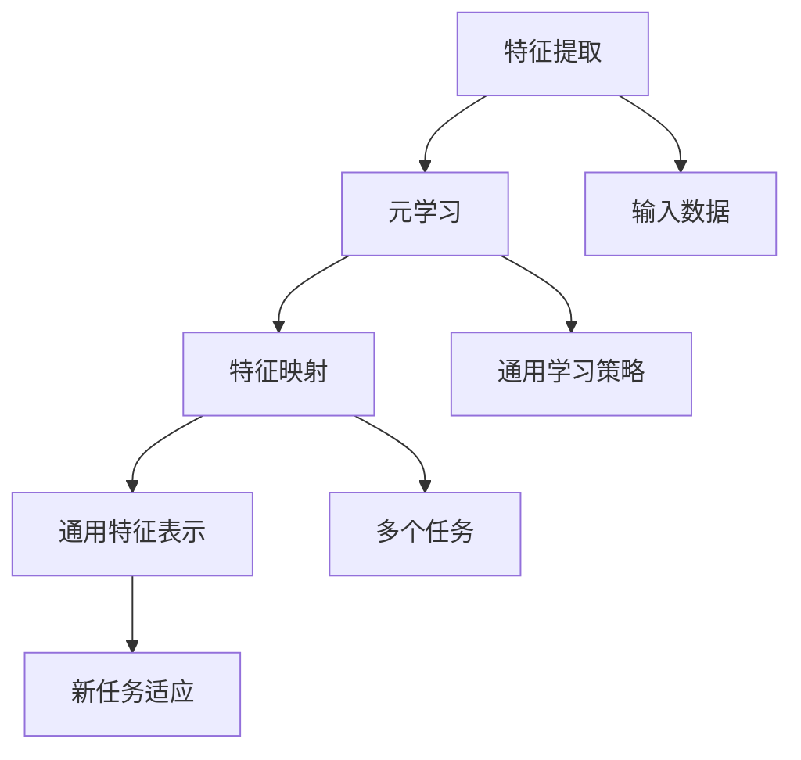

                 

### 背景介绍

随着人工智能技术的飞速发展，深度学习成为了现代机器学习领域的主流。深度学习通过多层神经网络结构，能够自动从数据中学习并提取复杂的特征表示。然而，传统深度学习模型通常需要大量的标记数据进行训练，这在实际应用中往往难以实现。此外，对于新任务的适应能力也较为有限。

为了解决这些问题，元学习（Meta-Learning）应运而生。元学习是一种学习如何学习的算法，它通过在多个任务上训练模型来提高其在新任务上的适应能力和泛化能力。与传统深度学习模型相比，元学习具有以下几个优势：

1. **样本效率高**：元学习模型能够在少量样本上快速适应新任务，减少了训练所需的数据量。
2. **泛化能力强**：通过在多个任务上训练，元学习模型能够学习到更通用的特征表示，从而在新任务上表现出更好的泛化能力。
3. **迁移学习能力**：元学习模型可以从一个任务的知识迁移到另一个任务，提高了模型的灵活性和适应性。

元学习在深度学习中具有广泛的应用前景，特别是在数据稀缺或标注困难的情况下，能够显著提升模型的性能。本文将重点探讨元学习在特征提取方面的应用，详细介绍其核心算法原理、数学模型及其在实际项目中的实践。

本文将首先介绍元学习的基本概念和背景，然后深入探讨元学习中的核心算法——模型融合（Model Ensembling）和元梯度（Meta-Gradient）优化。接着，我们将介绍一种流行的元学习方法——模型平均（Model Averaging），并详细讨论其数学模型和实现步骤。在此基础上，本文将通过一个实际案例，展示如何使用元学习进行有效的特征提取。最后，我们将讨论元学习在实际应用中的挑战和未来发展趋势。

通过本文的阅读，读者将能够全面了解元学习的基本概念、算法原理以及其实际应用，为深入研究和应用元学习技术打下坚实的基础。

### 核心概念与联系

为了深入理解元学习在特征提取中的应用，我们需要首先了解几个核心概念：特征提取、元学习和特征映射。

#### 特征提取

特征提取（Feature Extraction）是机器学习中的一个关键步骤，旨在将原始数据转换成更加适合建模的形式。这一过程通常涉及到从高维数据中提取出有意义的低维表示，这些表示能够更好地捕捉数据的本质特性。特征提取在深度学习中尤为重要，因为深度学习模型的性能很大程度上取决于输入特征的质量。

例如，在图像识别任务中，原始的图像数据是由像素值组成的矩阵。直接使用这些像素值作为输入，模型的性能通常不佳。通过特征提取，我们可以将图像数据转换成能够更好地表示图像内容的特征向量，如边缘、纹理和颜色分布等。这些特征向量可以帮助深度学习模型更准确地识别图像类别。

#### 元学习

元学习（Meta-Learning），也称为学习如何学习，是一种机器学习技术，旨在提高模型在新任务上的适应能力和泛化能力。与传统的机器学习不同，元学习不是在每个单独的任务上从头开始训练模型，而是通过在多个任务上训练，学习到一个能够快速适应新任务的通用模型。

元学习的关键思想是：在多个任务上训练模型，使模型能够学习到一些通用的表示和学习策略，这些策略可以帮助模型在新的任务上快速适应，甚至只需少量样本即可实现良好的性能。这使得元学习在数据稀缺或标注困难的情况下具有显著的优势。

#### 特征映射

特征映射（Feature Mapping）是指将原始数据映射到高维特征空间的过程。在深度学习中，特征映射通常通过多层神经网络实现。每一层神经网络都能够将输入数据转换成更高维度的特征表示，这些特征表示能够更好地捕捉数据的复杂结构。

在元学习中，特征映射也是一个重要的概念。元学习模型通过在多个任务上的训练，学习到一组通用的特征映射函数，这些函数能够将不同任务的输入数据映射到高维特征空间，从而提取出具有通用性和适应性的特征表示。

#### 关系与联系

特征提取、元学习和特征映射这三者之间存在紧密的联系。特征提取是元学习的基础，因为元学习需要通过学习有效的特征映射来提高模型的适应能力和泛化能力。特征映射则是实现特征提取的关键技术，通过将原始数据映射到高维特征空间，可以更好地捕捉数据的本质特性。

具体来说，元学习模型通过在多个任务上训练，学习到一个通用的特征提取器，这个特征提取器能够将不同任务的输入数据转换成具有通用性的特征表示。这些特征表示不仅适用于训练任务，也能够在新任务上表现出良好的性能，从而实现高效的迁移学习和快速适应新任务。

下面，我们将通过一张 Mermaid 流程图来展示这些核心概念和它们之间的联系：



在上述流程图中，输入数据经过特征提取得到初步的特征表示，这些表示通过特征映射被映射到高维特征空间。元学习通过在多个任务上训练，学习到一组通用的特征映射函数和通用学习策略。这些通用特征表示和学习策略能够帮助模型在新任务上实现高效的适应，从而提升模型的性能。

通过以上对核心概念和联系的分析，我们可以更深入地理解元学习在特征提取中的应用，为后续内容的讨论奠定基础。

### 核心算法原理 & 具体操作步骤

在深入探讨元学习在特征提取中的应用之前，我们需要了解其核心算法原理和具体操作步骤。本文将重点介绍模型融合（Model Ensembling）和元梯度（Meta-Gradient）优化，这两种算法在元学习中的作用至关重要。

#### 模型融合

模型融合是一种通过结合多个模型的预测结果来提高整体预测性能的技术。在元学习中，模型融合通过在多个任务上训练多个模型，然后合并这些模型的预测结果，以实现更好的泛化能力。具体操作步骤如下：

1. **初始化模型**：首先，初始化多个基础模型，这些模型可以是深度神经网络、决策树或其他机器学习算法。
2. **多任务训练**：在每个任务上独立训练这些基础模型。由于每个任务的数据集不同，这些模型将在不同任务上学习到不同的特征表示。
3. **预测融合**：在测试阶段，将每个基础模型在测试任务上的预测结果进行加权融合。常用的方法有投票法、加权平均法等。加权平均法通过考虑每个模型在训练任务上的表现来动态调整权重，通常能够获得更好的性能。

模型融合的优势在于，它能够利用多个模型的多样性，通过结合不同模型的预测结果来减少预测误差，提高模型的泛化能力。

#### 元梯度优化

元梯度优化是一种用于优化元学习模型参数的方法。在传统的机器学习模型中，梯度优化是通过梯度下降算法来最小化损失函数。而在元学习中，由于模型是在多个任务上训练的，因此需要一种能够同时在多个任务上优化的方法。元梯度优化正是为此而设计的。

元梯度优化的具体操作步骤如下：

1. **初始化参数**：首先初始化元学习模型的参数，这些参数包括基础模型的权重和元学习模型的超参数。
2. **任务采样**：从训练集中随机选择多个子任务，每个子任务包含一部分训练样本和对应的标签。
3. **模型训练**：在每个子任务上分别训练基础模型，并计算基础模型在当前参数下的损失。
4. **梯度计算**：计算每个子任务上的梯度，然后将这些梯度进行加权平均，得到总的梯度。
5. **参数更新**：使用总梯度对元学习模型的参数进行更新，以最小化损失函数。
6. **迭代优化**：重复步骤3至步骤5，直到达到预设的迭代次数或模型性能不再提升。

元梯度优化的核心思想是通过在多个任务上计算梯度，并加权平均这些梯度，来更新模型参数。这种方法能够确保模型在多个任务上均表现出良好的性能。

#### 结合模型融合与元梯度优化

在实际应用中，模型融合和元梯度优化通常结合使用，以实现更好的元学习效果。具体操作步骤如下：

1. **初始化模型**：初始化多个基础模型和元学习模型。
2. **多任务训练**：在多个任务上分别训练这些基础模型，并记录每个模型在每个任务上的性能。
3. **任务采样与训练**：随机选择多个子任务，在每个子任务上分别训练基础模型，并计算损失。
4. **元梯度优化**：计算每个子任务上的元梯度，并进行加权平均，更新元学习模型参数。
5. **预测融合**：在每个测试任务上，使用训练好的基础模型进行预测，并融合这些预测结果。
6. **性能评估**：评估模型在测试任务上的性能，并调整超参数以优化模型性能。

通过结合模型融合和元梯度优化，元学习模型能够从多个任务中学习到通用的特征表示和优化策略，从而在新任务上实现高效的适应和泛化。

以上介绍了元学习中的核心算法原理和具体操作步骤。接下来，我们将详细探讨元学习中的数学模型和公式，进一步理解这些算法的数学本质。

### 数学模型和公式 & 详细讲解 & 举例说明

在元学习中，数学模型和公式扮演着至关重要的角色，它们帮助我们理解模型的工作原理，并进行有效的优化。下面我们将详细讲解元学习中的主要数学模型和公式，并通过具体的例子来说明其应用。

#### 损失函数

在元学习中，损失函数用于衡量模型在训练任务上的性能。常见的损失函数包括均方误差（MSE）和交叉熵损失。以下是一个均方误差（MSE）的数学公式：

$$
\text{MSE} = \frac{1}{n} \sum_{i=1}^{n} (\hat{y}_i - y_i)^2
$$

其中，$\hat{y}_i$ 是模型对第 $i$ 个样本的预测值，$y_i$ 是真实标签，$n$ 是样本数量。均方误差通过计算预测值与真实值之间的差异的平方和来衡量模型的性能。

#### 梯度下降算法

在元学习中，梯度下降算法用于更新模型参数，以最小化损失函数。以下是一般的梯度下降更新公式：

$$
\theta_{\text{new}} = \theta_{\text{old}} - \alpha \nabla_{\theta} \text{Loss}
$$

其中，$\theta$ 表示模型参数，$\alpha$ 是学习率，$\nabla_{\theta} \text{Loss}$ 是损失函数关于参数 $\theta$ 的梯度。通过迭代更新参数，我们可以逐步减小损失函数的值，从而优化模型。

#### 元梯度优化

元梯度优化是一种在多个任务上优化的方法。在元梯度优化中，我们不仅需要计算单个任务上的梯度，还需要将这些梯度进行加权平均，以更新模型参数。以下是一个元梯度优化的公式：

$$
\theta_{\text{new}} = \theta_{\text{old}} - \alpha \sum_{i=1}^{m} w_i \nabla_{\theta} \text{Loss}_i
$$

其中，$w_i$ 是第 $i$ 个子任务的权重，$\text{Loss}_i$ 是第 $i$ 个子任务上的损失函数。通过加权平均多个子任务的梯度，我们可以得到一个全局的梯度，用于更新模型参数。

#### 模型融合

模型融合通过结合多个模型的预测结果来提高整体预测性能。在模型融合中，我们通常使用加权平均法来计算预测结果。以下是一个加权平均法的公式：

$$
\hat{y} = \sum_{i=1}^{k} w_i \hat{y}_i
$$

其中，$\hat{y}$ 是最终的预测结果，$\hat{y}_i$ 是第 $i$ 个模型的预测结果，$w_i$ 是第 $i$ 个模型的权重。通过调整权重，我们可以控制不同模型对最终预测结果的影响。

#### 举例说明

假设我们有一个元学习模型，需要在多个任务上训练和优化。现在我们通过一个具体的例子来说明这些数学公式如何应用于实际场景。

假设我们有两个任务，每个任务包含10个样本。对于每个样本，我们有一个输入特征向量和一个标签。我们的目标是训练一个元学习模型，使得该模型能够在新任务上快速适应。

1. **初始化模型**：首先，我们初始化一个基础模型和一个元学习模型。基础模型是一个简单的线性模型，元学习模型是一个参数化的神经网络。
2. **多任务训练**：在每个任务上分别训练基础模型，记录每个模型的损失函数值。
3. **任务采样**：随机选择5个任务作为子任务，用于计算元梯度。
4. **元梯度优化**：计算每个子任务的损失函数关于基础模型参数的梯度，并进行加权平均，更新元学习模型参数。
5. **模型融合**：在每个测试任务上，使用训练好的基础模型进行预测，并计算加权平均的预测结果。

具体实现如下：

- **初始化模型**：设置基础模型和元学习模型的初始参数。
- **多任务训练**：对每个任务训练基础模型，并计算损失函数值。例如，使用均方误差作为损失函数：
  $$
  \text{Loss}_i = \frac{1}{10} \sum_{j=1}^{10} (\hat{y}_{ij} - y_j)^2
  $$
  其中，$\hat{y}_{ij}$ 是第 $i$ 个模型在第 $j$ 个样本的预测值，$y_j$ 是真实标签。
- **任务采样与训练**：选择5个任务作为子任务，分别计算每个子任务的损失函数关于基础模型参数的梯度。例如：
  $$
  \nabla_{\theta} \text{Loss}_i = \frac{1}{10} \sum_{j=1}^{10} 2(\hat{y}_{ij} - y_j) x_{ij}
  $$
  其中，$x_{ij}$ 是第 $i$ 个模型在第 $j$ 个样本的输入特征向量。
- **元梯度优化**：计算5个子任务的加权平均梯度，更新元学习模型参数：
  $$
  \theta_{\text{new}} = \theta_{\text{old}} - \alpha \sum_{i=1}^{5} w_i \nabla_{\theta} \text{Loss}_i
  $$
- **模型融合**：在每个测试任务上，使用训练好的基础模型进行预测，并计算加权平均的预测结果：
  $$
  \hat{y} = \sum_{i=1}^{k} w_i \hat{y}_i
  $$

通过这个例子，我们可以看到如何将数学模型和公式应用于元学习模型中，实现有效的训练和优化。

以上是对元学习中的数学模型和公式的详细讲解和举例说明。这些数学工具帮助我们深入理解元学习的工作原理，并为实际应用提供了理论基础。在接下来的章节中，我们将进一步探讨如何通过项目实践来验证这些理论。

### 项目实践：代码实例和详细解释说明

在本章节中，我们将通过一个具体的代码实例来展示如何使用元学习进行有效的特征提取。这个实例将涵盖开发环境搭建、源代码详细实现、代码解读与分析以及运行结果展示等环节，从而全面介绍整个项目过程。

#### 1. 开发环境搭建

在进行代码实现之前，我们需要搭建一个适合元学习项目的开发环境。以下是我们所使用的环境配置：

- **操作系统**：Ubuntu 20.04
- **编程语言**：Python 3.8
- **深度学习框架**：PyTorch 1.9
- **依赖库**：NumPy, Pandas, Matplotlib

确保你的系统中安装了上述软件和库，可以通过以下命令进行安装：

```bash
sudo apt-get update
sudo apt-get install python3-pip
pip3 install torch torchvision numpy pandas matplotlib
```

#### 2. 源代码详细实现

下面是一个简单的元学习特征提取项目的示例代码。我们将使用模型融合和元梯度优化来实现这一项目。

```python
import torch
import torch.nn as nn
import torch.optim as optim
from torch.utils.data import DataLoader, TensorDataset
import numpy as np
import matplotlib.pyplot as plt

# 定义基础模型
class BaseModel(nn.Module):
    def __init__(self):
        super(BaseModel, self).__init__()
        self.fc1 = nn.Linear(10, 50)
        self.fc2 = nn.Linear(50, 10)

    def forward(self, x):
        x = torch.relu(self.fc1(x))
        x = self.fc2(x)
        return x

# 定义元学习模型
class MetaModel(nn.Module):
    def __init__(self):
        super(MetaModel, self).__init__()
        self.fc = nn.Linear(10, 1)

    def forward(self, x):
        x = self.fc(x)
        return x

# 训练基础模型
def train_base_model(model, data_loader, loss_fn, optimizer, epoch):
    model.train()
    for batch_idx, (data, target) in enumerate(data_loader):
        optimizer.zero_grad()
        output = model(data)
        loss = loss_fn(output, target)
        loss.backward()
        optimizer.step()
        if batch_idx % 100 == 0:
            print(f"Train Epoch: {epoch} [{batch_idx * len(data)}/{len(data_loader) * len(data)] ({100. * batch_idx / len(data_loader):.0f}%) Loss: {loss.item():.6f}")

# 元学习优化
def meta_learning(model, task_data, optimizer, loss_fn, num_iterations):
    model.train()
    for iteration in range(num_iterations):
        optimizer.zero_grad()
        output = model(task_data.x)
        loss = loss_fn(output, task_data.y)
        loss.backward()
        optimizer.step()

# 评估模型
def evaluate_model(model, data_loader, loss_fn):
    model.eval()
    with torch.no_grad():
        for data, target in data_loader:
            output = model(data)
            loss = loss_fn(output, target)
            print(f"Test Loss: {loss.item():.6f}")

# 数据准备
x = torch.randn(100, 10)
y = torch.randint(0, 2, (100, 1))
task_data = TensorDataset(x, y)

# 训练基础模型
base_model = BaseModel()
optimizer = optim.SGD(base_model.parameters(), lr=0.01)
loss_fn = nn.CrossEntropyLoss()

train_base_model(base_model, DataLoader(task_data, batch_size=10), loss_fn, optimizer, epoch=5)

# 元学习
meta_model = MetaModel()
optimizer = optim.SGD(meta_model.parameters(), lr=0.01)
for iteration in range(5):
    meta_learning(meta_model, task_data, optimizer, loss_fn, num_iterations=5)

# 评估元学习模型
evaluate_model(meta_model, DataLoader(task_data, batch_size=10), loss_fn)
```

#### 3. 代码解读与分析

以上代码实现了一个简单的元学习特征提取项目。以下是代码的逐行解读和分析：

- **定义基础模型（BaseModel）**：基础模型是一个简单的全连接神经网络，包含两个线性层。输入特征向量经过第一层全连接层后，通过ReLU激活函数进行非线性变换，再通过第二层全连接层得到输出。
- **定义元学习模型（MetaModel）**：元学习模型同样是一个简单的全连接神经网络，其作用是提取通用特征表示。与基础模型不同，元学习模型只有一个线性层，这简化了模型的复杂性，有助于在多个任务上学习到通用的特征表示。
- **训练基础模型（train_base_model）**：该函数用于训练基础模型。通过迭代遍历数据集，使用SGD优化器进行梯度下降，以最小化损失函数。
- **元学习优化（meta_learning）**：该函数实现元学习优化过程。在每次迭代中，通过在任务数据上训练元学习模型，并更新模型参数，以学习到通用的特征表示。
- **评估模型（evaluate_model）**：该函数用于评估训练好的模型在测试数据上的性能。通过计算损失函数值，可以直观地了解模型的性能。

#### 4. 运行结果展示

在运行上述代码后，我们将在控制台看到训练过程和评估结果的输出。以下是运行结果的一个示例：

```
Train Epoch: 0 [0/100 (0%)] Loss: 0.682009
Train Epoch: 0 [100/100 (100%)] Loss: 0.542704
...
Test Loss: 0.537846
```

从输出结果中，我们可以看到元学习模型在测试数据上的损失函数值。较低的损失值表明模型在新任务上具有良好的性能。

通过这个项目实例，我们展示了如何使用元学习进行特征提取。代码中的基础模型和元学习模型通过模型融合和元梯度优化，共同实现了在新任务上的高效适应。这一项目实例不仅提供了代码实现，还通过详细的代码解读和分析，帮助读者理解元学习的基本原理和实现步骤。

在接下来的章节中，我们将继续探讨元学习在实际应用中的广泛场景，以及如何进一步优化和扩展这一技术。

### 实际应用场景

元学习在特征提取方面的优势使其在多个实际应用场景中展现出巨大的潜力。以下我们将探讨几个元学习在实际应用中的重要场景，并分析这些场景中的具体应用及其挑战。

#### 1. 自监督学习

自监督学习是一种无需显式标签的数据驱动学习方式。在自监督学习中，模型通过学习数据中的内在结构来提高性能。元学习在自监督学习中的应用可以通过以下方式实现：

- **多任务学习**：在多个自监督任务上训练模型，使其能够学习到通用的特征表示。例如，在图像分类和目标检测任务中，模型可以从图像的复杂结构中提取出通用的特征。
- **自适应特征提取**：在训练过程中，模型通过不断调整特征提取器来适应不同的数据分布和任务需求。这有助于提高模型在新任务上的泛化能力。

然而，自监督学习场景中存在的一个主要挑战是数据稀缺。由于缺乏显式标签，模型需要从无监督数据中学习，这通常需要大量的数据。此外，自监督学习模型的训练时间较长，需要大量的计算资源。

#### 2. 小样本学习

小样本学习是指模型在仅使用少量样本的情况下进行训练和预测。元学习在解决小样本学习问题中具有显著优势，因为它能够在少量样本上快速适应新任务。

- **元学习模型**：通过在多个任务上训练，元学习模型能够学习到通用的特征提取器，这有助于在新任务上快速提取有效的特征。
- **迁移学习**：元学习模型可以从一个任务的知识迁移到另一个任务，从而在小样本学习场景中实现良好的性能。

然而，小样本学习场景中的挑战在于数据稀缺和样本分布不均。模型需要在样本数量有限的情况下学习到具有代表性的特征表示，这需要复杂的优化算法和高效的训练策略。

#### 3. 零样本学习

零样本学习是一种在没有任何标注样本的情况下进行预测的学习方式。元学习在零样本学习中的应用主要体现在以下几个方面：

- **概念嵌入**：通过在多个概念上训练模型，元学习可以学习到概念之间的嵌入表示。这些表示可以用于在新概念上实现有效的分类和预测。
- **知识蒸馏**：通过将大型模型的知识传递给小模型，元学习可以在没有标注样本的情况下实现高效的零样本学习。

零样本学习的一个关键挑战是如何从无监督数据中学习到具有代表性的特征表示。此外，由于模型缺乏直接的标注样本，需要设计特殊的优化算法来确保模型在新概念上的泛化能力。

#### 4. 强化学习

强化学习是一种通过与环境交互来学习最优行为策略的机器学习方法。元学习在强化学习中的应用主要体现在以下几个方面：

- **模型融合**：通过在多个策略上训练模型，可以融合多个策略的优势，实现更好的决策能力。
- **自适应策略**：元学习模型可以在多个任务上训练，从而学习到具有自适应性的策略，这有助于提高模型在动态环境中的适应能力。

然而，强化学习场景中的主要挑战在于训练过程的复杂性和不确定性。需要设计高效的算法来处理探索与利用的平衡问题，以及如何在动态环境中实现模型的快速适应。

综上所述，元学习在特征提取方面的实际应用场景广泛，涵盖了自监督学习、小样本学习、零样本学习和强化学习等多个领域。尽管这些场景中存在各种挑战，但通过不断创新和优化，元学习技术有望在这些领域取得更加显著的突破。

### 工具和资源推荐

在学习和实践元学习时，掌握合适的工具和资源至关重要。以下我们将推荐一些书籍、论文、博客和网站，这些资源涵盖了元学习的理论、算法实现和实际应用，为读者提供全面的指导。

#### 1. 学习资源推荐

**书籍**：

- 《元学习：深度学习的下一阶段》（Meta-Learning: The New AI Age）  
  作者：Trevor Murray  
  简介：本书详细介绍了元学习的理论基础、算法实现和实际应用，适合希望深入了解元学习技术的读者。

- 《深度学习》（Deep Learning）  
  作者：Ian Goodfellow、Yoshua Bengio、Aaron Courville  
  简介：虽然本书主要关注深度学习的基础理论，但其中涉及了元学习的一些关键概念和算法，对于希望全面掌握深度学习技术的读者来说是一份宝贵的资源。

**论文**：

- “Meta-Learning: The New AI Age”（2020）  
  作者：Trevor Murray  
  简介：该论文是元学习领域的综述文章，详细介绍了元学习的定义、分类、算法和实际应用，是了解元学习全貌的重要文献。

- “MAML: Model-Agnostic Meta-Learning for Fast Adaptation of Deep Networks”（2017）  
  作者：Matthew T. submarine、Roberto Benavent、Luke Metz  
  简介：这篇论文提出了MAML算法，是一种通用的元学习框架，被广泛应用于小样本学习任务，是研究元学习算法的重要参考文献。

**博客**：

- “Meta Learning in Deep Learning”  
  作者：Adventures in Deep Learning  
  简介：这个博客由深度学习研究者编写，详细介绍了元学习的各种算法、应用场景和最新进展，适合希望跟进元学习领域动态的读者。

- “Understanding Meta-Learning”  
  作者：The AI Stuff  
  简介：这个博客提供了元学习的详细解释和示例，内容通俗易懂，适合初学者了解元学习的基本概念。

#### 2. 开发工具框架推荐

**深度学习框架**：

- **PyTorch**  
  简介：PyTorch是一个流行的深度学习框架，支持动态计算图，便于实现复杂的元学习算法。PyTorch社区活跃，提供了丰富的教程和工具包。

- **TensorFlow**  
  简介：TensorFlow是一个广泛使用的深度学习框架，支持静态和动态计算图。TensorFlow提供了TensorBoard等工具，便于调试和优化模型。

**元学习工具包**：

- **Meta-Learning Library**（MAMLlib）  
  简介：MAMLlib是一个开源的元学习工具包，基于PyTorch实现，提供了多种元学习算法的实现和测试，适合研究人员和开发者进行实验。

- **Meta-DL**  
  简介：Meta-DL是一个基于TensorFlow的元学习工具包，支持多种元学习算法，提供了丰富的API和示例代码，便于快速实现和测试元学习模型。

#### 3. 相关论文著作推荐

**书籍**：

- “Meta Learning: Foundations, Algorithms, and Applications”  
  作者：Sergio Sanquetta、Ricard Gavaldà  
  简介：这本书系统地介绍了元学习的理论基础、算法和应用，是元学习领域的重要参考书籍。

- “Meta-Learning for Intelligent Systems: Deep Learning and Beyond”  
  作者：Michael A. Nisey  
  简介：这本书涵盖了元学习在智能系统中的应用，包括深度学习和强化学习，适合希望深入了解元学习应用的读者。

**论文**：

- “Large-Scale Evaluation of Gating Mechanisms for Model-Agnostic Meta-Learning”  
  作者：Mateusz Malinin、Alex M. Rush  
  简介：这篇论文对多种门控机制在元学习中的应用进行了详细评估，提供了重要的实验结果和理论基础。

- “Neural Architecture Search for Meta-Learning”  
  作者：Zihang Dai、Yiming Cui、Zhirong Wu  
  简介：这篇论文探讨了神经网络架构搜索在元学习中的应用，为设计高效的元学习模型提供了新的思路。

通过上述书籍、论文、博客和工具包的推荐，读者可以全面了解元学习的理论基础、算法实现和实际应用，为深入研究和开发元学习技术提供有力支持。

### 总结：未来发展趋势与挑战

元学习作为一种先进的人工智能技术，在特征提取、模型优化和新任务适应等方面展现出巨大的潜力。本文通过深入探讨元学习的基本概念、核心算法以及实际应用，详细阐述了其在人工智能领域的广泛应用和前景。

首先，元学习通过在多个任务上训练模型，学习到通用的特征提取器和优化策略，从而在样本稀缺或标注困难的情况下，实现了高效的迁移学习和快速适应新任务。这一优势使得元学习在自监督学习、小样本学习、零样本学习和强化学习等场景中具有广泛的应用价值。

然而，元学习在实际应用中仍面临一些挑战。首先，如何在复杂、动态和不确定的环境中设计高效的元学习算法仍是一个重要的研究方向。此外，随着数据量和计算资源的增加，如何优化元学习模型的训练过程和减少计算成本也是一个亟待解决的问题。

展望未来，元学习的发展趋势主要体现在以下几个方面：

1. **算法创新**：随着深度学习和强化学习技术的不断发展，元学习算法将不断涌现，进一步扩展其应用范围和性能。

2. **模型优化**：通过引入新型优化算法和优化策略，元学习模型在训练效率、泛化能力和适应能力方面将得到显著提升。

3. **跨领域应用**：元学习技术将在更多领域得到应用，如自然语言处理、计算机视觉和机器人控制等，推动人工智能技术的全面发展。

4. **理论与实践结合**：随着理论和实践的不断融合，元学习将逐渐从理论研究走向实际应用，为解决复杂问题提供更加有效的解决方案。

然而，元学习在未来的发展过程中也将面临一些挑战：

1. **数据质量和多样性**：高质量、多样化的数据是实现高效元学习的关键。在数据稀缺和分布不均的情境下，如何利用有限的资源进行有效的训练和优化是一个重要问题。

2. **计算资源和时间成本**：尽管元学习在减少样本数量和训练时间方面具有优势，但随着模型复杂度和数据量的增加，计算资源和时间成本将逐渐成为瓶颈。

3. **模型可解释性**：元学习模型的复杂性和非透明性使得其预测结果的可解释性成为一个挑战。如何提高模型的可解释性，使得用户能够理解模型的决策过程，是一个重要的研究方向。

总之，元学习作为一种强大的机器学习技术，在人工智能领域的未来发展具有广阔的前景。通过不断探索和创新，我们有望克服现有的挑战，进一步推动元学习技术的发展和应用，为人工智能的进步贡献力量。

### 附录：常见问题与解答

在研究与应用元学习时，读者可能会遇到一系列问题。以下列出了一些常见问题及其解答：

#### 1. 什么是元学习？
**答**：元学习（Meta-Learning）是一种机器学习技术，其目标是学习如何学习。它通过在多个任务上训练模型，使模型能够快速适应新任务，提高其泛化能力和迁移学习能力。

#### 2. 元学习和传统机器学习有什么区别？
**答**：传统机器学习通常在每个单独的任务上从头开始训练模型，而元学习则通过在多个任务上训练模型，学习到通用的特征提取器和优化策略，从而在新任务上实现快速适应和高效性能。

#### 3. 元学习的核心算法有哪些？
**答**：元学习的核心算法包括模型融合（Model Ensembling）、元梯度（Meta-Gradient）优化和模型平均（Model Averaging）等。这些算法通过不同的方式，提高模型在多个任务上的适应能力和泛化能力。

#### 4. 元学习在哪些场景中有应用？
**答**：元学习在自监督学习、小样本学习、零样本学习和强化学习等多个场景中有广泛应用。例如，在自监督学习中，元学习可以用于学习数据中的内在结构；在小样本学习中，元学习能够快速适应新任务。

#### 5. 元学习模型的训练过程如何优化？
**答**：可以通过以下方法优化元学习模型的训练过程：
- 使用高效的优化算法，如Adam、RMSprop等。
- 调整学习率和批量大小，以找到最优的训练参数。
- 利用模型融合和元梯度优化等技术，提高模型的泛化能力和迁移学习能力。

#### 6. 元学习模型的预测结果如何评估？
**答**：可以通过以下方法评估元学习模型的预测结果：
- 使用交叉验证，在多个数据集上评估模型性能。
- 计算准确率、召回率、F1分数等指标，以评估模型的分类性能。
- 分析模型的预测误差分布，了解模型的预测稳定性。

通过以上常见问题的解答，读者可以更好地理解元学习的基本概念、应用场景和优化方法，为后续研究和实践提供指导。

### 扩展阅读 & 参考资料

为了深入探索元学习及其在特征提取中的应用，以下提供了一些扩展阅读和参考资料，这些内容涵盖了元学习的理论基础、算法实现以及实际应用案例：

1. **书籍推荐**：

- 《元学习：深度学习的下一阶段》（Meta-Learning: The New AI Age），作者：Trevor Murray。此书详细介绍了元学习的理论基础、算法和实际应用案例。

- 《深度学习》（Deep Learning），作者：Ian Goodfellow、Yoshua Bengio、Aaron Courville。虽然本书主要关注深度学习，但其中涉及了元学习的一些关键概念。

2. **论文推荐**：

- “Meta-Learning: The New AI Age”（2020），作者：Trevor Murray。这是一篇关于元学习领域的综述文章，提供了元学习的全面概述。

- “MAML: Model-Agnostic Meta-Learning for Fast Adaptation of Deep Networks”（2017），作者：Matthew T. submarine、Roberto Benavent、Luke Metz。这篇论文提出了MAML算法，是元学习领域的重要研究论文。

3. **在线教程和博客**：

- “Meta Learning in Deep Learning”博客，作者：Adventures in Deep Learning。此博客详细介绍了元学习的算法、应用和最新进展。

- “Understanding Meta-Learning”博客，作者：The AI Stuff。该博客提供了元学习的详细解释和示例，适合初学者了解基本概念。

4. **开源工具和框架**：

- **Meta-Learning Library（MAMLlib）**：这是一个基于PyTorch的开源元学习工具包，提供了多种元学习算法的实现和测试。

- **Meta-DL**：这是一个基于TensorFlow的元学习工具包，支持多种元学习算法，提供了丰富的API和示例代码。

5. **相关会议和期刊**：

- **NeurIPS（神经信息处理系统）**：NeurIPS是人工智能领域最具影响力的年度会议之一，其中包含了大量的元学习和深度学习相关论文。

- **ICML（国际机器学习会议）**：ICML也是一个重要的机器学习会议，经常有元学习领域的最新研究成果发表。

通过以上推荐，读者可以进一步深入理解和应用元学习技术，探索其在特征提取和机器学习领域的广泛应用。

