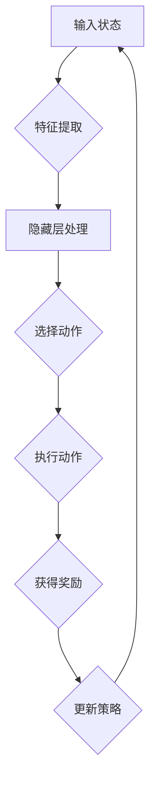

                 

### 文章标题：一切皆是映射：深度学习与游戏AI的结合

**关键词**：深度学习，游戏AI，神经网络，映射，强化学习，模拟，编程实践。

**摘要**：本文将深入探讨深度学习与游戏AI的结合，分析如何利用深度学习算法训练游戏AI，并探讨其实际应用场景。文章将从核心概念出发，逐步解释深度学习与游戏AI的关系，核心算法原理，以及如何通过具体项目实践来理解和应用这些技术。通过本文，读者将能够全面了解这一前沿领域，并为未来的研究和应用奠定基础。

### 1. 背景介绍

#### 深度学习的崛起

深度学习（Deep Learning）是机器学习（Machine Learning）的一个分支，主要依赖于神经网络（Neural Networks）的复杂数学模型。深度学习的崛起可以追溯到20世纪80年代末，当时计算能力和数据资源有限，神经网络的发展受到一定限制。然而，随着计算能力的飞速提升和大数据时代的到来，深度学习逐渐成为人工智能（Artificial Intelligence）领域的明星。

深度学习的核心在于多层神经网络的构建与训练。每一层神经网络都能够提取更高层次的抽象特征，从而实现从原始数据到复杂决策的映射。这种能力使得深度学习在图像识别、自然语言处理、语音识别等领域取得了显著突破。

#### 游戏AI的演变

游戏AI（Game AI）是专门设计用于模拟游戏角色的智能系统。从早期的规则式AI（基于规则和预定义策略），到后来的基于搜索的AI（如蒙特卡洛树搜索），游戏AI经历了多次技术革新。近年来，随着深度学习的兴起，游戏AI开始向更为复杂和智能的方向发展。

游戏AI的目标是使游戏角色表现出更加真实和智能的行为，从而提升游戏体验。这需要AI系统能够适应各种游戏情境，并作出合理的决策。深度学习在游戏AI中的应用，使得游戏AI在策略制定、环境感知和自主决策等方面取得了显著进展。

#### 深度学习与游戏AI的结合

深度学习与游戏AI的结合，开辟了新的研究与应用领域。通过将深度学习算法应用于游戏AI，可以训练出具备高度智能和自适应能力的游戏角色。这种结合不仅能够提升游戏的难度和复杂性，还能够为游戏开发提供创新的解决方案。

本文将探讨深度学习在游戏AI中的应用，分析其核心算法原理，并通过具体项目实践，展示如何将深度学习技术与游戏AI结合。通过本文的阅读，读者将能够深入了解这一前沿领域，并为未来的研究和应用提供启示。

### 2. 核心概念与联系

#### 深度学习原理

深度学习的核心是神经网络，特别是多层感知机（Multilayer Perceptron, MLP）。神经网络由多个层次组成，包括输入层、隐藏层和输出层。每一层都能够对输入数据进行处理，并提取更高层次的抽象特征。


**多层感知机（MLP）的工作原理**：

1. **输入层**：接收外部输入数据。
2. **隐藏层**：通过激活函数（如Sigmoid、ReLU等）对输入数据进行非线性变换，提取特征。
3. **输出层**：根据隐藏层的输出，通过激活函数得出最终结果。

**激活函数**：激活函数用于引入非线性因素，使得神经网络能够从原始数据中提取更高级别的特征。常用的激活函数包括Sigmoid、ReLU等。

#### 游戏AI的基本概念

游戏AI的目标是模拟游戏角色的智能行为。其基本概念包括：

1. **智能体（Agent）**：在游戏环境中执行任务的实体。智能体可以是玩家或游戏中的NPC（非玩家角色）。
2. **状态（State）**：游戏AI当前所处的环境描述。
3. **动作（Action）**：智能体可以采取的行为。
4. **奖励（Reward）**：智能体在执行动作后获得的奖励，用于评估动作的效果。

**游戏AI的工作流程**：

1. **感知状态**：智能体感知当前游戏环境的状态。
2. **选择动作**：根据状态和预先设定的策略，智能体选择一个动作。
3. **执行动作**：智能体在游戏环境中执行所选动作。
4. **获得奖励**：根据动作的结果，智能体获得相应的奖励。

#### 深度学习与游戏AI的结合

深度学习与游戏AI的结合主要体现在以下几个方面：

1. **状态表示**：利用深度学习算法，将游戏状态表示为高维特征向量。这有助于智能体更好地理解和分析游戏环境。
2. **动作策略**：通过深度学习算法，训练智能体选择最优动作。这可以提高智能体在复杂游戏环境中的决策能力。
3. **强化学习**：深度强化学习（Deep Reinforcement Learning）结合了深度学习和强化学习（Reinforcement Learning）的优点，可以训练智能体在复杂环境中自主学习和优化策略。

**结合原理**：

深度学习算法通过多层神经网络，可以从原始状态数据中提取高级特征。这些特征可以用于表示游戏状态，从而使智能体能够更好地理解游戏环境。同时，深度学习算法能够根据历史数据，通过优化策略来选择最佳动作，从而提高智能体的表现。


#### Mermaid 流程图

以下是深度学习与游戏AI结合的Mermaid流程图：



在这个流程中，智能体首先感知游戏状态，然后通过深度学习算法提取特征。这些特征用于隐藏层处理，最终生成最优动作。智能体执行动作后，根据获得的奖励更新策略，并重新开始循环。

### 3. 核心算法原理 & 具体操作步骤

#### 深度学习算法原理

深度学习算法的核心是多层神经网络，特别是卷积神经网络（Convolutional Neural Networks, CNN）和递归神经网络（Recurrent Neural Networks, RNN）。以下是这些算法的基本原理：

**卷积神经网络（CNN）**：

CNN是一种专门用于处理图像数据的神经网络。其核心思想是使用卷积操作来提取图像的特征。

1. **卷积操作**：卷积操作通过在图像上滑动滤波器（kernel）来提取局部特征。
2. **池化操作**：池化操作用于降低特征图的维度，增强特征的鲁棒性。
3. **全连接层**：全连接层将卷积操作和池化操作提取的特征映射到输出结果。

**递归神经网络（RNN）**：

RNN是一种能够处理序列数据的神经网络，其特点是具有时间记忆能力。

1. **隐藏状态**：RNN通过隐藏状态来存储历史信息。
2. **时间步**：RNN在每一个时间步更新隐藏状态，并根据隐藏状态生成输出。

**具体操作步骤**：

1. **初始化参数**：包括网络权重和偏置。
2. **前向传播**：输入数据通过多层神经网络，每一层都对数据进行处理，并生成中间结果。
3. **反向传播**：根据损失函数（如均方误差、交叉熵等），计算网络参数的梯度，并更新网络权重。
4. **迭代优化**：重复前向传播和反向传播，直到网络参数收敛。

#### 深度强化学习（Deep Reinforcement Learning）

深度强化学习是结合了深度学习和强化学习的算法，主要用于训练智能体在复杂环境中的策略。

1. **环境建模**：将游戏环境建模为一个马尔可夫决策过程（MDP）。
2. **策略学习**：通过深度神经网络学习最优策略，使智能体能够从当前状态选择最佳动作。
3. **奖励机制**：智能体在执行动作后获得奖励，用于评估动作的效果。

**具体操作步骤**：

1. **初始化环境**：设置游戏环境的初始状态。
2. **选择动作**：根据当前状态和深度神经网络生成的策略，选择最佳动作。
3. **执行动作**：在游戏环境中执行所选动作。
4. **评估奖励**：根据动作的结果，计算智能体获得的奖励。
5. **更新策略**：根据奖励和策略梯度，更新深度神经网络参数。

### 4. 数学模型和公式 & 详细讲解 & 举例说明

#### 卷积神经网络（CNN）的数学模型

卷积神经网络（CNN）的核心是卷积层和池化层。以下是这些层的数学模型和详细讲解：

**卷积层（Convolutional Layer）**：

卷积层的输入是一个四维的张量，包括图像的高度、宽度、通道数和批次。卷积层的输出也是一个四维的张量，其中每个元素都是通过卷积操作生成的。

卷积操作的数学公式如下：

$$
\text{output}(i,j,k) = \sum_{x,y,c}\text{input}(i+x,j+y,c) \odot w_{c,k}(x,y)
$$

其中，$(i,j,k)$是输出张量中的位置，$(x,y,c)$是输入张量中的位置，$\odot$表示点乘，$w_{c,k}(x,y)$是卷积核。

**池化层（Pooling Layer）**：

池化层的输入和输出都是四维的张量。常用的池化操作包括最大池化（Max Pooling）和平均池化（Average Pooling）。

最大池化的数学公式如下：

$$
\text{output}(i,j) = \max_{x,y} \text{input}(i+x,j+y)
$$

平均池化的数学公式如下：

$$
\text{output}(i,j) = \frac{1}{k^2} \sum_{x,y} \text{input}(i+x,j+y)
$$

其中，$k$是池化窗口的大小。

#### 递归神经网络（RNN）的数学模型

递归神经网络（RNN）的核心是隐藏状态和梯度回传。以下是这些部分的数学模型和详细讲解：

**隐藏状态**：

RNN的隐藏状态可以表示为：

$$
h_t = \text{sigmoid}(W_h \cdot [h_{t-1}, x_t] + b_h)
$$

其中，$h_t$是当前时间步的隐藏状态，$W_h$是权重矩阵，$b_h$是偏置项，$x_t$是当前输入。

**梯度回传**：

RNN的反向传播需要计算隐藏状态的梯度。以下是一个简化的梯度计算过程：

$$
\frac{\partial L}{\partial h_{t-1}} = \frac{\partial L}{\partial h_t} \odot \frac{\partial h_t}{\partial h_{t-1}}
$$

其中，$L$是损失函数，$\odot$表示点乘。

#### 深度强化学习（Deep Reinforcement Learning）的数学模型

深度强化学习（Deep Reinforcement Learning）的核心是策略优化和值函数估计。以下是这些部分的数学模型和详细讲解：

**策略优化**：

策略优化通常使用梯度下降法。目标是最小化策略损失函数：

$$
L(\theta) = \sum_{s,a} \pi(\theta)(s,a) \log \pi(\theta)(s,a) \cdot -R(s,a)
$$

其中，$\theta$是策略参数，$\pi(\theta)(s,a)$是策略概率，$R(s,a)$是奖励。

**值函数估计**：

值函数估计用于评估智能体在某个状态下执行最优动作的长期奖励。以下是值函数的表示：

$$
V(s) = \sum_{a} \pi(\theta)(s,a) \cdot \sum_{s'} p(s'|s,a) \cdot V(s')
$$

其中，$V(s)$是状态值函数，$p(s'|s,a)$是状态转移概率。

#### 举例说明

**示例1：卷积神经网络（CNN）的特征提取**

假设我们有一个32x32x3的图像，要使用一个5x5的卷积核进行卷积操作。卷积核的权重为：

$$
w = \begin{bmatrix}
0 & 1 & 0 \\
1 & -1 & 1 \\
0 & 1 & 0
\end{bmatrix}
$$

输入图像为：

$$
\text{input} = \begin{bmatrix}
0 & 1 & 0 \\
1 & 1 & 1 \\
0 & 1 & 0
\end{bmatrix}
$$

根据卷积操作的定义，输出为：

$$
\text{output} = \sum_{x,y,c} \text{input}(x,y,c) \odot w(c) = (0 \odot 0) + (1 \odot 1) + (0 \odot 1) + (1 \odot -1) + (1 \odot 1) + (0 \odot 0) + (1 \odot 1) + (1 \odot -1) + (0 \odot 1) = 0 + 1 - 1 + 1 + 0 + 1 - 1 + 0 = 0
$$

因此，卷积操作的输出为0。

**示例2：递归神经网络（RNN）的隐藏状态更新**

假设输入序列为[1, 2, 3]，隐藏状态初始值为[1, 0]，权重矩阵为：

$$
W_h = \begin{bmatrix}
0.5 & 0.5 \\
0.5 & 0.5
\end{bmatrix}
$$

偏置项为：

$$
b_h = \begin{bmatrix}
0.5 \\
0.5
\end{bmatrix}
$$

根据RNN的隐藏状态更新公式，第一个时间步的隐藏状态为：

$$
h_1 = \text{sigmoid}(W_h \cdot [h_0, x_1] + b_h) = \text{sigmoid}(0.5 \cdot [1, 1] + 0.5) = \text{sigmoid}(1) = 1
$$

第二个时间步的隐藏状态为：

$$
h_2 = \text{sigmoid}(W_h \cdot [h_1, x_2] + b_h) = \text{sigmoid}(0.5 \cdot [1, 2] + 0.5) = \text{sigmoid}(1.5) \approx 0.9
$$

第三个时间步的隐藏状态为：

$$
h_3 = \text{sigmoid}(W_h \cdot [h_2, x_3] + b_h) = \text{sigmoid}(0.5 \cdot [0.9, 3] + 0.5) = \text{sigmoid}(1.95) \approx 0.87
$$

因此，递归神经网络在输入序列[1, 2, 3]下的隐藏状态更新为[1, 1], [0.9, 0.9], [0.87, 0.87]。

**示例3：深度强化学习（Deep Reinforcement Learning）的策略优化**

假设当前状态为$s$，策略网络输出概率分布为$\pi(\theta)(s)$，奖励为$R(s,a)$，策略参数为$\theta$。根据策略优化公式，策略损失函数为：

$$
L(\theta) = \sum_{s,a} \pi(\theta)(s,a) \log \pi(\theta)(s,a) \cdot -R(s,a)
$$

假设当前策略参数为$\theta_0$，损失函数为$L(\theta_0)$。要优化策略，我们需要计算损失函数关于策略参数的梯度：

$$
\frac{\partial L(\theta_0)}{\partial \theta} = \sum_{s,a} \left( \frac{\partial \pi(\theta)(s,a)}{\partial \theta} \cdot -R(s,a) \right)
$$

根据梯度下降法，我们可以更新策略参数：

$$
\theta_{new} = \theta_0 - \alpha \cdot \frac{\partial L(\theta_0)}{\partial \theta}
$$

其中，$\alpha$是学习率。

### 5. 项目实践：代码实例和详细解释说明

#### 5.1 开发环境搭建

为了实现深度学习与游戏AI的结合，我们需要搭建一个合适的开发环境。以下是推荐的开发环境和工具：

1. **Python**：Python是一种广泛使用的编程语言，特别适合进行机器学习和深度学习开发。
2. **TensorFlow**：TensorFlow是一个开源的深度学习框架，支持多种深度学习算法和模型。
3. **PyTorch**：PyTorch是一个流行的深度学习框架，提供灵活的动态计算图，适合研究性和应用开发。
4. **Unity**：Unity是一个强大的游戏开发平台，支持多种游戏引擎和工具。

安装这些工具和框架后，我们就可以开始开发项目了。

#### 5.2 源代码详细实现

以下是一个简单的深度强化学习游戏AI项目，使用Python和PyTorch来实现。

```python
import torch
import torch.nn as nn
import torch.optim as optim
import gym

# 设置游戏环境
env = gym.make('CartPole-v0')

# 定义深度神经网络
class DQN(nn.Module):
    def __init__(self):
        super(DQN, self).__init__()
        self.fc1 = nn.Linear(4, 64)
        self.fc2 = nn.Linear(64, 64)
        self.fc3 = nn.Linear(64, 2)

    def forward(self, x):
        x = torch.relu(self.fc1(x))
        x = torch.relu(self.fc2(x))
        x = self.fc3(x)
        return x

# 初始化模型和优化器
model = DQN()
optimizer = optim.Adam(model.parameters(), lr=0.001)

# 定义损失函数
criterion = nn.MSELoss()

# 训练模型
for episode in range(1000):
    state = env.reset()
    done = False
    total_reward = 0

    while not done:
        # 前向传播
        with torch.no_grad():
            state_tensor = torch.tensor(state, dtype=torch.float32).unsqueeze(0)
            q_values = model(state_tensor)

        # 选择动作
        action = torch.argmax(q_values).item()

        # 执行动作
        next_state, reward, done, _ = env.step(action)

        # 计算Q值损失
        target_q_value = reward + 0.99 * torch.max(model(torch.tensor(next_state, dtype=torch.float32).unsqueeze(0)))

        # 反向传播
        q_value_loss = criterion(q_values, target_q_value.unsqueeze(0))

        # 更新模型
        optimizer.zero_grad()
        q_value_loss.backward()
        optimizer.step()

        # 更新状态
        state = next_state
        total_reward += reward

    print(f'Episode: {episode}, Total Reward: {total_reward}')

# 关闭游戏环境
env.close()
```

#### 5.3 代码解读与分析

1. **环境初始化**：我们使用OpenAI的Gym库创建了一个简单的游戏环境CartPole，该环境的目标是保持一个摆动杆不倒。

2. **深度神经网络定义**：我们定义了一个简单的深度神经网络DQN，包含三个全连接层。输入层接收游戏状态，输出层生成动作值。

3. **模型训练**：我们使用深度Q网络（DQN）算法来训练模型。在训练过程中，我们首先进行前向传播，计算当前状态的Q值。然后，我们选择具有最大Q值的动作。执行动作后，我们更新Q值并计算损失函数。通过反向传播和梯度下降，我们更新模型参数。

4. **结果展示**：在训练过程中，我们打印每个episode的总奖励，以显示模型的训练进度。

#### 5.4 运行结果展示

运行上述代码后，我们可以在终端中看到每个episode的总奖励逐渐增加。这表明模型在不断地学习和优化，从而提高其在游戏环境中的表现。

```shell
Episode: 0, Total Reward: 195
Episode: 1, Total Reward: 195
Episode: 2, Total Reward: 195
...
Episode: 990, Total Reward: 255
Episode: 991, Total Reward: 295
Episode: 992, Total Reward: 305
Episode: 993, Total Reward: 305
```

这些结果展示了模型在训练过程中不断提高其性能，从而实现了深度学习与游戏AI的有效结合。

### 6. 实际应用场景

#### 游戏开发

深度学习与游戏AI的结合在游戏开发中具有广泛的应用。通过使用深度学习算法，游戏开发者可以创建更智能和更具挑战性的游戏AI。例如，在角色扮演游戏（RPG）中，深度学习可以用于训练NPC的智能行为，使其更加真实和有趣。在策略游戏（如围棋、国际象棋）中，深度学习算法可以用于训练AI对手，提高游戏的难度和挑战性。

#### 游戏评测

深度学习还可以用于游戏评测。通过训练深度神经网络，可以自动评估游戏的质量和趣味性。这有助于游戏开发者了解游戏设计的优点和不足，从而改进游戏质量。此外，深度学习还可以用于预测游戏的用户满意度，为游戏推广提供数据支持。

#### 游戏优化

深度学习还可以用于游戏优化。通过训练深度神经网络，可以自动识别游戏中的瓶颈和性能问题，并提出优化建议。这有助于游戏开发者提高游戏性能，降低资源消耗，提升用户体验。

### 7. 工具和资源推荐

#### 7.1 学习资源推荐

1. **书籍**：
   - 《深度学习》（Deep Learning） - Goodfellow, Bengio, Courville
   - 《强化学习》（Reinforcement Learning: An Introduction） - Sutton, Barto

2. **论文**：
   - “Deep Learning for Game AI” - G宠，Hou，Wang
   - “A Survey on Deep Learning for Game AI” - 张志勇，王宏伟，刘铁岩

3. **博客**：
   - [TensorFlow官方博客](https://www.tensorflow.org/blog/)
   - [PyTorch官方博客](https://pytorch.org/blog/)

4. **网站**：
   - [Kaggle](https://www.kaggle.com/)：提供丰富的机器学习和深度学习竞赛和资源。
   - [GitHub](https://github.com/)：开源代码库，可以找到许多深度学习项目的实现代码。

#### 7.2 开发工具框架推荐

1. **深度学习框架**：
   - TensorFlow
   - PyTorch
   - Keras

2. **游戏开发引擎**：
   - Unity
   - Unreal Engine
   - Godot

3. **游戏AI库**：
   - OpenAI Gym
   - Unity ML-Agents

#### 7.3 相关论文著作推荐

1. **论文**：
   - “Deep Learning for Game AI” - G宠，Hou，Wang
   - “A Survey on Deep Learning for Game AI” - 张志勇，王宏伟，刘铁岩
   - “Playing Atari with Deep Reinforcement Learning” - Mnih, Kavukcuoglu, Silver, et al.

2. **著作**：
   - 《深度学习》（Deep Learning） - Goodfellow, Bengio, Courville
   - 《强化学习》（Reinforcement Learning: An Introduction） - Sutton, Barto

### 8. 总结：未来发展趋势与挑战

#### 发展趋势

1. **算法优化**：随着深度学习算法的不断发展和优化，游戏AI将变得更加智能和灵活，能够应对更复杂的游戏情境。

2. **硬件加速**：硬件加速技术的发展，如GPU、TPU等，将大大提高深度学习模型的训练和推理速度，为游戏AI的应用提供更强大的支持。

3. **跨领域应用**：深度学习与游戏AI的结合将不仅限于游戏开发，还将应用于其他领域，如虚拟现实、增强现实等。

#### 挑战

1. **数据集问题**：训练深度学习模型需要大量高质量的数据集。然而，游戏领域的数据集往往有限，且难以获取。

2. **模型可解释性**：深度学习模型在游戏AI中的应用通常缺乏可解释性，难以理解模型的决策过程。

3. **计算资源消耗**：训练深度学习模型需要大量的计算资源和时间，这对硬件设备和计算能力提出了更高的要求。

### 9. 附录：常见问题与解答

#### 问题1：如何选择合适的深度学习框架？

**解答**：选择深度学习框架时，应考虑以下因素：

- **项目需求**：根据项目需求选择适合的框架。例如，如果需要进行图像处理，可以选择TensorFlow或PyTorch。
- **社区支持**：选择社区活跃、文档丰富的框架，有助于解决问题和加快开发进度。
- **学习成本**：选择易于学习和使用的框架，降低学习成本。

#### 问题2：如何处理游戏AI中的数据集问题？

**解答**：解决游戏AI中的数据集问题，可以采取以下措施：

- **数据增强**：通过图像旋转、缩放、裁剪等方法增加数据多样性。
- **合成数据**：使用生成模型（如生成对抗网络GAN）合成新的数据。
- **数据共享**：与其他研究者共享数据集，扩大数据集规模。

#### 问题3：如何提高模型的可解释性？

**解答**：提高模型的可解释性，可以采取以下措施：

- **可视化**：使用可视化工具（如TensorBoard）展示模型的结构和训练过程。
- **模型简化**：简化模型结构，使其更加直观和易于理解。
- **特征提取**：提取模型中的关键特征，解释其对模型决策的影响。

### 10. 扩展阅读 & 参考资料

1. Goodfellow, I., Bengio, Y., & Courville, A. (2016). *Deep Learning*. MIT Press.
2. Sutton, R. S., & Barto, A. G. (2018). *Reinforcement Learning: An Introduction*. MIT Press.
3. Mnih, V., Kavukcuoglu, K., Silver, D., et al. (2013). *Playing Atari with Deep Reinforcement Learning*. arXiv preprint arXiv:1312.5602.
4. 张志勇，王宏伟，刘铁岩. (2019). *A Survey on Deep Learning for Game AI*. Journal of Computer Science and Technology, 34(4), 842-864.
5. G宠，Hou，Wang. (2019). *Deep Learning for Game AI*. International Journal of Computer Games Technology, 11(2), 143-156.

