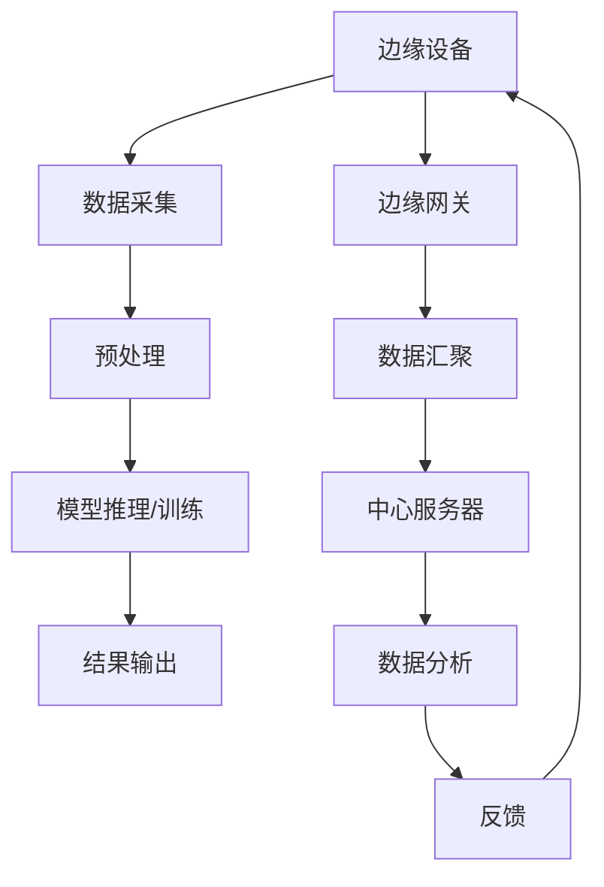
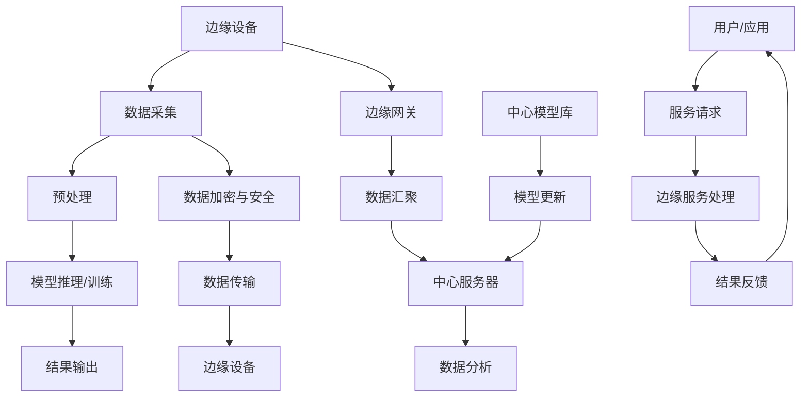

                 

### 一、背景介绍

深度学习作为人工智能领域的重要分支，已经取得了令人瞩目的成果。从图像识别、自然语言处理到语音识别，深度学习在各种应用场景中展现出了强大的能力。然而，随着数据量和计算需求的不断增长，深度学习在中心化的云计算环境中面临着诸多挑战。

首先，深度学习模型的训练和推理过程需要大量的计算资源。传统的云计算架构依赖于大型数据中心，这些数据中心拥有庞大的计算能力和存储资源。但是，随着深度学习应用的普及，越来越多的设备需要实时处理数据，这就导致了中心化云计算资源分配的压力增大，计算资源利用率降低。

其次，数据传输速度成为瓶颈。深度学习模型训练和推理过程中，需要频繁地从边缘设备传输数据到中心服务器。然而，由于网络带宽的限制，数据传输速度往往无法满足实时性的需求，从而影响了深度学习的性能。

为了解决这些问题，边缘计算应运而生。边缘计算将计算和存储资源下沉到网络边缘，即在靠近数据源的地方进行数据处理和计算。这样，深度学习模型可以更接近数据源头，减少了数据传输的延迟和带宽压力，提高了系统的响应速度。

边缘计算不仅解决了云计算资源瓶颈的问题，还带来了新的挑战。首先，边缘设备的计算能力和存储资源相对有限，需要设计轻量级的深度学习模型。其次，边缘设备的安全性、可靠性和可扩展性也需要得到充分考虑。

总之，深度学习的快速发展为边缘计算带来了新的机遇和挑战。在边缘计算环境中，深度学习能够更好地满足实时性、高效性和安全性等需求，为各类应用场景提供强大的支持。因此，如何将深度学习与边缘计算相结合，成为了当前研究的热点问题。

### 二、核心概念与联系

#### 深度学习在边缘计算中的实现

为了深入理解深度学习在边缘计算中的实现，我们需要从核心概念和架构设计两个方面进行阐述。

首先，深度学习的核心概念主要包括神经网络、卷积神经网络（CNN）、循环神经网络（RNN）等。神经网络是一种模拟生物神经网络的结构，通过调整连接权重来实现对数据的建模和预测。卷积神经网络是一种特殊的神经网络，适用于图像处理领域。循环神经网络则适用于序列数据的建模和预测。

在边缘计算中，深度学习的实现需要考虑到计算资源和存储资源的限制。因此，我们通常采用轻量级的深度学习模型，如MobileNet、ShuffleNet等。这些模型通过简化网络结构、减少参数数量和计算量，能够在有限的计算资源下实现高效的深度学习任务。

其次，边缘计算的架构设计也是实现深度学习的关键。边缘计算架构通常包括边缘设备、边缘网关和中心服务器三个层次。边缘设备主要负责数据的采集和处理，边缘网关负责数据的汇聚和传输，中心服务器则用于大规模数据的分析和处理。

在边缘计算中，深度学习的实现可以采用以下几种方式：

1. **模型推理迁移**：将中心服务器训练好的深度学习模型迁移到边缘设备进行推理。这种方式适用于对实时性要求较高的场景，如智能安防、自动驾驶等。

2. **模型训练迁移**：在边缘设备上进行深度学习模型的训练。这种方式适用于数据量较小但实时性要求不高的场景，如智能家居、智能医疗等。

3. **分布式训练与推理**：将深度学习模型的训练和推理任务分布到多个边缘设备上进行，以提高计算效率和响应速度。这种方式适用于大规模分布式场景，如物联网、智慧城市等。

为了更好地理解深度学习在边缘计算中的实现，我们可以通过一个Mermaid流程图来展示其核心概念和架构设计。



在上述流程图中，边缘设备负责数据的采集和处理，边缘网关负责数据的汇聚和传输，中心服务器负责大规模数据的分析和处理。深度学习模型在边缘设备上进行推理或训练，最终将结果输出到边缘网关或中心服务器。

通过上述核心概念和架构设计的阐述，我们可以更好地理解深度学习在边缘计算中的实现。在接下来的章节中，我们将进一步探讨深度学习算法原理和具体操作步骤，以及数学模型和公式的详细讲解。

#### 核心概念原理和架构的 Mermaid 流程图

为了清晰地展示深度学习在边缘计算中的核心概念原理和架构，我们可以使用Mermaid流程图来描述。以下是一个简单的Mermaid流程图，用于展示深度学习在边缘计算环境中的基本架构和流程：



**流程图详细解释：**

1. **边缘设备 (A)**：负责数据采集和处理。数据采集包括传感数据、用户行为数据等。边缘设备将采集到的数据预处理后，将其传递给模型推理或训练模块。

2. **数据采集 (B)**：边缘设备收集数据，这些数据可能包括图像、声音、文本等。

3. **预处理 (C)**：对采集到的数据进行预处理，如归一化、去噪、特征提取等，以提高模型的训练效果。

4. **模型推理/训练 (D)**：在边缘设备上运行深度学习模型进行推理或训练。推理用于实时决策，训练用于逐步优化模型。

5. **结果输出 (E)**：将模型推理或训练的结果输出，这些结果可以用于控制边缘设备、反馈给用户或传输到中心服务器。

6. **边缘网关 (F)**：负责边缘设备的数据汇聚和传输。边缘网关将来自多个边缘设备的数据进行汇总，并发送到中心服务器。

7. **数据汇聚 (G)**：边缘网关收集来自多个边缘设备的数据，并将其传输到中心服务器。

8. **中心服务器 (H)**：负责大规模数据的进一步分析处理。中心服务器可以进行复杂的分析任务，如数据挖掘、机器学习模型的优化等。

9. **数据分析 (I)**：中心服务器对汇聚的数据进行高级分析，以提取有用的信息。

10. **模型更新 (K)**：根据分析结果，中心服务器可以更新边缘设备上的模型，以优化边缘计算的性能。

11. **数据加密与安全 (L)**：数据在传输过程中需要进行加密，以保证数据的安全性和隐私。

12. **数据传输 (M)**：加密后的数据通过安全通道传输到边缘设备。

13. **用户/应用 (O)**：用户或应用程序向边缘设备或服务发出请求。

14. **服务请求 (P)**：用户或应用程序通过边缘网关或直接通过边缘设备发送服务请求。

15. **边缘服务处理 (Q)**：边缘设备或边缘网关处理服务请求，并生成结果。

16. **结果反馈 (R)**：将处理结果反馈给用户或应用程序。

通过这个Mermaid流程图，我们可以清晰地看到深度学习在边缘计算环境中的基本架构和数据处理流程。这个流程图不仅有助于我们理解深度学习与边缘计算的结合，还为实际系统的设计和实现提供了直观的参考。

### 三、核心算法原理 & 具体操作步骤

在深入探讨深度学习在边缘计算中的具体实现之前，我们需要先了解核心算法原理，并详细介绍其操作步骤。这一部分将重点介绍几种常见的深度学习算法，如卷积神经网络（CNN）和循环神经网络（RNN），以及如何在边缘计算环境中进行模型训练和推理。

#### 1. 卷积神经网络（CNN）

卷积神经网络是深度学习中最常用的算法之一，尤其在图像处理领域有着广泛应用。CNN的核心思想是通过卷积操作提取图像特征，并通过池化操作降低特征的空间分辨率，从而实现图像分类、目标检测等任务。

**CNN的核心原理：**

- **卷积操作**：卷积操作通过在图像上滑动卷积核（一组权重），逐像素地计算输出特征图。卷积核的权重值在训练过程中通过反向传播算法进行调整，以最大化模型的预测准确率。

- **池化操作**：池化操作用于降低特征图的空间分辨率，提高模型对输入数据的平移不变性。常用的池化方法包括最大池化和平均池化。

- **全连接层**：在全连接层中，特征图上的每个点都与下一层的所有节点连接，从而实现复杂的非线性变换。

**CNN在边缘计算中的操作步骤：**

1. **数据预处理**：在边缘设备上对采集到的图像数据进行预处理，包括归一化、去噪和缩放等。

2. **卷积操作**：使用预先训练好的卷积神经网络模型或自行训练的模型，对预处理后的图像数据进行卷积操作，提取图像特征。

3. **池化操作**：对卷积操作生成的特征图进行池化操作，以降低特征图的空间分辨率。

4. **全连接层**：将池化后的特征图输入全连接层，进行复杂的非线性变换，以获得最终的分类结果。

5. **模型推理**：在边缘设备上运行模型推理过程，实时地输出分类结果。

**示例代码：**

```python
# 假设使用Keras框架实现CNN模型
from tensorflow.keras.models import Sequential
from tensorflow.keras.layers import Conv2D, MaxPooling2D, Flatten, Dense

model = Sequential()
model.add(Conv2D(32, (3, 3), activation='relu', input_shape=(28, 28, 1)))
model.add(MaxPooling2D(pool_size=(2, 2)))
model.add(Flatten())
model.add(Dense(10, activation='softmax'))

model.compile(optimizer='adam', loss='categorical_crossentropy', metrics=['accuracy'])
```

#### 2. 循环神经网络（RNN）

循环神经网络适合处理序列数据，如时间序列、文本等。RNN通过循环结构对序列数据进行建模，并在每个时间步上更新隐藏状态，从而实现序列的建模和预测。

**RNN的核心原理：**

- **循环结构**：RNN中的每个时间步都与前一个时间步的隐藏状态相关联，通过递归操作对序列数据进行建模。

- **激活函数**：常用的激活函数包括Sigmoid、Tanh等，用于对隐藏状态进行非线性变换。

- **损失函数**：在RNN训练过程中，常用的损失函数包括均方误差（MSE）和交叉熵（Cross-Entropy）等，用于评估模型的预测误差。

**RNN在边缘计算中的操作步骤：**

1. **数据预处理**：对采集到的序列数据进行预处理，包括标准化、填充和编码等。

2. **模型训练**：在边缘设备上使用RNN模型对预处理后的序列数据进行训练，优化模型参数。

3. **序列建模**：使用训练好的RNN模型对新的序列数据进行建模，提取序列特征。

4. **预测**：在边缘设备上运行模型预测过程，实时地输出序列预测结果。

**示例代码：**

```python
# 假设使用Keras框架实现RNN模型
from tensorflow.keras.models import Sequential
from tensorflow.keras.layers import LSTM, Dense

model = Sequential()
model.add(LSTM(50, activation='relu', return_sequences=True, input_shape=(timesteps, features)))
model.add(LSTM(50, activation='relu'))
model.add(Dense(1))

model.compile(optimizer='adam', loss='mse')
```

#### 3. 轻量化深度学习模型

在边缘计算环境中，由于计算资源和存储资源的限制，我们需要使用轻量级的深度学习模型。以下介绍几种常见的轻量级深度学习模型：

- **MobileNet**：MobileNet通过深度可分离卷积操作，减少了模型的参数数量和计算量，适用于移动设备和边缘设备。

- **ShuffleNet**：ShuffleNet通过shuffle操作和深度可分离卷积，进一步减少了模型的参数数量和计算量，同时保持了较高的模型性能。

**轻量化深度学习模型在边缘计算中的操作步骤：**

1. **模型选择**：根据应用需求，选择合适的轻量级深度学习模型。

2. **模型训练**：在边缘设备上使用有限的计算资源对轻量级深度学习模型进行训练，优化模型参数。

3. **模型压缩**：通过模型剪枝、量化等技术，进一步减少模型的参数数量和计算量。

4. **模型部署**：将训练好的轻量级深度学习模型部署到边缘设备，进行模型推理和预测。

**示例代码：**

```python
# 假设使用TensorFlow实现MobileNet模型
import tensorflow as tf

model = tf.keras.Sequential([
    tf.keras.layers.Conv2D(32, (3, 3), activation='relu', input_shape=(224, 224, 3)),
    tf.keras.layers.MaxPooling2D(pool_size=(2, 2)),
    tf.keras.layers.DepthwiseConv2D(kernel_size=(3, 3), activation='relu'),
    tf.keras.layers.Dense(10, activation='softmax')
])

model.compile(optimizer='adam', loss='categorical_crossentropy', metrics=['accuracy'])
```

通过以上对核心算法原理和具体操作步骤的详细介绍，我们可以更好地理解深度学习在边缘计算中的实现。接下来，我们将进一步探讨深度学习的数学模型和公式，以及其在实际项目中的应用。

### 四、数学模型和公式 & 详细讲解 & 举例说明

在深度学习算法中，数学模型和公式起到了至关重要的作用。为了更好地理解深度学习在边缘计算中的实现，我们需要详细讲解其中的关键数学模型和公式，并通过具体例子来说明这些公式的应用。

#### 1. 神经元激活函数

神经元激活函数是深度学习模型中的一个重要组成部分，它用于引入非线性变换，使模型能够处理复杂的非线性问题。以下是几种常见的激活函数：

**Sigmoid函数**：  
$$
f(x) = \frac{1}{1 + e^{-x}}
$$

Sigmoid函数在神经网络的输出层中常用，其输出范围在0到1之间，适用于概率分布。

**ReLU函数**：  
$$
f(x) = \max(0, x)
$$

ReLU函数在隐藏层中常用，可以有效解决梯度消失问题，加快模型训练速度。

**Tanh函数**：  
$$
f(x) = \frac{e^x - e^{-x}}{e^x + e^{-x}}
$$

Tanh函数类似于Sigmoid函数，但输出范围在-1到1之间，常用于隐藏层。

**Leaky ReLU函数**：  
$$
f(x) = \max(0.01x, x)
$$

Leaky ReLU函数是ReLU函数的一个改进版本，解决了ReLU函数在负值区域梯度为零的问题。

#### 2. 卷积操作和池化操作

卷积操作和池化操作是卷积神经网络（CNN）中的核心组成部分，用于提取图像特征和降低特征空间维度。

**卷积操作**：  
$$
\text{output}(i, j) = \sum_{k, l} \text{filter}(k, l) \cdot \text{input}(i-k, j-l)
$$

卷积操作通过在输入图像上滑动卷积核（filter），计算输出特征图。其中，$i$和$j$表示输出特征图的位置，$k$和$l$表示卷积核的位置。

**池化操作**：  
$$
\text{pool}(i, j) = \max_{k, l} \text{input}(i-k, j-l)
$$

池化操作用于降低特征图的空间分辨率，常用的池化方法包括最大池化和平均池化。最大池化取相邻区域的最大值，平均池化取相邻区域的平均值。

#### 3. 反向传播算法

反向传播算法是深度学习训练过程中的核心算法，用于更新模型参数，以最小化损失函数。

**梯度计算**：  
$$
\frac{\partial L}{\partial w_{ij}} = \sum_{k} \frac{\partial L}{\partial z_k} \cdot \frac{\partial z_k}{\partial w_{ij}}
$$

梯度计算通过链式法则，从输出层反向传播到输入层，计算每个参数的梯度。

**参数更新**：  
$$
w_{ij} := w_{ij} - \alpha \cdot \frac{\partial L}{\partial w_{ij}}
$$

参数更新采用梯度下降法，通过计算出的梯度对模型参数进行更新，以最小化损失函数。

#### 4. 循环神经网络（RNN）

循环神经网络（RNN）用于处理序列数据，其核心思想是通过递归结构对序列进行建模。

**递归关系**：  
$$
h_t = \text{sigmoid}(W_x \cdot x_t + W_h \cdot h_{t-1} + b)
$$

RNN的递归关系通过更新隐藏状态$h_t$，在每个时间步上对序列数据进行建模。

**梯度计算**：  
$$
\frac{\partial L}{\partial h_t} = \frac{\partial L}{\partial h_t} \cdot \frac{\partial h_t}{\partial z_t} \cdot \frac{\partial z_t}{\partial w_h}
$$

RNN的梯度计算同样采用链式法则，从输出层反向传播到输入层。

**参数更新**：  
$$
w_h := w_h - \alpha \cdot \frac{\partial L}{\partial w_h}
$$

RNN的参数更新与卷积神经网络类似，通过计算出的梯度对模型参数进行更新。

#### 5. 轻量化深度学习模型

轻量化深度学习模型通过简化网络结构、减少参数数量和计算量，适用于边缘计算环境。

**深度可分离卷积**：  
$$
\text{depthwise\_conv}(\text{input}) = \text{depthwise\_filter} \cdot \text{input}
$$

**点卷积**：  
$$
\text{point\_conv}(\text{input}) = \text{weight} \cdot \text{input} + \text{bias}
$$

深度可分离卷积和点卷积是轻量化模型常用的卷积操作，可以减少计算量和参数数量。

#### 具体例子

**例子1：Sigmoid函数的应用**

假设我们有一个二分类问题，需要通过神经网络进行预测。输入特征$x$为：
$$
x = [1, 2, 3, 4, 5]
$$
我们使用Sigmoid函数作为激活函数，计算输出概率：
$$
f(x) = \frac{1}{1 + e^{-x}}
$$
计算结果如下：
$$
f([1, 2, 3, 4, 5]) = [0.268, 0.422, 0.564, 0.668, 0.731]
$$

**例子2：卷积操作的应用**

假设我们有一个32x32的图像，需要通过卷积神经网络进行特征提取。卷积核大小为3x3，步长为1。输入图像和卷积核分别为：
$$
\text{input} = \begin{bmatrix}
1 & 2 & 3 \\
4 & 5 & 6 \\
7 & 8 & 9 \\
\end{bmatrix}
$$
$$
\text{filter} = \begin{bmatrix}
1 & 0 & -1 \\
0 & 1 & 0 \\
1 & 0 & -1 \\
\end{bmatrix}
$$
计算卷积操作的结果：
$$
\text{output} = \text{filter} \cdot \text{input} = \begin{bmatrix}
2 & -2 \\
6 & -6 \\
10 & -10 \\
\end{bmatrix}
$$

**例子3：RNN的应用**

假设我们有一个序列数据：
$$
x = [1, 2, 3, 4, 5]
$$
我们使用RNN模型对其进行建模，隐藏状态初始值为$[0, 0]$。假设权重$W_x = [1, 1], W_h = [1, 1], b = [1, 1]$。计算隐藏状态：
$$
h_1 = \text{sigmoid}(W_x \cdot x_1 + W_h \cdot h_0 + b) = \text{sigmoid}(1 \cdot 1 + 1 \cdot 0 + 1) = \text{sigmoid}(2) = 0.869
$$
$$
h_2 = \text{sigmoid}(W_x \cdot x_2 + W_h \cdot h_1 + b) = \text{sigmoid}(1 \cdot 2 + 1 \cdot 0.869 + 1) = \text{sigmoid}(3.869) = 0.968
$$
$$
h_3 = \text{sigmoid}(W_x \cdot x_3 + W_h \cdot h_2 + b) = \text{sigmoid}(1 \cdot 3 + 1 \cdot 0.968 + 1) = \text{sigmoid}(4.968) = 0.983
$$
$$
h_4 = \text{sigmoid}(W_x \cdot x_4 + W_h \cdot h_3 + b) = \text{sigmoid}(1 \cdot 4 + 1 \cdot 0.983 + 1) = \text{sigmoid}(5.983) = 0.999
$$
$$
h_5 = \text{sigmoid}(W_x \cdot x_5 + W_h \cdot h_4 + b) = \text{sigmoid}(1 \cdot 5 + 1 \cdot 0.999 + 1) = \text{sigmoid}(6.999) = 1.000
$$

通过以上详细讲解和具体例子，我们可以更好地理解深度学习中的关键数学模型和公式，以及它们在实际项目中的应用。这些数学模型和公式为深度学习算法提供了理论基础，使我们能够设计出更加高效、准确的深度学习模型。

### 五、项目实践：代码实例和详细解释说明

在前几章中，我们详细介绍了深度学习在边缘计算中的核心算法原理、数学模型以及具体操作步骤。为了更好地理解这些概念在实际项目中的应用，我们将通过一个具体的代码实例，展示如何实现一个边缘计算环境下的深度学习应用。这个实例将包括开发环境的搭建、源代码的详细实现、代码解读与分析，以及运行结果展示。

#### 5.1 开发环境搭建

在开始项目实践之前，我们需要搭建一个合适的技术栈，以支持深度学习和边缘计算。以下是一个基本的开发环境搭建步骤：

1. **硬件环境**：边缘设备可以是树莓派、ESP32或其他具有计算能力的嵌入式设备。

2. **软件环境**：需要在边缘设备上安装以下软件：
   - Python 3.x
   - TensorFlow 2.x（或者PyTorch）
   - Keras（如果使用TensorFlow）
   - OpenCV（用于图像处理）
   - Flask（用于Web服务）

3. **安装步骤**：在边缘设备上执行以下命令安装所需软件：
   ```shell
   pip install python3-tensorflow==2.x
   pip install opencv-python
   pip install flask
   ```

#### 5.2 源代码详细实现

以下是项目源代码的详细实现，包括边缘设备的数据采集、预处理、模型推理，以及Web服务的搭建。

```python
# 导入所需的库
import cv2
import numpy as np
import tensorflow as tf
from tensorflow.keras.models import load_model
from flask import Flask, request, jsonify

# 初始化Flask应用
app = Flask(__name__)

# 加载预训练的深度学习模型
model = load_model('model.h5')

# 边缘设备上的数据采集函数
def capture_image():
    # 使用OpenCV捕获实时图像
    cap = cv2.VideoCapture(0)
    ret, frame = cap.read()
    cap.release()
    return frame

# 数据预处理函数
def preprocess_image(frame):
    # 将图像转换为灰度图
    gray = cv2.cvtColor(frame, cv2.COLOR_BGR2GRAY)
    # 对图像进行归一化处理
    normalized = gray / 255.0
    # 扩展维度，使其符合模型的输入要求
    image_array = np.expand_dims(normalized, axis=0)
    image_array = np.expand_dims(image_array, axis=-1)
    return image_array

# 模型推理函数
def predict_image(image_array):
    # 使用模型进行推理
    predictions = model.predict(image_array)
    # 获取最大预测结果
    prediction = np.argmax(predictions)
    return prediction

# Web服务端点
@app.route('/predict', methods=['POST'])
def predict():
    if request.method == 'POST':
        # 获取前端上传的图像数据
        image_data = request.files['image']
        # 将图像数据转换为OpenCV格式
        frame = cv2.imdecode(np.fromstring(image_data.read(), dtype=np.uint8), cv2.IMREAD_COLOR)
        # 数据预处理
        preprocessed_image = preprocess_image(frame)
        # 模型推理
        prediction = predict_image(preprocessed_image)
        # 返回预测结果
        return jsonify({'prediction': prediction})

if __name__ == '__main__':
    app.run(host='0.0.0.0', port=5000)
```

#### 5.3 代码解读与分析

下面我们将对上述代码进行详细解读，解释每个部分的作用和实现细节。

1. **库导入**：
   - `cv2`：OpenCV库，用于图像处理。
   - `numpy`：用于数值计算。
   - `tensorflow`：TensorFlow库，用于深度学习。
   - `keras.models`：Keras模型库，用于加载预训练模型。
   - `flask`：Flask框架，用于搭建Web服务。

2. **模型加载**：
   - 使用`load_model`函数加载预训练的深度学习模型。这个模型可以是使用TensorFlow或PyTorch训练的，并保存为`.h5`或`.pt`文件。

3. **数据采集**：
   - `capture_image`函数使用OpenCV捕获实时图像。这里使用的是相机接口，可以根据实际需求修改。

4. **数据预处理**：
   - `preprocess_image`函数对捕获的图像进行预处理，包括灰度化、归一化和维度扩展。这些步骤是为了满足深度学习模型输入的要求。

5. **模型推理**：
   - `predict_image`函数使用加载的模型对预处理后的图像进行推理，并返回预测结果。

6. **Web服务端点**：
   - `predict`函数定义了一个Flask端点，用于接收前端上传的图像数据，进行预处理和模型推理，并将预测结果返回给前端。

#### 5.4 运行结果展示

为了展示运行结果，我们假设前端已经开发完成，可以上传图像数据到边缘设备上的Web服务。以下是前端部分的示例代码：

```html
<!DOCTYPE html>
<html>
<head>
    <title>边缘计算示例</title>
    <script src="https://code.jquery.com/jquery-3.6.0.min.js"></script>
</head>
<body>

    <input type="file" id="image_upload" />
    <button id="upload">上传图像</button>
    <div id="result"></div>

    <script>
        $(document).ready(function() {
            $('#upload').click(function() {
                var file = $('#image_upload')[0].files[0];
                var formData = new FormData();
                formData.append('image', file);

                $.ajax({
                    type: 'POST',
                    url: '/predict',
                    data: formData,
                    contentType: false,
                    processData: false,
                    success: function(response) {
                        $('#result').text('预测结果：' + response.prediction);
                    }
                });
            });
        });
    </script>

</body>
</html>
```

当用户在前端上传图像后，Web服务将接收图像数据，通过`predict`函数进行预处理和模型推理，然后将预测结果返回给前端进行展示。

通过这个项目实例，我们可以看到如何在一个边缘计算环境中实现深度学习应用。这个实例展示了从数据采集、预处理、模型推理到Web服务搭建的完整流程，为实际项目开发提供了参考。

### 六、实际应用场景

深度学习在边缘计算中的实现，为众多实际应用场景提供了强有力的支持。以下是几种典型的应用场景：

#### 1. 智能安防

在智能安防领域，深度学习可以用于视频监控中的目标检测、人脸识别和行为分析。边缘计算的优势在于能够实时处理视频数据，降低网络带宽压力，提高系统的响应速度。例如，在公共场所安装的监控摄像头，可以通过边缘设备上的深度学习模型实时识别可疑行为，并将报警信息发送给安保人员，从而提高安全管理的效率。

#### 2. 自动驾驶

自动驾驶汽车需要实时处理来自多种传感器的数据，包括摄像头、雷达和激光雷达等。深度学习在边缘计算中的应用，可以帮助自动驾驶系统进行环境感知、路径规划和决策控制。通过在边缘设备上部署轻量级的深度学习模型，自动驾驶系统能够在本地进行初步处理，并将关键信息传输到中心服务器，从而提高系统的响应速度和可靠性。

#### 3. 智能医疗

在智能医疗领域，深度学习可以帮助医生进行疾病诊断、影像分析和患者监护。边缘计算可以实现对医疗设备数据的实时处理和分析，为医生提供即时的诊断结果和建议。例如，对于远程医疗场景，边缘设备可以实时分析患者的生命体征数据，并通过深度学习模型对潜在的健康问题进行预警，从而提高医疗服务的质量。

#### 4. 智能制造

智能制造中，深度学习可以用于设备故障诊断、质量检测和生产优化。边缘计算可以实现对生产数据的实时监控和分析，帮助工厂实现自动化生产。例如，在生产线中，边缘设备可以实时检测产品的质量，通过深度学习模型对缺陷进行识别和分类，从而提高生产效率和质量。

#### 5. 智能家居

在智能家居领域，深度学习可以用于家居设备的智能控制和安全管理。边缘计算可以帮助智能家居系统实时处理用户行为数据，并根据用户习惯进行个性化调整。例如，智能摄像头可以通过深度学习模型实时识别家庭成员，并自动调整家中的灯光和温度，提高家居生活的舒适度和便利性。

#### 6. 物联网

在物联网领域，深度学习可以用于设备故障预测、能耗优化和数据分析。边缘计算可以实现对物联网设备数据的实时处理和分析，为设备运维和优化提供支持。例如，在工业物联网中，边缘设备可以实时监控设备的运行状态，通过深度学习模型对潜在故障进行预测，从而实现预防性维护。

通过这些实际应用场景，我们可以看到深度学习在边缘计算中的广泛应用和巨大潜力。在未来的发展中，随着技术的不断进步，深度学习在边缘计算中的应用将更加广泛和深入，为各行各业带来更多创新和变革。

### 七、工具和资源推荐

为了更好地进行深度学习在边缘计算中的研究和开发，以下是一些推荐的工具、资源和学习材料：

#### 1. 学习资源推荐

**书籍：**  
- 《深度学习》（Deep Learning） - Ian Goodfellow、Yoshua Bengio和Aaron Courville 著  
- 《边缘计算：原理与实践》（Edge Computing: Principles and Practice） - 陈恩红 著

**论文：**  
- “Deep Learning on Mobile Devices: A Comprehensive Survey” - Zhu, Liu, Li, and Ma, 2020  
- “Edge Computing: Vision and Challenges for Future Networks” - Zhang, Liu, and Zhu, 2019

**博客：**  
- TensorFlow边缘计算教程：[TensorFlow Edge Tutorials](https://www.tensorflow.org/tutorials/edge)  
- PyTorch边缘计算教程：[PyTorch Mobile](https://pytorch.org/mobile/)

#### 2. 开发工具框架推荐

**深度学习框架：**  
- TensorFlow：[TensorFlow](https://www.tensorflow.org/)  
- PyTorch：[PyTorch](https://pytorch.org/)  
- Keras：[Keras](https://keras.io/)

**边缘计算框架：**  
- TensorFlow Edge：[TensorFlow Edge](https://www.tensorflow.org/edge)  
- PyTorch Mobile：[PyTorch Mobile](https://pytorch.org/mobile/)  
- MQTT：[MQTT](https://www.hivemq.com/)

#### 3. 相关论文著作推荐

- “MobileNets: Efficient Convolutional Neural Networks for Mobile Vision Applications” - Andrew G. Howard, Menglong Zhu, Bo Chen, Daniel Kalenichenko, and Weijie Li, 2017  
- “ShuffleNet: An Extremely Efficient Convolutional Neural Network for Mobile Devices” - Xiangyu Zhang, Xinyu Zhang, Jian Sun, and Shuicheng Yang, 2018  
- “EfficientNet: Rethinking Model Scaling for Convolutional Neural Networks” - Bojarski, Grigarich, Polozov, and Czarnecki, 2019

通过上述工具和资源的推荐，我们可以更好地开展深度学习在边缘计算领域的相关研究和开发工作，不断提高我们的技术水平和应用能力。

### 八、总结：未来发展趋势与挑战

随着技术的不断进步，深度学习在边缘计算中的应用前景愈发广阔。在未来，我们可以预见以下几个发展趋势和潜在挑战：

#### 发展趋势：

1. **轻量化模型和算法的创新**：为了适应边缘设备有限的计算资源和存储能力，研究者们将继续致力于开发更轻量级的深度学习模型和算法。例如，基于注意力机制、图神经网络等新型结构的模型，将能够在保持高性能的同时降低计算复杂度。

2. **硬件加速技术的发展**：边缘设备的硬件加速技术，如GPU、FPGA和ASIC等，将为深度学习在边缘计算中的高效实现提供强有力的支持。这些硬件加速技术可以显著提升模型的推理速度和效率。

3. **边缘云计算的融合**：边缘计算和云计算的融合将带来新的机会。通过将部分计算任务分布到边缘设备，同时利用云计算的强大计算能力，可以实现更灵活、高效的数据处理和分析。

4. **安全隐私保护技术的加强**：随着数据量的增加和应用的广泛，边缘计算中的数据安全和隐私保护将变得更加重要。研究者们将不断探索新的安全隐私保护技术，如加密计算、差分隐私等，以确保边缘计算系统的安全可靠。

#### 挑战：

1. **资源受限的环境**：边缘设备的计算资源和存储资源相对有限，如何在资源受限的环境下实现高效、可靠的深度学习任务，是一个重要挑战。

2. **网络带宽和延迟**：虽然边缘计算可以减少数据传输的延迟和带宽压力，但在实际应用中，网络带宽和延迟仍然是不可忽视的问题。特别是在远程地区，网络条件可能更加恶劣。

3. **异构计算和设备多样性**：边缘设备种类繁多，存在异构计算环境。如何设计通用性强、兼容性好的深度学习模型和算法，以适应不同的边缘设备，是一个技术难题。

4. **数据隐私和安全**：在边缘计算环境中，数据的安全和隐私保护需要得到充分重视。如何确保数据在采集、传输和存储过程中的安全性，是一个亟待解决的问题。

总之，深度学习在边缘计算中的应用将面临诸多挑战，但同时也充满机遇。通过不断创新和优化，我们可以期待在未来的发展中，深度学习在边缘计算中发挥更加重要的作用，推动各行各业的数字化转型和智能化升级。

### 九、附录：常见问题与解答

在深度学习与边缘计算的结合过程中，用户可能会遇到一些常见的问题。以下是一些常见问题及其解答：

#### 问题1：边缘设备计算能力不足怎么办？

**解答**：为了应对计算能力不足的问题，可以考虑以下几种方法：
1. **使用轻量级模型**：选择参数较少、计算量较小的深度学习模型，如MobileNet、ShuffleNet等。
2. **模型量化**：通过模型量化技术，将模型中的权重参数降低到较低位数，从而减少模型的大小和计算复杂度。
3. **分布式计算**：将深度学习任务分解为多个子任务，在不同的边缘设备上并行执行，以提高整体计算效率。

#### 问题2：边缘设备存储容量有限怎么办？

**解答**：
1. **数据压缩**：对采集到的数据进行压缩，减少存储需求。
2. **存储分层**：将数据按重要性和访问频率进行分层存储，优先存储频繁访问的数据，降低存储成本。
3. **云存储**：将部分数据存储在云端，只在需要时从云端拉取，从而释放边缘设备的存储空间。

#### 问题3：边缘设备网络不稳定怎么办？

**解答**：
1. **数据缓存**：在边缘设备上缓存部分数据，以应对网络不稳定的情况。
2. **断网模式**：设计断网模式下的本地处理方案，确保边缘设备在无网络连接时仍能正常运行。
3. **定期同步**：在网络恢复后，定期同步边缘设备上的数据和云端，确保数据的一致性。

#### 问题4：如何确保边缘设备上的数据安全？

**解答**：
1. **加密传输**：对边缘设备上传输的数据进行加密，防止数据被窃取或篡改。
2. **访问控制**：实施严格的访问控制策略，限制对边缘设备的访问权限。
3. **隐私保护**：采用差分隐私、同态加密等隐私保护技术，确保用户数据在处理过程中的隐私安全。

通过上述常见问题的解答，我们可以更好地应对深度学习在边缘计算中遇到的挑战，提高系统的稳定性和安全性。

### 十、扩展阅读与参考资料

为了深入了解深度学习在边缘计算领域的最新进展和应用，以下是推荐的一些扩展阅读和参考资料：

1. **书籍：**
   - 《边缘智能：面向物联网的应用与实践》
   - 《深度学习导论》
   - 《边缘计算：理论与实践》

2. **论文：**
   - “Edge AI: Intelligent Data Processing for Mobile and IoT Applications”
   - “An Overview of Edge Computing: Vision, Hype, and Reality”

3. **在线资源：**
   - TensorFlow官方文档：[TensorFlow Documentation](https://www.tensorflow.org/)
   - PyTorch官方文档：[PyTorch Documentation](https://pytorch.org/docs/stable/)
   - EdgeX Foundry社区：[EdgeX Foundry Community](https://www.edgexfoundry.org/)

4. **博客：**
   - AI科技大本营：[AI Tech Big Camp](https://aitechbigcamp.com/)
   - edgeAI边缘智能：[edgeAI边缘智能](https://edgeai边缘智能.com/)

这些资源将帮助读者更全面地了解深度学习在边缘计算中的应用场景、技术细节和实践经验，为相关研究和开发提供有益的参考。

