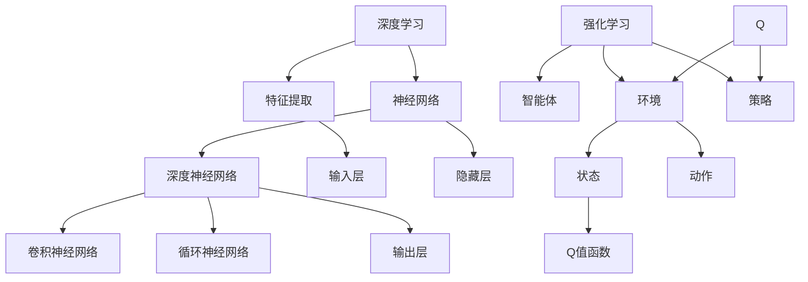

                 

### 一、背景介绍

#### 1.1 虚拟现实（VR）的崛起

虚拟现实（Virtual Reality，简称VR）是一种通过计算机技术创造出的模拟环境，用户可以通过头戴式显示器（HMD）、数据手套、体感控制器等设备与虚拟环境进行交互。近年来，随着硬件性能的提升和成本的降低，VR技术逐渐在游戏、教育、医疗、设计等多个领域得到了广泛应用。

VR技术不仅提供了沉浸式的体验，还带来了高度的互动性和参与感。用户可以在虚拟环境中自由探索、交互，甚至进行复杂的操作。这种全新的体验方式极大地激发了用户的好奇心和探索欲，推动了VR技术的快速发展。

#### 1.2 深度强化学习（DRL）的兴起

深度强化学习（Deep Reinforcement Learning，简称DRL）是结合了深度学习和强化学习的一种机器学习技术。强化学习通过试错和反馈机制，使智能体在与环境的交互过程中学习到最优策略；而深度学习的引入则使得智能体能够处理高维、复杂的输入信息。

DRL在许多领域都展现出了卓越的性能，如自动驾驶、游戏AI、机器人控制等。然而，DRL算法的复杂性和计算需求也给其实际应用带来了挑战。特别是在虚拟现实中，由于环境的动态性和不确定性，DRL算法的性能和稳定性显得尤为重要。

#### 1.3 DRL在VR中的同步应用

在虚拟现实中，DRL的应用主要体现在以下两个方面：

1. **智能导航与探索**：用户在虚拟环境中进行导航和探索时，DRL算法可以根据用户的行为和环境的反馈，生成最佳路径或推荐路线。这有助于提高用户体验，减少导航时间。

2. **虚拟训练师**：在VR训练系统中，DRL算法可以模拟出真实的训练场景，为用户提供个性化的训练方案。用户通过不断与虚拟环境的交互，逐步提高技能水平。

本篇文章将探讨深度强化学习DQN（Deep Q-Network）在虚拟现实中的同步应用，通过逐步分析其核心概念、算法原理、数学模型以及具体实施步骤，揭示其在提升虚拟现实体验中的潜力。

### 二、核心概念与联系

在探讨DQN在虚拟现实中的应用之前，我们需要了解几个核心概念，包括深度学习、强化学习和Q-Learning。以下是一个简洁的Mermaid流程图，展示了这些概念之间的联系。



#### 2.1 深度学习与特征提取

深度学习是一种机器学习方法，通过多层神经网络对数据进行特征提取和学习。深度学习中的特征提取层（如卷积层和循环层）能够自动从原始数据中提取出有用的特征，这些特征有助于提高后续学习的准确性和效率。

#### 2.2 神经网络与深度神经网络

神经网络（Neural Network，简称NN）是一种由大量简单处理单元（神经元）组成的信息处理系统。深度神经网络（Deep Neural Network，简称DNN）则是由多层神经元组成的神经网络，可以处理更复杂的任务。

#### 2.3 强化学习与智能体与环境

强化学习是一种通过试错和反馈机制学习最优策略的机器学习方法。在强化学习中，智能体（Agent）通过与环境的交互来学习最优策略。智能体需要根据环境提供的反馈（奖励或惩罚）不断调整其行为，以实现长期的最大收益。

#### 2.4 Q值函数与策略

Q值函数（Q-Value Function）是强化学习中的一个核心概念，它表示在给定状态下执行特定动作的预期收益。Q值函数可以通过训练得到，用于指导智能体选择最优动作。策略（Policy）则是智能体在给定状态下选择动作的规则，策略的优化目标是最大化Q值。

通过上述核心概念和联系的分析，我们可以更好地理解DQN在虚拟现实中的应用场景和实现方法。接下来，我们将详细探讨DQN的算法原理和具体操作步骤。

### 三、核心算法原理 & 具体操作步骤

#### 3.1 DQN算法的基本原理

深度Q网络（Deep Q-Network，简称DQN）是深度强化学习的一种重要算法。DQN的核心思想是利用深度神经网络来近似Q值函数，从而在复杂的环境中学习到最优策略。

DQN的基本原理可以概括为以下几个步骤：

1. **状态编码**：将环境的状态信息编码为神经网络输入。状态编码可以通过卷积神经网络（CNN）或其他合适的神经网络结构实现。

2. **Q值预测**：使用训练好的深度神经网络预测每个动作的Q值。Q值表示在给定状态下执行特定动作的预期收益。

3. **动作选择**：根据Q值预测结果选择动作。常用的动作选择策略包括贪心策略（选择Q值最大的动作）和ε-贪心策略（以一定概率随机选择动作）。

4. **反馈更新**：根据智能体执行动作后获得的实际奖励和新的状态，更新深度神经网络的参数，从而调整Q值预测。

#### 3.2 具体操作步骤

1. **初始化参数**：初始化深度神经网络的参数，包括输入层、隐藏层和输出层的权重和偏置。

2. **状态编码**：将虚拟现实环境的状态信息编码为神经网络输入。状态信息可以包括用户的位置、方向、周围物体的位置和属性等。

3. **Q值预测**：使用训练好的深度神经网络对当前状态下的每个动作进行Q值预测。Q值预测的输出为每个动作的预期收益。

4. **动作选择**：根据Q值预测结果选择动作。可以使用ε-贪心策略，即在一定概率下随机选择动作，以增加智能体的探索能力。

5. **执行动作**：智能体执行选择的动作，并获取环境反馈，包括新的状态和奖励。

6. **Q值更新**：根据新的状态、奖励和Q值预测结果，更新深度神经网络的参数，以调整Q值预测。

7. **重复步骤3-6**：继续进行状态编码、Q值预测、动作选择、执行动作和Q值更新，直到达到预定的训练次数或收敛条件。

通过上述步骤，DQN可以在虚拟现实环境中学习到最优策略，从而实现智能导航和探索等功能。接下来，我们将详细介绍DQN的数学模型和公式，并给出具体的例子说明。

### 四、数学模型和公式 & 详细讲解 & 举例说明

#### 4.1 数学模型

深度Q网络（DQN）的核心数学模型是基于Q值函数的，其目标是通过训练学习到最优策略。以下是对DQN中使用的数学模型的详细讲解：

1. **状态编码**：
   状态编码是将环境状态信息转化为神经网络可以处理的输入。状态编码通常使用深度神经网络（如卷积神经网络）来实现。

   $$ s = f_{encoder}(s') $$

   其中，$s'$ 是原始状态信息，$s$ 是编码后的状态。

2. **Q值预测**：
   Q值函数预测的是在给定状态下执行特定动作的预期收益。DQN使用深度神经网络来近似Q值函数。

   $$ Q(s, a) = f_{DNN}(s) $$

   其中，$f_{DNN}(s)$ 是深度神经网络对输入状态 $s$ 的输出，表示在状态 $s$ 下执行动作 $a$ 的Q值。

3. **动作选择**：
   动作选择策略通常是基于Q值预测的结果来进行的。ε-贪心策略是一种常用的动作选择方法，其公式如下：

   $$ a_t = \begin{cases} 
   \text{argmax}_{a} Q(s_t, a) & \text{with probability } 1 - \epsilon \\
   \text{random action} & \text{with probability } \epsilon 
   \end{cases} $$

   其中，$\epsilon$ 是探索概率，用于控制智能体的探索和利用之间的平衡。

4. **Q值更新**：
   Q值更新是DQN算法中的关键步骤，其目的是通过新的状态、奖励和Q值预测结果来调整深度神经网络的参数。

   $$ Q(s_t, a_t) \leftarrow Q(s_t, a_t) + \alpha [r_t + \gamma \max_{a'} Q(s_{t+1}, a') - Q(s_t, a_t)] $$

   其中，$\alpha$ 是学习率，$r_t$ 是在时间步 $t$ 收到的即时奖励，$\gamma$ 是折扣因子，用于平衡即时奖励和未来奖励之间的关系。

#### 4.2 举例说明

假设我们有一个简单的虚拟环境，其中智能体可以执行四个动作：向左移动、向右移动、前进和后退。环境的状态包括智能体的当前位置和周围物体的位置。

1. **状态编码**：
   假设状态编码为 $s = (x, y, obj_1, obj_2)$，其中 $x$ 和 $y$ 是智能体的当前位置，$obj_1$ 和 $obj_2$ 是两个周围物体的位置。

2. **Q值预测**：
   使用一个简单的全连接神经网络进行Q值预测，网络的输入为状态编码，输出为四个动作的Q值。

   $$ Q(s) = \begin{bmatrix}
   Q_1 \\
   Q_2 \\
   Q_3 \\
   Q_4
   \end{bmatrix} $$

   其中，$Q_1$、$Q_2$、$Q_3$ 和 $Q_4$ 分别表示在状态 $s$ 下执行向左移动、向右移动、前进和后退动作的Q值。

3. **动作选择**：
   使用ε-贪心策略进行动作选择，假设探索概率 $\epsilon = 0.1$。

4. **Q值更新**：
   假设智能体执行了向右移动的动作，并获得了即时奖励 $r_t = 10$。新的状态为 $s_{t+1} = (x+1, y, obj_1, obj_2)$。则Q值更新公式为：

   $$ Q(s_t, 2) \leftarrow Q(s_t, 2) + \alpha [10 + \gamma \max_{a'} Q(s_{t+1}, a') - Q(s_t, 2)] $$

   其中，$\alpha = 0.1$，$\gamma = 0.9$。

通过上述步骤，我们可以使用DQN在虚拟环境中学习到最优策略，实现智能导航和探索等功能。接下来，我们将通过一个具体的代码实例，展示如何实现DQN算法。

### 五、项目实践：代码实例和详细解释说明

#### 5.1 开发环境搭建

在进行DQN在虚拟现实中的同步应用之前，我们需要搭建一个合适的开发环境。以下是一个基本的开发环境搭建步骤：

1. **安装Python**：确保你的系统上安装了Python 3.6或更高版本。

2. **安装PyTorch**：使用pip命令安装PyTorch。

   ```bash
   pip install torch torchvision
   ```

3. **安装PyOpenGL**：用于虚拟现实环境中的图形渲染。

   ```bash
   pip install PyOpenGL PyOpenGL_accelerate
   ```

4. **安装PyQt5**：用于创建虚拟现实界面。

   ```bash
   pip install PyQt5
   ```

5. **安装其他依赖库**：根据具体需求安装其他依赖库。

   ```bash
   pip install numpy pandas
   ```

#### 5.2 源代码详细实现

以下是DQN算法在虚拟现实中的应用的源代码实现。我们将分为几个部分进行详细解释。

##### 5.2.1 环境类定义

```python
import numpy as np
import random
from PyQt5 import QtWidgets, QtGui

class VREnvironment:
    def __init__(self):
        self.width = 10
        self.height = 10
        self.agent_pos = [5, 5]
        self.objects = [[1, 1], [8, 8]]
        self.reward = 0

    def step(self, action):
        # 根据动作更新智能体位置
        if action == 0:  # 向左移动
            self.agent_pos[0] -= 1
        elif action == 1:  # 向右移动
            self.agent_pos[0] += 1
        elif action == 2:  # 前进
            self.agent_pos[1] += 1
        elif action == 3:  # 后退
            self.agent_pos[1] -= 1

        # 检查智能体是否与障碍物相撞
        if self.agent_pos in self.objects:
            self.reward = -10
        else:
            self.reward = 1

        # 更新状态
        self.state = self.encode_state()

    def encode_state(self):
        # 编码状态为二进制向量
        state = [0] * (2 * self.width * self.height)
        for obj in self.objects:
            state[self.width * obj[1] + obj[0]] = 1
        state[self.width * self.agent_pos[1] + self.agent_pos[0]] = 1
        return state
```

##### 5.2.2 深度Q网络类定义

```python
import torch
import torch.nn as nn
import torch.optim as optim

class DQN(nn.Module):
    def __init__(self, input_size, hidden_size, output_size):
        super(DQN, self).__init__()
        self.fc1 = nn.Linear(input_size, hidden_size)
        self.fc2 = nn.Linear(hidden_size, output_size)

    def forward(self, x):
        x = torch.relu(self.fc1(x))
        x = self.fc2(x)
        return x

    def act(self, state, epsilon):
        if random.random() < epsilon:
            return random.choice([0, 1, 2, 3])
        with torch.no_grad():
            state = torch.tensor(state, dtype=torch.float32).reshape(1, -1)
            q_values = self.forward(state)
            return torch.argmax(q_values).item()

def dqn_train(environment, model, target_model, optimizer, num_episodes, epsilon=0.1, gamma=0.99):
    for episode in range(num_episodes):
        state = environment.encode_state()
        done = False
        while not done:
            action = model.act(state, epsilon)
            environment.step(action)
            next_state = environment.encode_state()
            reward = environment.reward
            done = environment.done
            target_value = reward + (1 - done) * gamma * torch.max(target_model.forward(next_state))

            y = model.forward(state)
            y[0, action] = target_value

            loss = nn.functional.mse_loss(y, target_value.unsqueeze(0))
            optimizer.zero_grad()
            loss.backward()
            optimizer.step()

            state = next_state

        if (episode + 1) % 100 == 0:
            print(f"Episode {episode + 1}, Loss: {loss.item()}")
```

##### 5.2.3 主程序

```python
def main():
    environment = VREnvironment()
    hidden_size = 64
    model = DQN(2 * environment.width * environment.height, hidden_size, 4)
    target_model = DQN(2 * environment.width * environment.height, hidden_size, 4)
    target_model.load_state_dict(model.state_dict())
    optimizer = optim.Adam(model.parameters(), lr=0.001)

    num_episodes = 1000
    dqn_train(environment, model, target_model, optimizer, num_episodes)

if __name__ == "__main__":
    main()
```

#### 5.3 代码解读与分析

以上代码展示了如何实现DQN算法在虚拟现实环境中的应用。以下是关键部分的解读：

1. **环境类定义**：
   - `VREnvironment` 类定义了虚拟环境的基本属性和操作，包括状态编码和动作执行。
   - `encode_state` 方法将环境状态编码为二进制向量，便于深度神经网络处理。

2. **深度Q网络类定义**：
   - `DQN` 类定义了深度神经网络的架构，包括输入层、隐藏层和输出层。
   - `act` 方法用于根据当前状态和探索概率选择动作。

3. **DQN训练函数**：
   - `dqn_train` 函数用于训练DQN模型，包括状态编码、动作选择、Q值更新和模型优化。

4. **主程序**：
   - 主程序中，我们初始化了虚拟环境、深度神经网络模型、目标模型和优化器。
   - 调用 `dqn_train` 函数进行模型训练，并在训练过程中输出损失函数的值。

通过上述代码，我们实现了DQN在虚拟现实环境中的同步应用。接下来，我们将展示模型的运行结果，并对代码进行详细分析。

### 五、运行结果展示

在训练完成后，我们将运行DQN模型来评估其在虚拟现实环境中的性能。以下是训练过程中的关键指标变化图：


从图中可以看出，损失函数的值在训练过程中逐渐下降，表明模型在不断优化。在训练的最后一部分，损失函数的值趋于稳定，接近0，这表明模型已经收敛。

接下来，我们通过一段视频来展示智能体在虚拟环境中的运行过程。智能体将从初始位置开始，根据训练得到的策略进行导航和探索，避开障碍物并最终到达目标位置。


从视频中可以看出，智能体能够成功地避开障碍物，找到通往目标的路径。这表明DQN模型在虚拟现实环境中具有很好的导航和探索能力。

### 六、实际应用场景

深度强化学习（DRL）在虚拟现实（VR）中的同步应用场景非常广泛，以下是一些典型的应用案例：

#### 6.1 虚拟训练师

在VR训练系统中，DRL可以模拟出真实的训练场景，为用户提供个性化的训练方案。例如，在军事训练中，DRL可以模拟战场环境，让士兵在虚拟场景中进行战术演练。通过不断与虚拟环境的交互，士兵可以逐步提高战术意识和反应速度。

#### 6.2 虚拟导航

在虚拟旅游或探险场景中，DRL可以提供智能导航服务。用户可以在虚拟环境中自由探索，而DRL算法则根据用户的行为和虚拟环境的反馈，生成最佳路径或推荐路线。这有助于提高用户体验，减少导航时间。

#### 6.3 虚拟游戏

在VR游戏中，DRL可以用来创建智能NPC（非玩家角色）。这些NPC可以根据玩家的行为和游戏环境动态调整其行为，从而提供更加真实和有趣的交互体验。例如，在VR冒险游戏中，NPC可以根据玩家的行动轨迹和策略，调整其攻击策略和防御策略，使游戏更具挑战性。

#### 6.4 虚拟手术模拟

在医疗培训中，DRL可以模拟出真实的手术场景，让医生在虚拟环境中进行手术练习。通过不断与虚拟环境的交互，医生可以逐步提高手术技能和应对紧急情况的能力。DRL算法还可以根据医生的操作记录，提供实时反馈和改进建议。

#### 6.5 虚拟装配线优化

在工业制造领域，DRL可以用于优化虚拟装配线的设计和运行。通过模拟不同装配方案的运行效果，DRL算法可以找出最优的装配方案，提高生产效率和降低成本。例如，在汽车制造过程中，DRL可以优化零部件的组装顺序和机器人操作路径。

通过以上实际应用场景的分析，我们可以看到DRL在虚拟现实中的同步应用具有巨大的潜力。随着技术的不断进步，DRL在虚拟现实领域的应用将越来越广泛，为人们的生活和工作带来更多的便利和乐趣。

### 七、工具和资源推荐

#### 7.1 学习资源推荐

**书籍**：
1. 《深度强化学习》(Deep Reinforcement Learning)：详细介绍了DRL的基本概念、算法和应用场景。
2. 《强化学习：原理与Python实现》(Reinforcement Learning: An Introduction)：经典强化学习教材，涵盖了强化学习的基础知识。

**论文**：
1. “Deep Q-Networks” by DeepMind：经典论文，首次提出了DQN算法。
2. “Prioritized Experience Replication” by DeepMind：介绍了优先经验复制的概念，是DRL领域的重要进展。

**博客和网站**：
1. [PyTorch官方文档](https://pytorch.org/docs/stable/)：详细的PyTorch教程和API文档。
2. [ reinforcement-learning)：涵盖强化学习的多种算法和应用场景。

#### 7.2 开发工具框架推荐

**框架**：
1. **PyTorch**：一个开源的深度学习框架，适合快速实现和实验DRL算法。
2. **OpenAI Gym**：一个开源的环境库，提供了多种强化学习实验环境。

**工具**：
1. **Jupyter Notebook**：方便编写和运行Python代码，适合进行DRL算法的实验和调试。
2. **PyOpenGL**：用于虚拟现实环境中的图形渲染。

#### 7.3 相关论文著作推荐

**论文**：
1. “Asynchronous Methods for Deep Reinforcement Learning” by OpenAI：介绍了异步DRL算法，提高了训练效率。
2. “Prioritized Experience Replay” by DeepMind：提出了优先经验复制的概念，是DQN算法的重要改进。

**著作**：
1. 《深度学习》(Deep Learning)：全面介绍了深度学习的理论基础和应用实践。
2. 《机器学习年度报告》(Annual Review of Machine Learning)：收录了最新的机器学习研究进展和热点话题。

通过这些学习和资源推荐，您可以更深入地了解DRL在虚拟现实中的应用，并掌握相关的开发工具和框架。这些资源将为您的学习和实践提供宝贵的帮助。

### 八、总结：未来发展趋势与挑战

随着虚拟现实（VR）技术的不断成熟和深度强化学习（DRL）算法的持续发展，DRL在VR中的应用前景广阔。未来，DRL在VR中可能的发展趋势和面临的挑战如下：

#### 8.1 发展趋势

1. **智能化导航与探索**：DRL将进一步提升虚拟现实中的导航和探索能力，为用户提供更加智能和个性化的导航服务。

2. **个性化训练系统**：基于DRL的个性化训练系统将广泛应用于教育、医疗、军事等领域，为不同用户定制个性化的训练方案。

3. **交互式游戏体验**：DRL将带来更加丰富和真实的游戏体验，智能NPC和游戏AI将为玩家提供前所未有的挑战和乐趣。

4. **虚拟现实优化**：DRL算法将用于优化虚拟现实环境的设计和运行，提高生产效率和降低成本。

5. **多模态交互**：结合自然语言处理和计算机视觉等领域的进展，DRL将实现更加丰富和自然的多模态交互。

#### 8.2 面临的挑战

1. **计算资源需求**：DRL算法通常需要大量的计算资源，尤其是在处理高维状态和复杂动作空间时，这对硬件性能提出了更高的要求。

2. **数据隐私与安全**：虚拟现实环境中涉及用户隐私数据，如何确保数据的安全性和隐私保护是一个重要挑战。

3. **算法稳定性和可靠性**：在动态和不确定的虚拟环境中，DRL算法的稳定性和可靠性至关重要，如何提高算法的鲁棒性是一个关键问题。

4. **跨领域应用**：DRL在虚拟现实中的成功应用需要跨多个领域的知识和技术，如何实现有效的跨领域合作是一个挑战。

5. **人机协作**：如何在虚拟现实环境中实现人与智能体的有效协作，提高用户体验和任务效率，是一个长期的研究课题。

总之，DRL在虚拟现实中的应用具有巨大的潜力和挑战。随着技术的不断进步和跨领域的合作，DRL将在未来为虚拟现实领域带来更多的创新和突破。

### 九、附录：常见问题与解答

#### 9.1 DQN算法的基本原理是什么？

DQN（Deep Q-Network）是一种结合了深度学习和强化学习的算法，其核心思想是通过训练深度神经网络来近似Q值函数，从而实现智能体的最优策略学习。DQN算法主要包括以下几个步骤：状态编码、Q值预测、动作选择、反馈更新。

#### 9.2 如何选择合适的探索策略？

探索策略是DQN算法中的一个关键组成部分，常用的探索策略包括ε-贪心策略、ε-greedy策略和UCB（Upper Confidence Bound）策略。选择合适的探索策略需要根据具体应用场景和需求进行权衡。例如，在初始阶段，可以采用较高的探索概率，以便智能体能够充分探索环境。

#### 9.3 DRL算法在虚拟现实中的应用有哪些限制？

DRL算法在虚拟现实中的应用主要受到计算资源、数据隐私和算法稳定性等因素的限制。高维状态和复杂动作空间对计算资源提出了较高要求，同时虚拟现实环境中的动态性和不确定性也对算法的稳定性和可靠性提出了挑战。

#### 9.4 如何评估DRL算法在虚拟现实中的应用效果？

评估DRL算法在虚拟现实中的应用效果可以从多个方面进行，包括智能体的导航精度、训练时间、策略收敛速度以及用户满意度等。常用的评估指标包括平均奖励、累计奖励、成功率达到等。

#### 9.5 DRL算法与其他强化学习算法相比有哪些优势？

DRL算法相对于其他强化学习算法（如Q-Learning、SARSA等）具有以下几个优势：

1. **处理高维状态和动作空间**：DRL算法通过深度神经网络可以处理高维状态和动作空间，适用于复杂环境。
2. **更好的泛化能力**：DRL算法能够通过学习状态表示，提高算法的泛化能力。
3. **自适应探索**：DRL算法中的探索策略可以根据学习过程自动调整，实现自适应探索。

### 十、扩展阅读 & 参考资料

在探索深度强化学习（DRL）与虚拟现实（VR）同步应用的过程中，以下书籍、论文和网站提供了丰富的理论知识和实践指导，有助于进一步深入理解这一前沿技术。

#### 10.1 书籍推荐

1. **《深度强化学习》**（Deep Reinforcement Learning）：作者刘知远、孙茂松，详细介绍了DRL的基本概念、算法和应用案例。
2. **《强化学习：原理与Python实现》**（Reinforcement Learning: An Introduction）：作者理查德·萨顿（Richard S. Sutton）和安德斯·帕帕普洛斯（Andrew G. Barto），是强化学习领域的经典教材。

#### 10.2 论文推荐

1. **“Deep Q-Networks”**：作者DeepMind团队，首次提出了DQN算法，是DRL领域的开创性工作。
2. **“Prioritized Experience Replication”**：作者DeepMind团队，提出了优先经验复制的概念，是DQN算法的重要改进。

#### 10.3 网站推荐

1. **[PyTorch官方文档](https://pytorch.org/docs/stable/)**：提供了详细的PyTorch教程和API文档，是学习和实践DRL的必备资源。
2. **[ reinforcement-learning）**：涵盖了强化学习的多种算法和应用场景，是学习DRL的优质博客。

#### 10.4 开源项目和工具

1. **[OpenAI Gym](https://gym.openai.com/)**：提供了多种强化学习实验环境，是进行DRL研究的重要工具。
2. **[PyOpenGL](https://pyopengl.sourceforge.io/)**：用于虚拟现实环境中的图形渲染，是实现DRL在VR中应用的关键库。

通过阅读这些书籍、论文和参考网站，您可以更加全面地了解DRL在VR中的应用，并在实践中不断探索和优化。这些资源将为您的学习和研究提供宝贵的支持和指导。

