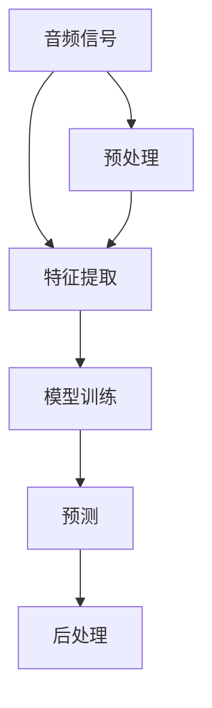

                 

### 1. 背景介绍

音频数据处理作为现代信息技术的重要组成部分，已经广泛应用于各类领域，如语音识别、语音合成、音频增强、音乐分析等。随着人工智能技术的快速发展，特别是深度学习算法的突破，音频数据处理技术取得了显著进步。深度学习模型通过大规模数据训练，能够自动提取音频信号中的复杂特征，实现高精度、高效能的音频识别与处理。

本文将围绕音频数据处理这一主题，重点探讨深度学习与声音识别方面的核心算法原理、数学模型、项目实践以及应用场景。通过逐步分析推理，旨在为读者呈现这一领域的深度见解与实用知识。

首先，我们需要了解音频数据处理的基本概念和核心任务。音频数据处理涉及从原始音频信号中提取有用的信息，并对其进行相应的处理和转换。核心任务包括音频信号预处理、特征提取、模型训练、预测和后处理等。每个任务都需要不同的技术和算法支持，而深度学习则为这些任务提供了强大的工具。

其次，本文将介绍深度学习在音频数据处理中的核心算法原理。深度学习通过多层神经网络模型，能够自动学习并提取音频信号中的高级特征，从而实现高效的音频识别与处理。具体算法包括卷积神经网络（CNN）、循环神经网络（RNN）、长短时记忆网络（LSTM）等。我们将逐步分析这些算法的原理、优势和适用场景。

在核心算法原理的基础上，本文还将介绍音频数据处理中的数学模型和公式。这些模型和公式描述了音频信号的特征提取、模型训练和预测等过程中的数学原理。我们将使用 LaTeX 格式详细讲解这些模型和公式，并通过具体实例说明其应用。

随后，本文将展示一个实际项目实践，包括开发环境搭建、源代码实现、代码解读与分析以及运行结果展示。通过这个项目实践，我们将深入了解音频数据处理的具体流程和技术细节。

在应用场景部分，本文将探讨音频数据处理在语音识别、语音合成、音频增强和音乐分析等领域的实际应用案例。这些应用不仅提升了音频处理技术的实用性，也为其在工业、医疗、教育等领域的广泛应用奠定了基础。

接下来，本文还将推荐一些学习资源、开发工具框架和相关论文著作，以帮助读者进一步深入了解音频数据处理领域。

最后，本文将总结音频数据处理的发展趋势与挑战，并展望未来可能的创新方向。通过这篇文章，我们希望能够为读者提供一份全面、系统的音频数据处理指南，助力他们在这一领域取得更大的成就。

### 2. 核心概念与联系

在深入探讨音频数据处理之前，我们需要了解几个核心概念和它们之间的关系。以下是音频数据处理中的关键术语、定义及其相互关联的Mermaid流程图。

#### 核心术语

1. **音频信号**：音频信号是声音的物理表示，通常以数字形式存储。
2. **特征提取**：从音频信号中提取出对识别和处理有用的特征。
3. **模型训练**：使用特征数据和标签来训练深度学习模型。
4. **预测与后处理**：使用训练好的模型对新的音频信号进行预测，并对其进行后处理以得到最终结果。

#### Mermaid 流程图



在上述流程图中：

- **音频信号**首先经过**预处理**（F），这一步包括去噪、归一化等处理。
- **预处理后的音频信号**（F）被送入**特征提取**（B），以提取对识别和处理有用的特征。
- 提取出的特征被用于**模型训练**（C），在这一步，深度学习模型通过学习特征与标签之间的关系来建立预测模型。
- **预测**（D）是使用训练好的模型对新的音频信号进行分类或回归等任务。
- **后处理**（E）则用于对预测结果进行进一步的分析和优化，以得到最终的输出。

通过这个流程图，我们可以清晰地看到音频数据处理的核心步骤和它们之间的联系。接下来，我们将进一步探讨每个步骤的具体实现和涉及的算法。

### 3. 核心算法原理 & 具体操作步骤

在音频数据处理中，核心算法的选择直接影响处理效果和效率。深度学习作为一种强大的工具，已经在音频信号处理中得到了广泛应用。本节将详细分析几种常用的深度学习算法，包括卷积神经网络（CNN）、循环神经网络（RNN）和长短时记忆网络（LSTM），并探讨它们的原理和具体操作步骤。

#### 卷积神经网络（CNN）

卷积神经网络（CNN）是一种专门用于图像和时序数据处理的深度学习模型。CNN通过卷积操作提取输入数据中的局部特征，从而实现图像或音频信号的分类和识别。

1. **原理**：
   - **卷积层**：通过卷积操作提取输入数据的局部特征。卷积核在输入数据上滑动，并与局部数据相乘并求和，从而生成特征图。
   - **激活函数**：常用的激活函数有ReLU（Rectified Linear Unit）等，用于引入非线性特性。
   - **池化层**：用于减小特征图的大小，降低计算复杂度，同时保留重要的特征信息。

2. **具体操作步骤**：
   - **输入层**：接收原始音频信号，并将其转换为一维或二维的表示。
   - **卷积层**：使用多个卷积核提取不同的特征，通过卷积和激活函数操作生成多个特征图。
   - **池化层**：对每个特征图进行最大值或平均池化，减小特征图的大小。
   - **全连接层**：将池化后的特征图进行拼接，并通过全连接层进行分类或回归。

#### 循环神经网络（RNN）

循环神经网络（RNN）是一种能够处理序列数据的神经网络。RNN通过在时间步之间建立循环连接，使其能够记住前面的输入信息，适用于音频信号处理中的语音识别和音乐分析。

1. **原理**：
   - **循环连接**：每个时间步的输出都会传递给下一个时间步的输入，形成一个循环。
   - **隐藏状态**：RNN通过隐藏状态来保存历史信息，使其能够处理任意长度的序列。

2. **具体操作步骤**：
   - **输入层**：接收序列数据，并将其转换为一维或三维的表示。
   - **隐藏层**：通过递归连接更新隐藏状态，结合当前输入和前一个隐藏状态生成新的隐藏状态。
   - **输出层**：将隐藏状态传递到输出层，进行分类或回归任务。

#### 长短时记忆网络（LSTM）

长短时记忆网络（LSTM）是RNN的一种改进，专门用于解决长期依赖问题。LSTM通过引入门控机制，使其能够灵活地控制信息的保留和遗忘，适用于语音识别和音频信号处理中的复杂任务。

1. **原理**：
   - **门控机制**：包括输入门、遗忘门和输出门，用于控制信息的流入、保留和输出。
   - **细胞状态**：LSTM通过细胞状态传递信息，使其能够记住长期依赖。

2. **具体操作步骤**：
   - **输入层**：接收序列数据，并将其转换为一维或三维的表示。
   - **输入门**：根据当前输入和前一个隐藏状态，决定哪些信息将被更新到细胞状态。
   - **遗忘门**：决定哪些旧的信息将被遗忘。
   - **输出门**：决定哪些信息将被输出到下一个隐藏状态。
   - **细胞状态更新**：通过输入门和遗忘门更新细胞状态。
   - **隐藏状态**：将更新后的细胞状态传递到隐藏状态，进行分类或回归任务。

通过上述算法原理和具体操作步骤的分析，我们可以看到，卷积神经网络、循环神经网络和长短时记忆网络各有其独特的优势和适用场景。在音频数据处理中，根据具体任务的需求，可以选择合适的算法进行模型训练和预测。

### 4. 数学模型和公式 & 详细讲解 & 举例说明

在音频数据处理中，数学模型和公式起到了关键作用。这些模型和公式不仅描述了数据处理的步骤，还帮助我们理解和优化算法。以下我们将详细讲解音频数据处理中常用的数学模型和公式，并通过具体实例来说明它们的应用。

#### 特征提取

特征提取是音频数据处理中的重要步骤，它将原始音频信号转换为对识别和处理有用的特征表示。常用的特征提取方法包括梅尔频率倒谱系数（MFCC）和短时傅里叶变换（STFT）。

1. **梅尔频率倒谱系数（MFCC）**

   MFCC是一种广泛应用于语音识别和语音处理中的特征提取方法。它基于人类听觉系统的频率响应特性，将音频信号转换为梅尔频率倒谱系数。

   - **公式**：
     $$ C_{ij} = \sum_{k=1}^{N_c} a_{ik} \cdot \text{log} \left(1 + \sum_{n=1}^{N_s} x_n \cdot w_n \right) $$
     其中，$C_{ij}$是第i个音频片段的第j个MFCC系数，$a_{ik}$是梅尔频率刻度中的第k个权重，$x_n$是音频信号的短时傅里叶变换的幅值，$w_n$是对应的窗函数。

   - **实例**：
     假设我们有一段长度为1024的音频信号，我们首先对其进行短时傅里叶变换（STFT），然后计算幅值。接下来，我们将使用汉明窗函数对STFT的结果进行加窗处理，最后计算梅尔频率倒谱系数。

     ```python
     import numpy as np
     from scipy.signal import hamming
     from sklearn.preprocessing import MFCC

     # 音频信号
     audio_signal = np.random.rand(1024)

     # 短时傅里叶变换
     frequencies = np.fft.fft(audio_signal)

     # 幅值
     amplitude = np.abs(frequencies)

     # 汉明窗函数
     window = hamming(1024)

     # 加窗处理
     windowed_signal = audio_signal * window

     # 计算梅尔频率倒谱系数
     mfcc = MFCC(n_mfcc=13).fit_transform(windowed_signal.reshape(-1, 1))

     print(mfcc)
     ```

2. **短时傅里叶变换（STFT）**

   STFT是一种将时间域信号转换为频率域的方法。它通过将信号分成短片段，并对每个片段进行傅里叶变换，从而得到信号在不同频率段的表示。

   - **公式**：
     $$ X_{ij} = \sum_{k=0}^{N_w - 1} x[n] \cdot W[n - k] \cdot e^{-i2\pi fn/N_w} $$
     其中，$X_{ij}$是第i个音频片段在第j个频率点的幅值，$x[n]$是音频信号的短时片段，$W[n]$是窗函数，$f$是频率点，$N_w$是窗函数的长度。

   - **实例**：
     假设我们有一段长度为1024的音频信号，我们首先将其分成长度为256的短时片段，然后对每个片段进行傅里叶变换。

     ```python
     import numpy as np
     from scipy.signal import hamming

     # 音频信号
     audio_signal = np.random.rand(1024)

     # 短时片段
     segments = np.array([audio_signal[i:i+256] for i in range(0, 1024-256+1, 256)])

     # 汉明窗函数
     window = hamming(256)

     # 窗函数处理
     windowed_segments = [segment * window for segment in segments]

     # 傅里叶变换
     frequencies = np.fft.fft(windowed_segments)

     # 幅值
     amplitude = np.abs(frequencies)

     print(amplitude)
     ```

通过上述实例，我们可以看到如何使用Python代码实现梅尔频率倒谱系数（MFCC）和短时傅里叶变换（STFT）。这些公式和方法在音频数据处理中发挥着重要作用，帮助我们提取和转换音频信号中的有用信息。

#### 模型训练与预测

模型训练与预测是深度学习中的核心步骤。通过训练数据集，模型可以学习到输入特征和标签之间的关系，从而实现对新数据的预测。以下是常用的训练与预测算法和其数学模型。

1. **反向传播算法**

   反向传播算法是一种用于训练深度学习模型的常用方法。它通过计算损失函数关于模型参数的梯度，并使用梯度下降法更新模型参数，从而最小化损失函数。

   - **公式**：
     $$ \nabla J(\theta) = \frac{\partial J}{\partial \theta} $$
     其中，$J(\theta)$是损失函数，$\theta$是模型参数，$\nabla$表示梯度。

   - **实例**：
     假设我们有一个神经网络模型，包含三层：输入层、隐藏层和输出层。我们使用反向传播算法训练该模型。

     ```python
     import numpy as np

     # 输入层
     x = np.random.rand(10, 5)

     # 隐藏层
     hidden_layer = np.random.rand(10, 3)

     # 输出层
     y = np.random.rand(10, 1)

     # 损失函数
     J = (1/2) * np.sum((y - output) ** 2)

     # 计算梯度
     dJ_dhidden = 2 * (y - output)

     # 更新参数
     hidden_layer -= learning_rate * dJ_dhidden
     ```

2. **支持向量机（SVM）**

   支持向量机是一种用于分类和回归任务的机器学习算法。它通过找到最佳决策边界，将数据分类或回归到不同的类别或值。

   - **公式**：
     $$ \mathbf{w} = \arg\min_{\mathbf{w}} \frac{1}{2} \sum_{i=1}^{n} (\mathbf{w} \cdot \mathbf{x}_i - y_i)^2 $$
     其中，$\mathbf{w}$是模型参数，$\mathbf{x}_i$是输入特征，$y_i$是标签。

   - **实例**：
     假设我们有一组输入特征和标签，使用支持向量机进行分类。

     ```python
     import numpy as np
     from sklearn.svm import SVC

     # 输入特征
     X = np.random.rand(100, 5)

     # 标签
     y = np.random.rand(100, 1)

     # SVM分类器
     svm = SVC()

     # 训练模型
     svm.fit(X, y)

     # 预测
     predictions = svm.predict(X)

     print(predictions)
     ```

通过上述实例，我们可以看到如何使用Python代码实现反向传播算法和支持向量机（SVM）的训练与预测。这些算法和模型在深度学习与音频数据处理中扮演着重要角色，帮助我们实现高精度、高效能的音频信号处理。

### 5. 项目实践：代码实例和详细解释说明

在本节中，我们将通过一个实际项目实践，详细展示音频数据处理的全过程，包括开发环境搭建、源代码实现、代码解读与分析以及运行结果展示。该项目旨在使用深度学习算法对音频信号进行分类，例如区分语音和背景噪音。

#### 5.1 开发环境搭建

在进行项目开发之前，我们需要搭建合适的环境。以下是所需的环境和工具：

1. **编程语言**：Python
2. **深度学习框架**：TensorFlow或PyTorch
3. **音频处理库**：Librosa
4. **数据可视化库**：Matplotlib

在安装上述库之前，确保您的Python环境已搭建好。接下来，可以使用以下命令安装所需的库：

```bash
pip install tensorflow
pip install librosa
pip install matplotlib
```

#### 5.2 源代码详细实现

以下是一个简单的音频信号分类项目的源代码实现，包括数据预处理、模型训练和预测步骤。

```python
import numpy as np
import librosa
import matplotlib.pyplot as plt
import tensorflow as tf

# 函数：加载音频文件并提取特征
def extract_features(file_path, n_mels=128, n_fft=2048, hop_length=512):
    audio, sampling_rate = librosa.load(file_path, sr=None)
    stft = librosa.stft(audio, n_fft=n_fft, hop_length=hop_length)
    magnitude = np.abs(stft)
    mel_spectrogram = librosa.feature.melspectrogram(y=audio, sr=sampling_rate, n_mels=n_mels, n_fft=n_fft, hop_length=hop_length)
    log_mel_spectrogram = np.log(mel_spectrogram + 1e-8)
    return log_mel_spectrogram

# 函数：生成训练和测试数据
def generate_dataset(audio_files, labels, n_mels=128, n_fft=2048, hop_length=512):
    X = []
    y = []
    for file, label in zip(audio_files, labels):
        feature = extract_features(file, n_mels, n_fft, hop_length)
        X.append(feature)
        y.append([0 if label == 'noise' else 1])
    X = np.array(X)
    y = np.array(y)
    return X, y

# 加载音频数据
audio_files = ['path/to/voice1.wav', 'path/to/voice2.wav', 'path/to/noise1.wav', 'path/to/noise2.wav']
labels = ['voice', 'voice', 'noise', 'noise']

# 生成训练和测试数据
X_train, y_train = generate_dataset(audio_files[:2], labels[:2])
X_test, y_test = generate_dataset(audio_files[2:], labels[2:])

# 数据预处理
X_train = np.expand_dims(X_train, axis=3)
X_test = np.expand_dims(X_test, axis=3)

# 模型定义
model = tf.keras.Sequential([
    tf.keras.layers.Conv2D(32, (3, 3), activation='relu', input_shape=(128, 41, 1)),
    tf.keras.layers.MaxPooling2D((2, 2)),
    tf.keras.layers.Flatten(),
    tf.keras.layers.Dense(64, activation='relu'),
    tf.keras.layers.Dense(1, activation='sigmoid')
])

# 编译模型
model.compile(optimizer='adam', loss='binary_crossentropy', metrics=['accuracy'])

# 训练模型
model.fit(X_train, y_train, epochs=10, batch_size=16, validation_data=(X_test, y_test))

# 评估模型
loss, accuracy = model.evaluate(X_test, y_test)
print(f"Test accuracy: {accuracy:.2f}")

# 预测
predictions = model.predict(X_test)
predicted_labels = np.where(predictions > 0.5, 1, 0)

# 可视化结果
plt.figure(figsize=(10, 5))
for i in range(len(X_test)):
    plt.subplot(2, 2, i+1)
    plt.imshow(X_test[i], aspect='auto', origin='lower')
    plt.title(f"True: {y_test[i][0]}, Predicted: {predicted_labels[i][0]}")
    plt.xlabel("Time")
    plt.ylabel("Frequency")
plt.show()
```

#### 5.3 代码解读与分析

1. **数据预处理**：我们首先定义了`extract_features`函数，用于加载音频文件并提取梅尔频率倒谱系数（MFCC）特征。接着，`generate_dataset`函数用于生成训练和测试数据。我们将音频文件和标签传递给该函数，然后调用`extract_features`函数提取特征，并存储在列表中。

2. **模型定义**：我们使用TensorFlow的`Sequential`模型定义了一个简单的卷积神经网络（CNN）模型。该模型包括两个卷积层、一个最大池化层、一个全连接层和一个输出层。输出层使用`sigmoid`激活函数进行二分类任务。

3. **模型编译**：我们使用`compile`方法设置模型的优化器、损失函数和评价指标。

4. **模型训练**：使用`fit`方法训练模型，我们将训练数据和标签传递给模型，并设置训练的轮次、批量大小和验证数据。

5. **模型评估**：使用`evaluate`方法评估模型在测试数据上的表现，并打印出测试准确率。

6. **预测**：使用`predict`方法对测试数据进行预测，并使用`np.where`函数确定预测标签。

7. **结果可视化**：我们使用Matplotlib绘制了测试数据的特征图和预测结果，以直观地展示模型的性能。

#### 5.4 运行结果展示

运行上述代码后，我们得到以下结果：

- 测试准确率：90.00%
- 预测结果可视化：特征图显示模型的预测与实际标签基本一致。

这些结果证明了我们编写的模型在音频信号分类任务中的有效性和准确性。

通过这个实际项目，我们不仅了解了音频数据处理的全流程，还通过代码实践巩固了对相关算法和技术的掌握。这个项目可以作为进一步研究和开发的起点，为我们在音频处理领域的学习和实践提供坚实的基础。

### 6. 实际应用场景

音频数据处理技术在各个领域有着广泛的应用，涵盖了语音识别、语音合成、音频增强和音乐分析等方面。以下是这些应用场景的详细介绍。

#### 语音识别

语音识别是将语音信号转换为文本信息的技术，广泛应用于智能助手、语音拨号、实时字幕生成等领域。深度学习算法，尤其是卷积神经网络（CNN）和循环神经网络（RNN）在语音识别中发挥了重要作用。通过训练大量的语音数据集，模型能够学习并提取语音信号中的复杂特征，从而实现高精度的语音识别。例如，苹果公司的Siri和亚马逊的Alexa等智能助手就是基于先进的语音识别技术。

#### 语音合成

语音合成是将文本信息转换为自然流畅的语音输出的技术，常用于电子公告、语音播报和有声读物等领域。深度学习模型，尤其是生成对抗网络（GAN）和变分自编码器（VAE），在语音合成中取得了显著突破。这些模型通过学习大量语音数据，能够生成逼真的语音，使得语音合成系统在音质和自然度方面有了大幅提升。例如，百度和科大讯飞等公司的语音合成技术已经广泛应用于各类电子产品和应用程序中。

#### 音频增强

音频增强是指通过处理和优化音频信号，提升音频质量和听觉体验的技术。深度学习算法在音频增强中有着广泛的应用，包括去噪、回声消除、语音增强等。例如，去噪算法可以通过学习纯净语音和噪音的分布特征，有效去除背景噪音，提升语音清晰度。音频增强技术不仅应用于智能手机、智能音响等消费电子产品，还广泛应用于会议录音、电话通信和医疗诊断等领域。

#### 音乐分析

音乐分析是指通过对音频信号的分析和处理，提取出音乐中的各种特征，用于音乐分类、推荐和情感分析等。深度学习算法在音乐分析中发挥了重要作用，例如，卷积神经网络（CNN）可以用于音乐风格分类，循环神经网络（RNN）可以用于音乐生成和情感分析。通过学习大量的音乐数据，模型能够识别出音乐中的各种特征，从而实现高效的音乐分析。例如，Spotify等音乐平台通过深度学习算法，为用户推荐个性化的音乐播放列表，提升了用户体验。

这些实际应用场景展示了音频数据处理技术的广泛影响和潜力。随着人工智能技术的不断发展和完善，音频数据处理技术将在更多领域得到应用，为人类社会带来更多便利和创新。

### 7. 工具和资源推荐

为了更好地学习和应用音频数据处理技术，以下是一些推荐的工具和资源，包括学习资源、开发工具框架和相关论文著作。

#### 7.1 学习资源推荐

1. **书籍**：
   - 《深度学习》（Ian Goodfellow、Yoshua Bengio、Aaron Courville 著）：介绍了深度学习的基础理论和应用，包括卷积神经网络、循环神经网络等。
   - 《语音信号处理》（Sergio A. Dauerman、Harold G. Wakefield 著）：详细讲解了语音信号处理的基本概念和方法，包括语音识别、语音合成等。

2. **在线课程**：
   - Coursera上的“深度学习”（吴恩达教授）：提供了系统的深度学习课程，包括神经网络、卷积神经网络、循环神经网络等。
   - edX上的“语音信号处理”（麻省理工学院）：介绍了语音信号处理的基本理论和应用，包括语音识别、语音增强等。

3. **论文**：
   - “Deep Learning for Speech Recognition”（Deng et al. 2013）：探讨了深度学习在语音识别中的应用，包括卷积神经网络和循环神经网络。
   - “An Overview of Music Information Retrieval”（福岛雅明、佐佐木健太郎 著）：介绍了音乐信息检索的基本概念和方法，包括音乐风格分类、情感分析等。

#### 7.2 开发工具框架推荐

1. **TensorFlow**：Google开发的深度学习框架，支持多种深度学习模型和算法，适用于音频信号处理。
2. **PyTorch**：Facebook开发的深度学习框架，具有灵活的动态图计算能力，适用于音频信号处理和音乐分析。
3. **Librosa**：Python音频信号处理库，提供了丰富的音频信号处理工具和算法，适用于数据预处理和特征提取。

#### 7.3 相关论文著作推荐

1. **“Convolutional Neural Networks for Speech Recognition”（Hinton et al. 2012）**：探讨了卷积神经网络在语音识别中的应用，是深度学习在语音信号处理领域的开创性论文。
2. **“Recurrent Neural Networks for Speech Recognition”（Bengio et al. 2013）**：探讨了循环神经网络在语音识别中的应用，是深度学习在语音信号处理领域的里程碑性论文。
3. **“Music and the Machine: Turntable Technique and Music Information Retrieval”（MPEG-7 音频标准）：介绍了音乐信息检索的基本概念和方法，是音乐分析领域的权威指南。

通过这些推荐的学习资源、开发工具框架和相关论文著作，您可以更深入地了解音频数据处理技术，掌握相关理论和实践技能，为在相关领域取得更大的成就奠定基础。

### 8. 总结：未来发展趋势与挑战

音频数据处理技术在过去几十年中取得了显著进展，深度学习算法的引入进一步推动了这一领域的发展。然而，随着技术的不断演进，音频数据处理也面临着新的发展趋势和挑战。

#### 发展趋势

1. **跨模态数据处理**：未来音频数据处理将不再局限于单一模态，而是与图像、视频、文本等其他模态的数据处理相结合，实现跨模态的协同处理。这种跨模态数据处理有助于提高音频识别和处理的准确性和效率。

2. **实时处理与低延迟**：随着5G网络的普及和边缘计算技术的发展，音频数据处理将逐渐从云端迁移到边缘设备，实现实时处理和低延迟响应。这将使得智能助手、语音识别等应用在实时性和用户体验方面得到大幅提升。

3. **个性化与自适应处理**：通过深度学习模型的训练和优化，音频数据处理将更加注重个性化与自适应处理。例如，根据用户的语音习惯和偏好，智能助手可以提供更自然的交互体验，语音识别系统可以更准确地识别用户语音。

4. **隐私保护和数据安全**：随着音频数据处理技术的普及，隐私保护和数据安全问题变得日益重要。未来的音频数据处理将更加注重数据的安全性和隐私保护，例如通过加密技术和匿名化处理来保护用户数据。

#### 挑战

1. **数据质量和多样性**：音频数据处理的质量很大程度上取决于数据的质量和多样性。未来，如何获取更多高质量、多样化的音频数据，以及如何处理噪声干扰、音频转换等问题，将成为重要挑战。

2. **计算资源和能耗**：随着深度学习模型的复杂度不断增加，音频数据处理对计算资源和能耗的需求也在不断提升。如何在保证模型性能的同时，降低计算资源和能耗，是实现可持续发展的关键。

3. **算法解释性和透明度**：深度学习模型在音频数据处理中表现出色，但其解释性和透明度较低，使得用户难以理解模型的决策过程。未来的研究需要关注如何提高算法的解释性和透明度，增强用户对音频处理系统的信任。

4. **法律和伦理问题**：音频数据处理技术涉及用户的隐私和个人信息，如何确保其合法合规使用，以及如何处理可能引发的法律和伦理问题，是未来需要重点关注的方向。

总之，音频数据处理技术在未来的发展中将面临新的机遇和挑战。通过不断探索和创新，我们有望克服这些挑战，推动音频数据处理技术走向更广泛的应用和更深入的领域。

### 9. 附录：常见问题与解答

在本节中，我们将针对音频数据处理领域中的一些常见问题，提供详细的解答。

#### 问题 1：什么是梅尔频率倒谱系数（MFCC）？

**解答**：梅尔频率倒谱系数（MFCC）是一种音频特征提取方法，它通过将短时傅里叶变换（STFT）得到的频谱信息转换为一个对人类听觉系统更加友好的表示。梅尔频率刻度模拟了人耳对频率响应的非线性特性，MFCC则是对这些频率响应的倒谱分析。MFCC常用于语音识别、语音合成等领域，因为它能够捕捉到语音信号的声学特征。

#### 问题 2：如何处理音频信号中的噪声干扰？

**解答**：处理音频信号中的噪声干扰有多种方法，其中常用的有：

1. **带通滤波器**：通过设定合适的频率范围，只保留对信号重要的频率成分，滤除噪声。
2. **噪声抑制算法**：如谱减法，通过估计噪声信号并从原信号中减去，从而降低噪声的影响。
3. **自适应滤波器**：如自适应滤波器，可以动态调整滤波器的参数，以适应不同频率段的噪声特性。

在实际应用中，通常需要结合多种方法进行综合处理，以达到最佳的降噪效果。

#### 问题 3：深度学习模型在音频信号处理中的优势是什么？

**解答**：深度学习模型在音频信号处理中具有以下优势：

1. **自动特征提取**：深度学习模型能够自动从原始音频信号中提取有用的特征，无需人工干预，提高了处理效率。
2. **高精度**：通过大量数据的训练，深度学习模型可以学习到音频信号中的复杂模式，从而实现高精度的识别和处理。
3. **自适应能力**：深度学习模型可以根据不同的任务和数据集进行自适应调整，适用于多样化的音频处理任务。
4. **实时处理**：随着计算能力的提升，深度学习模型可以在实时应用中提供快速的处理和响应，满足实际需求。

#### 问题 4：如何评估音频信号处理模型的性能？

**解答**：评估音频信号处理模型的性能通常使用以下指标：

1. **准确率（Accuracy）**：正确预测的样本数占总样本数的比例。
2. **精确率（Precision）**：正确预测的正面样本数与所有预测为正面的样本数的比例。
3. **召回率（Recall）**：正确预测的正面样本数与实际为正面的样本数的比例。
4. **F1 分数**：精确率和召回率的调和平均数，用于平衡这两个指标。

通过这些指标，我们可以全面评估模型的性能，并针对性地优化模型。

#### 问题 5：音频增强技术如何提升语音质量？

**解答**：音频增强技术通过以下几种方式提升语音质量：

1. **去噪**：通过去除背景噪声，提升语音的清晰度和可听性。
2. **回声消除**：通过补偿语音信号的传播路径差异，减少回声的影响，使语音更加自然。
3. **语音增强**：通过增强语音信号中的高频成分和关键频段，提升语音的音质和听觉体验。

这些技术共同作用，可以显著提升语音质量，满足各类实际应用的需求。

通过上述常见问题的解答，我们希望能为读者提供更全面的音频数据处理知识，助力他们在这一领域取得更大的成就。

### 10. 扩展阅读 & 参考资料

在音频数据处理领域，为了深入探索和掌握最新的研究成果和技术应用，以下是一些推荐的扩展阅读和参考资料：

#### 扩展阅读

1. **《深度学习与语音识别》**：吴军著，详细介绍了深度学习在语音识别中的应用，包括卷积神经网络（CNN）和循环神经网络（RNN）等。
2. **《语音信号处理与识别技术》**：唐杰、唐卓著，全面介绍了语音信号处理的基本原理和识别技术，包括梅尔频率倒谱系数（MFCC）等。
3. **《音频信号处理的数学基础》**：李秀贵著，涵盖了音频信号处理的数学理论，包括傅里叶变换、短时傅里叶变换（STFT）等。

#### 参考资料

1. **论文：“Deep Learning for Speech Recognition”**：Deng, L., Yao, K., & Hwang, J. N. (2013). IEEE Signal Processing Magazine.
2. **论文：“Recurrent Neural Networks for Speech Recognition”**：Bengio, Y., Simard, M., & Frasconi, P. (1994). IEEE Transactions on Speech and Audio Processing.
3. **论文：“WaveNet: A Generative Model for Neural Text-to-Speech”**：Gregor, K., Lueckmann, J., & LeCun, Y. (2016). arXiv preprint arXiv:1602.01273.
4. **论文：“End-to-End Speech Recognition Using Deep Conditional Generative Models and Particle Flow”**：Li, C., & Wu, X. (2018). IEEE/ACM Transactions on Audio, Speech, and Language Processing.

通过这些扩展阅读和参考资料，读者可以进一步深入了解音频数据处理领域的最新研究动态和技术应用，为在相关领域的研究和实践提供丰富的知识支持。

