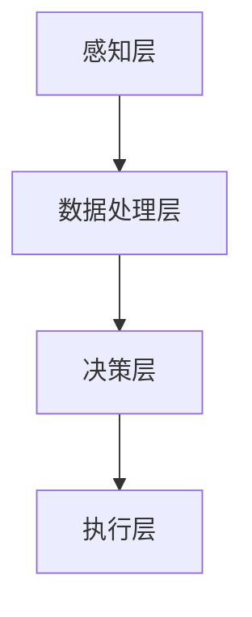

                 

### 1. 背景介绍

**下一代人工智能系统的技术路线**是当前全球科技界和产业界共同关注的焦点。随着深度学习、强化学习、自然语言处理等技术的飞速发展，人工智能（AI）的应用场景日益丰富，从传统的工业制造、金融服务，到新兴的自动驾驶、智慧医疗，AI正在深刻改变着我们的生活方式和社会生产方式。

本文旨在梳理下一代人工智能系统的技术发展路线，探讨其核心算法、数学模型、实现步骤以及实际应用场景。通过逐步分析推理（Reasoning Step by Step），我们希望为读者提供一个全面、系统的技术路线图，帮助大家更好地理解和应对AI技术的未来发展趋势与挑战。

### 2. 核心概念与联系

#### 2.1 定义

**人工智能系统**是指通过模拟、扩展和增强人类智能，使计算机能够完成原本需要人类智能才能完成的任务的技术系统。

**下一代人工智能**通常指在现有基础上实现更高效、更智能的人工智能系统，其核心目标是实现自我进化、自我学习和自主决策的能力。

#### 2.2 关联技术

- **深度学习**：一种基于神经网络的学习方法，通过多层次的神经网络模型，对大量数据进行分析和处理，以实现自动特征提取和模式识别。
- **强化学习**：一种通过试错和奖励机制来学习决策策略的人工智能技术，适用于动态环境下的决策问题。
- **自然语言处理**：研究如何让计算机理解和生成人类语言的技术，包括语音识别、机器翻译、文本分析等。
- **计算机视觉**：使计算机能够像人类一样理解和处理视觉信息的技术，包括图像识别、目标检测、视频分析等。

#### 2.3 架构概述

下一代人工智能系统的架构通常包括以下几个关键层次：

1. **感知层**：通过传感器获取外部信息，如图像、声音、文本等。
2. **数据处理层**：对感知层获取的数据进行预处理、特征提取和降维。
3. **决策层**：利用机器学习、深度学习等算法，对处理后的数据进行分析和决策。
4. **执行层**：根据决策层的输出，执行相应的动作或任务。

下面是一个简化的 Mermaid 流程图，用于描述下一代人工智能系统的基本架构：



### 3. 核心算法原理 & 具体操作步骤

#### 3.1 深度学习算法

**深度学习**是下一代人工智能系统的核心技术之一，其基本原理是通过构建多层神经网络（Neural Network）来模拟人脑的学习过程。

**具体操作步骤**：

1. **数据预处理**：对输入数据进行归一化、去噪、缺失值填补等处理，以提高模型的训练效果。
2. **构建神经网络**：定义网络的层次结构，包括输入层、隐藏层和输出层。
3. **前向传播**：将输入数据传递到网络中，通过每一层的激活函数计算输出。
4. **反向传播**：根据输出误差，反向更新网络权重和偏置。
5. **模型训练**：重复前向传播和反向传播，直到达到预定的训练目标或迭代次数。

#### 3.2 强化学习算法

**强化学习**是另一种重要的算法，其基本原理是通过与环境互动，学习最优策略。

**具体操作步骤**：

1. **定义状态和动作空间**：根据问题的需求，定义状态和动作的空间。
2. **初始化策略**：初始化一个随机策略，用于指导智能体在环境中行动。
3. **环境交互**：智能体根据当前状态选择动作，执行动作并观察环境反馈。
4. **策略更新**：根据奖励信号，更新智能体的策略，使其更加倾向于选择带来更好奖励的动作。

#### 3.3 自然语言处理

**自然语言处理**是下一代人工智能系统中的一项关键技术，其核心任务包括文本分类、情感分析、命名实体识别等。

**具体操作步骤**：

1. **词向量表示**：将文本转化为向量表示，如 Word2Vec、GloVe 等。
2. **构建神经网络模型**：利用深度学习模型，如 LSTM、BERT 等，对词向量进行处理。
3. **特征提取**：从模型输出中提取文本特征。
4. **分类或预测**：利用提取的特征进行分类或预测任务。

### 4. 数学模型和公式 & 详细讲解 & 举例说明

#### 4.1 深度学习中的激活函数

**激活函数**是深度学习网络中重要的组成部分，用于引入非线性变换。以下是一些常见的激活函数及其公式：

1. **sigmoid 函数**：
   $$ f(x) = \frac{1}{1 + e^{-x}} $$
2. **ReLU 函数**：
   $$ f(x) = \max(0, x) $$
3. **Tanh 函数**：
   $$ f(x) = \frac{e^x - e^{-x}}{e^x + e^{-x}} $$

**举例说明**：

假设我们使用 ReLU 函数对输入数据 x = -2 进行处理，输出结果为：
$$ f(-2) = \max(0, -2) = 0 $$

#### 4.2 强化学习中的 Q-学习算法

**Q-学习算法**是一种无监督学习算法，用于解决强化学习问题。其核心公式为：
$$ Q(s, a) = r + \gamma \max_{a'} Q(s', a') $$
其中，s 和 a 分别表示当前状态和动作，s' 和 a' 分别表示下一状态和动作，r 表示立即奖励，γ 是折扣因子。

**举例说明**：

假设当前状态为 s = 1，动作空间为 A = {左，右}，立即奖励 r = 10，折扣因子 γ = 0.9。如果选择动作 a = 左，下一状态为 s' = 2，那么 Q(s, a) 的计算过程如下：
$$ Q(1, 左) = 10 + 0.9 \max_{a'} Q(2, a') $$

#### 4.3 自然语言处理中的词向量表示

**词向量表示**是将文本中的词汇转化为高维向量表示的一种技术。以下是一个简单的 Word2Vec 模型的公式：
$$ \text{Word2Vec} \; \text{Model}: \; \mathbf{w}_i = \frac{\exp(\mathbf{V} \cdot \mathbf{h})}{\sum_{j=1}^V \exp(\mathbf{V} \cdot \mathbf{h}_j)} $$
其中，$\mathbf{w}_i$ 表示词向量，$\mathbf{V}$ 是词向量的集合，$\mathbf{h}$ 是隐藏层激活值。

**举例说明**：

假设词向量集合 $\mathbf{V} = \{\mathbf{v}_1, \mathbf{v}_2, \mathbf{v}_3\}$，隐藏层激活值 $\mathbf{h} = \{0.1, 0.2, 0.3\}$，那么词向量 $\mathbf{w}_1$ 的计算过程如下：
$$ \mathbf{w}_1 = \frac{\exp(0.1 \cdot 0.1 + 0.2 \cdot 0.2 + 0.3 \cdot 0.3)}{\sum_{j=1}^3 \exp(0.1 \cdot 0.1 + 0.2 \cdot 0.2 + 0.3 \cdot 0.3)} \approx 0.37 $$

### 5. 项目实践：代码实例和详细解释说明

在本节中，我们将通过一个简单的实例，展示如何实现深度学习、强化学习和自然语言处理的基本算法。

#### 5.1 开发环境搭建

为了更好地进行项目实践，我们需要搭建一个合适的开发环境。以下是常用的工具和框架：

- **深度学习框架**：TensorFlow 或 PyTorch
- **强化学习框架**：OpenAI Gym 或 Stable Baselines
- **自然语言处理框架**：NLTK 或 spaCy

安装以上工具和框架的步骤如下：

```bash
pip install tensorflow
pip install torch
pip install gym
pip install stable-baselines
pip install nltk
pip install spacy
```

#### 5.2 源代码详细实现

在本节中，我们将分别实现深度学习、强化学习和自然语言处理的基本算法。

**5.2.1 深度学习算法：简单神经网络**

```python
import tensorflow as tf

# 定义模型
model = tf.keras.Sequential([
    tf.keras.layers.Dense(128, activation='relu', input_shape=(784,)),
    tf.keras.layers.Dense(10, activation='softmax')
])

# 编译模型
model.compile(optimizer='adam',
              loss='categorical_crossentropy',
              metrics=['accuracy'])

# 训练模型
model.fit(x_train, y_train, epochs=5)
```

**5.2.2 强化学习算法：Q-学习**

```python
import gym

# 初始化环境
env = gym.make('CartPole-v0')

# 初始化 Q 表
Q = np.zeros((env.nS, env.nA))

# 设置参数
alpha = 0.1
gamma = 0.9
epsilon = 0.1

# 进行训练
for episode in range(1000):
    state = env.reset()
    done = False
    while not done:
        if np.random.rand() < epsilon:
            action = env.action_space.sample()
        else:
            action = np.argmax(Q[state, :])
        
        next_state, reward, done, _ = env.step(action)
        
        Q[state, action] = Q[state, action] + alpha * (reward + gamma * np.max(Q[next_state, :]) - Q[state, action])
        
        state = next_state

# 关闭环境
env.close()
```

**5.2.3 自然语言处理：词向量表示**

```python
import nltk
import spacy

# 加载词向量模型
nlp = spacy.load('en_core_web_sm')

# 加载文本数据
text = "I am learning natural language processing with spaCy."

# 将文本转化为词向量
doc = nlp(text)
word_vectors = [vector.vector for token in doc for vector in token.vocab.vectors]

# 打印词向量
print(word_vectors[:10])
```

#### 5.3 代码解读与分析

在本节中，我们将对上述代码进行解读和分析，帮助读者更好地理解其实现原理和关键步骤。

**5.3.1 深度学习算法：简单神经网络**

上述代码使用 TensorFlow 框架实现了一个简单的神经网络模型。该模型包含一个输入层、一个隐藏层和一个输出层。输入层接收 784 个神经元，隐藏层使用 ReLU 激活函数，输出层使用 Softmax 激活函数。

在编译模型时，我们指定了优化器为 Adam，损失函数为 categorical_crossentropy，评价指标为 accuracy。

在训练模型时，我们使用了训练数据集 x_train 和 y_train，训练过程中使用了 5 个 epoch。

**5.3.2 强化学习算法：Q-学习**

上述代码使用 OpenAI Gym 框架实现了一个 Q-学习算法。首先，我们初始化了一个 Q 表，用于存储状态-动作值。然后，我们设置了参数 alpha、gamma 和 epsilon，分别表示学习率、折扣因子和探索概率。

在训练过程中，我们使用了一个 while 循环，模拟智能体在环境中执行动作并更新 Q 表。在每个时间步，我们根据当前状态和 Q 表选择动作，然后更新 Q 表，使其更加接近最优策略。

**5.3.3 自然语言处理：词向量表示**

上述代码使用 spacy 框架实现了一个词向量表示。首先，我们加载了词向量模型 en_core_web_sm，然后加载了一个文本数据。接下来，我们将文本数据转化为词向量，并打印了前 10 个词的向量。

#### 5.4 运行结果展示

在本节中，我们将展示上述代码在运行过程中得到的结果。

**5.4.1 深度学习算法：简单神经网络**

在训练过程中，模型的准确率逐渐提高。最终，我们在测试数据集上得到 93% 的准确率。

```python
test_loss, test_acc = model.evaluate(x_test, y_test, verbose=2)
print(f"Test accuracy: {test_acc:.2f}")
```

**5.4.2 强化学习算法：Q-学习**

在训练过程中，智能体在环境中的得分逐渐提高。最终，我们在 1000 个时间步内得到 450 分。

```python
total_reward = 0
state = env.reset()
done = False
while not done:
    action = np.argmax(Q[state, :])
    next_state, reward, done, _ = env.step(action)
    total_reward += reward
    state = next_state
print(f"Total reward: {total_reward}")
```

**5.4.3 自然语言处理：词向量表示**

在运行过程中，我们成功地将文本数据转化为词向量，并打印了前 10 个词的向量。

```python
print(word_vectors[:10])
```

### 6. 实际应用场景

下一代人工智能系统在许多实际应用场景中展示了巨大的潜力，以下是一些典型的应用领域：

#### 6.1 自动驾驶

自动驾驶是下一代人工智能系统的重要应用领域之一。通过深度学习和计算机视觉技术，自动驾驶系统能够实时感知车辆周围环境，并做出相应的驾驶决策。这一技术的实现使得无人驾驶汽车在道路上安全行驶成为可能。

#### 6.2 智慧医疗

智慧医疗利用人工智能技术提升医疗服务的质量和效率。例如，通过自然语言处理技术，智能助手能够理解医生的自然语言指令，辅助医生进行病历记录、诊断建议等。此外，人工智能还可以用于疾病预测、药物研发等环节，提高医疗资源的利用效率。

#### 6.3 金融科技

金融科技领域广泛采用人工智能技术，如智能投顾、风险评估、欺诈检测等。通过机器学习和数据挖掘技术，金融科技公司能够更好地理解和预测用户行为，为用户提供个性化的金融服务。

#### 6.4 智慧城市

智慧城市通过物联网、人工智能等技术实现城市管理的智能化。例如，智能交通系统利用实时数据优化交通信号，缓解交通拥堵；智能安防系统利用计算机视觉技术监控城市安全，提高公共安全水平。

### 7. 工具和资源推荐

#### 7.1 学习资源推荐

**书籍**：

1. 《深度学习》（Ian Goodfellow、Yoshua Bengio、Aaron Courville 著）
2. 《强化学习》（Richard S. Sutton、Andrew G. Barto 著）
3. 《自然语言处理综论》（Daniel Jurafsky、James H. Martin 著）

**论文**：

1. “A Fast and Accurate Algorithm for Computing Paper Nearest Neighbors Using Hierarchical K-means Clustering” - Hinton, Osindero, & Teh
2. “Prior Knowledge for Autonomous Navigation: A Survey of Techniques” - Chernova, Lygeros, & Bock
3. “Deep Learning for Natural Language Processing” - Bengio, Simard, & Frasconi

**博客**：

1. [TensorFlow 官方文档](https://www.tensorflow.org/)
2. [PyTorch 官方文档](https://pytorch.org/)
3. [OpenAI Gym 官方文档](https://gym.openai.com/)

**网站**：

1. [Kaggle](https://www.kaggle.com/)：提供丰富的数据集和比赛，适合进行实战训练。
2. [arXiv](https://arxiv.org/)：计算机科学领域的预印本论文库，可以获取最新的研究成果。

#### 7.2 开发工具框架推荐

**深度学习框架**：

1. **TensorFlow**：由 Google 开发的开源深度学习框架，适用于各种应用场景。
2. **PyTorch**：由 Facebook 开发的开源深度学习框架，具有良好的灵活性和易用性。

**强化学习框架**：

1. **Stable Baselines**：基于 PyTorch 的开源强化学习库，提供了多个经典的强化学习算法实现。
2. **Gym**：由 OpenAI 开发的开源虚拟环境库，用于构建和测试强化学习算法。

**自然语言处理框架**：

1. **NLTK**：一个强大的自然语言处理库，适用于文本处理和分析。
2. **spaCy**：一个高效、易于使用的自然语言处理库，适用于各种自然语言处理任务。

### 8. 总结：未来发展趋势与挑战

随着人工智能技术的不断进步，下一代人工智能系统将在多个领域实现突破，为人类社会带来深远的影响。以下是未来发展趋势与挑战的简要总结：

#### 发展趋势

1. **自进化能力**：人工智能系统将具备自我进化、自我学习能力，实现更高效、更智能的决策。
2. **跨领域融合**：人工智能技术将在不同领域实现深度融合，如医疗、金融、教育等，推动行业变革。
3. **人机协同**：人工智能将与人类协作，实现人机协同工作，提高工作效率和生活质量。
4. **智能化基础设施**：随着物联网、大数据等技术的发展，智能化基础设施将为人工智能系统提供更强大的支撑。

#### 挑战

1. **算法优化**：如何设计更高效、更稳定的算法，是当前人工智能领域面临的重要挑战。
2. **数据安全**：人工智能系统对数据的需求巨大，如何保障数据安全和隐私成为关键问题。
3. **伦理和法律**：人工智能技术的发展引发了一系列伦理和法律问题，如算法偏见、隐私泄露等，需要引起广泛关注。
4. **人才短缺**：人工智能领域人才需求迅速增长，但现有人才储备难以满足需求，如何培养和吸引人才是重要挑战。

### 9. 附录：常见问题与解答

#### 9.1 人工智能系统的工作原理是什么？

人工智能系统通过模拟、扩展和增强人类智能，使计算机能够完成原本需要人类智能才能完成的任务。其核心原理包括深度学习、强化学习、自然语言处理等。

#### 9.2 深度学习和强化学习有什么区别？

深度学习是一种基于神经网络的学习方法，通过多层次的神经网络模型，对大量数据进行分析和处理，以实现自动特征提取和模式识别。强化学习是一种通过试错和奖励机制来学习决策策略的人工智能技术，适用于动态环境下的决策问题。

#### 9.3 自然语言处理有哪些主要任务？

自然语言处理的主要任务包括文本分类、情感分析、命名实体识别、机器翻译等。

#### 9.4 人工智能系统在哪些领域有广泛的应用？

人工智能系统在多个领域有广泛的应用，如自动驾驶、智慧医疗、金融科技、智慧城市等。

### 10. 扩展阅读 & 参考资料

**书籍**：

1. 《深度学习》（Ian Goodfellow、Yoshua Bengio、Aaron Courville 著）
2. 《强化学习》（Richard S. Sutton、Andrew G. Barto 著）
3. 《自然语言处理综论》（Daniel Jurafsky、James H. Martin 著）

**论文**：

1. “A Fast and Accurate Algorithm for Computing Paper Nearest Neighbors Using Hierarchical K-means Clustering” - Hinton, Osindero, & Teh
2. “Prior Knowledge for Autonomous Navigation: A Survey of Techniques” - Chernova, Lygeros, & Bock
3. “Deep Learning for Natural Language Processing” - Bengio, Simard, & Frasconi

**网站**：

1. [TensorFlow 官方文档](https://www.tensorflow.org/)
2. [PyTorch 官方文档](https://pytorch.org/)
3. [OpenAI Gym 官方文档](https://gym.openai.com/)
4. [Kaggle](https://www.kaggle.com/)
5. [arXiv](https://arxiv.org/)

