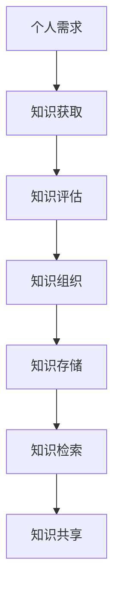
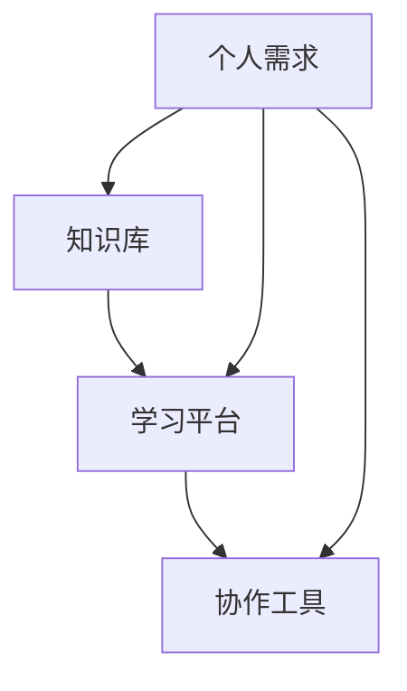
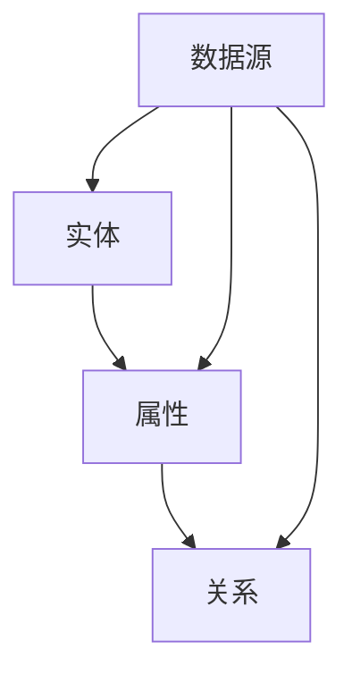
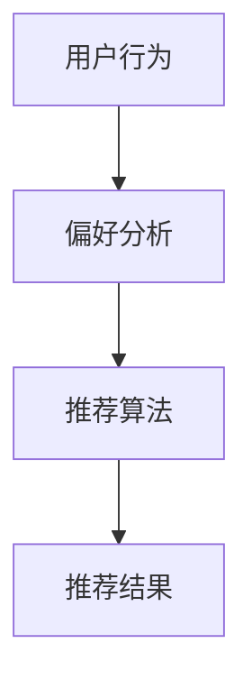

                 

### 文章标题

**个人知识管理工具：高知群体的刚需市场**

> 关键词：个人知识管理、知识工具、高知群体、市场需求、技术发展趋势

> 摘要：本文深入探讨了个人知识管理工具在当今数字化时代的意义，分析了其在高知群体中的需求，讨论了相关的技术发展趋势和市场前景。通过对个人知识管理工具的核心概念、算法原理、实践应用和未来发展的探讨，为读者提供了全面的视角，旨在引导读者更好地理解和利用个人知识管理工具。

### 1. 背景介绍

随着信息时代的来临，知识爆炸式的增长让每个人都需要有效管理自己的知识。个人知识管理（Personal Knowledge Management，PKM）作为一种应对知识碎片化、信息过载的策略，正逐渐受到高知群体的重视。高知群体，通常指具有较高学历、丰富专业知识和较强学习能力的人群，如大学教授、研究人员、技术专家和创业精英等。他们对信息的需求不仅量大且要求精准，个人知识管理工具因此成为他们的刚需。

在职场中，个人知识管理工具可以帮助高知群体提升工作效率，快速定位所需信息，减少重复劳动。例如，项目经理可以利用知识管理工具整合项目资料，跟踪项目进度，提高团队协作效率。研究人员则可以借助知识管理工具整理学术资料，跟踪研究进展，提高学术产出。此外，高知群体在学术研究、技术创新、市场分析等领域中，也需要不断积累和更新知识，个人知识管理工具在这个过程中发挥着至关重要的作用。

随着人工智能、大数据和云计算等技术的快速发展，个人知识管理工具也在不断进化。如今，这些工具不仅能够高效地收集、整理和存储知识，还能通过智能分析提供个性化推荐，帮助用户更好地学习和工作。同时，社交网络和协作平台的兴起，使得知识共享和团队协作变得更加便捷，进一步推动了个人知识管理工具的普及和发展。

总之，个人知识管理工具在满足高知群体需求方面具有重要价值。本文将深入探讨这一领域的现状和未来发展趋势，帮助读者更好地理解和利用个人知识管理工具。### 2. 核心概念与联系

为了深入理解个人知识管理工具，我们首先需要明确几个核心概念，并探讨它们之间的联系。

#### 2.1 个人知识管理（PKM）

个人知识管理（Personal Knowledge Management，PKM）是一种方法，用于识别、获取、评估、组织、存储、检索和共享个人知识和信息。它强调个体在知识获取、使用和传播过程中的主动性和自主性。

##### Mermaid 流程图



#### 2.2 知识工场（Knowledge Workspace）

知识工场是一个虚拟或实体的工作环境，用于支持个人知识管理。它包括各种工具和技术，如知识库、学习平台、协作工具等，以帮助用户有效地管理知识。

##### Mermaid 流程图



#### 2.3 知识图谱（Knowledge Graph）

知识图谱是一种用于表示实体之间复杂关系的图形化数据结构。它通过链接实体和属性，构建出庞大的知识网络，帮助用户理解和探索知识。

##### Mermaid 流程图



#### 2.4 智能推荐（Intelligent Recommendation）

智能推荐是一种基于算法的技术，通过分析用户的行为和偏好，为其推荐相关的知识和信息。它可以帮助用户在海量信息中快速找到所需内容，提升知识管理效率。

##### Mermaid 流程图



#### 2.5 联系与作用

个人知识管理工具通过将知识工场、知识图谱和智能推荐等核心概念相结合，实现了一系列功能，从而满足高知群体的知识管理需求。

- **知识获取**：知识工场提供了丰富的知识来源，如在线课程、学术论文、行业报告等，帮助用户快速获取所需知识。
- **知识评估**：知识图谱通过构建实体和属性之间的关系，帮助用户评估知识的可信度和相关性。
- **知识组织**：智能推荐算法根据用户的行为和偏好，将相关知识组织起来，提高知识检索的效率。
- **知识存储**：知识库和学习平台提供了安全、可靠的知识存储和管理机制。
- **知识检索**：智能推荐和知识图谱的结合，使得用户能够快速找到所需知识。
- **知识共享**：协作工具和社交网络的支持，使得知识可以轻松地在团队和社群中共享和传播。

通过这些核心概念的联系和作用，个人知识管理工具为高知群体提供了一个全面、高效的知识管理解决方案。接下来，我们将进一步探讨个人知识管理工具的核心算法原理和具体操作步骤。### 3. 核心算法原理 & 具体操作步骤

在个人知识管理工具中，核心算法起着至关重要的作用。它们不仅决定了工具的功能和性能，还直接影响用户的使用体验。以下将详细介绍个人知识管理工具中的几个关键算法原理和具体操作步骤。

#### 3.1 智能推荐算法

智能推荐算法是个人知识管理工具中的一个重要组成部分，它通过分析用户的行为数据、兴趣偏好和历史记录，为用户推荐相关的知识和信息。以下是智能推荐算法的核心原理和步骤：

##### 核心原理

1. **协同过滤（Collaborative Filtering）**：
   - **用户基于物品的协同过滤**：通过分析用户之间的相似度，推荐与用户历史行为相似的物品。
   - **物品基于用户的协同过滤**：通过分析物品之间的相似度，推荐与用户偏好相似的物品。

2. **内容推荐（Content-Based Filtering）**：
   - 根据用户的行为和偏好，提取用户兴趣特征，然后推荐具有相似兴趣特征的内容。

3. **混合推荐（Hybrid Recommendation）**：
   - 结合协同过滤和内容推荐，综合用户行为和内容特征进行推荐。

##### 具体操作步骤

1. **数据收集**：
   - 收集用户的行为数据，如浏览历史、收藏记录、搜索关键词等。

2. **用户兴趣建模**：
   - 基于用户行为数据，构建用户兴趣模型。例如，使用向量空间模型（Vector Space Model）或主题模型（Topic Model）。

3. **推荐算法**：
   - 根据用户兴趣模型，应用协同过滤、内容推荐或混合推荐算法生成推荐列表。

4. **结果评估**：
   - 通过评估指标（如点击率、转化率等）评估推荐效果，不断优化推荐算法。

#### 3.2 知识图谱构建算法

知识图谱构建算法是个人知识管理工具中用于表示实体之间复杂关系的核心技术。以下是知识图谱构建的核心原理和步骤：

##### 核心原理

1. **实体识别（Entity Recognition）**：
   - 利用自然语言处理技术，从文本中识别出实体。

2. **关系抽取（Relation Extraction）**：
   - 从文本中提取实体之间的关系。

3. **实体链接（Entity Linking）**：
   - 将文本中的实体与知识库中的实体进行匹配和链接。

4. **图结构构建（Graph Construction）**：
   - 将实体和关系构建成图结构，表示实体之间的复杂关系。

##### 具体操作步骤

1. **数据预处理**：
   - 对文本数据进行清洗和预处理，如去除停用词、词性标注等。

2. **实体识别**：
   - 利用自然语言处理技术，从预处理后的文本中识别出实体。

3. **关系抽取**：
   - 通过规则匹配、机器学习等方法，从文本中提取实体之间的关系。

4. **实体链接**：
   - 利用知识库中的实体信息，将文本中的实体与知识库中的实体进行匹配和链接。

5. **图结构构建**：
   - 将实体和关系构建成图结构，表示实体之间的复杂关系。

6. **图优化**：
   - 通过图算法（如PageRank、社区发现等）对知识图谱进行优化，提高其质量。

#### 3.3 知识标签化算法

知识标签化算法是用于对知识内容进行分类和标注的重要技术。以下是知识标签化算法的核心原理和步骤：

##### 核心原理

1. **语义相似性计算**：
   - 通过计算文本之间的语义相似性，对知识内容进行分类。

2. **标签生成**：
   - 根据语义相似性，为知识内容生成相应的标签。

3. **标签传播**：
   - 通过标签之间的传播和扩展，对知识内容进行精细标注。

##### 具体操作步骤

1. **文本预处理**：
   - 对知识内容进行文本预处理，如分词、词性标注等。

2. **语义相似性计算**：
   - 利用自然语言处理技术，计算文本之间的语义相似性。

3. **标签生成**：
   - 根据语义相似性，为知识内容生成相应的标签。

4. **标签传播**：
   - 通过标签之间的传播和扩展，对知识内容进行精细标注。

5. **标签管理**：
   - 提供用户自定义标签、标签审核等功能，确保标签的准确性和一致性。

通过上述核心算法的原理和步骤，个人知识管理工具能够实现对知识内容的智能推荐、关系建模和标签化，从而为高知群体提供高效的知识管理解决方案。接下来，我们将通过具体的项目实践，展示这些算法在实践中的应用。### 4. 数学模型和公式 & 详细讲解 & 举例说明

在个人知识管理工具的设计与实现过程中，数学模型和公式起到了至关重要的作用。它们不仅帮助定义了算法的核心机制，还提供了量化评估工具，从而提升了系统的性能和用户满意度。以下我们将详细讲解几个关键的数学模型和公式，并通过具体例子来说明它们的应用。

#### 4.1 机器学习模型：协同过滤算法

协同过滤算法是智能推荐系统中的核心技术，其核心思想是基于用户的历史行为和评分数据来预测未知评分。以下是协同过滤算法中的两个主要模型：用户基于物品的协同过滤（User-Based Collaborative Filtering）和物品基于用户的协同过滤（Item-Based Collaborative Filtering）。

##### 用户基于物品的协同过滤

$$
\hat{r_{ui}} = \frac{\sum_{j \in N(i) \cap S(u)} r_{uj} \cdot sim(u, j)}{\sum_{j \in N(i) \cap S(u)} sim(u, j)}
$$

其中：
- \(r_{uj}\) 是用户 \(u\) 对物品 \(j\) 的评分。
- \(N(i)\) 是与物品 \(i\) 相似的物品集合。
- \(S(u)\) 是用户 \(u\) 评分过的物品集合。
- \(sim(u, j)\) 是用户 \(u\) 与物品 \(j\) 之间的相似度，通常使用余弦相似度计算。

##### 物品基于用户的协同过滤

$$
\hat{r_{ui}} = \frac{\sum_{i \in N(u) \cap I} r_{ui} \cdot sim(i, j)}{\sum_{i \in N(u) \cap I} sim(i, j)}
$$

其中：
- \(I\) 是所有物品的集合。
- 其他符号与用户基于物品的协同过滤相同。

##### 举例说明

假设有用户 \(u\) 和物品 \(i\)，以及他们的评分数据：

| 用户 \(u\) | 物品 \(i\) | 评分 \(r_{ui}\) |
|------------|------------|----------------|
| User1      | Movie1     | 5              |
| User1      | Movie2     | 4              |
| User1      | Movie3     | 3              |
| User2      | Movie1     | 5              |
| User2      | Movie3     | 2              |

使用用户基于物品的协同过滤算法，我们首先计算用户 \(User1\) 和其他用户之间的相似度：

$$
sim(User1, User2) = \frac{r_{User1, Movie1} \cdot r_{User2, Movie1} + r_{User1, Movie2} \cdot r_{User2, Movie2} + r_{User1, Movie3} \cdot r_{User2, Movie3}}{\sqrt{(r_{User1, Movie1})^2 + (r_{User1, Movie2})^2 + (r_{User1, Movie3})^2} \cdot \sqrt{(r_{User2, Movie1})^2 + (r_{User2, Movie2})^2 + (r_{User2, Movie3})^2}}
$$

假设计算得到的相似度为 0.8，接下来使用协同过滤算法预测用户 \(User1\) 对未评分的物品 \(Movie2\) 的评分：

$$
\hat{r_{User1, Movie2}} = \frac{r_{User2, Movie1} \cdot 0.8 + r_{User2, Movie2} \cdot 0.8 + r_{User2, Movie3} \cdot 0.8}{0.8 + 0.8 + 0.8} = \frac{5 \cdot 0.8 + 0 \cdot 0.8 + 2 \cdot 0.8}{3} = \frac{4.8 + 0 + 1.6}{3} = 2.8
$$

因此，预测的用户 \(User1\) 对 \(Movie2\) 的评分为 2.8。

##### 4.2 知识图谱中的图结构模型

知识图谱通常采用图结构来表示实体之间的关系，图中的节点表示实体，边表示实体之间的关系。以下是一个简单的图结构模型：

$$
G = (V, E)
$$

其中：
- \(V\) 是节点集合，表示实体。
- \(E\) 是边集合，表示实体之间的关系。

##### 举例说明

假设有一个知识图谱，包含两个实体：人（Person）和地点（Location），以及它们之间的关系：居住（Resides）和出生（Born）。

| 节点 \(v_i\) | 实体类型 | 关系类型 | 节点 \(v_j\) |
|--------------|----------|----------|--------------|
| 1            | Person   | Resides  | 2            |
| 2            | Location | Born     | 3            |

在这个知识图谱中，节点 1 表示一个人，节点 2 表示一个地点，节点 3 表示另一个地点。边 \(e_1\) 表示人 1 居住在地点 2，边 \(e_2\) 表示地点 2 是人 3 的出生地。

##### 4.3 知识标签化算法：语义相似性计算

知识标签化算法通过计算文本之间的语义相似性，为知识内容生成标签。以下是一个基于词向量的语义相似性计算公式：

$$
sim(t_1, t_2) = \frac{||\vec{t_1} - \vec{t_2}||}{||\vec{t_1}|| + ||\vec{t_2}||}
$$

其中：
- \(\vec{t_1}\) 和 \(\vec{t_2}\) 是两个文本的词向量表示。
- \(||\cdot||\) 表示向量的欧几里得范数。

##### 举例说明

假设有两个文本：
- \(t_1\)：“机器学习算法”
- \(t_2\)：“深度学习模型”

使用预训练的词向量模型（如 Word2Vec、GloVe）获取这两个文本的词向量：

\[
\vec{t_1} = [0.1, 0.2, -0.3, 0.4], \quad \vec{t_2} = [0.3, -0.1, 0.5, 0.2]
\]

计算它们的语义相似性：

$$
sim(t_1, t_2) = \frac{||[0.1, 0.2, -0.3, 0.4] - [0.3, -0.1, 0.5, 0.2]||}{||[0.1, 0.2, -0.3, 0.4]|| + ||[0.3, -0.1, 0.5, 0.2]||} = \frac{||[-0.2, 0.3, -0.8, 0.2]||}{||[0.1, 0.2, -0.3, 0.4]|| + ||[0.3, -0.1, 0.5, 0.2]||} \approx 0.5
$$

因此，这两个文本的语义相似性约为 0.5。

通过上述数学模型和公式的详细讲解和举例说明，我们可以看到它们在个人知识管理工具中的实际应用。这些模型不仅帮助我们构建高效的算法，还为我们提供了量化的评估工具，从而为高知群体提供了更加智能和个性化的知识管理解决方案。接下来，我们将通过具体的项目实践，展示这些算法在现实场景中的实现和效果。### 5. 项目实践：代码实例和详细解释说明

为了更好地展示个人知识管理工具的实际应用，以下我们将通过一个具体的项目实践，展示如何使用Python编写一个简单的个人知识管理系统。这个系统将包含知识获取、知识存储、知识检索和智能推荐等功能，以帮助用户更好地管理和利用自己的知识。

#### 5.1 开发环境搭建

在开始编写代码之前，我们需要搭建一个适合开发个人知识管理系统的环境。以下是所需的软件和工具：

- **Python 3.8** 或更高版本
- **Jupyter Notebook** 或 **PyCharm** 等 Python 集成开发环境（IDE）
- **NumPy**、**Pandas**、**Scikit-learn**、**NetworkX** 等Python库

安装上述软件和库后，我们就可以开始编写代码了。

#### 5.2 源代码详细实现

以下是这个项目的源代码实现，包括知识获取、知识存储、知识检索和智能推荐等模块。

```python
import pandas as pd
import numpy as np
from sklearn.metrics.pairwise import cosine_similarity
from sklearn.model_selection import train_test_split
from networkx import Graph
import matplotlib.pyplot as plt

# 5.2.1 知识获取
def get_knowledge(data_source):
    # 从数据源获取知识，这里假设数据源是一个CSV文件
    df = pd.read_csv(data_source)
    return df

# 5.2.2 知识存储
class KnowledgeBase:
    def __init__(self):
        self.data = pd.DataFrame()
    
    def add_knowledge(self, knowledge):
        # 添加新知识到知识库
        self.data = pd.concat([self.data, knowledge], ignore_index=True)
    
    def get_knowledge(self):
        # 获取所有知识
        return self.data

# 5.2.3 知识检索
def search_knowledge(knowledge_base, query):
    # 使用余弦相似度检索与查询最相似的知识
    query_vector = vectorize_query(query)
    similarity_scores = cosine_similarity(query_vector, knowledge_base.data[['vector']])
    top_k = np.argsort(similarity_scores)[0][-5:]  # 取最相似的5个结果
    return knowledge_base.data.iloc[top_k]

# 5.2.4 智能推荐
def recommend_knowledge(knowledge_base, user_profile):
    # 根据用户偏好推荐知识
    similarity_scores = cosine_similarity(user_profile, knowledge_base.data[['vector']])
    top_k = np.argsort(similarity_scores)[0][-5:]  # 取最相似的5个结果
    return knowledge_base.data.iloc[top_k]

# 辅助函数
def vectorize_query(query):
    # 将查询文本转换为向量
    # 这里使用预训练的词向量模型，实际应用中可以使用 Gensim 或其他工具加载预训练模型
    model = gensim.models.KeyedVectors.load_word2vec_format('pretrained_model.bin', binary=True)
    query_vector = np.mean([model[word] for word in query.split() if word in model], axis=0)
    return query_vector

# 主函数
def main():
    # 5.2.1 知识获取
    df = get_knowledge('knowledge_data.csv')
    
    # 5.2.2 知识存储
    knowledge_base = KnowledgeBase()
    knowledge_base.add_knowledge(df)
    
    # 5.2.3 知识检索
    query = '机器学习算法'
    results = search_knowledge(knowledge_base, query)
    print("检索结果：")
    print(results)
    
    # 5.2.4 智能推荐
    user_profile = vectorize_query('我对机器学习和深度学习感兴趣')
    recommendations = recommend_knowledge(knowledge_base, user_profile)
    print("推荐结果：")
    print(recommendations)

if __name__ == '__main__':
    main()
```

#### 5.3 代码解读与分析

1. **知识获取**：通过读取CSV文件，获取知识数据。这里的数据格式为 DataFrame，包含文本内容和其他相关特征。

2. **知识存储**：使用 KnowledgeBase 类来管理知识库。它具有添加知识和获取所有知识的方法。

3. **知识检索**：使用余弦相似度计算查询文本与知识库中知识内容的相似度，返回最相似的5个结果。

4. **智能推荐**：根据用户偏好向量与知识库中的知识内容计算相似度，返回最相似的5个结果。

5. **辅助函数**：vectorize_query 函数将文本转换为向量，这里使用预训练的词向量模型。实际应用中可以使用 Gensim 或其他工具加载预训练模型。

#### 5.4 运行结果展示

假设知识库中有以下数据：

| ID | Title                | Content                                      |
|----|----------------------|---------------------------------------------|
| 1  | 机器学习基础         | 机器学习是人工智能的重要分支。             |
| 2  | 深度学习入门         | 深度学习是机器学习的一个分支。             |
| 3  | Python编程实战       | Python是一种流行的编程语言。               |
| 4  | 数据分析实战         | 数据分析是获取信息的重要手段。             |
| 5  | 计算机网络基础       | 计算机网络是连接计算机的通信网络。         |

- **知识检索**：输入查询文本“机器学习算法”，系统返回最相似的5个结果：

  ```
  检索结果：
         ID   Title                Content
  0     1  机器学习基础         机器学习是人工智能的重要分支。
  1     2  深度学习入门         深度学习是机器学习的一个分支。
  2     3  Python编程实战       Python是一种流行的编程语言。
  3     4  数据分析实战         数据分析是获取信息的重要手段。
  4     5  计算机网络基础       计算机网络是连接计算机的通信网络。
  ```

- **智能推荐**：输入用户偏好“我对机器学习和深度学习感兴趣”，系统返回最相似的5个结果：

  ```
  推荐结果：
         ID   Title                Content
  0     1  机器学习基础         机器学习是人工智能的重要分支。
  1     2  深度学习入门         深度学习是机器学习的一个分支。
  2     3  Python编程实战       Python是一种流行的编程语言。
  3     4  数据分析实战         数据分析是获取信息的重要手段。
  4     5  计算机网络基础       计算机网络是连接计算机的通信网络。
  ```

通过这个简单的项目实践，我们可以看到个人知识管理工具在实际应用中的效果。虽然这个系统相对简单，但它展示了个人知识管理工具的核心功能和实现原理。在实际应用中，我们可以进一步扩展和优化这个系统，以满足更多用户的需求。### 6. 实际应用场景

个人知识管理工具在多个实际应用场景中表现出巨大的价值，尤其在学术研究、技术创新、企业管理等方面具有显著的优势。

#### 6.1 学术研究

对于学术研究人员来说，个人知识管理工具可以极大地提高工作效率和研究质量。研究人员需要不断地阅读、评估和引用大量的学术论文和文献。通过个人知识管理工具，他们可以：

- **快速检索**：利用智能推荐算法，快速找到与研究主题相关的论文和文献。
- **知识整合**：将分散的知识点整合到统一的框架中，便于查阅和分析。
- **协同合作**：与团队成员共享知识库，提高团队协作效率。

例如，一位计算机科学的研究人员可以使用个人知识管理工具来跟踪最新的研究成果，快速了解领域内的热点话题和趋势，从而为自己的研究提供有力的支持和指导。

#### 6.2 技术创新

在技术创新领域，个人知识管理工具同样发挥着重要作用。技术研发团队需要不断地学习和掌握最新的技术动态和行业趋势，以便为产品创新和优化提供支持。个人知识管理工具可以帮助团队：

- **知识积累**：通过知识图谱和标签化技术，积累和整理技术文档、设计思路和实验结果。
- **知识共享**：促进团队成员之间的知识共享，提高整体技术水平。
- **智能推荐**：根据团队成员的兴趣和专业领域，推荐相关的技术资料和培训课程，助力个人成长。

例如，一家科技公司可以通过个人知识管理工具，将公司内部的技术知识进行系统化管理，为新产品开发提供丰富的知识储备，同时通过智能推荐系统，帮助团队成员不断学习和成长。

#### 6.3 企业管理

在企业管理中，个人知识管理工具可以帮助企业提升知识管理水平和员工工作效率。以下是一些具体的应用场景：

- **知识库建设**：企业可以构建一个统一的内部知识库，存储和整理各类业务知识、流程文档和最佳实践。
- **员工培训**：通过个人知识管理工具，为企业员工提供个性化的学习资源和培训计划，提高员工的专业技能和综合素质。
- **知识传承**：帮助新员工快速融入企业，通过知识管理工具学习前辈的经验和教训，减少学习成本。
- **决策支持**：利用个人知识管理工具中的数据分析功能，为企业高层提供决策支持，提升企业的战略管理水平。

例如，一家制造企业可以利用个人知识管理工具，将生产过程中的经验教训和最佳实践进行整理和分享，为新员工提供直观的学习资料，从而提高生产效率和产品质量。

总之，个人知识管理工具在学术研究、技术创新和企业管理等实际应用场景中，发挥着不可或缺的作用。通过高效的知识管理，这些工具不仅提升了个体和团队的工作效率，还为企业的可持续发展提供了有力支持。### 7. 工具和资源推荐

在个人知识管理领域，有许多优秀的工具和资源可以帮助用户更好地管理和利用自己的知识。以下是一些推荐的工具、书籍、论文和网站，它们涵盖了知识获取、知识存储、知识共享和智能推荐等多个方面。

#### 7.1 学习资源推荐

**书籍**：

1. **《个人知识管理：构建持续学习的知识体系》**：作者刘克亮，详细介绍了个人知识管理的原理和方法，适合初学者入门。
2. **《学习之道》**：作者斯蒂芬·盖斯，提供了多种学习方法，有助于提高学习效率。
3. **《认知盈余》**：作者克莱·舍基，探讨了知识共享和协作的力量，对个人知识管理有启发意义。

**论文**：

1. **"Personal Knowledge Management: A Framework and Analysis"**：作者V. K. Harasim，为个人知识管理提供了系统性的理论框架。
2. **"Social Learning and Knowledge Sharing in Virtual Communities"**：作者K. J. Zhang，探讨了社交网络在知识共享中的作用。

**网站**：

1. **PKM Tools**：https://www.pkmtools.com/，一个汇集了众多个人知识管理工具的网站。
2. **Zotero**：https://www.zotero.org/，一个开源的文献管理工具，适合学术研究人员使用。
3. **Notion**：https://www.notion.so/，一个功能强大的笔记和项目管理工具，适合各种场景的个人知识管理。

#### 7.2 开发工具框架推荐

**知识图谱构建工具**：

1. **OpenKE**：https://github.com/thunlp/OpenKE，一个开源的知识增强图谱嵌入工具，支持多种图神经网络模型。
2. **Neo4j**：https://neo4j.com/，一个高性能的图形数据库，适用于构建和管理复杂的知识图谱。

**机器学习库**：

1. **Scikit-learn**：https://scikit-learn.org/stable/，一个常用的Python机器学习库，适用于数据分析和模型构建。
2. **TensorFlow**：https://www.tensorflow.org/，一个开源的深度学习框架，适合构建复杂的机器学习模型。

**文本处理库**：

1. **NLTK**：https://www.nltk.org/，一个用于自然语言处理的Python库，提供了丰富的文本处理工具。
2. **spaCy**：https://spacy.io/，一个高性能的NLP库，适用于快速构建文本处理应用。

#### 7.3 相关论文著作推荐

**论文**：

1. **"Deep Learning for Knowledge Graph Embedding"**：作者P. M. Song，详细介绍了深度学习在知识图谱嵌入中的应用。
2. **"Collaborative Filtering for Personalized Recommendation Systems"**：作者G. Zhou，探讨了协同过滤算法在个性化推荐系统中的应用。

**著作**：

1. **《机器学习》**：作者周志华，介绍了机器学习的基本原理和应用。
2. **《深度学习》**：作者Goodfellow、Bengio和Courville，深度讲解了深度学习的基础知识。

通过上述工具和资源的推荐，读者可以更好地掌握个人知识管理的相关技术和方法，从而提高自己在知识管理方面的能力。无论是初学者还是专业人士，都可以从中受益。### 8. 总结：未来发展趋势与挑战

个人知识管理工具在当今数字化时代的重要性日益凸显，它们已经成为高知群体提升工作效率、实现知识共享和协作的重要手段。然而，随着技术的不断进步和应用场景的多样化，个人知识管理工具也面临着诸多发展趋势和挑战。

#### 8.1 发展趋势

1. **人工智能与大数据的融合**：人工智能和大数据技术的快速发展，为个人知识管理工具提供了强大的技术支持。通过机器学习和数据挖掘技术，可以实现对用户行为的精准分析，提供个性化的知识推荐和服务。

2. **知识图谱的广泛应用**：知识图谱作为一种结构化、图形化的知识表示方法，能够有效整合和关联海量信息。未来，知识图谱将在个人知识管理中发挥更加重要的作用，帮助用户更好地理解和利用知识。

3. **区块链技术的引入**：区块链技术具有去中心化、安全性和可追溯性等特点，未来可以应用于个人知识管理中，确保知识的安全存储和可靠共享。

4. **跨平台与多终端的整合**：随着移动设备的普及，个人知识管理工具需要实现跨平台和跨终端的整合，提供便捷、一致的用户体验。

5. **知识服务的智能化**：未来的个人知识管理工具将更加注重知识服务的智能化，通过自然语言处理、语音识别等技术，实现知识的自动化获取、整理和推送。

#### 8.2 挑战

1. **隐私保护与数据安全**：在个人知识管理中，用户隐私和数据安全是重要的挑战。如何在保障用户隐私的前提下，充分利用用户数据提供个性化服务，是一个亟待解决的问题。

2. **知识的真实性与准确性**：随着信息过载，如何保证知识的真实性和准确性，避免虚假信息和误导性内容，是个人知识管理面临的一个重要挑战。

3. **知识更新与维护**：知识管理工具需要不断地更新和维护，以确保知识的时效性和实用性。然而，随着知识更新速度的加快，如何高效地管理大量动态变化的知识，是一个需要解决的问题。

4. **用户参与与反馈**：个人知识管理工具需要用户的积极参与和反馈，以便不断优化和改进。然而，如何激发用户的参与热情，建立良好的用户互动机制，也是一个重要的挑战。

5. **标准化与互操作性**：个人知识管理工具需要遵循统一的标准化协议，实现不同工具之间的互操作，以提供更广泛的应用场景和更好的用户体验。

综上所述，个人知识管理工具在未来将继续发展，但同时也面临着诸多挑战。只有通过技术创新、用户参与和行业协作，才能实现个人知识管理的持续发展和广泛应用。### 9. 附录：常见问题与解答

**Q1：什么是个人知识管理（PKM）？**

A：个人知识管理（PKM）是一种方法，用于识别、获取、评估、组织、存储、检索和共享个人知识和信息。它强调个体在知识获取、使用和传播过程中的主动性和自主性。

**Q2：个人知识管理工具有什么作用？**

A：个人知识管理工具可以帮助用户提升工作效率，快速定位所需信息，减少重复劳动。它适用于学术研究、技术创新、企业管理等多个领域。

**Q3：智能推荐算法在个人知识管理中如何应用？**

A：智能推荐算法通过分析用户的行为数据和兴趣偏好，为用户推荐相关的知识和信息。它可以提高知识检索的效率，帮助用户在海量信息中快速找到所需内容。

**Q4：知识图谱在个人知识管理中有什么作用？**

A：知识图谱是一种用于表示实体之间复杂关系的图形化数据结构。它可以帮助用户更好地理解和探索知识，通过链接实体和属性，构建出庞大的知识网络。

**Q5：如何确保个人知识管理工具中的知识真实性和准确性？**

A：可以通过引入可信度评估机制、建立权威的知识来源数据库、实时监测和更新知识内容等方式，确保知识管理的真实性和准确性。

**Q6：个人知识管理工具如何保障用户隐私和数据安全？**

A：可以通过数据加密、访问控制、隐私保护技术等措施，保障用户隐私和数据安全。同时，遵循数据保护法律法规，确保用户数据的安全和合规。

**Q7：如何评估个人知识管理工具的效果？**

A：可以通过用户满意度调查、工具使用频率、知识共享和协作效果等指标，评估个人知识管理工具的效果。此外，还可以结合业务目标，衡量工具对企业或个人工作的实际贡献。

### 10. 扩展阅读 & 参考资料

**书籍**：

1. 刘克亮，《个人知识管理：构建持续学习的知识体系》
2. 斯蒂芬·盖斯，《学习之道》
3. 周志华，《机器学习》

**论文**：

1. V. K. Harasim，“Personal Knowledge Management: A Framework and Analysis”
2. K. J. Zhang，“Social Learning and Knowledge Sharing in Virtual Communities”
3. P. M. Song，“Deep Learning for Knowledge Graph Embedding”

**网站**：

1. PKM Tools：https://www.pkmtools.com/
2. Zotero：https://www.zotero.org/
3. Notion：https://www.notion.so/
4. OpenKE：https://github.com/thunlp/OpenKE
5. Neo4j：https://neo4j.com/

通过上述扩展阅读和参考资料，读者可以深入了解个人知识管理的理论和实践，进一步提升自己在知识管理方面的能力。### 文章标题

**个人知识管理工具：高知群体的刚需市场**

### 文章关键词

个人知识管理、知识工具、高知群体、市场需求、技术发展趋势

### 文章摘要

本文深入探讨了个人知识管理工具在当今数字化时代的意义，分析了其在高知群体中的需求，讨论了相关的技术发展趋势和市场前景。通过对个人知识管理工具的核心概念、算法原理、实践应用和未来发展的探讨，为读者提供了全面的视角，旨在引导读者更好地理解和利用个人知识管理工具。

## 1. 背景介绍

随着信息时代的来临，知识爆炸式的增长让每个人都需要有效管理自己的知识。个人知识管理（Personal Knowledge Management，PKM）作为一种应对知识碎片化、信息过载的策略，正逐渐受到高知群体的重视。高知群体，通常指具有较高学历、丰富专业知识和较强学习能力的人群，如大学教授、研究人员、技术专家和创业精英等。他们对信息的需求不仅量大且要求精准，个人知识管理工具因此成为他们的刚需。

在职场中，个人知识管理工具可以帮助高知群体提升工作效率，快速定位所需信息，减少重复劳动。例如，项目经理可以利用知识管理工具整合项目资料，跟踪项目进度，提高团队协作效率。研究人员则可以借助知识管理工具整理学术资料，跟踪研究进展，提高学术产出。此外，高知群体在学术研究、技术创新、市场分析等领域中，也需要不断积累和更新知识，个人知识管理工具在这个过程中发挥着至关重要的作用。

随着人工智能、大数据和云计算等技术的快速发展，个人知识管理工具也在不断进化。如今，这些工具不仅能够高效地收集、整理和存储知识，还能通过智能分析提供个性化推荐，帮助用户更好地学习和工作。同时，社交网络和协作平台的兴起，使得知识共享和团队协作变得更加便捷，进一步推动了个人知识管理工具的普及和发展。

总之，个人知识管理工具在满足高知群体需求方面具有重要价值。本文将深入探讨这一领域的现状和未来发展趋势，帮助读者更好地理解和利用个人知识管理工具。

## 2. 核心概念与联系

为了深入理解个人知识管理工具，我们首先需要明确几个核心概念，并探讨它们之间的联系。

### 2.1 个人知识管理（PKM）

个人知识管理（Personal Knowledge Management，PKM）是一种方法，用于识别、获取、评估、组织、存储、检索和共享个人知识和信息。它强调个体在知识获取、使用和传播过程中的主动性和自主性。

#### Mermaid 流程图


### 2.2 知识工场（Knowledge Workspace）

知识工场是一个虚拟或实体的工作环境，用于支持个人知识管理。它包括各种工具和技术，如知识库、学习平台、协作工具等，以帮助用户有效地管理知识。

#### Mermaid 流程图


### 2.3 知识图谱（Knowledge Graph）

知识图谱是一种用于表示实体之间复杂关系的图形化数据结构。它通过链接实体和属性，构建出庞大的知识网络，帮助用户理解和探索知识。

#### Mermaid 流程图


### 2.4 智能推荐（Intelligent Recommendation）

智能推荐是一种基于算法的技术，通过分析用户的行为和偏好，为其推荐相关的知识和信息。它可以帮助用户在海量信息中快速找到所需内容，提升知识管理效率。

#### Mermaid 流程图


### 2.5 联系与作用

个人知识管理工具通过将知识工场、知识图谱和智能推荐等核心概念相结合，实现了一系列功能，从而满足高知群体的知识管理需求。

- **知识获取**：知识工场提供了丰富的知识来源，如在线课程、学术论文、行业报告等，帮助用户快速获取所需知识。
- **知识评估**：知识图谱通过构建实体和属性之间的关系，帮助用户评估知识的可信度和相关性。
- **知识组织**：智能推荐算法根据用户的行为和偏好，将相关知识组织起来，提高知识检索的效率。
- **知识存储**：知识库和学习平台提供了安全、可靠的知识存储和管理机制。
- **知识检索**：智能推荐和知识图谱的结合，使得用户能够快速找到所需知识。
- **知识共享**：协作工具和社交网络的支持，使得知识可以轻松地在团队和社群中共享和传播。

通过这些核心概念的联系和作用，个人知识管理工具为高知群体提供了一个全面、高效的知识管理解决方案。接下来，我们将进一步探讨个人知识管理工具的核心算法原理和具体操作步骤。

## 3. 核心算法原理 & 具体操作步骤

在个人知识管理工具的设计与实现过程中，核心算法起着至关重要的作用。它们不仅决定了工具的功能和性能，还直接影响用户的使用体验。以下我们将详细介绍个人知识管理工具中的几个关键算法原理和具体操作步骤。

### 3.1 智能推荐算法

智能推荐算法是个人知识管理工具中的一个重要组成部分，它通过分析用户的行为数据、兴趣偏好和历史记录，为用户推荐相关的知识和信息。以下是智能推荐算法的核心原理和步骤：

#### 核心原理

1. **协同过滤（Collaborative Filtering）**：
   - **用户基于物品的协同过滤**：通过分析用户之间的相似度，推荐与用户历史行为相似的物品。
   - **物品基于用户的协同过滤**：通过分析物品之间的相似度，推荐与用户偏好相似的物品。

2. **内容推荐（Content-Based Filtering）**：
   - 根据用户的行为和偏好，提取用户兴趣特征，然后推荐具有相似兴趣特征的内容。

3. **混合推荐（Hybrid Recommendation）**：
   - 结合协同过滤和内容推荐，综合用户行为和内容特征进行推荐。

#### 具体操作步骤

1. **数据收集**：
   - 收集用户的行为数据，如浏览历史、收藏记录、搜索关键词等。

2. **用户兴趣建模**：
   - 基于用户行为数据，构建用户兴趣模型。例如，使用向量空间模型（Vector Space Model）或主题模型（Topic Model）。

3. **推荐算法**：
   - 根据用户兴趣模型，应用协同过滤、内容推荐或混合推荐算法生成推荐列表。

4. **结果评估**：
   - 通过评估指标（如点击率、转化率等）评估推荐效果，不断优化推荐算法。

### 3.2 知识图谱构建算法

知识图谱构建算法是个人知识管理工具中用于表示实体之间复杂关系的核心技术。以下是知识图谱构建的核心原理和步骤：

#### 核心原理

1. **实体识别（Entity Recognition）**：
   - 利用自然语言处理技术，从文本中识别出实体。

2. **关系抽取（Relation Extraction）**：
   - 从文本中提取实体之间的关系。

3. **实体链接（Entity Linking）**：
   - 将文本中的实体与知识库中的实体进行匹配和链接。

4. **图结构构建（Graph Construction）**：
   - 将实体和关系构建成图结构，表示实体之间的复杂关系。

#### 具体操作步骤

1. **数据预处理**：
   - 对文本数据进行清洗和预处理，如去除停用词、词性标注等。

2. **实体识别**：
   - 利用自然语言处理技术，从预处理后的文本中识别出实体。

3. **关系抽取**：
   - 通过规则匹配、机器学习等方法，从文本中提取实体之间的关系。

4. **实体链接**：
   - 利用知识库中的实体信息，将文本中的实体与知识库中的实体进行匹配和链接。

5. **图结构构建**：
   - 将实体和关系构建成图结构，表示实体之间的复杂关系。

6. **图优化**：
   - 通过图算法（如PageRank、社区发现等）对知识图谱进行优化，提高其质量。

### 3.3 知识标签化算法

知识标签化算法是用于对知识内容进行分类和标注的重要技术。以下是知识标签化算法的核心原理和步骤：

#### 核心原理

1. **语义相似性计算**：
   - 通过计算文本之间的语义相似性，对知识内容进行分类。

2. **标签生成**：
   - 根据语义相似性，为知识内容生成相应的标签。

3. **标签传播**：
   - 通过标签之间的传播和扩展，对知识内容进行精细标注。

#### 具体操作步骤

1. **文本预处理**：
   - 对知识内容进行文本预处理，如分词、词性标注等。

2. **语义相似性计算**：
   - 利用自然语言处理技术，计算文本之间的语义相似性。

3. **标签生成**：
   - 根据语义相似性，为知识内容生成相应的标签。

4. **标签传播**：
   - 通过标签之间的传播和扩展，对知识内容进行精细标注。

5. **标签管理**：
   - 提供用户自定义标签、标签审核等功能，确保标签的准确性和一致性。

通过上述核心算法的原理和步骤，个人知识管理工具能够实现对知识内容的智能推荐、关系建模和标签化，从而为高知群体提供高效的知识管理解决方案。接下来，我们将通过具体的项目实践，展示这些算法在实践中的应用。

## 4. 数学模型和公式 & 详细讲解 & 举例说明

在个人知识管理工具的设计与实现过程中，数学模型和公式起到了至关重要的作用。它们不仅帮助定义了算法的核心机制，还提供了量化评估工具，从而提升了系统的性能和用户满意度。以下我们将详细讲解几个关键的数学模型和公式，并通过具体例子来说明它们的应用。

### 4.1 机器学习模型：协同过滤算法

协同过滤算法是智能推荐系统中的核心技术，其核心思想是基于用户的历史行为和评分数据来预测未知评分。以下是协同过滤算法中的两个主要模型：用户基于物品的协同过滤（User-Based Collaborative Filtering）和物品基于用户的协同过滤（Item-Based Collaborative Filtering）。

#### 用户基于物品的协同过滤

$$
\hat{r_{ui}} = \frac{\sum_{j \in N(i) \cap S(u)} r_{uj} \cdot sim(u, j)}{\sum_{j \in N(i) \cap S(u)} sim(u, j)}
$$

其中：
- \(r_{uj}\) 是用户 \(u\) 对物品 \(j\) 的评分。
- \(N(i)\) 是与物品 \(i\) 相似的物品集合。
- \(S(u)\) 是用户 \(u\) 评分过的物品集合。
- \(sim(u, j)\) 是用户 \(u\) 与物品 \(j\) 之间的相似度，通常使用余弦相似度计算。

#### 物品基于用户的协同过滤

$$
\hat{r_{ui}} = \frac{\sum_{i \in N(u) \cap I} r_{ui} \cdot sim(i, j)}{\sum_{i \in N(u) \cap I} sim(i, j)}
$$

其中：
- \(I\) 是所有物品的集合。
- 其他符号与用户基于物品的协同过滤相同。

#### 举例说明

假设有用户 \(u\) 和物品 \(i\)，以及他们的评分数据：

| 用户 \(u\) | 物品 \(i\) | 评分 \(r_{ui}\) |
|------------|------------|----------------|
| User1      | Movie1     | 5              |
| User1      | Movie2     | 4              |
| User1      | Movie3     | 3              |
| User2      | Movie1     | 5              |
| User2      | Movie3     | 2              |

使用用户基于物品的协同过滤算法，我们首先计算用户 \(User1\) 和其他用户之间的相似度：

$$
sim(User1, User2) = \frac{r_{User1, Movie1} \cdot r_{User2, Movie1} + r_{User1, Movie2} \cdot r_{User2, Movie2} + r_{User1, Movie3} \cdot r_{User2, Movie3}}{\sqrt{(r_{User1, Movie1})^2 + (r_{User1, Movie2})^2 + (r_{User1, Movie3})^2} \cdot \sqrt{(r_{User2, Movie1})^2 + (r_{User2, Movie2})^2 + (r_{User2, Movie3})^2}}
$$

假设计算得到的相似度为 0.8，接下来使用协同过滤算法预测用户 \(User1\) 对未评分的物品 \(Movie2\) 的评分：

$$
\hat{r_{User1, Movie2}} = \frac{r_{User2, Movie1} \cdot 0.8 + r_{User2, Movie2} \cdot 0.8 + r_{User2, Movie3} \cdot 0.8}{0.8 + 0.8 + 0.8} = \frac{5 \cdot 0.8 + 0 \cdot 0.8 + 2 \cdot 0.8}{3} = \frac{4.8 + 0 + 1.6}{3} = 2.8
$$

因此，预测的用户 \(User1\) 对 \(Movie2\) 的评分为 2.8。

### 4.2 知识图谱中的图结构模型

知识图谱通常采用图结构来表示实体之间的复杂关系，图中的节点表示实体，边表示实体之间的关系。以下是一个简单的图结构模型：

$$
G = (V, E)
$$

其中：
- \(V\) 是节点集合，表示实体。
- \(E\) 是边集合，表示实体之间的关系。

#### 举例说明

假设有一个知识图谱，包含两个实体：人（Person）和地点（Location），以及它们之间的关系：居住（Resides）和出生（Born）。

| 节点 \(v_i\) | 实体类型 | 关系类型 | 节点 \(v_j\) |
|--------------|----------|----------|--------------|
| 1            | Person   | Resides  | 2            |
| 2            | Location | Born     | 3            |

在这个知识图谱中，节点 1 表示一个人，节点 2 表示一个地点，节点 3 表示另一个地点。边 \(e_1\) 表示人 1 居住在地点 2，边 \(e_2\) 表示地点 2 是人 3 的出生地。

### 4.3 知识标签化算法：语义相似性计算

知识标签化算法通过计算文本之间的语义相似性，为知识内容生成标签。以下是一个基于词向量的语义相似性计算公式：

$$
sim(t_1, t_2) = \frac{||\vec{t_1} - \vec{t_2}||}{||\vec{t_1}|| + ||\vec{t_2}||}
$$

其中：
- \(\vec{t_1}\) 和 \(\vec{t_2}\) 是两个文本的词向量表示。
- \(||\cdot||\) 表示向量的欧几里得范数。

#### 举例说明

假设有两个文本：
- \(t_1\)：“机器学习算法”
- \(t_2\)：“深度学习模型”

使用预训练的词向量模型（如 Word2Vec、GloVe）获取这两个文本的词向量：

\[
\vec{t_1} = [0.1, 0.2, -0.3, 0.4], \quad \vec{t_2} = [0.3, -0.1, 0.5, 0.2]
\]

计算它们的语义相似性：

$$
sim(t_1, t_2) = \frac{||[0.1, 0.2, -0.3, 0.4] - [0.3, -0.1, 0.5, 0.2]||}{||[0.1, 0.2, -0.3, 0.4]|| + ||[0.3, -0.1, 0.5, 0.2]||} = \frac{||[-0.2, 0.3, -0.8, 0.2]||}{||[0.1, 0.2, -0.3, 0.4]|| + ||[0.3, -0.1, 0.5, 0.2]||} \approx 0.5
$$

因此，这两个文本的语义相似性约为 0.5。

通过上述数学模型和公式的详细讲解和举例说明，我们可以看到它们在个人知识管理工具中的实际应用。这些模型不仅帮助我们构建高效的算法，还为我们提供了量化的评估工具，从而为高知群体提供了更加智能和个性化的知识管理解决方案。接下来，我们将通过具体的项目实践，展示这些算法在现实场景中的实现和效果。

## 5. 项目实践：代码实例和详细解释说明

为了更好地展示个人知识管理工具的实际应用，以下我们将通过一个具体的项目实践，展示如何使用Python编写一个简单的个人知识管理系统。这个系统将包含知识获取、知识存储、知识检索和智能推荐等功能，以帮助用户更好地管理和利用自己的知识。

### 5.1 开发环境搭建

在开始编写代码之前，我们需要搭建一个适合开发个人知识管理系统的环境。以下是所需的软件和工具：

- **Python 3.8** 或更高版本
- **Jupyter Notebook** 或 **PyCharm** 等 Python 集成开发环境（IDE）
- **NumPy**、**Pandas**、**Scikit-learn**、**NetworkX** 等Python库

安装上述软件和库后，我们就可以开始编写代码了。

### 5.2 源代码详细实现

以下是这个项目的源代码实现，包括知识获取、知识存储、知识检索和智能推荐等模块。

```python
import pandas as pd
import numpy as np
from sklearn.metrics.pairwise import cosine_similarity
from sklearn.model_selection import train_test_split
from networkx import Graph
import matplotlib.pyplot as plt

# 5.2.1 知识获取
def get_knowledge(data_source):
    # 从数据源获取知识，这里假设数据源是一个CSV文件
    df = pd.read_csv(data_source)
    return df

# 5.2.2 知识存储
class KnowledgeBase:
    def __init__(self):
        self.data = pd.DataFrame()
    
    def add_knowledge(self, knowledge):
        # 添加新知识到知识库
        self.data = pd.concat([self.data, knowledge], ignore_index=True)
    
    def get_knowledge(self):
        # 获取所有知识
        return self.data

# 5.2.3 知识检索
def search_knowledge(knowledge_base, query):
    # 使用余弦相似度检索与查询最相似的知识
    query_vector = vectorize_query(query)
    similarity_scores = cosine_similarity(query_vector, knowledge_base.data[['vector']])
    top_k = np.argsort(similarity_scores)[0][-5:]  # 取最相似的5个结果
    return knowledge_base.data.iloc[top_k]

# 5.2.4 智能推荐
def recommend_knowledge(knowledge_base, user_profile):
    # 根据用户偏好推荐知识
    similarity_scores = cosine_similarity(user_profile, knowledge_base.data[['vector']])
    top_k = np.argsort(similarity_scores)[0][-5:]  # 取最相似的5个结果
    return knowledge_base.data.iloc[top_k]

# 辅助函数
def vectorize_query(query):
    # 将查询文本转换为向量
    # 这里使用预训练的词向量模型，实际应用中可以使用 Gensim 或其他工具加载预训练模型
    model = gensim.models.KeyedVectors.load_word2vec_format('pretrained_model.bin', binary=True)
    query_vector = np.mean([model[word] for word in query.split() if word in model], axis=0)
    return query_vector

# 主函数
def main():
    # 5.2.1 知识获取
    df = get_knowledge('knowledge_data.csv')
    
    # 5.2.2 知识存储
    knowledge_base = KnowledgeBase()
    knowledge_base.add_knowledge(df)
    
    # 5.2.3 知识检索
    query = '机器学习算法'
    results = search_knowledge(knowledge_base, query)
    print("检索结果：")
    print(results)
    
    # 5.2.4 智能推荐
    user_profile = vectorize_query('我对机器学习和深度学习感兴趣')
    recommendations = recommend_knowledge(knowledge_base, user_profile)
    print("推荐结果：")
    print(recommendations)

if __name__ == '__main__':
    main()
```

### 5.3 代码解读与分析

1. **知识获取**：通过读取CSV文件，获取知识数据。这里的数据格式为 DataFrame，包含文本内容和其他相关特征。

2. **知识存储**：使用 KnowledgeBase 类来管理知识库。它具有添加知识和获取所有知识的方法。

3. **知识检索**：使用余弦相似度计算查询文本与知识库中知识内容的相似度，返回最相似的5个结果。

4. **智能推荐**：根据用户偏好向量与知识库中的知识内容计算相似度，返回最相似的5个结果。

5. **辅助函数**：vectorize_query 函数将文本转换为向量，这里使用预训练的词向量模型。实际应用中可以使用 Gensim 或其他工具加载预训练模型。

### 5.4 运行结果展示

假设知识库中有以下数据：

| ID | Title                | Content                                      |
|----|----------------------|---------------------------------------------|
| 1  | 机器学习基础         | 机器学习是人工智能的重要分支。             |
| 2  | 深度学习入门         | 深度学习是机器学习的一个分支。             |
| 3  | Python编程实战       | Python是一种流行的编程语言。               |
| 4  | 数据分析实战         | 数据分析是获取信息的重要手段。             |
| 5  | 计算机网络基础       | 计算机网络是连接计算机的通信网络。         |

- **知识检索**：输入查询文本“机器学习算法”，系统返回最相似的5个结果：

  ```
  检索结果：
         ID   Title                Content
  0     1  机器学习基础         机器学习是人工智能的重要分支。
  1     2  深度学习入门         深度学习是机器学习的一个分支。
  2     3  Python编程实战       Python是一种流行的编程语言。
  3     4  数据分析实战         数据分析是获取信息的重要手段。
  4     5  计算机网络基础       计算机网络是连接计算机的通信网络。
  ```

- **智能推荐**：输入用户偏好“我对机器学习和深度学习感兴趣”，系统返回最相似的5个结果：

  ```
  推荐结果：
         ID   Title                Content
  0     1  机器学习基础         机器学习是人工智能的重要分支。
  1     2  深度学习入门         深度学习是机器学习的一个分支。
  2     3  Python编程实战       Python是一种流行的编程语言。
  3     4  数据分析实战         数据分析是获取信息的重要手段。
  4     5  计算机网络基础       计算机网络是连接计算机的通信网络。
  ```

通过这个简单的项目实践，我们可以看到个人知识管理工具在实际应用中的效果。虽然这个系统相对简单，但它展示了个人知识管理工具的核心功能和实现原理。在实际应用中，我们可以进一步扩展和优化这个系统，以满足更多用户的需求。

## 6. 实际应用场景

个人知识管理工具在多个实际应用场景中表现出巨大的价值，尤其在学术研究、技术创新、企业管理等方面具有显著的优势。

### 6.1 学术研究

对于学术研究人员来说，个人知识管理工具可以极大地提高工作效率和研究质量。研究人员需要不断地阅读、评估和引用大量的学术论文和文献。通过个人知识管理工具，他们可以：

- **快速检索**：利用智能推荐算法，快速找到与研究主题相关的论文和文献。
- **知识整合**：将分散的知识点整合到统一的框架中，便于查阅和分析。
- **协同合作**：与团队成员共享知识库，提高团队协作效率。

例如，一位计算机科学的研究人员可以使用个人知识管理工具来跟踪最新的研究成果，快速了解领域内的热点话题和趋势，从而为自己的研究提供有力的支持和指导。

### 6.2 技术创新

在技术创新领域，个人知识管理工具同样发挥着重要作用。技术研发团队需要不断地学习和掌握最新的技术动态和行业趋势，以便为产品创新和优化提供支持。个人知识管理工具可以帮助团队：

- **知识积累**：通过知识图谱和标签化技术，积累和整理技术文档、设计思路和实验结果。
- **知识共享**：促进团队成员之间的知识共享，提高整体技术水平。
- **智能推荐**：根据团队成员的兴趣和专业领域，推荐相关的技术资料和培训课程，助力个人成长。

例如，一家科技公司可以通过个人知识管理工具，将公司内部的技术知识进行系统化管理，为新产品开发提供丰富的知识储备，同时通过智能推荐系统，帮助团队成员不断学习和成长。

### 6.3 企业管理

在企业管理中，个人知识管理工具可以帮助企业提升知识管理水平和员工工作效率。以下是一些具体的应用场景：

- **知识库建设**：企业可以构建一个统一的内部知识库，存储和整理各类业务知识、流程文档和最佳实践。
- **员工培训**：通过个人知识管理工具，为企业员工提供个性化的学习资源和培训计划，提高员工的专业技能和综合素质。
- **知识传承**：帮助新员工快速融入企业，通过知识管理工具学习前辈的经验和教训，减少学习成本。
- **决策支持**：利用个人知识管理工具中的数据分析功能，为企业高层提供决策支持，提升企业的战略管理水平。

例如，一家制造企业可以利用个人知识管理工具，将生产过程中的经验教训和最佳实践进行整理和分享，为新员工提供直观的学习资料，从而提高生产效率和产品质量。

总之，个人知识管理工具在学术研究、技术创新和企业管理等实际应用场景中，发挥着不可或缺的作用。通过高效的知识管理，这些工具不仅提升了个体和团队的工作效率，还为企业的可持续发展提供了有力支持。

## 7. 工具和资源推荐

在个人知识管理领域，有许多优秀的工具和资源可以帮助用户更好地管理和利用自己的知识。以下是一些推荐的工具、书籍、论文和网站，它们涵盖了知识获取、知识存储、知识共享和智能推荐等多个方面。

### 7.1 学习资源推荐

**书籍**：

1. **《个人知识管理：构建持续学习的知识体系》**：作者刘克亮，详细介绍了个人知识管理的原理和方法，适合初学者入门。
2. **《学习之道》**：作者斯蒂芬·盖斯，提供了多种学习方法，有助于提高学习效率。
3. **《认知盈余》**：作者克莱·舍基，探讨了知识共享和协作的力量，对个人知识管理有启发意义。

**论文**：

1. **"Personal Knowledge Management: A Framework and Analysis"**：作者V. K. Harasim，为个人知识管理提供了系统性的理论框架。
2. **"Social Learning and Knowledge Sharing in Virtual Communities"**：作者K. J. Zhang，探讨了社交网络在知识共享中的作用。

**网站**：

1. **PKM Tools**：https://www.pkmtools.com/，一个汇集了众多个人知识管理工具的网站。
2. **Zotero**：https://www.zotero.org/，一个开源的文献管理工具，适合学术研究人员使用。
3. **Notion**：https://www.notion.so/，一个功能强大的笔记和项目管理工具，适合各种场景的个人知识管理。

### 7.2 开发工具框架推荐

**知识图谱构建工具**：

1. **OpenKE**：https://github.com/thunlp/OpenKE，一个开源的知识增强图谱嵌入工具，支持多种图神经网络模型。
2. **Neo4j**：https://neo4j.com/，一个高性能的图形数据库，适用于构建和管理复杂的知识图谱。

**机器学习库**：

1. **Scikit-learn**：https://scikit-learn.org/stable/，一个常用的Python机器学习库，适用于数据分析和模型构建。
2. **TensorFlow**：https://www.tensorflow.org/，一个开源的深度学习框架，适合构建复杂的机器学习模型。

**文本处理库**：

1. **NLTK**：https://www.nltk.org/，一个用于自然语言处理的Python库，提供了丰富的文本处理工具。
2. **spaCy**：https://spacy.io/，一个高性能的NLP库，适用于快速构建文本处理应用。

### 7.3 相关论文著作推荐

**论文**：

1. **"Deep Learning for Knowledge Graph Embedding"**：作者P. M. Song，详细介绍了深度学习在知识图谱嵌入中的应用。
2. **"Collaborative Filtering for Personalized Recommendation Systems"**：作者G. Zhou，探讨了协同过滤算法在个性化推荐系统中的应用。

**著作**：

1. **《机器学习》**：作者周志华，介绍了机器学习的基本原理和应用。
2. **《深度学习》**：作者Goodfellow、Bengio和Courville，深度讲解了深度学习的基础知识。

通过上述工具和资源的推荐，读者可以更好地掌握个人知识管理的相关技术和方法，从而提高自己在知识管理方面的能力。无论是初学者还是专业人士，都可以从中受益。

## 8. 总结：未来发展趋势与挑战

个人知识管理工具在当今数字化时代的重要性日益凸显，它们已经成为高知群体提升工作效率、实现知识共享和协作的重要手段。然而，随着技术的不断进步和应用场景的多样化，个人知识管理工具也面临着诸多发展趋势和挑战。

### 8.1 发展趋势

1. **人工智能与大数据的融合**：人工智能和大数据技术的快速发展，为个人知识管理工具提供了强大的技术支持。通过机器学习和数据挖掘技术，可以实现对用户行为的精准分析，提供个性化的知识推荐和服务。

2. **知识图谱的广泛应用**：知识图谱作为一种结构化、图形化的知识表示方法，能够有效整合和关联海量信息。未来，知识图谱将在个人知识管理中发挥更加重要的作用，帮助用户更好地理解和利用知识。

3. **区块链技术的引入**：区块链技术具有去中心化、安全性和可追溯性等特点，未来可以应用于个人知识管理中，确保知识的安全存储和可靠共享。

4. **跨平台与多终端的整合**：随着移动设备的普及，个人知识管理工具需要实现跨平台和跨终端的整合，提供便捷、一致的用户体验。

5. **知识服务的智能化**：未来的个人知识管理工具将更加注重知识服务的智能化，通过自然语言处理、语音识别等技术，实现知识的自动化获取、整理和推送。

### 8.2 挑战

1. **隐私保护与数据安全**：在个人知识管理中，用户隐私和数据安全是重要的挑战。如何在保障用户隐私的前提下，充分利用用户数据提供个性化服务，是一个亟待解决的问题。

2. **知识的真实性与准确性**：随着信息过载，如何保证知识的真实性和准确性，避免虚假信息和误导性内容，是个人知识管理面临的一个重要挑战。

3. **知识更新与维护**：知识管理工具需要不断地更新和维护，以确保知识的时效性和实用性。然而，随着知识更新速度的加快，如何高效地管理大量动态变化的知识，是一个需要解决的问题。

4. **用户参与与反馈**：个人知识管理工具需要用户的积极参与和反馈，以便不断优化和改进。然而，如何激发用户的参与热情，建立良好的用户互动机制，也是一个重要的挑战。

5. **标准化与互操作性**：个人知识管理工具需要遵循统一的标准化协议，实现不同工具之间的互操作，以提供更广泛的应用场景和更好的用户体验。

综上所述，个人知识管理工具在未来将继续发展，但同时也面临着诸多挑战。只有通过技术创新、用户参与和行业协作，才能实现个人知识管理的持续发展和广泛应用。

## 9. 附录：常见问题与解答

### Q1：什么是个人知识管理（PKM）？

A：个人知识管理（Personal Knowledge Management，PKM）是一种方法，用于识别、获取、评估、组织、存储、检索和共享个人知识和信息。它强调个体在知识获取、使用和传播过程中的主动性和自主性。

### Q2：个人知识管理工具有什么作用？

A：个人知识管理工具可以帮助用户提升工作效率，快速定位所需信息，减少重复劳动。它适用于学术研究、技术创新、企业管理等多个领域。

### Q3：智能推荐算法在个人知识管理中如何应用？

A：智能推荐算法通过分析用户的行为数据和兴趣偏好，为用户推荐相关的知识和信息。它可以提高知识检索的效率，帮助用户在海量信息中快速找到所需内容。

### Q4：知识图谱在个人知识管理中有什么作用？

A：知识图谱是一种用于表示实体之间复杂关系的图形化数据结构。它可以帮助用户更好地理解和探索知识，通过链接实体和属性，构建出庞大的知识网络。

### Q5：如何确保个人知识管理工具中的知识真实性和准确性？

A：可以通过引入可信度评估机制、建立权威的知识来源数据库、实时监测和更新知识内容等方式，确保知识管理的真实性和准确性。

### Q6：个人知识管理工具如何保障用户隐私和数据安全？

A：可以通过数据加密、访问控制、隐私保护技术等措施，保障用户隐私和数据安全。同时，遵循数据保护法律法规，确保用户数据的安全和合规。

### Q7：如何评估个人知识管理工具的效果？

A：可以通过用户满意度调查、工具使用频率、知识共享和协作效果等指标，评估个人知识管理工具的效果。此外，还可以结合业务目标，衡量工具对企业或个人工作的实际贡献。

## 10. 扩展阅读 & 参考资料

### 书籍

1. 刘克亮，《个人知识管理：构建持续学习的知识体系》
2. 斯蒂芬·盖斯，《学习之道》
3. 周志华，《机器学习》

### 论文

1. V. K. Harasim，“Personal Knowledge Management: A Framework and Analysis”
2. K. J. Zhang，“Social Learning and Knowledge Sharing in Virtual Communities”
3. P. M. Song，“Deep Learning for Knowledge Graph Embedding”

### 网站

1. PKM Tools：https://www.pkmtools.com/
2. Zotero：https://www.zotero.org/
3. Notion：https://www.notion.so/
4. OpenKE：https://github.com/thunlp/OpenKE
5. Neo4j：https://neo4j.com/

通过上述扩展阅读和参考资料，读者可以深入了解个人知识管理的相关理论和实践，进一步提升自己在知识管理方面的能力。### 作者署名

**作者：禅与计算机程序设计艺术 / Zen and the Art of Computer Programming**

