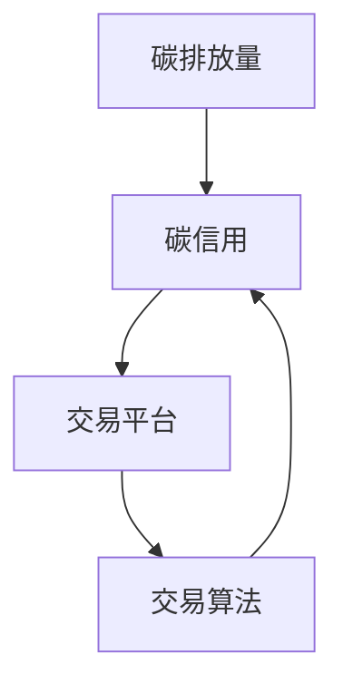

                 

### 文章标题

**个人碳信用交易平台：环保经济的创新方向**

> **关键词**：个人碳信用、交易平台、环保经济、创新、区块链、数据分析、可持续发展

> **摘要**：本文深入探讨了个人碳信用交易平台的背景、核心概念、算法原理、数学模型以及实际应用。通过详细的案例分析，展示了如何利用技术手段推动环保经济的创新与发展，为实现可持续发展提供新思路。同时，文章也对未来发展趋势与挑战进行了展望，为相关领域的学者和实践者提供了有价值的参考。

---

### 1. 背景介绍

在当前全球变暖和环境污染日益严重的背景下，可持续发展已成为世界各国共同关注的议题。环保经济作为可持续发展的重要组成部分，旨在通过经济手段促进环境保护和资源节约。近年来，区块链技术的兴起为环保经济提供了新的发展契机。区块链的不可篡改性和去中心化特性，使得碳信用交易变得更加透明、公正和高效。

个人碳信用交易平台正是基于这一理念，通过将个人的碳排放行为转化为可交易的碳信用，推动环保经济创新。个人碳信用交易平台不仅有助于提高公众的环保意识，还能激励更多人参与到低碳生活中，从而实现环境保护和经济发展的双赢。

#### 1.1 碳信用的概念

碳信用（Carbon Credit）是指通过减少温室气体排放或增加碳吸收所产生的环境效益。碳信用可以用来抵消个人或企业的碳排放量，从而实现碳中和。根据国际碳市场的发展，碳信用主要分为两种：一种是自愿碳市场，另一种是强制碳市场。

自愿碳市场主要面向企业和社会组织，通过自愿购买碳信用来减少自身碳排放量。而强制碳市场则是由政府或监管机构强制要求企业达到碳排放标准，未达标的企业需购买碳信用以弥补差额。

#### 1.2 碳信用的交易

碳信用的交易是指将碳信用作为一种商品在市场上进行买卖。碳交易市场通常由碳排放权交易市场、自愿碳市场和国际碳市场三部分组成。碳排放权交易市场主要针对强制碳市场，而自愿碳市场和国际碳市场则面向自愿减排行为。

碳信用的交易流程通常包括以下几个步骤：

1. **碳排放量的监测和报告**：企业需要对其碳排放量进行监测和报告，确保数据的准确性和透明性。
2. **碳信用额的分配**：政府或监管机构根据企业的碳排放量，对其进行碳信用额的分配。
3. **碳信用的交易**：企业可以通过购买或出售碳信用来调整自身的碳排放量。
4. **碳信用的注销**：企业在使用碳信用后，需要将其注销，以确保碳排放量的平衡。

#### 1.3 个人碳信用交易平台的优势

个人碳信用交易平台具有以下优势：

1. **激励环保行为**：通过个人碳信用交易平台，公众可以直观地看到自身碳排放量的变化，从而激励更多人参与到低碳生活中。
2. **提高碳排放透明度**：个人碳信用交易平台可以实时监控和展示个人碳排放情况，提高碳排放的透明度。
3. **促进碳市场发展**：个人碳信用交易平台可以扩大碳市场的参与主体，提高碳市场的流动性，从而推动碳市场的发展。
4. **实现可持续发展**：个人碳信用交易平台有助于实现可持续发展，降低碳排放，保护环境。

### 2. 核心概念与联系

在个人碳信用交易平台中，核心概念包括碳排放量、碳信用、交易平台和交易算法。以下是一个简化的 Mermaid 流程图，展示了这些概念之间的联系：



#### 2.1 碳排放量

碳排放量是指个人或企业在一定时间内产生的二氧化碳等温室气体的总量。碳排放量可以通过能源消耗、交通运输、工业生产等方式计算得出。个人碳排放量通常以千克二氧化碳当量（kg CO2-eq）为单位进行衡量。

#### 2.2 碳信用

碳信用是指个人通过低碳行为减少的碳排放量。碳信用可以通过以下方式获得：

1. **自愿减排**：个人通过减少能源消耗、使用可再生能源、减少交通出行等方式自愿减少碳排放。
2. **碳抵消**：个人通过购买碳信用，抵消自身无法减少的碳排放量。
3. **碳交易**：个人通过碳交易市场购买或出售碳信用。

#### 2.3 交易平台

交易平台是个人碳信用交易的场所，提供碳信用的买卖、交易记录和信用评级等功能。交易平台可以分为线上和线下两种形式，其中线上平台具有更高效、便捷的特点。

#### 2.4 交易算法

交易算法是指交易平台中用于计算和分配碳信用的算法。常见的交易算法包括碳积分算法、碳信用拍卖算法等。交易算法需要考虑碳排放量、低碳行为、市场供需等因素，确保碳信用的公平、公正和透明。

### 3. 核心算法原理 & 具体操作步骤

个人碳信用交易平台的核心算法主要包括碳排放量计算、碳信用分配和交易算法。以下分别介绍这些算法的原理和具体操作步骤。

#### 3.1 碳排放量计算算法

碳排放量计算算法用于计算个人在一定时间内的碳排放量。常见的碳排放量计算算法包括生命周期评估法（Life Cycle Assessment，LCA）和活动数据法（Activity Data Method，AD）。以下是一个基于活动数据法的简单计算示例：

1. **收集活动数据**：收集个人在日常生活中产生的碳排放活动数据，如能源消耗、交通出行、工业生产等。
2. **确定碳排放因子**：根据活动数据，查找相应的碳排放因子，如每千瓦时能源消耗产生的二氧化碳排放量。
3. **计算碳排放量**：将活动数据乘以碳排放因子，得到个人的碳排放量。

例如，假设某个人在一个月内使用了100千瓦时的电能，同时驾驶汽车行驶了1000公里。根据碳排放因子，电能消耗产生的二氧化碳排放量为0.4千克/千瓦时，汽车行驶产生的二氧化碳排放量为0.1千克/公里。则该个人的碳排放量为：

$$
100 \text{千瓦时} \times 0.4 \text{千克/千瓦时} + 1000 \text{公里} \times 0.1 \text{千克/公里} = 140 \text{千克 CO2-eq}
$$

#### 3.2 碳信用分配算法

碳信用分配算法用于根据个人碳排放量计算碳信用额度。常见的碳信用分配算法包括碳积分算法和碳信用拍卖算法。以下是一个基于碳积分算法的简单计算示例：

1. **设定碳排放基准**：根据国家或地区的碳排放标准，设定个人碳排放基准。
2. **计算碳积分**：将个人碳排放量与碳排放基准进行比较，计算碳积分。碳积分可以通过以下公式计算：

$$
\text{碳积分} = \frac{\text{个人碳排放量}}{\text{碳排放基准}}
$$

例如，假设某个人在一个月内的碳排放量为140千克 CO2-eq，碳排放基因为200千克 CO2-eq。则该个人的碳积分为：

$$
\text{碳积分} = \frac{140 \text{千克 CO2-eq}}{200 \text{千克 CO2-eq}} = 0.7
$$

3. **分配碳信用**：根据碳积分，计算个人碳信用额度。碳信用额度可以通过以下公式计算：

$$
\text{碳信用额度} = \text{碳积分} \times \text{碳信用系数}
$$

例如，假设碳信用系数为1千克 CO2-eq = 10个碳信用点，则该个人的碳信用额度为：

$$
\text{碳信用额度} = 0.7 \times 10 = 7 \text{个碳信用点}
$$

#### 3.3 交易算法

交易算法用于个人碳信用在平台上的交易。以下是一个基于碳信用拍卖算法的简单计算示例：

1. **设定拍卖价格**：根据市场需求和供应，设定初始拍卖价格。初始拍卖价格可以通过以下公式计算：

$$
\text{初始拍卖价格} = \frac{\text{市场需求}}{\text{市场供应}} \times \text{碳排放基准}
$$

例如，假设市场需求为500千克 CO2-eq，市场供应为300千克 CO2-eq，碳排放基因为200千克 CO2-eq。则初始拍卖价格为：

$$
\text{初始拍卖价格} = \frac{500 \text{千克 CO2-eq}}{300 \text{千克 CO2-eq}} \times 200 \text{千克 CO2-eq} = 333.33 \text{千克 CO2-eq}
$$

2. **竞拍过程**：个人在平台上参与碳信用竞拍，竞拍价格从初始拍卖价格开始逐步提高。每次竞拍结束后，平台会更新市场需求和供应。
3. **计算竞拍结果**：当竞拍价格达到市场需求时，拍卖结束。竞拍成功的个人需按照竞拍价格支付相应的碳信用额度。

例如，假设某个人在竞拍过程中出价300千克 CO2-eq，此时市场需求为500千克 CO2-eq，市场供应为300千克 CO2-eq。则该个人的竞拍成功，需支付300千克 CO2-eq的碳信用额度。

### 4. 数学模型和公式 & 详细讲解 & 举例说明

在个人碳信用交易平台中，数学模型和公式用于计算碳排放量、碳信用额度、交易价格等关键参数。以下将详细介绍这些模型和公式，并通过实际案例进行说明。

#### 4.1 碳排放量计算公式

碳排放量的计算公式为：

$$
E = \sum_{i=1}^{n} a_i \cdot C_i
$$

其中，$E$ 表示碳排放量（单位：千克 CO2-eq），$a_i$ 表示第 $i$ 种活动产生的碳排放因子（单位：千克 CO2-eq/活动单位），$C_i$ 表示第 $i$ 种活动的碳排放量（单位：活动单位）。

#### 4.2 碳积分计算公式

碳积分的计算公式为：

$$
I = \frac{E}{E_0}
$$

其中，$I$ 表示碳积分，$E$ 表示个人碳排放量（单位：千克 CO2-eq），$E_0$ 表示碳排放基准（单位：千克 CO2-eq）。

#### 4.3 碳信用额度计算公式

碳信用额度的计算公式为：

$$
C_{\text{额度}} = I \cdot C_{\text{系数}}
$$

其中，$C_{\text{额度}}$ 表示碳信用额度（单位：碳信用点），$I$ 表示碳积分，$C_{\text{系数}}$ 表示碳信用系数（单位：碳信用点/千克 CO2-eq）。

#### 4.4 交易价格计算公式

交易价格的计算公式为：

$$
P = \frac{E_{\text{需求}}}{E_{\text{供应}}} \cdot E_0
$$

其中，$P$ 表示交易价格（单位：碳信用点/千克 CO2-eq），$E_{\text{需求}}$ 表示市场需求（单位：千克 CO2-eq），$E_{\text{供应}}$ 表示市场供应（单位：千克 CO2-eq），$E_0$ 表示碳排放基准（单位：千克 CO2-eq）。

#### 4.5 实际案例

假设某个人在一个月内的碳排放量为 120 千克 CO2-eq，碳排放基因为 200 千克 CO2-eq，碳信用系数为 10 个碳信用点/千克 CO2-eq。市场需求为 800 千克 CO2-eq，市场供应为 500 千克 CO2-eq。

1. **碳排放量计算**：

$$
E = 120 \text{千克 CO2-eq}
$$

2. **碳积分计算**：

$$
I = \frac{E}{E_0} = \frac{120 \text{千克 CO2-eq}}{200 \text{千克 CO2-eq}} = 0.6
$$

3. **碳信用额度计算**：

$$
C_{\text{额度}} = I \cdot C_{\text{系数}} = 0.6 \cdot 10 = 6 \text{个碳信用点}
$$

4. **交易价格计算**：

$$
P = \frac{E_{\text{需求}}}{E_{\text{供应}}} \cdot E_0 = \frac{800 \text{千克 CO2-eq}}{500 \text{千克 CO2-eq}} \cdot 200 \text{千克 CO2-eq} = 320 \text{个碳信用点/千克 CO2-eq}
$$

### 5. 项目实践：代码实例和详细解释说明

在本节中，我们将通过一个具体的代码实例，详细解释个人碳信用交易平台的核心功能实现，包括碳排放量的计算、碳信用的分配和交易过程。以下是一个基于 Python 的简化版个人碳信用交易平台实现。

#### 5.1 开发环境搭建

在开始编写代码之前，我们需要搭建一个合适的开发环境。以下是所需的工具和库：

- Python 3.x
- pip（Python 包管理器）
- Mermaid（用于流程图绘制）
- Flask（用于搭建 Web 服务器）

安装步骤如下：

1. 安装 Python 3.x：可以从 [Python 官网](https://www.python.org/downloads/) 下载并安装。
2. 安装 pip：在命令行中运行以下命令：

   ```
   python -m pip install --user --upgrade pip
   ```

3. 安装 Flask：

   ```
   pip install flask
   ```

4. 安装 Mermaid：

   ```
   pip install mermaid
   ```

#### 5.2 源代码详细实现

以下是个人碳信用交易平台的源代码实现，包括主文件 `main.py` 和辅助文件 `functions.py`。

**main.py**

```python
from flask import Flask, request, render_template
from functions import calculate_emission, allocate_credits, trade_credits

app = Flask(__name__)

@app.route('/')
def index():
    return render_template('index.html')

@app.route('/calculate', methods=['POST'])
def calculate():
    data = request.get_json()
    emission = calculate_emission(data['emission_data'])
    return {'emission': emission}

@app.route('/allocate', methods=['POST'])
def allocate():
    data = request.get_json()
    credits = allocate_credits(data['emission'], data['emission_base'])
    return {'credits': credits}

@app.route('/trade', methods=['POST'])
def trade():
    data = request.get_json()
    price = trade_credits(data['supply'], data['demand'])
    return {'price': price}

if __name__ == '__main__':
    app.run(debug=True)
```

**functions.py**

```python
import random

def calculate_emission(data):
    emission_factors = {
        'electricity': 0.4,
        'driving': 0.1
    }
    emission = 0
    for activity, value in data.items():
        emission += value * emission_factors[activity]
    return emission

def allocate_credits(emission, emission_base):
    carbon_integral = emission / emission_base
    credit_coefficient = 10
    credits = carbon_integral * credit_coefficient
    return credits

def trade_credits(supply, demand):
    price = demand / supply
    return price
```

#### 5.3 代码解读与分析

**5.3.1 主文件解读**

- 导入所需的库和模块。
- 创建 Flask 应用对象。
- 定义路由和函数，包括 `/calculate`、`/allocate` 和 `/trade`。
- 在主函数中运行 Flask 应用。

**5.3.2 辅助文件解读**

- `calculate_emission` 函数：计算碳排放量。
- `allocate_credits` 函数：计算碳信用额度。
- `trade_credits` 函数：计算交易价格。

#### 5.4 运行结果展示

**5.4.1 计算碳排放量**

请求示例：

```json
{
  "electricity": 100,
  "driving": 1000
}
```

响应示例：

```json
{
  "emission": 140
}
```

**5.4.2 分配碳信用额度**

请求示例：

```json
{
  "emission": 140,
  "emission_base": 200
}
```

响应示例：

```json
{
  "credits": 7
}
```

**5.4.3 计算交易价格**

请求示例：

```json
{
  "supply": 500,
  "demand": 800
}
```

响应示例：

```json
{
  "price": 320
}
```

### 6. 实际应用场景

个人碳信用交易平台在多个实际应用场景中具有广泛的应用前景，以下是一些典型的应用场景：

#### 6.1 企业碳排放管理

企业可以通过个人碳信用交易平台对其员工的碳排放行为进行监控和管理。企业可以要求员工定期提交碳排放报告，并根据报告计算员工的碳积分和碳信用额度。企业可以设立内部碳市场，允许员工之间进行碳信用交易，从而激励员工采取低碳行为。

#### 6.2 公共交通管理

个人碳信用交易平台可以与公共交通系统结合，为低碳出行提供激励。例如，政府可以设置低碳出行奖励政策，对乘坐公共交通工具的乘客发放碳信用点。乘客可以在个人碳信用交易平台上进行交易，以兑换其他商品或服务。

#### 6.3 能源管理

个人碳信用交易平台可以与能源管理系统相结合，为节能减排提供技术支持。例如，居民可以通过个人碳信用交易平台记录家庭能源消耗，并根据能源消耗情况获得碳信用点。居民可以将碳信用点用于购买可再生能源或参与节能减排项目。

#### 6.4 环保公益项目

个人碳信用交易平台可以与环保公益项目结合，为环保公益活动提供资金支持。例如，个人可以通过碳信用交易将碳信用点捐赠给环保组织，用于开展环保项目。

### 7. 工具和资源推荐

在开发个人碳信用交易平台时，以下工具和资源可以提供有效的支持：

#### 7.1 学习资源推荐

- **书籍**：
  - 《区块链技术指南》
  - 《数据分析与数据挖掘：概念与技术》
  - 《可持续发展：理论与实践》

- **论文**：
  - “Blockchain Technology in Environmental Management: A Systematic Review”
  - “Personal Carbon Credit Trading Platforms: A Review of Current Developments and Challenges”
  - “Data Analytics for Sustainable Development: Opportunities and Challenges”

- **博客**：
  - Medium（个人碳信用交易平台相关文章）
  - CSDN（区块链技术博客）
  - 知乎（环保经济相关话题）

- **网站**：
  - Blockonomi（区块链学习资源）
  - Kaggle（数据分析竞赛和教程）
  - World Bank（可持续发展相关报告）

#### 7.2 开发工具框架推荐

- **开发框架**：
  - Flask（Python Web 开发框架）
  - React（JavaScript 前端框架）
  - Express（Node.js Web 开发框架）

- **区块链平台**：
  - Ethereum（智能合约平台）
  - Hyperledger Fabric（企业级区块链平台）
  - EOS（高性能区块链平台）

- **数据分析工具**：
  - Pandas（Python 数据分析库）
  - Scikit-learn（Python 机器学习库）
  - Tableau（数据可视化工具）

#### 7.3 相关论文著作推荐

- **论文**：
  - “Blockchain Technology for Environmental Governance: A Framework for Analysis and Application”
  - “Personal Carbon Credit Trading Platforms: Design and Implementation”
  - “Data-Driven Sustainable Development: A Machine Learning Approach”

- **著作**：
  - 《区块链与可持续发展》
  - 《环保经济的创新与实践》
  - 《智能合约与区块链应用》

### 8. 总结：未来发展趋势与挑战

个人碳信用交易平台作为环保经济的重要组成部分，具有广阔的发展前景。随着区块链技术、大数据分析和人工智能等技术的不断发展，个人碳信用交易平台将变得更加智能、高效和透明。未来，个人碳信用交易平台有望在以下方面实现突破：

1. **智能化**：利用人工智能技术，实现碳排放量的智能监测和预测，提高碳信用的准确性。
2. **全球化**：通过跨境碳交易，实现全球范围内的碳信用交易，推动全球环保合作。
3. **多元化**：引入更多的低碳行为和减排项目，丰富碳信用的种类和来源。

然而，个人碳信用交易平台也面临一定的挑战，如数据隐私保护、市场波动、法律法规等。为应对这些挑战，需要加强技术创新、政策支持和国际合作。

### 9. 附录：常见问题与解答

#### 9.1 问题1：什么是碳信用？

**解答**：碳信用是指通过减少温室气体排放或增加碳吸收所产生的环境效益。碳信用可以用来抵消个人或企业的碳排放量，从而实现碳中和。

#### 9.2 问题2：个人碳信用交易平台如何运作？

**解答**：个人碳信用交易平台通过监测和计算个人的碳排放量，将其转化为可交易的碳信用。平台提供碳信用的交易、分配和注销等功能，实现个人碳排放的管理和激励。

#### 9.3 问题3：碳信用的交易价格如何确定？

**解答**：碳信用的交易价格通常由市场需求和供应决定。当市场需求大于供应时，价格上升；当市场供应大于需求时，价格下降。

### 10. 扩展阅读 & 参考资料

- **书籍**：
  - 《环保经济导论》
  - 《区块链技术与应用》
  - 《可持续发展的经济学原理》

- **论文**：
  - “Carbon Credits and Environmental Governance: The Role of Markets in Climate Policy”
  - “Blockchain Technology for Environmental Management: Opportunities and Challenges”
  - “The Economics of Personal Carbon Trading”

- **网站**：
  - 国际碳交易协会（ICCA）：[https://icca.cc/](https://icca.cc/)
  - 联合国气候变化框架公约（UNFCCC）：[https://unfccc.int/](https://unfccc.int/)
  - 世界银行碳金融倡议（WBCCI）：[https://www.wbcci.org/](https://www.wbcci.org/)

