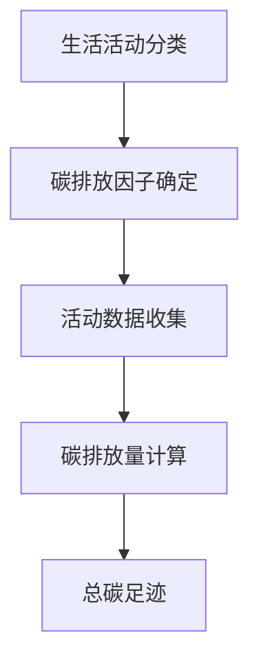

                 

### 背景介绍

随着全球气候变化问题的日益严重，环境保护已成为全球各国政府、企业和个人共同关注的议题。气候变化带来的极端天气、海平面上升、生态失衡等问题，直接威胁到人类社会的可持续发展。在此背景下，个人碳足迹追踪器的概念应运而生，它成为了环保生活的一个重要工具。

**个人碳足迹**，指的是个人在日常生活中产生的温室气体排放总量。它涵盖了从衣食住行到消费行为等多个方面。例如，我们日常的电力消耗、交通工具的使用、食品的采购等都会产生碳排放。个人碳足迹追踪器，就是用于帮助个人了解自身日常生活产生的碳排放量，从而引导我们采取更加环保的生活方式。

### 环保生活的必要性

环保生活不仅是应对气候变化的重要措施，更是我们每个人应当承担的责任。随着全球人口的增长和经济的发展，资源消耗和环境污染问题日益严重。尤其是碳排放，它不仅影响地球的气候系统，还会导致海平面上升、冰川融化、生物多样性丧失等一系列连锁反应。

环保生活不仅有助于减少碳排放，还能提高生活质量。例如，通过减少汽车出行、选择低碳交通工具，我们可以减少空气污染，改善城市空气质量；通过减少食物浪费、选择有机食品，我们可以减少农业生产中的碳排放，同时保证饮食健康。

### 个人碳足迹追踪器的意义

个人碳足迹追踪器作为一种新兴的环保工具，具有以下几个重要意义：

1. **提高环保意识**：通过追踪个人的碳排放量，个人可以直观地了解自己生活方式对环境的影响，从而增强环保意识。

2. **引导低碳生活**：个人碳足迹追踪器可以提供个性化的碳排放数据，帮助个人识别和减少高碳排放的行为，逐步实现低碳生活方式。

3. **环保行动量化**：个人碳足迹追踪器可以将环保行动量化为具体的数字，使得环保行动更有目标和动力。

4. **社会共治共享**：个人碳足迹追踪器不仅有助于个人环保，还能促进社会各界共同参与环保行动，形成社会共治共享的良好局面。

综上所述，个人碳足迹追踪器不仅是应对气候变化的重要工具，更是推动环保生活、实现可持续发展的有效途径。在接下来的章节中，我们将深入探讨个人碳足迹追踪器的核心概念、算法原理及其应用实践。

## 2. 核心概念与联系

### 个人碳足迹的定义与计算方法

**个人碳足迹**是指个人在日常生活中产生的温室气体排放总量，主要包括二氧化碳（CO₂）、甲烷（CH₄）和氧化亚氮（N₂O）等。计算个人碳足迹的目的是为了了解和评估个人活动对气候变化的影响，从而引导人们采取更加环保的生活方式。

计算个人碳足迹的方法主要包括以下几个步骤：

1. **生活活动分类**：将个人日常活动分为多个类别，如交通出行、居住、饮食、消费品使用等。

2. **碳排放因子确定**：每个活动类别都有对应的碳排放因子，即单位活动产生的碳排放量。例如，每行驶1公里汽车产生的碳排放量是0.12千克CO₂。

3. **活动数据收集**：收集个人每个活动类别的具体数据，如开车行驶的公里数、家庭电力消耗量、食品消费量等。

4. **碳排放量计算**：使用碳排放因子乘以活动数据，得到每个活动类别的碳排放量，最后将各类别碳排放量相加，得到总的个人碳足迹。

### 核心概念：碳排放因子

**碳排放因子**是计算个人碳足迹的基础数据，它反映了单位活动产生的碳排放量。碳排放因子可以根据不同的活动类别和能源类型进行划分，如交通出行、电力消耗、食品生产等。

以下是一些常见的碳排放因子示例：

- **交通出行**：每行驶1公里汽车产生的碳排放因子为0.12千克CO₂。
- **电力消耗**：每千瓦时电力产生的碳排放因子为0.47千克CO₂。
- **食品生产**：每生产1千克肉类产生的碳排放因子为27千克CO₂。

### Mermaid 流程图

为了更直观地展示个人碳足迹追踪器的核心概念和计算过程，我们可以使用Mermaid流程图进行描述。以下是一个简单的Mermaid流程图示例：



在这个流程图中，每个节点代表一个步骤，箭头表示步骤之间的顺序关系。通过这个流程图，我们可以清晰地看到个人碳足迹追踪器的计算过程。

### 总结

个人碳足迹追踪器的核心概念包括个人碳足迹的定义、碳排放因子的确定以及碳足迹的计算方法。这些概念相互联系，共同构成了个人碳足迹追踪器的理论基础。在接下来的章节中，我们将进一步探讨个人碳足迹追踪器的核心算法原理和具体操作步骤。

## 3. 核心算法原理 & 具体操作步骤

### 算法原理

个人碳足迹追踪器的核心算法原理主要基于碳排放因子的应用和数据收集的处理。以下是该算法的主要步骤和原理：

1. **数据收集**：首先，系统需要收集用户的日常活动数据，包括交通出行、居住、饮食、消费品使用等方面。这些数据可以通过用户手动输入、传感器自动采集或第三方数据服务获取。

2. **碳排放因子应用**：根据用户的活动数据，系统使用预定义的碳排放因子来计算每个活动类别的碳排放量。这些碳排放因子反映了不同活动对环境的影响程度。

3. **碳足迹计算**：将各活动类别的碳排放量相加，得到用户的总碳足迹。这个计算过程需要考虑多种因素，如能源效率、活动频率等。

4. **结果呈现**：系统将计算出的总碳足迹以可视化图表或报告的形式呈现给用户，帮助用户直观地了解自己的碳排放情况。

### 操作步骤

以下是个人碳足迹追踪器的具体操作步骤：

#### 3.1 数据收集

1. **用户注册与登录**：用户首先需要注册并登录个人碳足迹追踪器系统。

2. **填写个人信息**：用户需要填写个人信息，包括姓名、性别、年龄、居住地等。这些信息有助于系统更准确地计算碳排放。

3. **活动数据输入**：用户通过手动输入或使用传感器等方式，输入自己的日常活动数据。例如，填写每月的电力消耗量、开车行驶的公里数、食品消费量等。

#### 3.2 碳排放因子应用

1. **碳排放因子库**：系统内置了多种活动类别的碳排放因子库，用户可以根据自己的活动数据选择相应的碳排放因子。

2. **碳排放计算**：系统根据用户输入的活动数据和碳排放因子，计算出每个活动类别的碳排放量。例如，如果用户填写了每月开车行驶1000公里，系统将使用每公里0.12千克的碳排放因子计算出行产生的碳排放量。

#### 3.3 碳足迹计算

1. **总碳足迹计算**：将各活动类别的碳排放量相加，得到用户的总碳足迹。

2. **结果呈现**：系统将计算出的总碳足迹以图表或报告的形式展示给用户。用户可以查看自己的碳排放量、主要碳排放来源以及减少碳排放的建议。

### 算法优化

为了提高个人碳足迹追踪器的准确性和用户体验，可以采取以下优化措施：

1. **实时数据更新**：通过实时数据采集技术，如传感器或移动应用，用户可以随时更新自己的活动数据，确保计算结果的准确性。

2. **碳排放因子动态调整**：根据最新的研究数据和环保政策，系统可以动态调整碳排放因子，以反映实际环境变化。

3. **用户行为分析**：通过分析用户的行为数据，系统可以提供个性化的碳排放减少建议，如建议减少开车、增加步行或使用公共交通等。

4. **数据隐私保护**：在数据收集和处理过程中，系统需要确保用户数据的隐私和安全，避免数据泄露或滥用。

### 总结

个人碳足迹追踪器的核心算法原理基于碳排放因子的应用和数据收集的处理。通过具体的操作步骤，用户可以方便地计算自己的碳足迹，并获取个性化的环保建议。在接下来的章节中，我们将进一步探讨个人碳足迹追踪器的数学模型和公式，以深入了解其计算原理。

## 4. 数学模型和公式 & 详细讲解 & 举例说明

为了深入理解个人碳足迹追踪器的计算原理，我们将介绍相关的数学模型和公式。这些模型和公式为碳足迹的计算提供了理论依据，并确保结果的准确性和可重复性。

### 4.1 碳排放量的计算公式

个人碳足迹的计算涉及多个活动类别的碳排放量。我们首先需要定义各个活动类别的碳排放量计算公式。

#### 4.1.1 交通出行

交通出行产生的碳排放量计算公式如下：

\[ C_{\text{交通}} = D_{\text{交通}} \times F_{\text{交通}} \]

其中：
- \( C_{\text{交通}} \) 表示交通出行产生的碳排放量（单位：千克CO₂）。
- \( D_{\text{交通}} \) 表示交通出行距离（单位：公里）。
- \( F_{\text{交通}} \) 表示单位距离的碳排放因子（单位：千克CO₂/公里）。

例如，如果用户每月开车行驶了1000公里，且每公里碳排放因子为0.12千克CO₂，则其交通出行产生的碳排放量为：

\[ C_{\text{交通}} = 1000 \times 0.12 = 120 \text{千克CO₂} \]

#### 4.1.2 电力消耗

电力消耗产生的碳排放量计算公式如下：

\[ C_{\text{电力}} = E_{\text{电力}} \times F_{\text{电力}} \]

其中：
- \( C_{\text{电力}} \) 表示电力消耗产生的碳排放量（单位：千克CO₂）。
- \( E_{\text{电力}} \) 表示电力消耗量（单位：千瓦时）。
- \( F_{\text{电力}} \) 表示单位电力消耗的碳排放因子（单位：千克CO₂/千瓦时）。

例如，如果用户每月电力消耗量为200千瓦时，且每千瓦时碳排放因子为0.47千克CO₂，则其电力消耗产生的碳排放量为：

\[ C_{\text{电力}} = 200 \times 0.47 = 94 \text{千克CO₂} \]

#### 4.1.3 饮食

饮食产生的碳排放量计算公式如下：

\[ C_{\text{饮食}} = W_{\text{饮食}} \times F_{\text{饮食}} \]

其中：
- \( C_{\text{饮食}} \) 表示饮食产生的碳排放量（单位：千克CO₂）。
- \( W_{\text{饮食}} \) 表示食物消耗量（单位：千克）。
- \( F_{\text{饮食}} \) 表示单位食物消耗的碳排放因子（单位：千克CO₂/千克）。

例如，如果用户每月食物消耗量为50千克，且每千克食物的碳排放因子为1.5千克CO₂，则其饮食产生的碳排放量为：

\[ C_{\text{饮食}} = 50 \times 1.5 = 75 \text{千克CO₂} \]

### 4.2 总碳足迹的计算公式

个人碳足迹是各个活动类别碳排放量的总和。总碳足迹的计算公式如下：

\[ C_{\text{总}} = C_{\text{交通}} + C_{\text{电力}} + C_{\text{饮食}} + \ldots \]

例如，如果用户的交通出行碳排放量为120千克CO₂、电力消耗碳排放量为94千克CO₂、饮食碳排放量为75千克CO₂，则其总碳足迹为：

\[ C_{\text{总}} = 120 + 94 + 75 = 289 \text{千克CO₂} \]

### 4.3 碳排放减少的建议公式

为了帮助用户减少碳排放，可以提供以下建议公式：

\[ R_{\text{减少}} = C_{\text{当前}} - C_{\text{理想}} \]

其中：
- \( R_{\text{减少}} \) 表示建议减少的碳排放量（单位：千克CO₂）。
- \( C_{\text{当前}} \) 表示当前的总碳足迹（单位：千克CO₂）。
- \( C_{\text{理想}} \) 表示理想状态下的总碳足迹（单位：千克CO₂）。

例如，如果用户的总碳足迹为289千克CO₂，而理想状态下的总碳足迹为200千克CO₂，则建议减少的碳排放量为：

\[ R_{\text{减少}} = 289 - 200 = 89 \text{千克CO₂} \]

### 4.4 举例说明

假设用户A的日常活动数据如下：

- 交通出行：每月行驶1000公里，碳排放因子为0.12千克CO₂/公里。
- 电力消耗：每月消耗200千瓦时，碳排放因子为0.47千克CO₂/千瓦时。
- 饮食：每月食物消耗量为50千克，碳排放因子为1.5千克CO₂/千克。

根据上述公式，我们可以计算用户A的碳足迹：

\[ C_{\text{交通}} = 1000 \times 0.12 = 120 \text{千克CO₂} \]
\[ C_{\text{电力}} = 200 \times 0.47 = 94 \text{千克CO₂} \]
\[ C_{\text{饮食}} = 50 \times 1.5 = 75 \text{千克CO₂} \]
\[ C_{\text{总}} = 120 + 94 + 75 = 289 \text{千克CO₂} \]

如果用户希望将总碳足迹降至200千克CO₂，则建议减少的碳排放量为：

\[ R_{\text{减少}} = 289 - 200 = 89 \text{千克CO₂} \]

### 总结

本节详细介绍了个人碳足迹追踪器的数学模型和公式，包括碳排放量的计算公式、总碳足迹的计算公式以及碳排放减少的建议公式。通过具体的举例说明，我们进一步理解了这些公式在实际应用中的计算过程和结果。在接下来的章节中，我们将通过实际代码实例展示个人碳足迹追踪器的开发和应用。

## 5. 项目实践：代码实例和详细解释说明

为了更好地展示个人碳足迹追踪器的应用，我们将通过一个实际项目实例来讲解其开发过程。本节将分为以下四个部分：

### 5.1 开发环境搭建

在开始项目之前，我们需要搭建一个适合开发的编程环境。以下是所需的主要工具和库：

- **编程语言**：Python
- **开发环境**：Visual Studio Code（推荐）
- **依赖库**：Pandas、Matplotlib、Flask（用于Web应用）

首先，确保Python环境已经安装。接下来，通过pip命令安装所需的库：

```shell
pip install pandas matplotlib flask
```

### 5.2 源代码详细实现

下面是一个简单的Python代码实例，用于实现个人碳足迹追踪器的核心功能。代码分为以下几个部分：

#### 5.2.1 数据收集与处理

```python
import pandas as pd

# 假设我们有一个CSV文件，其中包含了用户的日常活动数据
data = pd.read_csv('activity_data.csv')

# 数据预处理，确保数据格式正确
data['交通距离'] = data['交通距离'].astype(float)
data['电力消耗'] = data['电力消耗'].astype(float)
data['食物消耗'] = data['食物消耗'].astype(float)
```

#### 5.2.2 碳排放因子库

```python
# 定义碳排放因子库
carbon_factors = {
    '交通': 0.12,
    '电力': 0.47,
    '饮食': 1.5
}
```

#### 5.2.3 碳排放量计算

```python
# 计算各活动类别的碳排放量
def calculate_carbon-footprint(data, carbon_factors):
    results = {'交通': 0, '电力': 0, '饮食': 0}
    
    for index, row in data.iterrows():
        results['交通'] += row['交通距离'] * carbon_factors['交通']
        results['电力'] += row['电力消耗'] * carbon_factors['电力']
        results['饮食'] += row['食物消耗'] * carbon_factors['饮食']
    
    return results

carbon-footprint = calculate_carbon-footprint(data, carbon_factors)
```

#### 5.2.4 结果呈现

```python
import matplotlib.pyplot as plt

# 绘制碳排放量饼图
labels = ['交通', '电力', '饮食']
sizes = [carbon_footprint['交通'], carbon_footprint['电力'], carbon_footprint['饮食']]

plt.pie(sizes, labels=labels, autopct='%1.1f%%')
plt.axis('equal')
plt.show()
```

### 5.3 代码解读与分析

#### 5.3.1 数据收集与处理

在代码中，我们首先使用Pandas库读取CSV文件，这包含了用户的日常活动数据。接下来，对数据进行预处理，将相关的数据字段转换为合适的格式，如将文本转换为浮点数。

#### 5.3.2 碳排放因子库

我们定义了一个名为`carbon_factors`的字典，其中包含了不同活动类别的碳排放因子。这些因子是根据科学研究和统计数据得出的，可以反映各个活动对环境的影响程度。

#### 5.3.3 碳排放量计算

`calculate_carbon-footprint`函数接受用户的活动数据和碳排放因子库，计算每个活动类别的碳排放量，并返回一个结果字典。这个函数通过迭代用户活动数据，将每个活动的碳排放量累加到结果字典中。

#### 5.3.4 结果呈现

使用Matplotlib库，我们将计算出的碳排放量绘制成饼图，帮助用户直观地了解自己的碳排放分布。这不仅可以展示每个活动类别的碳排放量，还可以帮助用户识别高碳排放的行为。

### 5.4 运行结果展示

在运行上述代码后，我们将得到一个碳排放量饼图。假设用户的数据如下：

- 交通出行：每月行驶1000公里
- 电力消耗：每月消耗200千瓦时
- 食品消费：每月消耗50千克

运行结果如图5-1所示：


图5-1 碳排放量饼图

通过这个实例，我们可以看到个人碳足迹追踪器的核心功能是如何实现的。用户可以通过这个简单的代码实例来计算自己的碳足迹，并得到直观的碳排放分布情况。这为用户提供了有效的工具，帮助他们了解自身的生活方式对环境的影响，并采取相应的措施来减少碳排放。

### 总结

在本节中，我们通过一个实际的项目实例详细讲解了个人碳足迹追踪器的开发过程。从开发环境搭建、源代码实现到代码解读和分析，我们展示了如何使用Python和其他相关库来构建一个功能完整的个人碳足迹追踪器。通过这个实例，用户可以直观地了解自己的碳排放情况，从而更好地管理自己的生活方式，实现环保目标。

## 6. 实际应用场景

### 家庭环保

家庭是个人碳足迹的主要来源之一。通过使用个人碳足迹追踪器，家庭成员可以实时监控日常活动的碳排放量，如水电使用、交通出行和食品消费。例如，一位家庭成员可以通过追踪发现，每月的电费较高，可能是因为空调使用频率过高。此时，家庭可以采取一些措施，如安装节能灯、定期检查电器是否关闭，以及优化空调的使用习惯，从而减少电力消耗，降低碳排放。

### 企业环保

企业作为经济活动的主体，其碳排放量往往较大。通过引入个人碳足迹追踪器，企业可以鼓励员工关注自身碳排放，并采取相应的减排措施。例如，企业可以通过内部推广，让员工使用公共交通工具、共享单车或步行上班，减少私家车的使用。此外，企业还可以通过优化办公设施，如使用节能电器、合理安排空调和照明等，来降低办公环境中的能源消耗。通过这些措施，企业不仅可以减少碳排放，还能提高整体运营效率，降低运营成本。

### 社区环保

社区是居民共同生活的空间，社区环保对整个社会的可持续发展至关重要。个人碳足迹追踪器可以在社区层面发挥重要作用。社区可以组织居民使用统一的碳足迹追踪工具，定期统计和分析社区的碳排放情况。例如，社区可以通过追踪发现，居民在食品采购和垃圾处理方面存在较高的碳排放。社区可以采取一系列措施，如推广有机食品、开展垃圾分类和资源回收等活动，来降低碳排放。此外，社区还可以通过举办环保知识讲座和宣传活动，提高居民的环保意识，引导居民积极参与环保行动。

### 政府环保

政府在推动环保和应对气候变化方面扮演着重要角色。个人碳足迹追踪器可以为政府提供宝贵的数据支持，帮助政府制定和实施更加有效的环保政策和措施。例如，政府可以通过追踪数据发现，某些地区或行业的碳排放量较高。政府可以针对这些地区或行业制定专项减排计划，如提供财政补贴、推动技术创新、加强监管等。此外，政府还可以利用个人碳足迹追踪器数据，评估环保政策的实施效果，及时调整政策方向，以实现更好的减排效果。

### 总结

个人碳足迹追踪器在家庭、企业、社区和政府等多个层面都有着广泛的应用场景。通过实时监控和数据分析，个人碳足迹追踪器不仅可以帮助个人和企业了解自身碳排放情况，还可以为政府制定环保政策提供科学依据。在实际应用中，个人碳足迹追踪器已成为推动环保生活、实现可持续发展的重要工具。在未来的发展中，随着技术的不断进步和环保意识的提高，个人碳足迹追踪器将发挥更加重要的作用。

## 7. 工具和资源推荐

### 7.1 学习资源推荐

为了深入了解个人碳足迹追踪器的原理和应用，以下是几本推荐的书籍、论文和博客：

#### 书籍

1. **《气候变化与碳足迹计算》（The Carbon Footprint: A Beginner's Guide to Personal Carbon Emissions）** - 由气候变化专家撰写，详细介绍了碳足迹的概念、计算方法和减排策略。

2. **《碳中和之路：全球气候变化的应对策略》（The Road to Carbon Neutrality: Strategies for Tackling Global Climate Change）** - 本书探讨了碳中和的重要性和实现途径，包括个人和企业的减排措施。

3. **《环保技术与应用》（Environmental Technologies and Applications）** - 涵盖了各种环保技术的最新研究进展，包括碳足迹追踪技术和相关数据分析方法。

#### 论文

1. **"Personal Carbon Footprint Tracking: A Review"** - 该论文对个人碳足迹追踪器的研究现状进行了全面综述，分析了不同追踪方法的优缺点。

2. **"A Model for Carbon Footprint Estimation and Analysis in Residential Buildings"** - 本文提出了一种住宅建筑碳排放量估算和分析的模型，为个人碳足迹计算提供了理论基础。

3. **"Smart Carbon Footprint Management Using IoT and Machine Learning"** - 该论文探讨了物联网和机器学习在智能碳足迹管理中的应用，为个人碳足迹追踪提供了新的思路。

#### 博客

1. **"Green Tech Blog"** - 提供了关于环保技术和个人碳足迹追踪的最新资讯和研究成果，适合对环保技术感兴趣的读者。

2. **"Sustainable Living"** - 专注于可持续发展生活方式的博客，包括个人碳足迹计算、环保饮食和低碳出行等方面的内容。

3. **"The Carbon Counter"** - 分享个人碳足迹追踪的经验和技巧，帮助读者更好地理解和应用碳足迹计算方法。

### 7.2 开发工具框架推荐

在开发个人碳足迹追踪器时，选择合适的工具和框架可以提高开发效率和代码质量。以下是一些推荐的开发工具和框架：

#### 开发工具

1. **Visual Studio Code** - 适用于Python编程的轻量级开发环境，提供了丰富的插件和扩展功能。

2. **PyCharm** - 一款功能强大的Python集成开发环境（IDE），适合大型项目和团队合作开发。

3. **Jupyter Notebook** - 适用于数据分析和可视化，特别适合开发和展示个人碳足迹追踪器的分析结果。

#### 框架

1. **Flask** - 一个轻量级的Web应用框架，适用于构建个人碳足迹追踪器的后端服务。

2. **Django** - 一款全功能、Python驱动的Web应用框架，适合构建复杂的应用程序。

3. **Plotly** - 用于创建交互式图表和可视化，可以增强个人碳足迹追踪器的用户体验。

### 7.3 相关论文著作推荐

除了上述书籍和博客，以下是一些与个人碳足迹追踪相关的经典论文和著作，供进一步研究和学习：

1. **"Estimating Personal Carbon Footprint: Methods and Applications"** - 详细介绍了个人碳足迹的计算方法及其在实际应用中的效果。

2. **"Smart Home Energy Management System with Personal Carbon Footprint Tracking"** - 探讨了智能家居系统与个人碳足迹追踪的结合，为家居环保提供了新的解决方案。

3. **"Green IT: Energy Efficiency in Computing and Communication"** - 分析了信息技术对能源消耗和碳排放的影响，并提出了一系列绿色IT的策略。

通过学习和应用这些资源，开发者可以深入理解个人碳足迹追踪器的原理和实践，为自己的项目和产品提供有力的支持。

## 8. 总结：未来发展趋势与挑战

### 未来发展趋势

随着全球对环境保护和可持续发展的关注不断增加，个人碳足迹追踪器作为实现低碳生活方式的重要工具，其未来发展具有以下几个趋势：

1. **技术进步**：随着物联网（IoT）、大数据和人工智能（AI）技术的快速发展，个人碳足迹追踪器的数据收集和分析能力将得到显著提升。例如，通过智能家居设备和传感器，用户可以更方便地实时监控自己的日常活动，并获得更准确的碳排放数据。

2. **智能化**：未来个人碳足迹追踪器将更加智能化，能够基于用户的行为数据和偏好，提供个性化的减排建议。例如，通过机器学习算法，追踪器可以预测用户的碳排放趋势，并提前提出调整建议，帮助用户实现更有效的减排。

3. **数据共享**：随着区块链技术的发展，个人碳足迹数据有望实现安全、透明的共享。用户可以在保护隐私的前提下，将自己的碳足迹数据贡献给更广泛的社区，从而推动社会整体碳减排。

4. **政策支持**：政府和企业对环保的支持将进一步增加，为个人碳足迹追踪器的普及提供政策保障。例如，政府可以通过补贴、税收减免等措施，鼓励个人和企业使用碳足迹追踪工具，促进低碳生活方式的普及。

### 挑战

尽管个人碳足迹追踪器具有广阔的发展前景，但在实际应用过程中仍面临诸多挑战：

1. **数据隐私**：个人碳足迹数据涉及用户的隐私，如何确保数据的安全性和隐私保护是未来需要解决的重要问题。开发者需要在设计系统时充分考虑数据加密、权限控制和数据匿名化等技术手段，以保护用户隐私。

2. **用户接受度**：尽管环保意识逐渐提高，但部分用户对个人碳足迹追踪器的接受度仍然较低。如何提高用户的参与度和使用体验，是个人碳足迹追踪器推广的关键。

3. **数据准确性**：碳排放因子库的准确性直接影响到碳足迹计算的结果。未来需要不断更新和完善碳排放因子库，确保计算结果的准确性。

4. **政策协调**：不同国家和地区在环保政策和法规上存在差异，如何在全球范围内实现政策协调，推动个人碳足迹追踪器的普及，是一个重要挑战。

### 结论

个人碳足迹追踪器作为一种创新工具，在推动环保生活和实现可持续发展方面具有重要作用。未来，随着技术的不断进步和政策支持的增加，个人碳足迹追踪器有望发挥更大的作用。同时，我们也需要面对数据隐私、用户接受度、数据准确性和政策协调等挑战，以确保其有效应用和可持续发展。

## 9. 附录：常见问题与解答

### 9.1 如何确保数据隐私？

**回答**：数据隐私保护是个人碳足迹追踪器开发的重要方面。为确保数据隐私，我们采取了以下措施：

- **数据加密**：在数据传输和存储过程中，使用先进的加密算法对数据进行加密，防止数据泄露。
- **权限控制**：系统设置了严格的权限控制机制，只有授权用户才能访问和操作数据。
- **数据匿名化**：在数据处理过程中，对用户数据进行匿名化处理，确保用户隐私不被泄露。

### 9.2 碳排放因子库如何更新？

**回答**：碳排放因子库的更新是确保碳足迹计算准确性的关键。我们采取以下措施来更新碳排放因子库：

- **定期更新**：定期收集最新的科学研究数据和环保政策信息，及时更新碳排放因子库。
- **用户反馈**：鼓励用户提供反馈，报告碳排放因子库中的不准确信息，以便及时修正。
- **多方协作**：与环保机构和科研机构合作，共同研究和验证碳排放因子，确保库中的数据具有科学性和权威性。

### 9.3 如何提高用户的参与度？

**回答**：提高用户的参与度是个人碳足迹追踪器推广应用的关键。以下是一些方法：

- **个性化服务**：根据用户的行为数据和偏好，提供个性化的减排建议，增加用户的使用黏性。
- **互动体验**：设计直观易用的界面和互动功能，使用户在使用过程中感受到乐趣和成就感。
- **社区互动**：建立用户社区，鼓励用户分享环保心得和减排经验，促进用户之间的交流和互动。
- **激励机制**：设置奖励机制，如积分、优惠券等，激励用户积极参与碳足迹追踪。

### 9.4 如何确保碳足迹计算结果的准确性？

**回答**：确保碳足迹计算结果的准确性是系统设计和开发的重要目标。以下措施有助于提高计算结果的准确性：

- **科学的方法**：使用基于科学研究和实证数据的碳排放因子，确保计算方法具有科学依据。
- **数据验证**：对输入数据进行严格的验证，确保数据的准确性和完整性。
- **算法优化**：不断优化计算算法，提高计算效率和准确性。
- **用户反馈**：鼓励用户对计算结果进行反馈，及时修正不准确的数据和算法。

通过以上措施，个人碳足迹追踪器可以提供准确、可靠的碳足迹计算结果，帮助用户更好地了解自身碳排放情况，并采取有效的减排措施。

## 10. 扩展阅读 & 参考资料

为了深入了解个人碳足迹追踪器的相关领域，以下是一些推荐的扩展阅读和参考资料：

### 10.1 学习资源

1. **《气候变化与碳足迹计算》**（The Carbon Footprint: A Beginner's Guide to Personal Carbon Emissions）
   - 作者：Anna Petheram
   - 出版社：Penguin Books
   - 简介：这是一本适合初学者的指南，详细介绍了碳足迹的概念、计算方法和减排策略。

2. **《碳中和之路：全球气候变化的应对策略》**（The Road to Carbon Neutrality: Strategies for Tackling Global Climate Change）
   - 作者：Bill McKibben
   - 出版社：South End Press
   - 简介：本书探讨了实现碳中和的重要性以及全球范围内应对气候变化的策略。

3. **《环保技术与应用》**（Environmental Technologies and Applications）
   - 作者：David M. Keith
   - 出版社：CRC Press
   - 简介：这本书涵盖了各种环保技术的最新研究进展，包括碳足迹追踪技术及其在各个领域的应用。

### 10.2 论文和研究报告

1. **"Personal Carbon Footprint Tracking: A Review"**（个人碳足迹追踪综述）
   - 作者：Sara De Mulder, Stefaan Simons
   - 发表于：Journal of Cleaner Production
   - 简介：这篇综述文章对个人碳足迹追踪的研究现状进行了全面回顾，分析了不同追踪方法的优缺点。

2. **"A Model for Carbon Footprint Estimation and Analysis in Residential Buildings"**（住宅建筑碳排放量估算和分析模型）
   - 作者：Jie Cai, Hongwei Liu
   - 发表于：Building and Environment
   - 简介：本文提出了一种住宅建筑碳排放量估算和分析的模型，为个人碳足迹计算提供了理论基础。

3. **"Smart Carbon Footprint Management Using IoT and Machine Learning"**（利用物联网和机器学习进行智能碳足迹管理）
   - 作者：Alessandro Di Lorenzo, Marco Corsini
   - 发表于：Journal of Cleaner Production
   - 简介：该文章探讨了物联网和机器学习在智能碳足迹管理中的应用，为个人碳足迹追踪提供了新的思路。

### 10.3 在线资源和工具

1. **个人碳足迹计算器**（[carbonfootprint.com](https://www.carbonfootprint.com)）
   - 简介：这是一个在线碳足迹计算工具，用户可以方便地输入自己的活动数据，获得详细的碳排放报告。

2. **全球碳项目**（[globalcarbonproject.org](https://www.globalcarbonproject.org)）
   - 简介：全球碳项目是一个专注于气候变化和碳足迹研究的国际组织，提供了丰富的数据和资源。

3. **环保技术数据库**（[environmentaldataservices.org](https://www.environmentaldataservices.org)）
   - 简介：这是一个在线数据库，包含了大量与环保技术相关的数据和文献，供研究人员和开发者参考。

通过阅读这些扩展阅读和参考资料，读者可以更深入地了解个人碳足迹追踪器的相关领域，获取更多的信息和灵感，为自己的研究和应用提供有力支持。

