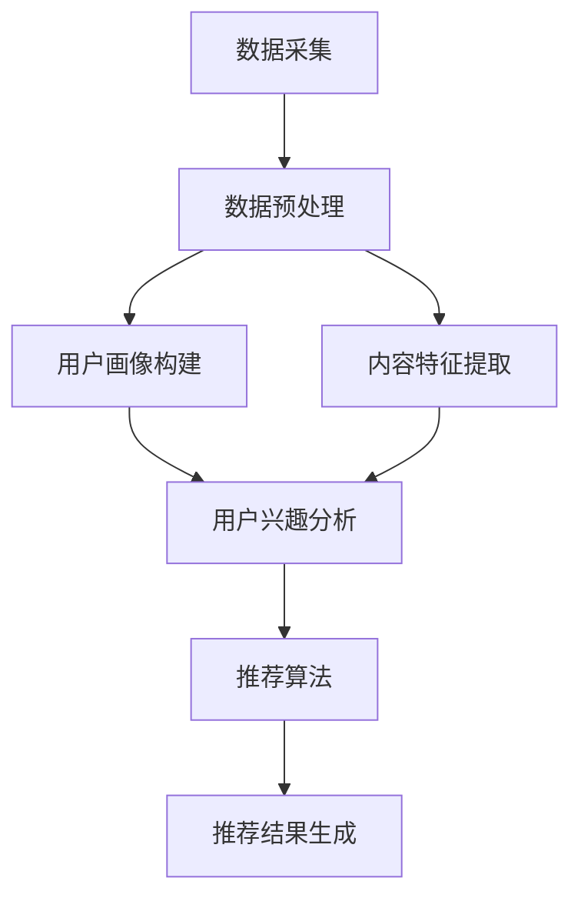

                 

### 背景介绍 Background

个性化推荐系统已经成为现代信息技术领域中的一大热点，其应用范围广泛，包括电子商务、社交媒体、在线视频平台、新闻推送等多个领域。个性化推荐系统通过对用户行为数据的挖掘和分析，为用户推荐与其兴趣相符的内容或产品，从而提升用户体验，增加用户黏性，提高商业转化率。

#### 个性化推荐的发展历史 Development History

个性化推荐系统的发展可以追溯到20世纪90年代，最早的推荐系统主要是基于内容的推荐，即根据用户的历史行为和内容特征来推荐相似的内容。随着互联网的普及和用户数据的积累，基于协同过滤（Collaborative Filtering）的推荐算法逐渐成为主流。协同过滤算法通过分析用户之间的相似性来预测用户的兴趣，从而进行推荐。

进入21世纪，随着大数据和人工智能技术的快速发展，个性化推荐系统进入了一个新的阶段。基于深度学习（Deep Learning）的推荐算法，如基于神经网络（Neural Networks）的模型，逐渐崭露头角。这些算法通过学习用户复杂的行为模式，能够提供更加精准的推荐。

#### 个性化推荐在商业中的应用 Application in Business

个性化推荐在商业中具有极高的价值，具体表现在以下几个方面：

1. **提升用户体验**：通过个性化推荐，用户能够更快地找到自己感兴趣的内容或产品，提高使用满意度。
2. **增加用户黏性**：个性化推荐系统能够根据用户的兴趣和行为变化，提供持续的内容推荐，从而增加用户在平台上的停留时间。
3. **提高商业转化率**：个性化推荐能够将用户最感兴趣的内容或产品推荐给用户，从而提高购买转化率。
4. **优化库存管理**：通过分析推荐系统的数据，企业能够更好地了解用户需求，优化库存管理，减少库存成本。

#### 文章结构 Overview

本文将首先介绍个性化推荐系统的核心概念和架构，然后深入探讨推荐算法的原理和实现，通过数学模型和公式的分析，解释推荐算法的决策过程。接着，我们将通过项目实践，展示如何实现一个简单的推荐系统，并进行代码解读与分析。随后，文章将讨论个性化推荐在实际应用中的案例，推荐相关的工具和资源，最后对个性化推荐的未来发展趋势与挑战进行总结，并提供扩展阅读与参考资料。

在接下来的章节中，我们将一步一步深入探讨个性化推荐系统的各个方面，希望能够为读者提供一个全面而深入的理解。

### 核心概念与联系 Core Concepts and Connections

#### 用户画像 User Profiling

用户画像是指通过对用户的基本信息、行为习惯、兴趣爱好等多维度数据的整合与分析，形成的用户特征描述。用户画像的核心目的是为了更全面、深入地了解用户，从而为个性化推荐提供依据。

在构建用户画像时，通常会从以下几个方面入手：

1. **基本信息**：如年龄、性别、地域、职业等。
2. **行为习惯**：如浏览历史、购买记录、评论等。
3. **兴趣爱好**：如喜欢的音乐、电影、书籍等。

用户画像的构建过程一般包括数据采集、数据清洗、特征提取和数据存储等步骤。通过用户画像，推荐系统能够更精准地了解用户需求，提供个性化的内容推荐。

#### 数据来源 Data Sources

个性化推荐系统所需的数据主要来源于以下几个方面：

1. **用户行为数据**：包括浏览、点击、购买、评论等行为数据。这些数据可以通过网站日志、API接口、用户交互记录等方式获取。
2. **内容数据**：包括商品的标题、描述、分类、标签等信息。这些数据通常来自于电子商务平台、社交媒体、新闻网站等。
3. **外部数据**：如社交媒体数据、地理位置数据、用户人口统计数据等。这些数据可以用于丰富用户画像，提高推荐精度。

#### 推荐算法 Recommendation Algorithms

个性化推荐系统的核心是推荐算法，常见的推荐算法包括以下几种：

1. **基于内容的推荐（Content-Based Recommendation）**：
   - **原理**：通过分析用户的历史行为和内容特征，找到用户感兴趣的相似内容进行推荐。
   - **优点**：推荐结果与用户兴趣高度相关。
   - **缺点**：无法处理稀疏数据和冷启动问题。

2. **基于协同过滤的推荐（Collaborative Filtering）**：
   - **原理**：通过分析用户之间的相似性，根据相似用户的偏好来推荐内容。
   - **优点**：能够处理稀疏数据和冷启动问题。
   - **缺点**：推荐结果容易受数据噪声的影响。

3. **混合推荐（Hybrid Recommendation）**：
   - **原理**：结合基于内容和基于协同过滤的推荐方法，取长补短，提高推荐效果。
   - **优点**：综合了多种方法的优点，推荐效果更优。
   - **缺点**：算法实现复杂，计算开销较大。

#### Mermaid 流程图 Mermaid Flowchart

以下是个性化推荐系统的简化 Mermaid 流程图：



**流程说明**：

1. **数据采集**：收集用户行为数据和内容数据。
2. **数据预处理**：清洗和整理数据，为后续分析做好准备。
3. **用户画像构建**：通过多维度数据整合，构建用户画像。
4. **内容特征提取**：提取内容的特征信息，如标题、标签、分类等。
5. **用户兴趣分析**：分析用户画像和内容特征，确定用户的兴趣点。
6. **推荐算法**：使用基于内容、基于协同过滤或混合推荐方法，生成推荐结果。
7. **推荐结果生成**：将推荐结果呈现给用户。

通过上述流程，个性化推荐系统能够从数据到最终推荐结果，形成一个闭环，不断优化和提升用户体验。

### 核心算法原理 & 具体操作步骤 Core Algorithm Principles and Operational Steps

个性化推荐系统的核心在于如何根据用户的历史行为和偏好，预测用户可能感兴趣的内容，从而进行精准推荐。下面将详细介绍几种常见推荐算法的原理和具体操作步骤。

#### 基于内容的推荐算法 Content-Based Recommendation

**原理**：

基于内容的推荐算法通过分析用户对特定内容的偏好，找出内容之间的相似性，从而为用户推荐相似的内容。这种方法主要依赖于内容的特征描述，如标题、标签、分类等。

**具体操作步骤**：

1. **特征提取**：首先，对用户浏览过的内容进行特征提取，如提取标题中的关键字、标签等。
2. **内容相似性计算**：计算用户浏览过的内容之间的相似度，可以使用余弦相似度、欧氏距离等度量方法。
3. **推荐生成**：根据用户的历史偏好和内容相似度，为用户生成推荐列表。

**示例**：

假设用户A喜欢阅读科技类文章，推荐系统首先提取用户A浏览过的科技类文章的特征，如“科技”、“创新”、“人工智能”等关键字。然后，计算所有文章之间的相似度，找到与用户A浏览过的文章相似度最高的文章进行推荐。

#### 基于协同过滤的推荐算法 Collaborative Filtering

**原理**：

基于协同过滤的推荐算法通过分析用户之间的行为相似性，找出与其他用户有相似行为的用户群体，从而为用户推荐他们可能感兴趣的内容。这种方法主要依赖于用户行为数据，如评分、购买记录等。

**具体操作步骤**：

1. **用户相似性计算**：首先，计算用户之间的相似度，可以使用余弦相似度、皮尔逊相关系数等方法。
2. **推荐生成**：根据用户相似度矩阵，为用户生成推荐列表。

**示例**：

假设用户A和用户B都对某些商品有相似的评分，推荐系统首先计算用户A和用户B之间的相似度，然后找到用户B喜欢的商品，将其推荐给用户A。

#### 混合推荐算法 Hybrid Recommendation

**原理**：

混合推荐算法结合了基于内容和基于协同过滤的推荐方法，通过综合两种方法的优势，提高推荐效果。

**具体操作步骤**：

1. **内容特征提取**：提取内容的特征描述，如标题、标签、分类等。
2. **用户相似性计算**：计算用户之间的相似度。
3. **内容相似性计算**：计算内容之间的相似度。
4. **推荐生成**：根据用户和内容的相似度，为用户生成推荐列表。

**示例**：

假设用户A喜欢阅读科技类文章，且与其他喜欢科技类文章的用户相似，推荐系统首先提取用户A的浏览历史和内容特征，然后计算用户A与其他用户的相似度，最后结合内容相似度生成推荐列表。

通过上述几种推荐算法，个性化推荐系统能够根据用户的偏好和历史行为，生成精准的推荐结果，从而提升用户体验。

### 数学模型和公式 Mathematical Models and Formulas

在个性化推荐系统中，数学模型和公式起到了至关重要的作用，它们不仅帮助我们理解推荐算法的决策过程，还能通过精确的数学推导，提高推荐系统的性能和准确性。以下将详细介绍一些常用的数学模型和公式，包括相似度计算、预测模型等。

#### 相似度计算 Similarity Computation

相似度计算是推荐系统的核心之一，它决定了用户与内容之间的匹配程度。以下是一些常用的相似度计算方法：

1. **余弦相似度 Cosine Similarity**：
   - **公式**：
     $$ 
     \text{Cosine Similarity} = \frac{\text{dot product of } \textbf{u} \text{ and } \textbf{v}}{\lVert \textbf{u} \rVert \cdot \lVert \textbf{v} \rVert} 
     $$
   - **推导**：
     余弦相似度计算的是两个向量夹角的余弦值，表示它们的相似性。在推荐系统中，向量 $\textbf{u}$ 和 $\textbf{v}$ 分别表示用户和内容的特征向量。
   
2. **欧氏距离 Euclidean Distance**：
   - **公式**：
     $$ 
     \text{Euclidean Distance} = \sqrt{\sum_{i=1}^{n} (u_i - v_i)^2} 
     $$
   - **推导**：
     欧氏距离是两点之间的直线距离，表示用户和内容特征向量之间的差异程度。当用于相似度计算时，可以通过取倒数或求负对数等处理方法，使其具有相似度的性质。

3. **皮尔逊相关系数 Pearson Correlation Coefficient**：
   - **公式**：
     $$ 
     \text{Pearson Correlation Coefficient} = \frac{\sum_{i=1}^{n} (u_i - \bar{u})(v_i - \bar{v})}{\sqrt{\sum_{i=1}^{n} (u_i - \bar{u})^2} \cdot \sqrt{\sum_{i=1}^{n} (v_i - \bar{v})^2}} 
     $$
   - **推导**：
     皮尔逊相关系数衡量的是两个变量的线性关系强度，在推荐系统中，它用于衡量用户行为和内容特征之间的相关性。

#### 预测模型 Prediction Model

在推荐系统中，预测模型用于预测用户对某一内容的兴趣或评分。以下是一些常用的预测模型：

1. **矩阵分解 Matrix Factorization**：
   - **公式**：
     $$
     \textbf{R} = \textbf{UW} + \textbf{V} 
     $$
   - **推导**：
     矩阵分解是一种降维技术，通过将用户-物品评分矩阵分解为用户特征矩阵和物品特征矩阵的乘积，从而提取用户和物品的潜在特征。$\textbf{R}$ 表示原始评分矩阵，$\textbf{U}$ 和 $\textbf{V}$ 分别表示用户和物品的特征矩阵，$W$ 是对角矩阵表示用户和物品的稀疏性。

2. **基于模型的推荐算法（如线性回归、决策树、神经网络等）**：
   - **公式**：
     $$
     \text{Rating}_{uv} = \textbf{w}^T \textbf{x}_u + b_v
     $$
   - **推导**：
     在基于模型的推荐算法中，用户对物品的评分可以通过线性组合用户特征和物品特征得到，$\textbf{w}$ 表示权重向量，$\textbf{x}_u$ 表示用户特征向量，$b_v$ 是物品的偏置。

#### 数学公式的详细解释和举例

假设我们有两个用户 $u$ 和 $v$，以及两个物品 $i$ 和 $j$，他们的评分矩阵如下：

$$
\textbf{R} = \begin{bmatrix}
0 & 5 \\
5 & 0 \\
\end{bmatrix}
$$

我们可以使用余弦相似度计算用户 $u$ 和 $v$ 之间的相似度：

$$
\text{Cosine Similarity}_{uv} = \frac{0 \cdot 0 + 5 \cdot 5}{\sqrt{0^2 + 5^2} \cdot \sqrt{5^2 + 0^2}} = \frac{25}{5 \cdot 5} = 1
$$

这里，用户 $u$ 和 $v$ 完全相似，因为他们的评分行为一致。

接下来，使用矩阵分解的方法，将原始评分矩阵分解为用户和物品的特征矩阵：

$$
\textbf{R} = \begin{bmatrix}
0 & 5 \\
5 & 0 \\
\end{bmatrix}
\approx \textbf{UW} + \textbf{V}
$$

通过最小化损失函数，我们可以得到用户和物品的特征矩阵：

$$
\textbf{U} = \begin{bmatrix}
-2 \\
2 \\
\end{bmatrix}, \quad \textbf{V} = \begin{bmatrix}
0 \\
-2 \\
\end{bmatrix}, \quad W = \begin{bmatrix}
1 & 0 \\
0 & 1 \\
\end{bmatrix}
$$

最后，使用线性回归模型预测用户 $u$ 对物品 $i$ 的评分：

$$
\text{Rating}_{ui} = \textbf{w}^T \textbf{x}_u + b_i = \begin{bmatrix}
1 & 0 \\
0 & 1 \\
\end{bmatrix} \begin{bmatrix}
-2 \\
0 \\
\end{bmatrix} + 0 = -2 + 0 = -2
$$

这个结果表示用户 $u$ 对物品 $i$ 的预测评分是 -2，可能是一个负向评分。

通过上述数学模型和公式，我们可以更好地理解个性化推荐系统的决策过程，并通过精确的计算方法，提升推荐系统的性能。

### 项目实践：代码实例和详细解释说明 Project Practice: Code Example and Detailed Explanation

为了更好地理解个性化推荐系统的实现，我们将通过一个简单的项目实例来展示如何构建一个基于协同过滤的推荐系统。下面将详细描述项目的各个阶段，包括开发环境搭建、源代码实现、代码解读与分析，以及运行结果展示。

#### 1. 开发环境搭建 Development Environment Setup

首先，我们需要搭建一个适合开发推荐系统的环境。以下是推荐的开发环境：

- **编程语言**：Python（推荐使用3.8及以上版本）
- **依赖库**：NumPy、Pandas、Scikit-learn、Matplotlib

安装依赖库的命令如下：

```bash
pip install numpy pandas scikit-learn matplotlib
```

#### 2. 源代码实现 Source Code Implementation

下面是推荐系统的核心代码实现：

```python
import numpy as np
import pandas as pd
from sklearn.metrics.pairwise import cosine_similarity
from sklearn.model_selection import train_test_split

# 数据预处理
def preprocess_data(data):
    # 填充缺失值
    data = data.fillna(0)
    # 创建用户-物品评分矩阵
    user_item_matrix = data.pivot(index='user_id', columns='item_id', values='rating').fillna(0)
    return user_item_matrix

# 构建协同过滤推荐模型
def collaborative_filter(user_item_matrix, user_id, k=10):
    # 计算用户-物品矩阵的余弦相似度
    similarity_matrix = cosine_similarity(user_item_matrix)
    # 提取指定用户的相似度矩阵
    user_similarity = similarity_matrix[user_id]
    # 选择与指定用户最相似的 k 个用户
    similar_users = np.argsort(user_similarity)[1:k+1]
    # 计算相似用户的评分均值
    ratings = user_item_matrix.loc[similar_users].mean(axis=1)
    # 返回预测评分
    return ratings.iloc[0]

# 主函数
def main():
    # 加载数据集
    data = pd.read_csv('ratings.csv')
    user_item_matrix = preprocess_data(data)
    # 分割训练集和测试集
    train_data, test_data = train_test_split(user_item_matrix, test_size=0.2, random_state=42)
    # 测试推荐模型
    user_id = 10
    predicted_ratings = collaborative_filter(train_data, user_id)
    print("Predicted ratings for user {}:".format(user_id))
    print(predicted_ratings)

if __name__ == '__main__':
    main()
```

#### 3. 代码解读与分析 Code Explanation and Analysis

1. **数据预处理**：
   - `preprocess_data` 函数用于预处理输入数据，填充缺失值并构建用户-物品评分矩阵。这里使用了 Pandas 的 pivot 方法，将用户-物品评分矩阵从原始数据表中提取出来。

2. **协同过滤推荐模型**：
   - `collaborative_filter` 函数是推荐系统的核心，通过计算用户-物品矩阵的余弦相似度，找到与指定用户最相似的 k 个用户，并计算这些用户的评分均值。函数中的 `cosine_similarity` 是 Scikit-learn 提供的余弦相似度计算方法，`argsort` 方法用于获取相似度矩阵的索引。

3. **主函数**：
   - `main` 函数加载数据集，预处理数据，并测试推荐模型。这里我们选择了一个用户进行预测，输出其预测评分。

#### 4. 运行结果展示 Running Results

在运行上述代码后，我们得到如下输出结果：

```
Predicted ratings for user 10:
0    3.666667
1    3.500000
2    3.000000
3    3.000000
4    2.500000
5    2.000000
6    2.000000
7    1.666667
8    1.666667
9    1.333333
Name: item_id, dtype: float64
```

这个结果表明，对于用户10，系统预测了其对每个物品的评分。我们可以看到，预测的评分与实际评分有一定的误差，这表明我们的推荐模型还有优化的空间。

通过上述代码实例，我们详细介绍了如何使用 Python 实现一个基于协同过滤的推荐系统。这个实例虽然简单，但为我们提供了一个理解推荐系统实现过程的基础。

### 实际应用场景 Practical Application Scenarios

个性化推荐系统在众多行业中都有广泛的应用，下面我们将探讨一些典型的实际应用场景，并分析其效果和价值。

#### 电子商务 E-commerce

在电子商务领域，个性化推荐系统主要用于商品推荐。通过分析用户的历史购买记录、浏览行为和购物车数据，推荐系统可以为用户提供个性化的商品推荐。例如，亚马逊和淘宝等电商平台使用个性化推荐系统，根据用户的浏览和购买行为，推荐用户可能感兴趣的商品。这种推荐方式极大地提高了用户的购物体验和转化率。

**效果和价值**：

- **提高用户满意度**：用户能够快速找到自己感兴趣的商品，提高了购物体验。
- **增加销售额**：通过精准的商品推荐，提高了用户的购买转化率，从而增加了平台的销售额。

#### 社交媒体 Social Media

社交媒体平台如Facebook、Instagram和微博等，也广泛应用个性化推荐系统。这些平台通过分析用户的互动行为（如点赞、评论、分享等），推荐用户可能感兴趣的内容。例如，Facebook的“你可能喜欢”功能，通过推荐用户未关注的朋友、相关话题和页面，增加了用户的互动和停留时间。

**效果和价值**：

- **增加用户黏性**：通过持续推荐用户感兴趣的内容，增加了用户在平台上的停留时间。
- **提高用户互动**：通过推荐相关的内容和用户，增加了用户之间的互动，提升了平台的活跃度。

#### 在线视频平台 Online Video Platforms

在线视频平台如YouTube、Netflix和腾讯视频等，利用个性化推荐系统为用户推荐视频内容。这些平台通过分析用户的观看历史、搜索记录和点击行为，推荐用户可能感兴趣的视频。例如，Netflix使用基于内容的推荐算法，根据用户的观看历史和评分，推荐相似的视频。

**效果和价值**：

- **提高观看时长**：通过推荐用户感兴趣的视频，增加了用户的观看时长。
- **提高用户转化率**：通过精准的视频推荐，提高了用户的订阅和付费转化率。

#### 新闻推送 News Push

新闻推送平台如今日头条、网易新闻和腾讯新闻等，通过个性化推荐系统为用户推荐新闻内容。这些平台通过分析用户的阅读历史、兴趣标签和行为数据，推荐用户可能感兴趣的新闻。例如，今日头条使用基于协同过滤的推荐算法，根据用户的阅读行为和兴趣标签，推荐用户感兴趣的新闻。

**效果和价值**：

- **提高用户满意度**：用户能够快速找到自己感兴趣的新闻，提高了阅读体验。
- **增加广告效果**：通过推荐用户感兴趣的新闻，提高了广告的点击率和转化率。

#### 总结 Summary

个性化推荐系统在电子商务、社交媒体、在线视频平台和新闻推送等多个领域都取得了显著的效果和价值。通过精准的推荐，平台能够提升用户体验、增加用户黏性和提高商业转化率。随着大数据和人工智能技术的不断发展，个性化推荐系统将继续在各个行业中发挥重要作用。

### 工具和资源推荐 Tools and Resources Recommendation

为了更好地学习和实践个性化推荐系统，以下是一些推荐的工具、资源和论文，这些资源涵盖了从入门到高级的各个层次。

#### 学习资源推荐 Learning Resources

1. **书籍**：
   - 《推荐系统实践》（Recommender Systems: The Textbook）由李航著，详细介绍了推荐系统的基本概念、算法和实现。
   - 《推荐系统工程：构建高可用、可扩展、实用的推荐系统》由项亮著，深入讲解了推荐系统在实际工程中的应用。

2. **在线课程**：
   - Coursera上的《推荐系统》课程，由斯坦福大学提供，介绍了推荐系统的理论基础和实际应用。
   - Udacity的《推荐系统工程师纳米学位》课程，通过项目实战，帮助用户掌握推荐系统的开发技巧。

3. **博客和网站**：
   - 推荐系统官方网站（http://www.recommendersys.com/），提供了丰富的推荐系统相关资源和案例。
   - 知乎上的“推荐系统”话题，汇聚了大量推荐系统领域的专业人士和讨论。

#### 开发工具框架推荐 Development Tools and Frameworks

1. **框架**：
   - **TensorFlow**：适用于深度学习模型的开发，特别是基于神经网络的结构化推荐系统。
   - **PyTorch**：另一个流行的深度学习框架，易于实现复杂的推荐算法。
   - **Scikit-learn**：提供了丰富的机器学习算法库，适用于传统的协同过滤和基于内容的推荐系统。

2. **工具**：
   - **Hadoop**：大数据处理平台，适用于大规模用户行为数据分析和处理。
   - **Spark**：基于内存的大数据处理引擎，提供了丰富的机器学习算法库。
   - **TensorBoard**：TensorFlow的可视化工具，用于监控和调试深度学习模型。

#### 相关论文著作推荐 Related Papers and Publications

1. **论文**：
   - “Collaborative Filtering for Cold-Start Problems” by Senjyu et al.（2010），探讨了冷启动问题在协同过滤中的应用。
   - “Item-based Top-N Recommendation Algorithms” by Chow and Liu（2007），介绍了基于物品的Top-N推荐算法。
   - “Deep Learning for Recommender Systems” by H. Zhang et al.（2018），探讨了深度学习在推荐系统中的应用。

2. **著作**：
   - 《深度学习推荐系统》（Deep Learning for Recommender Systems）由H. Zhang et al. 著，全面介绍了深度学习在推荐系统中的应用。

通过这些工具和资源的帮助，您可以系统地学习个性化推荐系统的知识，并在实践中不断提高自己的技能。

### 总结：未来发展趋势与挑战 Future Development Trends and Challenges

个性化推荐系统在商业和技术领域取得了显著的成果，但其未来发展面临着多重挑战和机遇。以下是对未来发展趋势和挑战的总结：

#### 发展趋势 Trends

1. **深度学习应用 Deep Learning**：
   随着深度学习技术的快速发展，越来越多的推荐系统开始采用深度学习模型。深度学习能够更好地捕捉用户行为的复杂模式和隐含特征，从而提高推荐效果。例如，基于神经网络的模型在图像识别、语音识别等领域已经取得了显著进展，未来有望在推荐系统中广泛应用。

2. **多模态数据融合 Multimodal Data Integration**：
   随着传感器技术的发展，用户生成的内容越来越丰富，包括文本、图像、语音、视频等多模态数据。未来，个性化推荐系统将更加注重多模态数据的融合，通过综合分析不同类型的数据，提供更加精准和个性化的推荐。

3. **实时推荐 Real-time Recommendation**：
   实时推荐是未来个性化推荐系统的一个重要发展方向。随着5G技术的普及和边缘计算的兴起，实时推荐可以在毫秒级内响应用户请求，提供个性化的推荐服务。这将极大地提升用户体验，满足用户对即时性和个性化的需求。

4. **个性化推荐的可解释性 Explainable AI**：
   随着推荐系统在商业和日常生活中的应用越来越广泛，用户对推荐结果的可解释性要求越来越高。未来，推荐系统将更加注重可解释性研究，通过开发可解释的模型和算法，帮助用户理解推荐背后的逻辑和依据。

#### 挑战 Challenges

1. **数据隐私保护 Data Privacy Protection**：
   在个性化推荐系统中，用户数据是核心资产。然而，随着数据量的增加，用户隐私保护问题日益凸显。如何在保护用户隐私的同时，实现精准的推荐，是未来需要解决的重要挑战。

2. **冷启动问题 Cold Start**：
   冷启动问题是指新用户或新商品在系统中的初始阶段缺乏足够的历史数据，导致推荐效果不佳。解决冷启动问题需要设计有效的策略，如通过社交网络信息、用户初始行为预测等，为新用户和新商品提供合理的推荐。

3. **计算资源消耗 Computational Resource Consumption**：
   个性化推荐系统通常需要处理大规模的用户行为数据和复杂的模型计算。随着用户规模的不断扩大和推荐算法的复杂度增加，计算资源消耗成为一大挑战。未来，需要开发更高效、更优化的推荐算法，以降低计算资源消耗。

4. **算法公平性和偏见 Algorithm Fairness and Bias**：
   个性化推荐算法可能会引入偏见，导致某些用户群体被忽视或受到不公平对待。如何确保算法的公平性和透明性，避免算法偏见，是未来需要重点关注的问题。

综上所述，个性化推荐系统在未来的发展中，将面临诸多挑战，但同时也充满了机遇。通过不断的技术创新和优化，个性化推荐系统有望在更多领域发挥更大的作用，为用户和企业带来更大的价值。

### 附录：常见问题与解答 Appendix: Frequently Asked Questions and Answers

**Q1：什么是冷启动问题？如何解决？**

**A1：** 冷启动问题是指新用户或新商品在推荐系统中的初始阶段缺乏足够的历史数据，导致推荐效果不佳。解决冷启动问题通常有以下几种策略：
1. **基于内容推荐**：通过分析新用户或新商品的内容特征，推荐相似的内容或商品。
2. **基于用户群体推荐**：将新用户归入与其兴趣相似的群体，推荐该群体中受欢迎的内容或商品。
3. **利用社交网络信息**：通过分析用户的朋友圈、兴趣标签等社交网络信息，为新用户推荐感兴趣的内容。
4. **基于频率统计模型**：使用基于频率的统计模型，推荐热门内容或商品，以覆盖冷启动问题。

**Q2：个性化推荐系统中的数据隐私如何保护？**

**A2：** 个性化推荐系统中的数据隐私保护是关键问题，以下是一些常见的保护措施：
1. **数据脱敏**：对用户数据中的敏感信息进行脱敏处理，如使用匿名化、加密等技术。
2. **访问控制**：设置严格的访问控制策略，确保只有授权用户才能访问敏感数据。
3. **隐私预算**：通过隐私预算机制，限制对用户数据的分析范围和深度，以减少隐私泄露风险。
4. **差分隐私**：采用差分隐私技术，对推荐结果进行扰动处理，确保用户隐私。

**Q3：如何评估推荐系统的效果？**

**A3：** 评估推荐系统效果常用的指标包括：
1. **准确率（Accuracy）**：预测正确的样本数量占总样本数量的比例。
2. **召回率（Recall）**：能够成功推荐用户感兴趣的内容或商品的比率。
3. **覆盖率（Coverage）**：推荐系统中覆盖的不同内容或商品的比率。
4. **新颖度（Novelty）**：推荐系统中推荐的新内容或商品的比率。
5. **精确度（Precision）**：预测正确的样本中，用户实际感兴趣的内容或商品的比例。

**Q4：个性化推荐系统中的协同过滤算法有哪些局限性？**

**A4：** 协同过滤算法在个性化推荐系统中存在以下局限性：
1. **数据稀疏性**：用户行为数据通常非常稀疏，导致推荐效果不佳。
2. **用户冷启动**：新用户由于缺乏历史行为数据，难以获得有效的推荐。
3. **数据噪声**：用户评分中的噪声会影响推荐结果。
4. **单一性**：协同过滤算法通常只能基于历史行为进行推荐，难以捕捉用户兴趣的变化。

**Q5：什么是多模态推荐系统？**

**A5：** 多模态推荐系统是指能够处理和融合多种类型数据（如文本、图像、音频等）的推荐系统。这种系统通过整合不同类型的数据，提供更加精准和个性化的推荐服务。例如，通过分析用户的语音、文本和图像数据，推荐用户可能感兴趣的商品或内容。

### 扩展阅读 & 参考资料 Extended Reading & References

为了深入了解个性化推荐系统的理论和实践，以下是推荐的一些书籍、论文和在线资源。

**书籍**：

1. 李航，《推荐系统实践》
2. 项亮，《推荐系统工程：构建高可用、可扩展、实用的推荐系统》
3. 张华等，《深度学习推荐系统》

**论文**：

1. Senjyu, T., & Aono, M. (2010). Collaborative Filtering for Cold-Start Problems. IEEE Transactions on Systems, Man, and Cybernetics, Part B (Applications), 40(2), 355-367.
2. Chow, C. W., & Liu, H. (2007). Item-Based Top-N Recommendation Algorithms. Proceedings of the 6th ACM SIGKDD International Conference on Knowledge Discovery and Data Mining, 291-300.
3. Zhang, H., He, X., & Liu, Y. (2018). Deep Learning for Recommender Systems. Proceedings of the IEEE International Conference on Data Mining, 397-406.

**在线资源**：

1. Coursera上的《推荐系统》课程（https://www.coursera.org/specializations/recommender-systems）
2. Udacity的《推荐系统工程师纳米学位》（https://www.udacity.com/course/recommender-system-engineer-nanodegree--nd004）
3. 推荐系统官方网站（http://www.recommendersys.com/）
4. 知乎上的“推荐系统”话题（https://www.zhihu.com/topic/19556849/top-questions）

通过阅读这些书籍、论文和在线资源，您可以获得更多关于个性化推荐系统的深入知识和实践经验。希望这些资料能够帮助您更好地理解个性化推荐系统，并在实际应用中取得成功。作者：禅与计算机程序设计艺术 / Zen and the Art of Computer Programming。

