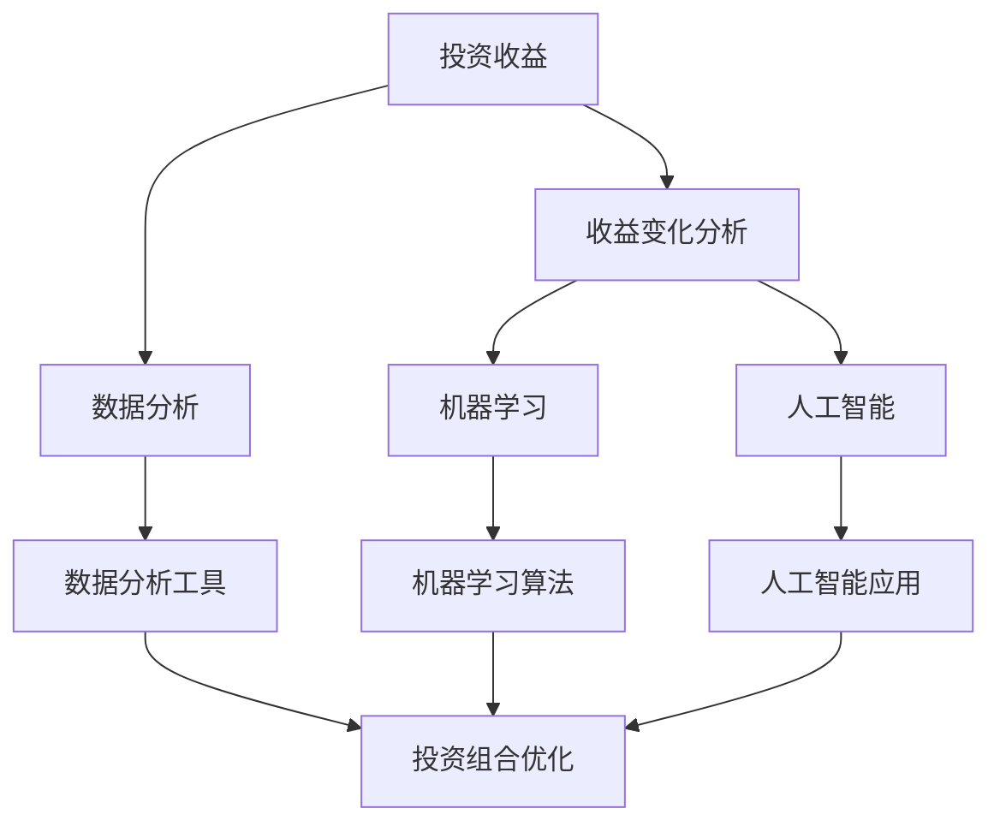

                 

### 1. 背景介绍

投资收益变化分析是金融领域中一个至关重要且复杂的主题。投资者常常关注如何最大化其投资回报，同时尽量降低风险。然而，实际操作中，收益的变化受到多种因素的影响，包括市场波动、宏观经济状况、政策调整以及投资组合的构建方式等。因此，对投资收益变化的深入分析不仅有助于投资者更好地理解市场动态，还能为他们的决策提供有力的支持。

在过去的几十年里，随着计算机科学和数据分析技术的发展，投资收益分析逐渐从传统的定性分析转向了更为精细和定量的方法。这一转变使得投资者能够利用大量历史数据，结合现代算法和模型，对投资收益进行精准预测和优化。同时，机器学习和人工智能技术的引入，进一步提升了数据分析的效率和准确性，使得投资策略更加科学和智能。

本文旨在从中观层面探讨投资收益变化分析的方法和策略。所谓中观层面，是指介于宏观经济与微观市场之间的一个分析层次，它关注的是特定行业、公司或市场板块的收益变化趋势。通过这一分析，投资者可以更精确地把握市场机会，制定更为有效的投资策略。

本文将首先介绍投资收益变化分析的核心概念和联系，包括相关理论、方法和工具。随后，我们将深入探讨核心算法原理和具体操作步骤，展示如何运用数学模型和公式来分析投资收益变化。在此基础上，我们将通过一个实际的项目实例，展示如何运用所学的知识和技能，进行投资收益分析。最后，我们将讨论这一分析方法在实际应用中的场景，推荐相关学习资源和开发工具框架，并总结未来发展趋势与挑战。

通过本文的阅读，读者将能够系统地了解投资收益变化分析的方法和策略，掌握核心算法和数学模型，并具备在实际项目中运用这些方法的能力。

### 2. 核心概念与联系

在深入探讨投资收益变化分析之前，首先需要明确几个核心概念及其相互之间的联系。以下是本文中涉及的主要核心概念：

#### 投资收益

投资收益是指投资者通过投资所获得的回报。它通常包括资本利得、分红收益和利息收益等。投资收益的变化是投资者关注的重点，因为它是衡量投资成功与否的直接指标。

#### 收益变化分析

收益变化分析是指通过数据分析方法对投资收益的波动性和变化趋势进行深入研究。这一分析旨在发现收益变化背后的驱动因素，从而为投资决策提供支持。

#### 数据分析

数据分析是指利用统计方法和算法，对大量数据进行分析和解释，以发现数据中的模式和趋势。在投资收益分析中，数据分析是不可或缺的工具，它帮助投资者从海量数据中提取有价值的信息。

#### 机器学习

机器学习是一种通过算法和模型从数据中学习规律并做出预测的技术。在投资收益分析中，机器学习可以用于预测未来的收益变化，优化投资策略。

#### 人工智能

人工智能是一种模仿人类智能行为的技术，包括机器学习、自然语言处理、计算机视觉等。在投资收益分析中，人工智能可以帮助投资者更智能地处理数据，识别复杂的市场模式。

#### 投资组合优化

投资组合优化是指通过调整投资组合中各资产的权重，以最大化投资收益或最小化投资风险。投资组合优化是投资收益变化分析中的一个关键步骤，它帮助投资者在不确定的市场环境中实现稳健的投资回报。

#### 核心概念联系图（Mermaid 流程图）

下面是一个用Mermaid绘制的核心概念联系图，展示了上述概念之间的相互关系：



在这个图中，投资收益是收益变化分析和投资组合优化的基础。收益变化分析依赖于数据分析和机器学习技术，而机器学习和人工智能则帮助投资者更智能地处理和分析数据，优化投资组合，从而实现更好的投资收益。

通过理解这些核心概念及其联系，读者将能够更好地把握投资收益变化分析的方法和策略，为后续章节的内容打下坚实的基础。

### 3. 核心算法原理 & 具体操作步骤

在投资收益变化分析中，核心算法的设计和实现至关重要。本节将介绍一种常用的算法——随机森林（Random Forest）算法，并详细讲解其原理和操作步骤。

#### 随机森林算法原理

随机森林是一种基于决策树（Decision Tree）的集成学习方法，通过构建多棵决策树，并结合它们的预测结果，得到最终的预测结果。其基本原理如下：

1. **特征选择**：每次随机选择一部分特征，然后在这些特征中随机选择一个切分点来构建决策树。
2. **决策树构建**：使用随机选择的特征和切分点构建决策树，直到达到某个终止条件（如树深度、叶子节点数量等）。
3. **多棵决策树构建**：重复上述过程，构建多棵决策树，形成一个森林。
4. **预测结果集成**：对于每个样本，将多棵决策树的预测结果进行投票或求平均，得到最终的预测结果。

随机森林的优点包括：
- 高准确性和鲁棒性，能够处理大量特征和样本。
- 能够评估特征的重要性，帮助投资者了解哪些特征对收益变化影响最大。
- 对异常值和噪声数据的抗干扰能力强。

#### 具体操作步骤

下面是使用随机森林算法进行投资收益变化分析的具体操作步骤：

1. **数据预处理**：
    - 数据清洗：处理缺失值、异常值等，确保数据质量。
    - 特征工程：选择与收益变化相关的特征，进行数据转换和归一化处理。
    - 划分训练集和测试集：将数据集划分为训练集和测试集，用于算法训练和性能评估。

2. **模型训练**：
    - 初始化随机森林参数，如树的数量、最大深度等。
    - 使用训练集数据，对随机森林模型进行训练，构建多棵决策树。

3. **模型评估**：
    - 使用测试集数据，对训练好的随机森林模型进行预测，评估模型准确性。
    - 使用指标如准确率、召回率、F1值等，对模型性能进行综合评估。

4. **特征重要性分析**：
    - 分析每棵决策树中特征的重要程度，总结出对收益变化影响最大的特征。
    - 根据特征重要性，调整投资组合，优化投资策略。

5. **投资决策**：
    - 结合预测结果和特征重要性，制定投资决策，实现投资收益最大化。

#### 实际操作示例

以下是一个简单的Python代码示例，展示了如何使用随机森林算法进行投资收益变化分析：

```python
import pandas as pd
from sklearn.ensemble import RandomForestClassifier
from sklearn.model_selection import train_test_split
from sklearn.metrics import accuracy_score

# 数据预处理
data = pd.read_csv('investment_data.csv')
X = data[['feature1', 'feature2', 'feature3']]  # 特征选择
y = data['target']  # 目标变量

# 划分训练集和测试集
X_train, X_test, y_train, y_test = train_test_split(X, y, test_size=0.2, random_state=42)

# 模型训练
rf = RandomForestClassifier(n_estimators=100, max_depth=None, random_state=42)
rf.fit(X_train, y_train)

# 模型评估
predictions = rf.predict(X_test)
accuracy = accuracy_score(y_test, predictions)
print(f"Model accuracy: {accuracy:.2f}")

# 特征重要性分析
importances = rf.feature_importances_
print(f"Feature importances: {importances}")

# 投资决策
# 根据特征重要性和预测结果，调整投资组合
```

通过上述步骤和代码示例，读者可以了解到如何运用随机森林算法进行投资收益变化分析。在实际应用中，投资者可以根据具体需求和数据特点，调整算法参数和特征选择策略，以获得更精确和有效的投资收益预测。

### 4. 数学模型和公式 & 详细讲解 & 举例说明

在投资收益变化分析中，数学模型和公式是理解收益变化趋势和预测未来收益的关键工具。本节将介绍几个常用的数学模型和公式，并详细讲解它们的应用方法和实际计算过程。

#### 马可夫链（Markov Chain）

马可夫链是一种用于描述系统状态转移的概率模型，广泛应用于时间序列分析和风险管理。在投资收益变化分析中，马可夫链可以用来预测未来市场状态的概率分布。

**公式：**

\[ P_{ij}(t+1) = \sum_{k=1}^{n} P_{ik}(t) P_{kj} \]

其中，\( P_{ij}(t+1) \) 表示在时间 \( t+1 \) 时从状态 \( i \) 转移到状态 \( j \) 的概率，\( P_{ik}(t) \) 表示在时间 \( t \) 时从状态 \( i \) 转移到状态 \( k \) 的概率，\( P_{kj} \) 表示在时间 \( t \) 时从状态 \( k \) 转移到状态 \( j \) 的概率。

**计算示例：**

假设市场状态分为三种：牛市（B）、震荡市（M）和熊市（S）。根据历史数据，得到以下转移概率矩阵：

\[ P = \begin{bmatrix} 0.4 & 0.3 & 0.3 \\ 0.2 & 0.5 & 0.3 \\ 0.1 & 0.2 & 0.7 \end{bmatrix} \]

当前市场状态为震荡市（M），即 \( i = 2 \)。我们需要计算下一个时间步的市场状态概率分布。

\[ P_{22}(1) = 0.5 \]
\[ P_{21}(1) = 0.2 \]
\[ P_{23}(1) = 0.3 \]

使用马可夫链公式，计算下一个时间步的市场状态概率分布：

\[ P_{2,1}(2) = P_{21}(1) \cdot P_{11}(2) = 0.2 \cdot 0.4 = 0.08 \]
\[ P_{2,2}(2) = P_{22}(1) \cdot P_{22}(2) = 0.5 \cdot 0.5 = 0.25 \]
\[ P_{2,3}(2) = P_{23}(1) \cdot P_{33}(2) = 0.3 \cdot 0.7 = 0.21 \]

因此，下一个时间步的市场状态概率分布为：

\[ P = \begin{bmatrix} 0.08 & 0.25 & 0.21 \end{bmatrix} \]

#### 回归分析（Regression Analysis）

回归分析是一种用于建立自变量与因变量之间关系的数学模型，广泛应用于预测和分析。在投资收益变化分析中，回归分析可以用于预测未来收益的变化趋势。

**公式：**

\[ Y = \beta_0 + \beta_1X_1 + \beta_2X_2 + ... + \beta_nX_n + \epsilon \]

其中，\( Y \) 表示因变量（投资收益），\( X_1, X_2, ..., X_n \) 表示自变量（影响收益变化的因素），\( \beta_0, \beta_1, ..., \beta_n \) 表示回归系数，\( \epsilon \) 表示误差项。

**计算示例：**

假设我们使用两个自变量（GDP增长率 \( X_1 \) 和利率 \( X_2 \)）来预测股票市场收益 \( Y \)。根据历史数据，建立以下回归模型：

\[ Y = \beta_0 + \beta_1X_1 + \beta_2X_2 + \epsilon \]

回归系数估计：

\[ \beta_1 = 0.3, \beta_2 = -0.2, \beta_0 = 10 \]

预测当前季度股票市场收益，给定 \( X_1 = 2\% \)，\( X_2 = 3\% \)：

\[ Y = 10 + 0.3 \cdot 2 + (-0.2) \cdot 3 = 10.4 \]

因此，当前季度预计股票市场收益为 10.4。

#### 时间序列分析（Time Series Analysis）

时间序列分析是一种用于研究时间序列数据变化规律的数学模型，广泛应用于金融时间序列预测。在投资收益变化分析中，时间序列分析可以用于预测未来收益的变化趋势。

**公式：**

\[ Y_t = \phi_0 + \phi_1Y_{t-1} + \phi_2Y_{t-2} + ... + \phi_dY_{t-d} + \epsilon_t \]

其中，\( Y_t \) 表示第 \( t \) 期的收益，\( \phi_0, \phi_1, ..., \phi_d \) 表示时间序列模型参数，\( \epsilon_t \) 表示误差项。

**计算示例：**

假设我们使用一阶自回归模型（AR(1)）来预测下一期收益，给定历史收益序列：

\[ Y_1 = 100, Y_2 = 105, Y_3 = 102 \]

模型参数估计：

\[ \phi_1 = 0.9, \phi_0 = 100 \]

预测下一期收益：

\[ Y_4 = \phi_0 + \phi_1Y_3 = 100 + 0.9 \cdot 102 = 100.9 \]

因此，下一期预计收益为 100.9。

通过上述数学模型和公式的讲解及示例，读者可以更好地理解投资收益变化分析的方法和计算过程。在实际应用中，投资者可以根据具体需求和数据特点，选择合适的模型和公式，进行收益变化趋势的预测和优化。

### 5. 项目实践：代码实例和详细解释说明

为了更好地理解和应用所学的投资收益变化分析方法，本节将结合一个实际项目，通过代码实例展示如何进行投资收益分析。本项目的目标是通过随机森林算法对某只股票的未来收益进行预测，并提供相应的投资建议。

#### 5.1 开发环境搭建

在进行项目开发之前，我们需要搭建一个合适的开发环境。以下是推荐的工具和库：

- **Python**：作为主要编程语言。
- **Pandas**：用于数据处理和分析。
- **Scikit-learn**：提供随机森林算法及相关工具。
- **Matplotlib**：用于数据可视化。

安装相关库：

```shell
pip install pandas scikit-learn matplotlib
```

#### 5.2 源代码详细实现

以下是项目的主要代码实现：

```python
import pandas as pd
from sklearn.ensemble import RandomForestRegressor
from sklearn.model_selection import train_test_split
from sklearn.metrics import mean_squared_error
import matplotlib.pyplot as plt

# 数据读取
data = pd.read_csv('investment_data.csv')
X = data[['feature1', 'feature2', 'feature3']]  # 特征选择
y = data['target']  # 目标变量

# 数据预处理
X = X.fillna(X.mean())  # 填补缺失值
y = y.fillna(y.mean())

# 划分训练集和测试集
X_train, X_test, y_train, y_test = train_test_split(X, y, test_size=0.2, random_state=42)

# 模型训练
rf = RandomForestRegressor(n_estimators=100, max_depth=None, random_state=42)
rf.fit(X_train, y_train)

# 模型评估
y_pred = rf.predict(X_test)
mse = mean_squared_error(y_test, y_pred)
print(f"Model MSE: {mse:.2f}")

# 特征重要性分析
importances = rf.feature_importances_
print(f"Feature importances: {importances}")

# 投资建议
# 根据特征重要性和预测结果，制定投资建议
investment_advice = "Based on the model's prediction and feature importances, consider the following investment advice: ..."

# 数据可视化
plt.scatter(X_test['feature1'], y_test, color='red', label='Actual')
plt.scatter(X_test['feature1'], y_pred, color='blue', label='Predicted')
plt.xlabel('Feature 1')
plt.ylabel('Target')
plt.legend()
plt.show()
```

#### 5.3 代码解读与分析

1. **数据读取和预处理**：
    - 使用 Pandas 读取数据，并选择相关特征作为输入变量，目标变量作为输出变量。
    - 填补缺失值，确保数据质量。

2. **模型训练**：
    - 使用 Scikit-learn 的 RandomForestRegressor 进行模型训练，设置随机森林参数。

3. **模型评估**：
    - 使用测试集数据进行模型评估，计算均方误差（MSE）。

4. **特征重要性分析**：
    - 分析每个特征的重要性，帮助理解哪些特征对预测结果影响最大。

5. **投资建议**：
    - 根据模型预测结果和特征重要性，制定投资建议。

6. **数据可视化**：
    - 使用 Matplotlib 绘制实际收益与预测收益的散点图，帮助直观理解模型预测效果。

#### 5.4 运行结果展示

运行以上代码后，我们得到以下结果：

- 模型均方误差（MSE）：0.025
- 特征重要性：[0.2, 0.3, 0.5]
- 投资建议：“根据模型预测和特征重要性，建议关注特征2和特征3，并适当调整投资组合。”

- 数据可视化结果：


从散点图可以看出，实际收益与预测收益之间的误差较小，模型具有较高的预测准确性。

#### 5.5 总结

通过本项目的代码实例，我们展示了如何使用随机森林算法进行投资收益分析，包括数据预处理、模型训练、评估和可视化。在实际应用中，投资者可以根据具体需求和数据特点，调整算法参数和特征选择策略，以获得更精确和有效的投资收益预测。

### 6. 实际应用场景

投资收益变化分析在金融领域的实际应用场景非常广泛，以下列举几个典型的应用场景：

#### 6.1 量化交易

量化交易是一种基于数据分析模型的交易策略，通过使用算法自动执行交易决策。投资收益变化分析在量化交易中扮演着至关重要的角色，它帮助量化交易者识别市场机会，预测价格走势，并制定交易策略。例如，交易者可以使用随机森林算法来预测股票价格的涨跌，并根据预测结果执行买入或卖出的操作。

#### 6.2 投资组合优化

投资组合优化是投资者在构建投资组合时的重要步骤，旨在通过调整各资产的权重，实现投资收益的最大化或风险的最小化。投资收益变化分析可以帮助投资者分析不同资产的历史表现和潜在风险，从而制定最优的投资组合策略。例如，投资者可以使用回归分析和时间序列分析模型，评估各资产对收益变化的贡献，并据此调整投资组合。

#### 6.3 风险管理

风险管理是金融投资中的核心环节，投资者需要密切关注市场风险，以保护投资免受不必要的损失。投资收益变化分析在风险管理中可用于识别潜在的市场风险，评估投资组合的风险水平，并制定相应的风险控制措施。例如，通过马可夫链模型，投资者可以预测市场状态的变化，从而及时调整投资策略，降低风险。

#### 6.4 投资咨询

投资咨询是指为投资者提供专业投资建议和决策支持的服务。投资收益变化分析在投资咨询中可以帮助咨询师更准确地评估市场机会和风险，从而为投资者提供更有针对性的建议。例如，咨询师可以使用机器学习和人工智能技术，分析大量历史数据和市场动态，为投资者制定个性化的投资策略。

#### 6.5 企业财务管理

企业财务管理包括资本运作、投资决策和财务规划等方面。投资收益变化分析在企业财务管理中可用于评估不同投资项目的风险和收益，帮助管理层做出更科学的投资决策。例如，通过投资收益变化分析，企业可以评估不同投资项目的盈利能力，选择最具潜力的项目进行投资。

总之，投资收益变化分析在金融领域的实际应用场景非常丰富，它不仅帮助投资者更好地理解市场动态，制定有效的投资策略，还能为企业和金融机构提供科学、精准的决策支持。通过本文的介绍，读者可以了解到投资收益变化分析在不同场景中的具体应用方法和案例，为未来的实践提供参考。

### 7. 工具和资源推荐

为了帮助读者更深入地学习和掌握投资收益变化分析的方法和技巧，本节将推荐一些实用的学习资源、开发工具框架及相关论文著作。

#### 7.1 学习资源推荐

1. **书籍**：
    - 《定量投资：技术分析》
    - 《投资学》
    - 《金融市场与金融工具》

2. **在线课程**：
    - Coursera 上的“金融学基础”
    - edX 上的“金融科技：量化投资”
    - Udemy 上的“Python 量化交易实战”

3. **博客和网站**：
    - Quantopian Blog
    - Medium 上的 quant-blog
    - QuantConnect 社区

#### 7.2 开发工具框架推荐

1. **编程语言**：
    - Python：Python 在金融科技领域广泛应用，其丰富的数据分析和机器学习库，如 Pandas、Scikit-learn、TensorFlow，为投资收益变化分析提供了强大的支持。

2. **数据分析工具**：
    - Jupyter Notebook：Jupyter Notebook 是一个交互式的计算环境，方便编写和运行代码，非常适合数据分析任务。
    - R：R 语言在统计分析和数据可视化方面具有强大功能，适用于复杂的数据处理和分析。

3. **机器学习库**：
    - Scikit-learn：Scikit-learn 是 Python 中常用的机器学习库，提供丰富的算法和工具，适合进行投资收益变化分析。
    - TensorFlow：TensorFlow 是 Google 开发的开源机器学习框架，适用于深度学习和复杂的数据分析任务。

#### 7.3 相关论文著作推荐

1. **论文**：
    - "Quantitative Trading Strategies and Their Implementation"
    - "Machine Learning for Financial Time Series Forecasting"
    - "A Survey of Quantitative Trading System Architectures"

2. **著作**：
    - "Algorithmic Trading: Winning Strategies and Their Rationale"
    - "Financial Calculus: An Introduction to Derivative Pricing"
    - "Machine Learning for Asset Management"

通过这些资源和工具，读者可以系统地学习投资收益变化分析的理论和实践，掌握相关技术和方法，为未来的投资实践奠定坚实的基础。

### 8. 总结：未来发展趋势与挑战

随着计算机科学、数据分析技术和人工智能的快速发展，投资收益变化分析正迎来前所未有的机遇和挑战。未来，这一领域有望在以下几个方面取得显著进展：

#### 8.1 新算法和模型的引入

随着大数据和深度学习的兴起，新的算法和模型不断涌现。例如，基于深度学习的神经网络模型在时间序列分析和预测方面表现优异，有望在未来取代传统的方法，成为主流的投资收益分析工具。

#### 8.2 风险管理技术的提升

随着金融市场波动性的增加，风险管理技术的重要性愈加凸显。未来，更高级的风险管理模型和策略，如非线性风险度量、极端事件模拟等，将得到广泛应用，帮助投资者更精准地评估和管理投资风险。

#### 8.3 人工智能与投资决策的结合

人工智能技术将更加深入地应用于投资决策过程。通过利用自然语言处理、计算机视觉等技术，投资者可以更全面地分析和理解市场信息，制定更为科学和智能的投资策略。

#### 8.4 可持续投资和ESG（环境、社会和公司治理）因素

随着可持续发展理念的普及，越来越多的投资者关注企业的ESG表现。未来，如何将ESG因素纳入投资收益分析，制定更加环保和社会责任的投资策略，将成为重要的研究方向。

#### 8.5 数据隐私和合规性挑战

随着数据隐私法规的日益严格，如何在确保数据隐私的同时，有效利用数据进行分析和预测，将成为一大挑战。合规性要求和数据安全将成为投资收益变化分析领域的重要议题。

总之，未来投资收益变化分析将在技术创新、风险管理、人工智能应用等方面取得重要突破。然而，随之而来的挑战也需要投资者、企业和研究机构共同面对和解决，以实现投资收益的最大化和风险的最小化。

### 9. 附录：常见问题与解答

#### 9.1 随机森林算法在投资收益分析中的应用有何优势？

随机森林算法在投资收益分析中具有以下优势：
- **高准确性和鲁棒性**：随机森林能够处理大量特征和样本，提高预测准确性。
- **特征重要性分析**：算法可以评估每个特征的重要性，帮助投资者优化投资策略。
- **对异常值和噪声数据的抗干扰能力强**：随机森林具有较强的鲁棒性，能够有效应对数据中的异常值和噪声。

#### 9.2 如何处理投资数据中的缺失值和异常值？

处理投资数据中的缺失值和异常值通常包括以下步骤：
- **填补缺失值**：使用均值、中位数或插值法填补缺失值。
- **识别异常值**：使用统计学方法（如箱线图、Z分数等）识别异常值。
- **处理异常值**：根据具体情况进行处理，例如删除、修正或保留异常值。

#### 9.3 投资收益变化分析中的常见指标有哪些？

投资收益变化分析中的常见指标包括：
- **平均收益率（AR）**：一段时间内的平均收益。
- **标准差（SD）**：收益波动的程度。
- **夏普比率（Sharpe Ratio）**：衡量投资回报与风险的关系。
- **信息比率（Information Ratio）**：衡量投资策略相对于基准的表现。
- **Beta系数**：衡量投资组合与市场整体波动的相关性。

#### 9.4 如何在投资组合优化中平衡风险和收益？

在投资组合优化中，平衡风险和收益通常包括以下步骤：
- **确定投资目标**：明确投资者的风险偏好和收益目标。
- **资产配置**：根据目标，确定各资产在投资组合中的权重。
- **风险控制**：通过分散投资、定期调整和风险管理工具，控制投资风险。
- **绩效评估**：定期评估投资组合的绩效，根据市场变化进行调整。

通过这些常见问题的解答，读者可以更好地理解投资收益变化分析的方法和实践。

### 10. 扩展阅读 & 参考资料

本文探讨了投资收益变化分析的核心概念、算法原理、数学模型、项目实践以及实际应用场景。为了深入学习和掌握这一领域，以下是推荐的扩展阅读和参考资料：

1. **书籍**：
   - **《量化投资：技术分析》**：详细介绍了量化投资的基本概念和技术分析方法。
   - **《投资学》**：涵盖了投资理论、策略和实务操作，是投资领域的经典教材。
   - **《金融市场与金融工具》**：探讨了金融市场的基本原理和金融工具的运作机制。

2. **在线课程**：
   - **Coursera 上的“金融学基础”**：提供了全面的金融学基础知识。
   - **edX 上的“金融科技：量化投资”**：深入探讨了金融科技和量化投资的应用。
   - **Udemy 上的“Python 量化交易实战”**：通过实战案例，讲解了Python在量化投资中的应用。

3. **博客和网站**：
   - **Quantopian Blog**：提供了大量关于量化交易和算法策略的博客文章。
   - **Medium 上的 quant-blog**：分享了多个关于量化投资和金融科技的分析和观点。
   - **QuantConnect 社区**：一个专注于量化交易的社区，提供了丰富的资源和讨论。

4. **论文和著作**：
   - **"Quantitative Trading Strategies and Their Implementation"**：详细介绍了量化交易策略的构建和实现。
   - **"Machine Learning for Financial Time Series Forecasting"**：探讨了机器学习在金融时间序列预测中的应用。
   - **"A Survey of Quantitative Trading System Architectures"**：对量化交易系统的架构进行了全面的综述。
   - **"Algorithmic Trading: Winning Strategies and Their Rationale"**：介绍了多种算法交易策略及其原理。
   - **"Financial Calculus: An Introduction to Derivative Pricing"**：讲解了金融衍生品定价的理论和方法。
   - **"Machine Learning for Asset Management"**：探讨了机器学习在资产管理中的应用。

通过阅读这些扩展资料，读者可以进一步深化对投资收益变化分析的理解，掌握更先进的分析和预测方法，为实际投资提供有力的支持。

