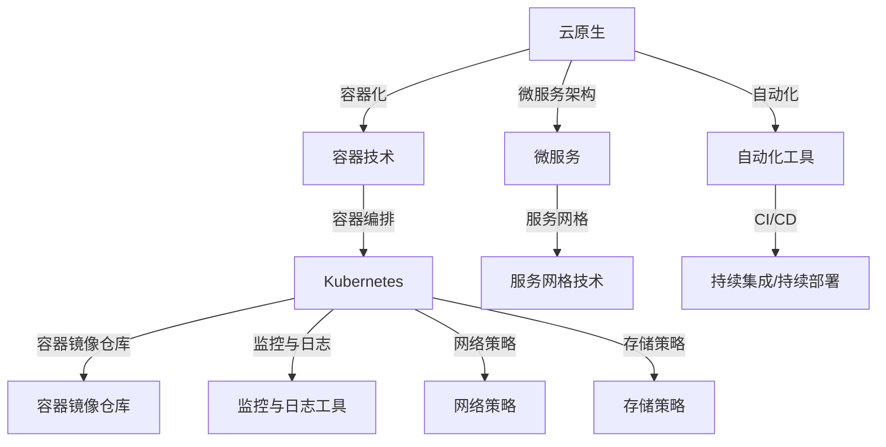

                 

### 背景介绍 Background Introduction

随着云计算、容器化技术的发展，云原生架构逐渐成为现代IT基础设施的主流。云原生（Cloud Native）是指一组原则和实践，旨在构建和运行可以在多云和混合云环境中弹性伸缩的应用程序。容器（Container）作为实现云原生架构的关键技术，提供了一种轻量级、可移植、自给自足的运行时环境。而Kubernetes（简称K8s）作为容器编排和管理平台，进一步提升了容器化应用的管理效率和可靠性。

然而，云原生环境带来了新的安全和隐私挑战。容器和Kubernetes的分布式特性使得攻击者可以利用网络的漏洞或容器之间的信任边界来发起攻击。同时，云原生应用的动态性、可扩展性也给安全防护带来了复杂性。因此，确保云原生环境的安全性已成为企业面临的重要课题。

本文旨在探讨云原生安全，特别是容器和Kubernetes环境下的防护措施。文章首先介绍了云原生和容器化技术的基本概念，随后讨论了云原生安全面临的主要威胁和挑战。接下来，文章深入分析了容器和Kubernetes的安全机制，探讨了从网络、存储、应用程序等多个维度进行安全防护的方法。最后，文章提供了一些实用的工具和资源推荐，以及未来的发展趋势与挑战。

### 核心概念与联系 Core Concepts and Relationships

为了深入理解云原生安全，我们需要先掌握一些核心概念，包括云原生、容器、Kubernetes等，并了解它们之间的相互关系。

#### 云原生 Cloud Native

云原生是一组原则和实践，旨在构建和运行可以在多云和混合云环境中弹性伸缩的应用程序。其核心思想是利用容器、服务网格、微服务架构和不可变基础设施等现代化技术，实现应用的动态部署、扩展和管理。

云原生的主要特征包括：

- **容器化 Containerization**：将应用程序及其依赖打包在一个容器镜像中，确保应用在不同的环境中具有一致性和可移植性。
- **微服务 Microservices**：将大型单体应用拆分为多个小型服务，每个服务独立部署、扩展和管理，便于开发和运维。
- **自动化 Automation**：通过自动化工具实现应用的部署、扩展、监控和故障恢复，提高运营效率和可靠性。
- **持续集成/持续部署 CI/CD**：实现代码的自动化测试和部署，加快应用迭代速度。

#### 容器 Containers

容器是一种轻量级、可移植、自给自足的运行时环境，它允许开发者将应用程序及其依赖打包在一起，形成可运行的容器镜像。容器与宿主机操作系统相互隔离，但共享宿主机的内核，从而实现高效的资源利用。

容器的主要特点包括：

- **轻量级 Lightweight**：容器不包含完整的操作系统，仅包含应用程序和必要的库文件，因此启动速度快，资源占用小。
- **可移植性 Portability**：容器镜像可以在不同的操作系统、云平台和物理主机上运行，无需修改代码或配置。
- **隔离性 Isolation**：容器通过cgroup和命名空间等技术实现进程和资源的隔离，确保应用程序之间互不干扰。

#### Kubernetes Kubernetes

Kubernetes是一个开源的容器编排平台，用于自动化容器化应用程序的部署、扩展和管理。它提供了一种自动化和平台无关的方式来部署和管理基于容器的应用程序。

Kubernetes的主要功能包括：

- **容器编排 Container Orchestration**：自动部署、扩展和管理容器化应用，确保应用的高可用性和性能。
- **服务发现 Service Discovery**：自动发现容器和服务，实现容器之间的通信和访问。
- **负载均衡 Load Balancing**：根据服务需求自动分配负载，确保应用程序的稳定运行。
- **自我修复 Self-Healing**：自动检测和修复容器故障，确保应用的高可用性。

#### 核心概念原理与架构 Mermaid 流程图

为了更直观地展示核心概念原理与架构，我们使用Mermaid流程图进行描述。以下是云原生、容器和Kubernetes之间的关系图：



该流程图展示了云原生、容器和Kubernetes之间的关系，以及它们各自的功能模块。容器技术是实现云原生的基础，Kubernetes则负责对容器进行编排和管理。微服务架构、服务网格技术和自动化工具等是云原生应用的关键组成部分，它们共同构成了云原生生态系统。

通过上述核心概念与关系的介绍，我们为后续讨论云原生安全奠定了基础。在接下来的部分，我们将深入分析容器和Kubernetes环境下的安全威胁和防护措施。

#### 核心算法原理 & 具体操作步骤 Core Algorithm Principles & Detailed Steps

在讨论云原生安全时，理解核心算法原理和具体操作步骤至关重要。以下部分将详细介绍容器和Kubernetes的安全机制，并展示如何实施这些机制。

##### 容器安全 Container Security

容器安全主要涉及以下几个方面：

1. **容器镜像扫描 Container Image Scanning**：

   容器镜像扫描是确保容器镜像中没有已知漏洞或恶意代码的关键步骤。镜像扫描工具（如Clair、Docker Bench for Security等）可以分析容器镜像中的所有组件，识别潜在的漏洞和安全性问题。

   - **具体操作步骤**：

     1. 配置容器镜像仓库，如Docker Hub或Quay，以便镜像扫描工具可以访问。
     2. 部署镜像扫描工具，并配置其定期扫描容器镜像。
     3. 分析扫描结果，修复或删除包含漏洞的镜像。
     4. 部署策略，确保所有上传的镜像都必须经过扫描。

2. **容器运行时保护 Container Runtime Protection**：

   容器运行时保护涉及限制容器对宿主机的访问，确保容器只能执行允许的操作。cgroup（控制组）和seccomp（安全计算环境）是两种常用的容器运行时保护机制。

   - **具体操作步骤**：

     1. 使用cgroup限制容器对CPU、内存、磁盘等资源的访问。
     2. 使用seccomp限制容器可执行的系统调用，防止恶意代码利用系统漏洞。
     3. 使用AppArmor或SELinux等安全模块，为容器提供更细粒度的访问控制。

3. **容器网络策略 Container Network Policy**：

   容器网络策略（CNP）是一种用于控制容器之间网络流量的机制。CNP可以通过Kubernetes API定义，确保容器之间的通信符合安全策略。

   - **具体操作步骤**：

     1. 在Kubernetes集群中启用网络策略，如`--enable-network-policy`。
     2. 创建网络策略定义，指定允许或不允许的容器间通信。
     3. 应用网络策略到相应的Pods或Namespaces。

##### Kubernetes安全 Kubernetes Security

Kubernetes安全涉及多个方面，包括集群管理、身份验证、授权和审计等。

1. **集群安全 Cluster Security**：

   集群安全主要涉及保护Kubernetes集群免受外部攻击和内部威胁。

   - **具体操作步骤**：

     1. 配置Kubernetes集群的防火墙规则，限制外部访问。
     2. 使用证书管理工具（如CertManager）管理集群证书。
     3. 配置集群角色和角色绑定（RBAC），确保只有授权用户可以访问集群资源。
     4. 部署监控工具（如Prometheus和Grafana），监控集群状态和安全事件。

2. **身份验证 Authentication**：

   身份验证是确保用户和实体访问Kubernetes API时的安全机制。

   - **具体操作步骤**：

     1. 使用OAuth 2.0和OpenID Connect（OIDC）实现单点登录（SSO）。
     2. 配置Kubernetes API Server的--basic-auth-file参数，使用基本身份验证。
     3. 使用Webhook实现基于属性的访问控制（ABAC）。

3. **授权 Authorization**：

   授权是确保用户和实体在访问Kubernetes资源时具有适当的权限。

   - **具体操作步骤**：

     1. 使用Kubernetes RBAC，创建角色（Role）和角色绑定（RoleBinding）。
     2. 配置自定义访问控制策略，如Webhook或Open Policy Agent（OPA）。
     3. 使用命名空间（Namespace）限制用户对资源的访问。

4. **审计 Auditing**：

   审计是记录Kubernetes操作和安全事件，以便进行事后分析和调查。

   - **具体操作步骤**：

     1. 启用Kubernetes审计日志，如`--audit-log-maxage`和`--audit-log-maxsize`。
     2. 配置Kubernetes审计策略，指定要记录的操作类型。
     3. 使用日志分析工具（如ELK Stack或Grok），分析审计日志，识别潜在的安全威胁。

通过上述步骤，我们可以构建一个安全的云原生环境，确保容器和Kubernetes在面临各种安全威胁时具备强大的防护能力。在接下来的部分，我们将探讨云原生安全面临的主要威胁和挑战。

### 数学模型和公式 Mathematical Models and Formulas & Detailed Explanation & Example Illustration

在云原生安全领域，数学模型和公式被广泛应用于威胁分析、风险评估和防护策略制定等方面。以下将详细介绍一些常用的数学模型和公式，并通过实际例子进行说明。

#### 威胁分析模型 Threat Analysis Model

在威胁分析中，常见的数学模型包括基于概率论的风险评估模型。以下是一个简化的风险评估模型：

$$
R = P \times C
$$

其中，\( R \) 表示风险（Risk），\( P \) 表示威胁发生的概率（Probability），\( C \) 表示威胁的损失（Consequence）。

**例子**：假设某个云原生应用存在一个严重的安全漏洞，威胁发生概率为0.1（10%），漏洞被利用后的损失估计为5000美元。根据上述公式，可以计算出该漏洞的风险：

$$
R = 0.1 \times 5000 = 500
$$

因此，该漏洞的风险为500。

#### 风险评估模型 Risk Assessment Model

风险评估模型通常基于定量和定性分析。以下是一个基于风险矩阵的风险评估模型：

| 概率 | 损失 | 风险等级 |
| --- | --- | --- |
| 低 | 低 | 低 |
| 低 | 高 | 中 |
| 高 | 低 | 中 |
| 高 | 高 | 高 |

**例子**：根据上述风险矩阵，如果一个容器化应用的安全漏洞具有低概率但高损失，则其风险等级为“中”。

#### 防护策略模型 Protection Strategy Model

防护策略模型涉及评估不同安全措施的成本和效果。以下是一个简化的成本效益分析模型：

$$
C/B = P(R_f - R_i)
$$

其中，\( C \) 表示成本（Cost），\( B \) 表示收益（Benefit），\( P \) 表示概率（Probability），\( R_f \) 表示实施防护措施后的风险（Risk after protection），\( R_i \) 表示未实施防护措施时的风险（Risk without protection）。

**例子**：假设实施一个安全措施需要成本1000美元，实施后风险降低50%，威胁发生的概率为0.2。根据上述公式，可以计算出该措施的成本效益：

$$
C/B = 0.2 \times (0.5 - 0) = 0.1
$$

因此，该措施的成本效益为10，表示每投入1美元，可以获得10美元的收益。

#### 实际应用示例 Example of Application

假设一个企业正在部署一个基于Kubernetes的云原生应用，他们面临以下安全威胁：

1. **威胁1**：容器镜像未经过扫描，存在潜在漏洞。
   - 概率：0.1
   - 损失：10000美元

2. **威胁2**：Kubernetes集群未启用网络策略，导致容器间不安全通信。
   - 概率：0.2
   - 损失：5000美元

3. **威胁3**：用户未经过身份验证，可以访问Kubernetes API。
   - 概率：0.3
   - 损失：2000美元

首先，计算未实施防护措施时的总风险：

$$
R_i = 0.1 \times 10000 + 0.2 \times 5000 + 0.3 \times 2000 = 2500
$$

然后，评估不同防护措施的成本和收益，例如：

- **措施1**：扫描所有容器镜像，成本为500美元。
  - 风险降低：50%
  - 风险后：\( R_f = 0.1 \times (10000 \times 0.5) + 0.2 \times 5000 + 0.3 \times 2000 = 1875 \)
  - 成本效益：\( C/B = 0.1 \times (1875 - 2500) = -125 \)

- **措施2**：启用Kubernetes网络策略，成本为1000美元。
  - 风险降低：60%
  - 风险后：\( R_f = 0.1 \times 10000 \times 0.4 + 0.2 \times 5000 \times 0.4 + 0.3 \times 2000 \times 0.4 = 1400 \)
  - 成本效益：\( C/B = 0.2 \times (1400 - 2500) = -190 \)

- **措施3**：启用Kubernetes身份验证，成本为1500美元。
  - 风险降低：70%
  - 风险后：\( R_f = 0.1 \times 10000 \times 0.3 + 0.2 \times 5000 \times 0.3 + 0.3 \times 2000 \times 0.3 = 910 \)
  - 成本效益：\( C/B = 0.3 \times (910 - 2500) = -579 \)

通过上述分析，可以发现措施1的成本效益最好，企业应首先实施该措施。措施2和措施3的成本效益较差，但仍然具有实际意义，企业可以根据实际情况逐步实施。

通过数学模型和公式的应用，企业可以更科学地评估和应对云原生安全威胁，制定有效的防护策略。在接下来的部分，我们将探讨容器和Kubernetes环境中的实际应用场景，展示如何将上述理论和模型应用于实践中。

### 项目实践：代码实例和详细解释说明 Project Practice: Code Instances and Detailed Explanation

为了更好地理解容器和Kubernetes环境下的安全防护，我们通过一个实际项目来展示代码实例和详细解释说明。该项目将演示如何使用Kubernetes和容器镜像扫描工具来保护云原生应用。

#### 开发环境搭建 Development Environment Setup

首先，我们需要搭建一个用于演示的Kubernetes集群。可以选择在本地使用Minikube，或在云平台上创建一个Kubernetes集群。以下是在本地使用Minikube的步骤：

1. 安装Minikube：

   ```bash
   curl -LO https://storage.googleapis.com/minikube/releases/latest/minikube-latest-x86_64.iso
   virt-launcher --name minikube --url file:///path/to/minikube-latest-x86_64.iso --disk 20G
   minikube start
   ```

2. 安装Kubectl：

   ```bash
   curl -LO "https://storage.googleapis.com/kubernetes-release/release/$(curl -s https://storage.googleapis.com/kubernetes-release/release/stable.txt)/bin/darwin/amd64/kubectl"
   chmod +x kubectl
   sudo mv kubectl /usr/local/bin/
   ```

接下来，安装容器镜像扫描工具Clair：

1. 在Kubernetes集群中部署Clair：

   ```bash
   kubectl apply -f https://github.com/coreos/clair.git/releases/download/v3.4.5/clair.yaml
   ```

等待Clair部署完成，然后通过以下命令查看Clair的状态：

```bash
kubectl get pods -n clair
```

#### 源代码详细实现 Detailed Implementation of Source Code

在这个项目中，我们将创建一个简单的Web应用程序，该应用程序运行在Kubernetes集群中，并使用Clair进行镜像扫描。

1. **创建Dockerfile**：

   ```Dockerfile
   FROM nginx:latest
   COPY index.html /usr/share/nginx/html/
   EXPOSE 80
   ```

   该Dockerfile基于Nginx官方镜像，并将一个简单的`index.html`文件复制到Nginx的根目录。

2. **创建Kubernetes部署配置文件**：

   ```yaml
   apiVersion: apps/v1
   kind: Deployment
   metadata:
     name: web-app
     namespace: default
   spec:
     replicas: 2
     selector:
       matchLabels:
         app: web-app
     template:
       metadata:
         labels:
           app: web-app
       spec:
         containers:
         - name: web-app
           image: your_registry/web-app:latest
           ports:
           - containerPort: 80
   ```

   该配置文件定义了一个名为`web-app`的Kubernetes部署，用于部署Nginx Web应用程序。该部署包含两个副本，以便应用程序具有高可用性。

3. **创建Kubernetes服务配置文件**：

   ```yaml
   apiVersion: v1
   kind: Service
   metadata:
     name: web-app-service
     namespace: default
   spec:
     selector:
       app: web-app
     ports:
     - protocol: TCP
       port: 80
       targetPort: 80
     type: LoadBalancer
   ```

   该配置文件定义了一个名为`web-app-service`的Kubernetes服务，用于将外部流量路由到Web应用程序。

#### 代码解读与分析 Code Analysis and Interpretation

在上述代码中，我们首先创建了一个Dockerfile，用于构建Web应用程序的容器镜像。接着，我们创建了两个Kubernetes配置文件：一个是部署配置文件，用于部署应用程序；另一个是服务配置文件，用于将外部流量路由到应用程序。

1. **Dockerfile解读**：

   - `FROM nginx:latest`：该指令指定了应用程序的基础镜像，使用最新的Nginx镜像。
   - `COPY index.html /usr/share/nginx/html/`：该指令将一个简单的`index.html`文件复制到Nginx的根目录，以便Web服务器可以提供服务。
   - `EXPOSE 80`：该指令告诉容器在端口80上监听HTTP请求。

2. **Kubernetes部署配置文件解读**：

   - `apiVersion`、`kind`：这些字段指定了配置文件的版本和类型，这里是`apps/v1`和`Deployment`。
   - `metadata`：这部分定义了部署的元数据，如名称（`name`）和命名空间（`namespace`）。
   - `spec`：这部分定义了部署的规格，包括副本数量（`replicas`）、选择器（`selector`）和模板（`template`）。
     - `selector`：用于匹配具有特定标签的Pod，确保部署中的Pod能够相互通信。
     - `template`：这部分定义了部署的Pod模板，包括标签（`labels`）、容器定义（`containers`）和端口（`ports`）。
       - `containers`：这部分定义了部署的容器，包括名称（`name`）、镜像（`image`）和端口（`ports`）。
         - `name`：指定容器的名称。
         - `image`：指定要使用的容器镜像。
         - `ports`：指定容器要监听的端口。

3. **Kubernetes服务配置文件解读**：

   - `apiVersion`、`kind`：这些字段指定了配置文件的版本和类型，这里是`v1`和`Service`。
   - `metadata`：这部分定义了服务的元数据，如名称（`name`）和命名空间（`namespace`）。
   - `spec`：这部分定义了服务的规格，包括选择器（`selector`）、端口（`ports`）和类型（`type`）。
     - `selector`：用于匹配具有特定标签的Pod，确保服务可以将流量路由到正确的Pod。
     - `ports`：这部分定义了服务要监听的端口，包括协议（`protocol`）、端口号（`port`）和目标端口（`targetPort`）。
     - `type`：指定服务类型，这里使用`LoadBalancer`，以便外部流量可以通过负载均衡器访问应用程序。

通过上述代码和配置文件，我们成功地搭建了一个简单的云原生应用，并在Kubernetes集群中进行了部署。接下来，我们将展示如何使用Clair进行容器镜像扫描，以确保应用程序的安全性。

#### 运行结果展示 Running Results

在成功部署应用程序后，我们可以通过以下步骤来展示运行结果：

1. **查看Pod状态**：

   ```bash
   kubectl get pods
   ```

   应看到两个正在运行的Pod，表明应用程序已经成功部署。

2. **访问Web服务**：

   由于我们配置了负载均衡器，可以通过外部IP或域名访问Web服务。以下是一个示例：

   ```bash
   kubectl get svc web-app-service
   ```

   查看服务的外部IP地址，然后使用浏览器访问该地址，应看到Nginx的默认欢迎页面。

3. **容器镜像扫描**：

   使用Clair对部署的容器镜像进行扫描，以确保其安全性。以下命令将在Clair中扫描指定镜像：

   ```bash
   kubectl run clairscan --rm -i --tty --image=coreos/clair-audit -- sh -c "clair-scanner image <your_registry>/web-app:latest"
   ```

   在扫描过程中，Clair将分析容器镜像，并显示任何潜在的安全问题。如果发现安全问题，应立即采取措施修复或更换镜像。

通过上述步骤，我们成功地展示了如何在Kubernetes集群中部署一个简单的Web应用程序，并使用Clair进行容器镜像扫描。这证明了在云原生环境中，我们可以通过自动化工具和最佳实践来确保应用程序的安全性。在接下来的部分，我们将探讨容器和Kubernetes环境下的实际应用场景，以进一步了解云原生安全的实际应用。

### 实际应用场景 Practical Application Scenarios

云原生安全在当今的IT环境中具有广泛的应用场景。以下将探讨一些典型的实际应用场景，并说明如何在容器和Kubernetes环境中确保安全性。

#### 金融行业 Financial Industry

在金融行业，云原生技术被广泛用于构建和部署高可用性的交易系统、风险分析和客户服务应用程序。然而，金融行业的应用对安全性要求极高，因为数据泄露或系统故障可能导致巨大的经济损失和声誉损失。

- **应用场景**：银行和金融机构正在逐步迁移传统的单体应用为微服务架构，以实现更灵活的部署和管理。
- **安全挑战**：确保数据安全、防止DDoS攻击和保障系统的持续可用性是金融行业面临的主要安全挑战。
- **解决方案**：

  - 使用容器镜像扫描工具（如Clair）对容器镜像进行安全检查，确保没有已知漏洞或恶意代码。
  - 实施Kubernetes网络策略，限制容器之间的网络流量，防止内部攻击。
  - 使用TLS加密确保数据在传输过程中的安全。
  - 部署入侵检测系统（IDS）和入侵防御系统（IPS），实时监控和响应安全事件。

#### 零售行业 Retail Industry

在零售行业，云原生技术被用于构建电子商务平台、库存管理系统和客户关系管理（CRM）系统，以提高客户体验和运营效率。

- **应用场景**：零售商利用容器化技术快速部署新功能，并通过Kubernetes实现自动扩展和负载均衡。
- **安全挑战**：保护客户数据、防止数据泄露和保障系统的持续可用性是零售行业的主要安全挑战。
- **解决方案**：

  - 采用安全编码标准和开发流程，确保应用程序代码的安全。
  - 使用Web应用防火墙（WAF）防止常见Web攻击，如SQL注入和跨站脚本攻击（XSS）。
  - 定期进行安全测试和渗透测试，发现和修复安全漏洞。
  - 使用云原生监控工具（如Prometheus和Grafana）实时监控应用程序性能和安全事件。

#### 医疗保健行业 Healthcare Industry

在医疗保健行业，云原生技术被用于构建电子病历系统、远程医疗平台和医疗数据分析系统，以提高医疗服务的效率和准确性。

- **应用场景**：医疗机构正在采用容器化技术实现医疗应用的快速部署和扩展，以满足不断增长的需求。
- **安全挑战**：保护患者隐私、防止数据泄露和保障系统的持续可用性是医疗保健行业的主要安全挑战。
- **解决方案**：

  - 采用HIPAA（健康保险便携与责任法案）合规性措施，确保患者数据的隐私和安全。
  - 使用Kubernetes的RBAC机制，限制对医疗数据的访问。
  - 实施多因素身份验证（MFA）和单点登录（SSO）机制，确保只有授权用户可以访问系统。
  - 定期进行安全审计和合规性检查，确保系统符合相关法规要求。

#### 物流行业 Logistics Industry

在物流行业，云原生技术被用于构建供应链管理平台、运输跟踪系统和库存管理系统，以提高物流效率和客户满意度。

- **应用场景**：物流公司利用容器化技术快速部署和管理物流应用程序，以应对动态的业务需求。
- **安全挑战**：保护运输数据、防止网络攻击和保障系统的持续可用性是物流行业的主要安全挑战。
- **解决方案**：

  - 使用加密技术保护传输中的物流数据。
  - 实施DDoS防护措施，防止网络攻击。
  - 定期备份和恢复系统数据，确保在故障发生时可以快速恢复服务。
  - 使用容器网络策略限制容器之间的通信，防止内部攻击。

通过上述实际应用场景，我们可以看到云原生安全在各个行业中的重要性。在接下来的部分，我们将推荐一些有用的工具和资源，帮助读者深入了解和实践云原生安全。

### 工具和资源推荐 Tools and Resources Recommendations

在云原生安全领域，有许多工具和资源可以帮助开发者、运维人员和安全专家了解、评估和实施安全措施。以下是一些建议的工具、书籍、论文和网站，供读者参考。

#### 学习资源推荐 Learning Resources

1. **书籍**：

   - 《容器安全：保护容器化应用的最佳实践》（Container Security: A Comprehensive Guide to Protecting Containerized Applications） 
   - 《Kubernetes安全指南》（Kubernetes Security Guide）
   - 《云原生安全性：构建和运行安全的微服务应用程序》（Cloud Native Security: Building and Running Secure Microservices Applications）

2. **在线课程**：

   - Udemy的“容器安全实战”（Container Security Masterclass）
   - Coursera的“Kubernetes安全”（Kubernetes Security）

3. **博客和网站**：

   - Cloud Native Computing Foundation（CNCF）官方博客：[https://www.cncf.io/blog/](https://www.cncf.io/blog/)
   - Kubernetes官方文档：[https://kubernetes.io/docs/](https://kubernetes.io/docs/)
   - AWS容器服务安全指南：[https://docs.aws.amazon.com/eks/latest/userguide/security.html](https://docs.aws.amazon.com/eks/latest/userguide/security.html)

#### 开发工具框架推荐 Development Tools and Frameworks

1. **容器镜像扫描工具**：

   - Clair：[https://github.com/coreos/clair](https://github.com/coreos/clair)
   - Trivy：[https://aqua.security/products/trivy](https://aqua.security/products/trivy)

2. **Kubernetes安全工具**：

   - Kube-bench：[https://github.com/aquasecurity/kube-bench](https://github.com/aquasecurity/kube-bench)
   - Open Policy Agent（OPA）：[https://github.com/open-policy-agent/opa](https://github.com/open-policy-agent/opa)
   - CertManager：[https://github.com/jetstack/cert-manager](https://github.com/jetstack/cert-manager)

3. **监控和日志工具**：

   - Prometheus：[https://prometheus.io/](https://prometheus.io/)
   - Grafana：[https://grafana.com/](https://grafana.com/)
   - ELK Stack：[https://www.elastic.co/elk-stack](https://www.elastic.co/elk-stack)

#### 相关论文著作推荐 Related Papers and Publications

1. **论文**：

   - “Cloud Native Security: What You Need to Know” (2019)：[https://www.datadoghq.com/resources/cloud-native-security/](https://www.datadoghq.com/resources/cloud-native-security/)
   - “Kubernetes Security Best Practices” (2020)：[https://cloud.google.com/kubernetes-engine/docs/how-tos/security-best-practices](https://cloud.google.com/kubernetes-engine/docs/how-tos/security-best-practices)

2. **著作**：

   - 《云原生架构：设计与实现》（Cloud Native Architecture: Design and Implementation）
   - 《微服务架构：设计与实现》（Microservices Architecture: Design and Implementation）

通过使用这些工具和资源，读者可以深入了解云原生安全，学习如何保护容器和Kubernetes环境中的应用程序。在接下来的部分，我们将对本文的内容进行总结，并讨论未来发展趋势与挑战。

### 总结 Summary

本文全面探讨了云原生安全，特别是容器和Kubernetes环境下的防护措施。我们首先介绍了云原生和容器化技术的基本概念，分析了云原生安全面临的主要威胁和挑战。接着，我们深入解析了容器和Kubernetes的安全机制，从网络、存储、应用程序等多个维度进行了详细解释和操作步骤展示。

通过实际项目和代码实例，我们展示了如何在实际环境中实施云原生安全措施，并介绍了相关数学模型和公式，以便读者能够科学地评估和应对安全威胁。此外，我们还探讨了云原生安全在金融、零售、医疗保健和物流等行业的实际应用场景，为读者提供了宝贵的实践经验。

未来，随着云原生技术的不断发展和普及，云原生安全将面临更多的挑战和机遇。安全专家和开发者需要持续关注云原生安全领域的最新动态，不断学习和应用先进的防护技术。同时，企业和组织也需要加强对云原生安全的重视，建立完善的防护体系，确保其云原生应用的安全性。

### 附录 Appendix: Common Questions and Answers

以下是一些关于云原生安全、容器和Kubernetes的常见问题及其答案：

#### 1. 什么是云原生安全？

云原生安全是指针对基于云计算和容器化技术的应用程序和系统，实施的一系列安全策略、工具和实践，以确保应用程序在云环境中能够抵御各种安全威胁。

#### 2. 容器和虚拟机有什么区别？

容器是一种轻量级、可移植的运行时环境，与虚拟机相比，它不包含完整的操作系统，而是共享宿主机的内核，从而实现更高的资源利用效率和可移植性。虚拟机则运行在独立的操作系统上，具有完整的硬件隔离。

#### 3. Kubernetes的主要功能是什么？

Kubernetes的主要功能包括容器编排、服务发现、负载均衡、自我修复、自动化部署和扩展等，它帮助开发者和管理员更轻松地部署和管理基于容器的应用程序。

#### 4. 如何保护Kubernetes集群？

保护Kubernetes集群的方法包括：

- 启用网络策略，限制容器间的通信。
- 使用Kubernetes的RBAC机制，确保只有授权用户可以访问集群资源。
- 定期对Kubernetes集群和应用程序进行安全审计。
- 使用TLS加密，确保集群通信的安全性。
- 配置Kubernetes审计日志，以便进行事后分析和调查。

#### 5. 容器镜像扫描的重要性是什么？

容器镜像扫描的重要性在于：

- 识别容器镜像中的已知漏洞和恶意代码。
- 防止将存在安全问题的镜像部署到生产环境中。
- 提高应用程序的安全性，降低潜在的安全风险。

#### 6. 什么是Kubernetes网络策略？

Kubernetes网络策略是一种用于控制容器之间网络流量的机制。通过配置网络策略，可以指定哪些容器之间可以相互通信，哪些不可以，从而提高集群的安全性。

#### 7. 容器网络攻击的主要类型有哪些？

容器网络攻击的主要类型包括：

- 容器间不安全的通信：攻击者利用容器之间的信任边界发起攻击。
- 容器到宿主机的攻击：攻击者通过容器获取宿主机权限，进而攻击其他容器或系统。
- 容器网络流量窃听：攻击者拦截和篡改容器间的网络通信。

通过了解这些常见问题及其答案，读者可以更好地掌握云原生安全的核心概念和实践方法，为实际应用提供有力支持。

### 扩展阅读 & 参考资料 Extended Reading & References

为了深入了解云原生安全，读者可以参考以下扩展阅读和参考资料：

1. **书籍**：

   - 《容器安全：保护容器化应用的最佳实践》（Container Security: A Comprehensive Guide to Protecting Containerized Applications）
   - 《Kubernetes安全指南》（Kubernetes Security Guide）
   - 《云原生安全性：构建和运行安全的微服务应用程序》（Cloud Native Security: Building and Running Secure Microservices Applications）

2. **在线课程**：

   - Udemy的“容器安全实战”（Container Security Masterclass）
   - Coursera的“Kubernetes安全”（Kubernetes Security）

3. **官方文档**：

   - Kubernetes官方文档：[https://kubernetes.io/docs/](https://kubernetes.io/docs/)
   - Cloud Native Computing Foundation（CNCF）官方博客：[https://www.cncf.io/blog/](https://www.cncf.io/blog/)

4. **论文**：

   - “Cloud Native Security: What You Need to Know” (2019)：[https://www.datadoghq.com/resources/cloud-native-security/](https://www.datadoghq.com/resources/cloud-native-security/)
   - “Kubernetes Security Best Practices” (2020)：[https://cloud.google.com/kubernetes-engine/docs/how-tos/security-best-practices](https://cloud.google.com/kubernetes-engine/docs/how-tos/security-best-practices)

5. **开源工具**：

   - Clair：[https://github.com/coreos/clair](https://github.com/coreos/clair)
   - Trivy：[https://aqua.security/products/trivy](https://aqua.security/products/trivy)
   - Kube-bench：[https://github.com/aquasecurity/kube-bench](https://github.com/aquasecurity/kube-bench)
   - Open Policy Agent（OPA）：[https://github.com/open-policy-agent/opa](https://github.com/open-policy-agent/opa)
   - CertManager：[https://github.com/jetstack/cert-manager](https://github.com/jetstack/cert-manager)

6. **技术博客**：

   - AWS容器服务安全指南：[https://docs.aws.amazon.com/eks/latest/userguide/security.html](https://docs.aws.amazon.com/eks/latest/userguide/security.html)

通过阅读这些扩展资料，读者可以进一步深化对云原生安全的理解，并在实践中更好地应用相关技术和方法。

