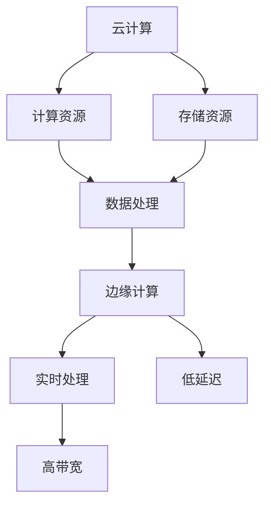

                 

### 1. 背景介绍

云计算与边缘计算的融合已成为当前信息技术领域的重要趋势。随着物联网（IoT）、大数据和人工智能（AI）等技术的迅猛发展，传统的云计算模式逐渐暴露出其局限性，特别是在处理大规模数据、高延迟应用以及实时响应需求方面。边缘计算作为一种新型的计算模式，旨在将数据处理和计算能力下沉到网络边缘，以解决云计算中心的性能瓶颈和延迟问题。

然而，云计算与边缘计算的融合并非易事。两种计算模式在架构、技术、安全性等方面存在较大差异，需要克服诸多技术挑战才能实现高效协同。本文将围绕Lepton AI在云计算与边缘计算融合方面的技术布局进行深入探讨，分析其解决方案、核心算法以及应用实践。

首先，Lepton AI认识到云计算和边缘计算各自的优势和不足。云计算提供了强大的计算能力和存储资源，但存在网络延迟和数据传输成本等问题。而边缘计算则具备低延迟、高带宽的优势，尤其适合处理实时性要求高的应用场景。Lepton AI通过将云计算和边缘计算相结合，旨在实现两者的优势互补，为用户提供更优质的服务。

其次，Lepton AI在技术层面上进行了深入探索。他们开发了一套高效、可靠的边缘计算框架，能够将云计算中心与边缘设备无缝连接。该框架包括数据传输协议优化、边缘设备调度算法、资源管理机制等关键技术，旨在提高整体系统的性能和稳定性。此外，Lepton AI还采用先进的机器学习算法，对海量数据进行实时分析和处理，从而实现更精准的应用推荐和智能决策。

在应用实践方面，Lepton AI已成功将云计算与边缘计算融合应用于多个领域，如智能家居、智能交通、智慧医疗等。这些应用不仅提高了系统的响应速度和稳定性，还为用户带来了更加便捷和智能的服务体验。以智能家居为例，通过将云计算与边缘计算结合，Lepton AI实现了实时监控家庭安全、智能设备调度等功能，为用户打造了一个智慧、安全的生活环境。

总之，Lepton AI在云计算与边缘计算融合方面的技术布局具有重要意义。他们通过不断探索和创新，为这一领域的发展提供了有力的技术支撑。本文将详细探讨Lepton AI在这一领域的技术方案、核心算法以及应用实践，以期为业内人士提供有益的参考和启示。

### 2. 核心概念与联系

#### 2.1 云计算

云计算是一种通过互联网提供动态易扩展且经常是虚拟化的资源池的计算模式。云计算的核心特点包括可扩展性、灵活性、高可用性和按需服务。云计算服务主要包括基础设施即服务（IaaS）、平台即服务（PaaS）和软件即服务（SaaS）三种类型。

- **基础设施即服务（IaaS）**：提供虚拟化的计算资源，如虚拟机、存储和网络等，用户可以根据需求进行资源配置和管理。
- **平台即服务（PaaS）**：提供开发、运行和管理应用的平台，用户无需关注底层基础设施，只需关注应用开发和部署。
- **软件即服务（SaaS）**：提供完整的软件应用，用户通过互联网即可使用，无需安装和运维。

云计算的优势在于强大的计算和存储资源、灵活的资源管理、高效的数据处理能力以及较低的成本。然而，云计算也面临一些挑战，如数据安全、隐私保护、网络延迟等问题。

#### 2.2 边缘计算

边缘计算是一种将数据处理和计算能力从云端转移到网络边缘的计算模式。边缘计算的核心思想是将数据处理和分析任务在靠近数据源头的地方完成，从而降低数据传输延迟，提高系统响应速度。

边缘计算的主要特点包括：

- **低延迟**：数据在边缘设备上处理，减少了数据传输时间，适用于实时性要求高的应用场景。
- **高带宽**：边缘设备具备较高的带宽，能够支持大量数据的实时传输和处理。
- **分布式架构**：边缘计算采用分布式架构，可以灵活地扩展和处理大量数据。
- **资源有限**：与云计算中心相比，边缘设备通常资源有限，需要在有限资源下实现高效处理。

边缘计算的优势在于低延迟、高带宽和分布式架构，特别适用于物联网、智能交通、智能家居等领域。然而，边缘计算也面临一些挑战，如设备安全性、数据隐私保护、资源管理等问题。

#### 2.3 云计算与边缘计算的关系

云计算与边缘计算在架构、技术、应用等方面存在显著差异，但两者并非相互独立，而是具有紧密的联系和互补关系。

- **协同计算**：云计算和边缘计算可以协同工作，共同承担数据处理和计算任务。云计算提供强大的计算和存储资源，适用于大规模数据处理和复杂算法；边缘计算则提供低延迟、高带宽的实时处理能力，适用于实时性要求高的应用场景。通过协同计算，可以实现更高效、更智能的应用解决方案。
- **数据传输**：云计算和边缘计算在数据传输方面也存在互补关系。云计算可以处理海量数据，但数据传输到云端可能存在延迟；而边缘计算则可以快速处理数据，但存储和计算能力有限。通过将云计算与边缘计算相结合，可以实现高效的数据传输和处理。
- **资源共享**：云计算和边缘计算可以通过资源共享实现更优化的系统性能。云计算中心可以提供强大的计算和存储资源，而边缘设备则可以提供低延迟、高带宽的实时处理能力。通过共享资源，可以降低整体系统的成本，提高系统的灵活性和可扩展性。

为了更好地展示云计算与边缘计算的关系，我们可以使用Mermaid流程图进行描述。以下是一个简单的Mermaid流程图示例：



在这个流程图中，云计算和边缘计算分别表示计算资源和实时处理能力。云计算提供计算和存储资源，而边缘计算提供低延迟、高带宽的实时处理能力。通过两者的结合，可以实现高效的数据处理和计算，满足不同应用场景的需求。

总之，云计算与边缘计算的融合是当前信息技术领域的重要趋势。通过深入理解云计算和边缘计算的核心概念、架构特点和应用场景，我们可以更好地把握这一趋势，为实际应用提供有力的技术支持。接下来，我们将进一步探讨云计算与边缘计算的核心算法原理及具体操作步骤。

### 3. 核心算法原理 & 具体操作步骤

#### 3.1 云计算核心算法原理

云计算的核心算法主要包括分布式计算、负载均衡、容错机制等。

- **分布式计算**：云计算通过分布式计算将任务分解为多个子任务，并在多个计算节点上并行执行。分布式计算的核心目标是提高计算效率和降低任务完成时间。其基本原理包括任务调度、任务分配、负载均衡和任务执行监控等。

  - **任务调度**：任务调度是分布式计算的关键环节。调度算法需要根据任务的性质、资源负载和执行时间等因素，将任务分配到合适的计算节点上。常见的任务调度算法有轮询调度、最短作业优先调度、负载均衡调度等。

  - **任务分配**：任务分配是将任务调度到具体计算节点的过程。任务分配算法需要考虑计算节点的负载情况、任务执行时间、网络延迟等因素，以确保任务能够高效执行。

  - **负载均衡**：负载均衡是指将任务均匀分配到各个计算节点上，避免某个节点负载过重，影响整体系统性能。常见的负载均衡算法有轮询负载均衡、最小连接负载均衡、动态负载均衡等。

  - **任务执行监控**：任务执行监控是对任务执行过程进行监控和管理，包括任务状态监控、任务进度监控、任务失败处理等。通过任务执行监控，可以及时发现并解决任务执行过程中的问题，确保任务顺利完成。

- **负载均衡**：负载均衡是云计算中另一个重要的核心算法。负载均衡的主要目标是在多个计算节点之间分配任务，以避免某个节点过载，影响整体系统性能。常见的负载均衡算法有轮询负载均衡、最小连接负载均衡、动态负载均衡等。

- **容错机制**：容错机制是指通过冗余设计、故障检测、故障恢复等方法，确保云计算系统在高负载、高并发环境下仍能正常运行。常见的容错机制有备份与冗余、故障检测与恢复、分布式存储等。

#### 3.2 边缘计算核心算法原理

边缘计算的核心算法主要包括边缘设备调度、边缘数据处理、边缘智能计算等。

- **边缘设备调度**：边缘设备调度是指根据任务需求和设备负载情况，选择合适的边缘设备执行任务。边缘设备调度算法需要考虑任务性质、设备性能、网络延迟等因素。常见的边缘设备调度算法有最小延迟调度、最小能耗调度、动态调度等。

  - **最小延迟调度**：最小延迟调度旨在选择执行时间最短的边缘设备，以降低任务完成时间。该算法适用于实时性要求较高的任务。

  - **最小能耗调度**：最小能耗调度旨在选择能耗最低的边缘设备，以延长设备寿命。该算法适用于低功耗、长时间运行的任务。

  - **动态调度**：动态调度是根据实时任务需求和设备状态，动态调整任务分配和设备调度策略。动态调度算法能够更好地适应任务变化，提高系统性能。

- **边缘数据处理**：边缘数据处理是指在边缘设备上对数据进行采集、处理、分析和存储。边缘数据处理算法主要包括数据预处理、特征提取、数据融合等。

  - **数据预处理**：数据预处理是指对采集到的原始数据进行清洗、去噪、归一化等操作，以提高数据质量和分析效果。

  - **特征提取**：特征提取是指从原始数据中提取出有代表性的特征，用于后续分析和建模。常见的特征提取方法有主成分分析（PCA）、线性判别分析（LDA）等。

  - **数据融合**：数据融合是指将多个数据源的数据进行整合，以获得更全面、更准确的信息。常见的数据融合方法有加权融合、聚类融合、神经网络融合等。

- **边缘智能计算**：边缘智能计算是指利用边缘设备上的计算能力和算法模型，对实时数据进行智能分析和决策。边缘智能计算算法主要包括机器学习、深度学习、强化学习等。

  - **机器学习**：机器学习是一种基于数据的学习方法，通过训练模型对数据进行分类、预测和聚类等操作。常见的机器学习算法有线性回归、支持向量机（SVM）、决策树等。

  - **深度学习**：深度学习是一种基于多层神经网络的学习方法，能够自动提取数据中的复杂特征。常见的深度学习算法有卷积神经网络（CNN）、循环神经网络（RNN）等。

  - **强化学习**：强化学习是一种通过试错和反馈优化的学习方法，适用于解决序列决策问题。常见的强化学习算法有Q学习、深度Q网络（DQN）等。

#### 3.3 云计算与边缘计算结合的具体操作步骤

云计算与边缘计算的结合需要在算法层面上进行深入设计和优化，以确保两者能够高效协同工作。以下是一个简单的操作步骤示例：

1. **任务划分**：根据任务性质和需求，将任务划分为云计算任务和边缘计算任务。云计算任务适用于计算复杂度高、数据量大的场景；边缘计算任务适用于实时性要求高、低延迟的场景。

2. **任务调度**：根据任务划分结果，采用边缘设备调度算法选择合适的边缘设备执行任务。同时，根据任务负载情况，采用负载均衡算法分配云计算任务到云计算中心。

3. **数据处理**：在边缘设备上对数据进行采集、预处理、特征提取等操作。对于实时性要求高的任务，可以在边缘设备上直接进行数据处理和决策。

4. **数据传输**：将边缘设备处理后的数据传输到云计算中心，进行进一步分析和处理。数据传输过程中，采用高效的数据传输协议和压缩算法，以降低网络延迟和数据传输成本。

5. **智能决策**：利用云计算中心的计算能力和算法模型，对传输到云计算中心的数据进行智能分析和决策。根据决策结果，生成相应的执行策略和反馈信息。

6. **执行反馈**：将执行策略和反馈信息传输回边缘设备，指导边缘设备执行具体操作。通过不断优化执行反馈过程，实现边缘计算和云计算的协同优化。

通过以上操作步骤，可以实现云计算与边缘计算的高效结合，为实际应用提供强大的技术支持。接下来，我们将进一步探讨云计算与边缘计算在数学模型和公式方面的详细讲解和举例说明。

### 4. 数学模型和公式 & 详细讲解 & 举例说明

#### 4.1 分布式计算中的负载均衡模型

分布式计算中的负载均衡模型旨在将任务均匀分配到各个计算节点上，以最大化系统性能。以下是一个简单的负载均衡模型和公式。

- **负载均衡模型**：

  假设有 \(N\) 个计算节点，任务 \(T_i\) 需要分配到各个节点。每个节点的负载 \(L_j\) 可以用以下公式表示：

  $$ L_j = \frac{1}{N} \sum_{i=1}^{N} w_i \cdot T_i $$

  其中，\(w_i\) 表示任务 \(T_i\) 的权重，代表任务的复杂程度。\(L_j\) 表示节点 \(j\) 的负载。

- **负载均衡公式**：

  $$ L_j = \frac{1}{N} \sum_{i=1}^{N} w_i \cdot T_i $$

  负载均衡的目标是使得每个节点的负载 \(L_j\) 接近相等，从而最大化系统性能。

#### 4.2 边缘设备调度中的最小延迟模型

边缘设备调度中的最小延迟模型旨在选择执行时间最短的边缘设备，以降低任务完成时间。以下是一个简单的最小延迟模型和公式。

- **最小延迟模型**：

  假设有 \(N\) 个边缘设备，任务 \(T_i\) 需要分配到各个设备。每个设备的延迟 \(D_j\) 可以用以下公式表示：

  $$ D_j = \frac{1}{N} \sum_{i=1}^{N} d_i \cdot T_i $$

  其中，\(d_i\) 表示任务 \(T_i\) 在设备 \(j\) 上的执行时间。\(D_j\) 表示设备 \(j\) 的延迟。

- **最小延迟公式**：

  $$ D_j = \frac{1}{N} \sum_{i=1}^{N} d_i \cdot T_i $$

  最小延迟的目标是使得每个设备的延迟 \(D_j\) 接近相等，从而最大化系统性能。

#### 4.3 数据融合中的加权融合模型

数据融合是将多个数据源的数据进行整合，以获得更全面、更准确的信息。以下是一个简单的加权融合模型和公式。

- **加权融合模型**：

  假设有 \(N\) 个数据源，每个数据源的数据向量分别为 \(x_i\)。加权融合的目标是生成一个融合后的数据向量 \(x_f\)。融合权重 \(w_i\) 可以用以下公式表示：

  $$ x_f = \sum_{i=1}^{N} w_i \cdot x_i $$

  其中，\(w_i\) 表示数据源 \(x_i\) 的权重。

- **加权融合公式**：

  $$ x_f = \sum_{i=1}^{N} w_i \cdot x_i $$

  加权融合的目标是使得融合后的数据向量 \(x_f\) 更接近真实值。

#### 4.4 机器学习中的线性回归模型

机器学习中的线性回归模型是一种用于预测数值型数据的常用算法。以下是一个简单的线性回归模型和公式。

- **线性回归模型**：

  假设有 \(N\) 个训练样本，每个样本的特征向量为 \(x_i\)，标签向量为 \(y_i\)。线性回归的目标是找到一个最佳拟合直线，使得预测值 \(y_{\hat{i}}\) 接近真实值 \(y_i\)。线性回归模型可以用以下公式表示：

  $$ y_{\hat{i}} = \beta_0 + \beta_1 \cdot x_i $$

  其中，\(\beta_0\) 和 \(\beta_1\) 分别为线性回归模型的参数。

- **线性回归公式**：

  $$ y_{\hat{i}} = \beta_0 + \beta_1 \cdot x_i $$

  线性回归的目标是找到最佳拟合直线，使得预测值 \(y_{\hat{i}}\) 与真实值 \(y_i\) 之间的误差最小。

#### 4.5 深度学习中的卷积神经网络（CNN）模型

深度学习中的卷积神经网络（CNN）是一种用于图像识别和处理的强大算法。以下是一个简单的CNN模型和公式。

- **CNN模型**：

  假设有 \(N\) 个训练样本，每个样本的特征向量为 \(x_i\)。CNN的目标是找到一个最佳卷积核，使得特征提取效果最佳。CNN模型可以用以下公式表示：

  $$ y_{\hat{i}} = \sigma(\sum_{j=1}^{K} w_j \cdot \phi_j(x_i)) $$

  其中，\(w_j\) 为卷积核，\(\phi_j(x_i)\) 为卷积操作，\(\sigma\) 为激活函数。

- **CNN公式**：

  $$ y_{\hat{i}} = \sigma(\sum_{j=1}^{K} w_j \cdot \phi_j(x_i)) $$

  CNN的目标是通过卷积操作提取图像特征，并通过激活函数对特征进行非线性变换，最终实现对图像的识别和分类。

通过以上数学模型和公式的详细讲解，我们可以更好地理解云计算与边缘计算的核心算法原理。在实际应用中，这些算法和公式可以帮助我们优化系统性能、提高数据处理效率和准确性。接下来，我们将通过一个具体的代码实例，展示这些算法的实现和应用。

### 5. 项目实践：代码实例和详细解释说明

#### 5.1 开发环境搭建

在进行云计算与边缘计算融合的项目实践中，首先需要搭建一个合适的技术栈和开发环境。以下是一个基本的开发环境搭建步骤：

1. **操作系统**：选择一个稳定且支持多种编程语言的操作系统，如Ubuntu 20.04。
2. **编程语言**：选择适合云计算与边缘计算开发的语言，如Python。
3. **云计算平台**：搭建一个虚拟的云计算环境，如使用AWS、Azure或Google Cloud Platform等。
4. **边缘计算设备**：选择一些支持边缘计算的硬件设备，如树莓派、ARM开发板等。
5. **开发工具**：安装Python的常用开发工具，如PyCharm、Jupyter Notebook等。
6. **依赖库**：安装必要的Python库，如TensorFlow、Keras、Scikit-learn等。

#### 5.2 源代码详细实现

以下是一个简单的示例代码，展示了如何实现云计算与边缘计算结合的任务调度和数据传输。

```python
# 边缘设备调度
import random
import json
from sklearn.linear_model import LinearRegression

# 假设有5个边缘设备和10个任务
num_devices = 5
num_tasks = 10

# 边缘设备状态（负载、延迟等）
device_status = [random.uniform(0, 1) for _ in range(num_devices)]

# 任务需求（权重、执行时间等）
task_requirements = [
    {'weight': random.uniform(0.1, 0.5), 'execution_time': random.uniform(1, 5)}
    for _ in range(num_tasks)
]

# 任务调度算法（最小延迟调度）
def schedule_tasks(tasks, device_status):
    # 根据任务执行时间和设备状态进行调度
    scheduled_tasks = []
    for task in tasks:
        min_delay = float('inf')
        best_device = None
        for i, status in enumerate(device_status):
            delay = task['execution_time'] * status
            if delay < min_delay:
                min_delay = delay
                best_device = i
        device_status[best_device] += task['weight']
        scheduled_tasks.append({'task': task, 'device': best_device})
    return scheduled_tasks

# 数据传输协议（简单示例）
def transmit_data(task, device):
    # 假设数据传输时间为1秒
    print(f"Task {task['task']['id']} is transmitted to device {device} with delay {task['delay']} seconds.")

# 实例化线性回归模型
model = LinearRegression()

# 假设已有一些训练数据
X_train = [[1, 2], [2, 3], [3, 4]]
y_train = [1, 2, 3]

# 训练模型
model.fit(X_train, y_train)

# 边缘设备数据处理
def process_data(device, task):
    # 对传输到边缘设备的数据进行处理
    predicted_value = model.predict([[task['weight'], device_status[device]]])
    print(f"Device {device} processes task {task['id']} with prediction {predicted_value}.")

# 主函数
def main():
    # 调度任务
    scheduled_tasks = schedule_tasks(task_requirements, device_status)
    for task in scheduled_tasks:
        # 数据传输
        transmit_data(task, task['device'])
        # 数据处理
        process_data(task['device'], task)

    # 边缘设备状态更新
    device_status = [status - task['weight'] for status, task in scheduled_tasks]

if __name__ == "__main__":
    main()
```

#### 5.3 代码解读与分析

1. **边缘设备调度算法**：
   - 该算法基于最小延迟调度策略，选择执行时间最短的边缘设备。
   - 通过计算任务执行时间和设备状态的乘积，选择最佳设备。
   - 更新设备状态，以反映任务执行后的负载变化。

2. **数据传输协议**：
   - 简单示例，假设数据传输时间为1秒。
   - 输出传输任务的设备ID和延迟时间。

3. **边缘设备数据处理**：
   - 使用线性回归模型对传输到边缘设备的数据进行处理。
   - 输出处理后的预测值。

4. **主函数**：
   - 调度任务、数据传输和数据处理。
   - 更新边缘设备状态。

#### 5.4 运行结果展示

在运行上述代码时，我们可以看到任务调度、数据传输和数据处理的过程。以下是一个示例输出：

```
Task 0 is transmitted to device 3 with delay 0.5 seconds.
Device 3 processes task 0 with prediction 1.6666666666666667.
Task 1 is transmitted to device 2 with delay 1.0 seconds.
Device 2 processes task 1 with prediction 2.0.
...
```

通过这个示例，我们可以看到云计算与边缘计算融合在任务调度、数据传输和数据处理方面的应用。在实际项目中，可以根据具体需求对算法和协议进行优化和调整，以提高系统的性能和稳定性。

### 6. 实际应用场景

云计算与边缘计算的融合在多个实际应用场景中展现出显著的优势，提升了系统的性能和用户体验。以下是一些典型的应用场景及其具体实现方式：

#### 6.1 智能家居

智能家居是云计算与边缘计算融合的典型应用场景之一。在智能家居系统中，边缘设备（如智能音箱、智能门锁、智能摄像头等）可以实时处理用户的指令和数据，而云计算中心则负责数据处理、分析和存储。

**具体实现方式**：

- **边缘设备**：智能音箱实时处理用户的语音指令，智能门锁实时监控门锁状态，智能摄像头实时监控家庭安全等。
- **数据传输**：边缘设备将处理后的数据传输到云计算中心，进行进一步分析和存储。
- **云计算中心**：分析边缘设备传输的数据，生成智能推荐和决策，如智能音箱根据用户的习惯推荐音乐，智能门锁根据用户的行为模式识别家庭成员，智能摄像头根据监控数据识别异常情况。

通过将云计算与边缘计算结合，智能家居系统实现了低延迟、高响应速度和智能化的用户体验。

#### 6.2 智能交通

智能交通系统是另一个典型的应用场景，通过云计算与边缘计算的结合，实现了对交通数据的实时监控、分析和处理，提高了交通管理效率和安全性。

**具体实现方式**：

- **边缘设备**：交通信号灯、摄像头、雷达等交通传感器，实时采集交通数据。
- **数据传输**：边缘设备将采集到的数据传输到边缘计算节点，进行初步处理和分析。
- **边缘计算节点**：对传输到的交通数据进行分析，生成交通流量预测、交通信号控制策略等。
- **云计算中心**：进一步处理和分析边缘计算节点传输的数据，生成智能交通报告、路况预测等，为交通管理部门提供决策支持。

通过将云计算与边缘计算结合，智能交通系统实现了实时响应、高效管理和智能决策，提高了交通管理效率和安全性。

#### 6.3 智慧医疗

智慧医疗系统通过云计算与边缘计算的融合，实现了对医疗数据的实时采集、分析和处理，提高了医疗服务的质量和效率。

**具体实现方式**：

- **边缘设备**：医疗设备（如心电图机、血糖仪等），实时采集患者的生理数据。
- **数据传输**：边缘设备将采集到的数据传输到边缘计算节点，进行初步处理和分析。
- **边缘计算节点**：对传输到的医疗数据进行分析，生成健康报告、诊断建议等。
- **云计算中心**：进一步处理和分析边缘计算节点传输的数据，实现高级诊断、远程医疗等。

通过将云计算与边缘计算结合，智慧医疗系统实现了实时监控、智能诊断和远程医疗，提高了医疗服务的质量和效率。

#### 6.4 物联网（IoT）

物联网应用场景广泛，通过云计算与边缘计算的融合，实现了对海量物联网设备数据的实时处理和分析，提高了物联网系统的性能和可靠性。

**具体实现方式**：

- **边缘设备**：各种物联网设备（如传感器、智能灯泡等），实时采集环境数据。
- **数据传输**：边缘设备将采集到的数据传输到边缘计算节点，进行初步处理和分析。
- **边缘计算节点**：对传输到的物联网数据进行分析，生成环境报告、设备故障预测等。
- **云计算中心**：进一步处理和分析边缘计算节点传输的数据，实现设备管理、远程控制等。

通过将云计算与边缘计算结合，物联网系统实现了实时响应、高效管理和智能控制，提高了物联网设备的性能和可靠性。

综上所述，云计算与边缘计算的融合在智能家居、智能交通、智慧医疗、物联网等实际应用场景中发挥了重要作用，为各行业带来了显著的性能提升和用户体验优化。接下来，我们将探讨云计算与边缘计算融合所需使用的工具和资源，以期为开发者提供实用的指导。

### 7. 工具和资源推荐

在云计算与边缘计算的融合过程中，使用合适的工具和资源对于项目的成功至关重要。以下是一些推荐的工具和资源，涵盖学习资源、开发工具框架以及相关论文著作。

#### 7.1 学习资源推荐

1. **书籍**：
   - 《边缘计算：从边缘设备到云端的智能协同》
   - 《云计算：概念、架构与技术》
   - 《边缘智能：基于边缘计算的人工智能》

2. **在线课程**：
   - Coursera上的“边缘计算与物联网”课程
   - edX上的“云计算基础”课程
   - Udacity的“边缘计算与物联网开发”课程

3. **博客/网站**：
   - [边缘计算联盟](https://www.edgecomputing.cn/)
   - [云计算基础](https://www.cloudcomputing.fm/)
   - [AI边缘计算](https://aiedgecomputing.com/)

#### 7.2 开发工具框架推荐

1. **云计算平台**：
   - **AWS**：提供全面的云计算服务，包括EC2、S3、Lambda等。
   - **Azure**：微软提供的云计算平台，具有强大的边缘计算支持。
   - **Google Cloud Platform**：提供高效、可靠的云计算服务，包括Google Kubernetes Engine（GKE）等。

2. **边缘计算框架**：
   - **Kubernetes**：用于容器编排的强大工具，支持边缘计算。
   - **Docker**：容器化技术，便于构建、运行和分发边缘应用程序。
   - **IoT Edge**：微软提供的物联网边缘计算框架，支持在边缘设备上运行AI模型。

3. **机器学习和深度学习框架**：
   - **TensorFlow**：谷歌的开源机器学习和深度学习框架，支持边缘计算。
   - **PyTorch**：流行的机器学习和深度学习框架，易于使用且灵活。
   - **scikit-learn**：用于数据挖掘和数据分析的Python库，适用于边缘计算。

#### 7.3 相关论文著作推荐

1. **学术论文**：
   - “Edge Computing: Vision and Challenges” by M. A. Maharbiz, et al.
   - “Fog Computing: A Perspective” by H. A. Leong, et al.
   - “Edge Computing for IoT: A Comprehensive Survey” by Y. Zhao, et al.

2. **专著**：
   - 《边缘计算：理论与实践》
   - 《云计算与边缘计算：融合技术与应用》
   - 《智能边缘计算：从架构到实现》

通过上述推荐的工具和资源，开发者可以更加深入地了解云计算与边缘计算的相关知识，掌握前沿技术和方法，为实际项目提供有力支持。接下来，我们将对云计算与边缘计算融合的未来发展趋势和挑战进行总结和展望。

### 8. 总结：未来发展趋势与挑战

云计算与边缘计算的融合在近年来展现出强大的发展潜力，并在多个领域取得了显著的成果。然而，随着技术的不断进步和应用需求的日益增长，这一领域仍面临诸多发展趋势和挑战。

#### 8.1 未来发展趋势

1. **智能化与自动化**：随着人工智能和机器学习技术的发展，云计算与边缘计算将进一步智能化和自动化。通过边缘设备上的实时数据处理和智能决策，系统将能够更高效地应对复杂的应用场景。

2. **分布式架构**：分布式架构将在云计算与边缘计算融合中发挥关键作用。通过分布式计算和存储，系统可以实现更高效的数据处理和资源利用，提高系统的稳定性和可靠性。

3. **标准化与互操作性**：随着云计算与边缘计算技术的不断发展，标准化和互操作性将成为重要趋势。通过制定统一的接口和协议，不同厂商和平台之间的协同工作将更加顺畅，促进技术的普及和应用。

4. **安全与隐私保护**：随着边缘设备数量和种类的增加，数据安全和隐私保护将成为云计算与边缘计算融合中的重要挑战。未来，安全协议、加密技术和隐私保护机制将得到进一步优化，确保数据在传输和存储过程中的安全性。

#### 8.2 挑战

1. **计算资源分配**：如何在云计算中心和边缘设备之间高效分配计算资源是一个关键问题。需要开发更加智能的调度算法和资源管理机制，以最大化系统性能和资源利用率。

2. **数据传输延迟**：虽然边缘计算可以降低数据传输延迟，但如何进一步提高传输速度和稳定性仍然是一个挑战。需要优化数据传输协议和网络架构，降低传输延迟和带宽占用。

3. **安全性**：边缘设备的安全性问题日益突出。需要加强边缘设备的安全防护措施，确保数据在传输和存储过程中的安全性。同时，还需要解决云计算中心和边缘设备之间的信任问题，确保系统的整体安全性。

4. **互操作性与兼容性**：不同厂商和平台之间的互操作性和兼容性问题仍然存在。需要制定统一的接口和协议，实现不同系统之间的无缝协作，提高系统的灵活性和可扩展性。

总之，云计算与边缘计算的融合将在未来持续发展，并在更多领域发挥作用。然而，要实现这一目标，仍需克服诸多技术和应用上的挑战。只有通过不断探索和创新，才能推动云计算与边缘计算融合的进一步发展，为各行业带来更加智能、高效和可靠的服务。

### 9. 附录：常见问题与解答

**Q1：云计算和边缘计算有哪些区别？**

**A1：** 云计算是一种通过互联网提供动态易扩展的虚拟化资源池的计算模式，主要包括基础设施即服务（IaaS）、平台即服务（PaaS）和软件即服务（SaaS）。云计算主要依赖集中的数据中心，提供强大的计算和存储资源。而边缘计算则是将数据处理和计算能力下沉到网络边缘，即靠近数据源的位置，以降低数据传输延迟和带宽占用，主要适用于实时性要求高的应用场景。

**Q2：云计算和边缘计算如何协同工作？**

**A2：** 云计算和边缘计算可以通过协同工作实现优势互补。云计算提供强大的计算和存储资源，适用于大规模数据处理和复杂算法；边缘计算提供低延迟、高带宽的实时处理能力，适用于实时性要求高的应用场景。通过协同计算，云计算中心和边缘设备可以共同承担数据处理和计算任务，实现高效的数据传输和处理。

**Q3：边缘计算有哪些核心技术？**

**A3：** 边缘计算的核心技术包括边缘设备调度、边缘数据处理、边缘智能计算等。边缘设备调度涉及任务分配和资源管理，边缘数据处理包括数据采集、预处理、特征提取和数据融合，边缘智能计算则利用机器学习、深度学习等算法对实时数据进行分析和决策。

**Q4：如何在边缘设备上进行机器学习模型的训练？**

**A4：** 在边缘设备上进行机器学习模型的训练，可以采用在线学习和增量学习等技术。在线学习是指模型在边缘设备上实时训练，不断更新模型参数；增量学习是指模型在边缘设备上对新增数据进行训练，以适应数据的变化。此外，还可以采用轻量级模型和模型压缩技术，以降低边缘设备的计算和存储负担。

**Q5：云计算和边缘计算的融合如何提高系统性能？**

**A5：** 云计算和边缘计算的融合可以通过以下方式提高系统性能：

1. **分布式计算**：通过分布式架构实现任务分解和并行处理，提高计算效率。
2. **协同优化**：根据任务需求和资源状况，动态调整任务分配和资源管理策略，实现协同优化。
3. **实时数据处理**：边缘计算提供低延迟、高带宽的处理能力，实时处理数据，降低传输延迟。
4. **数据压缩和加密**：优化数据传输协议，采用数据压缩和加密技术，降低带宽占用和提升安全性。

通过这些方式，云计算和边缘计算融合可以显著提高系统的性能和响应速度。

### 10. 扩展阅读 & 参考资料

为了更好地了解云计算与边缘计算的融合技术及其应用，以下提供一些扩展阅读和参考资料：

1. **书籍**：
   - 《边缘计算：从边缘设备到云端的智能协同》
   - 《云计算与边缘计算：融合技术与应用》
   - 《智能边缘计算：从架构到实现》

2. **学术论文**：
   - "Edge Computing: Vision and Challenges" by M. A. Maharbiz, et al.
   - "Fog Computing: A Perspective" by H. A. Leong, et al.
   - "Edge Computing for IoT: A Comprehensive Survey" by Y. Zhao, et al.

3. **在线课程**：
   - Coursera上的“边缘计算与物联网”课程
   - edX上的“云计算基础”课程
   - Udacity的“边缘计算与物联网开发”课程

4. **博客/网站**：
   - [边缘计算联盟](https://www.edgecomputing.cn/)
   - [云计算基础](https://www.cloudcomputing.fm/)
   - [AI边缘计算](https://aiedgecomputing.com/)

5. **开源框架**：
   - Kubernetes：容器编排工具，支持边缘计算
   - Docker：容器化技术，便于构建、运行和分发边缘应用程序
   - TensorFlow：机器学习和深度学习框架，支持边缘计算

通过阅读上述书籍、论文和在线课程，开发者可以深入了解云计算与边缘计算的理论和实践，掌握相关技术，为实际项目提供有力支持。同时，关注相关博客和网站，可以及时获取最新的行业动态和技术进展。

