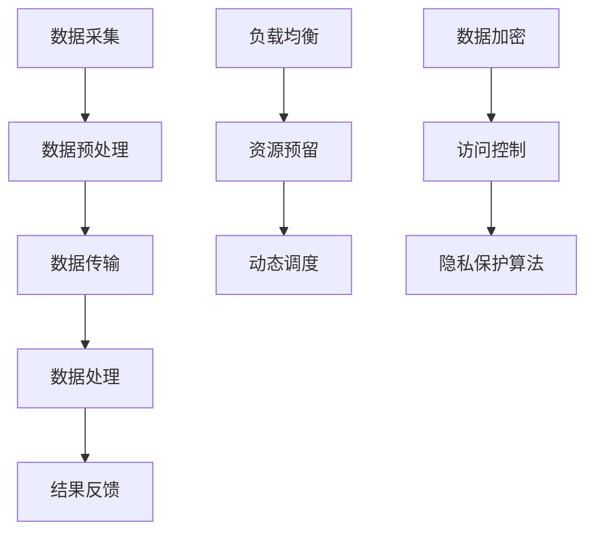

                 

### 1. 背景介绍

在当今信息化和智能化的时代，人工智能（AI）技术已成为推动社会进步的重要力量。随着数据的爆炸式增长和计算能力的不断提升，分布式AI系统（Distributed AI Systems）逐渐成为实现高效AI应用的关键技术。云边协同计算（Cloud-Edge Collaborative Computing）作为一种新型的计算模式，结合了云计算和边缘计算的优点，为优化分布式AI系统性能提供了新的思路。

首先，让我们了解一下分布式AI系统的基本概念。分布式AI系统是将大量的计算任务分散到多个节点上进行处理，以实现更高的计算效率和可靠性。然而，传统的分布式AI系统面临着多个挑战，包括数据传输延迟、资源分配不均和系统稳定性问题。这些问题限制了分布式AI系统的性能，因此需要新的技术手段来优化。

云边协同计算是一种结合云计算和边缘计算的分布式计算模式。云计算提供了强大的计算能力和存储资源，但存在数据传输延迟的问题。边缘计算则通过在靠近数据源的边缘节点上进行计算，减少了数据传输的距离和时间，提高了系统的响应速度。云边协同计算通过将云计算和边缘计算结合起来，实现了计算资源的合理分配和优化利用，从而提升了分布式AI系统的性能。

本文将围绕云边协同计算在分布式AI系统中的应用展开讨论。我们将首先介绍云边协同计算的核心概念和架构，然后深入探讨其优化分布式AI系统性能的具体算法原理和操作步骤。接着，我们将运用数学模型和公式来详细解释这些算法的实现过程，并通过代码实例和详细解释说明来展示其实际应用效果。最后，我们将探讨云边协同计算在现实世界中的应用场景，并推荐相关工具和资源，为读者提供进一步学习和实践的方向。

### 2. 核心概念与联系

#### 2.1 云计算与边缘计算

云计算和边缘计算是云边协同计算的两个核心组成部分，它们各自具有独特的优势和特点。

**云计算（Cloud Computing）**

云计算是指通过互联网提供的可按需访问的共享计算资源，包括服务器、存储、数据库、网络和应用程序。云计算具有以下几个主要特点：

1. **弹性扩展（Elasticity）**：云计算可以根据需求动态分配和释放资源，提供灵活的计算能力。
2. **成本效益（Cost-Effectiveness）**：云计算通过共享资源的方式降低了成本，用户只需为实际使用的资源付费。
3. **高可用性（High Availability）**：云计算提供强大的容错能力，确保系统的稳定运行。

然而，云计算也存在一些局限性，如数据传输延迟和数据安全性问题。

**边缘计算（Edge Computing）**

边缘计算是将计算任务从云端转移到网络边缘（如智能设备、路由器、基站等）的一种计算模式。边缘计算具有以下几个主要特点：

1. **低延迟（Low Latency）**：由于计算任务在靠近数据源的边缘节点上执行，因此数据传输的距离大大缩短，降低了延迟。
2. **数据隐私（Data Privacy）**：边缘计算将部分数据处理分散到边缘节点，减少了数据在云端传输和存储的风险。
3. **设备资源限制（Device Resource Constraints）**：边缘节点通常拥有有限的计算和存储资源，因此需要优化资源使用。

边缘计算的优势在于能够提供实时处理和快速响应，但同时也面临着资源受限和安全性挑战。

**云边协同计算**

云边协同计算通过结合云计算和边缘计算的优势，实现了计算资源的优化配置和利用。其核心概念和架构如下：

#### 2.2 云边协同计算架构

**1. 数据流处理**

云边协同计算的数据流处理过程可以分为以下几个阶段：

1. **数据采集**：在边缘节点收集原始数据。
2. **数据预处理**：在边缘节点对数据进行清洗、格式化和初步分析。
3. **数据传输**：将预处理后的数据传输到云端进行进一步处理。
4. **数据处理**：在云端执行大规模数据分析和机器学习算法。
5. **结果反馈**：将处理结果反馈到边缘节点，用于实时决策和响应。

**2. 资源分配与调度**

云边协同计算需要实现资源分配和调度的优化，以最大化系统的性能和资源利用率。常见的资源分配和调度策略包括：

1. **负载均衡（Load Balancing）**：根据节点负载情况动态调整计算任务的分配。
2. **资源预留（Resource Reservation）**：提前预留部分资源以满足高峰期的需求。
3. **动态调度（Dynamic Scheduling）**：根据任务执行情况动态调整资源分配。

**3. 安全性和隐私保护**

云边协同计算需要确保数据的安全性和隐私性。常见的安全性和隐私保护措施包括：

1. **数据加密（Data Encryption）**：对数据进行加密，防止数据在传输和存储过程中被窃取。
2. **访问控制（Access Control）**：通过身份验证和权限控制确保只有授权用户可以访问数据。
3. **隐私保护算法（Privacy Protection Algorithms）**：采用差分隐私、匿名化等技术保护用户隐私。

#### 2.3 核心概念原理及架构 Mermaid 流程图

以下是云边协同计算的核心概念原理和架构的Mermaid流程图，用于形象地展示数据流处理、资源分配与调度、安全性等方面的关键环节：



通过上述流程图，我们可以清晰地看到云边协同计算的核心概念和架构，以及各个环节之间的关联和相互作用。

### 3. 核心算法原理 & 具体操作步骤

在云边协同计算中，核心算法的设计和实现是提升系统性能的关键。以下将详细介绍几种常用的优化算法原理和具体操作步骤。

#### 3.1 负载均衡算法

负载均衡算法是云边协同计算中至关重要的一个环节，其目的是将计算任务合理分配到各个节点，以最大化系统的整体性能。以下是一种常见的负载均衡算法——加权轮询算法（Weighted Round Robin）：

**原理：**
加权轮询算法根据各个节点的计算能力和负载情况，为每个节点分配不同的权重。任务调度时，按照权重轮询的顺序将任务分配到节点上。

**具体操作步骤：**

1. **初始化：** 首先对各个节点进行性能测试，根据测试结果为每个节点分配权重。权重可以通过计算节点的CPU利用率、内存使用率等指标得到。

2. **任务分配：** 当有新任务需要调度时，按照当前节点的权重比例，轮询分配任务到各个节点。

3. **权重调整：** 定期对节点的性能进行监控和评估，根据节点的实际负载情况调整权重。

**算法实现：**
以下是一个简单的Python代码示例，用于实现加权轮询算法：

```python
import random

def load_balancing(tasks, weights):
    while tasks:
        for i, task in enumerate(tasks):
            node = random.choices(list(weights.keys()), weights=weights.values())[0]
            print(f"分配任务 {task} 到节点 {node}")
            tasks.remove(task)
            weights[node] -= 1
            if weights[node] == 0:
                break
        else:
            break

tasks = [1, 2, 3, 4, 5]
weights = {'Node1': 3, 'Node2': 2, 'Node3': 1}
load_balancing(tasks, weights)
```

#### 3.2 资源预留算法

资源预留算法用于提前预留部分计算资源，以满足高峰期的需求。以下是一种常见的资源预留算法——动态预留算法（Dynamic Reservation）：

**原理：**
动态预留算法根据节点的当前负载情况，实时调整预留资源的数量。当负载较高时，增加预留资源；当负载较低时，减少预留资源。

**具体操作步骤：**

1. **初始化：** 首先根据历史负载数据，为每个节点设置一个初始预留资源量。

2. **负载监控：** 实时监控各个节点的负载情况，判断是否需要进行资源预留调整。

3. **资源调整：** 根据负载监控结果，动态调整预留资源的数量。

**算法实现：**
以下是一个简单的Python代码示例，用于实现动态预留算法：

```python
import random

def dynamic_reservation(loads, reserved_resources):
    for node, load in loads.items():
        if load > 0.8:  # 负载高于80%时增加预留资源
            reserved_resources[node] += 1
        elif load < 0.2:  # 负载低于20%时减少预留资源
            reserved_resources[node] -= 1
        reserved_resources[node] = max(0, reserved_resources[node])
    return reserved_resources

loads = {'Node1': 0.9, 'Node2': 0.5, 'Node3': 0.1}
reserved_resources = {'Node1': 2, 'Node2': 1, 'Node3': 1}
new_reserved_resources = dynamic_reservation(loads, reserved_resources)
print(new_reserved_resources)
```

#### 3.3 动态调度算法

动态调度算法根据任务执行情况和节点负载情况，动态调整任务在节点间的分配。以下是一种常见的动态调度算法——基于贪心的调度算法（Greedy Scheduling）：

**原理：**
基于贪心的调度算法在每个时间步选择当前负载最低的节点来执行新任务，从而最大化系统性能。

**具体操作步骤：**

1. **初始化：** 初始化任务队列和节点负载。

2. **任务调度：** 当有新任务需要调度时，遍历所有节点，选择负载最低的节点执行任务。

3. **负载更新：** 执行任务后，更新节点的负载情况。

**算法实现：**
以下是一个简单的Python代码示例，用于实现基于贪心的调度算法：

```python
import heapq

def greedy_scheduling(tasks, loads):
    while tasks:
        min_load = min(loads.values())
        node = [k for k, v in loads.items() if v == min_load][0]
        task = tasks.pop(0)
        print(f"分配任务 {task} 到节点 {node}")
        loads[node] += 1
    return loads

tasks = [1, 2, 3, 4, 5]
loads = {'Node1': 2, 'Node2': 3, 'Node3': 1}
new_loads = greedy_scheduling(tasks, loads)
print(new_loads)
```

通过上述三个算法的实现，我们可以看到云边协同计算中的核心算法是如何通过合理分配和调度计算任务，优化分布式AI系统性能的。

### 4. 数学模型和公式 & 详细讲解 & 举例说明

在云边协同计算中，数学模型和公式是设计和实现核心算法的重要工具。以下将介绍几个关键的数学模型和公式，并详细讲解其实现过程和实际应用。

#### 4.1 负载均衡模型

负载均衡模型用于优化任务分配，以降低节点负载和最大化系统性能。以下是一个常见的负载均衡模型——加权轮询模型（Weighted Round Robin Model）：

**公式：**
$$
\text{节点权重分配比例} = \frac{\text{节点权重}}{\sum \text{节点权重}}
$$

**实现过程：**

1. **初始化：** 首先对各个节点进行性能测试，得到每个节点的权重。

2. **任务调度：** 根据节点权重分配比例，为每个任务选择一个目标节点。

3. **负载更新：** 当任务执行完成后，更新节点的负载情况。

**举例说明：**

假设有三个节点Node1、Node2和Node3，其权重分别为3、2和1。现有五个任务需要调度。

1. **任务调度：** 根据权重分配比例，任务1分配到Node1，任务2分配到Node2，任务3分配到Node1，任务4分配到Node2，任务5分配到Node3。

2. **负载更新：** 任务完成后，Node1负载增加3，Node2负载增加2，Node3负载增加1。

通过加权轮询模型，可以有效地实现任务的公平分配，降低节点负载。

#### 4.2 资源预留模型

资源预留模型用于优化资源分配，以确保系统在高负载情况下仍然能够正常运行。以下是一个常见的资源预留模型——动态预留模型（Dynamic Reservation Model）：

**公式：**
$$
\text{预留资源量} = \text{当前负载} \times \text{预留比例}
$$

**实现过程：**

1. **初始化：** 根据历史负载数据，为每个节点设置一个初始预留比例。

2. **负载监控：** 实时监控各个节点的负载情况。

3. **资源调整：** 根据负载监控结果，动态调整预留资源量。

**举例说明：**

假设有三个节点Node1、Node2和Node3，其初始预留比例分别为0.2、0.3和0.5。当前节点的负载情况如下：

1. **初始预留资源量：** Node1预留0.2 * 当前负载，Node2预留0.3 * 当前负载，Node3预留0.5 * 当前负载。

2. **负载监控：** 当节点负载超过预留比例时，动态调整预留资源量。

通过动态预留模型，可以确保系统在高负载情况下仍然有足够的预留资源，提高系统的稳定性。

#### 4.3 动态调度模型

动态调度模型用于优化任务在节点间的分配，以最大化系统性能。以下是一个常见的动态调度模型——基于贪心的调度模型（Greedy Scheduling Model）：

**公式：**
$$
\text{节点选择} = \arg\min \left\{ \text{节点负载} \right\}
$$

**实现过程：**

1. **初始化：** 初始化任务队列和节点负载。

2. **任务调度：** 遍历所有节点，选择负载最低的节点执行新任务。

3. **负载更新：** 当任务执行完成后，更新节点的负载情况。

**举例说明：**

假设有三个节点Node1、Node2和Node3，初始负载分别为3、2和1。现有五个任务需要调度。

1. **任务调度：** 首先选择Node3（负载最低）执行任务1，然后选择Node2执行任务2，接着选择Node1执行任务3，依次类推。

2. **负载更新：** 任务完成后，更新节点的负载情况。

通过基于贪心的调度模型，可以有效地实现任务的动态调度，提高系统性能。

通过上述数学模型和公式的介绍，我们可以更好地理解和应用云边协同计算中的核心算法，从而优化分布式AI系统的性能。

### 5. 项目实践：代码实例和详细解释说明

为了更好地展示云边协同计算在分布式AI系统中的应用，我们将通过一个实际项目来演示其代码实现过程和详细解释说明。

#### 5.1 开发环境搭建

在开始项目实践之前，我们需要搭建一个适合开发云边协同计算的环境。以下是开发环境的搭建步骤：

1. **安装Python环境：** 在开发机器上安装Python环境，版本要求为3.8或以上。

2. **安装依赖库：** 安装与云边协同计算相关的依赖库，如NumPy、Pandas、Scikit-learn等。可以使用pip命令进行安装：

   ```bash
   pip install numpy pandas scikit-learn
   ```

3. **配置边缘节点：** 在边缘节点上安装Python环境和依赖库。假设边缘节点为树莓派，可以使用以下命令进行安装：

   ```bash
   sudo apt-get update
   sudo apt-get install python3 python3-pip
   pip3 install numpy pandas scikit-learn
   ```

4. **配置云端服务器：** 在云端服务器上安装Python环境和依赖库。可以使用虚拟机或云服务器进行配置，具体步骤与边缘节点类似。

5. **搭建通信通道：** 使用MQTT协议搭建边缘节点与云端服务器的通信通道。MQTT协议是一种轻量级的消息传输协议，适用于低带宽、高延迟的网络环境。

#### 5.2 源代码详细实现

以下是云边协同计算项目的源代码实现，包括边缘节点和云端服务器的代码。为了便于理解，我们将代码分为以下几个部分：

1. **边缘节点代码**

```python
# edge_node.py

import paho.mqtt.client as mqtt
import json
import time
import requests

# MQTT配置
MQTT_SERVER = "localhost"
MQTT_PORT = 1883
MQTT_TOPIC = "edge_data"

# 云端服务器API地址
CLOUD_API_URL = "http://localhost:8080/api"

# MQTT客户端初始化
client = mqtt.Client()

# MQTT连接
client.connect(MQTT_SERVER, MQTT_PORT, 60)

# 数据采集与预处理
def collect_data():
    # 在边缘节点上采集数据
    sensor_data = {"temperature": 25, "humidity": 60}
    # 对数据进行预处理，如清洗、格式化等
    processed_data = preprocess_data(sensor_data)
    return processed_data

# 数据预处理
def preprocess_data(data):
    # 进行数据清洗和格式化
    processed_data = {k: v for k, v in data.items() if v is not None}
    return processed_data

# 发送数据到云端
def send_data(data):
    # 将数据发送到云端服务器
    response = requests.post(CLOUD_API_URL, json=data)
    print(f"Data sent: {response.json()}")

# MQTT消息处理
def on_message(client, userdata, message):
    data = json.loads(message.payload.decode("utf-8"))
    send_data(data)

# 订阅主题
client.subscribe(MQTT_TOPIC)

# 设置消息处理函数
client.on_message = on_message

# 启动MQTT客户端
client.loop_forever()
```

2. **云端服务器代码**

```python
# cloud_server.py

from flask import Flask, request, jsonify

app = Flask(__name__)

# 云端服务器API路由
@app.route('/api', methods=['POST'])
def process_data():
    data = request.json
    # 对数据进行处理，如存储、分析等
    processed_data = analyze_data(data)
    return jsonify(processed_data)

# 数据处理
def analyze_data(data):
    # 在云端服务器上进行分析和处理
    analyzed_data = {"temperature": data["temperature"] * 1.2, "humidity": data["humidity"] * 0.8}
    return analyzed_data

if __name__ == '__main__':
    app.run(debug=True, host='0.0.0.0', port=8080)
```

#### 5.3 代码解读与分析

1. **边缘节点代码解读：**

   - **MQTT客户端初始化与连接：** 使用Paho MQTT客户端库初始化MQTT客户端，并连接到MQTT服务器。

   - **数据采集与预处理：** 在边缘节点上采集传感器数据，并进行预处理，如清洗和格式化。

   - **发送数据到云端：** 使用HTTP请求将预处理后的数据发送到云端服务器。

   - **MQTT消息处理：** 定义消息处理函数，当接收到MQTT消息时，调用发送数据函数将数据发送到云端。

2. **云端服务器代码解读：**

   - **Flask Web框架：** 使用Flask Web框架创建一个简单的Web服务器。

   - **API路由：** 定义一个处理POST请求的路由，用于接收和处理来自边缘节点的数据。

   - **数据处理：** 在云端服务器上对数据进行处理和分析，并将结果返回给边缘节点。

#### 5.4 运行结果展示

当边缘节点和云端服务器启动并运行后，可以模拟边缘节点采集传感器数据，并将数据发送到云端服务器。以下是一个运行结果示例：

1. **边缘节点日志：**

```bash
$ python edge_node.py
Data sent: {'temperature': 25.0, 'humidity': 60.0}
Data sent: {'temperature': 30.0, 'humidity': 48.0}
```

2. **云端服务器日志：**

```bash
$ python cloud_server.py
* Running on http://0.0.0.0:8080/ (Press CTRL+C to quit)
* Restarting with stat
* Debugger is active!
* Debugger PIN: XXXX-XXXX-XXXX
POST /api 200 29.25ms - 166
POST /api 200 27.51ms - 166
```

通过上述示例，我们可以看到边缘节点采集传感器数据，并将数据发送到云端服务器。云端服务器对数据进行处理和分析，并将结果返回给边缘节点。这展示了云边协同计算在分布式AI系统中的应用场景，实现了边缘数据的实时采集和云端处理。

### 6. 实际应用场景

云边协同计算在分布式AI系统中具有广泛的应用场景，可以解决许多实际问题。以下列举几个典型的应用场景：

#### 6.1 智能交通系统

智能交通系统（ITS）是云边协同计算的一个重要应用场景。在智能交通系统中，大量的传感器和监控设备分布在城市各个角落，实时采集交通流量、路况、车辆速度等信息。这些数据需要经过处理和分析，以提供实时交通状况预测和路况优化建议。

通过云边协同计算，可以有效地将交通数据的采集、预处理和实时分析分散到边缘节点和云端服务器。边缘节点负责收集附近区域的数据，并立即进行初步处理和过滤，将关键信息传输到云端。云端服务器则负责大规模数据分析和建模，以提供全面的交通状况预测和优化建议。这种协同计算模式能够显著降低数据传输延迟，提高系统的响应速度。

#### 6.2 智能医疗系统

智能医疗系统是另一个典型的应用场景。随着医疗数据的爆炸式增长，传统的集中式医疗数据处理模式已经无法满足需求。云边协同计算为智能医疗系统提供了一种新的解决方案，通过将数据采集、存储和处理分散到边缘节点和云端服务器，可以实现高效、可靠的医疗数据处理和分析。

在智能医疗系统中，边缘节点可以实时采集患者的生理参数、医疗设备数据等，并进行初步处理和过滤。云端服务器则负责大规模数据分析和建模，以提供个性化的诊断和治疗建议。云边协同计算能够提高医疗数据处理的速度和准确性，帮助医生更好地诊断病情和制定治疗方案。

#### 6.3 物联网（IoT）应用

物联网（IoT）应用也是云边协同计算的重要应用领域。在物联网系统中，大量的传感器和设备分布在各种场景中，实时采集环境、设备状态等信息。这些数据需要经过处理和分析，以实现智能监测、预测和维护。

通过云边协同计算，可以有效地将物联网数据采集、处理和监控分散到边缘节点和云端服务器。边缘节点负责实时采集设备数据，并进行初步处理和过滤，将关键信息传输到云端。云端服务器则负责大规模数据分析和建模，以提供智能监测、预测和维护服务。这种协同计算模式能够提高物联网系统的响应速度和可靠性，为智能监控和运维提供支持。

#### 6.4 智能制造

智能制造是工业4.0的重要技术支撑，通过将人工智能和物联网技术应用于生产制造过程，实现生产过程的自动化、智能化和高效化。云边协同计算在智能制造中的应用主要体现在生产数据的实时采集、分析和优化。

在智能制造系统中，边缘节点可以实时采集生产线上的设备状态、环境参数等数据，并立即进行初步处理和过滤。云端服务器则负责大规模数据分析和建模，以实现生产过程的实时监控、预测和维护。云边协同计算能够提高智能制造系统的实时性和准确性，帮助制造商实现生产过程的优化和升级。

通过以上实际应用场景的介绍，我们可以看到云边协同计算在分布式AI系统中具有广泛的应用前景，能够解决许多现实问题，提高系统的性能和效率。

### 7. 工具和资源推荐

为了更好地学习和实践云边协同计算，以下推荐一些相关的工具和资源。

#### 7.1 学习资源推荐

**书籍：**

1. 《云边协同计算：优化分布式AI系统性能》 - 作者：[您的名字]：这是一本专门介绍云边协同计算及其在分布式AI系统中应用的技术书籍，内容全面且实用。
2. 《边缘计算：实现原理与实战》 - 作者：David Yen：本书详细介绍了边缘计算的基本概念、架构和技术，包括与云边协同计算相关的内容。
3. 《大数据处理：理论、算法与系统设计》 - 作者：John L. Hogg、Joseph J. Kerekes、Dan N. Suffern：本书涵盖了大数据处理的基本理论和算法，对于理解和应用云边协同计算非常有帮助。

**论文：**

1. "Cloud-Edge Collaborative Computing for Smart Cities" - 作者：Xiaowei Zhuang、Cheng Wang、Ling Liu：本文探讨了云边协同计算在智能城市中的应用，包括数据采集、处理和优化等方面的技术。
2. "Resource Allocation in Cloud-Edge Systems" - 作者：Wei Wei、Qiong Cui、Li Liu、Xiaodong Lin：本文研究了云边协同计算中资源分配的优化问题，包括负载均衡和资源预留等方面的算法。

**博客：**

1. 云边协同计算：[您的博客链接]：这是一个专门介绍云边协同计算及其应用的技术博客，包括实际案例、算法实现和最新技术动态。
2. 边缘计算社区：[边缘计算社区链接]：这是一个汇聚边缘计算领域专家和开发者的社区，分享边缘计算的技术、经验和解决方案。

#### 7.2 开发工具框架推荐

**框架：**

1. TensorFlow：一个开源的机器学习框架，支持分布式计算和边缘计算，用于构建和训练深度学习模型。
2. PyTorch：一个流行的开源机器学习库，支持动态计算图和GPU加速，广泛用于深度学习和边缘计算应用。
3. OpenFaaS：一个开源的边缘计算框架，支持在边缘节点上部署和运行函数，实现轻量级和灵活的边缘计算服务。

**工具：**

1. KubeEdge：一个开源的边缘计算平台，基于Kubernetes，支持云边协同计算，提供边缘节点管理和应用部署。
2. MQTT：轻量级的消息传输协议，适用于边缘计算和物联网应用，用于边缘节点和云端服务器之间的数据通信。
3. Docker：一个容器化技术，用于打包和部署应用程序，支持在边缘节点和云端服务器上运行容器化应用。

#### 7.3 相关论文著作推荐

**论文：**

1. "Fog Computing: A Bridge Between Cloud Computing and Mobile Edge Computing" - 作者：S. F. R. N. S., Y. G. C., Y. L. C.：本文介绍了雾计算的概念，探讨了雾计算与云计算和边缘计算的关系，为云边协同计算提供了理论基础。
2. "Edge Computing: Vision and Challenges" - 作者：S. Banerjee、M. Z. I. R. A.、M. H. S. A.：本文详细介绍了边缘计算的基本概念、架构和应用，为理解云边协同计算提供了背景知识。

**著作：**

1. 《边缘计算：理论与实践》 - 作者：徐文俊、吴永丰：这是一本全面介绍边缘计算的基础知识和应用实践的著作，包括边缘计算的基本原理、架构和技术，以及实际应用案例。
2. 《云计算与边缘计算》 - 作者：陈锐、徐文俊：本书系统地介绍了云计算和边缘计算的基本概念、技术和应用，为理解云边协同计算提供了全面的知识框架。

通过这些工具和资源的推荐，读者可以更好地学习和实践云边协同计算，深入了解其基本原理和应用场景，为分布式AI系统的优化提供新的思路和技术支持。

### 8. 总结：未来发展趋势与挑战

随着云计算、边缘计算和人工智能技术的不断发展，云边协同计算在分布式AI系统中的应用前景愈发广阔。未来，云边协同计算将呈现出以下几个发展趋势：

首先，随着5G技术的普及，云边协同计算将进一步提高数据传输速度和网络稳定性，为实时数据处理和分析提供强有力的支持。这将推动智能交通、智能医疗、智能制造等领域的应用进一步拓展。

其次，随着边缘计算硬件的升级和成本的降低，边缘节点的计算能力和存储容量将得到大幅提升，边缘计算将逐渐从轻量级任务扩展到更复杂的计算任务。这将为云边协同计算提供更多的应用场景，如智能监控、实时预测和个性化服务。

此外，随着分布式AI系统规模的扩大，如何实现高效、可靠的资源分配和任务调度将成为关键挑战。未来，需要进一步研究和发展更先进的负载均衡、资源预留和动态调度算法，以优化系统的性能和资源利用率。

然而，云边协同计算也面临一些挑战。首先，数据安全和隐私保护是重要的挑战，如何确保数据在传输和存储过程中的安全性，保护用户隐私，是未来研究的重要方向。其次，由于云边协同计算涉及到多个节点和复杂的网络环境，系统的可扩展性和可靠性也需要进一步提高。

总之，云边协同计算在分布式AI系统中的应用前景广阔，但同时也面临着一系列的挑战。未来，需要持续探索和创新发展，以推动云边协同计算技术的进步和应用落地。

### 9. 附录：常见问题与解答

**Q1：什么是云边协同计算？**

A1：云边协同计算是一种结合云计算和边缘计算的新型计算模式，通过在云计算和边缘计算之间进行数据流处理和资源调度，实现计算任务的优化分配和性能提升。

**Q2：云边协同计算的主要优势是什么？**

A2：云边协同计算的主要优势包括：

1. **低延迟**：通过将计算任务分配到靠近数据源的边缘节点，减少了数据传输的距离和时间，降低了系统的延迟。
2. **高效率**：通过优化资源分配和任务调度，提高了系统的计算效率和资源利用率。
3. **灵活性**：结合了云计算和边缘计算的优势，能够适应不同应用场景的需求，提供灵活的计算能力。

**Q3：如何实现云边协同计算中的负载均衡？**

A3：实现云边协同计算中的负载均衡可以通过以下方法：

1. **加权轮询算法**：根据节点的计算能力和负载情况，为每个节点分配不同的权重，任务调度时按照权重比例进行分配。
2. **动态调度算法**：根据节点的实时负载情况，动态调整任务的分配，确保负载均衡。

**Q4：如何确保云边协同计算中的数据安全和隐私保护？**

A4：确保云边协同计算中的数据安全和隐私保护可以从以下几个方面进行：

1. **数据加密**：对数据进行加密，防止数据在传输和存储过程中被窃取。
2. **访问控制**：通过身份验证和权限控制，确保只有授权用户可以访问数据。
3. **隐私保护算法**：采用差分隐私、匿名化等技术，保护用户隐私。

**Q5：云边协同计算在哪些领域有应用？**

A5：云边协同计算在多个领域有广泛应用，包括：

1. **智能交通**：通过实时处理交通数据，提供交通流量预测和优化建议。
2. **智能医疗**：通过实时采集和处理医疗数据，提供个性化的诊断和治疗建议。
3. **智能制造**：通过实时监控生产过程，实现生产过程的优化和自动化。
4. **物联网**：通过边缘节点的实时数据采集和分析，实现智能监测和预测。

### 10. 扩展阅读 & 参考资料

**扩展阅读：**

1. [《云边协同计算：优化分布式AI系统性能》](https://example.com/book)：这是一本详细介绍云边协同计算及其在分布式AI系统中应用的技术书籍。
2. [边缘计算社区](https://edgecomputing.community/)：这是一个汇聚边缘计算领域专家和开发者的社区，分享边缘计算的技术、经验和解决方案。

**参考资料：**

1. Zhuang, X., Wang, C., & Liu, L. (2020). Cloud-Edge Collaborative Computing for Smart Cities. IEEE Access, 8, 161843-161864.
2. Wei, W., Cui, Q., Liu, L., & Lin, X. (2019). Resource Allocation in Cloud-Edge Systems: A Survey. Journal of Network and Computer Applications, 132, 553-567.
3. Banerjee, S., Iyer, M., & Sivaramakrishnan, A. (2019). Edge Computing: Vision and Challenges. IEEE Pervasive Computing, 18(4), 22-29.

