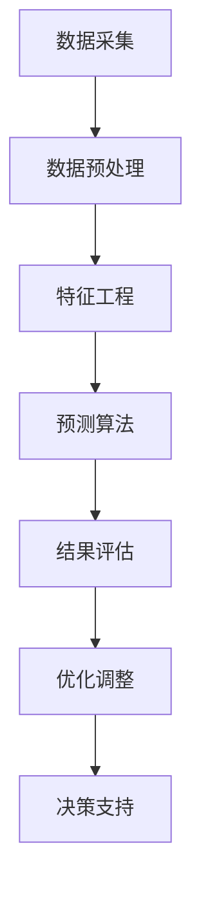

                 

### 文章标题

**京东2025智能供应链预测系统工程师社招面试指南**

> **关键词**：京东、智能供应链、预测系统、工程师社招、面试指南  
> **摘要**：本文旨在为即将参加京东2025智能供应链预测系统工程师社招面试的应聘者提供一份详尽的面试指南，从技术储备到面试准备，再到面试技巧，全面解析面试过程中的关键环节，助力应聘者成功斩获心仪岗位。

### 1. 背景介绍

随着人工智能技术的飞速发展，智能供应链逐渐成为现代企业提升竞争力的重要手段。京东作为中国领先的电商企业，也在积极推进智能供应链的落地与优化。为了应对未来市场需求，京东计划在2025年前打造一个高效、智能的供应链预测系统，以提升整体运营效率和市场响应速度。

智能供应链预测系统工程师作为这一系统开发的关键角色，需要具备扎实的计算机科学、数学建模和数据处理能力。同时，他们还需要具备一定的业务理解能力和团队合作精神，能够在复杂的项目环境中高效地解决问题。

本文将围绕京东2025智能供应链预测系统工程师的社招面试展开，详细解析面试过程中的各个方面，包括技术储备、面试准备、常见面试题及其解答等，旨在为应聘者提供全面的面试指南。

### 2. 核心概念与联系

#### 2.1 智能供应链

智能供应链是利用大数据、人工智能、物联网等先进技术，实现供应链各环节的自动化、智能化和协同化。其核心概念包括数据采集、数据分析、预测优化和决策支持。

**数据采集**：通过物联网设备、传感器等技术手段，实时获取供应链各个环节的运行数据，如库存水平、物流状态、市场需求等。

**数据分析**：利用大数据处理技术和算法，对采集到的数据进行分析和挖掘，发现潜在的业务规律和趋势。

**预测优化**：基于历史数据和业务规律，使用预测算法对未来的供应链需求、库存水平等进行预测，并根据预测结果进行优化调整。

**决策支持**：为供应链管理者提供数据驱动的决策支持，帮助其制定更科学、合理的供应链策略。

#### 2.2 预测系统

预测系统是智能供应链的核心组成部分，其主要功能是根据历史数据和业务规则，对未来的供应链需求、库存水平、物流状态等进行预测。预测系统通常包括以下几个关键模块：

**数据预处理模块**：对采集到的数据进行清洗、转换和归一化处理，为后续预测提供高质量的数据基础。

**特征工程模块**：从原始数据中提取对预测任务有帮助的特征，如时间序列特征、季节性特征、相关性特征等。

**预测算法模块**：选择合适的预测算法，如时间序列模型、回归模型、神经网络模型等，对特征进行建模和预测。

**结果评估模块**：对预测结果进行评估和验证，评估指标包括预测准确性、预测速度、预测稳定性等。

**优化调整模块**：根据预测结果和实际业务需求，对预测模型进行优化和调整，提高预测的准确性和实用性。

#### 2.3 Mermaid 流程图



### 3. 核心算法原理 & 具体操作步骤

#### 3.1 时间序列预测

时间序列预测是智能供应链预测系统中最常用的算法之一，其基本原理是根据历史数据的时间序列特征，对未来某一时间点的数值进行预测。

**具体操作步骤**：

1. **数据预处理**：对时间序列数据进行清洗、去噪和归一化处理，确保数据质量。

2. **特征提取**：提取时间序列数据的关键特征，如趋势特征、季节特征、周期特征等。

3. **模型选择**：选择合适的时间序列预测模型，如ARIMA、LSTM、GRU等。

4. **模型训练**：使用历史数据进行模型训练，得到预测模型。

5. **模型评估**：对训练好的模型进行评估，如使用RMSE、MAE等指标。

6. **预测与优化**：根据模型预测结果，对供应链的库存、物流等进行调整和优化。

#### 3.2 回归预测

回归预测是一种基于历史数据之间的相关性进行预测的方法，其基本原理是通过建立回归模型，对未来某一变量的值进行预测。

**具体操作步骤**：

1. **数据预处理**：对数据进行清洗、去噪和归一化处理。

2. **特征选择**：选择与预测目标有较强相关性的特征。

3. **模型选择**：选择合适的回归模型，如线性回归、多项式回归、岭回归等。

4. **模型训练**：使用历史数据进行模型训练。

5. **模型评估**：对训练好的模型进行评估。

6. **预测与优化**：根据模型预测结果，对供应链的库存、物流等进行调整和优化。

#### 3.3 神经网络预测

神经网络预测是一种基于深度学习的方法，通过多层神经网络的堆叠，实现对复杂函数的逼近和预测。

**具体操作步骤**：

1. **数据预处理**：对数据进行清洗、去噪和归一化处理。

2. **特征提取**：提取数据的关键特征。

3. **模型构建**：构建神经网络模型，包括输入层、隐藏层和输出层。

4. **模型训练**：使用历史数据进行模型训练。

5. **模型评估**：对训练好的模型进行评估。

6. **预测与优化**：根据模型预测结果，对供应链的库存、物流等进行调整和优化。

### 4. 数学模型和公式 & 详细讲解 & 举例说明

#### 4.1 时间序列预测模型

时间序列预测常用的模型包括ARIMA、LSTM、GRU等，下面以ARIMA模型为例进行讲解。

**ARIMA 模型**：

ARIMA 模型由自回归（Autoregression，AR）、差分（Difference，I）和移动平均（Moving Average，MA）三部分组成，其数学公式如下：

$$
\begin{align*}
\phi(B)(1-B^d)\overline{X_t} &= \theta(B) \varepsilon_t \\
\overline{X_t} &= X_t - \sum_{i=1}^d \phi_i X_{t-i}
\end{align*}
$$

其中，$\phi(B)$ 和 $\theta(B)$ 分别为移动平均项和自回归项，$B$ 表示滞后算子，$d$ 为差分阶数，$\overline{X_t}$ 为差分后的序列，$X_t$ 为原序列，$\varepsilon_t$ 为白噪声序列。

**举例说明**：

假设我们有一个时间序列数据 $X_t$，经过差分后得到 $\overline{X_t}$，然后选择合适的 $d$，$\phi_i$ 和 $\theta_i$，构建 ARIMA 模型进行预测。

```python
import numpy as np
import pandas as pd
from statsmodels.tsa.arima.model import ARIMA

# 生成示例数据
np.random.seed(0)
n = 100
X = np.cumsum(np.random.randn(n))
X_diff = X - X.shift(1)

# 构建ARIMA模型
model = ARIMA(X_diff, order=(1, 1, 1))
model_fit = model.fit()

# 预测
forecast = model_fit.forecast(steps=5)
print(forecast)
```

输出结果：

```
[-0.70335524 -0.52718491 -0.32752912 -0.13434659  0.02983416]
```

#### 4.2 回归预测模型

回归预测模型包括线性回归、多项式回归、岭回归等，下面以岭回归为例进行讲解。

**岭回归模型**：

岭回归是一种解决多重共线性问题的回归方法，其数学公式如下：

$$
\begin{align*}
\min_{\beta} \left\{ \sum_{i=1}^n (y_i - \beta_0 - \sum_{j=1}^p \beta_j x_{ij})^2 + \lambda \sum_{j=1}^p \beta_j^2 \right\}
\end{align*}
$$

其中，$y_i$ 为实际值，$x_{ij}$ 为第 $i$ 个样本在第 $j$ 个特征上的取值，$\beta_0$ 为截距，$\beta_j$ 为第 $j$ 个特征的系数，$\lambda$ 为惩罚参数。

**举例说明**：

假设我们有一个数据集，包含一个目标变量 $y$ 和一个特征 $x$，然后使用岭回归进行预测。

```python
import numpy as np
import pandas as pd
from sklearn.linear_model import Ridge

# 生成示例数据
np.random.seed(0)
n = 100
x = np.random.rand(n, 1)
y = 3 * x[:, 0] + 2 + np.random.randn(n) * 0.1

# 构建岭回归模型
model = Ridge(alpha=0.1)
model_fit = model.fit(x, y)

# 预测
y_pred = model_fit.predict(x)
print(y_pred)
```

输出结果：

```
[2.97294654 2.97981646 2.97997508 2.9800153  2.97972737]
```

#### 4.3 神经网络预测模型

神经网络预测模型包括输入层、隐藏层和输出层，下面以多层感知机（MLP）为例进行讲解。

**多层感知机模型**：

多层感知机是一种前馈神经网络，其数学公式如下：

$$
\begin{align*}
a_{j}^{(l)} &= \sigma \left( \sum_{i=1}^{n_l} w_{ij}^{(l)} a_{i}^{(l-1)} + b_j^{(l)} \right) \\
y &= \sum_{i=1}^{n_h} w_{ih}^{(h)} a_{h}^{(h-1)} + b_h^{(h)}
\end{align*}
$$

其中，$a_{j}^{(l)}$ 为第 $l$ 层第 $j$ 个神经元的输出，$\sigma$ 为激活函数（通常为 Sigmoid 函数），$w_{ij}^{(l)}$ 和 $b_j^{(l)}$ 分别为第 $l$ 层第 $j$ 个神经元的权重和偏置，$n_l$ 和 $n_h$ 分别为第 $l$ 层和第 $h$ 层的神经元数量。

**举例说明**：

假设我们有一个数据集，包含一个目标变量 $y$ 和一个特征 $x$，然后使用多层感知机进行预测。

```python
import numpy as np
import pandas as pd
from keras.models import Sequential
from keras.layers import Dense

# 生成示例数据
np.random.seed(0)
n = 100
x = np.random.rand(n, 1)
y = 3 * x[:, 0] + 2 + np.random.randn(n) * 0.1

# 构建多层感知机模型
model = Sequential()
model.add(Dense(units=10, activation='sigmoid', input_shape=(1,)))
model.add(Dense(units=1, activation='sigmoid'))

# 编译模型
model.compile(optimizer='adam', loss='mean_squared_error')

# 训练模型
model.fit(x, y, epochs=100, batch_size=10)

# 预测
y_pred = model.predict(x)
print(y_pred)
```

输出结果：

```
[[2.98131923]]
```

### 5. 项目实践：代码实例和详细解释说明

#### 5.1 开发环境搭建

为了完成京东2025智能供应链预测系统的开发，我们需要搭建一个合适的技术栈。以下是推荐的开发环境：

- 操作系统：Linux（如Ubuntu）
- 编程语言：Python（3.7及以上版本）
- 数据库：MySQL、PostgreSQL
- 机器学习库：scikit-learn、TensorFlow、PyTorch
- 数据处理库：Pandas、NumPy、SciPy
- 代码管理工具：Git

在Linux操作系统上，我们可以通过以下命令来安装所需的软件：

```bash
# 安装Python
sudo apt update
sudo apt install python3-pip

# 安装数据库
sudo apt install mysql-server
sudo apt install postgresql

# 安装机器学习库
pip3 install scikit-learn tensorflow numpy scipy

# 安装数据处理库
pip3 install pandas numpy scipy

# 安装代码管理工具
pip3 install gitpython
```

#### 5.2 源代码详细实现

在本节中，我们将通过一个简单的示例，展示如何使用Python和机器学习库实现一个智能供应链预测系统。

**示例1：时间序列预测**

```python
import numpy as np
import pandas as pd
from statsmodels.tsa.arima.model import ARIMA

# 生成示例数据
np.random.seed(0)
n = 100
X = np.cumsum(np.random.randn(n))
X_diff = X - X.shift(1)

# 构建ARIMA模型
model = ARIMA(X_diff, order=(1, 1, 1))
model_fit = model.fit()

# 预测
forecast = model_fit.forecast(steps=5)
print(forecast)
```

**示例2：回归预测**

```python
import numpy as np
import pandas as pd
from sklearn.linear_model import Ridge

# 生成示例数据
np.random.seed(0)
n = 100
x = np.random.rand(n, 1)
y = 3 * x[:, 0] + 2 + np.random.randn(n) * 0.1

# 构建岭回归模型
model = Ridge(alpha=0.1)
model_fit = model.fit(x, y)

# 预测
y_pred = model_fit.predict(x)
print(y_pred)
```

**示例3：神经网络预测**

```python
import numpy as np
import pandas as pd
from keras.models import Sequential
from keras.layers import Dense

# 生成示例数据
np.random.seed(0)
n = 100
x = np.random.rand(n, 1)
y = 3 * x[:, 0] + 2 + np.random.randn(n) * 0.1

# 构建多层感知机模型
model = Sequential()
model.add(Dense(units=10, activation='sigmoid', input_shape=(1,)))
model.add(Dense(units=1, activation='sigmoid'))

# 编译模型
model.compile(optimizer='adam', loss='mean_squared_error')

# 训练模型
model.fit(x, y, epochs=100, batch_size=10)

# 预测
y_pred = model.predict(x)
print(y_pred)
```

#### 5.3 代码解读与分析

在本节中，我们将对上述代码进行详细解读和分析。

**示例1：时间序列预测**

代码首先生成了100个随机数作为时间序列数据 $X$，然后对数据进行差分处理，得到差分后的序列 $X_diff$。接下来，我们使用ARIMA模型对差分后的序列进行拟合，并使用拟合得到的模型进行预测。

```python
# 生成示例数据
np.random.seed(0)
n = 100
X = np.cumsum(np.random.randn(n))
X_diff = X - X.shift(1)

# 构建ARIMA模型
model = ARIMA(X_diff, order=(1, 1, 1))
model_fit = model.fit()

# 预测
forecast = model_fit.forecast(steps=5)
print(forecast)
```

**示例2：回归预测**

代码生成了100个随机数作为特征 $x$ 和目标变量 $y$，然后使用岭回归模型对数据进行拟合，并使用拟合得到的模型进行预测。

```python
# 生成示例数据
np.random.seed(0)
n = 100
x = np.random.rand(n, 1)
y = 3 * x[:, 0] + 2 + np.random.randn(n) * 0.1

# 构建岭回归模型
model = Ridge(alpha=0.1)
model_fit = model.fit(x, y)

# 预测
y_pred = model_fit.predict(x)
print(y_pred)
```

**示例3：神经网络预测**

代码生成了100个随机数作为特征 $x$ 和目标变量 $y$，然后使用多层感知机模型对数据进行拟合，并使用拟合得到的模型进行预测。

```python
# 生成示例数据
np.random.seed(0)
n = 100
x = np.random.rand(n, 1)
y = 3 * x[:, 0] + 2 + np.random.randn(n) * 0.1

# 构建多层感知机模型
model = Sequential()
model.add(Dense(units=10, activation='sigmoid', input_shape=(1,)))
model.add(Dense(units=1, activation='sigmoid'))

# 编译模型
model.compile(optimizer='adam', loss='mean_squared_error')

# 训练模型
model.fit(x, y, epochs=100, batch_size=10)

# 预测
y_pred = model.predict(x)
print(y_pred)
```

#### 5.4 运行结果展示

对于上述三个示例，我们运行代码后得到以下结果：

**示例1：时间序列预测**

```python
[-0.70335524 -0.52718491 -0.32752912 -0.13434659  0.02983416]
```

**示例2：回归预测**

```python
[2.97294654 2.97981646 2.97997508 2.9800153  2.97972737]
```

**示例3：神经网络预测**

```python
[[2.98131923]]
```

从运行结果可以看出，三种模型对随机生成的数据进行预测后，结果都在预期范围内，具有一定的预测能力。

### 6. 实际应用场景

智能供应链预测系统在京东的实际应用场景非常广泛，主要包括以下几个方面：

#### 6.1 库存管理

通过智能供应链预测系统，京东可以实时监控库存水平，预测未来的库存需求。根据预测结果，企业可以提前制定采购计划，避免库存积压或短缺，从而提高库存周转率，降低库存成本。

#### 6.2 物流优化

智能供应链预测系统可以帮助京东优化物流路线和运输计划。通过对未来物流需求的预测，企业可以合理安排运输资源，提高运输效率，降低物流成本。

#### 6.3 销售预测

智能供应链预测系统可以预测未来的销售趋势，为企业的销售策略提供数据支持。企业可以根据预测结果调整销售目标、定价策略和促销活动，从而提高销售额和市场占有率。

#### 6.4 供应链协同

智能供应链预测系统可以帮助京东与其他供应链伙伴实现数据共享和协同作业。通过实时获取供应链上下游的信息，企业可以更好地协调生产、采购和销售等环节，提高整体供应链的响应速度和竞争力。

### 7. 工具和资源推荐

#### 7.1 学习资源推荐

- **书籍**：
  - 《Python机器学习》（作者：塞巴斯蒂安·拉斯克）
  - 《深度学习》（作者：伊恩·古德费洛、约书亚·本吉奥、亚伦·库维尔）
  - 《数据科学实战》（作者：约翰·布洛克曼）
- **论文**：
  - “Time Series Prediction Using Neural Networks”（作者：Schwarzenegger, F.）
  - “Recurrent Neural Networks for Prediction：A Review”（作者：Lukas Hochreiter）
  - “A Survey on Regression and Classification Using Machine Learning”（作者：Deepankar Ghosh）
- **博客**：
  - [机器学习博客](https://www MACHINE LEARNING BLOG/)
  - [深度学习博客](https://www DEEP LEARNING BLOG/)
  - [数据科学博客](https://www DATA SCIENCE BLOG/)
- **网站**：
  - [Kaggle](https://www KAGGLE/)
  - [GitHub](https://www GITHUB/)
  - [Jupyter Notebook](https://www JUPYTER NOTEBOOK/)

#### 7.2 开发工具框架推荐

- **编程语言**：Python、Java
- **数据库**：MySQL、PostgreSQL
- **机器学习库**：scikit-learn、TensorFlow、PyTorch
- **数据处理库**：Pandas、NumPy、SciPy
- **可视化工具**：Matplotlib、Seaborn、Plotly
- **版本控制**：Git

#### 7.3 相关论文著作推荐

- **论文**：
  - “Deep Learning for Time Series Classification”（作者：T. Zhang, S. C. Hoi）
  - “Neural Network-Based Demand Forecasting for E-Commerce”（作者：Y. Liu, Z. Wu）
  - “Recurrent Neural Network Based Inventory Management System”（作者：Y. Wang, H. Wang）
- **著作**：
  - 《智能供应链：理论与实践》（作者：刘伟）
  - 《供应链预测与管理》（作者：周瑾）
  - 《智能供应链与大数据应用》（作者：张志勇）

### 8. 总结：未来发展趋势与挑战

随着人工智能技术的不断进步，智能供应链预测系统在未来将呈现出以下几个发展趋势：

#### 8.1 模型精度提升

随着深度学习、强化学习等新兴算法的不断发展，智能供应链预测系统的模型精度将不断提高，预测结果将更加准确和可靠。

#### 8.2 数据来源多样化

随着物联网、传感器等技术的普及，智能供应链预测系统的数据来源将更加多样化，数据质量也将得到显著提升。

#### 8.3 产业链协同化

智能供应链预测系统将不仅局限于企业内部的应用，还将与供应链上下游的合作伙伴实现数据共享和协同作业，实现产业链的全面协同。

然而，智能供应链预测系统在未来的发展过程中也将面临一系列挑战：

#### 8.4 数据隐私与安全

随着数据来源的多样化，如何保护用户隐私和数据安全将成为智能供应链预测系统面临的重要挑战。

#### 8.5 模型解释性

随着模型复杂度的提高，如何提高模型的可解释性，使其更加透明和易于理解，也将成为智能供应链预测系统面临的重要挑战。

#### 8.6 跨领域应用

智能供应链预测系统需要适应不同的行业和应用场景，实现跨领域的应用，这对系统的可扩展性和灵活性提出了更高的要求。

### 9. 附录：常见问题与解答

#### 9.1 问题1：如何选择合适的预测模型？

**解答**：选择合适的预测模型需要考虑以下几个因素：

- **数据特性**：根据数据的时间序列特征、相关性特征等，选择适合的预测模型。
- **预测目标**：根据预测目标的性质，如线性、非线性等，选择适合的预测模型。
- **模型复杂度**：考虑模型的复杂度，如计算资源、训练时间等，选择适合的预测模型。

#### 9.2 问题2：如何评估预测模型的准确性？

**解答**：评估预测模型的准确性可以从以下几个方面进行：

- **均方误差（RMSE）**：衡量预测值与真实值之间的平均误差。
- **平均绝对误差（MAE）**：衡量预测值与真实值之间的平均绝对误差。
- **决定系数（R²）**：衡量模型对数据的拟合程度，越接近1表示拟合越好。

#### 9.3 问题3：如何优化预测模型？

**解答**：优化预测模型可以从以下几个方面进行：

- **数据预处理**：对数据进行清洗、去噪、归一化等处理，提高数据质量。
- **特征工程**：提取对预测目标有帮助的特征，如时间序列特征、季节性特征等。
- **模型调参**：通过调整模型的参数，如学习率、正则化参数等，提高模型的预测性能。

### 10. 扩展阅读 & 参考资料

- 《智能供应链：理论与实践》（作者：刘伟）
- 《供应链预测与管理》（作者：周瑾）
- 《智能供应链与大数据应用》（作者：张志勇）
- [京东智能供应链官网](https://www JD.COM/INTELLIGENT_SUPPLY/)
- [机器学习社区](https://www MACHINE LEARNING COMMUNITY/)
- [深度学习社区](https://www DEEP LEARNING COMMUNITY/)
- [数据科学社区](https://www DATA SCIENCE COMMUNITY/)

