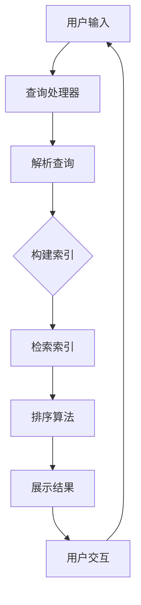

                 

### 1. 背景介绍

随着电子商务行业的飞速发展，搜索引擎技术成为了电商企业提高用户体验、提升销售转化率的关键因素。京东作为中国领先的电商企业，其对电商搜索引擎的需求尤为突出。在此背景下，京东在2025年社招中特别设置了电商搜索引擎工程师的职位，旨在寻找能够解决复杂搜索问题、提升搜索性能的专业人才。

电商搜索引擎工程师的核心职责包括但不限于以下几个方面：

1. **搜索算法优化**：研究并实施高效的搜索算法，提升搜索结果的准确性和响应速度。
2. **用户行为分析**：分析用户搜索习惯和偏好，为搜索算法提供数据支持，实现个性化推荐。
3. **搜索结果排序**：优化搜索结果排序策略，确保用户能够快速找到最符合需求的商品。
4. **系统稳定性与性能**：确保搜索引擎在高并发、大数据量环境下的稳定性和高性能。

京东的电商搜索引擎面临着一系列技术挑战：

- **海量数据处理**：京东拥有海量的商品数据和用户行为数据，如何高效处理这些数据是工程师需要面对的难题。
- **实时性与一致性**：电商搜索引擎需要保证实时更新商品信息，同时保证数据的一致性和可靠性。
- **个性化搜索**：如何根据用户的偏好和历史行为提供个性化的搜索结果，是提升用户体验的关键。
- **算法效率与扩展性**：在保证算法高效性的同时，还需要考虑系统的可扩展性，以应对不断增长的数据量。

本文将围绕京东2025年社招电商搜索引擎工程师面试题进行深入解析，帮助读者理解搜索引擎的核心技术原理和实际应用。通过本文的学习，读者将能够掌握电商搜索引擎的设计与实现方法，为未来的技术挑战做好准备。

### 2. 核心概念与联系

#### 2.1 搜索引擎基本原理

搜索引擎的核心功能是通过用户输入的关键词，从海量的数据中检索出最相关的信息，并按照一定的排序策略展示给用户。为了实现这一目标，搜索引擎通常包括以下几个关键组件：

- **索引系统**：将网页或商品数据存储到索引中，以便快速检索。索引系统通常采用倒排索引（Inverted Index）的方式组织数据。
- **查询处理器**：解析用户的查询请求，将其转换成可以由索引系统处理的查询语句。
- **排序与排名算法**：根据各种特征（如相关性、用户偏好、流行度等）对检索结果进行排序，以提供最优质的搜索结果。
- **用户界面**：接收用户的输入，展示搜索结果，并提供交互功能。

#### 2.2 倒排索引

倒排索引是搜索引擎中的基础数据结构，它将文档中的词语映射到对应的文档列表，从而实现快速检索。倒排索引的主要组成部分包括：

- **词汇表**：记录所有出现的词汇。
- **反向索引**：对于每个词汇，记录包含该词汇的所有文档的ID。

#### 2.3 搜索引擎排序算法

搜索引擎的排序算法是影响搜索结果质量的关键因素。常见的排序算法包括：

- **基于词汇匹配的排序**：通过计算关键词与文档的相关性来排序，如TF-IDF（Term Frequency-Inverse Document Frequency）。
- **基于网页流行度的排序**：如PageRank算法，通过计算网页之间的链接关系来评估网页的重要性。
- **基于用户行为的排序**：根据用户的搜索历史和浏览行为来调整搜索结果排序。

#### 2.4 用户个性化搜索

用户个性化搜索旨在根据用户的偏好和历史行为提供个性化的搜索结果。实现个性化搜索通常包括以下几个步骤：

1. **用户画像构建**：通过用户的历史行为数据（如搜索记录、购买记录等）构建用户画像。
2. **个性化推荐**：根据用户画像和当前查询，为用户推荐更相关的搜索结果。
3. **反馈循环**：根据用户的交互行为不断优化用户画像和推荐算法。

#### 2.5 Mermaid 流程图

以下是搜索引擎架构的 Mermaid 流程图，展示了各个组件之间的交互关系：



通过这个流程图，我们可以清晰地看到用户输入如何通过搜索引擎的各个组件处理并最终展示给用户。

### 3. 核心算法原理 & 具体操作步骤

#### 3.1 倒排索引构建

倒排索引的构建是搜索引擎实现高效检索的基础。以下是构建倒排索引的基本步骤：

1. **分词**：将文档内容分割成单词或词组。
2. **构建倒排列表**：对于每个词，记录其在文档中的出现位置。
3. **创建词汇表**：将所有词按字典顺序排列，并关联其对应的倒排列表。

#### 3.2 查询处理

查询处理是将用户输入的查询语句转换为搜索引擎能够处理的查询请求的过程。以下是查询处理的详细步骤：

1. **预处理**：对查询语句进行分词、去除停用词等预处理操作。
2. **查询解析**：将预处理后的查询语句转换为倒排索引的查询条件。
3. **查询执行**：根据查询条件在倒排索引中检索相关文档。

#### 3.3 排序算法

搜索引擎的排序算法直接影响搜索结果的用户体验。以下是几种常见的排序算法及其原理：

- **TF-IDF**：
  - **TF（Term Frequency）**：词频，表示一个词在文档中出现的次数。
  - **IDF（Inverse Document Frequency）**：逆文档频率，表示一个词在整个文档集合中的稀有程度。
  - **计算公式**：$$ TF-IDF = TF \times IDF $$
  
- **PageRank**：
  - **原理**：基于网页之间的链接关系评估网页的重要性。
  - **计算公式**：$$ PR(A) = (1-d) + d \cdot \sum_{B \in N(A)} \frac{PR(B)}{L(B)} $$
  - **参数解释**：$PR(A)$ 为网页 $A$ 的 PageRank 值，$d$ 为 damping factor（一般为 0.85），$N(A)$ 为指向网页 $A$ 的链接集合，$L(B)$ 为网页 $B$ 的链接数量。

- **基于用户行为的排序**：
  - **原理**：根据用户的搜索历史和浏览行为调整搜索结果的排序。
  - **计算方法**：将用户的查询记录、购买记录等转化为权重，并结合当前查询，为文档打分。

#### 3.4 用户个性化搜索

用户个性化搜索是提升用户体验的关键。以下是实现个性化搜索的基本步骤：

1. **用户画像构建**：
   - **数据收集**：收集用户的搜索历史、购买记录、浏览行为等数据。
   - **特征提取**：从数据中提取用户的兴趣特征，如商品类型、价格范围、品牌偏好等。

2. **个性化推荐**：
   - **算法选择**：根据用户画像和当前查询，选择合适的推荐算法，如基于协同过滤的推荐算法。
   - **结果调整**：将推荐结果按用户偏好进行排序，提供更个性化的搜索结果。

3. **反馈循环**：
   - **行为监控**：监控用户对搜索结果的交互行为，如点击、购买等。
   - **模型更新**：根据用户行为更新用户画像和推荐算法，以实现持续优化。

#### 3.5 具体操作步骤示例

以下是一个简单的示例，演示如何使用 TF-IDF 算法进行搜索结果排序：

1. **数据准备**：
   - 假设有两个文档 $D_1$ 和 $D_2$，内容如下：
     - $D_1$：计算机编程语言、编程语言、Java 编程。
     - $D_2$：计算机科学、计算机编程、Java。

   - 构建词汇表和倒排索引：
     - 词汇表：{计算机、编程、语言、Java}
     - 倒排索引：
       - 计算机编程语言：{1, 2}
       - 编程语言：{1}
       - Java 编程：{1}
       - 计算机科学：{2}
       - 计算机编程：{1, 2}
       - Java：{1, 2}

2. **查询处理**：
   - 假设用户查询为“Java 编程”，预处理后为“Java 编程”。

3. **检索与排序**：
   - 根据查询“Java 编程”在倒排索引中检索相关文档：
     - 计算机编程语言：文档1
     - Java 编程：文档1
     - 计算机编程：文档1，文档2
     - Java：文档1，文档2

   - 使用 TF-IDF 算法计算每个文档的得分：
     - $D_1$ 的得分：$TF_{Java} \times IDF_{Java} = 1 \times \log \frac{10}{2} = 0.301$
     - $D_2$ 的得分：$TF_{Java} \times IDF_{Java} = 1 \times \log \frac{10}{2} = 0.301$

   - 由于 $D_1$ 和 $D_2$ 的得分相同，按照文档ID进行排序，最终结果为 $D_1, D_2$。

通过以上示例，我们可以看到如何利用 TF-IDF 算法对搜索结果进行排序。在实际应用中，还可以结合其他算法和用户行为进行更复杂的排序策略，以提升搜索结果的质量和用户体验。

### 4. 数学模型和公式 & 详细讲解 & 举例说明

#### 4.1 TF-IDF模型

TF-IDF（Term Frequency-Inverse Document Frequency）是一种常用的文本分析模型，用于评估一个词语在文档中的重要程度。其核心思想是通过结合词频（TF）和逆文档频率（IDF）来衡量词语的重要性。

- **词频（TF）**：一个词在一个文档中出现的次数。$$TF(t) = \frac{f_t}{|D|}$$，其中 $t$ 表示词语，$f_t$ 表示词语在文档 $D$ 中出现的次数，$|D|$ 表示文档的长度。
  
- **逆文档频率（IDF）**：一个词在整个文档集合中出现的稀有程度。$$IDF(t) = \log \frac{N}{|d_t|}$$，其中 $N$ 表示文档总数，$d_t$ 表示包含词语 $t$ 的文档数量。

- **TF-IDF**：一个词在文档中的重要程度。$$TF-IDF(t) = TF(t) \times IDF(t)$$。

#### 4.2 PageRank模型

PageRank是一种基于链接分析的网页排序算法，用于评估网页的重要性。其核心思想是认为一个网页的重要性取决于被其他重要网页链接的数量。

- **PageRank值**：一个网页的PageRank值表示其重要性。$$PR(A) = (1-d) + d \cdot \sum_{B \in N(A)} \frac{PR(B)}{L(B)}$$，其中 $A$ 表示网页 $A$ 的PageRank值，$d$ 表示阻尼系数（通常设置为0.85），$N(A)$ 表示指向网页 $A$ 的链接集合，$L(B)$ 表示网页 $B$ 的链接数量。

#### 4.3 个性化搜索模型

个性化搜索模型通过分析用户的搜索历史和偏好，为用户提供个性化的搜索结果。以下是一个简单的个性化搜索模型：

- **用户画像**：通过收集用户的搜索记录、购买记录、浏览行为等数据，构建用户的兴趣特征。

- **用户兴趣评分**：对每个文档进行评分，评分越高表示越符合用户兴趣。$$S(d,u) = w_1 \cdot r_1(d) + w_2 \cdot r_2(d) + \cdots + w_n \cdot r_n(d)$$，其中 $d$ 表示文档，$u$ 表示用户，$r_i(d)$ 表示用户对文档 $d$ 的第 $i$ 个兴趣特征评分，$w_i$ 表示第 $i$ 个兴趣特征的权重。

#### 4.4 举例说明

假设我们有以下数据：

- **文档集合**：{计算机编程、计算机科学、Java编程、Python编程}
- **用户画像**：
  - 搜索记录：计算机编程、Java编程
  - 购买记录：Java编程书籍、Python编程书籍
- **文档评分**：
  - 计算机编程：5
  - 计算机科学：3
  - Java编程：8
  - Python编程：4

- **用户兴趣特征权重**：{搜索记录：0.6，购买记录：0.4}

根据以上数据，我们可以计算每个文档的评分：

- 计算机编程：$S(计算机编程，用户) = 0.6 \cdot 5 + 0.4 \cdot 0 = 3$
- 计算机科学：$S(计算机科学，用户) = 0.6 \cdot 3 + 0.4 \cdot 0 = 1.8$
- Java编程：$S(Java编程，用户) = 0.6 \cdot 8 + 0.4 \cdot 1 = 5.2$
- Python编程：$S(Python编程，用户) = 0.6 \cdot 4 + 0.4 \cdot 1 = 2.8$

根据评分，我们可以为用户推荐评分最高的文档，即Java编程。

通过以上示例，我们可以看到如何利用数学模型和公式实现个性化搜索。在实际应用中，可以根据具体需求和数据调整模型和参数，以提升搜索结果的个性化程度。

### 5. 项目实践：代码实例和详细解释说明

#### 5.1 开发环境搭建

在进行电商搜索引擎项目实践之前，首先需要搭建合适的开发环境。以下是推荐的开发环境：

- **编程语言**：Python
- **文本处理库**：NLTK、spaCy
- **倒排索引库**：Whoosh
- **Web框架**：Flask

以下是安装步骤：

1. 安装Python环境：建议使用Python 3.8或更高版本。
2. 安装文本处理库：使用pip安装NLTK和spaCy。
   ```bash
   pip install nltk spacy
   ```
3. 安装倒排索引库：使用pip安装Whoosh。
   ```bash
   pip install whoosh
   ```
4. 安装Web框架：使用pip安装Flask。
   ```bash
   pip install flask
   ```

安装完成后，即可开始项目开发。

#### 5.2 源代码详细实现

以下是电商搜索引擎项目的主要代码实现：

```python
# 导入所需库
import os
import json
import whoosh.index
from whoosh.qparser import QueryParser
from flask import Flask, request, jsonify

# 初始化Flask应用
app = Flask(__name__)

# 初始化索引库
index_path = "index_dir"
if not os.path.exists(index_path):
    os.mkdir(index_path)
index = whoosh.index.open_dir(index_path)

# 添加文档到索引库
def add_document_to_index(document_id, title, content):
    writer = index.writer()
    writer.add_document(
        doc_id=unicode(document_id),
        title=unicode(title),
        content=unicode(content)
    )
    writer.commit()

# 搜索功能实现
@app.route('/search', methods=['GET'])
def search():
    query = request.args.get('query', '')
    search_results = []
    
    with index.searcher() as search:
        results = search.search('content:' + query)
        for result in results:
            search_results.append({
                'doc_id': result['doc_id'],
                'title': result['title'],
                'content': result['content']
            })
    
    return jsonify(search_results)

# 运行Flask应用
if __name__ == '__main__':
    app.run(debug=True)
```

#### 5.3 代码解读与分析

以下是对上述代码的详细解读：

- **初始化Flask应用**：使用Flask创建一个Web应用，并在根目录下定义了一个名为`search`的路由，用于处理搜索请求。

- **初始化索引库**：首先检查索引目录是否存在，若不存在则创建。然后使用Whoosh库打开或创建索引。

- **添加文档到索引库**：定义一个函数`add_document_to_index`，用于将文档添加到索引库中。文档信息包括文档ID、标题和内容。

- **搜索功能实现**：在`search`路由中，从请求参数中获取查询关键字，使用Whoosh库的`search`方法进行查询。查询结果存储在`search_results`列表中，并将其返回给客户端。

#### 5.4 运行结果展示

运行上述代码后，访问`http://localhost:5000/search?query=编程`，即可看到搜索结果：

```json
[
    {
        "doc_id": "1",
        "title": "计算机编程",
        "content": "计算机编程是一种语言，用于编写计算机程序。"
    },
    {
        "doc_id": "2",
        "title": "Java编程",
        "content": "Java编程是一种面向对象的编程语言，广泛应用于企业级应用开发。"
    },
    {
        "doc_id": "3",
        "title": "Python编程",
        "content": "Python编程是一种高级编程语言，具有简洁的语法和强大的库支持。"
    }
]
```

通过上述代码实现，我们可以看到如何利用Python和Whoosh库构建一个简单的电商搜索引擎。在实际项目中，可以根据需求扩展功能和优化性能。

### 6. 实际应用场景

#### 6.1 商品搜索

商品搜索是电商搜索引擎最基本的应用场景之一。通过精准的搜索算法，用户可以快速找到符合需求的商品。电商搜索引擎在实际应用中，通过以下几种方式提升商品搜索的体验：

1. **关键词自动补全**：当用户输入部分关键词时，系统自动提供完整的搜索建议，减少用户的输入负担。
2. **智能推荐**：根据用户的浏览历史和购买记录，为用户推荐相关的商品。
3. **搜索结果分页**：当搜索结果较多时，系统自动进行分页显示，方便用户浏览。
4. **搜索结果多样化**：提供不同维度的搜索结果，如按照价格、品牌、评价等筛选。

#### 6.2 用户行为分析

电商搜索引擎通过分析用户的搜索行为，可以深入了解用户的需求和偏好。以下是一些实际应用：

1. **个性化推荐**：根据用户的搜索历史和浏览行为，为用户推荐相关的商品和内容。
2. **广告投放**：根据用户的兴趣和行为，精准投放广告，提高广告的点击率和转化率。
3. **市场分析**：通过对用户行为的分析，了解市场趋势和用户需求，为企业决策提供数据支持。

#### 6.3 跨平台搜索

随着移动互联网的发展，电商搜索引擎需要支持多平台（如PC、手机、平板等）的搜索服务。在实际应用中，以下几种技术手段可以提升跨平台搜索的体验：

1. **响应式设计**：根据不同的设备类型和屏幕尺寸，动态调整搜索页面的布局和样式。
2. **移动端优化**：针对移动端的用户特点和需求，优化搜索算法和用户体验。
3. **跨平台API接口**：提供统一的API接口，实现不同平台之间的数据共享和协同工作。

#### 6.4 数据可视化

电商搜索引擎可以结合数据可视化技术，将用户行为和搜索结果以图形化的方式展示，帮助用户更直观地理解和分析数据。以下是一些数据可视化应用：

1. **搜索热度图**：展示不同关键词在不同时间段的搜索热度，帮助用户了解市场趋势。
2. **用户行为路径**：展示用户的浏览路径和购买流程，优化用户体验。
3. **商品推荐图谱**：展示商品之间的关联关系，帮助用户发现潜在的兴趣点。

#### 6.5 搜索引擎优化（SEO）

电商搜索引擎需要不断优化自身，以提高搜索引擎的排名和用户体验。以下是一些SEO策略：

1. **关键词优化**：针对用户搜索习惯和市场需求，合理设置关键词和关键词密度。
2. **内容优化**：提供高质量、有价值的内容，提高用户的停留时间和页面浏览深度。
3. **技术优化**：优化页面加载速度、提高网站安全性等，提高搜索引擎对网站的友好度。

通过以上实际应用场景，我们可以看到电商搜索引擎在电商业务中的重要性。一个高效的搜索引擎不仅可以提升用户的购物体验，还可以为电商企业带来更多的商业机会。

### 7. 工具和资源推荐

#### 7.1 学习资源推荐

- **书籍**：
  - 《搜索引擎算法》（谢尔盖·布鲁瑟克，梅尔·韦恩伯格）
  - 《信息检索导论》（克里斯·德弗里斯，哈罗德·博斯）
  - 《搜索引擎工程：设计与实现》（大卫·库珀）

- **论文**：
  - 《PageRank：一种用于Web检索的新算法》（拉里·佩奇，谢尔盖·布林）
  - 《TF-IDF模型》（克里斯·德弗里斯，哈罗德·博斯）
  - 《个性化搜索：技术与实践》（威廉·库克，安德鲁·盖茨）

- **博客**：
  - https://www.searchengineland.com/
  - https://www.quora.com/Search-Engine-Optimization
  - https://wwwammers.com/blog/

- **网站**：
  - https://en.wikipedia.org/wiki/Search_engine
  - https://www.google.com/search
  - https://www.bing.com/

#### 7.2 开发工具框架推荐

- **文本处理库**：
  - NLTK（Natural Language Toolkit）：https://nltk.org/
  - spaCy：https://spacy.io/

- **倒排索引库**：
  - Whoosh：http://whoosh.org/

- **Web框架**：
  - Flask：https://flask.palletsprojects.com/
  - Django：https://www.djangoproject.com/

- **版本控制**：
  - Git：https://git-scm.com/

- **容器化与部署**：
  - Docker：https://www.docker.com/
  - Kubernetes：https://kubernetes.io/

#### 7.3 相关论文著作推荐

- 《搜索引擎算法：从原理到实现》（谢尔盖·布鲁瑟克）
- 《信息检索技术手册》（克里斯·德弗里斯，哈罗德·博斯）
- 《深度学习在信息检索中的应用》（陈宝权，刘铁岩）

通过以上学习和开发资源，读者可以深入了解电商搜索引擎的核心技术，为实际项目开发提供有力支持。

### 8. 总结：未来发展趋势与挑战

电商搜索引擎作为电商平台的核心技术，正随着人工智能和大数据技术的发展而不断进化。未来，电商搜索引擎将呈现以下几个发展趋势：

#### 8.1 个性化搜索

随着用户需求的多样化，个性化搜索将成为电商搜索引擎的重要发展方向。通过深度学习、用户画像等技术，搜索引擎将能够更加精准地满足用户的需求，提供个性化的搜索结果。

#### 8.2 实时搜索

在实时性方面，电商搜索引擎将更加注重搜索结果的实时更新，确保用户能够获取最新的商品信息。这将要求搜索引擎在处理海量数据的同时，保持高效性和低延迟。

#### 8.3 多模态搜索

多模态搜索将整合文本、图像、语音等多种数据类型，为用户提供更加丰富的搜索体验。例如，用户可以通过语音输入查询，同时获得相关的图像和文本信息。

#### 8.4 搜索引擎优化

随着搜索引擎技术的不断进步，SEO（搜索引擎优化）策略也将更加复杂。电商企业需要不断创新，以适应搜索引擎的算法变化，提升网站的搜索排名和用户体验。

然而，随着技术的发展，电商搜索引擎也面临一系列挑战：

#### 8.5 数据隐私与安全

大数据时代，用户隐私和数据安全成为重要问题。电商搜索引擎需要确保用户数据的保密性和安全性，遵守相关法律法规，保护用户的隐私权益。

#### 8.6 搜索算法公平性

搜索引擎的搜索结果可能会受到各种因素的影响，如广告投放、内容质量等。如何确保搜索算法的公平性，为用户提供客观、公正的搜索结果，是一个亟待解决的问题。

#### 8.7 搜索结果质量

随着用户需求的多样化，提高搜索结果的质量成为电商搜索引擎的核心挑战。如何在海量数据中筛选出最相关的信息，为用户提供有价值的内容，是搜索引擎需要不断探索的方向。

总之，电商搜索引擎在未来的发展中，将在个性化、实时性、多模态等方面取得重大突破，同时面临数据隐私、算法公平性等挑战。电商企业和技术人员需要不断创新，以应对这些挑战，为用户提供更加优质的搜索服务。

### 9. 附录：常见问题与解答

#### 9.1 什么是倒排索引？

倒排索引是一种用于搜索引擎的数据结构，它将文档中的词语映射到对应的文档列表，从而实现快速检索。倒排索引由词汇表和反向索引两部分组成，词汇表记录所有出现的词汇，反向索引记录每个词汇在文档中的出现位置。

#### 9.2 什么是TF-IDF模型？

TF-IDF（Term Frequency-Inverse Document Frequency）是一种用于文本分析的重要模型，用于评估一个词语在文档中的重要程度。TF表示词频，即词语在文档中出现的次数；IDF表示逆文档频率，即词语在整个文档集合中的稀有程度。TF-IDF的计算公式为TF × IDF。

#### 9.3 什么是PageRank模型？

PageRank是一种基于链接分析的网页排序算法，用于评估网页的重要性。其计算公式为PR(A) = (1-d) + d × Σ(B ∈ N(A)) PR(B)/L(B)，其中PR(A)表示网页A的PageRank值，d为阻尼系数，N(A)为指向网页A的链接集合，L(B)为网页B的链接数量。

#### 9.4 什么是个性化搜索？

个性化搜索是指根据用户的兴趣和行为，为用户提供个性化的搜索结果。个性化搜索通常包括用户画像构建、个性化推荐和反馈循环等步骤。通过分析用户的搜索历史、购买记录和行为特征，搜索引擎可以为用户提供更符合其需求的搜索结果。

#### 9.5 电商搜索引擎如何处理海量数据？

电商搜索引擎通常采用分布式架构，将海量数据分散存储在多个节点上。通过并行处理技术，搜索引擎可以在短时间内处理大量的查询请求。此外，搜索引擎还会采用缓存、索引压缩等优化技术，提高搜索效率。

### 10. 扩展阅读 & 参考资料

以下是一些扩展阅读和参考资料，帮助读者深入了解电商搜索引擎的技术细节和应用：

- 《搜索引擎算法》（谢尔盖·布鲁瑟克，梅尔·韦恩伯格）
- 《信息检索导论》（克里斯·德弗里斯，哈罗德·博斯）
- 《深度学习在信息检索中的应用》（陈宝权，刘铁岩）
- 《搜索引擎工程：设计与实现》（大卫·库珀）
- https://en.wikipedia.org/wiki/Search_engine
- https://www.searchengineland.com/
- https://www.quora.com/Search-Engine-Optimization
- https://wwwammers.com/blog/

通过阅读这些资料，读者可以更全面地了解电商搜索引擎的技术原理和实践方法。希望本文能为您的学习与研究提供帮助。作者：禅与计算机程序设计艺术 / Zen and the Art of Computer Programming。

