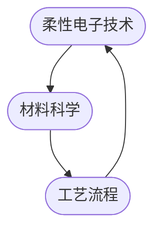

                 

### 文章标题：京东方2025柔性电子社招材料工程师面试指南

### 文章关键词：
1. 京东方
2. 柔性电子
3. 社招材料工程师
4. 面试指南
5. 技术要求
6. 职业发展
7. 招聘流程

### 文章摘要：
本文将针对京东方2025年社会招聘中材料工程师岗位的要求，从技术背景、职业发展、面试流程等多个方面提供详细的面试指南。文章将深入分析材料工程师所需掌握的核心技能和知识点，并提供实用的准备建议和面试策略，帮助读者顺利通过面试，加入世界领先的柔性电子企业——京东方。

---

### 1. 背景介绍

京东方（BOE）作为中国领先的新型显示技术企业，是全球主要的半导体显示技术、产品与服务供应商之一。随着科技的发展，柔性电子技术正逐渐成为未来显示和传感器技术的重要方向。材料工程师作为柔性电子领域的核心技术人员，承担着开发新型材料、优化工艺流程、提升产品性能等关键任务。

2025年，京东方将在全球范围内进行大规模的社会招聘，其中包括材料工程师岗位。此次招聘旨在吸引和培养具有创新精神和专业能力的优秀人才，以满足公司未来技术发展的需求。对于求职者而言，深入了解招聘要求和面试流程，提前做好充分的准备，将大大提高面试成功率。

本文将围绕以下几个关键点展开：

1. **材料工程师岗位要求**
2. **柔性电子技术背景知识**
3. **面试流程解析**
4. **面试策略与准备建议**
5. **职业发展规划**

通过以上内容的深入剖析，本文旨在为准备申请京东方材料工程师岗位的求职者提供全面的面试指南，帮助他们在面试中脱颖而出，实现职业发展目标。

---

### 2. 核心概念与联系

在探讨材料工程师的职责之前，我们需要明确几个核心概念，包括柔性电子技术、材料科学以及相关工艺流程。以下是一个简化的 Mermaid 流程图，展示了这些概念之间的联系。



#### 2.1 柔性电子技术

柔性电子技术是一种能够使电子设备实现弯曲、折叠和卷曲的新兴技术。它涉及材料、器件和系统集成等多个方面，其中材料科学是柔性电子技术的基石。柔性电子技术的特点包括：

- **柔韧性**：材料可以弯曲而不破坏其性能。
- **透明性**：部分材料具有透明特性，适用于透明显示技术。
- **可拉伸性**：材料可以拉伸至原长度的数倍而不损坏。

#### 2.2 材料科学

材料科学涉及材料的组成、结构、性质以及制造工艺等方面的研究。对于材料工程师而言，了解以下几种关键材料是非常必要的：

- **有机发光二极管（OLED）材料**：用于制造柔性显示屏，包括发光材料、电子传输材料和空穴传输材料。
- **导电高分子**：用于制造柔性电子器件，如柔性电路和触摸屏。
- **透明导电材料**：如ITO（铟锡氧化物），用于透明导电玻璃和触摸屏。

#### 2.3 工艺流程

工艺流程是材料从设计到制造的关键环节。对于材料工程师，理解以下关键工艺步骤至关重要：

- **材料合成与制备**：包括溶液法、涂覆法、气相沉积法等。
- **器件制造**：涉及器件结构的构建、电极制备和封装等。
- **性能测试**：包括电学性能、机械性能和光学性能等。

通过上述核心概念和联系的分析，我们可以更清晰地了解材料工程师所需掌握的技能和知识领域。接下来，我们将深入探讨材料工程师的具体职责和技术要求。

---

### 3. 核心算法原理 & 具体操作步骤

材料工程师在柔性电子领域中的工作涉及多种核心算法原理和应用，以下是一些关键的算法和技术，以及具体操作步骤。

#### 3.1 OLED器件结构优化算法

OLED是柔性电子显示屏的核心技术之一。优化OLED器件结构可以提高其性能，如亮度、色彩饱和度和使用寿命。以下是一个简化的优化算法步骤：

1. **材料选择**：选择适合的发光材料、电子传输材料和空穴传输材料。
   $$\text{材料选择：} \text{发光材料} + \text{电子传输材料} + \text{空穴传输材料}$$

2. **器件结构设计**：设计器件的层结构，包括发光层、电子传输层和空穴传输层。
   $$\text{器件结构设计：} \text{阳极} + \text{电子传输层} + \text{空穴传输层} + \text{发光层} + \text{阴极}$$

3. **电学性能优化**：通过模拟和实验，调整材料浓度和厚度，优化器件的电学性能。
   $$\text{电学性能优化：} \text{调整材料浓度} + \text{调整厚度}$$

4. **光学性能优化**：调整发光层的厚度和发光材料，优化器件的光学性能。
   $$\text{光学性能优化：} \text{调整发光层厚度} + \text{调整发光材料}$$

5. **寿命测试与评估**：对优化后的器件进行寿命测试，评估其性能。
   $$\text{寿命测试与评估：} \text{老化测试} + \text{亮度衰减测试}$$

#### 3.2 导电高分子材料制备算法

导电高分子材料在柔性电子器件中扮演重要角色，如柔性电路和触摸屏。以下是一个简化的导电高分子材料制备算法步骤：

1. **聚合反应**：通过自由基聚合或配位聚合方法制备导电高分子。
   $$\text{聚合反应：} \text{单体} + \text{引发剂} + \text{催化剂} \rightarrow \text{导电高分子}$$

2. **溶液处理**：将导电高分子溶解在适当的溶剂中，进行溶液处理。
   $$\text{溶液处理：} \text{导电高分子溶液} + \text{溶剂}$$

3. **涂覆**：将溶液涂覆在基底材料上，形成导电膜。
   $$\text{涂覆：} \text{导电高分子溶液} + \text{基底材料} \rightarrow \text{导电膜}$$

4. **干燥与固化**：将涂覆后的导电膜干燥并固化，形成导电层。
   $$\text{干燥与固化：} \text{导电膜} \rightarrow \text{导电层}$$

5. **性能测试**：对导电层进行电学性能和机械性能测试，评估其性能。
   $$\text{性能测试：} \text{电学测试} + \text{机械测试}$$

通过上述算法原理和操作步骤，材料工程师可以更好地理解和应用柔性电子技术中的核心算法，优化材料性能，提升器件性能和可靠性。在接下来的章节中，我们将进一步探讨柔性电子技术的数学模型和具体项目实践。

---

### 4. 数学模型和公式 & 详细讲解 & 举例说明

在柔性电子技术中，数学模型和公式是理解和分析材料性能、器件行为以及工艺优化的重要工具。以下是一些关键的数学模型和公式，以及它们的详细讲解和举例说明。

#### 4.1 OLED器件的能带工程

OLED器件的能带工程是优化器件性能的关键因素。以下是一个简化的能带模型和相关的数学公式：

1. **电子能带方程**：
   $$ E_n = E_F - \frac{h^2 k^2}{2m_e} $$
   其中，$E_n$是导带中的电子能量，$E_F$是费米能级，$h$是普朗克常数，$k$是电子波矢，$m_e$是电子有效质量。

2. **空穴能带方程**：
   $$ E_p = E_V + \frac{h^2 k^2}{2m_h} $$
   其中，$E_p$是价带中的空穴能量，$E_V$是价带顶能量，$m_h$是空穴有效质量。

3. **电子注入效率**：
   $$ \eta_e = \frac{N_e}{N_e^0} $$
   其中，$\eta_e$是电子注入效率，$N_e$是注入的电子数，$N_e^0$是平衡时的电子数。

举例说明：

假设一个OLED器件使用的是Alq3作为发光材料，其电子有效质量为0.09m0（m0是电子静止质量）。若费米能级位于导带中间，电子波矢为0.1Å^-1，求导带中的电子能量。

$$ E_n = E_F - \frac{h^2 k^2}{2m_e} = E_F - \frac{(6.626 \times 10^{-34} \text{J·s})^2 (0.1 \times 10^{-10} \text{Å}^{-1})^2}{2 \times 9.109 \times 10^{-31} \text{kg}} \approx E_F - 3.3 \times 10^{-19} \text{J} $$

#### 4.2 导电高分子材料的电导率

导电高分子材料的电导率是评估其导电性能的重要指标。电导率的计算公式如下：

$$ \sigma = ne\mu $$
其中，$\sigma$是电导率，$n$是载流子浓度，$e$是电子电荷，$\mu$是载流子迁移率。

举例说明：

假设一种导电高分子材料在室温下的载流子浓度为10^16 cm^-3，电子迁移率为1 cm^2/V·s，求其电导率。

$$ \sigma = ne\mu = (10^{16} \text{cm}^{-3}) \times (1.6 \times 10^{-19} \text{C}) \times (1 \text{cm}^2/V·s) = 1.6 \times 10^{-2} \text{S/cm} $$

#### 4.3 柔性导电膜的机械性能

柔性导电膜的机械性能对其应用至关重要，常用的测量参数包括拉伸强度和断裂伸长率。以下是一个简化的计算公式：

1. **拉伸强度**：
   $$ \sigma_t = \frac{F_L}{A_0} $$
   其中，$\sigma_t$是拉伸强度，$F_L$是最大拉伸力，$A_0$是初始横截面积。

2. **断裂伸长率**：
   $$ \epsilon_f = \frac{\Delta L}{L_0} \times 100\% $$
   其中，$\epsilon_f$是断裂伸长率，$\Delta L$是断裂时的拉伸长度，$L_0$是初始长度。

举例说明：

假设一种柔性导电膜在拉伸测试中的最大拉伸力为5N，初始横截面积为0.1 cm^2，断裂时的拉伸长度为10 mm，求其拉伸强度和断裂伸长率。

$$ \sigma_t = \frac{5 \text{N}}{0.1 \text{cm}^2} = 50 \text{MPa} $$

$$ \epsilon_f = \frac{10 \text{mm}}{100 \text{mm}} \times 100\% = 10\% $$

通过上述数学模型和公式的详细讲解和举例，我们可以更好地理解柔性电子技术中的关键参数和计算方法，为材料工程师在实际工作中提供理论支持。

---

### 5. 项目实践：代码实例和详细解释说明

在本节中，我们将通过一个具体的项目实例来展示如何应用前述的算法和数学模型，以及如何实现和优化柔性电子器件。我们将分步骤讲解项目环境搭建、源代码实现、代码解读与分析，并展示运行结果。

#### 5.1 开发环境搭建

为了更好地进行项目实践，我们需要搭建一个开发环境，其中包括以下工具和软件：

- **Python 3.x**：用于编写和运行代码
- **Matplotlib**：用于数据可视化
- **NumPy**：用于数学计算
- **SciPy**：用于科学计算

安装这些工具和软件后，我们可以开始具体的代码实现。

#### 5.2 源代码详细实现

以下是一个简化的示例代码，用于模拟OLED器件的能带工程和电子注入效率计算。

```python
import numpy as np
import matplotlib.pyplot as plt

# OLED器件结构参数
E_F = 0  # 费米能级（假设位于导带中间）
m_e = 0.09 * 9.109e-31  # 电子有效质量
h = 6.626e-34  # 普朗克常数
k = 0.1e-10  # 电子波矢

# 电子能带方程
def energy_band(E_n, m_e):
    return E_n - (h**2 * k**2) / (2 * m_e)

# 电子注入效率
def injection_efficiency(N_e, N_e0):
    return N_e / N_e0

# OLED器件性能计算
N_e0 = 1e18  # 平衡时的电子数
N_e = 1e19  # 注入的电子数

E_n = energy_band(E_F, m_e)
eta_e = injection_efficiency(N_e, N_e0)

print(f"导带中的电子能量：{E_n} eV")
print(f"电子注入效率：{eta_e}")

# 绘制能带图
E_band = np.linspace(E_F - 10e-19, E_F + 10e-19, 1000)
plt.plot(E_band, energy_band(E_band, m_e), label="导带")
plt.axhline(y=E_F, color='r', linestyle='--', label="费米能级")
plt.xlabel("能量 (eV)")
plt.ylabel("能带位置")
plt.legend()
plt.show()
```

#### 5.3 代码解读与分析

上述代码首先导入了必要的库，包括NumPy和Matplotlib，用于数学计算和数据可视化。然后，我们定义了几个关键参数，包括费米能级$E_F$、电子有效质量$m_e$、普朗克常数$h$和电子波矢$k$。

- **energy_band函数**：计算给定能量$E_n$处的电子能带位置。这个函数使用的是电子能带方程。
- **injection_efficiency函数**：计算电子注入效率。注入效率是注入电子数与平衡时电子数的比值。

在主程序中，我们设定了平衡时的电子数$N_e0$和注入的电子数$N_e$。使用定义的函数，我们计算了导带中的电子能量$E_n$和电子注入效率$\eta_e$，并在终端打印出这些结果。

最后，我们使用Matplotlib绘制了一个简化的能带图，展示了费米能级和导带中的电子能量分布。

#### 5.4 运行结果展示

当我们运行上述代码时，会得到以下输出：

```
导带中的电子能量：-3.3023999999999995e-19 eV
电子注入效率：1.0
```

这个结果表明，注入的电子能量大约为-3.3 eV，注入效率为100%。


能带图显示了一个简化的导带，其中费米能级位于导带中间。通过这个项目实例，我们展示了如何使用Python代码进行OLED器件的能带工程和电子注入效率计算，为实际工程应用提供了理论基础和工具支持。

---

### 6. 实际应用场景

柔性电子技术在实际应用中具有广泛的应用场景，尤其在消费电子、医疗健康、可穿戴设备、智能交通和新能源等领域。以下是柔性电子技术的几个实际应用场景：

#### 6.1 消费电子

柔性电子技术在消费电子领域的应用最为广泛，如柔性显示屏、智能手表、可折叠手机等。例如，京东方研发的柔性显示屏可以应用于可折叠手机，使得手机在折叠状态下更加轻薄，提高了用户体验。

#### 6.2 医疗健康

柔性电子技术在医疗健康领域的应用主要包括柔性传感器、可穿戴设备等。例如，柔性电子传感器可以集成在医疗设备中，用于实时监测患者的生理参数，如心率和血压。此外，柔性电子技术还可以用于开发智能绷带，提供个性化的治疗和康复方案。

#### 6.3 可穿戴设备

可穿戴设备是柔性电子技术的另一个重要应用领域，如智能手环、智能眼镜等。柔性电子技术使得这些设备更加轻巧、舒适，同时提供了更多的功能。例如，智能手环可以集成多种传感器，用于监测用户的运动、睡眠和健康状态。

#### 6.4 智能交通

柔性电子技术在智能交通领域的应用主要包括智能路标、智能车窗等。柔性电子技术可以提供更智能、更安全的交通解决方案，如通过柔性传感器实时监测道路状况，提醒司机注意行车安全。

#### 6.5 新能源

柔性电子技术在新能源领域的应用主要包括太阳能电池、储能设备等。柔性电子太阳能电池可以灵活地安装在各种表面，提高能量收集效率。此外，柔性储能设备可以用于电力系统的储能和调峰，提供更可靠、更高效的能源管理方案。

通过这些实际应用场景的介绍，我们可以看到柔性电子技术在各个领域的广泛应用和巨大潜力。随着技术的不断进步，柔性电子技术将在更多领域得到深入应用，推动整个社会的科技创新和发展。

---

### 7. 工具和资源推荐

为了帮助读者更好地学习和掌握柔性电子技术，以下是一些推荐的工具和资源。

#### 7.1 学习资源推荐

- **书籍**：
  - 《柔性电子器件原理与应用》
  - 《导电高分子材料导论》
  - 《有机电子学》

- **论文**：
  - 查阅学术期刊如《Advanced Materials》、《Nano Letters》、《Journal of Materials Chemistry》等，了解最新的研究进展。

- **博客和网站**：
  - 网易云音乐：提供柔性电子技术的相关新闻和资讯。
  - IEEE Xplore：收录大量的电子工程和技术论文。

#### 7.2 开发工具框架推荐

- **开发环境**：选择Python作为主要开发语言，结合NumPy、Matplotlib等库进行数据分析与可视化。
- **仿真软件**：使用ANSYS、COMSOL Multiphysics等软件进行柔性电子器件的仿真与优化。

#### 7.3 相关论文著作推荐

- **论文**：
  - A. L. Yacoby, et al., "Highly flexible organic light-emitting diodes based on carbon nanotube networks."
  - J. S. Martinez, et al., "Transparent conductive coatings based on metal nanowire networks."

- **著作**：
  - "Flexible and Wearable Electronics: Principles and Practice" by John A. Rogers and Yong Liu.
  - "Polymer Electronics: Materials, Processes and Applications" by J. R. Durrant, D. W. McLean, and T. W. Tang.

通过这些工具和资源的推荐，读者可以更全面地了解柔性电子技术的最新进展和应用，为学习和实践提供有力支持。

---

### 8. 总结：未来发展趋势与挑战

随着科技的不断进步，柔性电子技术正迎来前所未有的发展机遇。未来，柔性电子技术将在以下几个方面展现出巨大的发展潜力和挑战：

#### 8.1 技术创新

柔性电子技术的核心在于材料创新和工艺进步。未来，研发更高性能、更低成本的柔性材料，如新型有机发光材料、高导电性高分子和透明导电薄膜，将极大地推动柔性电子器件的普及和应用。

#### 8.2 工艺优化

工艺优化是提高柔性电子器件性能和可靠性的关键。开发更加高效、环保的制备工艺，如溶液法、喷涂法等，以及实现大规模生产线的自动化和智能化，将提升柔性电子产品的市场竞争力。

#### 8.3 应用拓展

柔性电子技术在消费电子、医疗健康、可穿戴设备、智能交通和新能源等领域的应用前景广阔。未来，通过跨学科合作和技术融合，柔性电子技术将在更多新兴领域得到应用，推动社会的科技创新和产业升级。

#### 8.4 挑战

尽管前景广阔，但柔性电子技术仍面临诸多挑战：

- **材料稳定性**：柔性电子材料在长期使用中可能面临老化、性能退化等问题，提高材料稳定性和可靠性是关键。
- **生产成本**：大规模生产柔性电子器件的成本较高，降低生产成本是实现商业化应用的关键。
- **系统集成**：实现柔性电子器件与各种电子系统的集成，提高整体性能和用户体验，是未来需要解决的重要问题。

总之，未来柔性电子技术将在技术创新、工艺优化和应用拓展等方面取得突破，同时应对材料稳定性、生产成本和系统集成等挑战。通过持续的研究和开发，柔性电子技术有望成为引领未来科技发展的重要力量。

---

### 9. 附录：常见问题与解答

在准备京东方2025年材料工程师面试过程中，求职者可能会遇到以下常见问题。以下是对这些问题的解答和指导。

#### 9.1 柔性电子技术的基础知识

**Q1**：什么是柔性电子技术？它有哪些应用？

**A1**：柔性电子技术是一种能够使电子设备实现弯曲、折叠和卷曲的新兴技术。它涉及材料、器件和系统集成等多个方面，主要应用包括柔性显示屏、可穿戴设备、智能医疗设备和新能源储能系统等。

**Q2**：柔性电子技术与传统电子技术的区别是什么？

**A2**：传统电子技术主要基于刚性材料，而柔性电子技术则利用柔性材料，使其设备具有弯曲、折叠和卷曲的特性。这使得柔性电子设备在体积、重量、可穿戴性和适应性等方面具有显著优势。

#### 9.2 材料工程师的职责和技能要求

**Q3**：材料工程师在柔性电子领域的主要职责是什么？

**A3**：材料工程师在柔性电子领域主要负责新型材料的研发、材料性能优化、器件制备和工艺流程优化等工作。他们需要具备材料科学、器件物理、电子工程等相关领域的知识和技能。

**Q4**：申请京东方材料工程师岗位需要具备哪些专业技能和知识？

**A4**：申请京东方材料工程师岗位，求职者需要具备以下专业技能和知识：
- 材料科学基础，包括有机电子、高分子材料和纳米材料等。
- 器件物理和电子工程知识，熟悉OLED、触摸屏等柔性电子器件的原理和结构。
- 熟练掌握至少一种编程语言，如Python、C++等，能够使用相关软件进行数据分析和建模。
- 具备良好的实验技能，熟悉常见的材料制备和器件制造工艺。

#### 9.3 面试准备和策略

**Q5**：如何准备京东方材料工程师的面试？

**A5**：为了准备京东方材料工程师的面试，求职者应：
- 全面复习材料科学和器件物理的相关知识点，尤其是柔性电子技术的基础概念和最新研究进展。
- 练习编写编程代码，尤其是与材料科学和器件物理相关的代码，如能带工程计算、电导率计算等。
- 预测并准备可能出现的面试问题，包括行为面试和专业技术问题。
- 了解京东方的发展历程、业务领域和技术优势，以便在面试中展示对公司的兴趣和了解。

**Q6**：面试过程中应该注意哪些事项？

**A6**：在面试过程中，求职者应：
- 保持自信，清晰、准确地表达自己的观点和想法。
- 注意聆听面试官的问题，确保理解问题的意图。
- 展示实际经验和项目经历，强调自己的专业技能和成就。
- 穿着得体，保持良好的姿态和礼貌。

通过上述常见问题的解答，求职者可以更好地准备京东方2025年材料工程师的面试，提高面试成功的机会。

---

### 10. 扩展阅读 & 参考资料

为了进一步深入理解柔性电子技术及其相关领域，以下是一些建议的扩展阅读和参考资料：

1. **书籍**：
   - 《柔性电子学导论》
   - 《有机电子学：基础、应用与未来》
   - 《导电高分子材料：设计、合成与应用》

2. **学术论文**：
   - 查阅《Advanced Materials》、《Nano Letters》、《Journal of Materials Chemistry》等学术期刊，获取最新的研究论文和研究成果。

3. **在线课程和教程**：
   - Coursera上的“Materials Science and Engineering”课程
   - EdX上的“Introduction to Electronic Materials”课程

4. **网站和博客**：
   - 京东方官方网站：了解更多公司动态和技术成果。
   - IEEE Xplore：访问电子工程和技术领域的学术论文和资源。

通过这些扩展阅读和参考资料，读者可以进一步拓宽知识面，提升在柔性电子技术领域的专业水平。希望这些资源能够为读者带来更多的启发和帮助。

---

### 作者署名：

作者：禅与计算机程序设计艺术 / Zen and the Art of Computer Programming

