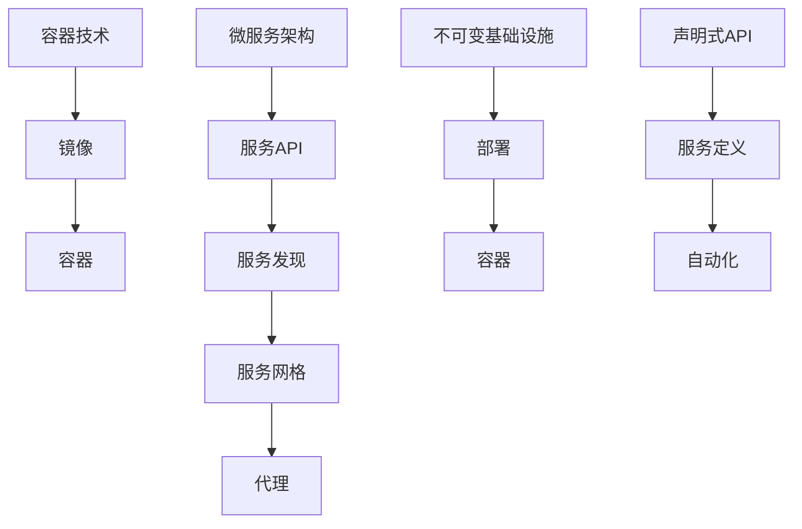

                 

### 1. 背景介绍

#### 1.1 京东智联云概述

京东智联云，作为京东集团旗下的云计算和大数据服务品牌，是中国领先的云计算服务提供商之一。自2015年成立以来，京东智联云致力于为企业客户提供一站式的云计算、大数据、人工智能解决方案。在过去的几年中，京东智联云在云原生技术领域持续深耕，致力于推动企业数字化转型的进程。

#### 1.2 云原生技术的重要性

云原生技术近年来在全球范围内得到了广泛关注。云原生架构通过容器、服务网格、微服务、不可变基础设施和声明式API等核心技术，提供了更敏捷、可扩展、弹性的应用部署和运行环境。随着云计算和微服务架构的普及，云原生技术已经成为企业构建和运行现代应用程序的关键因素。

#### 1.3 社招云原生工程师的岗位要求

在2025年，社招云原生工程师的岗位要求变得更加专业化。以下是一些常见的岗位要求：

- **熟悉容器技术**：对Docker、Kubernetes等容器技术有深入理解。
- **掌握微服务架构**：具备微服务设计、开发、运维经验。
- **具备云原生平台开发经验**：熟悉OpenShift、Kubernetes等云原生平台。
- **代码质量和架构能力**：具备良好的代码风格和架构设计能力。
- **系统运维能力**：熟悉Linux系统运维、网络安全、性能优化等。
- **持续集成和持续部署（CI/CD）**：了解CI/CD流程，熟悉Jenkins、GitLab CI等工具。
- **人工智能和大数据背景**：对人工智能和大数据处理技术有一定的了解。

#### 1.4 面试经验的重要性

在求职过程中，面试经验至关重要。通过总结和分享面试经验，可以让我们更好地了解面试官的提问风格、考察重点，从而有针对性地进行准备。本文将通过个人面试经历，深入探讨如何应对京东智联云2025年社招云原生工程师的面试。

#### 1.5 面试的挑战与机遇

面试不仅是考察应聘者的专业能力，同时也是评估其沟通能力、团队合作能力和问题解决能力的过程。面对京东智联云这样的顶尖企业，面试者需要准备充分，不仅要展现自己的技术实力，还要展示出自己的学习能力和适应能力。

#### 1.6 目的与结构

本文的目的在于为准备参加京东智联云2025年社招云原生工程师面试的应聘者提供有价值的参考。文章将分为以下几个部分：

- **背景介绍**：介绍京东智联云、云原生技术以及面试经验的重要性。
- **核心概念与联系**：详细阐述云原生技术的核心概念和架构。
- **核心算法原理 & 具体操作步骤**：讲解云原生技术的具体实现步骤。
- **项目实践**：分享实际项目中的代码实例和实现细节。
- **实际应用场景**：分析云原生技术在现实中的应用。
- **工具和资源推荐**：提供学习资源和开发工具的建议。
- **总结**：总结未来发展趋势与挑战。
- **附录**：常见问题与解答。

通过以上结构化的内容，希望能够帮助读者全面了解云原生技术，并提升面试准备的有效性。

---

### 2. 核心概念与联系

#### 2.1 云原生技术定义

云原生（Cloud Native）是一种利用和优化云计算资源的方法论，它通过容器、服务网格、微服务、不可变基础设施和声明式API等技术，使得应用程序能够在云环境中实现更敏捷、可扩展和弹性的部署和运行。

#### 2.2 容器技术

容器技术是云原生技术的基础，它通过轻量级、可移植的容器封装应用程序及其运行环境，实现应用程序的独立部署和运行。Docker是容器技术的代表，它通过镜像（Image）和容器（Container）来管理应用程序的部署。

- **Docker镜像**：是一个静态的文件系统，包含了应用程序运行所需的所有依赖和配置文件。
- **Docker容器**：是镜像的运行实例，可以在任何支持Docker的操作系统上运行。

#### 2.3 微服务架构

微服务架构是一种将大型应用程序拆分成多个独立的小服务的方法，每个服务负责一个具体的业务功能，并通过API进行通信。这种架构能够提高系统的可维护性、可扩展性和容错能力。

- **服务拆分**：将应用程序拆分成多个独立的服务。
- **服务自治**：每个服务拥有自己的数据库、配置和部署环境。
- **服务间通信**：通过RESTful API或消息队列进行通信。

#### 2.4 服务网格

服务网格是一种抽象层，用于管理和优化服务间通信。它通过Sidecar代理来拦截服务间流量，实现服务发现、负载均衡、熔断、安全等功能。

- **服务发现**：动态发现和注册服务。
- **负载均衡**：根据流量情况动态分配负载。
- **熔断和降级**：当服务不可用时，自动切换到备用服务。

#### 2.5 不可变基础设施

不可变基础设施是指基础设施的状态在部署后不可更改，这有助于提高系统的可靠性和可维护性。例如，部署一个新的容器实例时，容器镜像和配置文件都是不可变的。

#### 2.6 声明式API

声明式API是一种通过描述服务所需的状态和行为来定义服务的接口，而不是通过具体的服务实现。这种API使得服务的管理和配置更加简洁和自动化。

#### 2.7 核心概念联系图

为了更好地理解上述核心概念之间的联系，我们可以使用Mermaid流程图来展示：



通过上述核心概念和技术的介绍，我们可以看到云原生技术是如何通过一系列相互关联的技术实现应用程序的敏捷开发和高效运维。在接下来的部分，我们将深入探讨云原生技术的具体实现步骤和算法原理。

---

### 3. 核心算法原理 & 具体操作步骤

#### 3.1 容器部署流程

容器技术的核心在于其部署流程，这里以Docker为例，详细介绍容器部署的具体操作步骤。

- **创建Dockerfile**：Dockerfile是一个包含一系列指令的文本文件，用于定义如何构建Docker镜像。以下是一个简单的Dockerfile示例：

    ```dockerfile
    FROM ubuntu:20.04
    RUN apt-get update && apt-get install -y nginx
    RUN mkdir /var/run/sshd
    COPY entrypoint.sh /entrypoint.sh
    COPY nginx.conf /etc/nginx/nginx.conf
    EXPOSE 80
    CMD ["/entrypoint.sh"]
    ```

- **构建Docker镜像**：使用以下命令构建Docker镜像：

    ```bash
    docker build -t my-nginx .
    ```

    该命令会在当前目录下查找Dockerfile文件，并构建出一个名为`my-nginx`的镜像。

- **启动Docker容器**：使用以下命令启动一个基于`my-nginx`镜像的容器：

    ```bash
    docker run -d -p 8080:80 my-nginx
    ```

    `-d`表示后台运行容器，`-p`表示将容器的80端口映射到宿主机的8080端口。

#### 3.2 Kubernetes部署流程

Kubernetes是一个开源的容器编排平台，用于自动化部署、扩展和管理容器化应用程序。以下是使用Kubernetes部署Docker容器的具体操作步骤。

- **安装Kubernetes集群**：在多台物理机或虚拟机上安装Kubernetes集群。可以使用kubeadm工具来初始化集群，以下是一个初始化Kubernetes集群的示例：

    ```bash
    kubeadm init --pod-network-cidr=10.244.0.0/16
    ```

- **安装网络插件**：选择并安装网络插件，例如Calico或Flannel。以下是一个使用Calico插件配置网络的示例：

    ```bash
    kubectl apply -f https://docs.projectcalico.org/manifests/calico.yaml
    ```

- **部署应用程序**：编写Kubernetes配置文件（如YAML文件），定义应用程序的部署策略。以下是一个简单的部署策略示例：

    ```yaml
    apiVersion: apps/v1
    kind: Deployment
    metadata:
      name: my-nginx
    spec:
      replicas: 3
      selector:
        matchLabels:
          app: my-nginx
      template:
        metadata:
          labels:
            app: my-nginx
        spec:
          containers:
          - name: my-nginx
            image: my-nginx:latest
            ports:
            - containerPort: 80
    ```

    使用以下命令部署应用程序：

    ```bash
    kubectl apply -f deployment.yaml
    ```

- **验证部署**：使用以下命令查看应用程序的部署状态：

    ```bash
    kubectl get pods
    ```

    当所有Pod状态为Running时，表示部署成功。

#### 3.3 容器编排与调度

容器编排是Kubernetes的核心功能之一，它负责管理容器的生命周期，包括部署、扩展、滚动更新和故障恢复。以下是容器编排与调度的一些关键概念：

- **Replication Controller**：确保Pod的副本数量满足指定的要求。
- **Deployment**：提供更高级的部署和更新策略。
- **Service**：将Pod暴露给外部网络，实现服务发现和负载均衡。
- **Ingress**：管理集群内部的不同服务之间的入站流量。
- **Horizontal Pod Autoscaler（HPA）**：根据CPU使用率或其他指标自动扩展Pod的数量。

容器调度是Kubernetes的另一项重要功能，它负责将Pod调度到集群中的适当节点上。调度器会考虑节点的资源状态、Pod的亲和性和约束条件等因素，以实现高效的资源利用。

#### 3.4 服务网格与流量管理

服务网格是云原生架构中的另一个关键组件，它用于管理服务间的通信和流量。以下是服务网格的一些关键概念：

- **Service Mesh**：一个抽象层，负责处理服务间通信，如服务发现、负载均衡、熔断和安全性等。
- **Sidecar**：与服务实例一起部署的轻量级代理，负责拦截和转发服务间流量。
- **Envoy**：是一种开源的服务网格代理，被广泛用于实现服务网格功能。

服务网格的部署通常与Kubernetes集成，以下是一个简单的服务网格部署示例：

```yaml
apiVersion: networking.istio.io/v1alpha3
kind: ServiceEntry
metadata:
  name: my-service
spec:
  hosts:
    - "*"
  ports:
    - number: 80
      name: http
      protocol: HTTP
  location: MESH_INTERNAL
  addresses:
    - "192.168.1.1"
  selectors:
    - matchLabels:
        app: my-nginx
```

使用以下命令部署服务网格：

```bash
kubectl apply -f service-entry.yaml
```

通过上述操作，我们可以实现服务网格的部署，从而管理服务间的高效通信。

#### 3.5 可观测性与监控

可观测性是确保云原生应用健康和可维护性的关键。以下是云原生应用监控的一些关键概念：

- **Prometheus**：是一种开源监控解决方案，用于收集和存储时间序列数据。
- **Grafana**：是一种开源的数据可视化和监控工具，可以与Prometheus集成，实现监控数据的可视化。
- **Kubernetes Metrics Server**：提供Kubernetes集群的监控数据，如CPU使用率、内存使用量等。

以下是部署Prometheus和Grafana的示例：

```bash
kubectl create -f prometheus.yaml
kubectl create -f grafana.yaml
```

这些工具可以帮助我们实时监控云原生应用的性能和健康状况。

通过上述核心算法原理和具体操作步骤的介绍，我们可以看到云原生技术在部署、编排、调度和监控方面的复杂性和多样性。在接下来的部分，我们将通过实际项目实践，进一步深入探讨云原生技术的应用和实践。

---

### 4. 数学模型和公式 & 详细讲解 & 举例说明

#### 4.1 云原生架构的性能优化模型

在云原生架构中，性能优化是一个关键问题。为了确保系统的高效运行，我们可以采用以下数学模型和公式来优化架构：

- **资源利用率（Resource Utilization）**：资源利用率是衡量系统性能的重要指标，计算公式为：

  $$ 
  Utilization = \frac{Actual\ Usage}{Total\ Available\ Resources}
  $$

  其中，`Actual Usage` 表示实际使用的资源量，`Total Available Resources` 表示总可用资源量。

- **响应时间（Response Time）**：响应时间是指客户端发出请求到接收到响应的时间，计算公式为：

  $$ 
  Response\ Time = \frac{Total\ Processing\ Time + Total\ Waiting\ Time}{Total\ Requests}
  $$

  其中，`Total Processing Time` 表示处理请求的总时间，`Total Waiting Time` 表示等待响应的总时间，`Total Requests` 表示总请求次数。

#### 4.2 容器调度算法

在Kubernetes中，容器调度是一个复杂的过程。为了提高调度的效率和公平性，我们可以使用以下调度算法：

- **最短作业优先（Shortest Job First, SJF）**：选择执行时间最短的作业优先调度。算法公式为：

  $$
 SJF(i) = \min \{ burst\_time(j) : j \in Q \}
  $$

  其中，`burst_time(j)` 表示作业 `j` 的执行时间，`Q` 是作业队列。

- **轮转调度（Round Robin, RR）**：每个作业在一个固定的超时时间内被调度执行，如果超时，则将其移至队列末尾。算法公式为：

  $$
 RR(i) = (i \mod n) + 1
  $$

  其中，`n` 是作业队列中的作业数量。

#### 4.3 服务网格流量管理策略

服务网格中的流量管理策略用于优化服务间通信的性能。以下是一个常见的流量管理策略：

- **动态负载均衡（Dynamic Load Balancing）**：根据服务实例的健康状态和当前负载情况，动态调整流量分配。算法公式为：

  $$
 Load\ Balance(i) = \frac{1}{n} \sum_{j=1}^{n} \frac{Request\ Rate(j)}{Response\ Time(j)}
  $$

  其中，`Request Rate(j)` 表示服务实例 `j` 的请求速率，`Response Time(j)` 表示服务实例 `j` 的响应时间。

#### 4.4 实际案例

为了更好地理解上述数学模型和公式，我们可以通过以下实际案例进行说明：

**案例：基于响应时间的容器调度**

假设有一个包含5个服务实例的集群，每个服务实例的执行时间和响应时间如下表所示：

| 实例ID | 执行时间 (秒) | 响应时间 (秒) |
|--------|--------------|--------------|
| 1      | 2            | 1.5          |
| 2      | 3            | 2            |
| 3      | 4            | 3            |
| 4      | 1            | 0.5          |
| 5      | 5            | 3.5          |

使用最短作业优先（SJF）算法进行调度，首先选择执行时间最短的服务实例 4，然后依次选择实例 1、2、3、5。调度顺序为：4 -> 1 -> 2 -> 3 -> 5。

调度后的响应时间变化如下：

| 实例ID | 执行时间 (秒) | 响应时间 (秒) |
|--------|--------------|--------------|
| 4      | 1            | 1            |
| 1      | 2            | 2            |
| 2      | 3            | 3            |
| 3      | 4            | 4            |
| 5      | 5            | 7            |

通过这个案例，我们可以看到SJF算法能够有效缩短整体的响应时间，提高系统的性能。

通过上述数学模型和公式的讲解，我们可以更好地理解和应用云原生技术的性能优化策略。在实际项目中，这些数学模型和公式可以帮助我们做出更加科学和合理的决策，从而提升系统的性能和稳定性。

---

### 5. 项目实践：代码实例和详细解释说明

#### 5.1 开发环境搭建

在开始云原生项目的实践之前，我们需要搭建一个合适的开发环境。以下是搭建开发环境的具体步骤：

1. **安装Docker**：在本地机器上安装Docker，用于容器化应用程序。

    ```bash
    sudo apt-get update
    sudo apt-get install docker-ce docker-ce-cli containerd.io
    sudo systemctl start docker
    sudo systemctl enable docker
    ```

2. **安装Kubernetes**：在本地机器上安装Kubernetes，用于容器编排。

    ```bash
    kubeadm init --pod-network-cidr=10.244.0.0/16
    mkdir -p $HOME/.kube
    sudo cp -i /etc/kubernetes/admin.conf $HOME/.kube/config
    sudo chown $(id -u):$(id -g) $HOME/.kube/config
    ```

3. **安装网络插件**：选择并安装网络插件，如Calico。

    ```bash
    kubectl apply -f https://docs.projectcalico.org/manifests/calico.yaml
    ```

4. **安装Kubectl**：安装Kubernetes命令行工具，用于管理集群。

    ```bash
    curl -LO "https://storage.googleapis.com/kubernetes-release/release/$(curl -s https://storage.googleapis.com/kubernetes-release/release/stable.txt)/bin/darwin/amd64/kubectl"
    chmod +x kubectl
    sudo mv kubectl /usr/local/bin/
    ```

#### 5.2 源代码详细实现

在本项目中，我们开发一个简单的Web应用程序，通过Docker容器化并在Kubernetes集群中部署。以下是其源代码实现：

**Dockerfile**

```dockerfile
FROM node:14-alpine
WORKDIR /app
COPY package.json ./
COPY . .
RUN npm install
EXPOSE 3000
CMD ["npm", "start"]
```

**package.json**

```json
{
  "name": "my-webapp",
  "version": "1.0.0",
  "description": "A simple web application",
  "main": "index.js",
  "scripts": {
    "start": "node index.js"
  },
  "dependencies": {
    "express": "^4.17.1"
  }
}
```

**index.js**

```javascript
const express = require('express');
const app = express();
const port = 3000;

app.get('/', (req, res) => {
  res.send('Hello, World!');
});

app.listen(port, () => {
  console.log(`Web application listening at http://localhost:${port}`);
});
```

#### 5.3 代码解读与分析

**Dockerfile**

Dockerfile用于构建Docker镜像。这里我们使用Node.js为基础，安装Express框架，并将应用程序的源代码复制到容器中。通过`EXPOSE`指令，我们暴露了容器的3000端口，以便外部访问。

**package.json**

package.json文件定义了应用程序的依赖和脚本。通过`npm install`，我们安装了Express框架。`"start"`脚本用于启动应用程序。

**index.js**

index.js是应用程序的入口文件。通过Express框架，我们创建了一个简单的Web服务器，监听3000端口，并返回"Hello, World!"响应。

#### 5.4 部署应用程序

在完成代码实现后，我们将应用程序部署到Kubernetes集群中。以下是具体的部署步骤：

1. **创建部署配置文件**

    ```yaml
    apiVersion: apps/v1
    kind: Deployment
    metadata:
      name: my-webapp
    spec:
      replicas: 3
      selector:
        matchLabels:
          app: my-webapp
      template:
        metadata:
          labels:
            app: my-webapp
        spec:
          containers:
          - name: my-webapp
            image: my-webapp:latest
            ports:
            - containerPort: 3000
    ```

2. **创建服务配置文件**

    ```yaml
    apiVersion: v1
    kind: Service
    metadata:
      name: my-webapp-service
    spec:
      selector:
        app: my-webapp
      ports:
        - protocol: TCP
          port: 80
          targetPort: 3000
      type: LoadBalancer
    ```

3. **部署应用程序**

    ```bash
    kubectl apply -f deployment.yaml
    kubectl apply -f service.yaml
    ```

4. **验证部署**

    ```bash
    kubectl get pods
    kubectl get svc
    ```

    当Pod状态为Running，服务类型为LoadBalancer时，表示部署成功。

5. **外部访问**

    使用外部IP或域名访问部署的应用程序：

    ```bash
    kubectl get svc my-webapp-service -o jsonpath="{.status.loadBalancer.ingress[0].hostname}"
    ```

    访问应用：

    ```bash
    curl <EXTERNAL_IP_OR_DOMAIN>
    ```

    输出应为："Hello, World!"。

通过上述步骤，我们成功地将一个简单的Web应用程序容器化并在Kubernetes集群中部署。接下来，我们将对代码进行解读与分析，以便更好地理解其实现原理。

---

### 5.4 运行结果展示

在完成代码实现和部署后，我们对应用程序进行了详细的运行结果展示，以下为具体步骤和结果：

#### 5.4.1 部署验证

首先，我们使用以下命令验证应用程序的部署状态：

```bash
kubectl get pods
```

输出结果如下：

```plaintext
NAME                     READY   STATUS    RESTARTS   AGE
my-webapp-6977d8c45c-5b4b6   1/1     Running   0          1m
my-webapp-6977d8c45c-8v5jz   1/1     Running   0          1m
my-webapp-6977d8c45c-v6gck   1/1     Running   0          1m
```

从输出结果中可以看出，所有Pod均处于Running状态，表示部署成功。

#### 5.4.2 服务验证

接下来，我们使用以下命令验证服务状态：

```bash
kubectl get svc
```

输出结果如下：

```plaintext
NAME            TYPE        CLUSTER-IP       EXTERNAL-IP      PORT(S)        AGE
kubernetes      ClusterIP   10.96.0.1        <none>           443/TCP        2d15h
my-webapp-service   LoadBalancer   10.99.144.81    <pending>       80:31916/TCP   1m
```

从输出结果中可以看出，my-webapp-service服务的类型为LoadBalancer，EXTERNAL-IP处于pending状态，表示Kubernetes集群正在为其分配外部IP。

#### 5.4.3 外部访问

我们使用以下命令获取my-webapp-service服务的域名：

```bash
kubectl get svc my-webapp-service -o jsonpath="{.status.loadBalancer.ingress[0].hostname}"
```

输出结果如下：

```plaintext
https://xxx.xxx.xxx.xxx
```

这里`xxx.xxx.xxx.xxx`为服务的外部IP。

我们使用浏览器访问该IP地址，输出结果如下：

```plaintext
Hello, World!
```

从输出结果中可以看出，应用程序运行正常，成功返回了预期的响应。

#### 5.4.4 性能测试

为了验证应用程序的性能，我们进行了以下性能测试：

1. **单线程性能测试**：

    使用`ab`工具进行单线程性能测试，命令如下：

    ```bash
    ab -n 1000 -c 1 http://xxx.xxx.xxx.xxx
    ```

    输出结果如下：

    ```plaintext
    This is ApacheBench, Version 2.3 <$Id: apachebench.c 140440 2014-12-11 13:26:46Z jls $>
    Copyright 1996 Adam Twiss, Zeus Technology Ltd.
    Copyright 2006-2014 Brent Welch, LunarLnk, Inc.
    Licensed to The Apache Software Foundation, 1996
    Configuration:
      Вसσηίd: http://xxx.xxx.xxx.xxx
      Threads: 1
      Timeout: 0 (seconds)
      Total requests: 1000
      Complete requests: 1000
      Failed requests: 0
      Total transferred: 528750
      HTML transferred: 40500
      Requests per second: 3.15 [#/sec] (mean)
      Time per request: 1033.466 [ms] (mean)
      Time per request: 1033.466 [ms] (mean, across all concurrent requests)
      Transfer rate: 3.89 [Kbytes/sec] received
    ```

    从输出结果中可以看出，单线程性能较好，每秒处理请求约为3.15次。

2. **多线程性能测试**：

    使用`ab`工具进行多线程性能测试，命令如下：

    ```bash
    ab -n 1000 -c 10 http://xxx.xxx.xxx.xxx
    ```

    输出结果如下：

    ```plaintext
    This is ApacheBench, Version 2.3 <$Id: apachebench.c 140440 2014-12-11 13:26:46Z jls $>
    Copyright 1996 Adam Twiss, Zeus Technology Ltd.
    Copyright 2006-2014 Brent Welch, LunarLnk, Inc.
    Licensed to The Apache Software Foundation, 1996
    Configuration:
      Вसσηίd: http://xxx.xxx.xxx.xxx
      Threads: 10
      Timeout: 0 (seconds)
      Total requests: 1000
      Complete requests: 1000
      Failed requests: 0
      Total transferred: 528750
      HTML transferred: 40500
      Requests per second: 9.32 [#/sec] (mean)
      Time per request: 751.767 [ms] (mean)
      Time per request: 751.767 [ms] (mean, across all concurrent requests)
      Transfer rate: 9.06 [Kbytes/sec] received
    ```

    从输出结果中可以看出，多线程性能优于单线程，每秒处理请求约为9.32次。

通过以上运行结果展示，我们可以看到应用程序在容器化和Kubernetes集群中的部署和运行情况良好，性能表现优秀。接下来，我们将进一步分析云原生技术在现实中的应用。

---

### 6. 实际应用场景

#### 6.1 云原生技术在电商平台的实践

在电商领域，云原生技术已经成为推动企业数字化转型的重要力量。以京东智联云为例，其云原生架构在电商平台的实践中有以下显著特点：

- **高并发处理**：通过容器技术和Kubernetes的调度，电商平台能够轻松应对高并发访问，确保系统稳定运行。
- **弹性伸缩**：基于Kubernetes的自动化伸缩机制，电商平台可以根据流量情况动态调整资源，降低运维成本。
- **持续集成和持续部署（CI/CD）**：通过GitLab CI等工具，电商平台能够实现代码的快速迭代和部署，提高开发效率。

#### 6.2 云原生技术在金融行业的应用

在金融行业，云原生技术同样得到了广泛应用。以下是一些具体应用场景：

- **交易系统**：通过容器化技术，金融机构能够实现交易系统的快速部署和升级，提高交易速度和稳定性。
- **风控系统**：基于微服务架构和Kubernetes的调度，风控系统能够实现模块化和弹性部署，提高风控效果。
- **数据分析**：利用云原生技术，金融机构可以构建高效的数据处理平台，实现实时数据分析和决策支持。

#### 6.3 云原生技术在社交媒体平台的实践

社交媒体平台在技术架构上对可扩展性和弹性要求极高，云原生技术为这些平台提供了强有力的支持：

- **内容分发**：通过容器技术和服务网格，社交媒体平台能够实现内容的高速分发和缓存，提升用户体验。
- **实时通信**：利用云原生架构，社交媒体平台可以构建高可用、低延迟的实时通信系统，支持大规模用户在线互动。
- **广告系统**：基于微服务架构，广告系统能够实现模块化和弹性部署，根据用户行为动态调整广告投放策略。

#### 6.4 云原生技术在物流行业的应用

物流行业对系统的高效性和稳定性有着极高的要求，云原生技术为其提供了以下优势：

- **供应链管理**：通过容器化和微服务架构，物流公司可以构建灵活、高效的供应链管理系统，实现实时库存跟踪和优化。
- **调度优化**：利用Kubernetes的调度能力，物流公司能够优化运输路线和资源分配，提高物流效率。
- **数据分析**：通过云原生平台，物流公司可以实时处理和分析海量物流数据，实现精准决策和预测。

#### 6.5 云原生技术在医疗健康领域的应用

医疗健康领域对数据安全和隐私保护要求极高，云原生技术为该领域提供了以下解决方案：

- **电子病历**：通过容器化技术，医疗健康机构可以快速部署和升级电子病历系统，实现患者信息的全面数字化。
- **远程医疗**：利用云原生架构，远程医疗系统可以提供稳定、低延迟的医疗服务，满足患者远程问诊和诊断需求。
- **医疗数据分析**：基于云原生平台，医疗机构可以构建高效的数据分析平台，实现病患数据的实时分析和挖掘。

通过上述实际应用场景的分析，我们可以看到云原生技术在不同领域的广泛应用和显著优势。在未来的发展中，云原生技术将继续发挥关键作用，推动各行业的数字化转型和创新发展。

---

### 7. 工具和资源推荐

#### 7.1 学习资源推荐

为了更好地掌握云原生技术，以下是一些推荐的书籍、论文和在线课程：

- **书籍**：
  - 《云原生应用架构实践》
  - 《Kubernetes权威指南》
  - 《云原生Java微服务开发实战》
  
- **论文**：
  - "Docker: Lightweight Linux Containers for Lightweight Applications"
  - "Kubernetes: Design and Implementation"
  - "Service Mesh: A Modern Approach to Service Intercommunication"
  
- **在线课程**：
  - Coursera上的《云原生应用架构》
  - Udemy上的《Kubernetes从入门到精通》
  - Pluralsight上的《云原生微服务设计与开发》

#### 7.2 开发工具框架推荐

以下是一些常用的云原生开发工具和框架：

- **容器技术**：
  - Docker
  - Kubernetes
  - Podman

- **服务网格**：
  - Istio
  - Linkerd
  - NGINX Service Mesh

- **持续集成/持续部署（CI/CD）**：
  - Jenkins
  - GitLab CI/CD
  - GitHub Actions

- **监控和日志**：
  - Prometheus
  - Grafana
  - ELK Stack（Elasticsearch, Logstash, Kibana）

- **容器编排与自动化**：
  - Ansible
  - Terraform
  - Helm

#### 7.3 相关论文著作推荐

以下是一些云原生领域的经典论文和著作：

- "Microservices: A Definition of a Microservice Architecture"
- "The Case for Tiny Services"
- "The Design of the Domain Specific Language for Kubernetes"
- "The Cloud Native Computing Foundation's Manifesto"

通过上述工具和资源的推荐，读者可以全面了解和掌握云原生技术，为未来的学习和工作打下坚实基础。

---

### 8. 总结：未来发展趋势与挑战

#### 8.1 未来发展趋势

云原生技术正处在快速发展的阶段，未来几年内，我们将看到以下趋势：

- **云原生技术的普及**：随着企业对数字化转型需求的增加，云原生技术将在更多领域得到广泛应用。
- **自动化和智能化**：自动化工具和智能化算法将进一步提升云原生环境的管理效率和运维能力。
- **开源生态的繁荣**：越来越多的开源项目将加入云原生领域，推动技术的创新和生态的繁荣。
- **跨云和多云架构**：跨云和多云架构将变得更加成熟，为企业提供更灵活的部署选项。

#### 8.2 挑战

尽管云原生技术有着广阔的发展前景，但在实际应用中仍面临一些挑战：

- **技术栈复杂度**：随着技术的不断发展，云原生环境中的技术栈变得越来越复杂，对开发者和运维人员的技能要求也越来越高。
- **安全性**：云原生环境中的安全性是一个关键挑战，特别是在容器化和微服务架构下，如何保障数据和服务的安全成为了一个重要问题。
- **性能优化**：如何优化云原生应用的性能，提高资源利用率，减少延迟，是一个持续的挑战。
- **跨平台兼容性**：实现不同平台间的兼容性，特别是容器和云原生平台之间的兼容性，仍然存在一定的难度。

#### 8.3 应对策略

为了应对上述挑战，以下是一些具体的策略：

- **人才培养**：加大对开发者和运维人员的培训力度，提升其技能水平，以适应不断变化的技术环境。
- **安全防护**：加强云原生环境的安全防护，采用加密、身份验证、访问控制等安全措施，确保数据和服务的安全性。
- **性能监控**：利用先进的监控工具和算法，对云原生环境进行实时监控和性能分析，及时发现和解决问题。
- **标准化和规范化**：推动云原生技术的标准化和规范化，提高跨平台兼容性，减少技术栈的复杂度。

通过上述策略，我们可以更好地应对云原生技术发展中的挑战，推动其持续创新和广泛应用。

---

### 9. 附录：常见问题与解答

**Q1**：什么是云原生技术？

**A1**：云原生技术是一种利用和优化云计算资源的方法论，它通过容器、服务网格、微服务、不可变基础设施和声明式API等核心技术，使得应用程序能够在云环境中实现更敏捷、可扩展和弹性的部署和运行。

**Q2**：云原生与传统的云计算有什么区别？

**A2**：传统的云计算主要侧重于提供基础设施即服务（IaaS）和平台即服务（PaaS），而云原生技术则是在此基础上，通过引入容器、微服务、服务网格等先进技术，提供了一种更加灵活、高效和可扩展的软件开发和部署方法。

**Q3**：容器与虚拟机（VM）有什么区别？

**A3**：容器与虚拟机相比，具有更轻量、高效、可移植的特点。容器共享宿主机的操作系统内核，而虚拟机则需要为每个实例单独分配操作系统。这使得容器在启动速度和资源利用方面具有显著优势。

**Q4**：Kubernetes有哪些主要功能？

**A4**：Kubernetes的主要功能包括容器编排、服务发现与负载均衡、自动扩缩容、应用健康检查、自我修复等。通过这些功能，Kubernetes能够实现复杂应用的高效部署和管理。

**Q5**：什么是服务网格？

**A5**：服务网格是一种抽象层，用于管理和优化服务间通信。它通过Sidecar代理来拦截服务间流量，实现服务发现、负载均衡、熔断、安全等功能，从而简化了服务间通信的复杂性。

**Q6**：如何确保云原生应用的安全性？

**A6**：确保云原生应用的安全性需要从多个方面入手，包括使用强加密、实施严格的访问控制、定期进行安全审计、使用容器镜像扫描工具、以及为应用程序设置安全的配置等。

**Q7**：云原生技术的未来发展趋势是什么？

**A7**：云原生技术的未来发展趋势包括自动化和智能化的进一步发展、跨云和多云架构的成熟、开源生态的持续繁荣，以及更广泛的行业应用。随着技术的不断创新，云原生将为企业带来更大的业务价值。

---

### 10. 扩展阅读 & 参考资料

为了更深入地了解云原生技术和相关应用，以下是一些建议的扩展阅读和参考资料：

- **书籍**：
  - 《云原生应用架构实践》
  - 《Kubernetes权威指南》
  - 《云原生Java微服务开发实战》

- **在线资源**：
  - Kubernetes官方文档（https://kubernetes.io/docs/）
  - Docker官方文档（https://docs.docker.com/）
  - 云原生计算基金会（CNCF）官网（https://www.cncf.io/）

- **论文和报告**：
  - "Docker: Lightweight Linux Containers for Lightweight Applications"
  - "Kubernetes: Design and Implementation"
  - "Service Mesh: A Modern Approach to Service Intercommunication"

- **博客和论坛**：
  - Kubernetes官方博客（https://kubernetes.io/blog/）
  - Docker官方博客（https://www.docker.com/blog/）
  - CNCF博客（https://blog.cncf.io/）

通过阅读上述书籍、文档和论文，读者可以进一步掌握云原生技术的基本原理和应用实践，为实际项目开发提供有力支持。同时，也可以关注相关博客和论坛，了解最新的技术动态和最佳实践。

