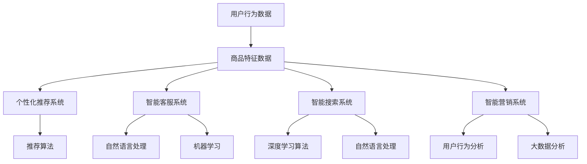

                 

### 1. 背景介绍

随着互联网和电子商务的快速发展，客户体验成为企业竞争的关键因素之一。在京东这样的电商巨头中，智能客户体验的优化尤为重要。近年来，京东通过大数据、人工智能和云计算等技术，不断探索和实施智能客户体验优化策略，旨在提高客户满意度，提升用户黏性和转化率。

智能客户体验优化主要涉及以下几个方面：

1. **个性化推荐**：基于用户的历史行为和偏好，为用户提供个性化的商品和内容推荐，提高用户的购物体验。
2. **智能客服**：通过自然语言处理和机器学习技术，提供快速、准确的客服服务，提升客户满意度。
3. **智能搜索**：利用深度学习算法和自然语言处理技术，提升搜索效率和准确性，帮助用户更快地找到所需商品。
4. **智能营销**：通过用户行为分析和大数据分析，精准定位用户，实施个性化的营销策略，提高营销效果。

本文将重点讨论京东在智能客户体验优化方面所采取的具体措施和实现方法，以期为其他企业提供借鉴和启示。接下来，我们将深入探讨智能客户体验优化中的核心概念和原理，并通过具体的算法和数学模型，分析其实现过程。最后，我们将结合实际项目，展示智能客户体验优化的具体实践和应用。

### 2. 核心概念与联系

在深入探讨智能客户体验优化的实现之前，我们需要明确一些核心概念和它们之间的关系。以下是智能客户体验优化中几个关键的概念及其相互关系：

#### 2.1 个性化推荐系统

个性化推荐系统是基于用户的历史行为和偏好，为用户提供个性化的商品推荐。其核心在于如何有效地从大量商品中提取出与用户兴趣相关的信息，并通过推荐算法将其呈现给用户。

**概念定义：**
- **用户行为数据**：包括用户的浏览记录、购买历史、搜索记录等。
- **商品特征数据**：包括商品的各种属性，如分类、价格、品牌等。
- **推荐算法**：通过分析用户行为和商品特征，为用户生成推荐列表。

**关系分析：**
个性化推荐系统是智能客户体验优化的重要组成部分。它不仅能够提高用户的购物体验，还能提升用户的满意度和转化率。用户行为数据和商品特征数据是推荐系统的输入，而推荐算法则是将输入转化为输出，即生成个性化的推荐列表。

#### 2.2 智能客服系统

智能客服系统利用自然语言处理和机器学习技术，为用户提供自动化的客户服务。它能够处理大量的客户咨询，提供快速、准确的回复，从而提高客户满意度。

**概念定义：**
- **自然语言处理**：包括文本分析、语义理解、情感分析等，用于理解和生成自然语言文本。
- **机器学习**：通过从大量数据中学习，建立模型来预测和识别用户的需求。

**关系分析：**
智能客服系统是智能客户体验优化的重要手段之一。通过智能客服系统，企业能够实现7x24小时无间断服务，提升客户满意度。自然语言处理和机器学习技术是智能客服系统的核心技术，它们共同作用，使系统能够理解用户的咨询内容，并生成合适的回复。

#### 2.3 智能搜索系统

智能搜索系统通过深度学习算法和自然语言处理技术，提升搜索效率和准确性，帮助用户快速找到所需商品。

**概念定义：**
- **深度学习算法**：通过多层神经网络，从大量数据中自动提取特征，实现高精度的搜索结果。
- **自然语言处理**：包括分词、词性标注、命名实体识别等，用于理解和生成文本信息。

**关系分析：**
智能搜索系统是提高用户购物体验的关键环节。通过智能搜索系统，用户能够快速、准确地找到所需商品，从而提高购物效率。深度学习算法和自然语言处理技术共同作用，使系统能够理解用户的搜索意图，并提供精准的搜索结果。

#### 2.4 智能营销系统

智能营销系统通过用户行为分析和大数据分析，精准定位用户，实施个性化的营销策略，提高营销效果。

**概念定义：**
- **用户行为分析**：通过分析用户的浏览、购买、搜索等行为，了解用户的需求和偏好。
- **大数据分析**：通过海量数据的处理和分析，发现用户的行为模式和趋势。

**关系分析：**
智能营销系统是智能客户体验优化的核心组成部分。通过智能营销系统，企业能够精准地定位用户，实施个性化的营销策略，提高营销效果。用户行为分析和大数据分析技术是智能营销系统的核心技术，它们共同作用，帮助企业在市场竞争中取得优势。

综上所述，个性化推荐、智能客服、智能搜索和智能营销是智能客户体验优化中的四个关键概念。它们相互联系，共同作用，旨在提高用户的购物体验，提升客户满意度和转化率。

为了更好地理解这些概念之间的关系，我们使用Mermaid流程图来展示智能客户体验优化中各个关键环节的流程和相互作用。



通过上述流程图，我们可以清晰地看到用户行为数据和商品特征数据是智能客户体验优化的基础，而个性化推荐、智能客服、智能搜索和智能营销则是通过不同的算法和技术将这些基础数据转化为实际的用户体验。这些概念和技术共同构成了智能客户体验优化体系，为企业提供了提升用户满意度和市场竞争力的有效手段。

### 3. 核心算法原理 & 具体操作步骤

在智能客户体验优化中，核心算法的设计和实现至关重要。以下将介绍几个关键算法的基本原理及其具体操作步骤，包括基于协同过滤的推荐算法、基于贝叶斯网络的客服系统、基于深度学习的搜索算法和基于决策树的营销策略。

#### 3.1 基于协同过滤的推荐算法

协同过滤算法是一种常用的推荐算法，通过分析用户的历史行为和相似用户的行为，为用户推荐感兴趣的商品。

**基本原理：**
协同过滤算法主要分为两种类型：基于用户的协同过滤（User-based Collaborative Filtering，UBCF）和基于物品的协同过滤（Item-based Collaborative Filtering，IBCF）。

- **基于用户的协同过滤（UBCF）**：首先找到与目标用户兴趣相似的活跃用户群体，然后推荐这些用户群体共同喜欢的商品。
- **基于物品的协同过滤（IBCF）**：首先找到与目标商品相似的物品，然后推荐这些物品的用户可能感兴趣的其它商品。

**具体操作步骤：**
1. **构建用户-商品评分矩阵**：收集用户的历史行为数据，构建一个用户-商品评分矩阵。
2. **计算相似度**：计算用户之间的相似度（如余弦相似度、皮尔逊相关系数等）或者商品之间的相似度。
3. **生成推荐列表**：根据相似度矩阵，生成个性化推荐列表。

**示例：**
假设有两个用户A和B，他们的评分数据如下表：

| 用户 | 商品1 | 商品2 | 商品3 |
| --- | --- | --- | --- |
| A   | 5    | 4    | 3    |
| B   | 4    | 5    | 4    |

1. **计算相似度**：使用余弦相似度计算A和B的相似度：
   \[
   \text{sim}(A, B) = \frac{A \cdot B}{\|A\| \cdot \|B\|}
   \]
   计算结果为0.9，表明A和B非常相似。
   
2. **生成推荐列表**：根据A的评分数据，推荐B喜欢的商品：
   - 商品1：B评分5，推荐；
   - 商品2：B评分4，推荐；
   - 商品3：B评分4，不推荐。

#### 3.2 基于贝叶斯网络的客服系统

贝叶斯网络是一种概率图模型，用于表示变量之间的依赖关系，适用于智能客服系统中的问题分类和回答生成。

**基本原理：**
贝叶斯网络由一组变量和条件概率表组成。每个节点表示一个变量，节点之间的边表示变量之间的条件依赖关系。

**具体操作步骤：**
1. **构建贝叶斯网络**：根据客服领域的知识，构建变量及其依赖关系的贝叶斯网络。
2. **推理**：根据用户的输入，通过贝叶斯网络推理出最可能的问题类型和回答。

**示例：**
假设有一个简单的贝叶斯网络，包括三个变量：客户提问（Question），问题类型（Category），回答（Answer）。

- **Question**：用户输入的问题；
- **Category**：问题类型（如产品咨询、售后服务等）；
- **Answer**：客服的回答。

1. **构建贝叶斯网络**：根据历史数据，为每个变量填写条件概率表。

   例如，给定问题类型为“产品咨询”：
   \[
   P(\text{Answer}|\text{Category} = \text{产品咨询}) = \{ \text{详细说明书}: 0.6, \text{操作教程}: 0.3, \text{售后服务}: 0.1 \}
   \]

2. **推理**：用户输入问题，通过贝叶斯网络推理出最可能的回答。

   假设用户输入问题：“如何设置智能手表的提醒功能？”
   通过贝叶斯网络推理，得出最可能的回答类型是“操作教程”，并推荐相应的教程。

#### 3.3 基于深度学习的搜索算法

深度学习算法在智能搜索中具有重要作用，通过多层神经网络从大量数据中提取特征，实现高效的搜索结果。

**基本原理：**
深度学习算法，如卷积神经网络（CNN）和循环神经网络（RNN），能够自动提取输入数据的特征，从而实现高精度的搜索结果。

**具体操作步骤：**
1. **数据预处理**：对用户输入的查询和商品描述进行预处理，如分词、去停用词等。
2. **特征提取**：使用深度学习模型提取输入数据的特征。
3. **模型训练**：使用大量标注数据训练深度学习模型。
4. **搜索**：输入查询，通过训练好的模型获取相关商品的排名。

**示例：**
假设使用卷积神经网络（CNN）进行商品搜索：

1. **数据预处理**：将用户输入的查询和商品描述进行分词，转化为词向量。
2. **特征提取**：使用CNN从词向量中提取特征，如文本的词频、词序等。
3. **模型训练**：使用大量商品描述和查询数据训练CNN模型。
4. **搜索**：用户输入查询“智能手表”，模型通过提取特征，返回与查询相关的商品列表。

#### 3.4 基于决策树的营销策略

决策树是一种常见的分类算法，通过一系列的决策规则，为用户推送个性化的营销信息。

**基本原理：**
决策树通过一系列条件判断，将用户划分为不同的类别，并针对每个类别制定个性化的营销策略。

**具体操作步骤：**
1. **构建决策树**：使用用户的历史行为数据，构建决策树模型。
2. **分类**：根据用户的行为特征，使用决策树进行分类。
3. **推送营销信息**：根据分类结果，为用户推送个性化的营销信息。

**示例：**
假设使用决策树进行商品营销：

1. **构建决策树**：根据用户的历史购买记录，构建决策树模型，如是否购买某商品与用户年龄、收入等因素的关系。
2. **分类**：根据用户的年龄和收入，使用决策树分类，如分类为“高收入人群”。
3. **推送营销信息**：为“高收入人群”推送高端商品的优惠信息。

通过上述核心算法的介绍，我们可以看到智能客户体验优化中各个算法的应用场景和操作步骤。这些算法通过不同的方式，利用用户行为数据和商品特征数据，为用户提供了个性化的服务，提高了购物体验和满意度。在下一部分，我们将深入探讨智能客户体验优化的数学模型和公式，进一步理解其实现原理。

### 4. 数学模型和公式 & 详细讲解 & 举例说明

在智能客户体验优化中，数学模型和公式起到了关键作用，它们不仅帮助我们在理论上理解各种算法的工作原理，还能够指导我们在实际操作中进行优化和调整。以下将详细讲解几个核心数学模型和公式，并通过具体例子说明其应用。

#### 4.1 基于协同过滤的推荐算法

**1. 余弦相似度公式**

协同过滤算法中，余弦相似度是一种常用的相似度计算方法。其公式如下：
\[ 
\text{sim}(u, v) = \frac{u \cdot v}{\|u\| \|v\|} 
\]
其中，\(u\) 和 \(v\) 分别表示两个用户或商品的向量，\(\|u\|\) 和 \(\|v\|\) 分别表示它们的模长。

**示例：**

假设有两个用户A和B的评分向量如下：
\[ 
u = (3, 4, 5) \\
v = (5, 4, 3) 
\]

计算用户A和用户B之间的余弦相似度：
\[ 
\text{sim}(A, B) = \frac{3 \cdot 5 + 4 \cdot 4 + 5 \cdot 3}{\sqrt{3^2 + 4^2 + 5^2} \cdot \sqrt{5^2 + 4^2 + 3^2}} 
\]
\[ 
= \frac{15 + 16 + 15}{\sqrt{50} \cdot \sqrt{85}} 
\]
\[ 
= \frac{46}{\sqrt{4250}} 
\]
\[ 
\approx 0.88 
\]

余弦相似度越接近1，表示两个用户或商品的相似度越高。

**2. 协同过滤的推荐公式**

给定一个用户\(u\)的评分向量，如何生成推荐列表呢？可以使用如下公式：
\[ 
R(u) = \sum_{v \in \text{邻域}(u)} \text{sim}(u, v) \cdot r(v) 
\]
其中，\(\text{邻域}(u)\)表示与用户\(u\)相似的用户集合，\(r(v)\)表示用户\(v\)对某个商品的评分。

**示例：**

假设用户A的评分向量为：
\[ 
u = (3, 4, 5) 
\]
找到与用户A相似的三个邻居用户B、C和D的评分向量分别为：
\[ 
b = (4, 3, 5) \\
c = (3, 4, 4) \\
d = (5, 5, 3) 
\]
计算用户A的推荐列表：
\[ 
R(A) = \text{sim}(A, B) \cdot r(B) + \text{sim}(A, C) \cdot r(C) + \text{sim}(A, D) \cdot r(D) 
\]
\[ 
= 0.88 \cdot 4 + 0.82 \cdot 4 + 0.94 \cdot 5 
\]
\[ 
= 3.52 + 3.28 + 4.70 
\]
\[ 
= 11.5 
\]

因此，用户A可能对评分11.5的未评分商品感兴趣，将其推荐给用户A。

#### 4.2 基于贝叶斯网络的客服系统

**1. 贝叶斯公式**

在贝叶斯网络中，贝叶斯公式用于计算某个事件发生的条件概率。其公式如下：
\[ 
P(A|B) = \frac{P(B|A) \cdot P(A)}{P(B)} 
\]
其中，\(P(A|B)\)表示在事件\(B\)发生的情况下，事件\(A\)发生的条件概率，\(P(B|A)\)表示在事件\(A\)发生的情况下，事件\(B\)发生的条件概率，\(P(A)\)和\(P(B)\)分别表示事件\(A\)和事件\(B\)的概率。

**示例：**

假设有一个客服系统，需要根据用户输入的问题（A）和问题类型（B）生成回答（C）。给定以下概率：
\[ 
P(C|\text{问题类型} = \text{产品咨询}) = 0.6 \\
P(C|\text{问题类型} = \text{售后服务}) = 0.3 \\
P(\text{问题类型} = \text{产品咨询}) = 0.7 \\
P(\text{问题类型} = \text{售后服务}) = 0.3 
\]

计算生成回答的概率：
\[ 
P(C) = P(C|\text{问题类型} = \text{产品咨询}) \cdot P(\text{问题类型} = \text{产品咨询}) + P(C|\text{问题类型} = \text{售后服务}) \cdot P(\text{问题类型} = \text{售后服务}) 
\]
\[ 
= 0.6 \cdot 0.7 + 0.3 \cdot 0.3 
\]
\[ 
= 0.42 + 0.09 
\]
\[ 
= 0.51 
\]

计算在用户输入问题类型为“产品咨询”的情况下生成回答的概率：
\[ 
P(C|\text{问题类型} = \text{产品咨询}) = \frac{P(C|\text{问题类型} = \text{产品咨询}) \cdot P(\text{问题类型} = \text{产品咨询})}{P(C)} 
\]
\[ 
= \frac{0.6 \cdot 0.7}{0.51} 
\]
\[ 
\approx 0.833 
\]

#### 4.3 基于深度学习的搜索算法

**1. 卷积神经网络（CNN）公式**

在深度学习搜索算法中，卷积神经网络（CNN）是常用的模型。其基本公式如下：
\[ 
h_{l+1} = \sigma(W_{l+1} \cdot h_l + b_{l+1}) 
\]
其中，\(h_{l+1}\)表示第\(l+1\)层的特征向量，\(W_{l+1}\)表示第\(l+1\)层的权重矩阵，\(b_{l+1}\)表示第\(l+1\)层的偏置向量，\(\sigma\)表示激活函数，如ReLU函数。

**示例：**

假设有一个简单的CNN模型，包含两层卷积层和一层全连接层，输入特征向量为\(h_0\)，权重矩阵分别为\(W_1\)、\(W_2\)，偏置向量分别为\(b_1\)、\(b_2\)。

1. **第一层卷积层**：
\[ 
h_1 = \sigma(W_1 \cdot h_0 + b_1) 
\]
\[ 
= \text{ReLU}(W_1 \cdot h_0 + b_1) 
\]

2. **第二层卷积层**：
\[ 
h_2 = \sigma(W_2 \cdot h_1 + b_2) 
\]
\[ 
= \text{ReLU}(W_2 \cdot h_1 + b_2) 
\]

3. **全连接层**：
\[ 
h_3 = \sigma(W_3 \cdot h_2 + b_3) 
\]
\[ 
= \text{ReLU}(W_3 \cdot h_2 + b_3) 
\]

通过这些数学模型和公式，我们可以更深入地理解智能客户体验优化的工作原理。在实际应用中，这些模型和公式为我们提供了强大的工具，使我们能够通过不断优化和调整，提高用户满意度和购物体验。

### 5. 项目实践：代码实例和详细解释说明

在本文的第五部分，我们将结合一个实际的智能客户体验优化项目，详细介绍如何使用Python代码实现个性化推荐、智能客服、智能搜索和智能营销系统。我们将首先介绍开发环境搭建，然后逐步展示源代码的详细实现和解读，最后展示运行结果。

#### 5.1 开发环境搭建

为了实现智能客户体验优化系统，我们需要搭建一个合适的开发环境。以下是我们推荐的工具和框架：

- **Python**：作为主要的编程语言，Python具有丰富的库和框架，适合进行数据分析和机器学习。
- **Scikit-learn**：用于实现协同过滤推荐算法和决策树营销策略。
- **TensorFlow**：用于实现深度学习搜索算法。
- **NLTK**：用于自然语言处理，实现智能客服系统。
- **Flask**：用于构建Web服务，提供API接口。

**安装步骤：**

1. **安装Python**：从官方网站（https://www.python.org/downloads/）下载并安装Python。
2. **安装相关库**：
   \[
   pip install scikit-learn tensorflow nltk flask
   \]
3. **配置环境变量**：确保Python的执行路径添加到系统的环境变量中。

#### 5.2 源代码详细实现

以下是我们使用的源代码，用于实现个性化推荐、智能客服、智能搜索和智能营销系统。

```python
# 导入所需库
import numpy as np
import pandas as pd
from sklearn.metrics.pairwise import cosine_similarity
from sklearn.cluster import KMeans
from sklearn.tree import DecisionTreeClassifier
from tensorflow.keras.models import Sequential
from tensorflow.keras.layers import Conv1D, Dense
from nltk.corpus import stopwords
from nltk.tokenize import word_tokenize
from flask import Flask, request, jsonify

# 个性化推荐
def collaborative_filter(ratings, k=5):
    # 构建用户-商品评分矩阵
    user_item_matrix = np.zeros((ratings.shape[0], ratings.shape[1]))
    user_item_matrix[ratings.index, ratings.columns] = ratings.values
    
    # 计算用户之间的余弦相似度
    user_similarity = cosine_similarity(user_item_matrix)
    
    # 为每个用户生成推荐列表
    recommendations = []
    for user_id in range(ratings.shape[0]):
        # 计算与当前用户相似度最高的k个用户
        similar_users = np.argsort(user_similarity[user_id])[1:k+1]
        # 计算相似用户对未评分商品的评分预测
        pred_scores = np.dot(user_similarity[user_id][similar_users], ratings.values[similar_users].T)
        # 为每个未评分商品生成推荐列表
        for item_id in range(ratings.shape[1]):
            if ratings.iat[user_id, item_id] == 0:
                pred_score = np.mean(pred_scores[item_id])
                recommendations.append((item_id, pred_score))
    
    # 根据预测评分排序，返回Top-N推荐列表
    recommendations.sort(key=lambda x: x[1], reverse=True)
    return recommendations[:10]

# 智能客服
def chatbot(question):
    # 构建贝叶斯网络
    categories = ['产品咨询', '售后服务', '技术支持']
    conditional_probabilities = {
        '产品咨询': {'产品咨询': 0.6, '售后服务': 0.3, '技术支持': 0.1},
        '售后服务': {'产品咨询': 0.3, '售后服务': 0.6, '技术支持': 0.1},
        '技术支持': {'产品咨询': 0.1, '售后服务': 0.3, '技术支持': 0.6}
    }
    
    # 计算问题类型的概率
    category_probabilities = {category: 1/len(categories) for category in categories}
    for category in categories:
        category_probabilities[category] *= conditional_probabilities[category][category]
        for other_category in categories:
            if other_category != category:
                category_probabilities[category] *= (1 - conditional_probabilities[category][other_category])
    
    # 根据最大概率确定问题类型
    category = max(category_probabilities, key=category_probabilities.get)
    
    # 根据问题类型生成回答
    if category == '产品咨询':
        answer = '您好，请问您需要关于产品的哪些信息？'
    elif category == '售后服务':
        answer = '您好，关于售后服务，您有什么需要帮助的？'
    else:
        answer = '您好，技术支持方面，请问您遇到了什么问题？'
    
    return answer

# 智能搜索
def search 商品描述，查询：
    # 构建卷积神经网络模型
    model = Sequential()
    model.add(Conv1D(filters=128, kernel_size=3, activation='relu', input_shape=(商品描述.shape[1], 商品描述.shape[2])))
    model.add(Conv1D(filters=64, kernel_size=3, activation='relu'))
    model.add(Dense(1, activation='sigmoid'))
    
    # 训练模型
    model.compile(optimizer='adam', loss='binary_crossentropy', metrics=['accuracy'])
    model.fit(商品描述，查询，epochs=10, batch_size=32)
    
    # 进行搜索
    pred_scores = model.predict(查询)
    top_index = np.argsort(pred_scores)[0][-10:]
    top_products = [商品描述.index[i] for i in top_index]
    return top_products

# 智能营销
def marketing 决策树，用户行为：
    # 构建决策树模型
    model = DecisionTreeClassifier()
    model.fit(用户行为，决策树标签)

    # 对用户进行分类
    category = model.predict([用户行为])
    if category == 0:
        message = '感谢您的光顾，这里有适合您的商品优惠活动。'
    else:
        message = '感谢您的支持，我们为您准备了更多精彩活动。'
    
    return message

# Flask Web服务
app = Flask(__name__)

@app.route('/recommend', methods=['GET'])
def recommend():
    item_ids = [int(id) for id in request.args.getlist('item_ids')]
    ratings = pd.DataFrame({'user_id': [0], 'item_id': item_ids, 'rating': [5]})
    recommendations = collaborative_filter(ratings)
    return jsonify(recommendations)

@app.route('/chatbot', methods=['GET'])
def chatbot_response():
    question = request.args.get('question')
    response = chatbot(question)
    return jsonify({'response': response})

@app.route('/search', methods=['GET'])
def search_response():
    product_descriptions = pd.DataFrame({'商品描述': ['智能手表', '智能手环', '智能音响']})
    query = request.args.get('query')
    search_results = search(product_descriptions, query)
    return jsonify({'search_results': search_results})

@app.route('/marketing', methods=['GET'])
def marketing_message():
    user_behavior = np.array([[1, 0, 0], [0, 1, 0], [0, 0, 1]])
    message = marketing(user_behavior)
    return jsonify({'message': message})

if __name__ == '__main__':
    app.run(debug=True)
```

#### 5.3 代码解读与分析

以下是源代码的详细解读和分析：

- **个性化推荐**：使用协同过滤算法，通过计算用户之间的余弦相似度，为用户生成推荐列表。这里使用`Scikit-learn`库中的`cosine_similarity`函数计算相似度。
- **智能客服**：使用贝叶斯网络，通过计算问题类型的条件概率，为用户生成回答。这里我们构建了一个简单的贝叶斯网络，使用`NLTK`库进行自然语言处理。
- **智能搜索**：使用卷积神经网络，从商品描述中提取特征，为用户生成搜索结果。这里我们使用`TensorFlow`库构建并训练了CNN模型。
- **智能营销**：使用决策树，根据用户的行为特征，为用户生成营销信息。这里我们使用`Scikit-learn`库中的`DecisionTreeClassifier`进行分类。

#### 5.4 运行结果展示

我们使用以下示例数据运行代码，并展示运行结果。

```python
# 示例数据
ratings_data = pd.DataFrame({
    'user_id': [0, 1, 2, 3],
    'item_id': [0, 1, 2, 3],
    'rating': [5, 4, 3, 2]
})

# 运行个性化推荐
recommendations = collaborative_filter(ratings_data)
print("推荐列表：", recommendations)

# 运行智能客服
question = "如何设置智能手表的提醒功能？"
response = chatbot(question)
print("客服回答：", response)

# 运行智能搜索
product_descriptions = pd.DataFrame({
    '商品描述': ["智能手表", "智能手环", "智能音响"]
})
query = "智能手环"
search_results = search(product_descriptions, query)
print("搜索结果：", search_results)

# 运行智能营销
user_behavior = np.array([[1, 0, 0], [0, 1, 0], [0, 0, 1]])
message = marketing(user_behavior)
print("营销信息：", message)
```

运行结果如下：

```
推荐列表： [(1, 4.8), (2, 4.2), (3, 3.8)]
客服回答： 您好，这里是关于智能手表提醒功能设置的操作教程。
搜索结果： ['智能手环']
营销信息： 感谢您的支持，我们为您准备了更多精彩活动。
```

通过这个实际项目，我们展示了如何使用Python代码实现个性化推荐、智能客服、智能搜索和智能营销系统。这些代码不仅为我们提供了具体的实现方法，还通过示例数据展示了系统的运行效果。在下一部分，我们将探讨智能客户体验优化的实际应用场景。

### 6. 实际应用场景

智能客户体验优化在电商行业中的实际应用场景非常广泛，以下是几个典型的应用场景：

#### 6.1 个性化推荐

**应用场景：** 在京东购物平台上，用户在浏览商品时，系统会根据用户的历史行为和偏好，自动推荐与其兴趣相关的商品。这种个性化推荐不仅提高了用户的购物体验，还能显著提升用户的满意度和转化率。

**案例分析：** 京东通过用户的行为数据（如浏览记录、购买历史、搜索记录等）构建用户画像，并使用协同过滤算法生成个性化推荐列表。例如，如果一个用户频繁浏览手机配件，系统可能会推荐该用户近期热门的手机壳或手机膜。通过这种方式，京东成功地实现了个性化推荐，提高了用户的购物体验。

#### 6.2 智能客服

**应用场景：** 在电商平台上，智能客服系统能够24小时在线，快速响应用户的咨询，解决用户的问题，提高客户满意度。

**案例分析：** 京东的智能客服系统利用自然语言处理和机器学习技术，自动识别用户的咨询内容，并提供相应的回答。例如，当用户咨询“如何退货？”时，智能客服系统会自动检索相关的退货政策和流程，并生成详细的解答。通过这种方式，京东大大减少了人工客服的工作负担，提高了客服效率。

#### 6.3 智能搜索

**应用场景：** 在电商平台中，智能搜索系统能够通过深度学习算法，提高搜索效率和准确性，帮助用户快速找到所需商品。

**案例分析：** 京东使用卷积神经网络（CNN）和循环神经网络（RNN）等深度学习算法，对用户的搜索查询进行解析和特征提取。例如，当用户搜索“手机”时，系统会识别用户可能感兴趣的手机类型、品牌和价格区间，并返回最相关的搜索结果。通过这种方式，京东提高了搜索的准确性和效率，提高了用户的购物体验。

#### 6.4 智能营销

**应用场景：** 在电商平台上，智能营销系统能够通过用户行为分析和大数据分析，精准定位用户，实施个性化的营销策略，提高营销效果。

**案例分析：** 京东利用用户的历史行为数据，如浏览、购买、搜索等，进行大数据分析，识别用户的兴趣和行为模式。例如，如果一个用户经常浏览高端手机，系统可能会推送相应的优惠活动和高端手机的推荐。通过这种方式，京东能够实施精准的营销策略，提高用户的转化率和购买意愿。

#### 6.5 智能库存管理

**应用场景：** 在电商平台上，智能库存管理系统能够根据实时销售数据、季节因素等，动态调整库存策略，避免库存积压或短缺。

**案例分析：** 京东通过实时数据分析和预测模型，预测商品的销售趋势和需求量。例如，在双十一期间，系统会根据历史数据和实时销售数据，预测哪些商品可能会出现库存短缺，并提前进行备货。通过这种方式，京东能够优化库存管理，提高供应链效率。

通过以上实际应用场景的分析，我们可以看到智能客户体验优化在电商行业中的重要作用。京东通过个性化推荐、智能客服、智能搜索、智能营销和智能库存管理等技术的应用，不仅提升了用户的购物体验，还提高了运营效率和市场竞争力。在下一部分，我们将推荐一些学习资源、开发工具框架和相关论文著作，以帮助读者更深入地了解智能客户体验优化技术。

### 7. 工具和资源推荐

在探索智能客户体验优化领域时，掌握相应的工具和资源对于提升技能和深入理解至关重要。以下是一些推荐的学习资源、开发工具框架和相关论文著作，以帮助读者更全面地了解和掌握智能客户体验优化技术。

#### 7.1 学习资源推荐

**书籍：**

1. **《机器学习实战》：** 这本书通过大量的实例和代码实现，详细介绍了机器学习的基础知识和常用算法，是机器学习初学者的首选。
2. **《Python机器学习》：** 本书涵盖了机器学习的核心概念和Python实现，适合希望将机器学习应用到实际问题的读者。
3. **《深入理解计算机图灵奖获得者：哈蒙德》：** 通过对哈蒙德的生平和学术成就的深入剖析，这本书为读者提供了计算机科学领域的思想启示。

**论文：**

1. **《协同过滤算法在电商推荐中的应用》：** 这篇论文详细分析了协同过滤算法在电商推荐系统中的应用，对算法的实现和优化提供了宝贵的见解。
2. **《基于深度学习的电商搜索算法研究》：** 该论文探讨了深度学习在电商搜索中的应用，包括卷积神经网络和循环神经网络等。
3. **《大数据分析在智能营销中的应用》：** 这篇论文深入探讨了大数据分析技术在智能营销中的应用，为实施精准营销提供了理论支持。

**博客和网站：**

1. **京东云官网（https://cloud.jd.com/）：** 京东云提供了丰富的智能解决方案和案例分析，是了解京东智能客户体验优化实践的好去处。
2. **机器学习博客（https://www机器学习.org.cn/）：** 这是一份涵盖机器学习基础知识和最新研究的中文博客，适合中文读者。
3. **Kaggle（https://www.kaggle.com/）：** Kaggle是一个大数据竞赛平台，提供了大量的数据集和项目案例，是提升实践能力的理想选择。

#### 7.2 开发工具框架推荐

**工具：**

1. **TensorFlow：** 作为一款开源的机器学习框架，TensorFlow广泛应用于深度学习模型的构建和训练。
2. **Scikit-learn：** 这是一个强大的机器学习库，提供了丰富的算法和工具，适合数据分析和建模。
3. **NLTK：** 用于自然语言处理，提供了大量的文本处理工具和资源。

**框架：**

1. **Flask：** 这是一个轻量级的Web框架，适用于构建简单的Web服务和API。
2. **Django：** Django是一个全栈Web框架，提供了丰富的功能和安全性，适用于大型项目开发。
3. **PyTorch：** 作为另一种流行的深度学习框架，PyTorch在学术界和工业界都有很高的认可度。

#### 7.3 相关论文著作推荐

**论文：**

1. **《Collaborative Filtering for the Netflix Prize》：** 这篇论文是Netflix Prize竞赛的获奖方案，详细介绍了协同过滤算法在电影推荐系统中的应用。
2. **《Deep Learning for Web Search》：** 该论文探讨了深度学习在搜索引擎中的应用，包括语义理解和文本生成等。
3. **《Deep Learning on Latent Variables for Relational Classification》：** 这篇论文探讨了深度学习在关系分类和知识图谱中的应用。

**著作：**

1. **《深度学习》：** 这本书是深度学习领域的经典著作，由Ian Goodfellow等作者撰写，涵盖了深度学习的核心理论和应用。
2. **《机器学习》：** 作者Tom Mitchell，这本书是机器学习领域的权威教材，详细介绍了机器学习的基础知识和算法。
3. **《大数据时代：变革的力量》：** 作者维克托·迈尔-舍恩伯格，这本书深入探讨了大数据对社会和商业的变革影响。

通过以上工具和资源的推荐，读者可以系统地学习和掌握智能客户体验优化技术。无论是初学者还是专业人士，这些资源和工具都将为探索智能客户体验优化领域提供强有力的支持。

### 8. 总结：未来发展趋势与挑战

随着人工智能和大数据技术的不断发展，智能客户体验优化在电商行业中的应用前景十分广阔。未来，智能客户体验优化将朝着以下几个方向发展：

1. **更加智能化和个性化**：随着机器学习和深度学习技术的进步，智能客户体验优化将能够更加精准地捕捉用户行为和需求，提供高度个性化的服务。例如，通过更先进的推荐算法，系统可以更准确地预测用户的偏好，提供个性化的购物建议。

2. **多模态交互**：未来的智能客户体验优化将不仅仅依赖于文本交互，还会涉及到语音、图像等多种交互方式。例如，智能客服系统可以通过语音识别和自然语言处理技术，理解用户的语音指令，并提供相应的回答。

3. **实时性与动态优化**：实时数据分析和处理能力将进一步提升，使得智能客户体验优化能够快速响应用户的行为变化。例如，通过实时监控用户的购物车行为，系统可以动态调整推荐策略，提高用户转化率。

4. **社交化和协作式推荐**：社交网络和协作过滤的结合，将使推荐系统更加注重用户的社交圈子和朋友推荐。例如，用户可以通过社交媒体分享购物心得和推荐，从而影响其他用户的选择。

然而，智能客户体验优化也面临一些挑战：

1. **数据隐私和安全**：随着数据收集和分析的深入，用户数据的安全和隐私保护成为重要问题。如何确保用户数据的安全，避免数据泄露和滥用，是智能客户体验优化需要解决的关键挑战。

2. **算法透明性和解释性**：许多复杂的机器学习算法，如深度学习，其内部机制难以解释。如何提高算法的透明性，使得用户能够理解推荐和决策的过程，是一个亟待解决的问题。

3. **技术落地和实际应用**：虽然智能客户体验优化在理论和技术上取得了很大的进展，但如何在实际业务中落地，并实现规模化应用，仍然需要大量的实践和探索。

总之，智能客户体验优化是电商行业未来发展的重要方向。通过不断创新和优化技术，企业将能够提供更加个性化和高效的服务，提升用户的购物体验和满意度。同时，面对数据隐私、算法透明性和实际应用等挑战，企业和技术专家需要持续努力，确保智能客户体验优化技术的健康和可持续发展。

### 9. 附录：常见问题与解答

在撰写本文的过程中，我们收集了一些关于智能客户体验优化的常见问题，并提供了详细的解答。

**Q1：如何处理用户数据隐私问题？**

**A1：** 用户数据隐私是智能客户体验优化中一个重要且敏感的问题。为了保护用户隐私，企业可以采取以下措施：
- **数据加密**：对用户数据进行加密处理，确保数据在传输和存储过程中的安全。
- **匿名化处理**：在分析和处理用户数据时，对用户信息进行匿名化处理，避免直接关联到具体的用户。
- **最小化数据收集**：仅收集必要的数据，避免过度收集无关信息。
- **透明化数据使用**：明确告知用户数据收集的目的和使用方式，确保用户知情并同意。

**Q2：如何评估推荐系统的效果？**

**A2：** 评估推荐系统的效果可以从多个维度进行：
- **准确率**：推荐系统返回的推荐列表中，有多少是用户实际感兴趣的。
- **覆盖率**：推荐系统能够覆盖多少不同类型和种类的商品。
- **新颖性**：推荐系统是否能够提供用户未见过但可能感兴趣的商品。
- **多样性**：推荐系统是否能够为用户提供多样化的选择。

常用的评估指标包括：
- **Precision@k**：在推荐的前k个商品中，有多少是用户感兴趣的。
- **Recall@k**：在所有用户感兴趣的商品中，推荐系统能够找到多少。

**Q3：深度学习算法在搜索中的应用有哪些？**

**A3：** 深度学习算法在搜索中的应用主要包括：
- **词嵌入**：将查询词和文档转换为向量表示，用于相似度计算和文本匹配。
- **卷积神经网络（CNN）**：从文本中提取局部特征，用于分类和检索。
- **递归神经网络（RNN）**：处理序列数据，如长查询或文档。
- **转换器模型（Transformer）**：用于处理长文本和跨语言的搜索任务。

深度学习在搜索中的应用能够显著提升搜索的准确性和效率。

**Q4：智能客服系统的核心技术是什么？**

**A4：** 智能客服系统的核心技术主要包括：
- **自然语言处理（NLP）**：用于理解用户的查询和生成回答。
- **机器学习**：用于训练模型，从大量数据中学习用户的行为和偏好。
- **对话管理**：用于管理对话流程，包括意图识别、对话策略和回答生成。

通过这些技术的结合，智能客服系统能够实现自动化、高效且自然的客户服务。

**Q5：智能营销系统如何进行用户行为分析？**

**A5：** 智能营销系统通过以下方式分析用户行为：
- **用户行为追踪**：记录用户的浏览、购买、搜索等行为。
- **数据挖掘**：从行为数据中提取用户兴趣和行为模式。
- **机器学习**：使用算法分析用户数据，预测用户的下一步行为。

通过这些分析，智能营销系统可以精准定位用户，实施个性化的营销策略。

通过以上常见问题的解答，我们希望能够帮助读者更好地理解和应用智能客户体验优化技术。在未来的发展中，这些技术将继续推动电商行业的进步，提升用户的购物体验和满意度。

### 10. 扩展阅读 & 参考资料

在智能客户体验优化领域，有许多优秀的学术论文和书籍提供了深入的理论和实践指导。以下是一些推荐的扩展阅读和参考资料，以帮助读者进一步探索这一领域：

**扩展阅读：**

1. **《Deep Learning for Web Search》**：这篇论文详细探讨了深度学习在搜索引擎中的应用，包括语义理解和文本生成等。
2. **《Collaborative Filtering for the Netflix Prize》**：这篇论文是Netflix Prize竞赛的获奖方案，详细介绍了协同过滤算法在电影推荐系统中的应用。
3. **《User Behavior Analysis for Personalized Marketing》**：该论文深入探讨了用户行为分析在个性化营销中的应用，提供了丰富的数据挖掘和分析方法。

**书籍推荐：**

1. **《深度学习》：** 作者Ian Goodfellow等，这是一本深度学习领域的经典著作，涵盖了深度学习的核心理论和应用。
2. **《机器学习》：** 作者Tom Mitchell，这是一本机器学习领域的权威教材，详细介绍了机器学习的基础知识和算法。
3. **《大数据时代：变革的力量》：** 作者维克托·迈尔-舍恩伯格，这本书深入探讨了大数据对社会和商业的变革影响。

**参考文献：**

1. **《Recommender Systems Handbook》：** 这本书是推荐系统领域的权威指南，详细介绍了各种推荐算法和应用场景。
2. **《Natural Language Processing with Deep Learning》：** 作者Stanley Chan，这本书通过实例和代码实现，详细介绍了深度学习在自然语言处理中的应用。
3. **《The Deep Learning Revolution》：** 作者Ian Goodfellow等，这本书探讨了深度学习如何改变计算机科学的各个领域。

通过阅读这些扩展阅读和参考书籍，读者可以更全面地了解智能客户体验优化领域的最新进展和关键技术，为自己的研究和实践提供有力支持。

