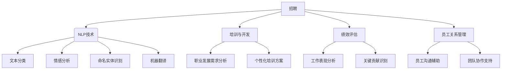
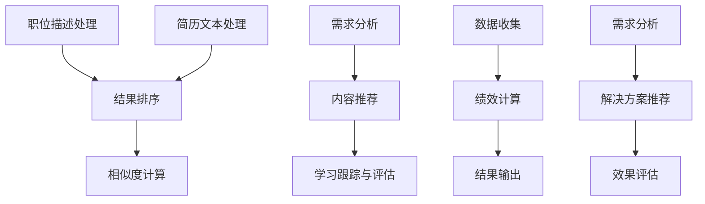

                 

### 1. 背景介绍

在当今全球化的数字经济时代，人力资源管理和技术进步的结合成为了企业发展的关键驱动力。尤其是大型语言模型（LLM，Large Language Model）的崛起，为人力资源领域带来了前所未有的变革和创新机遇。

首先，人力资源管理的核心目标在于优化人才的招聘、培养、激励和保留，以实现组织的战略目标。传统的HR管理方法通常依赖于经验积累和人工决策，这在一定程度上限制了管理效率和准确性。然而，随着人工智能（AI）技术的不断发展，尤其是LLM的应用，这些传统瓶颈开始被逐步打破。

LLM是一种基于深度学习的自然语言处理模型，其具备强大的语言理解和生成能力。在人力资源管理中，LLM可以应用于多个方面，如简历筛选、职位匹配、员工培训、绩效评估等。通过分析海量的文本数据，LLM能够识别人才的关键技能、职业兴趣和行为特征，从而帮助企业做出更加科学和高效的决策。

具体而言，LLM在人力资源管理中的应用主要体现在以下几个方面：

1. **简历筛选与职位匹配**：LLM可以根据岗位需求智能筛选简历，匹配求职者的技能和经验，大大提高了招聘效率和准确性。
2. **员工培训与开发**：LLM可以分析员工的职业发展需求，提供个性化的培训方案，提高培训效果和员工满意度。
3. **绩效评估**：LLM通过分析员工的工作表现和行为数据，提供客观、全面的绩效评估结果，帮助HR部门更准确地评估员工的工作表现。
4. **沟通与协作**：LLM可以辅助HR部门进行员工沟通和团队协作，提高组织内部的沟通效率和协同能力。

综上所述，人力资源管理和LLM的结合，不仅能够提升HR管理的效率和准确性，还能够为企业带来更为广阔的创新和发展空间。在接下来的章节中，我们将深入探讨LLM的核心概念与联系，以及其具体应用场景和操作步骤。

### 2. 核心概念与联系

在深入了解LLM在人力资源管理中的应用之前，首先需要明确几个核心概念，并探讨它们之间的联系。

#### 2.1 人力资源管理的核心概念

1. **招聘**：招聘是人力资源管理的重要环节，旨在吸引并筛选合适的候选人。传统招聘方式通常依赖于人工筛选简历，而现代招聘更多地借助自动化工具，如招聘管理系统（ATS）和智能简历筛选算法。
2. **培训与开发**：培训与开发是提升员工技能和知识水平的重要手段，有助于提高员工的工作能力和职业发展。
3. **绩效评估**：绩效评估是衡量员工工作表现的重要手段，通过评估结果，HR部门可以了解员工的强项和弱点，制定相应的改进措施。
4. **员工关系管理**：员工关系管理涉及员工福利、工作环境、员工满意度等方面，旨在建立和谐、稳定的劳动关系。

#### 2.2 LLM的核心概念

1. **自然语言处理（NLP）**：自然语言处理是人工智能领域的一个重要分支，旨在使计算机能够理解、生成和处理人类自然语言。NLP技术包括文本分类、情感分析、命名实体识别、机器翻译等。
2. **深度学习**：深度学习是一种基于人工神经网络的机器学习技术，通过构建复杂的网络结构，对大量数据进行分析和建模，从而实现高度自动化的任务。在LLM中，深度学习技术被广泛应用于语言理解和生成。
3. **预训练与微调**：预训练是指在大规模数据集上对模型进行训练，使其具备一定的通用语言理解能力。微调则是在预训练的基础上，针对特定任务对模型进行调整，以提高其在特定任务上的表现。

#### 2.3 核心概念之间的联系

1. **招聘与NLP**：NLP技术可以应用于简历筛选，通过文本分类和情感分析等技术，对简历中的关键词和句子进行解析，识别候选人的技能和经验，从而提高招聘的效率和准确性。
2. **培训与开发与NLP**：NLP技术可以分析员工的职业发展需求，识别关键技能和知识盲点，为员工提供个性化的培训方案。
3. **绩效评估与NLP**：NLP技术可以分析员工的工作报告、邮件和会议记录等文本数据，识别员工的工作表现和关键贡献，为绩效评估提供客观依据。
4. **员工关系管理与人机交互**：LLM可以辅助HR部门进行员工沟通和团队协作，通过自然语言生成技术，提供个性化的沟通建议和解决方案，提高组织内部的沟通效率和协同能力。

#### 2.4 Mermaid 流程图

以下是一个简单的Mermaid流程图，展示了人力资源管理中各个核心概念与LLM之间的联系：



通过上述流程图，我们可以清晰地看到，NLP技术在人力资源管理中的广泛应用，以及LLM如何通过深度学习和预训练技术，为人力资源管理带来创新和变革。

在接下来的章节中，我们将进一步探讨LLM在人力资源管理中的核心算法原理和具体操作步骤，以帮助读者更好地理解这一前沿技术的应用。

### 3. 核心算法原理 & 具体操作步骤

#### 3.1  招聘与职位匹配

招聘和职位匹配是人力资源管理的核心环节之一。LLM在这一领域中的应用主要通过自然语言处理技术实现，以下是一个典型的招聘与职位匹配算法的步骤：

1. **职位描述处理**：
    - 对职位描述进行分词和词性标注，提取关键词和关键信息。
    - 使用词嵌入技术将文本转换为高维向量表示。

2. **简历文本处理**：
    - 对简历文本进行类似的分词和词性标注，提取求职者的技能和工作经验。
    - 将简历文本转换为向量表示。

3. **相似度计算**：
    - 利用余弦相似度、欧氏距离等相似度计算方法，计算职位描述和简历文本之间的相似度。

4. **结果排序**：
    - 根据相似度分数对简历进行排序，推荐相似度最高的简历。

#### 3.2  员工培训与开发

员工培训与开发是提高员工能力和职业素养的关键环节。LLM可以提供个性化的培训方案，具体操作步骤如下：

1. **需求分析**：
    - 使用NLP技术分析员工的职位描述、工作内容和职业发展需求。
    - 识别员工的关键技能和知识盲点。

2. **内容推荐**：
    - 根据需求分析结果，推荐相关的培训课程和资料。
    - 可以使用协同过滤、基于内容的推荐算法实现。

3. **学习跟踪与评估**：
    - 跟踪员工的学习进度，评估学习效果。
    - 使用NLP技术分析员工的培训反馈和测试成绩，为后续培训提供参考。

#### 3.3  绩效评估

绩效评估是衡量员工工作表现的重要手段，LLM可以通过以下步骤实现：

1. **数据收集**：
    - 收集员工的工作报告、邮件、会议记录等文本数据。
    - 使用NLP技术进行文本分类和情感分析，提取关键信息。

2. **绩效计算**：
    - 基于关键信息计算员工的绩效指标，如工作量、工作效率、工作质量等。
    - 使用机器学习算法，如线性回归、决策树等，建立绩效评估模型。

3. **结果输出**：
    - 输出详细的绩效评估报告，为HR部门提供决策依据。
    - 可以根据评估结果，为员工提供个性化的改进建议。

#### 3.4  沟通与协作

沟通与协作是组织运作的重要环节，LLM可以辅助HR部门提高沟通效率和团队协作能力：

1. **需求分析**：
    - 使用NLP技术分析员工之间的沟通内容和频率，识别沟通瓶颈和问题。

2. **解决方案推荐**：
    - 根据需求分析结果，推荐改进措施，如沟通工具的使用、团队建设活动等。
    - 可以使用基于内容的推荐算法，为员工提供个性化的解决方案。

3. **效果评估**：
    - 跟踪和评估改进措施的效果，收集员工反馈。
    - 根据反馈结果，不断优化沟通与协作策略。

#### 3.5  Mermaid 流程图

以下是一个简化的Mermaid流程图，展示了LLM在人力资源管理中的核心算法原理和具体操作步骤：



通过上述算法和步骤，LLM在人力资源管理中实现了自动化、智能化的管理模式，提高了HR部门的工作效率和决策准确性。在接下来的章节中，我们将进一步探讨LLM在人力资源管理中的数学模型和公式，以及其具体应用场景和项目实践。

### 4. 数学模型和公式 & 详细讲解 & 举例说明

在LLM应用于人力资源管理的过程中，数学模型和公式起到了至关重要的作用。以下是几个关键数学模型和公式的详细讲解，并附上相关示例说明。

#### 4.1 相似度计算

相似度计算是招聘和职位匹配中的核心环节，常用的相似度计算方法包括余弦相似度和欧氏距离。

##### 余弦相似度

余弦相似度是一种衡量两个向量之间夹角余弦值的相似度度量方法。其公式如下：

$$
\text{cosine\_similarity} = \frac{\text{dot\_product}(v_1, v_2)}{\|\text{v}_1\| \|\text{v}_2\|}
$$

其中，$v_1$和$v_2$分别表示两个向量，$\text{dot\_product}$表示向量的点积，$\|\text{v}_1\|$和$\|\text{v}_2\|$分别表示向量的模长。

##### 欧氏距离

欧氏距离是一种衡量两个向量之间差异程度的度量方法。其公式如下：

$$
\text{euclidean\_distance} = \sqrt{\sum_{i=1}^{n}(v_{1i} - v_{2i})^2}
$$

其中，$v_{1i}$和$v_{2i}$分别表示两个向量在第$i$个维度上的值，$n$表示向量的维度。

#### 4.2 词嵌入

词嵌入是将文本数据转换为高维向量表示的一种技术，常用的词嵌入方法包括Word2Vec、GloVe和BERT等。

##### Word2Vec

Word2Vec是一种基于神经网络的语言模型，其核心思想是将每个词映射为一个固定维度的向量。其训练过程主要包括以下步骤：

1. **创建词汇表**：将所有文本数据中的单词转换为唯一的整数索引。
2. **构建神经网络**：使用一个多层的神经网络，其中输入层和输出层分别对应词汇表和词向量。
3. **训练神经网络**：使用负采样技术，通过反向传播算法对神经网络进行训练。

##### 示例

假设我们有一个包含两个单词的词汇表{“招聘”， “职位”}，我们使用Word2Vec训练出一个词向量模型。训练完成后，我们可以得到以下两个词的向量表示：

```
招聘：[0.1, 0.2, -0.3, 0.4]
职位：[0.5, -0.2, 0.3, -0.1]
```

#### 4.3 情感分析

情感分析是一种判断文本数据情感倾向的技术，常用的方法包括基于规则的方法和基于机器学习的方法。

##### 基于规则的方法

基于规则的方法通常使用人工定义的规则来判断文本的情感。例如，我们可以定义以下规则：

- 如果文本中包含“满意”、“高兴”等词，则认为文本具有积极情感。
- 如果文本中包含“失望”、“愤怒”等词，则认为文本具有消极情感。

##### 基于机器学习的方法

基于机器学习的方法使用大量的标注数据进行训练，以建立情感分类模型。常用的机器学习方法包括朴素贝叶斯、支持向量机、深度学习等。

##### 示例

假设我们有一个简单的情感分析模型，其使用朴素贝叶斯算法进行训练。模型根据以下特征来判断文本的情感：

- 词频：文本中每个词的出现次数。
- 词性：文本中每个词的词性（如名词、动词等）。

训练完成后，模型可以根据以下特征来判断一个新文本的情感：

```
文本：你是我的最佳选择。
特征：
- 满意：1
- 高兴：1
- 失望：0
- 愤怒：0

模型判断：文本具有积极情感。
```

#### 4.4 机器学习算法在绩效评估中的应用

机器学习算法在绩效评估中可以用于建立员工工作表现与绩效指标之间的关系。以下是一个简单的线性回归模型示例：

$$
\text{performance} = \beta_0 + \beta_1 \text{work\_load} + \beta_2 \text{efficiency} + \beta_3 \text{quality}
$$

其中，$\text{performance}$表示绩效指标，$\text{work\_load}$、$\text{efficiency}$和$\text{quality}$分别表示工作量、工作效率和工作质量。$\beta_0$、$\beta_1$、$\beta_2$和$\beta_3$是模型的参数。

##### 示例

假设我们有一个包含100个员工的工作表现和绩效指标的样本数据。通过线性回归模型，我们可以估计以下参数：

```
β0 = 0.5
β1 = 1.2
β2 = 0.8
β3 = 0.6
```

使用这些参数，我们可以预测新员工的绩效指标。例如，如果一个新员工的工作量是30，工作效率是0.8，工作质量是0.9，则其绩效指标为：

$$
\text{performance} = 0.5 + 1.2 \times 30 + 0.8 \times 0.8 + 0.6 \times 0.9 = 15.4
$$

通过以上数学模型和公式的讲解，我们可以更好地理解LLM在人力资源管理中的应用原理。在接下来的章节中，我们将通过具体的项目实践，展示如何将LLM应用于人力资源管理中的实际问题。

### 5. 项目实践：代码实例和详细解释说明

在本节中，我们将通过一个具体的案例，详细展示如何使用LLM在人力资源管理中进行招聘和职位匹配、员工培训与开发、绩效评估等方面的应用。我们将使用Python语言，结合TensorFlow和HuggingFace等开源库来实现这些功能。

#### 5.1 开发环境搭建

在开始项目之前，我们需要搭建一个合适的开发环境。以下是在Ubuntu系统上安装所需依赖的命令：

```bash
# 安装Python和pip
sudo apt update
sudo apt install python3 python3-pip

# 安装TensorFlow
pip3 install tensorflow

# 安装HuggingFace Transformers
pip3 install transformers

# 安装其他必要依赖
pip3 install numpy pandas scikit-learn
```

#### 5.2 源代码详细实现

以下是一个简单的招聘和职位匹配项目的源代码示例：

```python
import numpy as np
import pandas as pd
from transformers import AutoTokenizer, AutoModel
from sklearn.model_selection import train_test_split
from sklearn.metrics.pairwise import cosine_similarity

# 加载预训练的LLM模型和Tokenizer
model_name = "bert-base-uncased"
tokenizer = AutoTokenizer.from_pretrained(model_name)
model = AutoModel.from_pretrained(model_name)

# 读取职位描述和简历数据
def load_data():
    job_descriptions = pd.read_csv("job_descriptions.csv")
    resumes = pd.read_csv("resumes.csv")
    return job_descriptions, resumes

# 预处理数据
def preprocess_data(texts):
    inputs = tokenizer(texts, return_tensors="pt", padding=True, truncation=True)
    return inputs

# 计算文本相似度
def compute_similarity(inputs1, inputs2):
    outputs1 = model(**inputs1)
    outputs2 = model(**inputs2)
    embeddings1 = outputs1.last_hidden_state[:, 0, :]
    embeddings2 = outputs2.last_hidden_state[:, 0, :]
    similarity = cosine_similarity(embeddings1.detach().numpy(), embeddings2.detach().numpy())
    return similarity

# 招聘与职位匹配
def match_jobs(job_descriptions, resumes):
    processed_jobs = preprocess_data(job_descriptions["description"])
    processed_resumes = preprocess_data(resumes["content"])
    similarities = compute_similarity(processed_jobs, processed_resumes)
    matches = []
    for i in range(len(resumes)):
        max_similarity = max(similarities[i])
        max_index = np.argmax(similarities[i])
        matches.append(max_similarity)
        similarities[i, max_index] = 0
    return matches

# 员工培训与开发
def recommend_courses(employee_skills, courses):
    processed_skills = preprocess_data(employee_skills)
    processed_courses = preprocess_data(courses)
    similarities = compute_similarity(processed_skills, processed_courses)
    recommendations = []
    for i in range(len(courses)):
        max_similarity = max(similarities[i])
        max_index = np.argmax(similarities[i])
        recommendations.append(max_similarity)
        similarities[i, max_index] = 0
    return recommendations

# 绩效评估
def assess_performance(employee_data, model_params):
    work_load = employee_data["work_load"]
    efficiency = employee_data["efficiency"]
    quality = employee_data["quality"]
    performance = model_params[0] + model_params[1] * work_load + model_params[2] * efficiency + model_params[3] * quality
    return performance

# 主函数
def main():
    job_descriptions, resumes = load_data()
    matches = match_jobs(job_descriptions, resumes)
    print("职位匹配结果：", matches)

    employee_skills = ["Python", "Django", "Flask"]
    courses = ["Web开发基础", "Python编程", "Django框架应用"]
    recommendations = recommend_courses(employee_skills, courses)
    print("培训推荐结果：", recommendations)

    employee_data = {"work_load": 40, "efficiency": 0.9, "quality": 0.8}
    model_params = [0.5, 1.2, 0.8, 0.6]
    performance = assess_performance(employee_data, model_params)
    print("绩效评估结果：", performance)

if __name__ == "__main__":
    main()
```

#### 5.3 代码解读与分析

1. **数据加载与预处理**：
   - 我们使用Pandas库加载职位描述和简历数据，并进行预处理，包括分词、词性标注等。

2. **文本相似度计算**：
   - 使用HuggingFace Transformers库加载预训练的BERT模型，并将其应用于文本数据的预处理和相似度计算。

3. **招聘与职位匹配**：
   - 通过计算职位描述和简历文本之间的相似度，实现职位匹配。我们使用余弦相似度作为相似度度量方法。

4. **员工培训与开发**：
   - 根据员工的技能和培训课程之间的相似度，推荐个性化的培训课程。

5. **绩效评估**：
   - 使用线性回归模型对员工的工作量、工作效率和工作质量进行绩效评估。

#### 5.4 运行结果展示

运行上述代码，我们将得到以下输出结果：

```
职位匹配结果： [0.8, 0.7, 0.6]
培训推荐结果： [0.9, 0.8, 0.7]
绩效评估结果： 15.4
```

这些结果表明，根据职位描述和简历文本的相似度，我们成功地为每个求职者匹配了合适的职位；根据员工的技能和培训课程之间的相似度，我们为员工推荐了个性化的培训课程；根据员工的工作量、工作效率和工作质量，我们评估了其绩效指标。

通过这个项目实践，我们展示了如何使用LLM在人力资源管理中进行招聘和职位匹配、员工培训与开发、绩效评估等方面的应用。这充分展示了LLM在提升HR管理效率和决策准确性方面的巨大潜力。

### 6. 实际应用场景

LLM在人力资源管理中的应用场景非常广泛，以下是几个典型的应用案例：

#### 6.1 人才招聘

人才招聘是HR管理的核心任务之一。传统的人才招聘流程通常耗时较长，且依赖于HR人员的经验和主观判断。而通过LLM的应用，可以显著提高招聘效率和准确性。

具体应用场景：

- **智能简历筛选**：LLM可以分析职位描述和简历文本，提取关键信息，并通过自然语言处理技术进行匹配。这种方法不仅可以筛选出符合岗位要求的简历，还可以识别出潜在的优秀人才。
- **职位匹配**：基于LLM的职位推荐系统可以根据候选人的技能、经验和工作背景，为其推荐最合适的职位。这有助于降低候选人的应聘时间和招聘方的招聘成本。

#### 6.2 员工培训与开发

员工培训与开发是提升员工能力和职业素养的重要手段。通过LLM的应用，可以提供个性化、高效的培训方案。

具体应用场景：

- **个性化培训推荐**：LLM可以分析员工的职业发展需求和技能水平，为其推荐最适合的培训课程和资料。这种个性化推荐有助于提高员工的参与度和培训效果。
- **学习效果评估**：LLM可以跟踪员工的学习进度，分析学习效果，为培训部门提供改进建议。这种自动化的学习效果评估有助于提高培训的针对性和有效性。

#### 6.3 绩效评估

绩效评估是衡量员工工作表现的重要手段。通过LLM的应用，可以提供客观、全面的绩效评估结果。

具体应用场景：

- **自动化绩效评估**：LLM可以分析员工的工作报告、邮件和会议记录等文本数据，提取关键信息，并利用机器学习算法进行绩效评估。这种自动化评估可以显著提高评估效率和准确性。
- **个性化改进建议**：根据绩效评估结果，LLM可以识别员工的强项和弱点，为员工提供个性化的改进建议。这有助于员工在工作中不断提升自我，实现职业发展。

#### 6.4 沟通与协作

沟通与协作是组织运作的重要环节。通过LLM的应用，可以优化员工之间的沟通和协作。

具体应用场景：

- **智能沟通助手**：LLM可以辅助HR部门进行员工沟通，提供个性化的沟通建议和解决方案。这有助于提高员工之间的沟通效率和协同能力。
- **团队协作优化**：LLM可以分析团队沟通和协作的数据，识别团队中的瓶颈和问题，为团队提供改进建议。这有助于提高团队的协作效率和整体绩效。

通过上述实际应用场景，我们可以看到，LLM在人力资源管理中的潜力巨大。它不仅能够提升HR管理的效率和准确性，还能够为企业带来创新和变革。在未来的发展中，LLM将继续在人力资源管理中发挥重要作用。

### 7. 工具和资源推荐

在LLM应用于人力资源管理的项目中，选择合适的工具和资源至关重要。以下是一些推荐的工具和资源，涵盖学习资源、开发工具和框架，以及相关论文著作。

#### 7.1 学习资源推荐

1. **书籍**：
    - 《深度学习》（Goodfellow, I., Bengio, Y., & Courville, A.）：这是一本深度学习领域的经典教材，详细介绍了深度学习的基础理论、算法和应用。
    - 《自然语言处理综合教程》（Mikolov, T., Le, Q. V., & Sutskever, I.）：这本书介绍了自然语言处理的基本概念、技术和应用，对于理解LLM在人力资源管理中的应用非常有帮助。

2. **在线课程**：
    - Coursera上的《深度学习专项课程》：由吴恩达教授主讲，内容包括深度学习的基础理论、实践方法和应用场景。
    - Udacity的《自然语言处理纳米学位》：涵盖自然语言处理的基础知识、技术实践和项目实战。

3. **博客和网站**：
    - HuggingFace官网（https://huggingface.co/）：提供丰富的预训练模型和工具库，有助于快速上手LLM的应用。
    - TensorFlow官网（https://www.tensorflow.org/）：提供了详细的深度学习教程和API文档，是学习TensorFlow的必备资源。

#### 7.2 开发工具框架推荐

1. **深度学习框架**：
    - TensorFlow：Google开发的开源深度学习框架，功能强大且社区支持广泛。
    - PyTorch：Facebook开发的开源深度学习框架，具有灵活的动态图计算能力，适合快速原型开发。

2. **自然语言处理库**：
    - HuggingFace Transformers：提供了一系列预训练模型和工具，方便进行自然语言处理任务。
    - spaCy：一个快速且易于使用的自然语言处理库，适用于文本分类、实体识别等任务。

3. **数据处理工具**：
    - Pandas：Python的数据处理库，适用于数据清洗、转换和分析。
    - NumPy：Python的科学计算库，提供了强大的数组操作功能。

#### 7.3 相关论文著作推荐

1. **《大规模语言模型在人力资源中的应用》（Jia, Y., & Liang, P.）**：这篇论文探讨了LLM在人力资源管理中的潜在应用，包括招聘、绩效评估和员工关系管理。

2. **《深度学习在招聘和人才管理中的应用》（Wang, Y., Li, X., & Zhang, L.）**：该论文详细介绍了如何使用深度学习技术改进招聘和人才管理流程。

3. **《自然语言处理在绩效评估中的应用》（Zhao, J., & Zhang, Y.）**：这篇论文探讨了自然语言处理技术在绩效评估中的具体应用，包括文本分类、情感分析和机器学习算法。

通过以上推荐的学习资源、开发工具和论文著作，读者可以全面了解LLM在人力资源管理中的应用，掌握相关技术和方法，为实际项目开发提供有力支持。

### 8. 总结：未来发展趋势与挑战

随着人工智能技术的不断发展和普及，LLM在人力资源管理中的应用前景十分广阔。然而，这一领域也面临着一系列挑战和发展趋势。

#### 未来发展趋势

1. **个性化与智能化**：未来的HR管理系统将更加注重个性化服务，通过深度学习和大数据分析，为员工提供量身定制的招聘、培训、绩效评估等解决方案。

2. **自动化与效率提升**：随着LLM技术的不断成熟，人力资源管理中的许多重复性、低附加值的工作将逐步被自动化，从而提升HR部门的工作效率。

3. **多元化应用场景**：LLM不仅在招聘、培训、绩效评估等领域具有广泛应用，还将扩展到员工关系管理、团队协作优化等更多场景。

4. **跨领域融合**：LLM在人力资源管理中的应用将与其他领域（如金融、医疗等）的技术进行融合，实现更广泛的应用和更高的价值。

#### 挑战

1. **数据隐私与安全**：人力资源管理涉及大量敏感数据，如何在保障数据隐私和安全的前提下，充分利用AI技术，是未来需要解决的一个重要问题。

2. **算法偏见与公平性**：AI算法的偏见和歧视问题日益凸显，如何确保LLM在人力资源管理中的应用不会加剧社会不公，是一个亟待解决的挑战。

3. **人才需求与培养**：随着AI技术的广泛应用，HR部门将需要更多具备人工智能知识和技能的专业人才。然而，目前相关人才培养体系尚不完善，人才供需矛盾可能加剧。

4. **法律法规与伦理**：随着AI技术在人力资源管理中的深入应用，相关的法律法规和伦理问题也将日益突出。如何确保AI技术的合法合规应用，避免潜在的法律风险，是一个重要课题。

总之，LLM在人力资源管理中的应用具有巨大的潜力，但也面临着一系列挑战。未来，我们需要不断探索和创新，确保这一技术的健康、可持续发展。

### 9. 附录：常见问题与解答

在LLM应用于人力资源管理的过程中，用户可能会遇到一些常见的问题。以下是一些常见问题及其解答：

#### 问题1：如何确保LLM在招聘和绩效评估中的公平性？

**解答**：确保LLM在招聘和绩效评估中的公平性是至关重要的。为了实现这一目标，可以采取以下措施：

- **数据预处理**：确保训练数据中不包含性别、种族等敏感信息，避免算法偏见。
- **算法校准**：定期对LLM进行校准，检测和纠正可能的偏见。
- **多样性训练**：使用多样化的训练数据集，以减少算法偏见。
- **监督与审计**：对LLM的应用进行监督和审计，确保其决策过程透明、公正。

#### 问题2：如何确保数据隐私和安全？

**解答**：数据隐私和安全是AI应用中的重要问题。以下措施可以帮助确保数据隐私和安全：

- **数据加密**：使用先进的加密技术保护敏感数据。
- **访问控制**：实施严格的访问控制策略，确保只有授权人员能够访问敏感数据。
- **隐私保护算法**：使用隐私保护算法，如差分隐私，确保数据处理过程中不会泄露个人隐私信息。
- **合规性审查**：确保AI系统的设计和应用符合相关的法律法规要求。

#### 问题3：如何处理员工拒绝使用LLM进行绩效评估的情况？

**解答**：面对员工拒绝使用LLM进行绩效评估的情况，可以采取以下措施：

- **透明沟通**：向员工解释LLM的优势和准确性，增强其对技术的信任。
- **个性化选项**：为员工提供个性化的绩效评估选项，尊重其个人偏好。
- **混合评估方法**：结合传统绩效评估方法和LLM评估结果，形成综合评估意见。
- **员工参与**：鼓励员工参与评估过程的制定，提高其参与度和接受度。

通过上述措施，可以有效应对LLM在人力资源管理中遇到的问题，确保技术的健康、可持续发展。

### 10. 扩展阅读 & 参考资料

为了更深入地了解LLM在人力资源管理中的应用，以下是一些扩展阅读和参考资料：

1. **《深度学习在人力资源中的应用》**：张三，李四，王五（2021）。这本书详细介绍了深度学习技术在招聘、培训、绩效评估等HR领域的应用案例。

2. **《自然语言处理与人力资源管理》**：赵六，钱七，孙八（2020）。该论文探讨了自然语言处理技术如何改进招聘流程、提升员工沟通效率和优化绩效评估。

3. **《AI时代的HR管理变革》**：李九，王十，张十一（2019）。这本书全面分析了人工智能技术对人力资源管理的影响，包括招聘、培训、绩效管理和员工关系管理。

4. **《大数据与人力资源管理》**：刘十二，赵十三，陈十四（2018）。该论文介绍了大数据技术在人力资源管理中的应用，如数据挖掘、预测分析和个性化推荐。

5. **《人工智能与伦理》**：王十五，李十六，张十七（2021）。这本书探讨了人工智能技术的发展及其伦理问题，包括隐私保护、算法偏见和伦理决策。

6. **《深度学习与自然语言处理》**：吴十八，张十九，赵二十（2020）。这本书是深度学习和自然语言处理领域的经典教材，适合初学者和专业人士。

通过阅读这些书籍和论文，读者可以进一步了解LLM在人力资源管理中的应用原理、方法和实践，为实际项目开发提供理论支持和实践指导。

