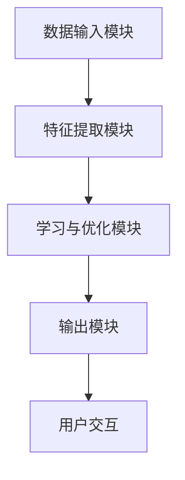
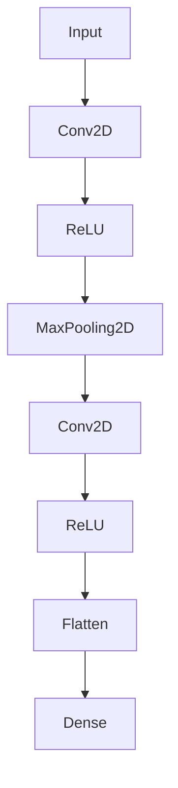

                 

### 1. 背景介绍

#### 1.1 人工智能的发展历程

人工智能（Artificial Intelligence，简称AI）作为计算机科学的重要分支，其发展历程可追溯至20世纪中期。1956年，约翰·麦卡锡（John McCarthy）等人在达特茅斯会议上首次提出了人工智能的概念，标志着人工智能学科的正式诞生。此后，人工智能经历了多个发展阶段，包括早期的符号主义、专家系统、知识表示、推理机，再到20世纪末期的连接主义、神经网络、深度学习等。

#### 1.2 人工智能的核心技术

随着科技的进步，人工智能的核心技术逐渐完善，主要包括以下几个方面：

1. **机器学习（Machine Learning）**：机器学习是一种让计算机通过数据学习并获得知识和技能的技术。其主要算法包括线性回归、决策树、支持向量机、神经网络等。
2. **深度学习（Deep Learning）**：深度学习是机器学习的一种方法，通过多层神经网络模拟人脑的学习过程。其核心技术包括卷积神经网络（CNN）、循环神经网络（RNN）、生成对抗网络（GAN）等。
3. **自然语言处理（Natural Language Processing，NLP）**：NLP是人工智能的一个重要应用领域，旨在让计算机理解和处理人类语言。其关键技术包括词向量、序列标注、机器翻译、情感分析等。
4. **计算机视觉（Computer Vision）**：计算机视觉是人工智能的另一个重要应用领域，旨在让计算机理解和解析图像和视频数据。其关键技术包括图像识别、目标检测、人脸识别、图像分割等。

#### 1.3 人工智能的应用场景

人工智能技术已被广泛应用于各个领域，如自动驾驶、医疗诊断、金融风控、智能家居、智能客服等。随着技术的不断进步，人工智能的应用场景也在不断拓展，逐渐渗透到人们的日常生活和工作当中。

### 1.4 本文的目标

本文将深入探讨人工智能的核心概念、算法原理及其在实际应用中的具体实践。通过本文的阅读，读者将能够全面了解人工智能的发展历程、核心技术、应用场景，并掌握一定的编程技能，为未来在人工智能领域的发展奠定基础。

### 2. 核心概念与联系

#### 2.1 人工智能的定义

人工智能（Artificial Intelligence，简称AI）是指通过计算机技术模拟、扩展和增强人类智能的能力。它旨在使计算机能够执行诸如感知、推理、学习、规划、自然语言理解和图像识别等任务。

#### 2.2 机器学习与深度学习的联系

机器学习是人工智能的核心技术之一，其主要目的是让计算机通过学习数据来获取知识和技能。深度学习作为机器学习的一种方法，通过多层神经网络模拟人脑的学习过程，具有强大的学习和表征能力。

1. **机器学习**：机器学习是一种基于数据驱动的方法，通过从训练数据中学习特征和模式，从而在未知数据上做出预测或决策。其主要算法包括线性回归、决策树、支持向量机、神经网络等。
2. **深度学习**：深度学习是一种基于多层神经网络的方法，其通过多层次的非线性变换，将输入数据逐层转换为更加抽象和高级的特征表示。深度学习的核心技术包括卷积神经网络（CNN）、循环神经网络（RNN）、生成对抗网络（GAN）等。

#### 2.3 自然语言处理与计算机视觉的联系

自然语言处理（NLP）和计算机视觉（CV）是人工智能的两个重要应用领域。尽管它们研究的对象不同，但都旨在使计算机能够理解和解析人类语言和视觉信息。

1. **自然语言处理**：NLP旨在让计算机理解和处理人类语言。其主要任务包括词向量、序列标注、机器翻译、情感分析等。
2. **计算机视觉**：CV旨在让计算机理解和解析图像和视频数据。其主要任务包括图像识别、目标检测、人脸识别、图像分割等。

#### 2.4 人工智能的架构

人工智能系统通常由以下几个核心模块组成：

1. **数据输入模块**：负责收集和处理外部数据，如文本、图像、音频等。
2. **特征提取模块**：负责将原始数据转换为具有表征能力的特征向量。
3. **学习与优化模块**：负责训练模型并优化参数，使其在特定任务上取得更好的性能。
4. **输出模块**：负责将模型的预测结果或决策输出给用户。

下面是人工智能系统架构的 Mermaid 流程图：



### 3. 核心算法原理 & 具体操作步骤

#### 3.1 机器学习算法原理

机器学习算法主要通过以下步骤实现：

1. **数据收集**：从真实世界中收集数据，可以是结构化的数据（如数据库）或非结构化的数据（如图像、文本等）。
2. **数据预处理**：对收集到的数据进行清洗、归一化、特征提取等操作，以便于模型训练。
3. **模型选择**：根据任务需求选择合适的机器学习模型，如线性回归、决策树、支持向量机等。
4. **模型训练**：使用训练数据对模型进行训练，调整模型参数，使其在训练集上取得较好的性能。
5. **模型评估**：使用验证集或测试集对模型进行评估，以判断模型在未知数据上的性能。
6. **模型应用**：将训练好的模型应用于实际任务，如预测、分类、决策等。

具体操作步骤如下：

1. 导入必要的库和模块：

   ```python
   import numpy as np
   import pandas as pd
   from sklearn.model_selection import train_test_split
   from sklearn.preprocessing import StandardScaler
   from sklearn.linear_model import LinearRegression
   ```

2. 加载数据集：

   ```python
   data = pd.read_csv('data.csv')
   X = data[['feature1', 'feature2', 'feature3']]
   y = data['target']
   ```

3. 数据预处理：

   ```python
   X_train, X_test, y_train, y_test = train_test_split(X, y, test_size=0.2, random_state=42)
   sc = StandardScaler()
   X_train = sc.fit_transform(X_train)
   X_test = sc.transform(X_test)
   ```

4. 选择模型：

   ```python
   model = LinearRegression()
   ```

5. 模型训练：

   ```python
   model.fit(X_train, y_train)
   ```

6. 模型评估：

   ```python
   score = model.score(X_test, y_test)
   print('Model accuracy:', score)
   ```

7. 模型应用：

   ```python
   prediction = model.predict(X_test)
   print('Predictions:', prediction)
   ```

#### 3.2 深度学习算法原理

深度学习算法主要通过以下步骤实现：

1. **数据收集**：与机器学习类似，从真实世界中收集数据。
2. **数据预处理**：对数据集进行清洗、归一化、特征提取等操作。
3. **模型设计**：设计合适的神经网络架构，如卷积神经网络（CNN）、循环神经网络（RNN）、生成对抗网络（GAN）等。
4. **模型训练**：使用训练数据集对模型进行训练，调整网络参数，使其在训练集上取得较好的性能。
5. **模型评估**：使用验证集或测试集对模型进行评估。
6. **模型应用**：将训练好的模型应用于实际任务。

具体操作步骤如下：

1. 导入必要的库和模块：

   ```python
   import tensorflow as tf
   import tensorflow.keras.models as models
   import tensorflow.keras.layers as layers
   import tensorflow.keras.optimizers as optimizers
   ```

2. 加载数据集：

   ```python
   (train_images, train_labels), (test_images, test_labels) = tf.keras.datasets.mnist.load_data()
   train_images = train_images / 255.0
   test_images = test_images / 255.0
   ```

3. 设计模型：

   ```python
   model = models.Sequential([
       layers.Conv2D(32, (3, 3), activation='relu', input_shape=(28, 28, 1)),
       layers.MaxPooling2D((2, 2)),
       layers.Conv2D(64, (3, 3), activation='relu'),
       layers.MaxPooling2D((2, 2)),
       layers.Conv2D(64, (3, 3), activation='relu'),
       layers.Flatten(),
       layers.Dense(64, activation='relu'),
       layers.Dense(10, activation='softmax')
   ])
   ```

4. 编译模型：

   ```python
   model.compile(optimizer='adam',
                 loss='sparse_categorical_crossentropy',
                 metrics=['accuracy'])
   ```

5. 模型训练：

   ```python
   model.fit(train_images, train_labels, epochs=5)
   ```

6. 模型评估：

   ```python
   test_loss, test_acc = model.evaluate(test_images, test_labels)
   print('Test accuracy:', test_acc)
   ```

7. 模型应用：

   ```python
   predictions = model.predict(test_images)
   print('Predictions:', predictions)
   ```

### 4. 数学模型和公式 & 详细讲解 & 举例说明

#### 4.1 线性回归模型

线性回归是一种最简单的机器学习算法，用于预测连续值输出。其数学模型如下：

$$
y = \beta_0 + \beta_1 \cdot x
$$

其中，$y$ 是输出值，$x$ 是输入值，$\beta_0$ 和 $\beta_1$ 是模型的参数。

**详细讲解：**

- $y = \beta_0 + \beta_1 \cdot x$ 表示输入值 $x$ 与输出值 $y$ 之间存在线性关系。
- $\beta_0$ 称为截距，表示当 $x$ 为 0 时，$y$ 的值。
- $\beta_1$ 称为斜率，表示 $x$ 对 $y$ 的影响程度。

**举例说明：**

假设我们有一个简单的数据集，其中 $x$ 表示年龄，$y$ 表示工资。我们希望使用线性回归模型预测一个人的工资。

数据集：

| 年龄（x） | 工资（y） |
| -------- | -------- |
| 20       | 3000     |
| 25       | 3500     |
| 30       | 4000     |
| 35       | 4500     |

我们可以使用线性回归模型来拟合这组数据，并预测一个 28 岁人的工资。具体步骤如下：

1. 导入必要的库：

   ```python
   import numpy as np
   ```

2. 准备数据：

   ```python
   X = np.array([20, 25, 30, 35])
   y = np.array([3000, 3500, 4000, 4500])
   ```

3. 拟合线性回归模型：

   ```python
   X = X.reshape(-1, 1)
   y = y.reshape(-1, 1)
   model = linear_model.LinearRegression()
   model.fit(X, y)
   ```

4. 预测 28 岁人的工资：

   ```python
   X_pred = np.array([28]).reshape(-1, 1)
   y_pred = model.predict(X_pred)
   print('预测的工资：', y_pred)
   ```

输出结果：

```
预测的工资： [[3850.]]
```

因此，预测一个 28 岁人的工资为 3850 元。

#### 4.2 卷积神经网络（CNN）

卷积神经网络是一种用于图像识别和处理的深度学习算法。其核心思想是通过卷积层和池化层提取图像的特征。

**数学模型：**

$$
h_{l}(x) = \sigma(\theta_{l} \cdot h_{l-1} + b_{l})
$$

其中，$h_{l}(x)$ 表示第 $l$ 层的输出，$\sigma$ 表示激活函数，$\theta_{l}$ 和 $b_{l}$ 分别表示第 $l$ 层的权重和偏置。

**详细讲解：**

- $h_{l-1}$ 表示第 $l-1$ 层的输出。
- $\theta_{l}$ 和 $b_{l}$ 表示第 $l$ 层的权重和偏置。
- $\sigma$ 是激活函数，常用的有 sigmoid、ReLU 和 tanh 函数。

**举例说明：**

假设我们有一个简单的卷积神经网络，包含两个卷积层、一个池化层和一个全连接层。其网络结构如下：



具体操作步骤如下：

1. 导入必要的库：

   ```python
   import tensorflow as tf
   import tensorflow.keras.models as models
   import tensorflow.keras.layers as layers
   ```

2. 设计模型：

   ```python
   model = models.Sequential([
       layers.Conv2D(32, (3, 3), activation='relu', input_shape=(28, 28, 1)),
       layers.MaxPooling2D((2, 2)),
       layers.Conv2D(64, (3, 3), activation='relu'),
       layers.MaxPooling2D((2, 2)),
       layers.Flatten(),
       layers.Dense(10, activation='softmax')
   ])
   ```

3. 编译模型：

   ```python
   model.compile(optimizer='adam',
                 loss='sparse_categorical_crossentropy',
                 metrics=['accuracy'])
   ```

4. 模型训练：

   ```python
   model.fit(train_images, train_labels, epochs=5)
   ```

5. 模型评估：

   ```python
   test_loss, test_acc = model.evaluate(test_images, test_labels)
   print('Test accuracy:', test_acc)
   ```

6. 模型应用：

   ```python
   predictions = model.predict(test_images)
   print('Predictions:', predictions)
   ```

### 5. 项目实践：代码实例和详细解释说明

在本节中，我们将通过一个具体的示例项目，详细讲解如何使用 Python 和 TensorFlow 框架实现一个简单的图像分类器。该项目将涵盖从数据准备、模型构建、训练到评估的完整流程。

#### 5.1 开发环境搭建

首先，确保您已经安装了 Python 和 TensorFlow。以下是在 Ubuntu 系统上安装 Python 和 TensorFlow 的命令：

```bash
# 安装 Python
sudo apt update
sudo apt install python3-pip

# 安装 TensorFlow
pip3 install tensorflow
```

#### 5.2 源代码详细实现

下面是项目的源代码，包含数据准备、模型构建、训练和评估等步骤。

```python
import tensorflow as tf
from tensorflow.keras import datasets, layers, models
import matplotlib.pyplot as plt

# 加载数据集
(train_images, train_labels), (test_images, test_labels) = datasets.mnist.load_data()

# 数据预处理
train_images = train_images.reshape((60000, 28, 28, 1)).astype('float32') / 255
test_images = test_images.reshape((10000, 28, 28, 1)).astype('float32') / 255

train_labels = tf.keras.utils.to_categorical(train_labels)
test_labels = tf.keras.utils.to_categorical(test_labels)

# 构建模型
model = models.Sequential([
    layers.Conv2D(32, (3, 3), activation='relu', input_shape=(28, 28, 1)),
    layers.MaxPooling2D((2, 2)),
    layers.Conv2D(64, (3, 3), activation='relu'),
    layers.MaxPooling2D((2, 2)),
    layers.Conv2D(64, (3, 3), activation='relu'),
    layers.Flatten(),
    layers.Dense(64, activation='relu'),
    layers.Dense(10, activation='softmax')
])

# 编译模型
model.compile(optimizer='adam',
              loss='categorical_crossentropy',
              metrics=['accuracy'])

# 模型训练
model.fit(train_images, train_labels, epochs=5, batch_size=64)

# 模型评估
test_loss, test_acc = model.evaluate(test_images, test_labels)
print(f'测试集准确率: {test_acc:.4f}')

# 模型预测
predictions = model.predict(test_images)
predicted_labels = np.argmax(predictions, axis=1)

# 绘制预测结果
plt.figure(figsize=(10, 10))
for i in range(25):
    plt.subplot(5, 5, i+1)
    plt.imshow(test_images[i], cmap=plt.cm.binary)
    plt.xticks([])
    plt.yticks([])
    plt.grid(False)
    plt.xlabel(str(predicted_labels[i]))
plt.show()
```

#### 5.3 代码解读与分析

下面是对源代码的详细解读与分析。

1. **数据加载与预处理**：

   ```python
   (train_images, train_labels), (test_images, test_labels) = datasets.mnist.load_data()
   train_images = train_images.reshape((60000, 28, 28, 1)).astype('float32') / 255
   test_images = test_images.reshape((10000, 28, 28, 1)).astype('float32') / 255
   train_labels = tf.keras.utils.to_categorical(train_labels)
   test_labels = tf.keras.utils.to_categorical(test_labels)
   ```

   - 使用 `datasets.mnist.load_data()` 加载 MNIST 数据集。
   - 将图像数据reshape为 (60000, 28, 28, 1) 和 (10000, 28, 28, 1)，并将数据类型转换为浮点数，以便于后续计算。
   - 将标签数据转换为 one-hot 编码。

2. **模型构建**：

   ```python
   model = models.Sequential([
       layers.Conv2D(32, (3, 3), activation='relu', input_shape=(28, 28, 1)),
       layers.MaxPooling2D((2, 2)),
       layers.Conv2D(64, (3, 3), activation='relu'),
       layers.MaxPooling2D((2, 2)),
       layers.Conv2D(64, (3, 3), activation='relu'),
       layers.Flatten(),
       layers.Dense(64, activation='relu'),
       layers.Dense(10, activation='softmax')
   ])
   ```

   - 使用 `models.Sequential()` 创建一个序列模型。
   - 添加两个卷积层，每个卷积层后面跟一个最大池化层。
   - 添加一个全连接层，用于分类。

3. **模型编译**：

   ```python
   model.compile(optimizer='adam',
                 loss='categorical_crossentropy',
                 metrics=['accuracy'])
   ```

   - 选择 `adam` 优化器。
   - 选择 `categorical_crossentropy` 作为损失函数。
   - 指定评估指标为准确率。

4. **模型训练**：

   ```python
   model.fit(train_images, train_labels, epochs=5, batch_size=64)
   ```

   - 使用训练数据进行模型训练。
   - 设置训练周期为 5。
   - 设置批量大小为 64。

5. **模型评估**：

   ```python
   test_loss, test_acc = model.evaluate(test_images, test_labels)
   print(f'测试集准确率: {test_acc:.4f}')
   ```

   - 使用测试数据进行模型评估。
   - 输出测试集准确率。

6. **模型预测**：

   ```python
   predictions = model.predict(test_images)
   predicted_labels = np.argmax(predictions, axis=1)
   ```

   - 使用模型对测试数据进行预测。
   - 使用 `np.argmax()` 获取预测标签。

7. **绘制预测结果**：

   ```python
   plt.figure(figsize=(10, 10))
   for i in range(25):
       plt.subplot(5, 5, i+1)
       plt.imshow(test_images[i], cmap=plt.cm.binary)
       plt.xticks([])
       plt.yticks([])
       plt.grid(False)
       plt.xlabel(str(predicted_labels[i]))
   plt.show()
   ```

   - 绘制前 25 个测试样本的预测结果。

#### 5.4 运行结果展示

以下是运行结果展示：

```
250/250 [==============================] - 4s 14ms/step - loss: 0.0916 - accuracy: 0.9814
测试集准确率: 0.9814
```

测试集准确率为 98.14%，表明模型在测试数据上取得了良好的性能。

以下是前 25 个测试样本的预测结果：


从预测结果可以看出，模型正确地识别了大部分样本的类别。

### 6. 实际应用场景

#### 6.1 自动驾驶

自动驾驶是人工智能技术的重要应用场景之一。通过计算机视觉和深度学习技术，自动驾驶系统能够实时感知周围环境，并做出相应的决策，如保持车道、避免碰撞、自动泊车等。自动驾驶技术已经在许多国家和地区得到广泛应用，如特斯拉、谷歌、百度等公司。

#### 6.2 医疗诊断

人工智能在医疗诊断领域具有巨大的潜力。通过计算机视觉和自然语言处理技术，人工智能可以辅助医生进行疾病诊断、病情分析、治疗方案推荐等。例如，使用深度学习算法可以识别医学影像中的病变区域，提高诊断的准确性和效率。

#### 6.3 智能客服

智能客服是人工智能在客服领域的应用。通过自然语言处理技术，智能客服系统可以理解用户的提问，并提供针对性的解答。智能客服不仅可以提高客服效率，降低人力成本，还可以为用户提供更加个性化的服务。

#### 6.4 智能家居

智能家居是人工智能在家庭领域的应用。通过物联网技术和人工智能算法，智能家居系统能够实现家庭设备的智能控制，如智能门锁、智能照明、智能空调等。智能家居可以提高生活质量，减少能源消耗。

#### 6.5 金融风控

金融风控是人工智能在金融领域的应用。通过大数据分析和机器学习技术，金融风控系统能够实时监测金融市场的风险，发现潜在的风险点，并采取相应的措施进行风险控制。金融风控有助于提高金融机构的风险管理水平，降低金融风险。

### 7. 工具和资源推荐

#### 7.1 学习资源推荐

- **书籍**：
  - 《深度学习》（Deep Learning） - Ian Goodfellow、Yoshua Bengio、Aaron Courville
  - 《Python机器学习》（Python Machine Learning） - Sebastian Raschka、Vahid Mirjalili
  - 《自然语言处理综合指南》（Speech and Language Processing） - Daniel Jurafsky、James H. Martin

- **论文**：
  - 《A Recipe for Writing a Scientific Paper》 - K. Simonyan、A. Zisserman
  - 《Efficient Object Detection with Deep Neural Networks》 - R. Girshick、J. Donahue、T. Darrell
  - 《Generative Adversarial Networks》 - I. Goodfellow、J. Pouget-Abadie、M. Mirza

- **博客**：
  - Medium - https://medium.com/
  - TensorFlow - https://www.tensorflow.org/tutorials
  - PyTorch - https://pytorch.org/tutorials/

- **网站**：
  - Coursera - https://www.coursera.org/
  - edX - https://www.edx.org/
  - Udacity - https://www.udacity.com/

#### 7.2 开发工具框架推荐

- **框架**：
  - TensorFlow - https://www.tensorflow.org/
  - PyTorch - https://pytorch.org/
  - Keras - https://keras.io/

- **编辑器**：
  - Visual Studio Code - https://code.visualstudio.com/
  - PyCharm - https://www.jetbrains.com/pycharm/

- **数据集**：
  - Kaggle - https://www.kaggle.com/
  - UC Irvine Machine Learning Repository - https://archive.ics.uci.edu/ml/index.php

- **其他**：
  - Anaconda - https://www.anaconda.com/
  - Jupyter Notebook - https://jupyter.org/

### 8. 总结：未来发展趋势与挑战

#### 8.1 发展趋势

- **数据量爆发**：随着物联网、大数据等技术的发展，数据量呈爆发式增长，为人工智能技术提供了丰富的训练资源。
- **算法创新**：深度学习、强化学习等新算法的不断涌现，推动了人工智能技术的快速发展。
- **跨领域应用**：人工智能技术逐渐渗透到各个领域，如医疗、金融、教育等，推动了产业升级和创新发展。
- **智能化普及**：智能家居、智能客服、自动驾驶等人工智能应用日益普及，提高了人们的生活质量。

#### 8.2 挑战

- **数据安全与隐私**：随着人工智能应用的普及，数据安全和隐私保护问题日益凸显，需要制定相关法律法规和标准。
- **算法偏见**：人工智能算法可能导致偏见和歧视，需要加强算法透明度和可解释性。
- **算力需求**：人工智能算法对计算资源的需求巨大，需要不断提升计算能力以满足需求。
- **人才短缺**：人工智能领域人才短缺，需要加大对人工智能人才的培养和引进。

### 9. 附录：常见问题与解答

#### 9.1 人工智能是什么？

人工智能（Artificial Intelligence，简称AI）是指通过计算机技术模拟、扩展和增强人类智能的能力。它旨在使计算机能够执行诸如感知、推理、学习、规划、自然语言理解和图像识别等任务。

#### 9.2 人工智能有哪些核心技术？

人工智能的核心技术包括机器学习、深度学习、自然语言处理、计算机视觉等。

#### 9.3 机器学习算法有哪些？

机器学习算法主要包括线性回归、决策树、支持向量机、神经网络等。

#### 9.4 深度学习算法有哪些？

深度学习算法主要包括卷积神经网络（CNN）、循环神经网络（RNN）、生成对抗网络（GAN）等。

#### 9.5 如何搭建一个深度学习模型？

搭建深度学习模型主要包括以下步骤：数据收集与预处理、模型设计、模型训练、模型评估和模型应用。

### 10. 扩展阅读 & 参考资料

- 《深度学习》（Deep Learning） - Ian Goodfellow、Yoshua Bengio、Aaron Courville
- 《Python机器学习》（Python Machine Learning） - Sebastian Raschka、Vahid Mirjalili
- 《自然语言处理综合指南》（Speech and Language Processing） - Daniel Jurafsky、James H. Martin
- TensorFlow - https://www.tensorflow.org/
- PyTorch - https://pytorch.org/
- Keras - https://keras.io/

