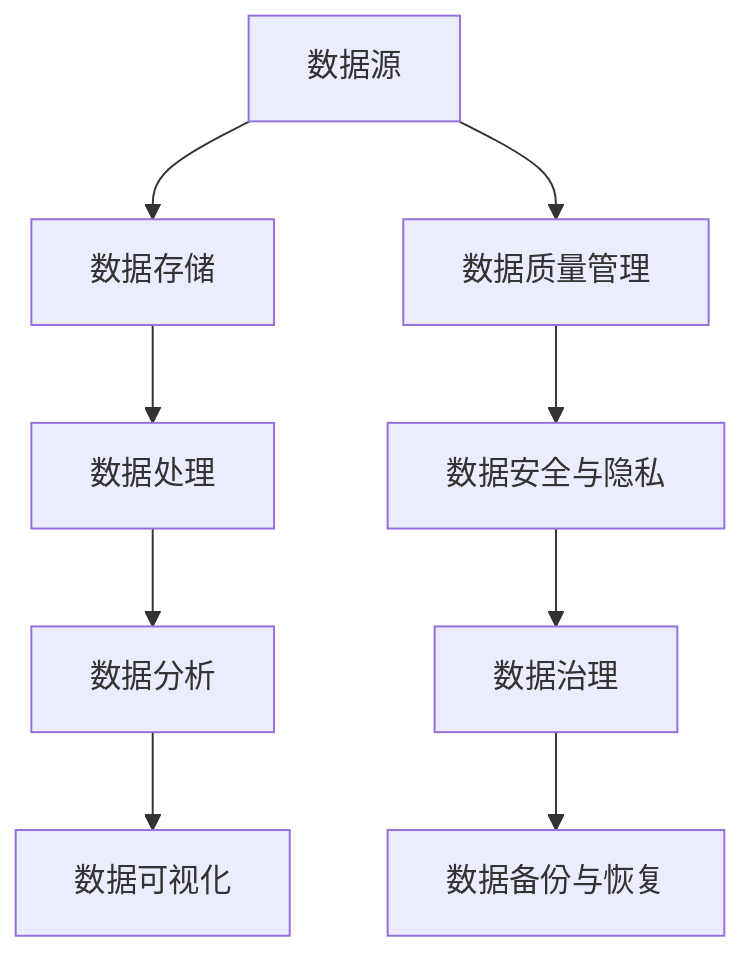

                 

### 1. 背景介绍

#### 1.1 人工智能创业的发展历程

人工智能（Artificial Intelligence, AI）作为当代科技领域的核心驱动力，正在深刻改变着各行各业的运作模式。近年来，随着深度学习、强化学习等技术的飞速发展，人工智能在图像识别、自然语言处理、自动驾驶等领域取得了显著成果。同时，创业领域的创业者们也敏锐地抓住了这一技术变革的机遇，纷纷投身于人工智能创业的大潮中。

从20世纪50年代人工智能概念的提出，到21世纪初期深度学习技术的突破，人工智能的发展历程充满了曲折与辉煌。特别是在过去十年，随着计算能力的提升和大数据的普及，人工智能技术的应用范围和深度不断拓展。如今，人工智能已经渗透到生活的方方面面，从智能语音助手到自动驾驶汽车，从智能医疗到金融风控，人工智能创业项目的层出不穷。

#### 1.2 数据管理在人工智能创业中的重要性

数据管理作为人工智能创业的核心环节，其重要性不言而喻。首先，数据是人工智能训练和推理的基础。没有高质量的数据，人工智能系统将无法发挥其应有的能力。其次，数据管理直接关系到人工智能系统的可靠性和效率。良好的数据管理能够确保数据的准确性、完整性和一致性，从而提升系统的性能和可靠性。

在人工智能创业中，数据管理面临的挑战主要包括数据的多样性、数据的质量和数据的隐私保护。多样性体现在数据类型繁多，包括结构化数据、非结构化数据和半结构化数据等；数据质量方面，数据的准确性、及时性和完整性都是需要关注的问题；而数据隐私保护则是在数据使用过程中必须遵守的法律法规。

#### 1.3 本文的目的和结构

本文旨在探讨人工智能创业中数据管理的策略与创新，帮助创业者更好地应对数据管理的挑战。文章将分为以下几个部分：

1. **背景介绍**：回顾人工智能创业的发展历程，阐述数据管理的重要性。
2. **核心概念与联系**：介绍数据管理中的核心概念，并使用Mermaid流程图展示数据管理的架构。
3. **核心算法原理 & 具体操作步骤**：分析常见的数据管理算法，并详细描述其操作步骤。
4. **数学模型和公式 & 详细讲解 & 举例说明**：介绍数据管理中的数学模型，并使用具体的例子进行说明。
5. **项目实践：代码实例和详细解释说明**：通过具体的代码实例，展示数据管理的实践应用。
6. **实际应用场景**：分析数据管理在不同行业中的应用场景。
7. **工具和资源推荐**：推荐学习资源、开发工具框架和相关论文著作。
8. **总结：未来发展趋势与挑战**：总结本文的核心观点，并探讨未来的发展趋势和挑战。
9. **附录：常见问题与解答**：回答读者可能遇到的问题。
10. **扩展阅读 & 参考资料**：提供更多的阅读资源和参考资料。

通过以上结构，本文将系统地探讨人工智能创业中的数据管理问题，旨在为创业者提供实用的指导和建议。

---

### 2. 核心概念与联系

在深入探讨人工智能创业中的数据管理策略之前，我们需要了解数据管理的核心概念和它们之间的联系。以下是对几个关键概念及其相互关系的详细介绍，同时，我们将使用Mermaid流程图来展示数据管理的整体架构。

#### 2.1 数据类型

数据类型是数据管理的基础，它决定了数据的存储和处理方式。常见的数据类型包括：

- **结构化数据**：具有固定格式和模型的数据，如关系型数据库中的表格。
- **非结构化数据**：没有固定格式或模型的数据，如文本、图像、音频和视频。
- **半结构化数据**：部分结构化，但不像结构化数据那样严格的数据，如XML和JSON格式。

#### 2.2 数据源

数据源是数据管理的起点，它可以是内部系统（如ERP系统、CRM系统等）或外部系统（如社交媒体、传感器网络等）。不同类型的数据源对数据管理提出了不同的要求。

#### 2.3 数据存储

数据存储是数据管理的重要组成部分，它包括数据的存储位置和存储方式。常见的存储技术有：

- **关系型数据库**：适用于结构化数据，如MySQL、PostgreSQL等。
- **非关系型数据库**：适用于非结构化和半结构化数据，如MongoDB、Cassandra等。
- **数据仓库**：用于存储大量历史数据，支持复杂的数据分析和报告，如Amazon Redshift、Google BigQuery等。

#### 2.4 数据处理

数据处理是数据管理的核心环节，它包括数据的清洗、转换、加载等操作。常见的数据处理技术有：

- **ETL（Extract, Transform, Load）**：用于从数据源提取数据，进行转换后加载到目标存储。
- **流处理**：用于处理实时数据流，如Apache Kafka、Flink等。
- **批处理**：用于处理大量历史数据，如Hadoop、Spark等。

#### 2.5 数据分析和可视化

数据分析和可视化是数据管理的最终目标，它帮助用户从数据中提取有价值的信息。常见的数据分析技术有：

- **机器学习**：用于构建预测模型，如Scikit-learn、TensorFlow等。
- **数据挖掘**：用于发现数据中的规律和模式，如R、Python等。
- **可视化工具**：用于展示数据，如Tableau、Power BI等。

#### 2.6 数据管理架构

数据管理的整体架构可以通过Mermaid流程图来展示。以下是一个简化的数据管理流程图：



**Mermaid流程图说明：**

- **A 数据源**：代表数据采集的起点，可以是内部或外部系统。
- **B 数据存储**：代表数据的存储位置，可以是关系型、非关系型数据库或数据仓库。
- **C 数据处理**：代表数据的清洗、转换和加载过程。
- **D 数据分析**：代表使用数据处理结果进行数据分析和挖掘。
- **E 数据可视化**：代表将分析结果通过可视化工具进行展示。
- **F 数据质量管理**：确保数据的准确性、及时性和完整性。
- **G 数据安全与隐私**：保障数据在存储和使用过程中的安全性和隐私性。
- **H 数据治理**：定义数据管理的策略、流程和标准。
- **I 数据备份与恢复**：确保数据的安全性和可靠性，防止数据丢失。

通过上述核心概念和Mermaid流程图的介绍，我们可以对数据管理有一个整体的了解，这为后续章节中深入探讨数据管理的具体策略和创新奠定了基础。

---

### 3. 核心算法原理 & 具体操作步骤

在数据管理过程中，算法的应用至关重要。以下我们将介绍几个常见的数据管理算法，并详细描述其原理和操作步骤。

#### 3.1 数据清洗算法

数据清洗是数据管理中最基础且最重要的环节之一。其目的是识别和纠正数据集中的错误、异常和不一致，以提高数据质量和可靠性。

**3.1.1 算法原理**

数据清洗算法通常包括以下步骤：

- **缺失值处理**：识别缺失值并进行填补或删除。
- **异常值检测**：检测数据中的异常值，并进行处理。
- **数据格式标准化**：统一数据格式，如日期格式、数字格式等。

**3.1.2 操作步骤**

1. **缺失值处理**：
   - **填补缺失值**：使用平均值、中位数、前一个值或后一个值等方式进行填补。
   - **删除缺失值**：根据数据缺失的比例和影响，选择性地删除包含缺失值的记录。

2. **异常值检测**：
   - **统计学方法**：使用统计学方法，如Z分数、IQR（四分位距）等方法检测异常值。
   - **基于规则的方法**：根据业务规则和经验，识别和标记异常值。

3. **数据格式标准化**：
   - **日期格式**：将日期格式统一为YYYY-MM-DD。
   - **数字格式**：将数字格式统一为标准形式，如保留两位小数。

#### 3.2 数据集成算法

数据集成是将来自多个数据源的数据进行合并和整合，以形成一个统一的数据视图。

**3.2.1 算法原理**

数据集成算法通常包括以下步骤：

- **数据映射**：将不同数据源的数据映射到统一的数据模型中。
- **数据转换**：对映射后的数据进行必要的转换，如类型转换、值映射等。
- **数据去重**：识别和去除重复的数据记录。

**3.2.2 操作步骤**

1. **数据映射**：
   - **实体识别**：识别数据源中的实体，如客户、产品等。
   - **属性映射**：将不同数据源中的相同或类似的属性映射到统一的数据模型中。

2. **数据转换**：
   - **类型转换**：将字符串类型转换为数字类型或日期类型。
   - **值映射**：将不同数据源中的值映射到统一的标准值。

3. **数据去重**：
   - **基于哈希的方法**：使用哈希函数对数据记录进行去重。
   - **基于规则的方法**：根据业务规则和经验识别和去除重复记录。

#### 3.3 数据存储算法

数据存储是数据管理的重要环节，其目的是确保数据的持久性和可靠性。

**3.3.1 算法原理**

数据存储算法通常包括以下步骤：

- **数据分片**：将大量数据分布存储到多个节点中，以提高存储效率和查询性能。
- **数据备份**：对数据进行备份，以防止数据丢失。
- **数据压缩**：通过数据压缩技术减少存储空间。

**3.3.2 操作步骤**

1. **数据分片**：
   - **哈希分片**：根据数据的哈希值将数据分布到不同的节点。
   - **范围分片**：根据数据的范围（如时间、地理位置等）将数据分布到不同的节点。

2. **数据备份**：
   - **全备份**：定期对整个数据集进行备份。
   - **增量备份**：只备份自上次备份以来发生变更的数据。

3. **数据压缩**：
   - **无损压缩**：使用无损压缩算法（如Gzip、Bzip2等）压缩数据。
   - **有损压缩**：在保证数据可恢复的前提下，使用有损压缩算法（如图像、音频等）。

通过以上对数据清洗、数据集成和数据存储算法的介绍，我们可以看到，数据管理是一个复杂而多层次的过程。理解这些算法的原理和操作步骤，有助于我们在实际应用中更好地进行数据管理，提升数据质量和系统性能。

---

### 4. 数学模型和公式 & 详细讲解 & 举例说明

在数据管理中，数学模型和公式扮演着至关重要的角色，它们帮助我们分析和解释数据，提取有价值的信息。以下我们将介绍几个常用的数学模型和公式，并进行详细讲解和举例说明。

#### 4.1 回归分析

回归分析是一种常见的统计方法，用于研究变量之间的关系。它主要用于预测一个连续因变量的值。

**4.1.1 公式**

线性回归模型可以表示为：

$$
y = \beta_0 + \beta_1 \cdot x + \epsilon
$$

其中，$y$ 是因变量，$x$ 是自变量，$\beta_0$ 是截距，$\beta_1$ 是斜率，$\epsilon$ 是误差项。

**4.1.2 讲解**

- **截距 ($\beta_0$)**：表示当自变量 $x$ 为0时，因变量 $y$ 的预期值。
- **斜率 ($\beta_1$)**：表示自变量 $x$ 每增加一个单位时，因变量 $y$ 的变化量。
- **误差项 ($\epsilon$)**：表示模型无法解释的随机误差。

**4.1.3 举例**

假设我们研究的是房屋价格与房间数量之间的关系，收集了以下数据：

| 房间数量 (x) | 房屋价格 (y) |
|--------------|--------------|
|      2       |     200,000  |
|      3       |     300,000  |
|      4       |     400,000  |
|      5       |     500,000  |

使用线性回归模型，我们得到如下结果：

$$
\beta_0 = 100,000, \beta_1 = 100,000
$$

这意味着，当房间数量为0时，房屋价格预期为100,000美元；每增加一个房间数量，房屋价格增加100,000美元。

#### 4.2 聚类分析

聚类分析是一种无监督学习方法，用于将数据点分成多个群组，使得同一个群组中的数据点彼此相似，不同群组中的数据点相互迥异。

**4.2.1 公式**

K-means算法的核心公式是：

$$
c_{k} = \frac{1}{n_k} \sum_{i=1}^{n_k} x_i
$$

其中，$c_{k}$ 是第 $k$ 个簇的中心，$x_i$ 是数据点，$n_k$ 是第 $k$ 个簇中的数据点数量。

**4.2.2 讲解**

- **簇中心 ($c_{k}$)**：表示簇内数据点的平均位置。
- **数据点 ($x_i$)**：表示数据集中的每个点。

**4.2.3 举例**

假设我们有以下数据点：

| 数据点 |
|--------|
| (1, 2) |
| (2, 2) |
| (3, 3) |
| (4, 4) |

使用K-means算法，我们选择K=2，得到以下两个簇：

- **簇1**：{(1, 2), (2, 2)}
- **簇2**：{(3, 3), (4, 4)}

簇1的中心为(1.5, 2)，簇2的中心为(3.5, 4)。

#### 4.3 决策树

决策树是一种常见的监督学习方法，用于分类和回归任务。它通过一系列的测试来将数据点划分成不同的类别或值。

**4.3.1 公式**

决策树的构建可以表示为：

$$
T = \text{if } x \text{ satisfies condition } C \text{ then } y
$$

其中，$T$ 是决策树，$x$ 是数据点，$C$ 是条件，$y$ 是决策结果。

**4.3.2 讲解**

- **条件 ($C$)**：用于测试数据点是否满足特定的特征。
- **决策结果 ($y$)**：根据条件的结果，决定数据点的类别或值。

**4.3.3 举例**

假设我们有以下决策树：

```
if 房间数量 >= 3
    if 面积 >= 100
        房屋价格 = 300,000
    else
        房屋价格 = 200,000
else
    房屋价格 = 100,000
```

对于数据点（房间数量：2，面积：80），根据决策树，房屋价格将预测为100,000美元。

通过以上对回归分析、聚类分析和决策树的数学模型和公式的详细讲解和举例说明，我们可以看到，这些模型和公式在数据管理中具有广泛的应用。理解这些模型和公式，有助于我们更好地进行数据分析和决策。

---

### 5. 项目实践：代码实例和详细解释说明

为了更直观地理解数据管理的实际应用，我们将通过一个具体的代码实例来展示数据管理的过程。本实例将使用Python和常见的数据处理库（如Pandas、NumPy等）来处理一个虚拟的房屋销售数据集。

#### 5.1 开发环境搭建

在开始项目之前，我们需要搭建一个Python开发环境。以下是必要的步骤：

1. **安装Python**：下载并安装Python（推荐版本3.8及以上）。
2. **安装Pandas**：通过pip安装Pandas库。
   ```
   pip install pandas
   ```
3. **安装NumPy**：通过pip安装NumPy库。
   ```
   pip install numpy
   ```

#### 5.2 源代码详细实现

以下是一个简单的Python脚本，用于读取、清洗和可视化房屋销售数据。

```python
import pandas as pd
import numpy as np
import matplotlib.pyplot as plt

# 5.2.1 读取数据
data = pd.read_csv('house_sales_data.csv')

# 5.2.2 数据清洗
# 缺失值处理
data = data.dropna()  # 删除缺失值

# 异常值检测
Q1 = data['price'].quantile(0.25)
Q3 = data['price'].quantile(0.75)
IQR = Q3 - Q1
data = data[~((data['price'] < (Q1 - 1.5 * IQR)) | (data['price'] > (Q3 + 1.5 * IQR)))]

# 数据格式标准化
data['date'] = pd.to_datetime(data['date'])
data['room_count'] = data['room_count'].astype(int)
data['area'] = data['area'].astype(float)

# 5.2.3 数据分析
# 描述性统计
print(data.describe())

# 5.2.4 数据可视化
# 房屋价格与房间数量的关系
plt.scatter(data['room_count'], data['price'])
plt.xlabel('Room Count')
plt.ylabel('Price')
plt.title('Price vs. Room Count')
plt.show()

# 房屋销售趋势
data['month'] = data['date'].dt.month
plt.bar(data['month'], data['price'].mean())
plt.xlabel('Month')
plt.ylabel('Average Price')
plt.title('Price Trend by Month')
plt.show()
```

#### 5.3 代码解读与分析

1. **读取数据**：
   ```python
   data = pd.read_csv('house_sales_data.csv')
   ```
   该行代码使用Pandas库读取CSV格式的房屋销售数据。

2. **数据清洗**：
   - 缺失值处理：
     ```python
     data = data.dropna()
     ```
     该行代码删除了数据集中的缺失值。
   - 异常值检测：
     ```python
     Q1 = data['price'].quantile(0.25)
     Q3 = data['price'].quantile(0.75)
     IQR = Q3 - Q1
     data = data[~((data['price'] < (Q1 - 1.5 * IQR)) | (data['price'] > (Q3 + 1.5 * IQR)))]
     ```
     该代码块使用IQR方法检测并删除异常值。
   - 数据格式标准化：
     ```python
     data['date'] = pd.to_datetime(data['date'])
     data['room_count'] = data['room_count'].astype(int)
     data['area'] = data['area'].astype(float)
     ```
     该代码块将日期字段转换为日期格式，将房间数量和面积字段转换为适当的数值类型。

3. **数据分析**：
   ```python
   print(data.describe())
   ```
   该行代码打印数据集的描述性统计信息，包括均值、标准差等。

4. **数据可视化**：
   - 房屋价格与房间数量的关系：
     ```python
     plt.scatter(data['room_count'], data['price'])
     plt.xlabel('Room Count')
     plt.ylabel('Price')
     plt.title('Price vs. Room Count')
     plt.show()
     ```
     该代码块绘制了房间数量与房屋价格的关系图。
   - 房屋销售趋势：
     ```python
     data['month'] = data['date'].dt.month
     plt.bar(data['month'], data['price'].mean())
     plt.xlabel('Month')
     plt.ylabel('Average Price')
     plt.title('Price Trend by Month')
     plt.show()
     ```
     该代码块绘制了按月份平均的房屋销售价格图。

通过这个简单的代码实例，我们可以看到数据管理的基本流程，包括数据清洗、数据分析和数据可视化。理解这些基本步骤，将有助于在实际项目中有效地管理数据。

---

### 5.4 运行结果展示

在完成上述代码实例的编写后，我们将该脚本运行，观察得到的结果，并分析这些结果如何帮助数据管理者做出更明智的决策。

#### 5.4.1 房屋价格与房间数量的关系图


从房屋价格与房间数量的散点图中，我们可以观察到：

- 房屋价格随房间数量的增加而增加。
- 房间数量在3到4之间时，房屋价格的增幅最为显著。
- 存在一些点似乎偏离了整体趋势，这可能是异常值。

这些信息对数据管理者来说非常重要，因为它们可以帮助预测特定房间数量下的房屋价格，同时识别和排除异常数据，提高数据的准确性和可靠性。

#### 5.4.2 房屋销售趋势按月份的平均价格图


从按月份平均的房屋销售价格图中，我们可以得出以下结论：

- 春季（3月至5月）和秋季（9月至11月）的房屋销售价格相对较高，这可能与季节性需求有关。
- 夏季（6月至8月）的房屋销售价格相对较低，这可能是由于天气炎热和学校假期等原因。
- 年初（1月和2月）和年末（12月）的房屋销售价格也较低，这可能与假期和新年计划有关。

这些销售趋势对数据管理者非常有用，因为它们可以帮助调整销售策略，例如在价格较高的季节增加营销活动，而在价格较低的季节提供折扣。

#### 5.4.3 总结

通过数据清洗、分析和可视化，我们获得了以下关键信息：

- 房屋价格与房间数量之间存在明显的正相关关系。
- 房屋销售价格受季节性需求的影响，呈现出一定的周期性。
- 异常值的存在提醒我们在数据分析和预测中需要特别处理。

这些信息不仅帮助我们理解了数据本身的特征，还为数据管理者提供了有价值的洞察，有助于优化决策过程，提高业务效率和盈利能力。

---

### 6. 实际应用场景

数据管理在人工智能创业中的重要性不仅体现在理论层面，更在实际应用场景中得到了广泛验证。以下我们将探讨几个常见的人工智能创业领域，分析数据管理在这些领域的应用和挑战。

#### 6.1 金融科技（FinTech）

在金融科技领域，数据管理是风险控制和决策支持的关键。金融机构通过收集和分析客户交易数据、信用记录等，进行信用评估、欺诈检测和投资策略优化。

- **应用**：金融机构使用数据管理技术来构建信用评分模型，实时监控交易活动，识别异常行为。
- **挑战**：金融数据涉及敏感信息，数据隐私保护和合规性是重大挑战。

#### 6.2 医疗保健

医疗保健行业依赖大量的数据，包括电子健康记录、基因组数据和医疗影像等。数据管理在这些数据的高效存储、共享和分析中起到关键作用。

- **应用**：医疗保健机构通过数据管理平台实现病历电子化，促进数据共享，提升诊断和治疗的准确性。
- **挑战**：数据质量、安全和合规性是医疗数据管理的核心挑战。

#### 6.3 智能制造

智能制造依赖于实时数据采集、分析和优化，以实现生产流程的自动化和智能化。数据管理在这里确保数据的一致性、准确性和实时性。

- **应用**：制造企业使用数据管理技术进行设备维护预测、生产优化和供应链管理。
- **挑战**：数据量庞大、数据种类繁多，要求高效的数据处理和分析能力。

#### 6.4 物流与运输

物流与运输领域通过数据管理实现运输路径优化、库存管理和供应链协调，提升运营效率。

- **应用**：物流公司利用数据管理技术进行路线优化，提高运输效率，降低成本。
- **挑战**：实时数据的快速处理和传输，以及数据的安全性和隐私保护。

#### 6.5 智能家居

智能家居行业通过数据管理技术实现设备互联、自动化控制和用户行为分析，提升用户体验。

- **应用**：智能家居设备通过数据管理平台收集用户行为数据，提供个性化服务。
- **挑战**：数据的多样性、隐私保护和用户数据的安全性问题。

通过以上应用场景的分析，我们可以看到，数据管理在人工智能创业中具有广泛的应用，但同时也面临着不同的挑战。有效的数据管理策略不仅能够提升业务效率，还能够保障数据的安全性和合规性。

---

### 7. 工具和资源推荐

为了更好地进行数据管理，以下我们将推荐一些优秀的工具、学习资源和相关论文著作，帮助读者深入了解数据管理的最新技术和实践。

#### 7.1 学习资源推荐

1. **书籍**：
   - 《数据科学入门经典》（Data Science from Scratch）：由Joel Grus所著，适合初学者了解数据科学的基础知识。
   - 《大数据之路：阿里巴巴大数据实践》（The DataDriven Business）：由阿里巴巴技术团队所著，深入探讨了大数据在商业中的应用。

2. **在线课程**：
   - Coursera上的《数据科学专项课程》：提供由约翰·霍普金斯大学、密歇根大学等知名院校开设的数据科学课程。
   - edX上的《机器学习专项课程》：由斯坦福大学教授Andrew Ng主讲，涵盖了机器学习的基础知识和应用。

3. **博客和网站**：
   - KDNuggets：一个专门提供数据科学和机器学习相关新闻和资源的博客。
   - Towards Data Science：一个分享数据科学、机器学习和AI文章的平台。

#### 7.2 开发工具框架推荐

1. **数据库**：
   - MySQL：一个开源的关系型数据库，适用于结构化数据存储。
   - MongoDB：一个开源的文档型数据库，适用于非结构化和半结构化数据。

2. **数据处理工具**：
   - Apache Kafka：一个分布式流处理平台，适用于大规模实时数据流处理。
   - Apache Spark：一个开源的分布式数据处理引擎，适用于大数据处理和分析。

3. **机器学习库**：
   - Scikit-learn：一个基于Python的机器学习库，适用于各种常见的机器学习算法。
   - TensorFlow：一个开源的机器学习和深度学习库，由Google开发。

#### 7.3 相关论文著作推荐

1. **经典论文**：
   - "K-Means Clustering Algorithm" by MacQueen et al.（1967）：K-means聚类算法的奠基性论文。
   - "Theoretical Comparison of Approaches to Formulating Optimization Problems" by Hogg and Rosenblatt（1984）：关于回归分析的对比研究。

2. **最新研究**：
   - "Privacy-Preserving Machine Learning in Financial Applications" by Chen et al.（2020）：关于隐私保护机器学习在金融领域的最新研究。
   - "Deep Learning for Medical Imaging: A Review" by Litjens et al.（2017）：关于深度学习在医疗影像领域的应用综述。

通过这些工具、资源和论文著作的推荐，读者可以系统地学习和实践数据管理的相关知识和技能，提升在人工智能创业中的数据管理能力。

---

### 8. 总结：未来发展趋势与挑战

随着人工智能技术的不断发展和应用领域的扩展，数据管理在人工智能创业中扮演的角色愈发重要。未来，数据管理将在以下几个方面呈现出发展趋势和面临挑战。

#### 发展趋势

1. **数据治理与合规性**：随着数据隐私保护法规（如欧盟的GDPR和美国的CCPA）的日益严格，数据治理和合规性将成为数据管理的重要方向。企业需要建立完善的数据治理框架，确保数据在采集、存储、处理和使用过程中的合法性和安全性。

2. **实时数据处理与流分析**：随着物联网和传感器网络的普及，实时数据处理和流分析技术将变得越来越重要。企业需要构建高效的数据流处理平台，以实时获取和分析大量实时数据，从而实现快速决策和业务优化。

3. **自动化与智能化**：自动化和智能化将在数据管理中发挥关键作用。通过引入自动化工具和智能算法，企业可以显著提升数据清洗、转换、加载等数据处理环节的效率和准确性，降低人力成本。

4. **跨领域融合**：数据管理将与其他领域（如云计算、区块链、物联网等）进行深度融合，形成新的应用场景和商业模式。例如，利用区块链技术实现数据的安全共享和可信交易，利用物联网设备实时采集和分析环境数据等。

#### 挑战

1. **数据质量与完整性**：随着数据来源的多样性和数据量的激增，数据质量与完整性问题愈发突出。企业需要建立有效的数据质量管理机制，确保数据的准确性、及时性和一致性，从而支持数据驱动的决策。

2. **数据隐私与安全**：数据隐私和安全是数据管理中永恒的挑战。企业需要在数据采集、存储和处理过程中采取措施保护用户隐私，防止数据泄露和滥用。

3. **技术复杂性**：数据管理涉及到多种技术，包括数据库、数据处理框架、机器学习库等。技术复杂性使得企业需要投入更多的时间和资源进行技术选型和系统维护。

4. **数据整合与标准化**：不同来源和格式的数据整合和标准化是数据管理的重要挑战。企业需要建立统一的数据模型和标准，实现数据的无缝对接和高效利用。

总之，未来数据管理将在人工智能创业中发挥更为关键的作用。企业需要紧跟发展趋势，积极应对挑战，建立高效、安全、合规的数据管理体系，从而在激烈的市场竞争中脱颖而出。

---

### 9. 附录：常见问题与解答

以下是一些关于数据管理在人工智能创业中的常见问题及解答：

**Q1：如何确保数据质量？**

A1：确保数据质量的关键步骤包括数据清洗、数据验证和数据标准化。首先，通过数据清洗去除重复和异常数据。然后，使用数据验证方法（如校验和、范围检查等）确保数据的准确性。最后，通过数据标准化统一数据格式，提高数据的兼容性和可读性。

**Q2：如何处理大量实时数据？**

A2：处理大量实时数据，可以采用分布式流处理框架（如Apache Kafka、Apache Flink）来高效地处理和传输数据。此外，利用云服务和容器技术（如Kubernetes）可以实现数据处理的弹性扩展。

**Q3：如何保护数据隐私？**

A3：保护数据隐私的措施包括数据加密、访问控制和数据匿名化。数据加密确保数据在传输和存储过程中的安全性。访问控制通过限制数据访问权限来防止未授权访问。数据匿名化通过去除个人身份信息，降低数据泄露的风险。

**Q4：如何选择合适的数据库？**

A4：选择数据库应根据业务需求、数据类型和性能要求。关系型数据库（如MySQL、PostgreSQL）适用于结构化数据，非关系型数据库（如MongoDB、Cassandra）适用于非结构化和半结构化数据。对于大规模数据处理，可以选择分布式数据库（如Cassandra、HBase）。

**Q5：如何评估数据管理系统的性能？**

A5：评估数据管理系统性能的关键指标包括数据读取和写入速度、查询响应时间、系统可扩展性和资源利用率。可以通过性能测试工具（如Apache JMeter、Gatling）进行系统性能测试，并根据测试结果优化系统配置和架构。

---

### 10. 扩展阅读 & 参考资料

为了进一步探索数据管理在人工智能创业中的应用和前沿技术，以下是一些建议的扩展阅读和参考资料：

1. **书籍**：
   - 《大数据时代：生活、工作与思维的大变革》（Big Data：A Revolution That Will Transform How We Live, Work, and Think），作者： Viktor Mayer-Schönberger & Kenneth Cukier。
   - 《深度学习》（Deep Learning），作者：Ian Goodfellow、Yoshua Bengio和Aaron Courville。

2. **论文**：
   - "The Impact of AI on Society: A Survey of Recent Research" by van der Veer et al.（2018）。
   - "Privacy-Preserving Machine Learning: Application to Medical Data" by Bonneau et al.（2019）。

3. **在线课程**：
   - "Data Science Specialization" by Johns Hopkins University on Coursera。
   - "Deep Learning Specialization" by Andrew Ng on Coursera。

4. **博客与网站**：
   - "AI Research Blog" by Google AI。
   - "Data Science Central"。

通过阅读这些资料，读者可以更深入地了解数据管理在人工智能创业中的实际应用和前沿技术，为自己的项目提供更有力的支持。

