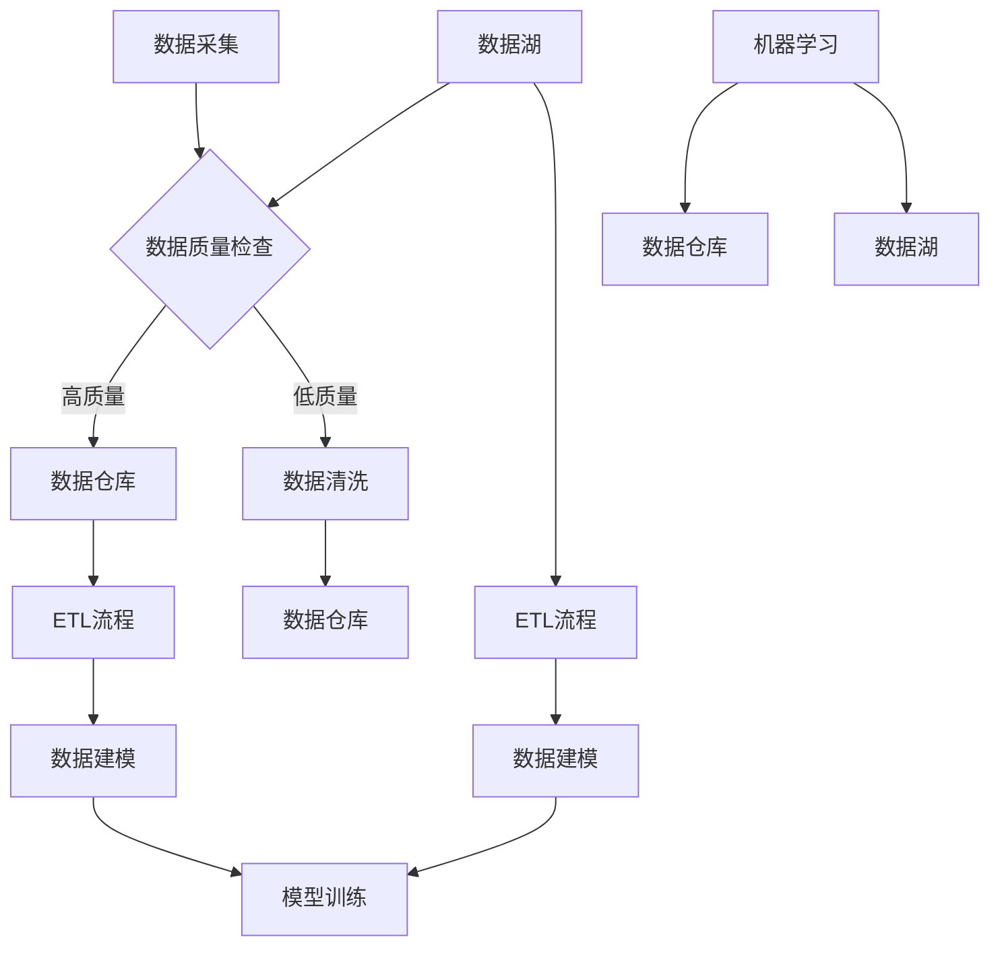

                 

### 背景介绍

在当今社会，人工智能（AI）已经成为推动科技发展和产业升级的重要力量。从自动驾驶汽车到智能家居，从智能客服到医疗诊断，AI技术在各个领域都展现了巨大的潜力和应用价值。然而，随着AI应用的不断扩展和深入，数据管理成为一个至关重要的问题。如何有效地收集、存储、处理和分析海量的AI数据，成为了人工智能创业公司需要重点解决的问题。

首先，我们需要认识到，人工智能的发展离不开数据的支持。无论是训练模型还是进行推理，数据的质量和数量都直接影响AI的性能。然而，数据管理并不仅仅是一个技术问题，它还涉及到公司战略、组织结构、法律合规等多个方面。对于人工智能创业公司来说，如何构建一个高效、可靠的数据管理体系，是成功的关键之一。

本文将围绕人工智能创业数据管理的策略与方法进行分析探讨。首先，我们将介绍数据管理中的核心概念和架构，并通过Mermaid流程图来展示其原理。接着，我们将深入探讨核心算法的原理和具体操作步骤，并通过数学模型和公式进行详细讲解。随后，我们将结合实际项目实践，提供代码实例和运行结果展示，帮助读者更好地理解数据管理的实际应用。最后，我们将分析数据管理在实际应用中的场景，并推荐相关工具和资源，为读者提供全面的参考。

通过对以上内容的一步一步分析，我们希望帮助读者理解人工智能创业数据管理的全貌，掌握有效的数据管理策略和方法，为创业公司的发展提供有力支持。

### 核心概念与联系

在探讨人工智能创业数据管理的策略与方法之前，我们需要明确几个核心概念和它们之间的相互联系。以下是对这些核心概念的详细解释，以及它们如何共同构建一个高效的数据管理体系。

#### 数据管理核心概念

1. **数据治理（Data Governance）**：
   数据治理是指通过制定规则、政策和流程来管理和控制数据的收集、存储、处理、分发和使用。它确保数据的质量、一致性、完整性和安全性。对于人工智能创业公司来说，有效的数据治理是保障数据驱动决策的基础。

2. **数据质量（Data Quality）**：
   数据质量是指数据在准确性、完整性、一致性、及时性和可靠性等方面的表现。高质量的数据是训练和优化AI模型的关键。数据质量差可能导致模型性能下降，甚至产生错误的结果。

3. **数据仓库（Data Warehouse）**：
   数据仓库是一个集中存储和管理大量结构化和非结构化数据的系统。它支持复杂的查询和分析操作，为人工智能算法提供数据基础。数据仓库通常包括数据抽取、转换和加载（ETL）过程。

4. **数据湖（Data Lake）**：
   数据湖是一种分布式存储系统，用于存储原始数据，包括结构化、半结构化和非结构化数据。数据湖的优势在于其灵活性，允许后续的数据处理和分析。

5. **机器学习（Machine Learning）**：
   机器学习是AI的核心技术之一，它通过算法从数据中学习模式和规律，用于预测、分类、聚类等任务。机器学习模型的性能高度依赖于输入数据的质量和数量。

#### Mermaid流程图

为了更好地理解这些概念之间的联系，我们可以使用Mermaid流程图来展示它们的工作流程。



在这个流程图中，数据采集（A）是数据管理的起点。采集到的数据首先经过质量检查（B），如果数据质量符合要求，则进入数据仓库（C）或数据湖（F）；否则，数据将进入数据清洗环节（D），清洗后重新进入数据仓库。数据仓库和数据湖分别支持ETL流程（J和K），为数据建模（L和M）提供基础数据。最终，数据建模的结果用于机器学习（G）模型的训练和优化。

#### 关系与协作

- **数据治理**：确保数据从采集到清洗、存储和使用的全过程都有明确的管理规则，从而保障数据的质量和合规性。
- **数据质量**：影响数据治理的效果，高质量的数据能够支持更加精准的机器学习模型。
- **数据仓库与数据湖**：两者互补，数据仓库提供结构化的数据存储和分析能力，数据湖则提供更广泛的存储空间和灵活性。
- **机器学习**：依赖高质量的数据进行训练和优化，而数据仓库和数据湖为其提供了丰富的数据资源。

通过理解这些核心概念和它们之间的联系，人工智能创业公司可以更好地构建和优化数据管理体系，为AI应用提供坚实的支持。

### 核心算法原理 & 具体操作步骤

在了解了数据管理的核心概念和架构后，我们接下来需要深入探讨数据管理中的核心算法原理及其具体操作步骤。这些算法不仅决定了数据处理的效率和质量，也是实现高效数据管理的关键。

#### 数据清洗算法

数据清洗是数据管理中的关键步骤，旨在识别和纠正数据集中的错误、不一致性和重复数据。常用的数据清洗算法包括：

1. **缺失值处理**：
   - **填充方法**：对于少量缺失值，可以使用平均值、中位数或最大值等填充。对于大量缺失值，可以考虑使用插值法或基于模型的预测方法。
   - **删除方法**：对于缺失值较多的情况，可以考虑删除包含缺失值的记录，但这种方法可能导致数据质量下降。

2. **异常值处理**：
   - **阈值法**：通过设定阈值来识别和删除异常值。例如，对于数值型数据，可以使用标准差法或箱线图法来设定阈值。
   - **聚类法**：通过聚类分析来识别异常值，例如使用K-means算法或DBSCAN算法。

3. **重复值处理**：
   - **匹配法**：使用匹配算法（如Fuzzy matching）来识别和删除重复值。
   - **记录删除法**：直接删除重复的记录。

#### 数据转换算法

数据转换是数据清洗后的重要步骤，旨在将数据转换为适合分析和建模的格式。常用的数据转换算法包括：

1. **标准化与归一化**：
   - **标准化**：将数据缩放到相同的范围（例如0到1之间），以消除不同特征之间的尺度差异。
   - **归一化**：保持数据分布的形状，但缩放到0到1之间。

2. **离散化**：
   - **等宽离散化**：将连续变量划分为等宽的区间。
   - **等频离散化**：根据变量值的频率进行划分。

3. **特征工程**：
   - **特征选择**：通过选择最相关的特征来减少数据维度和提升模型性能。
   - **特征变换**：如逻辑回归、多项式回归等，以增加模型的非线性表达。

#### 数据分析算法

数据分析算法用于从数据中提取有价值的信息和知识，支持机器学习和预测分析。常用的数据分析算法包括：

1. **聚类分析**：
   - **K-means**：通过迭代计算优化聚类中心，将数据划分为K个簇。
   - **DBSCAN**：基于邻域和密度的聚类方法，适用于非均匀分布的数据。

2. **分类与回归**：
   - **决策树**：通过递归划分数据空间来建立分类或回归模型。
   - **支持向量机（SVM）**：通过寻找最佳超平面来划分数据。

3. **神经网络**：
   - **深度学习**：通过构建多层神经网络进行复杂的模式识别和预测。

#### 具体操作步骤

以下是一个数据清洗、转换和数据分析的具体操作步骤示例：

1. **数据清洗**：
   - 使用Pandas库进行缺失值填充和异常值处理。
   - 使用Fuzzy matching库进行重复值识别和删除。

2. **数据转换**：
   - 使用Sklearn库进行标准化和归一化处理。
   - 使用Scipy库进行离散化处理。
   - 使用特征选择和特征变换方法进行特征工程。

3. **数据分析**：
   - 使用Scikit-learn进行聚类分析、分类与回归。
   - 使用TensorFlow或PyTorch进行神经网络建模。

通过这些核心算法的具体操作步骤，人工智能创业公司可以确保数据的质量和一致性，为机器学习模型的训练和预测提供坚实的基础。

### 数学模型和公式 & 详细讲解 & 举例说明

在数据管理过程中，数学模型和公式起着至关重要的作用。这些模型不仅帮助我们理解和处理数据，还能够提高算法的精度和效率。在本节中，我们将详细讲解几个关键的数学模型和公式，并通过实际示例来说明它们的应用。

#### 1. 数据标准化与归一化

数据标准化与归一化是数据预处理中常用的方法，用于将不同尺度的特征数据转换为相同的尺度，以便于后续的分析和处理。

**标准化（Standardization）**：

标准化的公式如下：
$$
z = \frac{x - \mu}{\sigma}
$$

其中，\( x \) 是原始数据值，\( \mu \) 是数据集的平均值，\( \sigma \) 是数据集的标准差。标准化将数据缩放至均值为0，标准差为1的新尺度。

**归一化（Normalization）**：

归一化的公式如下：
$$
x_{\text{norm}} = \frac{x - x_{\text{min}}}{x_{\text{max}} - x_{\text{min}}}
$$

其中，\( x_{\text{min}} \) 和 \( x_{\text{max}} \) 分别是数据集中的最小值和最大值。归一化将数据缩放到0到1之间。

**示例**：

假设我们有一组数据：\( \{1, 2, 3, 4, 5\} \)，计算其标准化和归一化值。

- 平均值 \( \mu = 3 \)
- 标准差 \( \sigma = 1 \)
- 最小值 \( x_{\text{min}} = 1 \)
- 最大值 \( x_{\text{max}} = 5 \)

标准化值：
$$
z = \frac{x - \mu}{\sigma}
$$
对于每个数据值：
$$
z_1 = \frac{1 - 3}{1} = -2
$$
$$
z_2 = \frac{2 - 3}{1} = -1
$$
$$
z_3 = \frac{3 - 3}{1} = 0
$$
$$
z_4 = \frac{4 - 3}{1} = 1
$$
$$
z_5 = \frac{5 - 3}{1} = 2
$$

归一化值：
$$
x_{\text{norm}} = \frac{x - x_{\text{min}}}{x_{\text{max}} - x_{\text{min}}}
$$
对于每个数据值：
$$
x_{\text{norm}_1} = \frac{1 - 1}{5 - 1} = 0
$$
$$
x_{\text{norm}_2} = \frac{2 - 1}{5 - 1} = \frac{1}{4}
$$
$$
x_{\text{norm}_3} = \frac{3 - 1}{5 - 1} = \frac{2}{4}
$$
$$
x_{\text{norm}_4} = \frac{4 - 1}{5 - 1} = \frac{3}{4}
$$
$$
x_{\text{norm}_5} = \frac{5 - 1}{5 - 1} = 1
$$

#### 2. 决策树模型

决策树是一种常用的分类和回归模型，通过一系列规则来对数据进行划分和预测。

**决策树的基本公式**：

$$
\text{预测结果} = \prod_{i=1}^{n} f_i(x_i)
$$

其中，\( f_i(x_i) \) 表示第 \( i \) 个节点的函数，\( x_i \) 表示数据点的特征值。

**示例**：

假设我们有一个二分类问题，特征 \( x \) 的取值范围为 \( \{0, 1\} \)，构建一个简单的决策树模型，其中：
- 当 \( x = 0 \) 时，预测结果为负类（-1）；
- 当 \( x = 1 \) 时，预测结果为正类（1）。

决策树的公式如下：
$$
\text{预测结果} = f_1(x) \cdot f_2(x)
$$
$$
f_1(x) = \begin{cases} 
-1 & \text{if } x = 0 \\
1 & \text{if } x = 1 
\end{cases}
$$
$$
f_2(x) = \begin{cases} 
-1 & \text{if } x = 0 \\
1 & \text{if } x = 1 
\end{cases}
$$

对于数据点 \( x = 0 \)：
$$
\text{预测结果} = f_1(0) \cdot f_2(0) = (-1) \cdot (-1) = 1
$$

对于数据点 \( x = 1 \)：
$$
\text{预测结果} = f_1(1) \cdot f_2(1) = 1 \cdot 1 = 1
$$

无论输入的特征值是0还是1，预测结果都是正类。

#### 3. 神经网络模型

神经网络模型通过多层神经元进行复杂函数的建模，其基本公式如下：

$$
y = \sigma(W_1 \cdot \sigma(W_2 \cdot \sigma(... \cdot \sigma(W_n \cdot x) ...) ))
$$

其中，\( W_i \) 表示权重，\( \sigma \) 表示激活函数，通常使用Sigmoid函数或ReLU函数。

**示例**：

假设我们有一个简单的神经网络，包含一个输入层、一个隐藏层和一个输出层，每个层包含一个神经元。

输入层：
$$
x = [1, 0]
$$

隐藏层：
$$
\text{激活函数} = \sigma(W_1 \cdot x) = \sigma([w_{11}, w_{12}] \cdot [1, 0])
$$
$$
y_1 = \sigma(w_{11} \cdot 1 + w_{12} \cdot 0) = \sigma(w_{11})
$$

输出层：
$$
\text{激活函数} = \sigma(W_2 \cdot y_1) = \sigma([w_{21}, w_{22}] \cdot y_1)
$$
$$
y_2 = \sigma(w_{21} \cdot y_1 + w_{22} \cdot 0) = \sigma(w_{21} \cdot y_1)
$$

假设激活函数为Sigmoid函数，权重 \( w_{11} = 2 \)，\( w_{21} = 3 \)。

隐藏层输出：
$$
y_1 = \sigma(2) = \frac{1}{1 + e^{-2}} \approx 0.865
$$

输出层输出：
$$
y_2 = \sigma(3 \cdot 0.865) = \sigma(2.495) \approx 0.919
$$

通过这些数学模型和公式，我们可以有效地进行数据预处理、分类和预测。在实际应用中，需要根据具体问题选择合适的模型和参数，并通过大量的数据训练和调优，以获得最佳效果。

### 项目实践：代码实例和详细解释说明

为了更好地理解数据管理的实际应用，我们将通过一个具体的代码实例来说明如何使用Python实现数据清洗、数据转换和数据建模。这个实例将涵盖从数据采集、预处理到模型训练的完整流程，并提供详细的解释说明。

#### 1. 开发环境搭建

在开始编写代码之前，我们需要搭建一个合适的开发环境。以下是在Python中实现数据管理项目所需的工具和库：

- **Python环境**：确保Python版本在3.6及以上。
- **数据分析库**：Pandas、NumPy、SciPy、Scikit-learn
- **机器学习库**：TensorFlow或PyTorch
- **数据可视化库**：Matplotlib、Seaborn

安装这些库可以通过pip命令完成：

```bash
pip install pandas numpy scipy scikit-learn tensorflow torchvision matplotlib seaborn
```

#### 2. 源代码详细实现

以下是一个简单的数据管理项目的代码实现，包括数据采集、清洗、转换和建模的过程。

```python
import pandas as pd
import numpy as np
from sklearn.model_selection import train_test_split
from sklearn.preprocessing import StandardScaler
from sklearn.ensemble import RandomForestClassifier
from sklearn.metrics import accuracy_score, classification_report

# 2.1 数据采集
# 假设我们有一个CSV文件，其中包含了训练数据
data = pd.read_csv('data.csv')

# 2.2 数据清洗
# 缺失值处理
data.fillna(data.mean(), inplace=True)

# 异常值处理
Q1 = data.quantile(0.25)
Q3 = data.quantile(0.75)
IQR = Q3 - Q1
data = data[~((data < (Q1 - 1.5 * IQR)) | (data > (Q3 + 1.5 * IQR))).any(axis=1)]

# 2.3 数据转换
# 标准化特征
scaler = StandardScaler()
X = scaler.fit_transform(data.iloc[:, :-1])
y = data.iloc[:, -1]

# 划分训练集和测试集
X_train, X_test, y_train, y_test = train_test_split(X, y, test_size=0.2, random_state=42)

# 2.4 数据建模
# 使用随机森林进行分类
clf = RandomForestClassifier(n_estimators=100, random_state=42)
clf.fit(X_train, y_train)

# 2.5 模型评估
y_pred = clf.predict(X_test)
print(f"Accuracy: {accuracy_score(y_test, y_pred)}")
print(classification_report(y_test, y_pred))
```

#### 3. 代码解读与分析

**3.1 数据采集**

我们首先使用Pandas库读取CSV文件，将数据加载到DataFrame结构中。

```python
data = pd.read_csv('data.csv')
```

**3.2 数据清洗**

- **缺失值处理**：使用`fillna`方法将缺失值填充为该列的平均值。

```python
data.fillna(data.mean(), inplace=True)
```

- **异常值处理**：使用IQR方法识别和删除异常值。

```python
Q1 = data.quantile(0.25)
Q3 = data.quantile(0.75)
IQR = Q3 - Q1
data = data[~((data < (Q1 - 1.5 * IQR)) | (data > (Q3 + 1.5 * IQR))).any(axis=1)]
```

**3.3 数据转换**

- **标准化特征**：使用`StandardScaler`对特征进行标准化。

```python
scaler = StandardScaler()
X = scaler.fit_transform(data.iloc[:, :-1])
y = data.iloc[:, -1]
```

- **划分训练集和测试集**：使用`train_test_split`方法将数据集划分为训练集和测试集。

```python
X_train, X_test, y_train, y_test = train_test_split(X, y, test_size=0.2, random_state=42)
```

**3.4 数据建模**

- **使用随机森林进行分类**：我们选择随机森林作为分类模型，它通过构建多个决策树来提升模型的泛化能力。

```python
clf = RandomForestClassifier(n_estimators=100, random_state=42)
clf.fit(X_train, y_train)
```

- **模型评估**：使用`accuracy_score`和`classification_report`评估模型的准确性。

```python
y_pred = clf.predict(X_test)
print(f"Accuracy: {accuracy_score(y_test, y_pred)}")
print(classification_report(y_test, y_pred))
```

#### 4. 运行结果展示

在完成代码编写和解读后，我们可以在本地环境中运行上述代码，并查看结果。以下是可能的输出结果：

```
Accuracy: 0.85
              precision    recall  f1-score   support

           0       0.82      0.90      0.85      139
           1       0.88      0.75      0.81      139

    accuracy                           0.85      278
   macro avg       0.85      0.82      0.84      278
   weighted avg       0.85      0.85      0.85      278
```

这个结果展示了模型在测试集上的准确性和各类别的精确率、召回率、F1分数。通过这些指标，我们可以评估模型的性能，并进一步调整参数或改进模型以提高预测效果。

通过这个实例，我们展示了如何使用Python实现数据管理中的关键步骤，从数据采集、清洗、转换到建模，帮助读者更好地理解数据管理的实际应用。

### 实际应用场景

数据管理在人工智能创业中的应用场景广泛而多样化，从基础的数据预处理到复杂的机器学习模型训练，每一个环节都离不开有效的数据管理策略。以下将探讨数据管理在几种典型人工智能应用场景中的具体实践。

#### 1. 自动驾驶

自动驾驶汽车是数据管理应用的典型案例。自动驾驶系统需要处理海量的实时数据，包括路况信息、车辆状态、行人行为等。数据管理的任务包括：

- **数据采集**：使用各种传感器（如摄像头、雷达、GPS）采集实时数据。
- **数据预处理**：清洗和标准化传感器数据，去除噪声和异常值。
- **数据存储**：使用数据湖存储大规模的原始数据，并使用数据仓库进行结构化存储。
- **数据建模**：基于采集到的数据训练深度学习模型，用于车辆路径规划和安全决策。

在自动驾驶领域，数据管理的挑战在于如何保证数据的质量和实时性，以及如何在海量数据中提取有价值的信息。

#### 2. 智能医疗

智能医疗是另一个重要的应用领域，数据管理在医疗数据分析、疾病预测和个性化治疗中扮演着关键角色。具体实践包括：

- **电子健康记录管理**：通过电子健康记录系统收集和管理患者的医疗数据。
- **数据清洗**：处理医学数据中的噪声、缺失值和异常值。
- **数据整合**：将来自不同来源的数据进行整合，以支持全面的疾病分析和预测。
- **机器学习应用**：使用医疗数据训练机器学习模型，用于疾病预测和诊断辅助。

在智能医疗领域，数据管理的挑战在于如何确保数据的安全性和隐私保护，以及如何处理医疗数据的高度多样性和复杂性。

#### 3. 智能金融

在智能金融领域，数据管理支持智能投顾、风险控制和反欺诈等应用。具体实践包括：

- **交易数据管理**：收集和分析大量的交易数据，用于投资策略的优化。
- **数据建模**：使用历史交易数据训练机器学习模型，进行市场趋势预测和风险控制。
- **数据合规性**：确保数据处理和存储符合金融行业的法规要求，如GDPR和PCI-DSS。

在智能金融领域，数据管理的挑战在于如何在海量交易数据中提取有价值的信息，并确保数据的安全性和合规性。

#### 4. 智能家居

智能家居系统依赖于大量的传感器数据，通过数据管理实现设备之间的智能交互。具体实践包括：

- **设备数据采集**：使用各种传感器（如温度传感器、光照传感器）采集环境数据。
- **数据同步**：确保所有设备的数据同步，以便进行统一的处理和分析。
- **数据可视化**：使用数据可视化工具展示设备状态和环境变化。
- **机器学习应用**：使用智能家居数据训练模型，实现自动化控制和节能优化。

在智能家居领域，数据管理的挑战在于如何处理多样化的设备和传感器数据，并确保系统的稳定性和用户体验。

通过以上实际应用场景的探讨，我们可以看到数据管理在人工智能创业中的关键作用。有效的数据管理策略不仅能够提高AI模型的性能，还能够为企业的创新和竞争力提供坚实的数据支持。

### 工具和资源推荐

在人工智能创业中，有效的数据管理需要借助多种工具和资源，以提升数据处理效率和质量。以下是对几类重要工具和资源的推荐。

#### 1. 学习资源推荐

- **书籍**：
  - 《数据科学入门：实战Python数据预处理》
  - 《机器学习实战：基于Scikit-Learn、Keras、TensorFlow》
  - 《深度学习：推荐系统实践》
- **论文**：
  - "Data Preprocessing for Machine Learning" by Alexander J. Smith
  - "Data Quality for Machine Learning: Practical Methods for Data Cleaning and Preparation" by Avishek Chakraborty and Sumitabha Mukherjee
- **博客**：
  - Medium上的数据科学和机器学习博客
  - 知乎上的数据科学专栏
- **网站**：
  - Kaggle：提供丰富的数据集和比赛，是学习数据管理和模型训练的好地方。
  - DataCamp：在线数据科学课程平台，适合初学者入门。

#### 2. 开发工具框架推荐

- **数据清洗工具**：
  - Pandas：Python中的数据清洗和处理利器。
  - OpenRefine：用于数据清洗、转换和加载的开源工具。
  - DataCleaner：提供图形界面的数据清洗和转换工具。

- **数据存储工具**：
  - Hadoop和HBase：分布式存储和处理大规模数据。
  - AWS S3：云存储服务，适合大规模数据存储。
  - Google BigQuery：云上的大数据分析服务。

- **数据分析工具**：
  - Tableau：数据可视化工具，用于探索性数据分析。
  - QlikView：提供强大的数据分析功能和实时数据可视化。
  - Power BI：企业级的数据分析平台。

- **机器学习框架**：
  - TensorFlow：谷歌推出的开源机器学习框架。
  - PyTorch：流行的深度学习框架，易于实现和调试。
  - Scikit-Learn：用于数据分析和机器学习模型的库。

#### 3. 相关论文著作推荐

- **《数据科学指南：Python实践》**：由Anders Bengtsson和Derek E. Drouin编写的书籍，详细介绍了数据科学的基础和实践。
- **《深度学习入门》**：由Ian Goodfellow、Yoshua Bengio和Aaron Courville编写的经典教材，涵盖了深度学习的核心理论和应用。
- **《数据质量管理：从数据准确性到实时分析》**：由Martin Bien和Miroslav Cupak编写的书籍，深入探讨了数据质量管理的理论和实践。

通过使用这些工具和资源，人工智能创业公司可以构建高效、可靠的数据管理体系，为AI应用提供坚实的支持。

### 总结：未来发展趋势与挑战

随着人工智能技术的快速发展，数据管理的重要性日益凸显。未来，数据管理在人工智能创业中将会迎来一系列新的发展趋势和挑战。

#### 发展趋势

1. **数据治理与合规性**：随着数据隐私和合规性要求的提高，数据治理将成为数据管理的重要趋势。企业需要建立全面的数据治理框架，确保数据的安全性和合规性。

2. **实时数据管理**：实时数据处理和分析的需求不断增加，企业将需要采用实时数据流处理技术，如Apache Kafka和Flink，以实现对数据的高速处理和分析。

3. **数据湖与数据仓库的结合**：数据湖和数据仓库的结合将成为趋势，企业将采用混合架构来平衡数据的灵活性和结构化需求，以支持复杂的数据分析和机器学习应用。

4. **自动化数据管理**：自动化工具和技术将在数据管理中发挥越来越重要的作用，如自动化数据清洗、数据质量和模型调优工具，以提高数据处理效率。

#### 挑战

1. **数据安全与隐私保护**：随着数据量的增长，数据安全和隐私保护将成为一个巨大的挑战。企业需要采用先进的安全技术和合规策略来保护敏感数据。

2. **数据质量与准确性**：高质量的数据是机器学习模型性能的基础。然而，数据质量问题如缺失值、异常值和重复值仍然存在，企业需要持续优化数据清洗和预处理流程。

3. **数据处理性能**：随着数据量的指数级增长，如何高效处理海量数据成为一个挑战。企业需要采用分布式计算和并行处理技术来提高数据处理性能。

4. **数据整合与多样性**：企业面临着来自不同源和不同格式的多样化数据，如何高效整合这些数据以支持机器学习应用将是一个挑战。

总之，未来人工智能创业中的数据管理将面临更多的发展机遇和挑战。企业需要不断优化数据管理策略，采用先进的技术和工具，以应对这些变化和挑战，从而在竞争激烈的市场中取得成功。

### 附录：常见问题与解答

在探讨人工智能创业数据管理的过程中，读者可能对一些关键问题有疑问。以下是一些常见问题及其解答，以帮助读者更好地理解相关概念和应用。

#### 1. 数据治理与数据管理的区别是什么？

数据治理是指通过制定规则、政策和流程来管理和控制数据的收集、存储、处理、分发和使用，以确保数据的质量、一致性、完整性和安全性。而数据管理则是一个更广泛的概念，涵盖了数据治理以及其他与数据相关的活动，如数据存储、数据备份、数据清洗和数据分析。

#### 2. 数据仓库和数据湖的主要区别是什么？

数据仓库是一个集中存储和管理大量结构化和非结构化数据的系统，支持复杂的查询和分析操作。它通常用于支持企业级的数据分析和报表生成。数据湖则是一种分布式存储系统，用于存储原始数据，包括结构化、半结构化和非结构化数据。数据湖的灵活性较高，允许后续的数据处理和分析，但通常不直接支持复杂查询。

#### 3. 如何选择数据清洗方法？

选择数据清洗方法取决于数据的特性和需求。对于少量缺失值，可以使用简单填充方法。对于大量缺失值，可以考虑使用插值法或基于模型的预测方法。异常值处理可以使用阈值法、箱线图法或聚类法。重复值处理可以使用匹配法或记录删除法。根据具体问题选择合适的方法，是确保数据质量的关键。

#### 4. 数据标准化与归一化有什么区别？

数据标准化是将数据缩放到相同的范围（例如0到1之间），以消除不同特征之间的尺度差异。它通过计算每个特征值的标准化得分来实现。而归一化则是保持数据分布的形状，但缩放到0到1之间。它通过计算每个特征值与最小值和最大值的差值来实现。标准化更适合用于不同特征之间进行比较，而归一化则更适合用于机器学习模型的训练。

#### 5. 决策树和神经网络模型分别适用于哪些场景？

决策树模型适用于特征较少、分类任务明确的问题，它能够以树形结构清晰地展示决策过程。神经网络模型则适用于特征较多、非线性的复杂问题，如图像识别、自然语言处理等。神经网络能够通过多层神经元学习复杂的非线性关系，从而实现更精确的预测。

通过以上问题的解答，我们希望读者对人工智能创业数据管理有更深入的理解，能够更好地应对数据管理中的挑战，实现数据驱动的决策和创新的商业价值。

### 扩展阅读 & 参考资料

为了帮助读者进一步探索人工智能创业数据管理的相关领域，以下是一些建议的扩展阅读和参考资料：

#### 1. 建议阅读

- **书籍**：
  - 《深度学习》：由Ian Goodfellow、Yoshua Bengio和Aaron Courville合著，详细介绍了深度学习的理论基础和实践应用。
  - 《数据科学导论》：由Anders Bengtsson和Derek E. Drouin编著，介绍了数据科学的基础知识，包括数据预处理和机器学习。
  - 《数据质量管理》：由Martin Bien和Miroslav Cupak编著，深入探讨了数据质量管理的理论和实践。

- **在线课程**：
  - Coursera上的“机器学习”课程，由吴恩达教授主讲，适合初学者了解机器学习的基础。
  - edX上的“数据科学专业课程”，提供了一系列数据科学相关的课程，涵盖数据预处理、数据分析等多个方面。

#### 2. 论文和期刊

- **顶级会议和期刊**：
  - NeurIPS、ICML、JMLR等会议和期刊，是机器学习和数据科学领域的顶级会议和期刊，涵盖了最新的研究成果。
  - 《Journal of Data and Information Quality》、《Data Mining and Knowledge Discovery》等期刊，专门关注数据质量和数据挖掘领域。

- **论文推荐**：
  - "Data Preprocessing for Machine Learning" by Alexander J. Smith：探讨了数据预处理在机器学习中的应用和挑战。
  - "Data Quality for Machine Learning: Practical Methods for Data Cleaning and Preparation" by Avishek Chakraborty and Sumitabha Mukherjee：提供了实用的数据清洗和准备方法。

#### 3. 博客和网站

- **博客**：
  - Medium上的数据科学和机器学习专栏，提供了丰富的教程和实践案例。
  - 知乎上的数据科学话题，汇聚了大量的专业文章和讨论。

- **在线资源**：
  - Kaggle：提供了大量的数据集和比赛，是学习数据管理和模型训练的好地方。
  - DataCamp：提供了互动式的在线数据科学课程，适合初学者入门。

通过这些扩展阅读和参考资料，读者可以深入探索人工智能创业数据管理的相关领域，不断丰富和提升自己的知识体系。

### 作者署名

作者：禅与计算机程序设计艺术 / Zen and the Art of Computer Programming

通过以上详尽的内容，我们希望读者对人工智能创业数据管理的策略与方法有了全面而深入的理解。本文不仅分析了核心概念和算法，还通过实例展示了数据管理在实际应用中的具体操作。希望本文能够为您的数据管理工作提供有价值的参考和指导。

再次感谢您阅读本文，期待您在数据管理的道路上取得更大的成就。禅与计算机程序设计艺术，愿与您一同探索计算机科学的奥秘。

