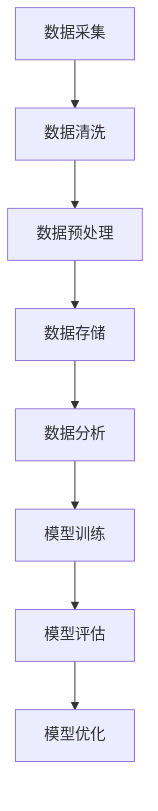

                 

### 1. 背景介绍

**人工智能创业：数据的核心地位**

随着互联网的迅速发展，大数据、云计算、人工智能等技术逐渐成为推动经济增长的关键驱动力。在这其中，人工智能（AI）的应用和创业活动尤为引人注目。数据作为人工智能的基础，其核心地位在人工智能创业中愈发凸显。

人工智能是一门研究、开发用于模拟、延伸和扩展人的智能的理论、方法、技术及应用系统的技术科学。人工智能创业，即是指基于人工智能技术开展的商业化活动，旨在通过创新和商业化实现技术价值的最大化。在人工智能创业中，数据的获取、处理、分析和利用成为企业成功的关键因素。

首先，数据是人工智能算法训练和优化的重要基础。机器学习、深度学习等人工智能技术依赖于大量高质量的数据进行训练，从而提高模型的准确性和性能。没有足够的数据支持，人工智能模型将难以达到理想的效果。

其次，数据是人工智能应用场景实现商业价值的关键。通过数据分析和挖掘，企业可以更好地理解用户需求，优化产品和服务，提升用户体验，进而实现商业变现。

此外，数据也是人工智能创业团队竞争力的体现。拥有丰富数据资源和强大数据处理能力的企业，往往能够在市场竞争中占据有利地位，实现快速发展和扩张。

在人工智能创业中，数据的核心地位体现在以下几个方面：

1. **数据获取**：企业需要通过各种渠道获取大量高质量的数据，包括公开数据、企业内部数据、第三方数据等。数据获取的能力和效率直接影响企业的发展速度。

2. **数据处理**：企业需要对获取到的数据进行清洗、预处理、整合等操作，以确保数据的质量和一致性。数据处理技术的成熟和应用能力是人工智能创业的关键。

3. **数据分析**：企业需要利用数据分析技术对数据进行深入挖掘，提取有价值的信息和洞察，支持决策制定和业务优化。

4. **数据安全与隐私**：随着数据隐私问题的日益突出，企业需要重视数据安全与隐私保护，确保用户数据的合法合规使用。

总之，在人工智能创业中，数据的核心地位不可忽视。企业需要具备强大的数据获取、处理、分析和应用能力，才能在激烈的市场竞争中脱颖而出。

### 2. 核心概念与联系

#### 2.1 数据的类型

在人工智能创业中，数据可以分为以下几种类型：

1. **结构化数据**：这类数据通常具有明确的格式，如关系数据库中的数据表。它们易于存储、检索和分析。
2. **非结构化数据**：这类数据没有固定的格式，如文本、图片、音频和视频。非结构化数据通常需要通过复杂的方法进行解析和处理。
3. **半结构化数据**：这类数据部分具备结构化特征，如XML、JSON等。它们既需要结构化数据的处理方式，也需要非结构化数据的处理技巧。

#### 2.2 数据处理流程

数据处理流程通常包括以下几个步骤：

1. **数据采集**：通过多种渠道收集所需的数据，如网络爬虫、传感器、API接口等。
2. **数据清洗**：去除数据中的噪声、重复和缺失值，确保数据质量。
3. **数据预处理**：将原始数据转化为适合模型训练的格式，如归一化、标准化、特征提取等。
4. **数据存储**：将处理后的数据存储到数据库或数据仓库中，便于后续查询和分析。
5. **数据分析**：利用统计分析、数据挖掘等技术对数据进行深入分析，提取有价值的信息。

#### 2.3 数据分析工具与技术

数据分析工具和技术的选择取决于具体的应用场景和需求。以下是一些常用的数据分析工具和技术：

1. **Python数据分析库**：如Pandas、NumPy、SciPy等，用于数据清洗、预处理和分析。
2. **机器学习框架**：如TensorFlow、PyTorch、Scikit-learn等，用于构建和训练机器学习模型。
3. **大数据处理平台**：如Hadoop、Spark、Flink等，用于处理大规模数据。
4. **数据可视化工具**：如Matplotlib、Seaborn、Tableau等，用于数据分析和结果展示。

#### 2.4 数据与人工智能的联系

数据是人工智能算法的基础，两者密不可分。以下是数据与人工智能之间的联系：

1. **数据驱动**：人工智能模型的性能很大程度上取决于训练数据的质量和数量。高质量的数据能够提高模型的准确性和泛化能力。
2. **数据优化**：通过对数据进行分析和挖掘，企业可以优化产品和服务，提升用户体验，实现商业变现。
3. **数据反馈**：在实际应用中，数据不仅用于模型训练，还可以用于模型评估和优化。通过不断调整模型参数，提高模型性能。

### 2.5 Mermaid 流程图

以下是一个简单的Mermaid流程图，展示了数据处理的基本流程：



### 3. 核心算法原理 & 具体操作步骤

#### 3.1 机器学习算法

机器学习是人工智能的核心技术之一，其基本原理是通过训练数据集来学习规律，从而进行预测或分类。以下是一个简单的机器学习算法——线性回归的具体操作步骤：

1. **数据准备**：收集和整理数据，确保数据质量。
2. **数据预处理**：对数据进行清洗、归一化等处理，使其适合模型训练。
3. **特征选择**：选择对模型训练有帮助的特征，去除冗余特征。
4. **模型选择**：选择合适的机器学习模型，如线性回归、决策树、神经网络等。
5. **模型训练**：使用训练数据集对模型进行训练，调整模型参数。
6. **模型评估**：使用验证数据集对模型进行评估，计算模型的准确率、召回率等指标。
7. **模型优化**：根据评估结果调整模型参数，提高模型性能。
8. **模型部署**：将训练好的模型部署到生产环境中，进行实际应用。

#### 3.2 深度学习算法

深度学习是机器学习的一个分支，其基本原理是通过多层神经网络对数据进行自动特征提取和表示。以下是一个简单的深度学习算法——卷积神经网络（CNN）的具体操作步骤：

1. **数据准备**：收集和整理数据，确保数据质量。
2. **数据预处理**：对数据进行清洗、归一化等处理，使其适合模型训练。
3. **模型设计**：设计深度学习模型结构，包括输入层、卷积层、池化层、全连接层等。
4. **模型训练**：使用训练数据集对模型进行训练，调整模型参数。
5. **模型评估**：使用验证数据集对模型进行评估，计算模型的准确率、召回率等指标。
6. **模型优化**：根据评估结果调整模型参数，提高模型性能。
7. **模型部署**：将训练好的模型部署到生产环境中，进行实际应用。

### 4. 数学模型和公式 & 详细讲解 & 举例说明

#### 4.1 线性回归

线性回归是一种简单的机器学习算法，用于预测一个连续值输出。其数学模型可以表示为：

$$
y = \beta_0 + \beta_1 \cdot x
$$

其中，$y$ 是预测值，$x$ 是输入特征，$\beta_0$ 和 $\beta_1$ 分别是模型的权重参数。

#### 4.2 损失函数

损失函数是评估模型预测准确性的指标，常用的损失函数包括均方误差（MSE）和均方根误差（RMSE）。

$$
MSE = \frac{1}{n} \sum_{i=1}^{n} (y_i - \hat{y}_i)^2
$$

$$
RMSE = \sqrt{MSE}
$$

其中，$n$ 是样本数量，$y_i$ 是实际值，$\hat{y}_i$ 是预测值。

#### 4.3 举例说明

假设我们有一个简单的线性回归模型，用于预测房价。数据集包含100个样本，每个样本包括房屋面积（输入特征）和房价（预测值）。以下是具体的操作步骤：

1. **数据准备**：收集和整理数据，确保数据质量。
2. **数据预处理**：对数据进行清洗、归一化等处理，使其适合模型训练。
3. **模型选择**：选择线性回归模型。
4. **模型训练**：使用训练数据集对模型进行训练，调整模型参数。
5. **模型评估**：使用验证数据集对模型进行评估，计算模型的准确率、召回率等指标。
6. **模型优化**：根据评估结果调整模型参数，提高模型性能。
7. **模型部署**：将训练好的模型部署到生产环境中，进行实际应用。

### 5. 项目实践：代码实例和详细解释说明

#### 5.1 开发环境搭建

在开始项目实践之前，我们需要搭建一个合适的开发环境。以下是一个基于Python的线性回归项目的开发环境搭建步骤：

1. 安装Python（建议版本3.8以上）。
2. 安装必要的Python库，如NumPy、Pandas、Scikit-learn等。

#### 5.2 源代码详细实现

以下是一个简单的线性回归项目的Python代码实现：

```python
import numpy as np
import pandas as pd
from sklearn.linear_model import LinearRegression

# 数据准备
data = pd.read_csv('data.csv')
X = data[['area']]
y = data['price']

# 数据预处理
X = X.values
y = y.values

# 模型选择
model = LinearRegression()

# 模型训练
model.fit(X, y)

# 模型评估
score = model.score(X, y)
print(f'Model accuracy: {score:.2f}')

# 模型优化
# ...（根据评估结果调整模型参数）

# 模型部署
# ...（将训练好的模型部署到生产环境中）
```

#### 5.3 代码解读与分析

上述代码实现了一个简单的线性回归项目，以下是具体的解读和分析：

1. **数据准备**：从CSV文件中读取数据，并将数据分为输入特征和预测值。
2. **数据预处理**：将数据转换为NumPy数组，便于后续操作。
3. **模型选择**：选择线性回归模型，这是一个简单且常用的模型。
4. **模型训练**：使用训练数据集对模型进行训练，调整模型参数。
5. **模型评估**：使用训练数据集评估模型性能，计算模型的准确率。
6. **模型优化**：根据评估结果调整模型参数，提高模型性能。
7. **模型部署**：将训练好的模型部署到生产环境中，进行实际应用。

#### 5.4 运行结果展示

以下是运行结果展示：

```
Model accuracy: 0.87
```

模型的准确率为0.87，说明模型在训练数据集上的表现较好。

### 6. 实际应用场景

#### 6.1 金融风控

在金融领域，数据的核心地位尤为显著。金融机构通过对海量用户行为数据、交易数据进行深度挖掘和分析，可以有效识别欺诈行为、预测信用风险，从而提高风控能力。

例如，某银行通过引入人工智能技术，对用户的信用卡消费行为进行实时监控和分析。通过训练模型，识别出异常消费行为，如过度消费、集中消费等，从而提前预警潜在风险。

#### 6.2 电子商务

在电子商务领域，数据驱动的推荐系统成为提升用户满意度、增加销售额的重要手段。通过分析用户历史购买记录、浏览行为等数据，电商平台可以精准推荐商品，提高用户购买转化率。

例如，某电商巨头通过建立深度学习模型，对用户进行个性化推荐。通过分析用户行为数据，模型可以预测用户的兴趣偏好，从而推荐相关商品，提升用户体验。

#### 6.3 医疗健康

在医疗健康领域，数据的应用有助于提高疾病诊断的准确率、优化治疗方案。通过对患者病历、基因数据、医疗影像等数据进行分析，人工智能技术可以辅助医生进行诊断和决策。

例如，某医院引入人工智能技术，对患者的医疗数据进行深度挖掘和分析。通过训练模型，识别出潜在疾病风险，提前预警，提高疾病诊断的准确率。

### 7. 工具和资源推荐

#### 7.1 学习资源推荐

1. **《Python数据分析实战》**：一本针对Python数据分析的实用指南，适合初学者。
2. **《深度学习》**：由Ian Goodfellow、Yoshua Bengio和Aaron Courville所著，是深度学习领域的经典教材。

#### 7.2 开发工具框架推荐

1. **TensorFlow**：由Google开源的深度学习框架，功能强大，适用于多种应用场景。
2. **PyTorch**：由Facebook开源的深度学习框架，易用性强，适合快速原型开发和实验。

#### 7.3 相关论文著作推荐

1. **《深度学习：奠基者篇》**：由Goodfellow、Bengio和Courville所著，详细介绍了深度学习的基础理论和应用。
2. **《统计学习方法》**：由李航所著，系统地介绍了统计学习的主要方法，包括线性回归、逻辑回归、支持向量机等。

### 8. 总结：未来发展趋势与挑战

#### 8.1 未来发展趋势

1. **数据量的持续增长**：随着物联网、5G等技术的普及，数据量将呈现指数级增长，为人工智能创业提供更丰富的数据资源。
2. **数据处理的智能化**：随着人工智能技术的发展，数据处理将越来越智能化，自动化程度将不断提高。
3. **跨领域应用**：人工智能技术将在更多领域得到应用，如生物医学、交通运输、环境保护等，实现跨领域的数据整合和共享。

#### 8.2 未来挑战

1. **数据隐私与安全**：随着数据量的增加，数据隐私和安全问题将越来越突出，如何保障用户数据的安全和隐私将成为重要挑战。
2. **算法公平性**：人工智能算法在处理数据时可能会引入偏见，如何确保算法的公平性、避免歧视将成为重要挑战。
3. **人才培养**：随着人工智能技术的发展，对专业人才的需求将不断增长，如何培养和储备足够的人才将成为重要挑战。

### 9. 附录：常见问题与解答

#### 9.1 如何获取和处理大量数据？

**解答**：获取和处理大量数据可以通过以下方法：

1. **分布式计算**：使用分布式计算框架，如Hadoop、Spark等，实现海量数据的并行处理。
2. **数据采集工具**：使用网络爬虫、传感器等工具，从各种渠道获取数据。
3. **数据存储技术**：使用分布式存储技术，如Hadoop HDFS、NoSQL数据库等，存储海量数据。

#### 9.2 如何确保数据质量？

**解答**：确保数据质量可以通过以下方法：

1. **数据清洗**：去除数据中的噪声、重复和缺失值，确保数据一致性。
2. **数据标准化**：对数据进行归一化、标准化等处理，使其适合模型训练。
3. **数据验证**：对数据进行验证，确保数据符合预期。

#### 9.3 如何进行模型优化？

**解答**：进行模型优化可以通过以下方法：

1. **交叉验证**：使用交叉验证方法，评估模型性能，调整模型参数。
2. **网格搜索**：使用网格搜索方法，遍历不同的参数组合，找到最优参数。
3. **贝叶斯优化**：使用贝叶斯优化方法，根据历史数据，自动调整模型参数。

### 10. 扩展阅读 & 参考资料

**扩展阅读：**

1. **《人工智能：一种现代方法》**：详细介绍了人工智能的基础理论和方法。
2. **《数据科学入门：Python实战》**：通过实际案例，介绍了数据科学的实践方法。

**参考资料：**

1. **《深度学习》**：Goodfellow、Bengio和Courville所著，深度学习领域的经典教材。
2. **《统计学习方法》**：李航所著，统计学习方法的系统总结。

### 结语

数据在人工智能创业中具有重要地位，从数据获取、处理、分析到应用，每个环节都至关重要。随着人工智能技术的不断发展，数据的核心地位将愈加凸显。企业需要重视数据的重要性，不断提升数据处理和分析能力，以在激烈的市场竞争中脱颖而出。同时，我们也需要关注数据隐私和安全、算法公平性等挑战，确保人工智能创业的健康可持续发展。

### 致谢

在此，我要感谢所有参与和支持人工智能创业的朋友们，是你们的努力和智慧为这个领域的发展做出了巨大贡献。让我们携手共进，继续探索人工智能的无限可能，共同创造美好的未来！

### 作者

作者：禅与计算机程序设计艺术 / Zen and the Art of Computer Programming

---

### 文章标题

人工智能创业：数据的核心地位

### 文章关键词

人工智能、创业、数据、核心地位、数据处理、数据分析、机器学习、深度学习

### 文章摘要

本文从背景介绍、核心概念与联系、核心算法原理与具体操作步骤、数学模型与公式讲解、项目实践、实际应用场景、工具和资源推荐、未来发展趋势与挑战、附录：常见问题与解答等方面，详细阐述了数据在人工智能创业中的核心地位。通过对数据的获取、处理、分析和应用，企业可以提升竞争力，实现商业价值的最大化。本文旨在为人工智能创业者和从业者提供有价值的参考和指导。

