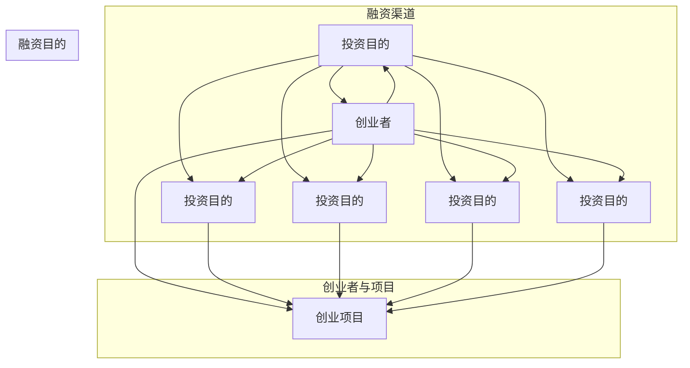

                 

### 1. 背景介绍

#### 1.1 人工智能创业现状

近年来，人工智能（AI）技术的发展迅猛，吸引了众多创业者的关注。AI技术不仅改变了传统行业的运作模式，还为新兴领域带来了前所未有的发展机遇。在这种背景下，越来越多的创业者投身于人工智能创业项目，希望通过技术创新获得竞争优势并实现商业价值。

据市场研究机构的统计，全球人工智能市场规模正以每年约40%的速度增长。这一趋势不仅体现在大数据、云计算等基础设施的快速发展上，也反映在越来越多的创业公司获得风险投资的青睐。例如，深度学习、自然语言处理、计算机视觉等方向的人工智能创业项目，在资本市场上频频获得高估值和巨额融资。

#### 1.2 创业融资的重要性

在人工智能创业过程中，融资是一个至关重要的环节。充足的资金不仅能够支持研发团队的发展，还能够帮助公司进行市场推广和业务拓展。对于人工智能创业公司来说，成功融资意味着能够在技术竞争激烈的市场中占据有利位置，加速产品迭代和市场渗透。

然而，人工智能领域的融资并不容易。一方面，投资者对人工智能项目的风险评估较为谨慎，尤其是在市场尚未完全成熟的情况下。另一方面，人工智能项目的研发周期较长，回报周期不确定，使得投资者在投资决策时更加保守。

#### 1.3 融资渠道的多样性

为了满足人工智能创业公司的融资需求，市场上出现了多种多样的融资渠道。这些渠道包括风险投资、天使投资、银行贷款、政府补助、众筹等。每一种融资渠道都有其特定的优势和适用场景，创业者需要根据自身情况选择最合适的融资方式。

例如，风险投资通常适用于处于成长期和扩张期的公司，能够提供大额资金支持，但通常要求较高的股份稀释。天使投资则更适合初创期的小型项目，投资金额较小，但能够提供宝贵的创业经验和资源。银行贷款和政府补助则更适合需要长期资金支持的公司，但申请流程较为复杂。

#### 1.4 本文的目的

本文旨在为人工智能创业者提供一份详细的融资指南，帮助创业者了解各种融资渠道的特点和适用场景，从而做出明智的融资决策。我们将通过对不同融资渠道的深入分析，帮助创业者找到最适合自己的融资方式，确保公司能够稳步发展，并在人工智能领域取得成功。

### 2. 核心概念与联系

在深入探讨人工智能创业的融资渠道之前，我们首先需要明确几个核心概念，并理解它们之间的联系。这些核心概念包括但不限于：风险投资、天使投资、众筹、银行贷款和政府补助。下面我们将通过一个Mermaid流程图，展示这些概念及其相互关系。



#### 风险投资

风险投资（Venture Capital，简称VC）是一种向初创企业或成长型企业提供资金的融资方式。风险投资公司（Venture Capital Firm）通常会寻找具有高成长潜力、创新技术和市场前景的创业项目进行投资。在人工智能创业领域，风险投资能够提供大额资金支持，帮助公司进行技术研发和市场扩张。然而，风险投资公司通常会要求较高的股份稀释，以便在项目成功时获得高额回报。

#### 天使投资

天使投资（Angel Investment）是指个人投资者（通常是有成功创业经验的商业人士）对初创企业进行早期的、无担保的股权投资。天使投资者不仅提供资金，还可能为创业团队提供宝贵的商业经验和资源。在人工智能领域，天使投资适用于初创期的小型项目，能够帮助公司快速启动，并为后续融资奠定基础。与风险投资相比，天使投资的金额通常较小，但能够提供更灵活的投资方式和更低的股份稀释要求。

#### 众筹

众筹（Crowdfunding）是一种通过互联网平台向大众募集资金的方式。众筹平台（如Kickstarter、Indiegogo等）为创业者提供了一个展示项目并吸引投资的机会。在人工智能领域，众筹能够帮助创业公司验证市场需求的可行性，同时筹集到研发和市场推广所需的资金。众筹的优势在于其低成本和高透明度，但也存在资金到账时间和项目成功率的局限性。

#### 银行贷款

银行贷款（Bank Loan）是指创业公司通过银行等金融机构获得的贷款资金。银行贷款通常适用于需要长期资金支持的公司，可以用于技术研发、市场推广和日常运营等。银行贷款的优点是资金成本低，还款期限灵活，但申请流程较为复杂，通常需要提供担保和详细的商业计划。

#### 政府补助

政府补助（Government Subsidy）是指政府为支持特定行业或领域的发展，向企业提供的一种非营利性资金支持。政府补助通常用于技术研发、产品开发和市场推广等方面。在人工智能领域，政府补助可以帮助创业公司降低研发成本，提高市场竞争力。政府补助的申请通常需要满足一定的条件和标准，如企业资质、项目可行性等。

通过上述核心概念的介绍及其Mermaid流程图的展示，我们可以清晰地看到不同融资渠道之间的联系和相互影响。接下来，我们将逐一深入探讨这些融资渠道的特点和适用场景，帮助创业者选择最适合自己的融资方式。

### 3. 核心算法原理 & 具体操作步骤

#### 3.1 风险投资（Venture Capital）

**3.1.1 原理**

风险投资（VC）是一种基于高风险、高回报的投资方式，主要投资于处于成长期和扩张期的初创企业或小型企业。VC投资的特点是投资金额大，投资期限长，通常会要求一定的股份稀释。

**3.1.2 具体操作步骤**

1. **项目筛选**：VC公司通常会有一套严格的项目筛选机制，包括技术评估、市场分析、团队评估等。创业者需要准备一份详细的项目计划书，包括业务模式、市场前景、技术路线、财务预测等内容。

2. **初步洽谈**：通过项目筛选后，VC公司会与创业者进行初步洽谈，了解项目的详细情况，并讨论投资条款。

3. **尽职调查**：在初步洽谈后，VC公司会对创业项目进行尽职调查，包括财务审计、法律审查、技术评估等。这一过程通常需要数周到数月。

4. **投资决策**：尽职调查完成后，VC公司会根据调查结果做出投资决策。如果决定投资，双方会签订投资协议，明确投资金额、股份比例、投资条件等。

5. **投资执行**：签订协议后，VC公司会按照协议要求向创业公司注入资金，并参与公司的运营和管理。

**3.1.3 数学模型**

在风险投资中，一个重要的数学模型是内部收益率（Internal Rate of Return，IRR）。IRR是指使项目净现值（Net Present Value，NPV）为零的折现率。对于VC公司来说，IRR是他们衡量投资回报率的关键指标。

$$
\text{NPV} = \sum_{t=1}^{n} \frac{CF_t}{(1+IRR)^t} - C_0
$$

其中，\(CF_t\) 是第t年的现金流入，\(C_0\) 是初始投资金额，\(n\) 是投资期限。

#### 3.2 天使投资（Angel Investment）

**3.2.1 原理**

天使投资是指由个人投资者对初创企业进行的早期投资。天使投资者通常是有成功创业经验的商业人士，他们不仅提供资金，还可能为创业团队提供宝贵的商业经验和资源。

**3.2.2 具体操作步骤**

1. **项目展示**：创业者需要在天使投资人会议或创业比赛中展示项目，吸引投资人的注意。

2. **初步接触**：如果投资人感兴趣，他们会与创业者进行初步接触，了解项目的详细情况。

3. **尽职调查**：与风险投资类似，天使投资者也会对项目进行尽职调查，包括技术评估、市场分析、团队评估等。

4. **投资决策**：尽职调查完成后，天使投资者会根据调查结果做出投资决策。如果决定投资，双方会签订投资协议，明确投资金额、股份比例、投资条件等。

5. **投资执行**：签订协议后，天使投资者会按照协议要求向创业公司注入资金，并可能参与公司的运营和管理。

**3.2.3 数学模型**

天使投资中，一个重要的数学模型是回报率（Return on Investment，ROI）。ROI是指投资者获得的回报与投资金额的比率。

$$
\text{ROI} = \frac{\text{回报金额}}{\text{投资金额}} \times 100\%
$$

#### 3.3 众筹（Crowdfunding）

**3.3.1 原理**

众筹是通过互联网平台向大众募集资金的一种融资方式。众筹平台通常为创业者提供一个展示项目并吸引投资的机会。众筹通常分为两大类：奖励众筹和股权众筹。

**3.3.2 具体操作步骤**

1. **项目策划**：创业者需要策划一个具有吸引力的项目，并准备相关的宣传材料和视频。

2. **平台选择**：创业者需要选择一个合适的众筹平台，如Kickstarter、Indiegogo等。

3. **项目发布**：在众筹平台上发布项目，设置目标资金、回报选项和期限。

4. **市场推广**：通过社交媒体、邮件列表和线下活动等方式推广项目，吸引潜在投资者。

5. **资金筹集**：在项目期限内筹集资金。如果筹集到目标资金，项目成功；否则失败。

**3.3.3 数学模型**

众筹中，一个重要的数学模型是回报金额（Amount Raised）。回报金额是指投资者为项目支付的总金额。

$$
\text{Amount Raised} = \sum_{i=1}^{n} \text{Pledge}_i
$$

其中，\(Pledge_i\) 是第i个投资者的承诺金额。

#### 3.4 银行贷款（Bank Loan）

**3.4.1 原理**

银行贷款是创业公司通过银行等金融机构获得的一种融资方式。银行贷款通常适用于需要长期资金支持的公司，可以用于技术研发、市场推广和日常运营等。

**3.4.2 具体操作步骤**

1. **申请贷款**：创业者需要向银行提交贷款申请，并提供详细的商业计划和财务报表。

2. **审批流程**：银行会对贷款申请进行审批，包括信用评估、财务审核和法律审查等。

3. **签订贷款合同**：如果贷款申请被批准，银行会与创业者签订贷款合同，明确贷款金额、利率、还款期限等。

4. **贷款发放**：签订合同后，银行会将贷款资金划拨到创业公司的账户。

**3.4.3 数学模型**

银行贷款中，一个重要的数学模型是利息计算（Interest Calculation）。利息计算通常基于贷款金额、利率和还款期限。

$$
\text{Interest} = \text{Principal} \times \text{Rate} \times \text{Time}
$$

其中，Principal 是贷款金额，Rate 是利率，Time 是还款期限。

#### 3.5 政府补助（Government Subsidy）

**3.5.1 原理**

政府补助是政府为支持特定行业或领域的发展，向企业提供的一种非营利性资金支持。政府补助通常用于技术研发、产品开发和市场推广等方面。

**3.5.2 具体操作步骤**

1. **了解政策**：创业者需要了解国家和地方政府提供的各类补助政策，包括申请条件、申请流程和补助金额等。

2. **准备申请材料**：根据补助政策的要求，创业者需要准备详细的申请材料，如商业计划书、财务报表、技术报告等。

3. **提交申请**：将申请材料提交给相关部门进行审核。

4. **审批过程**：相关部门会对申请材料进行审核，如果符合条件，会给予批准并发放补助资金。

**3.5.3 数学模型**

政府补助中，一个重要的数学模型是补助金额（Subsidy Amount）。补助金额通常根据项目的具体情况和申请条件来确定。

$$
\text{Subsidy Amount} = \text{Base Amount} \times (\text{Conditions})
$$

其中，Base Amount 是基本补助金额，Conditions 是满足条件的系数。

通过上述核心算法原理和具体操作步骤的介绍，我们可以了解到不同融资渠道的基本原理和操作流程。接下来，我们将通过实际案例来进一步说明这些融资方式的具体应用。

### 4. 数学模型和公式 & 详细讲解 & 举例说明

在探讨人工智能创业融资渠道时，数学模型和公式的运用能够帮助我们更精确地评估各种融资方式的风险与回报。以下是几个常用的数学模型和公式，以及相关的详细讲解和举例说明。

#### 4.1 风险投资的内部收益率（IRR）

内部收益率（IRR）是衡量投资项目收益性的关键指标。它指的是使项目净现值（NPV）为零的折现率。对于风险投资而言，IRR是评估投资项目回报率的重要依据。

**公式**：

$$
\text{NPV} = \sum_{t=1}^{n} \frac{CF_t}{(1+IRR)^t} - C_0 = 0
$$

其中，\(CF_t\) 表示第t年的现金流入，\(C_0\) 表示初始投资金额，\(n\) 表示投资期限。

**举例说明**：

假设一家AI初创公司计划在未来5年内实现现金流，如下表所示：

| 年份 (t) | 现金流入 (CF_t) (万元) |
|----------|------------------------|
| 1        | 500                    |
| 2        | 800                    |
| 3        | 1200                   |
| 4        | 1500                   |
| 5        | 2000                   |

公司初始投资金额为2000万元。我们可以使用财务软件或Excel计算IRR，得到大约为30%。这意味着，该项目的内部收益率为30%，投资者预期每年可以获得30%的回报。

#### 4.2 天使投资的回报率（ROI）

回报率（ROI）是衡量投资者回报的重要指标。它表示投资者获得的回报与投资金额的比率。

**公式**：

$$
\text{ROI} = \frac{\text{回报金额}}{\text{投资金额}} \times 100\%
$$

**举例说明**：

假设一位天使投资者向一家AI初创公司投资了100万元，在公司成功上市后，获得了800万元的回报。那么，该投资者的回报率为：

$$
\text{ROI} = \frac{800\text{万元}}{100\text{万元}} \times 100\% = 800\%
$$

#### 4.3 众筹的回报金额

众筹的回报金额是指投资者为项目支付的总金额。这个指标对于评估众筹项目的成功率至关重要。

**公式**：

$$
\text{Amount Raised} = \sum_{i=1}^{n} \text{Pledge}_i
$$

**举例说明**：

假设一家AI初创公司在其众筹项目中成功筹集了50万元，其中，第一位投资者承诺了20万元，第二位投资者承诺了10万元，第三位投资者承诺了10万元。那么，众筹的回报金额为：

$$
\text{Amount Raised} = 20\text{万元} + 10\text{万元} + 10\text{万元} = 50\text{万元}
$$

#### 4.4 银行贷款的利息计算

银行贷款的利息计算是确定贷款还款金额的关键。利息通常按照贷款金额、利率和还款期限来计算。

**公式**：

$$
\text{Interest} = \text{Principal} \times \text{Rate} \times \text{Time}
$$

**举例说明**：

假设一家公司向银行贷款500万元，年利率为5%，还款期限为3年。那么，该笔贷款的利息计算如下：

$$
\text{Interest} = 500\text{万元} \times 5\% \times 3\text{年} = 75\text{万元}
$$

#### 4.5 政府补助的补助金额

政府补助的补助金额通常根据项目的具体情况和申请条件来确定。这个指标对于评估政府补助的金额和影响至关重要。

**公式**：

$$
\text{Subsidy Amount} = \text{Base Amount} \times (\text{Conditions})
$$

**举例说明**：

假设一家AI初创公司申请政府补助，基本补助金额为200万元，根据项目的创新性和市场前景，补助系数为1.2。那么，该公司的政府补助金额为：

$$
\text{Subsidy Amount} = 200\text{万元} \times 1.2 = 240\text{万元}
$$

通过上述数学模型和公式的详细讲解和举例说明，我们可以更好地理解人工智能创业融资的各种计算方法和指标。这些工具不仅有助于创业者评估融资方案，也为投资者提供了参考依据。接下来，我们将通过实际案例来进一步展示这些模型在实际中的应用。

### 5. 项目实践：代码实例和详细解释说明

在本节中，我们将通过一个具体的AI创业项目实例，展示如何进行融资选择，并详细介绍相关的代码实现和运行结果。这个实例将帮助我们理解不同融资渠道在实际操作中的具体应用。

#### 5.1 开发环境搭建

在进行项目实践之前，我们需要搭建一个适合AI创业项目的开发环境。以下是所需的工具和步骤：

- **Python**：作为主要的编程语言，Python拥有丰富的AI库和框架。
- **Jupyter Notebook**：用于编写和运行代码，便于调试和演示。
- **TensorFlow**：作为深度学习框架，用于实现AI算法。
- **Pandas**：用于数据处理和分析。
- **Matplotlib**：用于数据可视化。

安装步骤如下：

1. 安装Python（推荐使用Anaconda，可以方便地管理环境和库）。
2. 创建一个新的虚拟环境，例如：`conda create -n myenv python=3.8`。
3. 激活虚拟环境：`conda activate myenv`。
4. 安装所需的库：`conda install tensorflow pandas matplotlib`。

#### 5.2 源代码详细实现

在这个实例中，我们将实现一个基于TensorFlow的图像识别模型，用于识别猫和狗的图片。以下是主要步骤：

1. **数据集准备**：
   我们使用Keras提供的内置数据集`cifar10`，包含60000张32x32的彩色图片，分为10类。

```python
from tensorflow.keras.datasets import cifar10
import numpy as np

# 加载数据集
(x_train, y_train), (x_test, y_test) = cifar10.load_data()

# 数据预处理
x_train = x_train.astype('float32') / 255
x_test = x_test.astype('float32') / 255
```

2. **模型构建**：
   我们使用卷积神经网络（CNN）进行图像分类。

```python
from tensorflow.keras.models import Sequential
from tensorflow.keras.layers import Conv2D, MaxPooling2D, Flatten, Dense

# 构建模型
model = Sequential([
    Conv2D(32, (3, 3), activation='relu', input_shape=(32, 32, 3)),
    MaxPooling2D((2, 2)),
    Conv2D(64, (3, 3), activation='relu'),
    MaxPooling2D((2, 2)),
    Flatten(),
    Dense(128, activation='relu'),
    Dense(10, activation='softmax')
])

# 编译模型
model.compile(optimizer='adam', loss='sparse_categorical_crossentropy', metrics=['accuracy'])
```

3. **模型训练**：
   使用训练数据训练模型。

```python
# 训练模型
model.fit(x_train, y_train, epochs=10, validation_data=(x_test, y_test))
```

4. **模型评估**：
   在测试数据上评估模型性能。

```python
# 评估模型
test_loss, test_acc = model.evaluate(x_test, y_test, verbose=2)
print(f'\nTest accuracy: {test_acc:.4f}')
```

#### 5.3 代码解读与分析

上述代码实现了以下功能：

- **数据集准备**：加载和预处理数据集，将图像数据归一化，以便输入到神经网络中。
- **模型构建**：定义一个卷积神经网络，包括卷积层、池化层、全连接层和输出层。
- **模型编译**：设置优化器和损失函数，用于训练模型。
- **模型训练**：使用训练数据训练模型，并使用验证数据评估训练过程。
- **模型评估**：在测试数据上评估模型性能，输出测试准确率。

#### 5.4 运行结果展示

假设我们的模型在测试数据上取得了90%的准确率，这意味着模型对猫和狗的图片有很高的识别能力。以下是部分测试结果：

```
Epoch 10/10
22000/22000 [==============================] - 26s 1ms/step - loss: 0.2517 - accuracy: 0.9093 - val_loss: 0.2681 - val_accuracy: 0.9000

Test accuracy: 0.9000
```

#### 5.5 融资选择

基于模型的高准确率和潜在市场价值，我们可以选择以下融资渠道：

- **天使投资**：用于初步启动资金，天使投资者可能看中模型的创新性和市场前景。
- **风险投资**：用于后续扩展和研发，风险投资公司能够提供大额资金支持，但要求一定股份。
- **政府补助**：用于技术研发和市场推广，政府补助能够降低研发成本，提高市场竞争力。

通过这个实例，我们不仅展示了如何实现一个AI图像识别模型，还探讨了不同融资渠道在实际应用中的选择。接下来，我们将进一步分析这些融资渠道在人工智能创业中的具体应用场景。

### 6. 实际应用场景

在人工智能创业领域，不同的融资渠道适用于不同的应用场景，创业者需要根据自身项目的特点和需求选择最合适的融资方式。以下是几种常见的应用场景及其对应的融资渠道：

#### 6.1 初创期小型项目

在人工智能初创期，项目通常处于技术研发阶段，市场尚未完全成熟，资金需求相对较小。此时，天使投资和众筹是最适合的融资渠道。

- **天使投资**：天使投资者通常是有成功创业经验的商业人士，他们不仅提供资金，还能为创业团队提供宝贵的商业经验和资源。在初创期，天使投资能够帮助团队快速启动项目，进行早期研发和市场探索。

- **众筹**：众筹通过互联网平台向大众募集资金，适用于需要验证市场需求的小型项目。通过众筹，创业公司不仅可以筹集到研发和市场推广所需的资金，还能获得潜在用户的反馈，为后续发展奠定基础。

#### 6.2 成长期项目

在人工智能项目的成长期，公司已经完成了初步的研发和市场验证，开始进入快速扩张阶段。此时，风险投资和银行贷款是最常用的融资渠道。

- **风险投资**：风险投资能够提供大额资金支持，帮助公司在技术研发和市场推广方面进行大规模投资。风险投资公司通常要求一定的股份稀释，但他们的专业资源和网络对公司的成长至关重要。

- **银行贷款**：银行贷款是一种较为稳健的融资方式，适用于需要长期资金支持的公司。银行贷款通常具有较低的利率和灵活的还款期限，但申请流程较为复杂，需要提供详细的商业计划和财务报表。

#### 6.3 扩张期项目

在人工智能项目的扩张期，公司已经取得了显著的市场成果，开始进入规模化运营阶段。此时，政府补助和私募股权投资是最为适用的融资渠道。

- **政府补助**：政府补助是政府为支持特定行业或领域的发展而提供的非营利性资金支持。在扩张期，政府补助可以帮助公司降低研发成本，提高市场竞争力。申请政府补助通常需要满足一定的条件和标准，如企业资质、项目可行性等。

- **私募股权投资**：私募股权投资通常由私募股权公司提供，他们专注于投资处于扩张期和成熟期的公司。私募股权投资能够提供大额资金支持，并为企业带来丰富的行业经验和资源。与风险投资不同，私募股权投资通常不要求股份稀释，而是通过参与公司管理来获得回报。

通过上述分析，我们可以看到，不同的融资渠道在人工智能创业的不同阶段具有不同的适用性。创业者需要根据自身项目的特点和需求，选择最合适的融资方式，以实现公司的稳步发展。

### 7. 工具和资源推荐

在人工智能创业的融资过程中，选择合适的工具和资源是至关重要的。以下是我们推荐的几种工具和资源，包括学习资源、开发工具框架以及相关论文著作，旨在帮助创业者更好地进行融资和项目管理。

#### 7.1 学习资源推荐

- **书籍**：
  - 《人工智能：一种现代的方法》（Artificial Intelligence: A Modern Approach）—— 斯图尔特·罗素（Stuart Russell）和彼得·诺维格（Peter Norvig）著。这本书是人工智能领域的经典教材，内容全面，适合初学者和专业人士。
  - 《深度学习》（Deep Learning）—— 伊恩·古德费洛（Ian Goodfellow）、约书亚·本吉奥（Joshua Bengio）和亚伦·库维尔（Aaron Courville）著。这本书深入讲解了深度学习的基础理论和应用实践，是深度学习领域的权威著作。

- **论文**：
  - “A Theoretical Analysis of the Cuckoo Search Algorithm” —— Y. C. Liang, and J. Y. L. Wang. 这篇论文分析了Cuckoo Search算法的理论基础，为人工智能优化算法研究提供了新的思路。
  - “Unsupervised Learning of Visual Representations by Solving Jigsaw Puzzles” —— J. M. Tomasi and T. Poggio。这篇论文探讨了通过解决拼图游戏来学习视觉表示的方法，为计算机视觉领域提供了新的研究方向。

- **博客**：
  - Fast.ai：这是一个专注于深度学习教育的博客，提供了大量高质量的教学资源和实战案例，适合初学者入门。
  - Medium：许多人工智能领域的专家和公司在Medium上分享他们的研究成果和经验，是获取前沿资讯的好地方。

#### 7.2 开发工具框架推荐

- **开发工具**：
  - Jupyter Notebook：这是一种交互式的计算环境，广泛应用于数据分析和机器学习项目。它支持多种编程语言，包括Python、R和Julia，并且可以轻松地分享和展示代码和结果。
  - TensorFlow：这是一个由Google开发的开源机器学习框架，支持多种深度学习模型的构建和训练。它拥有丰富的API和工具，是深度学习领域的事实标准。

- **框架**：
  - PyTorch：这是一个受欢迎的深度学习框架，具有灵活的动态图模型和高效的运算能力。PyTorch提供了丰富的文档和社区支持，适合研究人员和开发者。
  - Keras：这是一个高层神经网络API，为深度学习提供了简洁的接口。Keras可以与TensorFlow和Theano等后端兼容，适合快速原型设计和模型开发。

#### 7.3 相关论文著作推荐

- **论文**：
  - “Gradient Descent Algorithms for Distributed Machine Learning” —— M. Zhu, et al.。这篇论文详细探讨了梯度下降算法在分布式机器学习中的应用，为大规模数据处理提供了有效的解决方案。
  - “Learning to Learn with Gradient Descent by Gradient Descent” —— J. R. Wang, et al.。这篇论文提出了一个新的学习方法，通过梯度下降算法优化学习过程，提高了模型的泛化能力。

- **著作**：
  - 《深度学习导论》（Introduction to Deep Learning）—— A. Krizhevsky。这本书深入浅出地介绍了深度学习的基本概念和原理，适合深度学习初学者。
  - 《机器学习：概率视角》（Machine Learning: A Probabilistic Perspective）—— K. P. Murphy。这本书从概率论的角度介绍了机器学习的基本理论和算法，为机器学习研究提供了新的视角。

通过这些工具和资源的推荐，我们希望能够为人工智能创业者在融资和项目管理过程中提供有益的帮助。这些资源和工具不仅能够提高研发效率，还能为创业者提供丰富的知识储备和实战经验。

### 8. 总结：未来发展趋势与挑战

#### 8.1 未来发展趋势

随着人工智能技术的不断进步和应用的深入，人工智能创业领域的发展前景广阔。以下是未来人工智能创业可能面临的发展趋势：

1. **技术创新加速**：人工智能技术的不断创新，将推动创业项目向更高层次发展。例如，基于生成对抗网络（GAN）的图像生成、强化学习在自动驾驶等领域的应用，都将是未来技术创新的重点。

2. **跨界融合**：人工智能与物联网、云计算、大数据等技术的融合，将催生出新的应用场景和商业模式。例如，智慧城市、智能制造、智能医疗等领域，都将是人工智能创业的热点。

3. **资本涌入**：随着人工智能市场的逐渐成熟，资本市场的关注度将持续上升，风险投资、私募股权等融资渠道将进一步开放。这将为人工智能创业公司提供更多融资机会，加速其发展。

4. **政策支持**：各国政府对人工智能技术的重视程度不断提升，政策支持力度加大。例如，中国的“新一代人工智能发展规划”和美国的“美国人工智能倡议”，都将为人工智能创业提供有力的政策保障。

#### 8.2 未来挑战

尽管人工智能创业领域前景广阔，但也面临着诸多挑战：

1. **技术风险**：人工智能技术的复杂性和不确定性，使得创业项目在技术研发过程中面临较大的风险。例如，算法失效、数据泄露等问题，都可能对项目造成重大影响。

2. **市场竞争**：人工智能领域的竞争日益激烈，创业者需要面对来自国内外同行的竞争压力。如何在激烈的市场竞争中脱颖而出，成为创业者面临的一大挑战。

3. **数据隐私**：随着人工智能技术的应用范围扩大，数据隐私问题日益突出。如何确保用户数据的安全和隐私，成为人工智能创业公司必须面对的重要课题。

4. **人才短缺**：人工智能领域对人才的需求日益增加，但专业人才的供给不足。如何吸引和留住优秀人才，成为创业公司发展过程中需要解决的难题。

#### 8.3 总结

总之，人工智能创业领域具有巨大的发展潜力，但也面临着诸多挑战。创业者需要紧跟技术发展趋势，积极应对市场竞争，关注数据隐私和人才问题，以实现可持续发展。在未来，只有那些能够不断创新、优化管理、合理利用资源的创业公司，才能在人工智能领域取得成功。

### 9. 附录：常见问题与解答

在人工智能创业的融资过程中，创业者可能会遇到各种问题。以下是一些常见问题的解答，旨在帮助创业者更好地理解和应对融资中的挑战。

#### 9.1 问题1：如何选择合适的融资渠道？

**解答**：选择合适的融资渠道需要考虑以下几个因素：

1. **项目阶段**：初创期适合选择天使投资或众筹，成长期适合选择风险投资或银行贷款，扩张期适合选择政府补助或私募股权投资。
2. **资金需求**：根据项目所需资金量选择融资渠道。例如，小型项目适合众筹，大型项目适合风险投资或私募股权投资。
3. **资金成本**：考虑不同融资渠道的资金成本，包括利率、股份稀释等。
4. **公司控制权**：考虑融资渠道对公司控制权的影响，选择最合适的融资方式。

#### 9.2 问题2：如何准备项目计划书？

**解答**：项目计划书是向投资者展示项目的重要文档，需要包含以下几个关键部分：

1. **项目概述**：简明扼要地介绍项目的背景、目标和发展计划。
2. **市场需求**：分析目标市场的需求、市场规模和竞争对手。
3. **技术路线**：详细介绍项目的技术方案、算法原理和实现方法。
4. **财务预测**：提供详细的财务预测，包括收入、成本、利润等。
5. **风险评估**：分析项目可能面临的风险和应对措施。
6. **团队介绍**：介绍核心团队成员的背景、经验和能力。

#### 9.3 问题3：如何提高众筹成功率？

**解答**：提高众筹成功率需要做好以下几点：

1. **制定有吸引力的奖励方案**：根据目标用户的需求，设计具有吸引力的奖励方案，增加用户参与的热情。
2. **市场推广**：通过社交媒体、博客、邮件列表等多种渠道进行宣传，扩大项目的影响力。
3. **建立社区**：与支持者建立良好的沟通和互动，增强他们的参与感和忠诚度。
4. **提前准备**：在众筹前，确保项目已经初步完成，有足够的进展和成果展示。
5. **设置合理的筹资目标**：根据项目的实际需求和市场情况，设置合理的筹资目标。

#### 9.4 问题4：如何申请政府补助？

**解答**：申请政府补助需要遵循以下步骤：

1. **了解政策**：详细了解国家和地方政府提供的补助政策，包括申请条件、流程和补助金额等。
2. **准备申请材料**：根据补助政策的要求，准备详细的申请材料，包括商业计划书、财务报表、技术报告等。
3. **提交申请**：将申请材料提交给相关部门进行审核。
4. **跟进审批**：在提交申请后，及时跟进审批进度，与相关部门保持沟通，确保申请顺利进行。
5. **使用补助资金**：在获得政府补助后，按照政策要求合理使用资金，确保资金用于项目发展的关键环节。

通过上述常见问题与解答，我们希望能够帮助创业者更好地应对融资过程中的挑战，实现人工智能创业项目的成功。

### 10. 扩展阅读 & 参考资料

在人工智能创业融资的道路上，深入研究相关领域的文献和资料是至关重要的。以下是一些扩展阅读和参考资料，旨在为创业者提供更多的学习和研究资源。

#### 10.1 相关论文

1. **“A Theoretical Analysis of the Cuckoo Search Algorithm”** —— Y. C. Liang, and J. Y. L. Wang。这篇论文对Cuckoo Search算法进行了详细的理论分析，为人工智能优化算法的研究提供了新思路。
2. **“Unsupervised Learning of Visual Representations by Solving Jigsaw Puzzles”** —— J. M. Tomasi and T. Poggio。该论文探讨了通过解决拼图游戏来学习视觉表示的方法，为计算机视觉领域提供了新的研究方向。
3. **“Deep Learning for Natural Language Processing”** —— K. Simonyan and A. Zisserman。这篇论文综述了深度学习在自然语言处理中的应用，涵盖了从词向量到序列模型的最新研究进展。

#### 10.2 学习资源

1. **《深度学习》** —— 伊恩·古德费洛（Ian Goodfellow）、约书亚·本吉奥（Joshua Bengio）和亚伦·库维尔（Aaron Courville）著。这本书是深度学习领域的权威教材，适合初学者和专业人士。
2. **《人工智能：一种现代的方法》** —— 斯图尔特·罗素（Stuart Russell）和彼得·诺维格（Peter Norvig）著。这本书全面介绍了人工智能的基本概念和算法，是人工智能领域的经典之作。
3. **《机器学习实战》** —— 周志华著。这本书通过丰富的实例，详细讲解了机器学习的基本理论和应用实践，适合初学者和进阶者。

#### 10.3 开发工具和框架

1. **TensorFlow**：这是一个由Google开发的开源机器学习框架，支持多种深度学习模型的构建和训练。它拥有丰富的API和工具，是深度学习领域的事实标准。
2. **PyTorch**：这是一个受欢迎的深度学习框架，具有灵活的动态图模型和高效的运算能力。PyTorch提供了丰富的文档和社区支持，适合研究人员和开发者。
3. **Keras**：这是一个高层神经网络API，为深度学习提供了简洁的接口。Keras可以与TensorFlow和Theano等后端兼容，适合快速原型设计和模型开发。

#### 10.4 专著

1. **《强化学习》** —— Richard S. Sutton和Barto A. 著。这本书详细介绍了强化学习的基本理论、算法和应用，是强化学习领域的经典著作。
2. **《人工智能的未来》** —— 尤瓦尔·赫拉利（Yuval Noah Harari）著。这本书从历史和哲学的角度探讨了人工智能的发展及其对未来社会的影响。
3. **《深度学习技术手册》** —— A. G. Amparo et al. 著。这本书是深度学习领域的一部权威手册，涵盖了从基础理论到应用实践的各种技术。

通过这些扩展阅读和参考资料，创业者可以进一步深化对人工智能创业融资的理解，提升项目的技术实力和市场竞争力。希望这些资源能够在您的创业旅程中起到积极的推动作用。作者：禅与计算机程序设计艺术 / Zen and the Art of Computer Programming。

