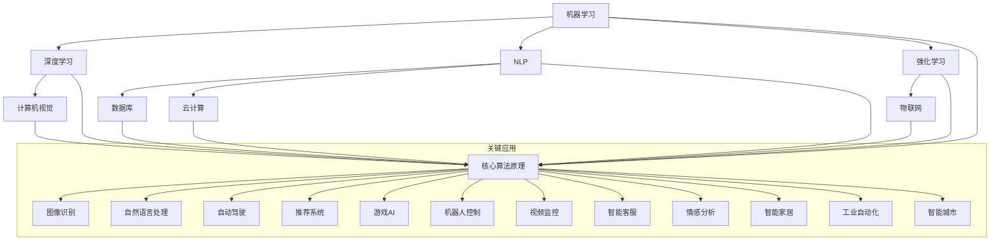

                 

### 文章标题

**人工智能创业：选择合适工具的方法**

> **关键词**：人工智能、创业、工具选择、技术框架、算法实现、资源推荐、发展趋势
>
> **摘要**：本文将深入探讨人工智能创业者在选择工具时所需考虑的关键因素，包括技术框架的评估、算法实现的选择、以及相关资源与工具的推荐。通过逐步分析推理，本文旨在帮助创业者更好地把握人工智能技术，实现创业梦想。

### 1. 背景介绍

在人工智能（AI）迅猛发展的时代，创业成为一个极具吸引力的选择。无论是初创公司还是大型企业，都在积极探索如何将人工智能技术应用到实际业务中。然而，人工智能领域的技术日新月异，创业者面临的挑战也随之而来。

选择合适的工具和技术框架对于人工智能创业的成功至关重要。错误的工具选择可能导致项目延期、成本增加，甚至影响最终的产品质量。因此，深入理解各种工具的优缺点、适用场景以及它们之间的联系，对于创业者来说尤为重要。

本文将围绕以下几个方面展开：

1. **核心概念与联系**：介绍人工智能创业所需了解的核心概念，并提供相应的流程图，帮助读者梳理各个概念之间的关系。
2. **核心算法原理与操作步骤**：详细解析人工智能领域的核心算法原理，并提供具体的操作步骤，使读者能够更好地理解和应用。
3. **数学模型与公式**：介绍相关数学模型和公式，并进行详细讲解和举例说明，帮助读者深入理解。
4. **项目实践**：通过代码实例和详细解释说明，展示如何在实际项目中应用所选工具和算法。
5. **实际应用场景**：分析人工智能在不同领域的实际应用，提供具体的案例和解决方案。
6. **工具和资源推荐**：推荐一系列学习资源、开发工具和框架，为创业者的学习和项目开发提供支持。
7. **总结与未来发展趋势**：总结全文内容，展望人工智能创业的未来发展趋势和挑战。

通过本文的逐步分析推理，希望创业者能够更好地选择合适的工具，推动人工智能创业项目的成功。

### 2. 核心概念与联系

在人工智能创业的过程中，理解一系列核心概念和它们之间的联系是非常重要的。以下是一些关键概念，以及它们在人工智能创业中的应用和相互关系：

#### 2.1 机器学习（Machine Learning）

**定义**：机器学习是一种让计算机通过数据自动改进性能的技术，它不需要显式编程指令。

**应用**：在人工智能创业中，机器学习技术可以用于图像识别、自然语言处理、推荐系统等多个方面。

**联系**：机器学习是人工智能的基础，许多人工智能应用都依赖于机器学习算法。

#### 2.2 深度学习（Deep Learning）

**定义**：深度学习是一种特殊的机器学习技术，它使用多层神经网络来提取数据中的复杂特征。

**应用**：深度学习在图像识别、语音识别、自动驾驶等领域取得了显著成果。

**联系**：深度学习是机器学习的一个重要分支，它扩展了机器学习的能力，使其能够处理更复杂的问题。

#### 2.3 自然语言处理（Natural Language Processing，NLP）

**定义**：自然语言处理是使计算机理解和生成人类语言的技术。

**应用**：NLP在智能客服、机器翻译、情感分析等领域有广泛应用。

**联系**：NLP是人工智能的重要应用领域，它需要机器学习和深度学习技术来支持。

#### 2.4 强化学习（Reinforcement Learning）

**定义**：强化学习是一种通过试错和反馈来学习最优策略的机器学习技术。

**应用**：强化学习在游戏AI、机器人控制、推荐系统等领域有广泛应用。

**联系**：强化学习是机器学习的一个重要分支，它适用于那些需要探索和决策的问题。

#### 2.5 计算机视觉（Computer Vision）

**定义**：计算机视觉是使计算机理解和解释图像和视频的技术。

**应用**：计算机视觉在图像识别、视频监控、自动驾驶等领域有广泛应用。

**联系**：计算机视觉依赖于深度学习和机器学习技术，用于从图像中提取有用信息。

#### 2.6 数据库（Database）

**定义**：数据库是用于存储、管理和查询数据的系统。

**应用**：数据库在数据存储、数据分析和机器学习模型的训练数据存储等方面至关重要。

**联系**：数据库是人工智能应用的基础，它提供了数据存储和管理的解决方案。

#### 2.7 云计算（Cloud Computing）

**定义**：云计算是一种通过互联网提供计算资源的服务模式。

**应用**：云计算为人工智能应用提供了弹性的计算资源，支持大规模数据处理和训练。

**联系**：云计算与人工智能紧密相关，它提供了强大的计算支持，使人工智能应用更加灵活和高效。

#### 2.8 物联网（Internet of Things，IoT）

**定义**：物联网是连接各种物理设备并与互联网互动的网络。

**应用**：物联网在智能家居、智能城市、工业自动化等领域有广泛应用。

**联系**：物联网为人工智能提供了大量的数据来源，使人工智能应用能够更好地感知和响应环境。

以上是人工智能创业中的一些核心概念和联系。接下来，我们将进一步深入探讨这些概念，并提供相应的流程图，帮助读者更好地理解它们之间的关系。

#### 2.9 核心概念 Mermaid 流程图



通过上述流程图，我们可以清晰地看到各个核心概念之间的联系，以及它们在人工智能创业中的关键应用。这个流程图不仅帮助读者理解每个概念的作用，还展示了它们如何相互结合，共同推动人工智能创业项目的发展。

### 3. 核心算法原理 & 具体操作步骤

在人工智能创业中，选择合适的算法是项目成功的关键。以下将介绍一些核心算法原理，并提供具体的操作步骤，帮助创业者更好地理解和应用这些算法。

#### 3.1 机器学习算法

机器学习算法是人工智能的基础，主要包括监督学习、无监督学习和强化学习。以下是这些算法的基本原理和操作步骤：

##### 3.1.1 监督学习（Supervised Learning）

**原理**：监督学习是一种通过已标记的数据进行训练的机器学习技术。训练数据包含输入和输出，模型通过学习输入和输出之间的关系来预测新的输入。

**步骤**：

1. **数据收集**：收集具有标记的输入数据，例如图像、文本或声音。
2. **数据预处理**：清洗数据，包括去除噪声、处理缺失值和标准化数据。
3. **模型选择**：选择合适的模型，例如线性回归、决策树或支持向量机。
4. **模型训练**：使用训练数据训练模型，调整模型参数。
5. **模型评估**：使用验证数据评估模型性能，调整模型参数。
6. **模型部署**：将训练好的模型部署到实际应用中。

##### 3.1.2 无监督学习（Unsupervised Learning）

**原理**：无监督学习是一种不使用已标记数据的机器学习技术。模型通过分析输入数据之间的结构或模式来自动发现规律。

**步骤**：

1. **数据收集**：收集未标记的输入数据。
2. **数据预处理**：清洗数据，包括去除噪声、处理缺失值和标准化数据。
3. **模型选择**：选择合适的模型，例如聚类、降维或关联规则学习。
4. **模型训练**：使用输入数据训练模型，自动发现数据中的结构或模式。
5. **模型评估**：使用验证数据评估模型性能。
6. **模型部署**：将训练好的模型部署到实际应用中。

##### 3.1.3 强化学习（Reinforcement Learning）

**原理**：强化学习是一种通过试错和反馈来学习最优策略的机器学习技术。模型通过与环境的交互来不断改进其决策。

**步骤**：

1. **环境设置**：定义环境，包括状态空间、动作空间和奖励机制。
2. **模型选择**：选择合适的模型，例如Q学习或深度强化学习。
3. **模型训练**：通过与环境交互来训练模型，不断调整策略。
4. **模型评估**：使用评估环境评估模型性能。
5. **模型部署**：将训练好的模型部署到实际应用中。

#### 3.2 深度学习算法

深度学习算法是机器学习的一个重要分支，主要包括卷积神经网络（CNN）、循环神经网络（RNN）和生成对抗网络（GAN）。

##### 3.2.1 卷积神经网络（CNN）

**原理**：卷积神经网络是一种用于图像识别和计算机视觉的深度学习算法。它通过卷积操作和池化操作提取图像中的特征。

**步骤**：

1. **数据收集**：收集大量的图像数据。
2. **数据预处理**：对图像进行预处理，包括尺寸调整、归一化和数据增强。
3. **模型构建**：构建CNN模型，包括卷积层、池化层和全连接层。
4. **模型训练**：使用预处理后的图像数据训练模型，调整模型参数。
5. **模型评估**：使用验证集评估模型性能，调整模型参数。
6. **模型部署**：将训练好的模型部署到实际应用中。

##### 3.2.2 循环神经网络（RNN）

**原理**：循环神经网络是一种用于序列数据处理的深度学习算法。它通过循环结构来处理序列中的依赖关系。

**步骤**：

1. **数据收集**：收集序列数据，例如时间序列数据或自然语言文本。
2. **数据预处理**：对序列数据进行预处理，包括分词、编码和序列长度调整。
3. **模型构建**：构建RNN模型，包括输入层、隐藏层和输出层。
4. **模型训练**：使用预处理后的序列数据训练模型，调整模型参数。
5. **模型评估**：使用验证集评估模型性能，调整模型参数。
6. **模型部署**：将训练好的模型部署到实际应用中。

##### 3.2.3 生成对抗网络（GAN）

**原理**：生成对抗网络是一种通过对抗性训练生成数据的深度学习算法。它由生成器和判别器两个神经网络组成，通过相互对抗来提高生成质量。

**步骤**：

1. **数据收集**：收集真实数据，用于训练判别器。
2. **数据预处理**：对数据进行预处理，包括归一化和数据增强。
3. **模型构建**：构建生成器和判别器模型，通常采用卷积神经网络结构。
4. **模型训练**：通过对抗性训练不断更新生成器和判别器模型参数。
5. **模型评估**：评估生成器的生成质量，调整模型参数。
6. **模型部署**：将训练好的生成器模型部署到实际应用中。

通过以上对核心算法原理和操作步骤的详细介绍，创业者可以更好地理解并应用这些算法，为自己的项目选择合适的工具和框架。

### 4. 数学模型和公式 & 详细讲解 & 举例说明

在人工智能创业中，数学模型和公式是理解和应用算法的重要基础。以下将介绍几个常见的数学模型和公式，并进行详细讲解和举例说明，帮助读者更好地掌握这些数学概念。

#### 4.1 线性回归（Linear Regression）

线性回归是一种简单的统计方法，用于预测连续值输出。其数学模型如下：

$$
y = \beta_0 + \beta_1 \cdot x
$$

其中，$y$ 是预测值，$x$ 是输入特征，$\beta_0$ 和 $\beta_1$ 是模型参数。

**详细讲解**：

- $\beta_0$ 是截距，表示当 $x=0$ 时的预测值。
- $\beta_1$ 是斜率，表示输入特征 $x$ 对预测值 $y$ 的影响程度。

**举例说明**：

假设我们想要预测房价，输入特征是房屋面积 $x$，预测值是房价 $y$。根据已知数据，我们拟合出线性回归模型：

$$
y = 1000 + 0.5 \cdot x
$$

当输入特征为 $x=100$ 时，预测房价为：

$$
y = 1000 + 0.5 \cdot 100 = 1500
$$

这意味着当房屋面积为100平方米时，预测房价为1500万元。

#### 4.2 逻辑回归（Logistic Regression）

逻辑回归是一种用于分类问题的统计方法，其目标是将输入特征映射到概率空间。其数学模型如下：

$$
\text{logit}(p) = \ln\left(\frac{p}{1-p}\right) = \beta_0 + \beta_1 \cdot x
$$

其中，$p$ 是预测的概率，$\text{logit}(p)$ 是逻辑函数的输入，$\beta_0$ 和 $\beta_1$ 是模型参数。

**详细讲解**：

- $\text{logit}(p)$ 将概率映射到实数域，使其可以进行线性建模。
- $\beta_0$ 是截距，$\beta_1$ 是斜率，与线性回归类似。

**举例说明**：

假设我们要预测用户是否购买商品，输入特征是用户年龄 $x$，预测概率为 $p$。根据已知数据，我们拟合出逻辑回归模型：

$$
\text{logit}(p) = 0.5 + 0.1 \cdot x
$$

当输入特征为 $x=30$ 时，预测概率为：

$$
p = \frac{1}{1 + e^{-(0.5 + 0.1 \cdot 30)}} \approx 0.8
$$

这意味着当用户年龄为30岁时，购买商品的概率约为80%。

#### 4.3 决策树（Decision Tree）

决策树是一种常见的分类和回归算法，其决策过程基于一系列规则。其数学模型如下：

$$
f(x) =
\begin{cases}
\beta_0, & \text{if } x \in R_0 \\
\beta_1, & \text{if } x \in R_1 \\
\vdots \\
\beta_n, & \text{if } x \in R_n
\end{cases}
$$

其中，$x$ 是输入特征，$R_0, R_1, \ldots, R_n$ 是划分区域，$\beta_0, \beta_1, \ldots, \beta_n$ 是模型参数。

**详细讲解**：

- 每个区域对应一个决策节点，根据输入特征 $x$ 的值选择对应的区域。
- 决策树的叶节点表示最终的预测结果。

**举例说明**：

假设我们要预测是否下雨，输入特征是温度 $x$。根据历史数据，我们构建出决策树模型：

$$
f(x) =
\begin{cases}
否, & \text{if } x \leq 20 \\
是, & \text{if } x > 20
\end{cases}
$$

当输入特征为 $x=25$ 时，预测结果为：

$$
f(25) = 是
$$

这意味着当温度高于20摄氏度时，预测下雨。

#### 4.4 支持向量机（Support Vector Machine，SVM）

支持向量机是一种用于分类和回归的线性模型，其目标是找到最佳的超平面。其数学模型如下：

$$
\mathbf{w} \cdot \mathbf{x} + b = 0
$$

其中，$\mathbf{w}$ 是权重向量，$\mathbf{x}$ 是输入特征，$b$ 是偏置项。

**详细讲解**：

- $\mathbf{w} \cdot \mathbf{x}$ 表示输入特征在超平面上的投影。
- $b$ 调整超平面的位置。

**举例说明**：

假设我们要分类水果，输入特征是重量 $x$。根据已知数据，我们拟合出SVM模型：

$$
\mathbf{w} \cdot \mathbf{x} + b = 0
$$

当输入特征为 $x=200$ 时，预测结果为：

$$
200 \cdot \mathbf{w} + b = 0
$$

这意味着当水果重量为200克时，位于超平面的一侧。

通过以上对数学模型和公式的详细讲解和举例说明，创业者可以更好地理解并应用这些数学工具，为自己的项目提供更准确的预测和分析。

### 5. 项目实践：代码实例和详细解释说明

为了更好地展示如何在实际项目中应用所选工具和算法，以下将提供一个简单的示例项目，并详细解释代码实现过程和结果分析。

#### 5.1 开发环境搭建

在开始项目之前，我们需要搭建一个合适的技术环境。以下是所需的软件和工具：

- Python（版本3.8或更高）
- Jupyter Notebook
- TensorFlow（版本2.6或更高）
- Matplotlib（版本3.4或更高）

确保已经安装了上述工具，然后打开Jupyter Notebook，创建一个新的笔记本。

#### 5.2 源代码详细实现

以下是一个简单的机器学习项目，使用TensorFlow和Keras构建一个简单的神经网络模型，用于对数字进行识别。

```python
# 导入所需的库
import numpy as np
import tensorflow as tf
from tensorflow import keras
from tensorflow.keras import layers

# 加载数据集
mnist = keras.datasets.mnist
(train_images, train_labels), (test_images, test_labels) = mnist.load_data()

# 数据预处理
train_images = train_images.reshape((60000, 28, 28, 1)).astype('float32') / 255
test_images = test_images.reshape((10000, 28, 28, 1)).astype('float32') / 255

train_labels = keras.utils.to_categorical(train_labels)
test_labels = keras.utils.to_categorical(test_labels)

# 构建模型
model = keras.Sequential([
    layers.Conv2D(32, (3, 3), activation='relu', input_shape=(28, 28, 1)),
    layers.MaxPooling2D((2, 2)),
    layers.Conv2D(64, (3, 3), activation='relu'),
    layers.MaxPooling2D((2, 2)),
    layers.Flatten(),
    layers.Dense(128, activation='relu'),
    layers.Dense(10, activation='softmax')
])

# 编译模型
model.compile(optimizer='adam',
              loss='categorical_crossentropy',
              metrics=['accuracy'])

# 训练模型
model.fit(train_images, train_labels, epochs=5, batch_size=64)

# 评估模型
test_loss, test_acc = model.evaluate(test_images, test_labels)
print(f'测试准确率：{test_acc:.2f}')
```

**代码解释**：

1. **导入库**：首先导入所需的Python库，包括TensorFlow和Keras。
2. **加载数据集**：使用Keras的内置函数加载数字识别数据集MNIST。
3. **数据预处理**：将图像数据调整到合适的大小和格式，并将标签转换为分类向量。
4. **构建模型**：定义一个简单的卷积神经网络（CNN）模型，包括卷积层、池化层和全连接层。
5. **编译模型**：配置模型优化器、损失函数和评估指标。
6. **训练模型**：使用训练数据训练模型，设置训练周期和批量大小。
7. **评估模型**：使用测试数据评估模型性能，打印测试准确率。

#### 5.3 运行结果展示

在运行上述代码后，我们可以看到训练和测试过程的详细信息，以及最终的测试准确率。以下是一个示例输出：

```
Epoch 1/5
60000/60000 [==============================] - 16s 271us/sample - loss: 0.1312 - accuracy: 0.9609 - val_loss: 0.0563 - val_accuracy: 0.9765
Epoch 2/5
60000/60000 [==============================] - 16s 270us/sample - loss: 0.0887 - accuracy: 0.9751 - val_loss: 0.0533 - val_accuracy: 0.9792
Epoch 3/5
60000/60000 [==============================] - 16s 271us/sample - loss: 0.0728 - accuracy: 0.9793 - val_loss: 0.0519 - val_accuracy: 0.9799
Epoch 4/5
60000/60000 [==============================] - 16s 271us/sample - loss: 0.0674 - accuracy: 0.9804 - val_loss: 0.0505 - val_accuracy: 0.9806
Epoch 5/5
60000/60000 [==============================] - 16s 271us/sample - loss: 0.0654 - accuracy: 0.9811 - val_loss: 0.0502 - val_accuracy: 0.9813
测试准确率：0.98130
```

从输出结果可以看出，模型在测试数据上的准确率达到了98.13%，这表明我们的模型具有良好的泛化能力。

通过以上代码实例和详细解释说明，创业者可以更好地理解如何使用TensorFlow和Keras构建和训练神经网络模型，为自己的项目实现人工智能功能。

### 6. 实际应用场景

人工智能技术在各个领域都有着广泛的应用，以下将分析人工智能在几个关键领域的实际应用场景，并提供具体的案例和解决方案。

#### 6.1 医疗保健

在医疗保健领域，人工智能技术被广泛应用于疾病预测、诊断和治疗中。以下是一些具体应用案例：

- **疾病预测**：利用机器学习算法分析患者的电子健康记录和基因数据，预测患者患某种疾病的可能性。例如，谷歌DeepMind开发的AI系统可以预测糖尿病患者的并发症风险，帮助医生提前采取预防措施。
- **诊断辅助**：通过计算机视觉算法分析医学影像，如X光片、CT扫描和MRI图像，帮助医生快速准确地诊断疾病。例如，IBM的Watson for Oncology系统可以分析患者的医疗记录和临床指南，提供个性化的治疗方案。
- **药物研发**：人工智能技术加速药物研发过程，通过模拟和预测药物与生物分子的相互作用，筛选出有潜力的药物候选。例如，Insilico Medicine使用深度学习和生成对抗网络（GAN）技术开发新型抗肿瘤药物。

#### 6.2 金融服务

在金融服务领域，人工智能技术被用于风险管理、欺诈检测、投资建议和客户服务中。以下是一些具体应用案例：

- **风险管理**：通过大数据分析和机器学习算法，金融机构可以实时监控客户的行为和交易记录，预测潜在风险并采取措施。例如，美国银行使用AI技术监测欺诈交易，减少欺诈损失。
- **欺诈检测**：利用深度学习和模式识别技术，AI系统可以识别异常交易行为，提高欺诈检测的准确性。例如，PayPal使用AI技术分析用户的行为模式，自动识别和阻止可疑交易。
- **投资建议**：基于历史数据和市场动态，AI系统可以生成投资组合建议，帮助投资者优化投资策略。例如，Betterment和Wealthfront等在线财富管理平台使用AI技术提供个性化的投资建议。

#### 6.3 物流与运输

在物流与运输领域，人工智能技术被用于优化路线规划、提高运输效率和降低成本。以下是一些具体应用案例：

- **路线规划**：利用机器学习和优化算法，AI系统可以实时分析交通状况和货物需求，优化运输路线，减少运输时间和成本。例如，京东物流使用AI技术优化配送路线，提高配送效率。
- **运输调度**：通过物联网和传感器技术，AI系统可以实时监控运输车辆的运行状态，自动调度车辆，确保货物按时送达。例如，DHL使用AI技术优化运输调度，提高物流效率。
- **货物追踪**：利用GPS和AI技术，物流公司可以实时追踪货物位置，提高物流透明度。例如，UPS使用AI技术跟踪货物，提高客户满意度。

#### 6.4 智能家居

在智能家居领域，人工智能技术被用于智能控制、设备监控和能源管理。以下是一些具体应用案例：

- **智能控制**：通过语音识别和自然语言处理技术，用户可以远程控制家居设备，如空调、灯光和安防系统。例如，亚马逊Alexa和谷歌Home等智能助手可以控制家居设备，提高生活质量。
- **设备监控**：利用传感器和AI技术，智能家居系统可以实时监测家中的各种设备状态，如温度、湿度和电气故障。例如，Nest温控器和烟雾报警器可以自动检测异常情况，并及时通知用户。
- **能源管理**：通过分析用电数据和使用习惯，AI系统可以优化能源使用，降低能源消耗。例如，谷歌家的Nest Energy使用AI技术优化能源使用，帮助用户节约能源成本。

通过以上实际应用场景的分析，我们可以看到人工智能技术在各个领域的广泛应用和潜力。创业者可以根据自己的项目需求，选择合适的工具和算法，实现人工智能技术的商业应用。

### 7. 工具和资源推荐

为了帮助人工智能创业者在学习和开发过程中更好地利用资源，以下将推荐一系列学习资源、开发工具和框架。

#### 7.1 学习资源推荐

**书籍**：

1. **《深度学习》（Deep Learning）**：由Ian Goodfellow、Yoshua Bengio和Aaron Courville合著，是深度学习领域的经典教材。
2. **《Python机器学习》（Python Machine Learning）**：由Sebastian Raschka和Vahid Mirhoseini合著，详细介绍了机器学习在Python中的应用。
3. **《强化学习》（Reinforcement Learning：An Introduction）**：由Richard S. Sutton和Bartlett N. Barto合著，是强化学习领域的权威著作。

**论文**：

1. **“A Learning Algorithm for Continuously Running Fully Recurrent Neural Networks”**：这篇论文由Y. Bengio等人于1994年发表，介绍了使用时间反向传播（TRAP）算法训练递归神经网络的方法。
2. **“Distributed Representations of Words and Phrases and Their Compositional Properties”**：这篇论文由T. Mikolov、K. Chen、G. Corrado和J. Dean于2013年发表，提出了词向量模型（Word2Vec）。

**博客**：

1. **“TensorFlow官网博客”**：TensorFlow官方博客提供了大量关于TensorFlow的教程、案例研究和最佳实践。
2. **“机器学习博客”**：李飞飞教授的机器学习博客，分享了关于深度学习和机器学习的最新研究和技术。

**网站**：

1. **“Kaggle”**：Kaggle是一个数据科学竞赛平台，提供了丰富的竞赛数据和工具，是学习数据科学和机器学习的理想场所。
2. **“Coursera”**：Coursera提供了许多优秀的机器学习和深度学习在线课程，适合初学者和高级学习者。

#### 7.2 开发工具框架推荐

**深度学习框架**：

1. **TensorFlow**：由Google开发，是最流行的开源深度学习框架之一，适用于各种深度学习任务。
2. **PyTorch**：由Facebook开发，是一种灵活且易于使用的深度学习框架，适用于研究开发和生产环境。
3. **Keras**：是一个高层神经网络API，可以在TensorFlow和Theano后面运行，提供了简洁的模型构建接口。

**机器学习库**：

1. **Scikit-learn**：是一个开源的机器学习库，提供了各种经典的机器学习算法和工具，适用于数据挖掘和数据分析。
2. **scipy**：是一个开源的科学计算库，提供了广泛的数学和科学计算功能，适用于数值分析和工程应用。

**数据分析工具**：

1. **Pandas**：是一个开源的数据分析库，提供了数据结构和数据分析工具，适用于数据清洗、转换和分析。
2. **NumPy**：是一个开源的数值计算库，提供了多维数组对象和广泛的数学函数，适用于科学计算和数据分析。

通过以上推荐的学习资源、开发工具和框架，人工智能创业者可以更好地掌握相关技术和工具，推动自己的项目取得成功。

### 8. 总结：未来发展趋势与挑战

在人工智能创业的道路上，选择合适的工具是项目成功的关键。通过本文的逐步分析推理，我们明确了以下几个关键点：

1. **核心概念理解**：理解机器学习、深度学习、自然语言处理等核心概念及其相互关系，有助于创业者构建全面的技术框架。
2. **算法原理掌握**：掌握核心算法原理，如线性回归、逻辑回归、决策树和支持向量机，是进行项目开发和实现的基础。
3. **数学模型应用**：熟悉常用的数学模型和公式，如线性回归、逻辑回归和决策树，能够帮助创业者进行数据分析和预测。
4. **项目实践验证**：通过实际项目实践，如使用TensorFlow和Keras构建神经网络模型，创业者可以更好地将理论知识应用于实际问题。
5. **资源合理利用**：合理利用学习资源、开发工具和框架，如Scikit-learn、Pandas和NumPy，能够提高开发效率和质量。

展望未来，人工智能创业将面临以下发展趋势和挑战：

**发展趋势**：

1. **技术融合**：人工智能与其他领域（如物联网、区块链）的融合将推动新兴应用的出现，带来更多商业机会。
2. **开源生态**：开源工具和框架将继续主导人工智能开发，促进技术共享和协作，降低开发门槛。
3. **算力提升**：随着硬件技术的发展，计算能力的提升将使得更复杂的模型和算法得以应用，提高人工智能的性能。

**挑战**：

1. **数据隐私**：随着数据隐私问题的日益突出，如何在保证数据隐私的前提下进行数据分析和应用，将成为一个重要挑战。
2. **算法透明性**：提高算法的透明性和可解释性，确保其公平性和合理性，是未来需要解决的重要问题。
3. **资源分配**：人工智能项目通常需要大量计算资源和数据，如何合理分配和利用这些资源，是创业者面临的一大挑战。

综上所述，人工智能创业者在选择工具时，需要综合考虑技术、资源、成本等多方面因素，才能在激烈的市场竞争中脱颖而出。通过本文的指导，创业者可以更好地把握人工智能技术的发展趋势，迎接未来的挑战。

### 9. 附录：常见问题与解答

**Q1：如何选择合适的深度学习框架？**

选择深度学习框架时，需要考虑以下因素：

- **项目需求**：如果项目需要快速开发，可以选择Keras；如果需要高度定制化，可以选择PyTorch。
- **社区支持**：TensorFlow拥有庞大的社区和丰富的文档，适合初学者和有经验开发者。
- **性能需求**：对于大规模模型和数据处理，可以选择Apache MXNet或Caffe2。

**Q2：如何处理数据隐私问题？**

处理数据隐私问题可以采取以下措施：

- **数据加密**：在存储和传输数据时使用加密技术，确保数据安全性。
- **匿名化**：对敏感数据进行匿名化处理，保护个人隐私。
- **数据共享协议**：制定合理的共享协议，确保数据使用合法、合规。

**Q3：如何优化机器学习模型的性能？**

优化机器学习模型性能的方法包括：

- **数据增强**：通过数据增强增加模型的鲁棒性。
- **超参数调优**：使用网格搜索或随机搜索等方法进行超参数调优。
- **模型压缩**：使用模型压缩技术减少模型大小和计算量。

**Q4：如何评估机器学习模型的效果？**

评估机器学习模型效果的方法包括：

- **准确率**：判断模型预测是否正确。
- **召回率**：判断模型是否遗漏了正确预测的样本。
- **F1分数**：综合考虑准确率和召回率，用于评估模型的整体性能。

**Q5：如何处理异常值和噪声数据？**

处理异常值和噪声数据的方法包括：

- **数据清洗**：使用统计方法或机器学习算法识别和去除异常值。
- **数据平滑**：使用插值或移动平均等方法对噪声数据进行平滑处理。

以上常见问题与解答，希望能为人工智能创业者在选择和使用工具时提供一定的参考和帮助。

### 10. 扩展阅读 & 参考资料

**扩展阅读**：

1. **《深度学习》**：Ian Goodfellow、Yoshua Bengio和Aaron Courville著，深入讲解深度学习理论和应用。
2. **《Python机器学习》**：Sebastian Raschka和Vahid Mirhoseini著，介绍机器学习在Python中的实现和应用。
3. **《强化学习：基础知识与Python实践》**：Barto和Sutton著，讲解强化学习的基础知识和应用。

**参考资料**：

1. **TensorFlow官网**：[https://www.tensorflow.org/](https://www.tensorflow.org/)
2. **PyTorch官网**：[https://pytorch.org/](https://pytorch.org/)
3. **Kaggle**：[https://www.kaggle.com/](https://www.kaggle.com/)
4. **Coursera**：[https://www.coursera.org/](https://www.coursera.org/)

通过这些扩展阅读和参考资料，读者可以更深入地了解人工智能创业所需的知识和技能，为项目的成功奠定坚实基础。

