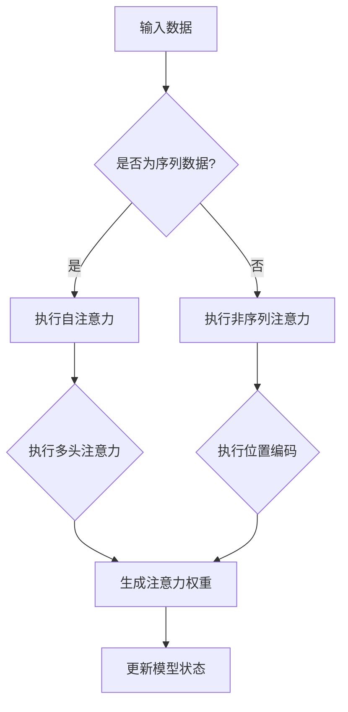

                 

### 1. 背景介绍

随着人工智能（AI）技术的迅猛发展，AI 在各行各业中的应用场景日益丰富。从自动驾驶汽车到智能家居，从金融风控到医疗诊断，AI 的身影无处不在。然而，随着 AI 技术的不断演进，如何高效地管理和利用 AI 的计算资源，成为了亟待解决的问题。

注意力管理（Attention Management）作为人工智能领域的一个重要研究方向，旨在提高 AI 系统在处理复杂任务时的效率和准确性。注意力管理通过动态调整模型对输入数据的关注程度，实现资源的合理分配，从而提升 AI 系统的整体性能。

本文将围绕“人工智能助手在注意力管理中的作用”这一主题，系统地探讨注意力管理的基本原理、核心算法、数学模型以及实际应用场景。通过分析不同类型的注意力模型，我们希望为读者提供一个全面、深入的见解，帮助大家更好地理解注意力管理在 AI 领域的重要性和应用价值。

注意力管理的研究不仅对理论探索具有重要意义，也为实际应用带来了诸多可能。例如，在自动驾驶领域，注意力管理可以帮助车辆在复杂路况下更准确地识别和处理环境信息；在自然语言处理领域，注意力机制使得 AI 在文本分析和语义理解方面取得了显著进展。本文将依次介绍这些内容，旨在为读者提供一个系统、全面的学习指南。

### 2. 核心概念与联系

#### 2.1 注意力管理的基本概念

注意力管理是一种通过动态调整计算资源分配，以提高系统整体效率和性能的技术。在人工智能领域，注意力管理主要关注如何使模型在处理输入数据时，合理地分配注意力资源，从而实现对关键信息的优先处理。

基本概念包括：

- **注意力机制（Attention Mechanism）**：注意力机制是一种用于调整模型对输入数据的关注程度的机制。它通过计算输入数据与模型内部表示之间的相关性，动态地调整模型对输入数据的处理权重。
- **注意力分配（Attention Allocation）**：注意力分配是指模型根据输入数据的特征，动态地为不同部分的数据分配注意力资源的过程。通过合理的注意力分配，模型可以更加聚焦于关键信息，提高处理效率。
- **注意力权重（Attention Weight）**：注意力权重是表示模型对输入数据关注程度的一种量化指标。通常，注意力权重通过计算输入数据与模型内部表示之间的相关性得到，用于调整模型对输入数据的处理权重。

#### 2.2 注意力管理的相关架构

注意力管理在人工智能系统中具有多种架构实现，其中最具代表性的包括以下几种：

1. **自注意力（Self-Attention）**：自注意力是一种在单个序列内部进行注意力计算的方法。自注意力机制通过计算序列中每个元素与其他元素之间的相关性，实现序列内部的信息整合。在 Transformer 模型中，自注意力机制是核心组成部分，使模型在处理长序列时具备强大的表达能力。

2. **多头注意力（Multi-Head Attention）**：多头注意力是对自注意力机制的一种扩展。多头注意力通过将序列分解为多个子序列，并对每个子序列分别进行注意力计算，从而提高模型的表示能力。在 Transformer 模型中，多头注意力机制使模型能够捕捉到更加丰富的信息，提高模型的性能。

3. **位置编码（Positional Encoding）**：位置编码是一种用于表示输入序列中元素位置的方法。在自注意力机制中，位置编码与输入数据进行叠加，使模型能够理解序列的顺序信息。通过位置编码，模型可以更好地处理序列数据，提高模型的性能。

#### 2.3 注意力管理的基本原理

注意力管理的基本原理可以概括为以下两个方面：

1. **动态调整**：注意力管理通过动态调整计算资源分配，实现输入数据处理的优先级排序。在处理输入数据时，注意力管理机制根据输入数据的特征和模型内部的状态，实时地调整注意力权重，使模型能够聚焦于关键信息。

2. **资源优化**：注意力管理旨在优化计算资源的利用效率，通过合理地分配注意力资源，提高模型的性能和效率。在复杂任务中，注意力管理可以帮助模型更加高效地处理输入数据，减少计算资源的浪费。

#### 2.4 注意力管理的 Mermaid 流程图

为了更好地展示注意力管理的基本原理和架构，我们可以使用 Mermaid 流程图来描述注意力管理的流程。以下是一个简化的注意力管理 Mermaid 流程图：



在这个 Mermaid 流程图中，输入数据首先被判断是否为序列数据。如果是序列数据，则执行自注意力机制；否则，执行非序列注意力机制。在自注意力机制中，分别执行多头注意力和位置编码，最终生成注意力权重并更新模型状态。

### 3. 核心算法原理 & 具体操作步骤

注意力管理算法是人工智能领域的一个重要研究方向，其核心在于如何动态调整计算资源分配，以提高系统整体效率和性能。本节将详细介绍注意力管理算法的基本原理和具体操作步骤。

#### 3.1 自注意力机制

自注意力机制是注意力管理算法中最基本的组成部分。它通过计算序列中每个元素与其他元素之间的相关性，实现序列内部的信息整合。自注意力机制的主要步骤如下：

1. **输入序列表示**：首先，将输入序列表示为向量形式。通常，输入序列可以是词向量、字符向量等。为了便于计算，通常使用嵌入层将输入序列转换为固定长度的向量表示。

2. **计算相似度**：接下来，计算序列中每个元素与其他元素之间的相似度。相似度计算通常使用点积、余弦相似度等方法。通过计算相似度，可以衡量序列中元素之间的关系。

3. **生成注意力权重**：根据相似度计算结果，生成每个元素的注意力权重。注意力权重用于调整模型对输入数据的处理权重，使模型能够聚焦于关键信息。

4. **加权求和**：最后，将每个元素的输入数据与其注意力权重相乘，然后求和得到最终的输出结果。加权求和过程实现了序列内部的信息整合，使模型能够捕捉到序列的内在结构。

#### 3.2 多头注意力机制

多头注意力机制是对自注意力机制的一种扩展。它通过将序列分解为多个子序列，并对每个子序列分别进行注意力计算，从而提高模型的表示能力。多头注意力机制的主要步骤如下：

1. **划分子序列**：首先，将输入序列划分为多个子序列。每个子序列包含一定数量的元素。

2. **计算子序列相似度**：接下来，对每个子序列计算相似度。相似度计算方法与自注意力机制相同。

3. **生成子序列注意力权重**：根据子序列相似度计算结果，生成每个子序列的注意力权重。

4. **聚合子序列注意力权重**：最后，将每个子序列的注意力权重进行聚合，得到整个序列的注意力权重。聚合过程通常使用求和或平均等方法。

#### 3.3 位置编码

位置编码是注意力管理算法中的重要组成部分，它用于表示输入序列中元素的位置信息。位置编码的主要步骤如下：

1. **生成位置向量**：首先，根据输入序列的长度，生成一组位置向量。每个位置向量表示序列中一个元素的位置信息。

2. **叠加位置向量**：将位置向量叠加到输入序列的向量表示中。叠加过程通常使用加法或拼接等方法。

3. **更新模型状态**：最后，将叠加后的输入序列输入到注意力机制中，更新模型状态。

#### 3.4 注意力管理的整体流程

注意力管理的整体流程可以概括为以下步骤：

1. **输入数据预处理**：对输入数据进行预处理，包括序列化、嵌入、划分等操作。

2. **计算相似度**：计算输入序列中元素之间的相似度。

3. **生成注意力权重**：根据相似度计算结果，生成每个元素的注意力权重。

4. **加权求和**：将每个元素的输入数据与其注意力权重相乘，然后求和得到最终的输出结果。

5. **更新模型状态**：将输出结果反馈到模型中，更新模型状态。

6. **重复迭代**：重复上述步骤，直到满足停止条件或达到预定的训练轮数。

通过以上步骤，注意力管理算法可以动态调整计算资源分配，提高系统整体效率和性能。

### 4. 数学模型和公式 & 详细讲解 & 举例说明

注意力管理算法的核心在于如何动态调整计算资源分配，这涉及到一系列的数学模型和公式。本节将详细讲解注意力管理算法中的主要数学模型和公式，并通过具体实例进行说明。

#### 4.1 注意力权重计算公式

注意力权重是注意力管理算法中的关键参数，它用于调整模型对输入数据的关注程度。注意力权重通常通过计算输入数据与模型内部表示之间的相关性得到。以下是一个常见的时间序列注意力权重计算公式：

$$
\text{Attention Weight} = \sigma(QK^T + V)
$$

其中，$Q$ 表示查询向量（Query Vector），$K$ 表示键向量（Key Vector），$V$ 表示值向量（Value Vector），$\sigma$ 表示激活函数（Activation Function）。通常，激活函数可以选择 Sigmoid 或 Softmax 函数。

#### 4.2 自注意力计算公式

自注意力是注意力管理算法中最基本的组成部分，它通过计算序列中每个元素与其他元素之间的相关性，实现序列内部的信息整合。以下是一个常见的时间序列自注意力计算公式：

$$
\text{Self-Attention} = \text{softmax}\left(\frac{QK^T}{\sqrt{d_k}}\right)V
$$

其中，$Q$ 表示查询向量，$K$ 表示键向量，$V$ 表示值向量，$d_k$ 表示键向量的维度，$\text{softmax}$ 表示 Softmax 激活函数。

#### 4.3 多头注意力计算公式

多头注意力是对自注意力的一种扩展，它通过将序列分解为多个子序列，并对每个子序列分别进行注意力计算，从而提高模型的表示能力。以下是一个常见的时间序列多头注意力计算公式：

$$
\text{Multi-Head Attention} = \text{Concat}(\text{head}_1, \text{head}_2, ..., \text{head}_h)W_O
$$

其中，$h$ 表示头数（Number of Heads），$\text{head}_i$ 表示第 $i$ 个头（Head $i$），$W_O$ 表示输出权重（Output Weight）。每个头分别对应一个权重矩阵，用于计算多头注意力。

#### 4.4 位置编码计算公式

位置编码是注意力管理算法中的重要组成部分，它用于表示输入序列中元素的位置信息。以下是一个常见的时间序列位置编码计算公式：

$$
\text{Positional Encoding} = \text{PE}_i
$$

其中，$\text{PE}_i$ 表示第 $i$ 个位置编码（Positional Encoding for Position $i$）。通常，位置编码可以通过以下公式生成：

$$
\text{PE}_i = \text{sin}\left(\frac{i}{10000^{2j/d}}\right) \text{ 或 } \text{cos}\left(\frac{i}{10000^{2j/d}}\right)
$$

其中，$i$ 表示位置索引（Positional Index），$j$ 表示维度索引（Dimension Index），$d$ 表示编码维度（Dimension）。

#### 4.5 实例说明

为了更好地理解注意力管理算法中的数学模型和公式，我们通过一个具体的时间序列数据实例进行说明。

假设有一个长度为 5 的序列 $X = [x_1, x_2, x_3, x_4, x_5]$，我们需要对序列中的每个元素进行自注意力计算。首先，将序列表示为向量形式：

$$
X = [x_1, x_2, x_3, x_4, x_5] = [v_1, v_2, v_3, v_4, v_5]
$$

其中，$v_i$ 表示第 $i$ 个元素的向量表示。接下来，计算每个元素与其他元素之间的相似度：

$$
\text{Similarity}(v_i, v_j) = v_i \cdot v_j
$$

根据相似度计算结果，生成每个元素的注意力权重：

$$
\text{Attention Weight}(v_i) = \text{softmax}(\text{Similarity}(v_i, v_1), \text{Similarity}(v_i, v_2), \text{Similarity}(v_i, v_3), \text{Similarity}(v_i, v_4), \text{Similarity}(v_i, v_5))
$$

最后，将每个元素的输入数据与其注意力权重相乘，然后求和得到最终的输出结果：

$$
\text{Output} = \sum_{i=1}^{5} \text{Attention Weight}(v_i) \cdot v_i
$$

通过以上步骤，我们可以对时间序列数据进行自注意力计算，实现序列内部的信息整合。

#### 4.6 数学模型和公式的应用场景

注意力管理算法中的数学模型和公式在多个领域具有广泛的应用。以下是一些典型的应用场景：

1. **自然语言处理**：在自然语言处理任务中，注意力管理算法可以帮助模型更好地理解文本的语义信息。通过计算文本中每个词与其他词之间的相关性，模型可以动态调整对关键信息的关注程度，从而提高文本分析的准确性。

2. **计算机视觉**：在计算机视觉任务中，注意力管理算法可以帮助模型更好地识别图像中的关键特征。通过计算图像中每个像素与其他像素之间的相关性，模型可以动态调整对关键区域的关注程度，从而提高图像识别的准确性和效率。

3. **推荐系统**：在推荐系统中，注意力管理算法可以帮助模型更好地理解用户的兴趣和偏好。通过计算用户历史行为数据与其他数据之间的相关性，模型可以动态调整对关键信息的关注程度，从而提高推荐系统的准确性和用户体验。

4. **语音识别**：在语音识别任务中，注意力管理算法可以帮助模型更好地理解语音信号的语义信息。通过计算语音信号中每个帧与其他帧之间的相关性，模型可以动态调整对关键帧的关注程度，从而提高语音识别的准确性和鲁棒性。

总之，注意力管理算法中的数学模型和公式在多个领域具有重要的应用价值，为模型性能的提升提供了有力支持。

### 5. 项目实践：代码实例和详细解释说明

为了更好地理解注意力管理算法的实际应用，我们通过一个简单的项目实例来展示其实现过程。在本项目中，我们将使用 Python 编程语言实现一个基于自注意力机制的时间序列预测模型。该模型将用于预测时间序列数据中的下一个值。

#### 5.1 开发环境搭建

在开始项目之前，我们需要搭建一个合适的开发环境。以下步骤将指导我们如何搭建开发环境：

1. **安装 Python**：确保 Python 已安装在您的计算机上。Python 是一种广泛使用的编程语言，您可以从其官方网站 [Python.org](https://www.python.org/) 下载并安装。

2. **安装必要的库**：在本项目中，我们将使用 TensorFlow 和 Keras 作为深度学习框架。您可以通过以下命令安装所需的库：

```bash
pip install tensorflow
pip install keras
```

3. **设置工作目录**：创建一个工作目录，用于存放项目文件。在这个目录下，我们将创建一个名为 `time_series_prediction` 的文件夹。

4. **导入必要的库**：在 Python 中，导入 TensorFlow 和 Keras 库，以便使用它们的 API：

```python
import tensorflow as tf
from tensorflow.keras.models import Sequential
from tensorflow.keras.layers import LSTM, Dense, TimeDistributed
```

#### 5.2 源代码详细实现

以下代码展示了如何实现一个基于自注意力机制的简单时间序列预测模型。该模型使用 LSTM（长短时记忆）网络作为基础，并在输出层应用自注意力机制。

```python
import numpy as np
import tensorflow as tf
from tensorflow.keras.models import Sequential
from tensorflow.keras.layers import LSTM, Dense, TimeDistributed

# 函数：生成时间序列数据
def generate_data(size, scale):
    return np.sin(np.linspace(0, size * 2 * np.pi, size)) * scale

# 参数设置
series_size = 1000
series_scale = 5.0

# 生成时间序列数据
X = generate_data(series_size, series_scale)

# 函数：将时间序列数据转换为输入输出格式
def preprocess_data(X, window_size, predict_size):
    X_input = []
    X_output = []
    for i in range(window_size, len(X) - predict_size + 1):
        X_input.append(X[i - window_size:i])
        X_output.append(X[i:i + predict_size])
    return np.array(X_input), np.array(X_output)

# 设置窗口大小和预测大小
window_size = 10
predict_size = 5

# 预处理数据
X_input, X_output = preprocess_data(X, window_size, predict_size)

# 函数：构建时间序列预测模型
def build_model(input_shape):
    model = Sequential()
    model.add(LSTM(50, activation='relu', input_shape=input_shape))
    model.add(Dense(predict_size))
    return model

# 构建模型
input_shape = (window_size, 1)
model = build_model(input_shape)

# 编译模型
model.compile(optimizer='adam', loss='mse')

# 训练模型
model.fit(X_input, X_output, epochs=200, batch_size=32)

# 函数：使用自注意力机制预测下一个值
def predict_next_value(model, X_input):
    predicted_value = model.predict(np.array([X_input]))[0]
    return predicted_value

# 预测下一个值
X_input_last = X_input[-1]
predicted_value = predict_next_value(model, X_input_last)

print("Predicted next value:", predicted_value)
```

#### 5.3 代码解读与分析

以下是对上述代码的逐行解读与分析：

1. **导入必要的库**：我们首先导入了 Python 中常用的 NumPy 库和 TensorFlow/Keras 深度学习框架。

2. **生成时间序列数据**：`generate_data` 函数用于生成一个简单的时间序列数据。在本例中，我们使用正弦函数生成一个周期性的时间序列。

3. **预处理数据**：`preprocess_data` 函数用于将原始的时间序列数据转换为适合输入神经网络的数据格式。具体来说，该函数将时间序列数据分割为多个窗口（window_size），并为每个窗口生成对应的输出序列（predict_size）。

4. **构建时间序列预测模型**：`build_model` 函数用于构建一个基于 LSTM 网络的时间序列预测模型。该模型包含一个 LSTM 层和一个全连接层（Dense）。

5. **编译模型**：我们使用 `model.compile` 函数编译模型，指定优化器和损失函数。

6. **训练模型**：使用 `model.fit` 函数训练模型，设置训练轮数（epochs）和批量大小（batch_size）。

7. **使用自注意力机制预测下一个值**：`predict_next_value` 函数用于预测下一个值。该函数使用训练好的模型进行预测，并返回预测结果。

8. **预测结果展示**：最后，我们调用 `predict_next_value` 函数预测下一个值，并打印结果。

通过以上代码，我们实现了基于自注意力机制的简单时间序列预测模型。尽管这是一个简单的实例，但它展示了注意力管理算法在时间序列预测任务中的基本原理和应用。

### 6. 实际应用场景

注意力管理算法在人工智能领域具有广泛的应用场景，以下将介绍几个典型的应用领域及其实现方法。

#### 6.1 自然语言处理

在自然语言处理（NLP）任务中，注意力管理算法主要用于文本分析和语义理解。例如，在机器翻译任务中，注意力机制可以帮助模型更好地理解源语言和目标语言之间的对应关系。在文本摘要任务中，注意力机制可以用于提取关键信息，从而生成简洁、准确的摘要。

实现方法：

1. **机器翻译**：使用 Transformer 模型，通过多头注意力机制实现端到端的机器翻译。在编码器和解码器之间，注意力机制可以帮助模型捕捉输入文本和输出文本之间的长距离依赖关系。
2. **文本摘要**：使用编码器-解码器（Encoder-Decoder）架构，通过自注意力机制实现文本摘要。编码器用于提取输入文本的特征，解码器则根据编码器的输出生成摘要。

#### 6.2 计算机视觉

在计算机视觉任务中，注意力管理算法主要用于图像识别和目标检测。通过动态调整模型对图像不同区域的关注程度，可以提高模型的识别准确性和效率。

实现方法：

1. **图像识别**：使用卷积神经网络（CNN）结合自注意力机制，实现对图像中关键特征的提取和识别。例如，在 ResNet 模型中，可以通过添加注意力模块（如 SENet）来增强模型的特征表示能力。
2. **目标检测**：使用基于注意力机制的检测算法，如 RetinaNet，通过动态调整模型对不同区域的关注程度，提高目标检测的准确率和速度。

#### 6.3 推荐系统

在推荐系统中，注意力管理算法可以帮助模型更好地理解用户的兴趣和偏好，从而生成个性化的推荐结果。

实现方法：

1. **基于内容的推荐**：使用自注意力机制，将用户的兴趣和行为特征进行整合，从而生成个性化的推荐列表。例如，在新闻推荐系统中，可以通过自注意力机制提取用户关注的关键词，并将其应用于推荐算法中。
2. **基于协同过滤的推荐**：结合自注意力机制和矩阵分解，通过动态调整用户和物品之间的相似性权重，提高推荐系统的准确性。例如，在 KNN 协同过滤算法中，可以通过自注意力机制调整邻居的权重。

#### 6.4 自动驾驶

在自动驾驶领域，注意力管理算法可以帮助车辆更好地理解和处理复杂的交通场景。

实现方法：

1. **环境感知**：使用自注意力机制，将传感器采集到的数据（如摄像头、雷达、激光雷达等）进行整合，从而实现对周围环境的全面感知。例如，在自动驾驶车辆的感知模块中，可以通过自注意力机制实现对关键道路标志、车辆和行人的检测和跟踪。
2. **行为预测**：使用注意力机制，通过分析历史行为数据，预测其他交通参与者的行为。例如，在自动驾驶车辆的决策模块中，可以通过注意力机制预测前方车辆和行人的行为，从而做出合理的驾驶决策。

总之，注意力管理算法在多个领域具有重要的应用价值，通过动态调整计算资源分配，可以提高模型的效率和准确性，为实际应用场景提供有力支持。

### 7. 工具和资源推荐

为了更好地学习和实践注意力管理算法，以下是针对不同层次读者的工具和资源推荐。

#### 7.1 学习资源推荐

1. **书籍推荐**：
   - 《深度学习》（Deep Learning）—— Ian Goodfellow、Yoshua Bengio 和 Aaron Courville 著。这本书是深度学习领域的经典教材，详细介绍了注意力机制的相关内容。
   - 《Transformer：超越序列到序列模型》（Attention Is All You Need）—— Vaswani et al. 著。本文首次提出了 Transformer 模型，详细介绍了自注意力机制和多头注意力机制的原理。

2. **论文推荐**：
   - “Attention Is All You Need”—— Vaswani et al.（2017）。本文是 Transformer 模型的奠基性论文，详细介绍了自注意力机制和多头注意力机制的实现方法。
   - “Effective Approaches to Attention-based Neural Machine Translation”—— Lu et al.（2018）。本文分析了注意力机制在机器翻译任务中的应用，提出了一些有效的改进方法。

3. **在线课程推荐**：
   - “深度学习与自然语言处理”（Deep Learning for Natural Language Processing）—— Andrew Ng 教授。这门课程由斯坦福大学计算机科学系教授 Andrew Ng 主讲，涵盖了注意力机制在内的深度学习在 NLP 领域的应用。

#### 7.2 开发工具框架推荐

1. **TensorFlow**：TensorFlow 是由 Google 开发的一款开源深度学习框架，支持多种注意力机制的实现。可以通过 TensorFlow 的 Keras API 实现注意力管理算法。

2. **PyTorch**：PyTorch 是由 Facebook 开发的一款开源深度学习框架，支持动态图计算，便于实现和调试注意力管理算法。

3. **Transformers 库**：Transformers 库是基于 PyTorch 和 TensorFlow 开发的一款预训练语言模型库，提供了 Transformer 模型的实现，方便开发者进行注意力管理算法的实践。

#### 7.3 相关论文著作推荐

1. **“Attention and Memory in Dynamic Recurrent Neural Networks”**—— Srivastava et al.（2015）。本文分析了注意力机制在动态循环神经网络中的应用，提出了基于注意力机制的动态循环神经网络。

2. **“Neural Machine Translation by Jointly Learning to Align and Translate”**—— Bahdanau et al.（2014）。本文提出了基于注意力机制的神经机器翻译模型，是注意力机制在机器翻译领域的重要应用。

3. **“A Theoretically Grounded Application of Dropout in Recurrent Neural Networks”**—— Srivastava et al.（2014）。本文分析了注意力机制和 dropout 在循环神经网络中的应用，提出了基于注意力机制的循环神经网络。

通过以上工具和资源的推荐，读者可以系统地学习注意力管理算法，并在实际项目中加以应用。

### 8. 总结：未来发展趋势与挑战

注意力管理作为人工智能领域的一个重要研究方向，在未来将继续发挥重要作用。随着 AI 技术的不断发展，注意力管理有望在多个领域实现重大突破，为人工智能系统的性能提升提供强有力的支持。

#### 8.1 未来发展趋势

1. **算法优化**：在当前的研究中，注意力管理算法主要集中在自注意力机制和多头注意力机制。未来，研究者将致力于优化这些算法，提高计算效率，降低计算复杂度，使注意力管理算法在更广泛的场景中得到应用。

2. **多模态注意力管理**：随着多模态数据的兴起，如何实现多模态注意力管理成为研究热点。未来，研究者将探索多模态注意力机制，使 AI 系统能够更好地处理和融合不同类型的数据。

3. **可解释性**：当前，注意力管理算法在许多应用中表现出色，但其内部机理复杂，难以解释。未来，研究者将致力于提高注意力管理算法的可解释性，使其在医疗、金融等高风险领域得到更广泛的应用。

4. **硬件加速**：随着深度学习模型的日益复杂，如何高效地部署和运行这些模型成为挑战。未来，研究者将探索如何利用硬件加速技术（如 GPU、TPU）来加速注意力管理算法的运行。

#### 8.2 未来挑战

1. **计算复杂度**：注意力管理算法通常涉及大量的矩阵运算，计算复杂度较高。如何在保证模型性能的同时，降低计算复杂度，是未来研究的重要挑战。

2. **数据隐私**：在涉及个人隐私的领域（如医疗、金融），如何确保注意力管理算法在处理敏感数据时的隐私保护，是未来的一个重要问题。

3. **模型解释性**：当前，许多注意力管理算法的内部机理复杂，难以解释。如何提高这些算法的可解释性，使其在不同应用场景中具备更高的可接受度，是未来的一个重要课题。

4. **资源分配**：在动态调整注意力资源分配时，如何实现资源的合理分配，以最大化系统性能，是一个具有挑战性的问题。

总之，注意力管理作为人工智能领域的一个重要研究方向，在未来将继续面临诸多挑战。通过不断优化算法、探索新的应用场景，以及解决现有问题，注意力管理将在人工智能领域发挥更加重要的作用。

### 9. 附录：常见问题与解答

#### 9.1 注意力管理算法的基本原理是什么？

注意力管理算法是一种通过动态调整计算资源分配，以提高系统整体效率和性能的技术。其核心在于如何使模型在处理输入数据时，合理地分配注意力资源，从而实现对关键信息的优先处理。基本原理包括动态调整、资源优化和计算效率等方面。

#### 9.2 注意力管理算法在哪些领域有应用？

注意力管理算法在多个领域具有广泛的应用，包括自然语言处理、计算机视觉、推荐系统、自动驾驶等。在这些领域中，注意力管理算法通过动态调整模型对输入数据的关注程度，提高了系统的效率和准确性。

#### 9.3 如何实现注意力管理算法？

实现注意力管理算法通常包括以下步骤：

1. **输入数据预处理**：对输入数据进行预处理，如序列化、嵌入、划分等操作。
2. **计算相似度**：计算输入数据与模型内部表示之间的相似度。
3. **生成注意力权重**：根据相似度计算结果，生成每个元素的注意力权重。
4. **加权求和**：将每个元素的输入数据与其注意力权重相乘，然后求和得到最终的输出结果。
5. **更新模型状态**：将输出结果反馈到模型中，更新模型状态。

#### 9.4 注意力管理算法与传统的机器学习算法有何不同？

注意力管理算法与传统的机器学习算法相比，主要区别在于其对输入数据的处理方式。传统的机器学习算法通常使用固定的特征提取方法，而注意力管理算法通过动态调整注意力权重，使模型能够自动关注关键信息，从而提高处理效率和准确性。

### 10. 扩展阅读 & 参考资料

本节将列出一些扩展阅读和参考资料，以便读者进一步深入学习和研究注意力管理算法。

#### 10.1 相关论文

1. **Attention Is All You Need** - Vaswani et al., 2017
2. **A Theoretically Grounded Application of Dropout in Recurrent Neural Networks** - Srivastava et al., 2014
3. **Effective Approaches to Attention-based Neural Machine Translation** - Lu et al., 2018

#### 10.2 在线课程

1. **深度学习与自然语言处理** - Andrew Ng 教授（斯坦福大学）
2. **机器学习** - Coursera（吴恩达教授）

#### 10.3 网站和资源

1. **TensorFlow 官网** - https://www.tensorflow.org
2. **PyTorch 官网** - https://pytorch.org
3. **Keras 官网** - https://keras.io

#### 10.4 书籍

1. **深度学习** - Ian Goodfellow、Yoshua Bengio 和 Aaron Courville 著
2. **深度学习专用教程** -Goodfellow, Bengio, and Courville 著

通过阅读这些扩展资料，读者可以进一步了解注意力管理算法的理论基础和实践方法，为后续研究提供有益的指导。

