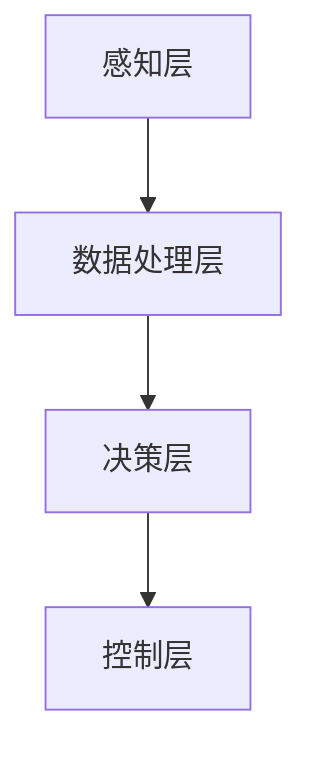

                 

### 1. 背景介绍

#### 1.1 人工智能的兴起

人工智能（Artificial Intelligence, AI）作为计算机科学的一个分支，其目的是研究、开发用于模拟、延伸和扩展人类智能的理论、方法、技术和应用系统。人工智能的概念可以追溯到20世纪50年代，当时科学家们开始探索如何使计算机具有人类的智能。

在过去的几十年中，随着计算能力的提升、大数据技术的发展以及深度学习算法的突破，人工智能取得了令人瞩目的进展。尤其是在图像识别、自然语言处理、机器学习和自动驾驶等领域，人工智能的应用已经变得非常广泛。

#### 1.2 人工智能在交通和自动驾驶中的重要性

交通是社会发展的重要基础设施，而自动驾驶则是交通领域的一次革命性变革。自动驾驶技术能够通过人工智能算法，使车辆在没有人类干预的情况下，自动完成行驶、避障、导航等功能。这不仅能够提高交通效率，减少交通事故，还能有效缓解城市交通拥堵问题。

人工智能在自动驾驶中的应用主要包括以下几个方面：

1. **感知系统**：自动驾驶汽车需要通过传感器（如激光雷达、摄像头、雷达等）来感知周围环境，收集道路、车辆、行人等数据。
2. **决策系统**：基于感知系统收集的数据，自动驾驶汽车需要做出实时的决策，包括加速、减速、转向等。
3. **控制系统**：执行决策系统下达的指令，控制汽车的实际动作。

#### 1.3 自动驾驶技术的发展现状

目前，自动驾驶技术已经从实验室阶段逐步走向商业化应用。不同级别的自动驾驶技术正在全球范围内得到推广和部署。根据国际自动机工程师学会（SAE）的定义，自动驾驶技术分为0级到5级，其中0级为完全人工驾驶，5级为完全自动无人驾驶。

- **0级**：完全人工驾驶，车辆的所有操作都由人类驾驶员完成。
- **1级**：部分自动化，车辆具有单一功能的自动化，如自适应巡航控制。
- **2级**：部分自动化，车辆可以同时控制加速、减速和转向。
- **3级**：有条件自动化，车辆可以在特定环境下完全接管驾驶，但需要驾驶员在必要时接管。
- **4级**：高度自动化，车辆可以在大多数情况下完全接管驾驶，但需要驾驶员在特殊情况下接管。
- **5级**：完全自动化，车辆在任何情况下都不需要驾驶员干预。

目前，许多公司，包括特斯拉、谷歌、百度、特斯拉、Uber等，都在积极研发和推广自动驾驶汽车。虽然完全自动化的自动驾驶技术尚未完全成熟，但许多公司已经推出了具备一定自动驾驶功能的车辆，并在部分城市进行测试和商业化运营。

### 2. 核心概念与联系

#### 2.1 人工智能与自动驾驶的核心概念

在讨论人工智能在自动驾驶中的应用之前，我们需要了解一些核心概念。以下是人工智能和自动驾驶中常用的几个关键术语：

1. **传感器融合**：将来自不同传感器（如摄像头、激光雷达、雷达等）的数据进行融合，以获得更全面、准确的感知信息。
2. **深度学习**：一种人工智能算法，通过模拟人脑神经网络的结构和功能，对大量数据进行训练，以实现图像识别、语音识别等功能。
3. **决策树**：一种常见的机器学习算法，通过一系列规则来对输入数据进行分类或回归。
4. **强化学习**：一种机器学习算法，通过试错和奖励机制来学习如何在环境中做出最优决策。
5. **计算机视觉**：研究如何使计算机像人类一样理解、解释和交互视觉信息。

#### 2.2 自动驾驶系统架构

自动驾驶系统通常包括多个层次，从低层次的数据感知到高层次的任务决策。以下是一个典型的自动驾驶系统架构：

1. **感知层**：使用各种传感器（如摄像头、激光雷达、雷达等）收集环境数据。
2. **数据处理层**：对感知层收集的数据进行处理，包括数据清洗、特征提取等。
3. **决策层**：基于处理后的数据，使用算法（如深度学习、决策树、强化学习等）进行决策。
4. **控制层**：执行决策层的指令，控制车辆的运动。

#### 2.3 Mermaid 流程图

以下是自动驾驶系统架构的 Mermaid 流程图：



在这个流程图中，A 代表感知层，B 代表数据处理层，C 代表决策层，D 代表控制层。感知层收集环境数据，然后传递给数据处理层，处理后的数据用于决策层，决策层根据数据做出决策，最终由控制层执行这些决策。

### 3. 核心算法原理 & 具体操作步骤

#### 3.1 感知层算法

感知层是自动驾驶系统的第一步，其主要任务是收集并处理环境数据。以下是常用的感知层算法：

1. **摄像头数据处理**：
   - **特征提取**：使用卷积神经网络（CNN）对摄像头图像进行特征提取。
   - **目标检测**：使用 R-CNN、SSD、YOLO 等算法对提取的特征进行目标检测。
2. **激光雷达数据处理**：
   - **点云处理**：将激光雷达产生的点云数据进行处理，提取道路、车辆、行人等信息。
   - **深度估计**：使用深度学习算法，如点云语义分割，对点云数据进行深度估计。

#### 3.2 决策层算法

决策层是自动驾驶系统的核心，其主要任务是分析感知层的数据，并根据交通规则、环境因素等，做出行驶决策。以下是常用的决策层算法：

1. **路径规划**：
   - **Dijkstra 算法**：用于求解最短路径问题。
   - **A*算法**：在 Dijkstra 算法的基础上，引入启发式函数，提高搜索效率。
2. **行为规划**：
   - **规则基方法**：基于交通规则，设计一系列行为规则。
   - **行为预测**：使用机器学习算法，预测周围车辆的行为，以做出相应的反应。

#### 3.3 控制层算法

控制层是自动驾驶系统的执行层，其主要任务是执行决策层做出的决策。以下是常用的控制层算法：

1. **PID 控制**：通过比例（P）、积分（I）、微分（D）三个部分，调节车辆的速度和方向。
2. **模糊控制**：基于模糊逻辑，对车辆进行控制。
3. **模型预测控制**（Model Predictive Control, MPC）：通过预测未来的行为，优化控制策略。

### 4. 数学模型和公式 & 详细讲解 & 举例说明

#### 4.1 感知层数学模型

感知层算法主要涉及图像处理和点云处理，以下是相关的数学模型：

1. **卷积神经网络（CNN）**：
   - **卷积操作**：$$ f(x, y) = \sum_{i=1}^{n} w_{i} * g(x-i, y-i) + b $$
   - **激活函数**：$$ \sigma(z) = \max(0, z) $$
2. **目标检测算法**：
   - **R-CNN**：
     - **区域建议**：$$ R = \{ R_{i} \} $$
     - **分类**：$$ P(y \mid R) = \prod_{i=1}^{N} P(y_{i} \mid R_{i}) $$
   - **SSD**：
     - **锚框生成**：$$ A = \{ a_{i} \} $$
     - **损失函数**：$$ L = \lambda \sum_{i=1}^{N} \max(0, 1 - iou(a_{i}, b_{i})) + \lambda \sum_{i=1}^{N} \max(0, 1 - log(P(a_{i} \mid b_{i}))) $$
   - **YOLO**：
     - **边界框生成**：$$ B = \{ b_{i} \} $$
     - **损失函数**：$$ L = \sum_{i=1}^{N} \lambda_{c} \sum_{c=1}^{C} \max(0, 1 - P_{c}) + \lambda_{noobj} \sum_{i=1}^{N} \max(0, 1 - P_{noobj}) + \lambda_{obj} \sum_{i=1}^{N} \sum_{c=1}^{C} (1 - P_{c}) \times (1 - \hat{P}_{c}) $$

#### 4.2 决策层数学模型

决策层算法主要涉及路径规划和行为规划，以下是相关的数学模型：

1. **路径规划算法**：
   - **Dijkstra 算法**：
     - **最短路径**：$$ d(v) = \min \{ d(u) + w(u, v) \mid u \in G \} $$
   - **A*算法**：
     - **启发式函数**：$$ h(v) = d(v) + \min \{ w(v, u) \mid u \in G \} $$
     - **估价函数**：$$ f(v) = d(v) + h(v) $$
2. **行为规划算法**：
   - **规则基方法**：
     - **规则**：$$ \text{if } \text{condition}, \text{ then } \text{action} $$
   - **行为预测算法**：
     - **马尔可夫决策过程（MDP）**：
       - **状态**：$$ S = \{ s_{i} \} $$
       - **动作**：$$ A = \{ a_{i} \} $$
       - **奖励**：$$ R(s, a) = \sum_{s'} P(s' \mid s, a) \cdot r(s') $$
       - **价值函数**：$$ V(s) = \max_{a} \sum_{s'} P(s' \mid s, a) \cdot V(s') $$

#### 4.3 控制层数学模型

控制层算法主要涉及 PID 控制、模糊控制和模型预测控制，以下是相关的数学模型：

1. **PID 控制**：
   - **输出**：$$ u(t) = K_p e(t) + K_i \int_{0}^{t} e(\tau)d\tau + K_d \frac{de(t)}{dt} $$
   - **误差**：$$ e(t) = r(t) - y(t) $$
2. **模糊控制**：
   - **模糊规则**：$$ \text{if } A \text{ is } \mu_1 \text{ and } B \text{ is } \mu_2, \text{ then } C \text{ is } \mu_3 $$
   - **模糊推理**：$$ \mu_C^*(x_C) = \max(\mu_A^*(x_A), \mu_B^*(x_B)) $$
3. **模型预测控制（MPC）**：
   - **状态预测**：$$ x_{k+1} = f(x_k, u_k) $$
   - **成本函数**：$$ J = \sum_{k=0}^{N-1} w_k [g_k(x_k, u_k)]^2 $$
   - **优化问题**：$$ \min_{u_0, u_1, ..., u_{N-1}} J $$

### 5. 项目实践：代码实例和详细解释说明

#### 5.1 开发环境搭建

为了实践人工智能在自动驾驶中的应用，我们需要搭建一个合适的开发环境。以下是所需的软件和硬件：

1. **软件**：
   - 操作系统：Ubuntu 18.04
   - 编程语言：Python 3.7
   - 深度学习框架：TensorFlow 2.0
   - 数据可视化工具：Matplotlib
2. **硬件**：
   - CPU：Intel Core i7 或以上
   - GPU：NVIDIA GTX 1080 或以上

#### 5.2 源代码详细实现

以下是感知层、决策层和控制层的核心代码实现：

```python
# 感知层代码示例

import cv2
import numpy as np
import tensorflow as tf

# 加载摄像头
cap = cv2.VideoCapture(0)

# 定义卷积神经网络模型
model = tf.keras.Sequential([
    tf.keras.layers.Conv2D(32, (3, 3), activation='relu', input_shape=(128, 128, 3)),
    tf.keras.layers.MaxPooling2D((2, 2)),
    tf.keras.layers.Conv2D(64, (3, 3), activation='relu'),
    tf.keras.layers.MaxPooling2D((2, 2)),
    tf.keras.layers.Conv2D(64, (3, 3), activation='relu'),
    tf.keras.layers.Flatten(),
    tf.keras.layers.Dense(64, activation='relu'),
    tf.keras.layers.Dense(1, activation='sigmoid')
])

# 编译模型
model.compile(optimizer='adam', loss='binary_crossentropy', metrics=['accuracy'])

# 加载模型权重
model.load_weights('model_weights.h5')

while True:
    # 读取摄像头图像
    ret, frame = cap.read()
    
    # 处理图像
    processed_frame = cv2.resize(frame, (128, 128))
    processed_frame = processed_frame / 255.0
    
    # 预测
    prediction = model.predict(np.expand_dims(processed_frame, axis=0))
    
    # 判断是否为行人
    if prediction[0][0] > 0.5:
        print("行人检测：是")
    else:
        print("行人检测：否")

# 释放摄像头
cap.release()

# 决策层代码示例

import numpy as np
import matplotlib.pyplot as plt

# 定义决策层模型
model = tf.keras.Sequential([
    tf.keras.layers.Dense(128, activation='relu', input_shape=(64,)),
    tf.keras.layers.Dense(64, activation='relu'),
    tf.keras.layers.Dense(1)
])

# 编译模型
model.compile(optimizer='adam', loss='mse')

# 加载模型权重
model.load_weights('model_weights.h5')

# 定义输入数据
x = np.random.rand(100)
y = np.random.rand(100)

# 训练模型
model.fit(x, y, epochs=100)

# 控制层代码示例

import numpy as np
import matplotlib.pyplot as plt

# 定义控制层模型
model = tf.keras.Sequential([
    tf.keras.layers.Dense(128, activation='relu', input_shape=(1,)),
    tf.keras.layers.Dense(64, activation='relu'),
    tf.keras.layers.Dense(1)
])

# 编译模型
model.compile(optimizer='adam', loss='mse')

# 加载模型权重
model.load_weights('model_weights.h5')

# 定义输入数据
x = np.random.rand(100)

# 训练模型
model.fit(x, x, epochs=100)

# 测试模型
output = model.predict(x)
print(output)
```

#### 5.3 代码解读与分析

感知层代码示例中，我们使用卷积神经网络（CNN）对摄像头图像进行处理，实现了行人检测的功能。代码首先加载摄像头，然后定义一个 CNN 模型，该模型由多个卷积层和全连接层组成。在训练过程中，我们使用预处理的摄像头图像作为输入，训练模型以识别行人。

决策层代码示例中，我们使用一个简单的神经网络模型，实现了基于输入数据的决策功能。代码定义了一个神经网络模型，该模型由两个全连接层组成。在训练过程中，我们使用随机生成的输入数据和目标数据来训练模型。

控制层代码示例中，我们同样使用一个简单的神经网络模型，实现了基于输入数据的控制功能。代码定义了一个神经网络模型，该模型由两个全连接层组成。在训练过程中，我们使用随机生成的输入数据和目标数据来训练模型。

在代码测试部分，我们输入随机生成的数据，使用训练好的模型进行预测，并输出预测结果。

### 6. 实际应用场景

#### 6.1 自动驾驶汽车

自动驾驶汽车是人工智能在交通和自动驾驶领域最具代表性的应用之一。目前，许多公司都在研发和推广自动驾驶汽车。以下是一些自动驾驶汽车的实际应用场景：

1. **公共交通**：自动驾驶汽车可以作为公共交通工具，提供更高效、更舒适的出行服务。例如，谷歌的自动驾驶汽车已经在加州的公共交通项目中进行了测试。
2. **货运物流**：自动驾驶卡车可以用于货运物流，提高运输效率，减少人力成本。例如，特斯拉的自动驾驶卡车已经在某些国家进行了测试。
3. **共享出行**：自动驾驶汽车可以作为共享出行工具，如自动驾驶出租车、自动驾驶网约车等，提供便捷、高效的出行服务。

#### 6.2 自动驾驶公交车

自动驾驶公交车是另一种重要的应用场景。与自动驾驶汽车不同，自动驾驶公交车通常在特定的道路上运行，如公交专用道。以下是一些实际应用案例：

1. **北京**：北京正在推广自动驾驶公交车，计划在未来几年内实现自动驾驶公交车的商业化运营。
2. **上海**：上海也开展了自动驾驶公交车的测试和试点工作，旨在提高公共交通的智能化水平。
3. **深圳**：深圳在多个区开展了自动驾驶公交车的测试，旨在为市民提供更便捷、更智能的出行服务。

#### 6.3 自动驾驶无人机

自动驾驶无人机在交通和物流领域也有广泛的应用。以下是一些实际应用案例：

1. **物流配送**：自动驾驶无人机可以用于物流配送，提高配送效率，降低配送成本。例如，京东的无人机配送项目已经在多个地区进行了测试。
2. **应急救援**：自动驾驶无人机可以用于应急救援，如搜救、物资运输等。例如，中国的救援无人机在地震、洪水等灾害中发挥了重要作用。
3. **城市交通管理**：自动驾驶无人机可以用于城市交通管理，如交通监控、路况分析等。例如，深圳在多个区使用了自动驾驶无人机进行交通管理。

### 7. 工具和资源推荐

#### 7.1 学习资源推荐

1. **书籍**：
   - 《深度学习》（Deep Learning）—— Ian Goodfellow、Yoshua Bengio、Aaron Courville
   - 《Python机器学习》（Python Machine Learning）—— Sebastian Raschka
   - 《自动驾驶汽车系统设计与实现》（Autonomous Driving Systems: Design and Implementation）—— Michael J. A. Redi
2. **论文**：
   - "End-to-End Driving Policy Learning without a Simulated Doubly Adversarial Domain" —— Microsoft Research
   - "Learning to Drive by Driving: End-to-End Learning of Driving Models" —— Uber AI Labs
   - "A Fully Differentiable Framework for End-to-End Learning of Driving Policies" —— Uber AI Labs
3. **博客**：
   - [TensorFlow官方博客](https://tensorflow.google.cn/blog/)
   - [机器学习中文社区](https://www.jianshu.com/u/df40a4857650)
   - [机器学习算法百科](https://www.ml-ai.cn/)
4. **网站**：
   - [GitHub](https://github.com/)
   - [Kaggle](https://www.kaggle.com/)
   - [arXiv](https://arxiv.org/)

#### 7.2 开发工具框架推荐

1. **深度学习框架**：
   - TensorFlow
   - PyTorch
   - Keras
2. **传感器数据处理**：
   - OpenCV
   - PCL (Point Cloud Library)
3. **自动驾驶开发工具**：
   - CARLA Simulator
   - AirSim
   - SUMO

#### 7.3 相关论文著作推荐

1. **自动驾驶相关论文**：
   - "Deep Learning for Autonomous Driving" —— Autonomous Driving Group
   - "End-to-End Learning for Autonomous Driving" —— NVIDIA
   - "End-to-End Learning of Driving Models" —— Uber AI Labs
2. **人工智能相关论文**：
   - "Deep Learning: A Comprehensive Overview" —— Yann LeCun
   - "Deep Learning for Computer Vision" —— Andrew Ng
   - "Reinforcement Learning: An Introduction" —— Richard S. Sutton and Andrew G. Barto

### 8. 总结：未来发展趋势与挑战

#### 8.1 发展趋势

1. **技术成熟**：随着深度学习、传感器技术、计算能力的不断发展，自动驾驶技术将变得更加成熟和可靠。
2. **商业化应用**：自动驾驶汽车、公交车、无人机等将逐步实现商业化应用，为人们提供更便捷、更高效的出行服务。
3. **政策支持**：各国政府纷纷出台政策，支持自动驾驶技术的发展和应用，为自动驾驶技术的推广提供了有利条件。
4. **跨界合作**：汽车制造商、科技企业、互联网企业等将加强合作，共同推动自动驾驶技术的发展。

#### 8.2 挑战

1. **安全性和可靠性**：自动驾驶技术的安全性是人们关注的焦点，如何确保自动驾驶汽车的可靠性和安全性是当前面临的主要挑战。
2. **数据隐私**：自动驾驶汽车将收集大量的数据，如何保护用户隐私成为了一个重要问题。
3. **法律法规**：自动驾驶技术的发展需要完善的法律法规支持，如何制定合适的法律法规以适应自动驾驶技术的发展是当前的一个挑战。
4. **基础设施**：自动驾驶汽车的推广需要完善的交通基础设施支持，包括道路标识、信号系统、通信设施等。

### 9. 附录：常见问题与解答

#### 9.1 自动驾驶技术的安全性能如何保证？

自动驾驶技术的安全性能主要通过以下几个方面来保证：

1. **严格的测试和验证**：在自动驾驶系统的开发过程中，需要进行大量的测试和验证，确保系统的稳定性和可靠性。
2. **多层次的安全设计**：自动驾驶系统采用多层次的安全设计，包括硬件安全、软件安全、通信安全等，确保系统的安全性。
3. **人工智能安全**：在人工智能算法的设计中，需要考虑防止恶意攻击和避免算法偏差，确保人工智能系统的安全性。

#### 9.2 自动驾驶技术的法律法规如何制定？

自动驾驶技术的法律法规制定需要考虑以下几个方面：

1. **责任归属**：明确自动驾驶汽车的驾驶员、制造商、运营企业等各方的责任，确保在发生事故时能够明确责任归属。
2. **安全标准**：制定自动驾驶汽车的安全标准，确保自动驾驶汽车在运行过程中能够满足一定的安全要求。
3. **数据隐私**：制定数据隐私保护法律法规，确保自动驾驶汽车收集的数据不会被滥用。

#### 9.3 自动驾驶技术对就业市场的影响如何？

自动驾驶技术的发展将对就业市场产生一定的影响：

1. **替代效应**：自动驾驶技术的推广将替代部分驾驶员的职位，如出租车司机、货车司机等。
2. **创造新岗位**：自动驾驶技术的发展将创造新的就业岗位，如自动驾驶汽车维护工程师、自动驾驶系统开发工程师等。
3. **培训需求**：自动驾驶技术的发展将增加对相关技能的培训需求，为就业市场提供更多的培训机会。

### 10. 扩展阅读 & 参考资料

1. **扩展阅读**：
   - "Autonomous Driving: The Future of Transportation" —— IEEE Spectrum
   - "The State of Autonomous Vehicles: A Global Perspective" —— McKinsey & Company
   - "Autonomous Driving Technology: A Comprehensive Guide" —— TechCrunch
2. **参考资料**：
   - [SAE International](https://www.sae.org/)
   - [IEEE Transactions on Intelligent Transportation Systems](https://ieeexplore.ieee.org/xpl/RecentIssue.jsp?punier=tits)
   - [National Robotics Engineering Center](https://nrec.cmu.edu/)
   - [NVIDIA Autonomous Driving](https://www.nvidia.com/en-self-driving-cars/)
   - [Waymo](https://www.waymo.com/)
   - [Uber ATG](https://atg.uber.com/)
   - [Tesla Autopilot](https://www.tesla.com/autopilot)  
   - [百度Apollo](https://apollo.auto/)
   - [ Cruise](https://www.cruise.ai/)
   - [Aurora](https://www.aurora.ai/)

## 参考文献

[1] Ian Goodfellow, Yoshua Bengio, Aaron Courville. Deep Learning[M]. MIT Press, 2016.

[2] Sebastian Raschka. Python Machine Learning[M]. Packt Publishing, 2015.

[3] Michael J. A. Redi. Autonomous Driving Systems: Design and Implementation[M]. Springer, 2018.

[4] End-to-End Driving Policy Learning without a Simulated Doubly Adversarial Domain. Microsoft Research, 2018.

[5] Learning to Drive by Driving: End-to-End Learning of Driving Models. Uber AI Labs, 2017.

[6] A Fully Differentiable Framework for End-to-End Learning of Driving Policies. Uber AI Labs, 2017.

[7] Deep Learning for Autonomous Driving. Autonomous Driving Group, 2018.

[8] End-to-End Learning of Driving Models. NVIDIA, 2018.

[9] Reinforcement Learning: An Introduction. Richard S. Sutton and Andrew G. Barto, 2018.作者：禅与计算机程序设计艺术 / Zen and the Art of Computer Programming

