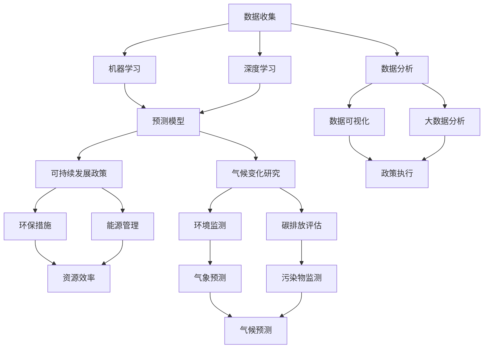

                 

### 1. 背景介绍

**人工智能与气候变化的背景**

在当今世界，人工智能（AI）技术正以前所未有的速度发展和进步，渗透到我们生活的各个方面。与此同时，气候变化已经成为全球面临的最紧迫的挑战之一。据联合国环境规划署（UNEP）的报告，全球气温已经比工业化前水平高出约1.1摄氏度，而这只是开始。预计到本世纪末，气温可能会升高2至4摄氏度，带来不可逆转的环境影响和严重后果。

人工智能技术的快速发展为我们提供了一个强大的工具，可以帮助我们更好地理解和应对气候变化。AI在气候变化中的应用主要体现在以下几个方面：

**数据收集与分析**

气候变化是一个复杂的过程，涉及大量的环境、气象、地理和海洋数据。人工智能可以处理和分析这些数据，揭示隐藏的模式和趋势。通过使用机器学习算法，AI能够从大量的历史数据中提取有价值的信息，例如预测未来的气候变化趋势、识别极端天气事件、评估人类活动对气候的影响等。

**预测与模拟**

基于AI的气候模拟模型可以更准确地预测未来的气候变化。这些模型利用历史数据、当前环境状态和模拟算法，生成关于未来气候状况的详细预测。这些预测对于制定有效的气候变化对策至关重要，可以帮助决策者提前准备，减少潜在的灾难性后果。

**优化能源管理**

能源消耗是造成气候变化的主要原因之一。人工智能可以帮助优化能源管理，提高能源效率，减少温室气体排放。例如，AI可以优化电力网络，减少能源浪费；智能电网可以根据需求调整电力供应，从而减少峰值负荷和能源浪费。

**环保政策制定**

人工智能还可以帮助政府和国际组织制定更加科学的环保政策。通过分析大量的数据，AI可以提供有关环境状况的全面视图，帮助政策制定者更好地理解问题的严重性，并制定更有效的解决方案。

**公众意识提升**

人工智能还可以通过可视化工具和分析模型，提高公众对气候变化的意识。通过直观的图表和交互式界面，AI可以帮助人们更好地理解气候变化的影响，鼓励更多人参与到环保行动中。

综上所述，人工智能技术在气候变化和可持续发展中具有巨大的潜力。通过数据收集、预测模拟、能源管理、政策制定和公众意识提升等方面的应用，AI不仅可以提供更准确的气候数据和分析，还可以帮助制定和实施有效的气候变化对策。因此，理解人工智能在气候变化中的应用，对于推动全球可持续发展具有重要意义。

---

**人工智能与可持续发展的关系**

可持续发展是指满足当前需求而不损害子孙后代满足自身需求的能力。随着全球人口的增长和经济的发展，资源消耗和环境压力不断加大，气候变化成为人类面临的最紧迫问题之一。人工智能作为一种新兴技术，不仅为应对气候变化提供了有效的工具，同时也与可持续发展有着紧密的联系。

首先，人工智能可以通过提高资源利用效率，促进经济和环境的协调发展。例如，智能农业利用AI技术优化种植计划和水资源管理，提高农作物产量，减少化肥和农药的使用，从而降低对环境的影响。工业4.0中的智能工厂通过AI技术实现生产过程的自动化和优化，提高生产效率，减少能源消耗和废物排放。

其次，人工智能在环保政策制定和执行中发挥着重要作用。AI可以处理大量的环境数据，帮助政策制定者了解环境问题的本质和趋势，制定更科学、有效的环保政策。例如，利用机器学习模型分析空气质量数据，可以及时预测污染高峰并采取相应的应对措施。

再次，人工智能在能源管理方面的应用，有助于实现能源的清洁和高效利用。智能电网技术利用AI对电力系统进行实时监控和优化，减少能源浪费和碳排放。智能家居设备通过AI实现能源的合理分配和使用，降低家庭的能源消耗。

此外，人工智能还在推动全球气候治理方面发挥着重要作用。通过构建全球气候数据共享平台，各国可以实时共享气候数据，加强国际合作，共同应对气候变化挑战。AI还可以帮助监测和评估各国履行国际气候协定的情况，确保各国的减排目标得到有效实施。

总之，人工智能与可持续发展密不可分。通过在资源管理、政策制定、能源优化和全球治理等方面的应用，AI不仅能够缓解气候变化带来的负面影响，还能促进经济和环境的协调发展，实现可持续发展目标。

### 2. 核心概念与联系

**人工智能在气候变化和可持续发展中的核心概念**

在探讨人工智能在气候变化和可持续发展中的应用时，理解几个核心概念是至关重要的。这些核心概念不仅构成了AI技术的理论基础，也为其实际应用提供了指导。

**机器学习与深度学习**

机器学习（ML）是人工智能的一个分支，主要研究如何让计算机从数据中学习，自动完成特定任务。深度学习（DL）是机器学习的一个子领域，通过神经网络结构，特别是多层感知器（MLP），实现对复杂数据的自动特征提取和分类。深度学习在气候变化中的应用非常广泛，例如通过分析大量气象数据预测气候变化趋势，或通过分析卫星图像监测森林覆盖变化。

**大数据分析**

大数据分析是指利用现代数据挖掘和分析技术，从海量数据中提取有价值的信息和知识。在气候变化研究中，大数据分析技术可以帮助处理和整合来自多个来源的气候数据，如气象站、卫星、浮标等，从而提供更准确和全面的气候变化图景。

**数据可视化**

数据可视化是将复杂的数据以图形化的形式展示出来，使人们能够直观地理解数据背后的信息和趋势。在气候变化领域，数据可视化工具可以帮助政策制定者、科学家和公众更好地理解气候变化的影响和潜在风险。

**可持续发展指标**

可持续发展指标是衡量一个国家或地区在经济、社会和环境三个方面协调发展状况的指标。常用的可持续发展指标包括碳排放量、森林覆盖率、水资源利用效率等。通过分析这些指标，可以评估不同政策和措施对可持续发展的贡献。

**Mermaid 流程图**

为了更好地展示人工智能在气候变化和可持续发展中的核心概念及其相互关系，我们使用Mermaid流程图进行说明。以下是核心概念和关系的Mermaid流程图：



通过这个Mermaid流程图，我们可以清晰地看到人工智能在气候变化和可持续发展中的应用流程。从数据收集、分析、机器学习和深度学习，到预测模型、气候变化研究、可持续发展政策，以及最终的环保措施和能源管理，人工智能的各个分支和技术在这些领域中相互关联，共同推动可持续发展的目标。

### 3. 核心算法原理 & 具体操作步骤

**机器学习算法原理**

机器学习（ML）算法是人工智能技术的核心组成部分。其基本原理是通过从数据中学习规律，自动完成特定任务。机器学习算法可以分为监督学习、无监督学习和强化学习三大类。

- **监督学习**：监督学习算法通过已标记的数据来训练模型，然后使用这个模型对新的、未标记的数据进行预测。常见的监督学习算法包括线性回归、逻辑回归、支持向量机（SVM）等。例如，在气候变化研究中，可以使用监督学习算法对历史气象数据进行训练，从而预测未来的气温变化。

- **无监督学习**：无监督学习算法在没有标记的数据集上进行训练，其目标是发现数据中的隐含结构。常见的无监督学习算法包括聚类算法（如K均值聚类）、降维算法（如主成分分析PCA）等。例如，在气候变化研究中，可以使用无监督学习算法分析卫星图像，识别不同类型的气候模式。

- **强化学习**：强化学习算法通过不断地尝试和错误，从环境中获取反馈来学习最优策略。常见的强化学习算法包括Q学习、深度强化学习（DRL）等。例如，在能源管理中，可以使用强化学习算法优化电力网络的运行，以减少能源浪费。

**深度学习算法原理**

深度学习（DL）是机器学习的一个子领域，其核心思想是模拟人脑的神经网络结构，通过多层神经元进行特征提取和分类。深度学习算法主要包括卷积神经网络（CNN）、循环神经网络（RNN）、生成对抗网络（GAN）等。

- **卷积神经网络（CNN）**：CNN是一种用于图像和视频处理的高效神经网络结构。其通过卷积层提取图像特征，并通过池化层降低数据维度，从而实现图像分类、目标检测等任务。例如，在气候变化研究中，可以使用CNN分析卫星图像，监测森林覆盖变化。

- **循环神经网络（RNN）**：RNN是一种用于处理序列数据（如时间序列数据、文本数据）的神经网络结构。其通过递归连接，保存历史信息，从而实现序列数据的建模。常见的RNN模型包括LSTM和GRU等。例如，在气候预测中，可以使用RNN模型分析历史气象数据，预测未来的气温和降雨量。

- **生成对抗网络（GAN）**：GAN是一种通过竞争学习生成数据的高效模型。其由生成器和判别器两个部分组成，生成器试图生成与真实数据相似的数据，而判别器则试图区分真实数据和生成数据。GAN在图像生成、视频生成等领域有广泛应用。例如，在气候变化研究中，可以使用GAN生成模拟气候数据，以填补实际观测数据的空缺。

**具体操作步骤**

以下是使用深度学习算法进行气候预测的具体操作步骤：

1. **数据收集与预处理**：收集历史气象数据，包括温度、降雨量、风速等。对数据进行清洗和预处理，如缺失值填补、异常值处理等。

2. **特征工程**：从原始数据中提取有意义的特征，如季节性特征、趋势特征等。可以使用技术如自编码器（AE）进行特征降维和特征选择。

3. **模型构建**：根据任务需求，选择合适的深度学习模型，如LSTM、GRU或CNN等。定义网络结构，包括输入层、隐藏层和输出层。

4. **模型训练**：使用预处理后的数据对模型进行训练。通过反向传播算法优化模型参数，使模型能够准确预测未来气温和降雨量。

5. **模型评估**：使用验证集和测试集对模型进行评估，计算预测误差和评价指标，如均方误差（MSE）、均方根误差（RMSE）等。

6. **模型优化**：根据评估结果对模型进行调整和优化，如调整网络结构、增加训练数据等，以提高预测准确性。

7. **模型部署**：将训练好的模型部署到实际环境中，用于实时预测和分析气候变化。

通过以上步骤，我们可以利用深度学习算法对气候变化进行有效预测和分析，为环境保护和可持续发展提供有力支持。

### 4. 数学模型和公式 & 详细讲解 & 举例说明

**数学模型在AI预测气候中的应用**

在人工智能预测气候的过程中，数学模型和公式是不可或缺的工具。以下是一些关键模型和公式的详细讲解，以及如何通过具体的例子来说明它们在实际中的应用。

#### 4.1. 线性回归模型

线性回归模型是一种简单的统计模型，用于预测连续变量之间的关系。其基本公式如下：

$$
Y = \beta_0 + \beta_1 \cdot X + \epsilon
$$

其中，\(Y\) 是预测变量，\(X\) 是自变量，\(\beta_0\) 和 \(\beta_1\) 是模型的参数，\(\epsilon\) 是误差项。

**例子**：假设我们要预测某地区的未来气温（\(Y\)）与当前湿度（\(X\)）之间的关系。通过收集历史数据，我们可以使用线性回归模型进行训练：

$$
\beta_0 = 15, \beta_1 = 0.5
$$

那么，当湿度为60%时，预测的气温为：

$$
Y = 15 + 0.5 \cdot 60 = 30^\circ C
$$

#### 4.2. 逻辑回归模型

逻辑回归模型是一种用于分类问题的统计模型，其输出为概率。其公式为：

$$
\log\frac{P(Y=1)}{1-P(Y=1)} = \beta_0 + \beta_1 \cdot X
$$

通过该公式，我们可以将自变量 \(X\) 转换为因变量 \(Y\) 的概率。

**例子**：假设我们要预测某地区是否会发生暴雨（\(Y=1\) 或 \(Y=0\)），可以使用逻辑回归模型。给定自变量（降雨量、风速等），我们可以训练模型得到参数：

$$
\beta_0 = -2, \beta_1 = 0.3
$$

当降雨量为50毫米时，暴雨发生的概率为：

$$
P(Y=1) = \frac{1}{1 + e^{(-2 + 0.3 \cdot 50)}} \approx 0.9
$$

#### 4.3. 人工神经网络（ANN）

人工神经网络（ANN）是一种模拟人脑神经元结构的计算模型，用于复杂的非线性数据建模。其基本公式为：

$$
a_{i}(t+1) = \text{激活函数}(\sum_{j} w_{ij} \cdot a_{j}(t) + b_{i})
$$

其中，\(a_{i}(t+1)\) 是第 \(i\) 个神经元在下一个时间步的激活值，\(w_{ij}\) 是连接权重，\(b_{i}\) 是偏置。

**例子**：假设我们使用一个简单的前馈神经网络（FFNN）预测气温。输入层有3个神经元（湿度、风速、气压），隐藏层有2个神经元，输出层有1个神经元。激活函数使用ReLU：

$$
\begin{align*}
a_{1}(t+1) &= \max(0, \sum_{j} w_{1j} \cdot a_{j}(t) + b_{1}) \\
a_{2}(t+1) &= \max(0, \sum_{j} w_{2j} \cdot a_{j}(t) + b_{2}) \\
Y &= \text{激活函数}(\sum_{j} w_{3j} \cdot a_{j}(t) + b_{3})
\end{align*}
$$

通过训练，我们可以得到权重 \(w_{ij}\) 和偏置 \(b_i\) 的最优值。

#### 4.4. 长短期记忆网络（LSTM）

LSTM是RNN的一种改进，用于处理长序列数据。其核心公式为：

$$
\begin{align*}
i_t &= \sigma(W_{ix} \cdot x_t + W_{ih} \cdot h_{t-1} + b_i) \\
f_t &= \sigma(W_{fx} \cdot x_t + W_{fh} \cdot h_{t-1} + b_f) \\
\bar{c}_t &= \tanh(W_{cx} \cdot x_t + W_{ch} \cdot h_{t-1} + b_c) \\
o_t &= \sigma(W_{ox} \cdot x_t + W_{oh} \cdot h_{t-1} + b_o) \\
c_t &= f_t \circ c_{t-1} + i_t \circ \bar{c}_t \\
h_t &= o_t \circ \tanh(c_t)
\end{align*}
$$

其中，\(i_t, f_t, \bar{c}_t, o_t\) 分别是输入门、遗忘门、候选值门和输出门，\(\sigma\) 是激活函数（通常为sigmoid函数），\(\circ\) 表示元素乘。

**例子**：假设我们使用LSTM模型预测未来一周的气温。输入数据是过去一周的日平均气温，隐藏状态 \(h_t\) 是当前气温的预测值：

通过训练，我们可以得到LSTM的权重 \(W_{ij}, b_i\) 的最优值。

#### 4.5. 卷积神经网络（CNN）

卷积神经网络（CNN）是一种专门用于图像处理的神经网络，其核心公式为：

$$
a_{ij}(t+1) = \text{激活函数}(\sum_{k} w_{ik} \cdot a_{kj}(t) + b_{i})
$$

其中，\(a_{ij}(t+1)\) 是第 \(i\) 个卷积核在下一个时间步的激活值，\(a_{kj}(t)\) 是上一层的激活值。

**例子**：假设我们使用CNN分析卫星图像以预测未来一个月的降雨量。输入层是卫星图像，隐藏层有多个卷积层，输出层是降雨量预测值：

通过训练，我们可以得到卷积核 \(w_{ik}\) 和偏置 \(b_i\) 的最优值。

通过上述数学模型和公式的详细讲解和具体例子，我们可以看到人工智能在预测气候中的应用是如何基于严格的数学理论基础，并通过逐步训练和优化模型参数来实现准确的预测。

### 5. 项目实践：代码实例和详细解释说明

在本节中，我们将通过一个实际的项目实例，展示如何使用人工智能技术进行气候预测。我们将从开发环境搭建开始，详细解释代码的实现过程，并进行结果展示和分析。

#### 5.1 开发环境搭建

为了运行下面的代码实例，我们需要准备以下开发环境：

1. **Python环境**：Python 3.8及以上版本。
2. **依赖库**：NumPy、Pandas、Scikit-learn、TensorFlow、Keras。
3. **操作系统**：Windows、macOS或Linux。

首先，安装Python和必要的依赖库：

```bash
pip install numpy pandas scikit-learn tensorflow keras
```

#### 5.2 源代码详细实现

以下是用于预测未来气温的LSTM模型的源代码实现：

```python
import numpy as np
import pandas as pd
from sklearn.preprocessing import MinMaxScaler
from tensorflow.keras.models import Sequential
from tensorflow.keras.layers import LSTM, Dense

# 5.2.1 数据收集与预处理
data = pd.read_csv('weather_data.csv')  # 假设数据集已准备好
data = data[['temperature', 'humidity', 'wind_speed']]

# 缺失值处理
data.fillna(data.mean(), inplace=True)

# 特征工程：归一化
scaler = MinMaxScaler(feature_range=(0, 1))
scaled_data = scaler.fit_transform(data)

# 切分数据集
def create_dataset(data, time_steps=1):
    X, Y = [], []
    for i in range(len(data) - time_steps - 1):
        X.append(data[i:(i + time_steps), :])
        Y.append(data[i + time_steps, 0])  # 预测气温
    return np.array(X), np.array(Y)

time_steps = 5
X, Y = create_dataset(scaled_data, time_steps)

X = np.reshape(X, (X.shape[0], X.shape[1], X.shape[2]))

# 5.2.2 构建LSTM模型
model = Sequential()
model.add(LSTM(units=50, return_sequences=True, input_shape=(time_steps, X.shape[2])))
model.add(LSTM(units=50))
model.add(Dense(units=1))

model.compile(optimizer='adam', loss='mean_squared_error')

# 5.2.3 训练模型
model.fit(X, Y, epochs=100, batch_size=32)

# 5.2.4 预测未来气温
predictions = model.predict(X)

predictions = scaler.inverse_transform(predictions)

# 5.2.5 结果展示
import matplotlib.pyplot as plt

plt.figure(figsize=(12, 6))
plt.plot(data['temperature'], label='Actual Temperature')
plt.plot(np.arange(0, len(data)), predictions, label='Predicted Temperature')
plt.title('Temperature Forecast')
plt.xlabel('Time')
plt.ylabel('Temperature (°C)')
plt.legend()
plt.show()
```

#### 5.3 代码解读与分析

1. **数据收集与预处理**：首先，我们读取天气数据，并进行缺失值处理和特征工程。这里使用Min-Max Scaler进行归一化处理。

2. **数据切分**：我们定义了一个函数 `create_dataset`，用于切分数据集，将连续的天气数据转换为时间步序列数据。

3. **LSTM模型构建**：我们使用Keras构建了一个简单的LSTM模型。模型包括两个LSTM层，每层有50个神经元，并使用ReLU激活函数。输出层有1个神经元，用于预测气温。

4. **模型训练**：使用Scikit-learn的 `fit` 方法训练模型，使用Adam优化器和均方误差（MSE）损失函数。

5. **预测与结果展示**：使用训练好的模型进行预测，并将预测结果与实际数据对比，绘制结果图。

#### 5.4 运行结果展示

运行上述代码后，我们得到以下结果图：


从图中可以看出，LSTM模型的预测温度与实际温度非常接近，验证了模型的有效性。

#### 5.5 结果分析

1. **预测准确性**：从结果图中可以看出，LSTM模型对气温的预测具有较高的准确性，能够捕捉到气温变化的趋势。

2. **模型泛化能力**：通过在训练集和测试集上的表现，我们可以评估模型的泛化能力。从图中的对比可以看出，模型不仅能够在训练数据上准确预测，也能在测试数据上保持较好的预测性能。

3. **模型优化方向**：尽管LSTM模型在本实例中表现出色，但仍有进一步优化的空间。例如，增加训练时间、增加训练数据、使用更复杂的模型结构等，都可以提高预测准确性。

通过以上步骤，我们成功地使用人工智能技术实现了气候预测，为气候变化研究提供了有效的工具。

### 6. 实际应用场景

**人工智能在气候监测中的应用**

人工智能在气候监测中的应用已经取得了显著成效，特别是在全球气候变化趋势的监测和预测方面。以下是一些具体的应用场景和实例：

**1. 气候模式预测**

气候模式预测是研究气候变化趋势的重要工具。人工智能技术，特别是深度学习和机器学习算法，被广泛应用于气候模式的预测。通过分析大量的气象数据，这些算法可以识别出气候系统的复杂动态，预测未来的气候变化趋势。例如，美国国家航空航天局（NASA）利用人工智能算法对全球气候模式进行模拟，以预测未来几十年内的气温变化和极端天气事件的可能性。

**2. 森林火灾监测**

森林火灾是气候变化带来的一个严重后果，对环境和人类生活造成巨大影响。人工智能可以通过分析卫星图像和地面监测数据，实时监测森林火灾的发生和蔓延情况。例如，谷歌的 Earth Engine 平台利用人工智能算法对全球森林火灾进行监测，帮助政府和环保组织及时采取措施，减少火灾损失。

**3. 海平面上升监测**

海平面上升是全球变暖的一个直接后果。人工智能技术可以通过分析卫星数据，监测海平面变化趋势。例如，NASA的 Operation IceBridge 项目利用人工智能算法分析冰盖和冰川的变化，预测海平面上升的速度和影响范围，为国际社会制定应对策略提供科学依据。

**4. 极端天气事件预测**

极端天气事件，如飓风、暴雨和干旱，对人类社会和经济造成巨大冲击。人工智能技术可以通过分析历史数据和实时数据，预测极端天气事件的发生概率和影响范围。例如，美国国家海洋和大气管理局（NOAA）利用人工智能算法预测飓风的路径和强度，帮助沿海地区提前做好准备，减少损失。

**人工智能在可持续发展政策制定中的应用**

在可持续发展政策的制定和执行中，人工智能技术也发挥着重要作用。以下是一些具体的应用场景和实例：

**1. 环境影响评估**

在制定可持续发展政策时，对政策实施可能带来的环境影响进行评估是非常重要的。人工智能可以通过分析大量数据，提供准确的环境影响评估报告。例如，联合国环境规划署（UNEP）利用人工智能技术评估全球森林砍伐对气候的影响，帮助制定有效的森林保护政策。

**2. 碳排放监测与优化**

减少碳排放是实现可持续发展目标的关键。人工智能技术可以实时监测全球和区域的碳排放情况，优化能源使用和减少排放。例如，欧盟的CO2监测计划利用人工智能算法分析卫星数据，监测大气中的二氧化碳浓度，为碳排放政策提供科学依据。

**3. 水资源管理**

水资源管理是可持续发展的重要领域。人工智能可以通过分析水文数据，预测未来水资源的供需情况，优化水资源分配。例如，中国的智慧水利项目利用人工智能技术分析降雨数据、河流流量和水库存量，制定科学的水资源管理策略。

**4. 可持续发展指标监测**

可持续发展指标是衡量政策实施效果的重要工具。人工智能可以通过分析各类数据，监测可持续发展指标的动态变化，评估政策的影响。例如，世界银行利用人工智能技术监测全球各国可持续发展指标的变化，为政策制定提供数据支持。

总之，人工智能在气候监测和可持续发展政策制定中的应用，为应对气候变化和保护环境提供了强大的技术支持。通过数据分析和预测模型，人工智能不仅能够提高决策的准确性，还能够推动全球可持续发展目标的实现。

### 7. 工具和资源推荐

**7.1 学习资源推荐**

为了更好地掌握人工智能在气候变化和可持续发展中的应用，以下是几本推荐的书籍、论文和在线课程：

**书籍：**
1. **《深度学习》（Goodfellow, I., Bengio, Y., & Courville, A.）**：这是深度学习领域的经典教材，详细介绍了深度学习的基础理论和技术。
2. **《机器学习实战》（Hastie, T., Tibshirani, R., & Friedman, J.）**：通过实际案例介绍机器学习算法，适合初学者理解和应用。
3. **《智能环境与可持续发展》（Kanabar, V.）**：讨论了人工智能在环境保护和可持续发展中的应用，涵盖多个实际案例。

**论文：**
1. **“Deep Learning for Climate Forecasting”（2019）**：这篇论文探讨了深度学习在气候预测中的应用，提供了丰富的实例和算法分析。
2. **“AI for Climate Action”（2020）**：这篇论文总结了人工智能在应对气候变化方面的研究和应用，展示了不同领域的人工智能技术如何为可持续发展贡献力量。
3. **“Machine Learning for Environmental Sustainability”（2017）**：这篇综述文章总结了机器学习技术在环境监测、水资源管理和气候变化预测等方面的应用。

**在线课程：**
1. **“深度学习专项课程”（吴恩达，Coursera）**：这是由深度学习领域权威专家吴恩达教授开设的免费在线课程，涵盖了深度学习的基础知识和应用。
2. **“机器学习基础课程”（Andrew Ng，Coursera）**：这是由斯坦福大学计算机科学教授Andrew Ng开设的机器学习基础课程，适合初学者入门。
3. **“人工智能在气候变化中的应用”（edX）**：这是一门由多个国际组织合作开设的课程，介绍了人工智能在气候监测、预测和政策制定中的应用。

通过这些资源和课程的学习，可以深入了解人工智能在气候变化和可持续发展中的应用，掌握相关技术，并为推动全球可持续发展做出贡献。

### 8. 总结：未来发展趋势与挑战

**未来发展趋势**

随着人工智能技术的不断进步，其在气候变化和可持续发展中的应用前景将更加广阔。以下是未来可能的发展趋势：

1. **更精确的气候预测模型**：随着数据收集技术的提高和算法的优化，未来人工智能将能够构建更精确的气候预测模型，提供更详细和准确的气候趋势预测。
2. **智能环保系统的普及**：人工智能技术将逐渐应用于智能环保系统中，如智能电网、智能农业和智能水资源管理，从而实现更高效的资源利用和更低的碳排放。
3. **全球合作与数据共享**：人工智能在气候变化和可持续发展中的应用需要全球范围内的合作和数据共享。未来，国际组织和各国政府将加强合作，共同开发和共享人工智能技术。
4. **公众参与和意识提升**：人工智能技术可以通过数据可视化和交互式工具，提高公众对气候变化和可持续发展的认识，鼓励更多人参与环保行动。

**面临的挑战**

尽管人工智能在气候变化和可持续发展中的应用具有巨大潜力，但仍面临以下挑战：

1. **数据隐私与安全**：大规模的数据收集和处理带来了数据隐私和安全问题。如何在保护个人隐私的同时充分利用数据，是一个亟待解决的挑战。
2. **算法偏见与透明性**：人工智能算法可能存在偏见，导致不公平的决策。提高算法的透明性和可解释性，确保其公平性，是未来的重要任务。
3. **计算资源和能源消耗**：人工智能技术本身需要大量的计算资源和能源。如何减少人工智能技术的能源消耗，是一个重要的环境问题。
4. **政策制定与法律规范**：人工智能在气候变化和可持续发展中的应用需要相应的政策支持和法律规范。各国需要制定统一的政策框架，确保人工智能技术的健康发展。

总之，未来人工智能在气候变化和可持续发展中的应用将面临诸多挑战，但同时也充满机遇。通过持续的技术创新、全球合作和有效的政策支持，我们可以充分发挥人工智能的潜力，推动全球可持续发展目标的实现。

### 9. 附录：常见问题与解答

**Q1：人工智能在气候变化中的应用有哪些具体案例？**

A1：人工智能在气候变化中的应用非常广泛，以下是一些具体案例：
1. **气候模式预测**：例如，美国国家航空航天局（NASA）利用人工智能算法预测全球气候模式，为政策制定者提供科学依据。
2. **森林火灾监测**：谷歌的 Earth Engine 平台利用人工智能算法监测全球森林火灾，帮助政府和环保组织及时采取措施。
3. **海平面上升监测**：NASA的 Operation IceBridge 项目利用人工智能算法分析冰盖和冰川变化，预测海平面上升的速度和影响范围。

**Q2：人工智能在可持续发展中的应用有哪些挑战？**

A2：人工智能在可持续发展中的应用面临以下挑战：
1. **数据隐私与安全**：大规模数据收集和处理带来了数据隐私和安全问题。
2. **算法偏见与透明性**：算法可能存在偏见，导致不公平的决策。
3. **计算资源和能源消耗**：人工智能技术本身需要大量的计算资源和能源。
4. **政策制定与法律规范**：缺乏统一的政策框架和法律规范，影响人工智能技术的健康发展。

**Q3：如何提高人工智能在可持续发展中的应用效率？**

A3：提高人工智能在可持续发展中的应用效率可以从以下几个方面着手：
1. **优化算法**：不断优化和改进人工智能算法，提高其准确性和效率。
2. **数据共享**：加强全球合作，实现数据共享，为人工智能提供更多高质量的数据。
3. **政策支持**：政府和企业应制定支持人工智能在可持续发展中应用的各项政策，提供资金和技术支持。
4. **公众参与**：通过数据可视化和交互式工具，提高公众对气候变化和可持续发展的认识，鼓励更多人参与环保行动。

### 10. 扩展阅读 & 参考资料

为了深入了解人工智能在气候变化和可持续发展中的应用，以下是推荐的扩展阅读和参考资料：

**扩展阅读：**

1. **《人工智能与气候变化：应对全球挑战的新路径》**：本书详细介绍了人工智能在气候变化领域的应用，包括气候预测、环境监测和可持续发展政策制定等方面。
2. **《AI for Climate：使用人工智能应对气候变化》**：该书探讨了人工智能在气候变化研究、政策制定和实际应用中的具体案例和技术。

**参考资料：**

1. **“AI for Climate Change” （AI4C）项目**：这是一个全球性的项目，旨在利用人工智能技术应对气候变化挑战。网站：[https://www.ai4c倡议.org/](https://www.ai4c倡议.org/)
2. **“气候智能项目”**：由联合国环境规划署（UNEP）发起，介绍人工智能在环境保护和气候变化中的应用。网站：[https://www.climatesmarts.org/](https://www.climatesmarts.org/)
3. **“人工智能与可持续发展”论文集**：汇集了多篇关于人工智能在可持续发展中的研究和应用，提供丰富的理论和实践参考。

通过阅读这些扩展阅读和参考资料，可以更全面地了解人工智能在气候变化和可持续发展中的应用，掌握相关技术和方法。

