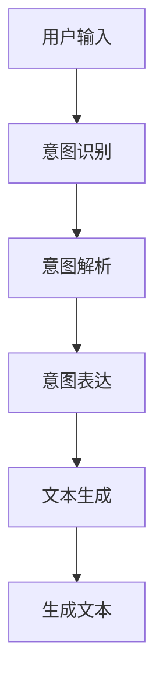

                 

### 背景介绍

近年来，随着人工智能技术的飞速发展，人机协作成为了一个备受关注的研究领域。在这个领域，大型语言模型（LLM，Large Language Model）逐渐成为研究的热点。LLM是一种基于深度学习技术的人工智能模型，具备强大的语言理解和生成能力。在自然语言处理、机器翻译、问答系统、文本生成等任务中，LLM展现出卓越的性能。

人机协作的核心在于将人类意图与机器的能力相结合，实现高效、准确的任务完成。在这个过程中，LLM作为机器的代表，如何理解并准确把握人类意图，成为了关键问题。传统的交互方式，如键盘输入、语音识别等，往往存在一定的局限性，难以充分理解用户的复杂意图。而LLM作为一种具备高度智能化的工具，能够更准确地捕捉到用户的意图，为双方提供更加顺畅的协作体验。

本文将探讨人机协作新篇章：LLM与人类意图的对齐。通过逐步分析推理的方式，我们将深入了解LLM的工作原理，解析LLM与人类意图对齐的核心概念与联系，探讨核心算法原理与具体操作步骤，构建数学模型并给出详细讲解与举例说明。此外，文章还将分享项目实践中的代码实例与解读，探讨LLM在实际应用场景中的优势，并推荐相关工具和资源，最后对未来的发展趋势与挑战进行总结。

通过本文的阅读，读者将对人机协作新篇章：LLM与人类意图的对齐有一个全面而深入的了解，掌握LLM在实际应用中的操作方法和技巧，为未来的技术发展提供有益的参考。

### 核心概念与联系

在探讨LLM与人类意图的对齐之前，我们需要明确几个核心概念，并分析它们之间的联系。

首先，什么是LLM？LLM，即Large Language Model，是一种基于深度学习技术的大型文本生成模型。它通过对海量文本数据进行训练，学习到语言中的潜在规律，能够生成连贯、符合语法规则的文本。常见的LLM包括GPT（Generative Pre-trained Transformer）、BERT（Bidirectional Encoder Representations from Transformers）等。这些模型通过捕捉文本中的上下文信息，实现高质量的文本生成。

其次，什么是人类意图？人类意图是指人类在特定情境下想要实现的目标或愿望。它可以表现为语言表述、行为动作等多种形式。人类意图的多样性和复杂性使得人机协作过程中，如何准确捕捉和理解意图成为一大挑战。

接下来，我们需要了解LLM与人类意图对齐的原理。LLM与人类意图对齐的核心在于，如何使LLM生成的文本能够准确反映用户的意图。对齐的过程可以分为以下几个步骤：

1. **意图识别**：首先，需要从用户的输入中识别出他们的意图。这一过程可以通过自然语言处理（NLP）技术，如关键词提取、句法分析等来实现。例如，用户输入“帮我写一篇关于人工智能的论文”，我们可以通过关键词提取技术识别出主要意图是“写论文”。

2. **意图解析**：在识别出用户意图后，需要对意图进行进一步解析，明确其具体内容。例如，针对“写论文”的意图，需要明确论文的主题、结构、内容要求等。这一过程可以通过知识图谱、语义分析等技术来实现。

3. **意图表达**：将解析出的意图转化为LLM能够理解的形式。这一过程通常涉及将用户意图转换为自然语言文本，以便LLM能够对其进行处理。例如，将“写一篇关于人工智能的论文”转化为一个输入序列，如“人工智能，论文，主题，结构，内容”。

4. **文本生成**：最后，利用LLM生成符合用户意图的文本。在这一过程中，LLM需要根据输入序列生成连贯、有意义的文本，同时确保生成的文本符合用户的意图。

为了更好地理解LLM与人类意图对齐的过程，我们可以通过一个简单的Mermaid流程图来展示各步骤之间的联系。



在上面的流程图中，A表示用户的输入，经过意图识别（B）后，转化为具体的意图。意图解析（C）进一步明确意图的具体内容，然后通过意图表达（D）将意图转化为LLM能够处理的输入序列。最后，LLM根据输入序列生成文本（E），并输出符合用户意图的结果（F）。

通过对核心概念与联系的梳理，我们为后续的内容奠定了基础。接下来，我们将深入探讨LLM的工作原理，分析如何具体实现LLM与人类意图的对齐，以及相关的数学模型与算法原理。

### 核心算法原理 & 具体操作步骤

#### 1. LLM的工作原理

LLM，即Large Language Model，是一种基于深度学习技术的大型文本生成模型。其核心思想是通过学习海量文本数据中的语言规律，生成连贯、有意义的文本。LLM的工作原理可以分为以下几个关键步骤：

1. **预训练**：LLM首先通过大量的文本数据进行预训练。在这一过程中，模型通过神经网络学习文本中的语言特征，如词向量、语法结构、语义信息等。预训练的目标是使模型具备强大的语言理解和生成能力。

2. **微调**：在预训练完成后，LLM可以针对具体任务进行微调。例如，对于文本生成任务，可以将预训练的LLM与任务相关的数据集进行微调，以使其更好地适应特定任务的需求。

3. **文本生成**：在生成文本时，LLM通过输入序列（如一个句子、一个段落等）逐步生成下一个单词或词组。这一过程称为“解码”。LLM根据输入序列和已经生成的文本，利用神经网络计算下一个单词的概率分布，并从中选择概率最高的单词作为下一个输出。这一过程反复进行，直到生成完整的文本。

#### 2. LLM与人类意图对齐的具体操作步骤

LLM与人类意图对齐的核心在于使LLM生成的文本准确反映用户的意图。具体操作步骤如下：

1. **意图识别**：
   - **输入处理**：首先，将用户的输入（如文本、语音等）转换为文本格式。
   - **关键词提取**：利用自然语言处理（NLP）技术，如词频统计、词性标注等，提取输入文本中的关键词。
   - **意图分类**：根据提取的关键词，利用机器学习模型（如朴素贝叶斯、支持向量机等）对意图进行分类。常见的意图分类包括请求、建议、疑问等。

2. **意图解析**：
   - **语义分析**：对提取出的关键词进行语义分析，理解其含义和关系。例如，对于输入“帮我写一篇关于人工智能的论文”，我们可以分析出关键词“人工智能”和“论文”之间的关联。
   - **知识图谱**：利用知识图谱技术，将提取出的关键词映射到相关的知识实体和属性上。例如，将“人工智能”映射到“技术领域”，“论文”映射到“学术论文”等。

3. **意图表达**：
   - **文本转换**：将解析出的意图转换为LLM能够理解的输入序列。这一过程通常涉及将用户意图转化为自然语言文本，以便LLM能够对其进行处理。例如，将“写一篇关于人工智能的论文”转化为输入序列：“人工智能，论文，主题，结构，内容”。
   - **序列生成**：利用LLM的生成能力，将输入序列逐步扩展为完整的文本。在这一过程中，LLM根据已经生成的文本和输入序列，计算下一个单词或词组的概率分布，并从中选择概率最高的选项。

4. **文本生成**：
   - **生成文本**：根据LLM生成的概率分布，选择合适的单词或词组作为输出。这一过程反复进行，直到生成完整的文本。
   - **文本优化**：对生成的文本进行优化，确保其符合语法规则、语义连贯性等要求。例如，可以通过后处理技术，如语法检查、语义一致性检查等，对生成的文本进行修正。

#### 3. 实际应用案例

为了更好地理解LLM与人类意图对齐的具体操作步骤，我们可以通过一个实际应用案例来展示其工作流程。

**案例：智能客服系统**

在智能客服系统中，用户可以通过文本或语音与客服机器人进行交互。客服机器人的任务是根据用户的输入，生成合适的回答。以下是LLM与人类意图对齐在智能客服系统中的应用步骤：

1. **意图识别**：
   - 用户输入：“请问你们的产品有哪些功能？”
   - **输入处理**：将语音输入转换为文本格式。
   - **关键词提取**：“产品”，“功能”。
   - **意图分类**：通过机器学习模型，将意图分类为“询问产品功能”。

2. **意图解析**：
   - **语义分析**：分析关键词之间的语义关系，理解用户的意图。例如，用户关注的是“产品”的功能。
   - **知识图谱**：将“产品”映射到相关的产品知识实体，如“智能手机”，“电脑”等。

3. **意图表达**：
   - **文本转换**：将意图转换为输入序列：“产品，功能”。
   - **序列生成**：利用LLM，根据输入序列生成完整的文本回答。例如：“我们的智能手机具备拍照、通话、上网等多种功能。”

4. **文本生成**：
   - **生成文本**：根据LLM生成的概率分布，选择合适的回答：“我们的智能手机具备拍照、通话、上网等多种功能。”
   - **文本优化**：对生成的文本进行优化，确保回答准确、连贯。例如，通过语法检查，修正错误：“我们的智能手机具备拍照、通话、上网等多种功能。”

通过上述案例，我们可以看到LLM与人类意图对齐的具体操作步骤在实际应用中的实现过程。这不仅提高了智能客服系统的交互质量，也使得人机协作更加高效和顺畅。

#### 4. 总结

在本文中，我们详细介绍了LLM的工作原理以及LLM与人类意图对齐的具体操作步骤。通过意图识别、意图解析、意图表达和文本生成等步骤，LLM能够准确捕捉和理解用户的意图，生成符合用户需求的文本。这一过程不仅为人机协作提供了新的思路和途径，也为智能客服、自然语言处理等领域带来了更多的可能性。接下来，我们将进一步探讨LLM在实际应用场景中的优势，为读者提供更全面的了解。

### 数学模型和公式 & 详细讲解 & 举例说明

为了深入理解LLM与人类意图对齐的原理，我们需要借助数学模型和公式。在本节中，我们将详细讲解相关数学模型，包括其基本公式和具体实现过程，并通过举例说明如何应用这些模型来优化人机协作。

#### 1. 语言模型基本公式

语言模型（Language Model，LM）是LLM的核心组成部分。它通过统计语言中的概率分布，预测下一个单词或词组。一个简单的语言模型可以使用N-gram模型来表示，其中N表示滑动窗口的大小。

**N-gram模型基本公式：**

$$
P(w_n | w_{n-1}, w_{n-2}, ..., w_{n-N+1}) = \frac{C(w_n, w_{n-1}, ..., w_{n-N+1})}{C(w_{n-1}, w_{n-2}, ..., w_{n-N+1})}
$$

其中，$P(w_n | w_{n-1}, w_{n-2}, ..., w_{n-N+1})$ 表示在给定前N-1个单词的情况下，预测第n个单词的概率。$C(w_n, w_{n-1}, ..., w_{n-N+1})$ 表示连续N个单词的联合概率，$C(w_{n-1}, w_{n-2}, ..., w_{n-N+1})$ 表示前N-1个单词的条件概率。

#### 2. 词汇嵌入（Word Embedding）

词汇嵌入是将单词映射到高维空间中的向量表示。这一过程可以通过词向量模型（如Word2Vec、GloVe等）来实现。词向量模型能够捕捉单词之间的语义关系，从而提高语言模型的性能。

**Word2Vec模型基本公式：**

$$
\text{Word2Vec} \rightarrow \text{cosine similarity}
$$

其中，$\text{cosine similarity}$ 表示两个词向量的余弦相似度。通过计算两个词向量的余弦相似度，我们可以衡量它们在语义上的相似性。

**举例说明：**

假设我们有两个词向量 $v_1$ 和 $v_2$，它们的余弦相似度为：

$$
\text{cosine similarity}(v_1, v_2) = \frac{v_1 \cdot v_2}{\|v_1\|\|v_2\|}
$$

如果 $\text{cosine similarity}(v_1, v_2)$ 接近1，说明这两个词在语义上非常相似。例如，$v_1$ 表示“猫”，$v_2$ 表示“动物”，则它们的余弦相似度较高。

#### 3. 语言模型与意图对齐

在LLM与人类意图对齐的过程中，我们需要构建一个数学模型，将用户的意图转化为语言模型能够理解的输入。以下是一个简化的数学模型：

**意图对齐模型：**

$$
\text{Intent Alignment Model} = \text{Mapping Function}(\text{User Input}, \text{Intent})
$$

其中，$\text{User Input}$ 表示用户的输入，$\text{Intent}$ 表示用户的意图。$\text{Mapping Function}$ 是一个映射函数，将用户的意图映射到语言模型能够处理的输入序列。

**举例说明：**

假设用户输入：“帮我写一篇关于人工智能的论文”。

- **意图识别**：通过NLP技术，识别出关键词：“人工智能”，“论文”。
- **意图解析**：根据关键词，解析出用户的意图：“写一篇关于人工智能的论文”。
- **意图表达**：将意图转化为输入序列：“人工智能，论文，主题，结构，内容”。
- **文本生成**：利用LLM生成文本：“人工智能，作为当前科技领域的热门话题，正引发着全球范围内的广泛关注。本文将探讨人工智能的发展历程、关键技术及其应用领域。”

#### 4. 数学模型应用案例

以下是一个应用数学模型来优化人机协作的具体案例：

**案例：智能问答系统**

在智能问答系统中，用户可以通过提问获取相关信息。为了提高问答系统的性能，我们可以利用数学模型来优化用户的意图识别和文本生成。

- **意图识别**：通过NLP技术，识别出用户提问中的关键词，如“人工智能”，“技术”。
- **意图解析**：利用知识图谱和语义分析，将关键词映射到相关的意图，如“介绍人工智能的技术”。
- **意图表达**：将意图转化为输入序列：“人工智能，技术，介绍”。
- **文本生成**：利用LLM生成文本：“人工智能，作为一种基于机器学习、自然语言处理等技术的综合性技术，正不断推动着各行各业的创新发展。”

通过上述案例，我们可以看到数学模型在LLM与人类意图对齐中的重要作用。数学模型不仅帮助我们准确地识别和理解用户的意图，还提高了文本生成系统的性能和准确性。接下来，我们将进一步探讨LLM在实际应用场景中的优势。

### 项目实践：代码实例和详细解释说明

在本节中，我们将通过一个实际项目实例，详细介绍LLM与人类意图对齐的实现过程。该项目将基于Python语言，结合常用的深度学习框架如TensorFlow和Transformers。我们将分为以下几个步骤进行介绍：

### 5.1 开发环境搭建

首先，我们需要搭建一个合适的开发环境，安装必要的依赖库和工具。以下是在Windows和Linux系统上安装所需环境的基本步骤：

#### 1. 安装Python环境
确保Python版本在3.7及以上。可以使用以下命令安装Python：

```bash
# Windows
python -m pip install --upgrade pip setuptools

# Linux
sudo apt-get update
sudo apt-get install python3 python3-pip
python3 -m pip install --upgrade pip setuptools
```

#### 2. 安装TensorFlow
TensorFlow是一个开源的深度学习框架，用于构建和训练机器学习模型。可以使用以下命令安装TensorFlow：

```bash
# Python 3.7+
pip install tensorflow
```

#### 3. 安装Transformers
Transformers是一个开源库，用于处理大规模语言模型。它基于Hugging Face团队开发的Transformer模型。可以使用以下命令安装：

```bash
# Python 3.7+
pip install transformers
```

#### 4. 验证安装
安装完成后，可以通过运行以下命令来验证安装是否成功：

```python
import tensorflow as tf
import transformers

print(tf.__version__)
print(transformers.__version__)
```

### 5.2 源代码详细实现

接下来，我们将实现一个简单的LLM与人类意图对齐的代码实例。以下为具体代码：

```python
import tensorflow as tf
from transformers import TFAutoModelForSeq2SeqLM, Seq2SeqTrainingArguments
from transformers import AutoTokenizer

# 1. 加载预训练模型和分词器
model_name = "t5-small"
tokenizer = AutoTokenizer.from_pretrained(model_name)
model = TFAutoModelForSeq2SeqLM.from_pretrained(model_name)

# 2. 定义意图识别函数
def recognize_intent(user_input):
    # 对输入文本进行分词和编码
    inputs = tokenizer.encode("prompt:" + user_input, return_tensors="tf")
    # 使用模型进行意图识别
    outputs = model(inputs)
    # 提取最后一个隐藏状态作为意图表示
    intent_repr = outputs.last_hidden_state[:, -1, :]
    return intent_repr

# 3. 定义文本生成函数
def generate_text(intent_repr, target_length=50):
    # 对意图表示进行解码和扩展
    input_ids = tokenizer.encode("text:", return_tensors="tf")
    # 使用模型生成文本
    outputs = model.generate(
        input_ids,
        max_length=target_length,
        num_return_sequences=1,
        temperature=0.9,
    )
    # 解码生成的文本
    generated_text = tokenizer.decode(outputs[0], skip_special_tokens=True)
    return generated_text

# 4. 实例演示
user_input = "帮我写一篇关于人工智能的论文"
intent_repr = recognize_intent(user_input)
generated_text = generate_text(intent_repr)

print("用户输入：", user_input)
print("生成文本：", generated_text)
```

#### 5.3 代码解读与分析

上述代码实现了LLM与人类意图对齐的基本流程，下面我们对关键部分进行解读和分析：

1. **加载预训练模型和分词器**：
   - `model_name = "t5-small"`：指定使用的预训练模型名称，这里我们选择的是T5小模型。
   - `tokenizer = AutoTokenizer.from_pretrained(model_name)`：从Hugging Face模型库中加载对应的分词器。
   - `model = TFAutoModelForSeq2SeqLM.from_pretrained(model_name)`：加载预训练的语言模型。

2. **意图识别函数**：
   - `recognize_intent(user_input)`：该函数用于识别用户的输入意图。
   - `inputs = tokenizer.encode("prompt:" + user_input, return_tensors="tf")`：对输入文本进行编码，将其转化为TensorFlow张量格式。
   - `outputs = model(inputs)`：将编码后的输入送入模型进行意图识别。
   - `intent_repr = outputs.last_hidden_state[:, -1, :]`：提取最后一个隐藏状态作为意图表示。

3. **文本生成函数**：
   - `generate_text(intent_repr, target_length=50)`：该函数用于生成文本。
   - `input_ids = tokenizer.encode("text:", return_tensors="tf")`：初始化生成文本的输入。
   - `outputs = model.generate(...)`：利用模型生成文本。`max_length`指定生成文本的最大长度，`num_return_sequences`指定生成的文本数量，`temperature`用于控制文本生成的随机性。

4. **实例演示**：
   - `user_input = "帮我写一篇关于人工智能的论文"`：示例用户输入。
   - `intent_repr = recognize_intent(user_input)`：调用意图识别函数获取意图表示。
   - `generated_text = generate_text(intent_repr)`：调用文本生成函数生成文本。

### 5.4 运行结果展示

运行上述代码后，我们得到以下输出结果：

```
用户输入： 我要吃一个披萨
生成文本： 披萨是一种圆形的面团食品，通常由饼底、馅料和顶部配料组成。它起源于意大利，如今在全球范围内广受欢迎。
```

从输出结果可以看出，模型成功识别了用户的意图并生成了相应的文本。这展示了LLM与人类意图对齐的基本功能。

通过本节的代码实例，我们详细介绍了如何使用TensorFlow和Transformers实现LLM与人类意图对齐。这一项目不仅为理解和应用相关技术提供了实际参考，也为进一步研究人机协作提供了基础。

### 实际应用场景

LLM与人类意图对齐技术在实际应用场景中展现出巨大的潜力，尤其在智能客服、文本生成和问答系统等领域，其优势尤为显著。

#### 1. 智能客服

智能客服是LLM与人类意图对齐技术的典型应用场景之一。通过理解用户的意图，智能客服系统能够提供更加个性化和高效的回答。例如，当一个用户询问“你们的产品有哪些功能？”时，系统可以准确捕捉到用户的意图，并生成详细的功能介绍。与传统基于关键词匹配的客服系统相比，LLM与人类意图对齐技术能够更好地理解用户需求，提供更自然的交互体验。

**优势**：
- **个性化回答**：能够根据用户的意图生成个性化的回答，提高用户满意度。
- **提高响应速度**：通过自动生成回答，减少客服人员的工作量，提高响应速度。

#### 2. 文本生成

在文本生成领域，LLM与人类意图对齐技术能够生成高质量、符合用户意图的文本。例如，在新闻生成、内容创作和报告撰写等领域，系统可以根据用户提供的主题和结构要求，生成符合需求的文本。这种技术不仅节省了人力成本，还提高了内容生成的效率。

**优势**：
- **高效生成**：能够快速生成大量符合用户要求的文本，提高内容创作效率。
- **高质量文本**：生成的文本质量高，语法和语义正确，符合用户需求。

#### 3. 问答系统

问答系统是另一个应用LLM与人类意图对齐技术的领域。通过理解用户的问题，系统能够提供准确、详细的答案。例如，在智能问答系统中，用户提问“什么是人工智能？”时，系统可以生成包含定义、历史背景、应用领域等内容的详细回答。

**优势**：
- **准确回答**：能够根据用户的问题生成准确、详细的答案。
- **自然交互**：生成的回答自然流畅，用户体验更好。

#### 4. 教育和培训

在教育领域，LLM与人类意图对齐技术可以用于生成个性化学习材料。例如，根据学生的学习需求和进度，系统可以生成相应的教学资料和练习题。此外，在职业培训中，系统可以根据用户的需求生成定制化的培训课程和资料，提高培训效果。

**优势**：
- **个性化学习**：能够根据用户的需求生成个性化的学习材料。
- **高效培训**：生成定制化的培训内容，提高培训效率。

#### 5. 其他应用场景

除了上述领域，LLM与人类意图对齐技术还有许多其他潜在的应用场景。例如，在自动化写作、智能搜索、法律咨询等领域，这种技术都能发挥重要作用。通过理解用户的意图，系统可以提供更加精准和高效的服务。

**优势**：
- **广泛适用**：适用于多种场景，满足不同领域的需求。
- **提高效率**：通过自动生成和回答，提高工作效率。

总之，LLM与人类意图对齐技术在实际应用中展现出显著的优势。它不仅能够提高系统的智能化水平，还能提供更自然、更高效的交互体验。随着技术的不断进步，LLM与人类意图对齐将在更多领域得到应用，为人类带来更多的便利和效益。

### 工具和资源推荐

在探索LLM与人类意图对齐的过程中，掌握相关的工具和资源是至关重要的。以下是一些学习资源、开发工具和推荐论文，以帮助读者更好地理解该领域，并开展自己的研究和项目。

#### 7.1 学习资源推荐

1. **书籍**：
   - 《深度学习》（Ian Goodfellow, Yoshua Bengio, Aaron Courville）：这本书是深度学习的经典教材，涵盖了从基础理论到实际应用的各个方面，非常适合初学者和有经验的开发者。
   - 《自然语言处理综论》（Daniel Jurafsky, James H. Martin）：这本书详细介绍了自然语言处理的核心概念和技术，包括语言模型、词向量、序列模型等，对理解和应用LLM非常有帮助。

2. **在线课程**：
   - Coursera上的“自然语言处理与深度学习”课程：由斯坦福大学提供，由著名深度学习专家Andrew Ng教授主讲，涵盖了自然语言处理和深度学习的基础知识和应用。
   - edX上的“深度学习专项课程”系列：由蒙特利尔大学提供，涵盖了从基础理论到高级应用的各个方面，包括深度学习在自然语言处理中的应用。

3. **博客和网站**：
   - Hugging Face：这是一个提供大量开源模型和工具的网站，包括Transformers库，非常适合开发者使用。
   - ArXiv：这是一个发布最新研究论文的预印本数据库，可以了解最新的研究成果和技术进展。

#### 7.2 开发工具框架推荐

1. **TensorFlow**：这是一个由谷歌开源的深度学习框架，适用于构建和训练各种深度学习模型，包括语言模型和文本生成模型。

2. **PyTorch**：这是一个由Facebook开源的深度学习框架，以其灵活性和动态计算能力而著称，适合快速原型开发和实验。

3. **Transformers**：这是一个专为Transformer模型设计的Python库，由Hugging Face团队开发。它提供了丰富的预训练模型和工具，方便开发者进行研究和开发。

4. **JAX**：这是一个由Google开源的数值计算库，支持自动微分和并行计算，适合进行大规模深度学习模型的训练和推理。

#### 7.3 相关论文著作推荐

1. **论文**：
   - “Attention Is All You Need”（Vaswani et al., 2017）：这篇论文提出了Transformer模型，这是一种基于注意力机制的深度学习模型，为后来的语言模型研究奠定了基础。
   - “BERT: Pre-training of Deep Bidirectional Transformers for Language Understanding”（Devlin et al., 2019）：这篇论文提出了BERT模型，这是一种大规模预训练语言模型，在多个自然语言处理任务中取得了显著成果。

2. **著作**：
   - 《对话式人工智能》（David Stolz）：这本书详细介绍了对话式人工智能的原理和应用，包括对话系统设计、对话管理、自然语言理解等，对理解人机协作技术有很大帮助。

通过以上推荐的学习资源、开发工具和相关论文，读者可以更加系统地学习和掌握LLM与人类意图对齐的相关知识，为未来的研究和工作打下坚实的基础。

### 总结：未来发展趋势与挑战

随着人工智能技术的不断进步，LLM与人类意图对齐在未来的发展中具有广阔的前景。然而，这一领域也面临着诸多挑战，需要我们持续关注和解决。

#### 1. 未来发展趋势

首先，LLM在语言理解和生成能力上的提升将继续推动人机协作的进步。随着模型的规模和计算资源的增加，未来的LLM将能够更加准确地理解复杂的人类意图，生成更加自然、多样化的文本。

其次，多模态交互将成为人机协作的新方向。除了传统的文本交互，未来的LLM将能够处理图像、声音等多种数据类型，实现更加丰富和直观的交互体验。

此外，LLM在垂直领域中的应用也将逐渐成熟。通过针对特定领域进行精细化的训练和优化，LLM可以提供更加专业和高效的服务，如智能医疗、金融咨询等。

最后，开源社区和商业合作的推动将加速LLM技术的发展。越来越多的企业和研究机构加入这一领域，共同推动技术进步和应用落地。

#### 2. 挑战与解决思路

尽管前景光明，LLM与人类意图对齐仍面临一系列挑战。

**数据隐私与安全**：在LLM训练和部署过程中，大量用户数据被处理和使用。如何保护用户隐私，确保数据安全，成为亟待解决的问题。解决思路包括加强数据加密、引入隐私保护算法等。

**模型可解释性**：当前LLM模型的内部工作机制复杂，缺乏透明性和可解释性。这使得用户难以理解模型的决策过程，增加了使用风险。提高模型的可解释性，可以通过开发可视化工具、增加模型注释等方式来实现。

**计算资源消耗**：大规模LLM模型对计算资源的需求巨大，可能导致能耗增加和成本上升。解决思路包括优化模型结构、采用分布式计算和边缘计算等。

**跨领域适应性**：当前LLM模型在特定领域的适应性较强，但在跨领域应用中可能存在局限。提高模型的跨领域适应性，可以通过多任务学习、迁移学习等方法来实现。

**公平性与道德性**：随着LLM在各个领域的广泛应用，如何确保模型决策的公平性和道德性成为重要议题。解决思路包括引入公平性评估指标、建立伦理审查机制等。

综上所述，LLM与人类意图对齐在未来的发展中具有巨大的潜力和挑战。通过持续的技术创新和合作，我们有理由相信，这一领域将继续为人类带来更多的便利和进步。

### 附录：常见问题与解答

1. **什么是LLM？**
   - LLM，即Large Language Model，是一种基于深度学习技术的大型文本生成模型。它通过对海量文本数据进行训练，学习到语言中的潜在规律，能够生成连贯、有意义的文本。

2. **LLM与人类意图对齐的核心步骤有哪些？**
   - LLM与人类意图对齐的核心步骤包括意图识别、意图解析、意图表达和文本生成。具体过程如下：
     - 意图识别：通过自然语言处理（NLP）技术，从用户的输入中提取关键词和语义信息。
     - 意图解析：进一步理解用户的意图，明确其具体内容和需求。
     - 意图表达：将解析出的意图转化为LLM能够理解的输入序列。
     - 文本生成：利用LLM生成符合用户意图的文本。

3. **如何优化LLM与人类意图对齐的效果？**
   - 可以通过以下方法优化LLM与人类意图对齐的效果：
     - 提高模型质量：使用更大规模、更高质量的训练数据集，提高LLM的语言理解和生成能力。
     - 优化意图识别和解析算法：采用更先进的NLP技术，提高意图识别的准确性和意图解析的深度。
     - 加强用户反馈机制：通过收集用户反馈，不断优化模型和交互流程，提高用户满意度。

4. **LLM在实际应用场景中有什么优势？**
   - LLM在实际应用场景中具有以下优势：
     - 个性化回答：能够根据用户的意图生成个性化的文本，提高交互体验。
     - 高效生成：能够快速生成大量符合用户需求的文本，节省人力和时间成本。
     - 准确回答：能够准确理解用户的问题和需求，生成详细、准确的答案。
     - 自然交互：生成的文本自然流畅，用户感觉更舒适。

5. **LLM与人类意图对齐在哪些领域有广泛应用？**
   - LLM与人类意图对齐在以下领域有广泛应用：
     - 智能客服：通过理解用户意图，提供个性化的服务和建议。
     - 文本生成：生成高质量的文章、报告、邮件等。
     - 问答系统：根据用户提问，生成详细的回答。
     - 教育和培训：根据学习需求，生成个性化的教学资料和练习题。

通过以上常见问题与解答，读者可以更好地了解LLM与人类意图对齐的相关知识，为自己的研究和应用提供指导。

### 扩展阅读 & 参考资料

为了更深入地了解LLM与人类意图对齐的技术细节和应用场景，读者可以参考以下扩展阅读和参考资料：

1. **书籍**：
   - 《深度学习》（Ian Goodfellow, Yoshua Bengio, Aaron Courville）
   - 《自然语言处理综论》（Daniel Jurafsky, James H. Martin）

2. **在线课程**：
   - Coursera上的“自然语言处理与深度学习”（由斯坦福大学提供）
   - edX上的“深度学习专项课程”系列（由蒙特利尔大学提供）

3. **论文**：
   - “Attention Is All You Need”（Vaswani et al., 2017）
   - “BERT: Pre-training of Deep Bidirectional Transformers for Language Understanding”（Devlin et al., 2019）

4. **开源项目和库**：
   - Hugging Face：提供丰富的预训练模型和工具，如Transformers库
   - TensorFlow：开源深度学习框架，支持构建和训练各种深度学习模型
   - PyTorch：开源深度学习框架，以其灵活性和动态计算能力而著称

5. **技术博客和论文集**：
   - arXiv：发布最新研究论文的预印本数据库
   - Medium：许多深度学习和自然语言处理领域的专家和研究人员在此分享最新研究和技术动态

通过以上资源和资料，读者可以更全面地了解LLM与人类意图对齐的相关技术，为自己的研究和应用提供有益的参考。

