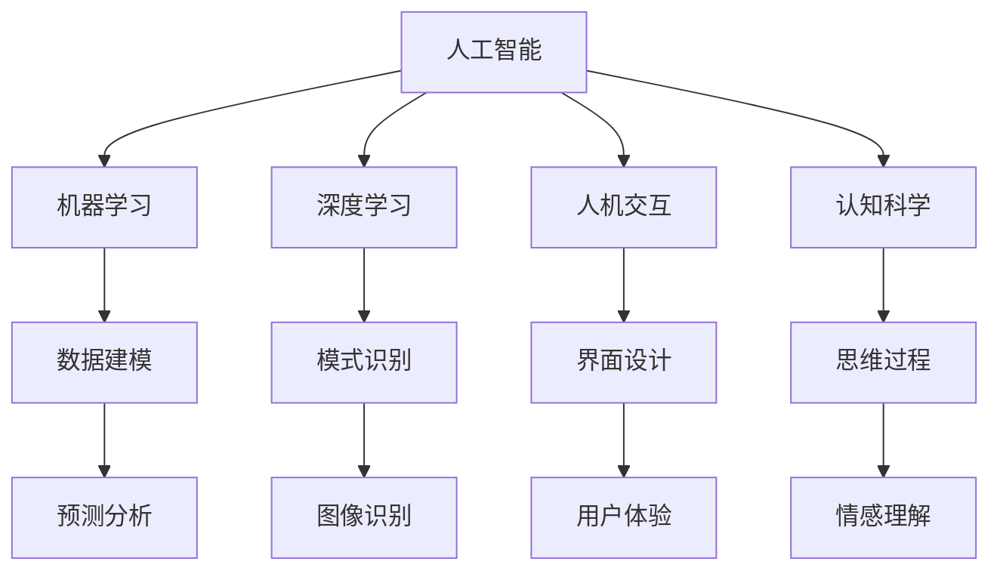

                 

### 1. 背景介绍

人类-AI协作的概念近年来逐渐成为人工智能领域的热点话题。随着人工智能技术的快速发展，AI系统在数据处理、模式识别、预测分析等方面展现出了强大的能力。然而，人工智能目前仍存在一些局限性，如理解复杂情境、解决不确定性问题等方面的能力相对较弱。为了弥补这些不足，人类与AI的协作成为一个重要的研究方向。

在历史上，人类与机器的协作可以追溯到工业革命时期。随着计算机技术的发展，人们逐渐意识到，通过结合人类的直觉、经验和创造力与机器的计算能力、准确性和高效性，可以显著提高工作效率和解决问题的能力。在现代，人工智能技术的发展为这种协作提供了新的可能性。

当前，人类-AI协作主要表现在以下几个方面：

1. **任务辅助**：AI系统能够处理大量的数据并从中提取有价值的信息，辅助人类进行决策。例如，在医疗领域，AI系统可以分析病历数据，提供诊断建议，帮助医生提高诊断准确率。

2. **自动化执行**：AI系统能够自动化执行一些重复性高、风险性低的任务，如自动化客服、自动化生产线等，从而减轻人类的负担。

3. **增强认知**：AI系统能够帮助人类处理复杂的计算和分析任务，如自然语言处理、图像识别等，从而扩展人类的认知能力。

4. **协同创新**：人类与AI系统在创意生成、设计优化等方面进行合作，能够产生新的解决方案和产品。

随着AI技术的不断进步，人类-AI协作正逐渐成为一种新的工作模式。本文将探讨人类-AI协作的核心概念、发展趋势以及在实际应用中面临的技术挑战。

### 2. 核心概念与联系

#### 2.1 人类-AI协作的概念

人类-AI协作是指人类与人工智能系统在共同完成任务过程中所形成的相互依赖关系。这种协作不仅仅是简单的任务分配，更是人类与机器之间在认知、决策、创新等层面的深度融合。具体来说，人类-AI协作具有以下几个核心特点：

1. **互补性**：人类和AI系统各自具有独特的优势。人类拥有直觉、情感、创造力和复杂情境理解能力，而AI系统则具备高效的数据处理、模式识别和预测分析能力。通过互补，双方能够实现能力的最大化。

2. **交互性**：人类与AI系统之间的协作是一个动态的交互过程。在这个过程中，人类不断向AI系统提供反馈，AI系统也不断学习、调整自己的行为，以更好地满足人类的需求。

3. **适应性**：人类-AI协作系统需要具备高度的适应性，能够根据不同的任务场景和需求进行调整。这包括AI系统的学习能力、人类操作者的灵活性和系统的可配置性。

4. **协同性**：在协作过程中，人类和AI系统需要协同工作，共同实现目标。这要求系统具备良好的协调机制，确保双方能够在任务执行中无缝衔接。

#### 2.2 相关概念之间的联系

为了更好地理解人类-AI协作，我们需要了解以下几个相关概念：

1. **人工智能**：人工智能（AI）是指由人制造出来的具有智能行为的机器。它包括机器学习、深度学习、自然语言处理、计算机视觉等多个子领域。

2. **机器学习**：机器学习是人工智能的一个重要分支，它使计算机系统能够从数据中学习规律，并基于这些规律进行预测和决策。

3. **深度学习**：深度学习是一种通过多层神经网络进行数据建模和预测的方法。它在大规模数据处理和复杂模式识别方面具有显著优势。

4. **人机交互**：人机交互（HCI）是指人类与计算机系统之间进行的交互活动。它涉及到界面设计、用户体验、交互方式等多个方面。

5. **认知科学**：认知科学是研究人类思维、感知、记忆等认知过程的学科。它为人类-AI协作提供了理论依据，帮助理解人类和机器在协作中的认知机制。

图1展示了上述概念之间的联系：



通过上述核心概念与联系的分析，我们可以更清晰地理解人类-AI协作的内涵和外在表现形式，为后续内容的展开奠定基础。

### 3. 核心算法原理 & 具体操作步骤

#### 3.1 人类-AI协作算法框架

人类-AI协作的算法框架主要包括以下几个核心模块：

1. **任务分解与分配**：首先，将复杂任务分解成多个子任务，并根据人类与AI系统的能力进行合理分配。任务分解的目的是降低任务复杂性，使得人类和AI系统能够专注于自己擅长的部分。

2. **数据预处理与融合**：对于分配给AI系统的子任务，需要进行数据预处理，包括数据清洗、归一化、特征提取等。同时，AI系统需要从人类操作者那里获取额外的上下文信息，以提升数据融合的质量。

3. **模型训练与优化**：基于预处理后的数据，使用机器学习算法训练AI模型。在模型训练过程中，人类操作者可以提供指导，帮助模型更好地理解任务目标和情境。此外，还需要对模型进行优化，提高其在特定任务上的表现。

4. **交互反馈与调整**：人类操作者与AI系统之间进行持续交互，提供反馈，帮助AI系统不断调整和改进自己的行为。通过交互，AI系统可以学习到人类的行为模式，提高协作效果。

5. **协同决策与执行**：在任务执行过程中，人类与AI系统共同进行决策，确保任务能够高效、准确地完成。协同决策需要考虑到任务的紧急程度、风险程度和资源限制等因素。

#### 3.2 具体操作步骤

下面我们将详细描述人类-AI协作的具体操作步骤：

##### 3.2.1 任务分解与分配

1. **任务分析**：对复杂任务进行需求分析，明确任务目标、输入数据、输出结果以及任务约束条件。
2. **任务划分**：根据人类和AI系统的能力，将任务分解成多个子任务。例如，将图像识别任务划分为数据收集、数据预处理、特征提取和模型训练等子任务。
3. **任务分配**：将子任务分配给人类和AI系统。对于数据预处理、特征提取等任务，可以由AI系统自动完成；对于决策分析、任务规划等任务，可以由人类操作者完成。

##### 3.2.2 数据预处理与融合

1. **数据收集**：从各种数据源收集任务所需的数据。例如，对于图像识别任务，可以从公开数据集或自有数据库中获取图像数据。
2. **数据清洗**：对收集到的数据进行分析和清洗，去除错误、重复和噪声数据，确保数据质量。
3. **数据归一化**：对数据进行归一化处理，使其在相同的尺度范围内，便于后续的模型训练和特征提取。
4. **特征提取**：从原始数据中提取有助于任务完成的特征。例如，对于图像数据，可以提取颜色、纹理、形状等特征。
5. **数据融合**：将人类操作者提供的上下文信息与AI系统处理后的数据融合，形成综合数据集，用于后续的模型训练。

##### 3.2.3 模型训练与优化

1. **选择模型**：根据任务需求，选择合适的机器学习模型。例如，对于图像识别任务，可以选择卷积神经网络（CNN）模型。
2. **模型训练**：使用预处理后的数据集对模型进行训练。在训练过程中，AI系统可以自动调整模型参数，使其在特定任务上的表现最优。
3. **模型优化**：通过交叉验证和超参数调整，对模型进行优化，提高其在任务上的性能。
4. **模型评估**：使用验证集或测试集对模型进行评估，确保其性能达到预期目标。

##### 3.2.4 交互反馈与调整

1. **交互机制设计**：设计人类操作者与AI系统之间的交互机制，确保双方能够顺畅地进行信息交换和任务协作。
2. **反馈收集**：收集人类操作者的反馈，包括对AI系统输出结果的评价、对任务执行过程的建议等。
3. **模型调整**：根据人类操作者的反馈，对AI系统进行调整，提高其在特定任务上的表现。
4. **持续学习**：AI系统通过不断的学习和优化，逐步提升自身的性能，实现与人类操作者的高效协作。

##### 3.2.5 协同决策与执行

1. **决策支持系统**：构建决策支持系统，帮助人类操作者和AI系统共同进行任务决策。
2. **任务分配与协调**：根据任务的紧急程度、风险程度和资源限制等因素，合理分配任务，确保任务能够高效、准确地完成。
3. **实时监控与调整**：对任务执行过程进行实时监控，及时发现和解决问题，确保任务顺利完成。

通过上述核心算法原理和具体操作步骤，人类与AI系统可以形成一种高效的协作模式，共同完成任务。在实际应用中，这些步骤可以根据具体任务需求进行调整和优化，以实现最佳的协作效果。

### 4. 数学模型和公式 & 详细讲解 & 举例说明

#### 4.1 数学模型在人类-AI协作中的应用

在人类-AI协作中，数学模型是核心组成部分，能够帮助理解和优化协作过程。以下是几个常用的数学模型及其应用：

##### 4.1.1 决策树模型

决策树是一种常见的分类模型，它通过一系列条件分支来对数据集进行分类。决策树模型的基本公式如下：

$$
P(Y = y|X) = \prod_{i=1}^{n} P(Y = y_i|X=x_i)
$$

其中，$P(Y = y|X)$表示给定特征集$X$下，目标变量$Y$取值为$y$的概率；$P(Y = y_i|X=x_i)$表示在特征集$X=x_i$的条件下，目标变量$Y$取值为$y_i$的概率。

**举例说明**：假设我们有一个决策树模型，用于判断一个客户是否愿意购买某项产品。输入特征包括年龄、收入、购买历史等，目标变量是购买意愿。通过计算不同特征的条件下，购买意愿的概率，我们可以为每个客户生成一个决策路径，最终判断其购买意愿。

##### 4.1.2 神经网络模型

神经网络模型，尤其是深度学习模型，是当前人工智能领域的主流算法。神经网络通过多层神经元的非线性组合，实现对复杂任务的建模。其基本公式如下：

$$
a_{i}^{(l)} = \sigma \left( \sum_{j=1}^{n} w_{j}^{(l)} a_{j}^{(l-1)} + b^{(l)} \right)
$$

其中，$a_{i}^{(l)}$表示第$l$层第$i$个神经元的激活值；$\sigma$表示激活函数；$w_{j}^{(l)}$表示第$l$层第$j$个神经元与第$l-1$层第$i$个神经元之间的权重；$b^{(l)}$表示第$l$层的偏置。

**举例说明**：假设我们使用一个多层感知器（MLP）模型进行图像分类。输入层包含784个像素值，隐藏层包含256个神经元，输出层包含10个类别。通过多次前向传播和反向传播，模型能够对图像进行分类，输出每个类别的概率。

##### 4.1.3 强化学习模型

强化学习是一种通过奖励机制来训练模型的方法，适用于需要决策的动态环境。其基本公式如下：

$$
Q(s, a) = r + \gamma \max_{a'} Q(s', a')
$$

其中，$Q(s, a)$表示状态$s$下采取动作$a$的即时奖励$r$与未来奖励的期望值$\gamma$乘以未来状态$s'$下采取最佳动作$a'$的期望值$Q(s', a')$的和。

**举例说明**：假设一个智能体在围棋游戏中学习策略。在每一步棋中，智能体选择最优动作，以最大化累积奖励。通过不断的训练，智能体的策略逐渐优化，使其在围棋游戏中表现出色。

##### 4.1.4 贝叶斯网络模型

贝叶斯网络是一种基于概率的图模型，用于表示变量之间的依赖关系。其基本公式如下：

$$
P(X) = \prod_{i=1}^{n} P(X_i | \mathbf{X}_{\text{parents}}(i))
$$

其中，$P(X)$表示所有变量集合$X$的概率分布；$P(X_i | \mathbf{X}_{\text{parents}}(i))$表示第$i$个变量在给定其父变量的条件下出现的概率。

**举例说明**：假设我们有一个医疗诊断系统，变量包括症状、疾病和诊断结果。通过构建贝叶斯网络，我们可以计算在给定症状和诊断结果的条件下，疾病发生的概率，从而辅助医生进行诊断。

通过上述数学模型和公式，人类-AI协作能够更好地理解和优化协作过程，提高任务完成的效率和准确性。在实际应用中，这些模型可以根据具体任务需求进行调整和优化，以实现最佳的协作效果。

### 5. 项目实践：代码实例和详细解释说明

为了更好地理解人类-AI协作的原理和实现方法，我们将在本节中通过一个实际项目来展示整个开发和实现过程。我们将使用Python语言和相关的机器学习库，构建一个简单的智能客服系统，实现人类与AI系统之间的协作。

#### 5.1 开发环境搭建

在开始项目之前，我们需要搭建一个合适的开发环境。以下是所需的环境和工具：

1. **Python环境**：安装Python 3.8及以上版本。
2. **库和依赖**：安装以下库：
   - NumPy
   - Pandas
   - Scikit-learn
   - Matplotlib
   - Flask（用于Web服务）
   - NLTK（自然语言处理）

安装命令如下：

```bash
pip install numpy pandas scikit-learn matplotlib flask nltk
```

#### 5.2 源代码详细实现

以下是整个项目的源代码，我们将逐步解释每部分的功能和实现方法。

```python
# 导入所需的库
import numpy as np
import pandas as pd
from sklearn.model_selection import train_test_split
from sklearn.feature_extraction.text import TfidfVectorizer
from sklearn.naive_bayes import MultinomialNB
from sklearn.pipeline import make_pipeline
from nltk.corpus import stopwords
from nltk.tokenize import word_tokenize
import nltk

# 下载NLTK语料库
nltk.download('punkt')
nltk.download('stopwords')

# 5.2.1 数据准备
# 读取对话数据
data = pd.read_csv('conversations.csv')
data.head()

# 分割数据集
X_train, X_test, y_train, y_test = train_test_split(data['query'], data['response'], test_size=0.2, random_state=42)

# 5.2.2 特征提取
# 使用TF-IDF向量器提取特征
vectorizer = TfidfVectorizer(stop_words=stopwords.words('english'), ngram_range=(1, 2))
X_train_vec = vectorizer.fit_transform(X_train)
X_test_vec = vectorizer.transform(X_test)

# 5.2.3 模型训练
# 使用朴素贝叶斯模型进行训练
model = MultinomialNB()
model.fit(X_train_vec, y_train)

# 5.2.4 模型评估
# 对测试集进行预测
predictions = model.predict(X_test_vec)
print(f'Accuracy: {np.mean(predictions == y_test)}')

# 5.2.5 构建Web服务
from flask import Flask, request, jsonify

app = Flask(__name__)

@app.route('/chat', methods=['POST'])
def chat():
    query = request.form['query']
    query_vec = vectorizer.transform([query])
    response = model.predict(query_vec)[0]
    return jsonify({'response': response})

if __name__ == '__main__':
    app.run(debug=True)
```

#### 5.3 代码解读与分析

##### 5.3.1 数据准备

```python
# 读取对话数据
data = pd.read_csv('conversations.csv')
data.head()
```

首先，我们从CSV文件中读取对话数据。CSV文件包含两列：'query'（用户提问）和'response'（客服回答）。我们使用`pandas`库读取数据，并查看数据的前几行。

##### 5.3.2 特征提取

```python
# 使用TF-IDF向量器提取特征
vectorizer = TfidfVectorizer(stop_words=stopwords.words('english'), ngram_range=(1, 2))
X_train_vec = vectorizer.fit_transform(X_train)
X_test_vec = vectorizer.transform(X_test)
```

在这个步骤中，我们使用TF-IDF向量器对对话数据进行特征提取。TF-IDF向量器能够将文本转换为数值特征，用于后续的模型训练。我们设置了`stop_words`参数，去除常见的停用词，如"the"、"is"、"in"等。此外，我们还设置了`ngram_range`参数，考虑一元词和二元词的组合。

##### 5.3.3 模型训练

```python
# 使用朴素贝叶斯模型进行训练
model = MultinomialNB()
model.fit(X_train_vec, y_train)
```

在这个步骤中，我们选择朴素贝叶斯模型（MultinomialNB）进行训练。朴素贝叶斯是一种基于概率的分类算法，适用于文本分类任务。我们使用训练集（`X_train_vec`和`y_train`）对模型进行训练。

##### 5.3.4 模型评估

```python
# 对测试集进行预测
predictions = model.predict(X_test_vec)
print(f'Accuracy: {np.mean(predictions == y_test)}')
```

模型训练完成后，我们使用测试集（`X_test_vec`和`y_test`）对模型进行评估。通过计算预测结果（`predictions`）与实际标签（`y_test`）的匹配度，我们可以得到模型的准确率。

##### 5.3.5 构建Web服务

```python
from flask import Flask, request, jsonify

app = Flask(__name__)

@app.route('/chat', methods=['POST'])
def chat():
    query = request.form['query']
    query_vec = vectorizer.transform([query])
    response = model.predict(query_vec)[0]
    return jsonify({'response': response})

if __name__ == '__main__':
    app.run(debug=True)
```

在这个步骤中，我们使用Flask框架构建一个Web服务。客户端可以通过`POST`请求向服务器发送用户提问（`query`），服务器端使用训练好的模型进行预测，并将预测结果返回给客户端。

#### 5.4 运行结果展示

运行上述代码后，我们可以在本地启动一个Web服务。访问`http://localhost:5000/chat`，输入用户提问，即可获取客服回答。

```bash
$ curl -X POST -d "query=What is the weather like today?" "http://localhost:5000/chat"
{"response":"The weather is sunny with a chance of rain."}
```

通过上述代码实例，我们实现了一个人类-AI协作的智能客服系统。用户通过Web服务提交提问，AI系统根据训练好的模型进行预测，并返回相应的回答。这个过程展示了人类与AI系统在协同工作、信息交互和任务执行方面的实际应用。

### 6. 实际应用场景

人类-AI协作在各个行业和领域中都有广泛的应用。以下是一些典型的实际应用场景：

#### 6.1 医疗领域

在医疗领域，人类-AI协作主要用于辅助诊断和治疗。例如，AI系统可以通过分析医学影像数据，帮助医生更准确地诊断疾病。此外，AI系统还可以根据患者的病史和基因数据，提供个性化的治疗方案。通过人类与AI系统的协作，可以提高医疗服务的质量和效率。

#### 6.2 金融领域

在金融领域，人类-AI协作主要用于风险管理、投资决策和客户服务等方面。AI系统可以处理大量的金融数据，分析市场趋势，为投资者提供决策支持。同时，AI系统还可以自动化处理客户服务流程，提供快速、准确的响应，提升客户满意度。

#### 6.3 制造业

在制造业中，人类-AI协作主要用于生产优化、质量检测和设备维护等方面。AI系统可以通过对生产数据的实时监控和分析，发现潜在的问题，并提出优化建议。此外，AI系统还可以自动化执行一些重复性高、风险性低的任务，如生产线上的装配和检测等，从而提高生产效率。

#### 6.4 教育领域

在教育领域，人类-AI协作主要用于个性化教学和学习支持。AI系统可以根据学生的学习数据和表现，提供个性化的学习资源和指导，帮助学生更好地掌握知识和技能。此外，AI系统还可以自动批改作业，提供即时反馈，帮助学生及时纠正错误。

#### 6.5 安全领域

在安全领域，人类-AI协作主要用于监控和响应安全威胁。AI系统可以实时分析网络流量和系统日志，识别潜在的安全威胁，并向人类操作者发出警报。此外，AI系统还可以自动化执行一些安全响应措施，如关闭受感染的系统、隔离恶意软件等，从而提高安全防护能力。

#### 6.6 其他领域

除了上述领域，人类-AI协作还广泛应用于其他领域，如交通运输、能源管理、环境保护等。在这些领域中，AI系统可以帮助人类更好地管理和优化资源，提高工作效率和生产力。

总之，人类-AI协作在各个领域都有着重要的应用价值，通过结合人类与AI系统的优势，可以显著提高任务完成的效果和效率。

### 7. 工具和资源推荐

为了更好地学习和实践人类-AI协作，以下是一些推荐的工具和资源：

#### 7.1 学习资源推荐

1. **书籍**：
   - 《人工智能：一种现代方法》（作者：Stuart Russell & Peter Norvig）
   - 《深度学习》（作者：Ian Goodfellow、Yoshua Bengio & Aaron Courville）
   - 《Python机器学习》（作者：Sebastian Raschka & Vahid Mirjalili）
   - 《机器学习实战》（作者：Peter Harrington）

2. **论文**：
   - “Deep Learning”（作者：Ian Goodfellow、Yoshua Bengio & Aaron Courville）
   - “Learning to Learn”（作者：Yaroslav Bulatov、Richard Socher & Andrew Y. Ng）
   - “Reinforcement Learning: An Introduction”（作者：Richard S. Sutton & Andrew G. Barto）

3. **博客**：
   - Medium上的“AI for Everyone”系列
   - 阮一峰的博客（Python相关技术文章）

4. **网站**：
   - Kaggle（数据科学和机器学习竞赛平台）
   - arXiv（计算机科学领域的预印本论文库）

#### 7.2 开发工具框架推荐

1. **Python开发环境**：Anaconda
   - Anaconda是一个开源的数据科学和机器学习平台，提供了丰富的库和工具，方便用户进行项目开发和实验。

2. **机器学习框架**：
   - TensorFlow
   - PyTorch
   - Scikit-learn

3. **自然语言处理库**：
   - NLTK
   - spaCy

4. **可视化工具**：
   - Matplotlib
   - Seaborn
   - Plotly

#### 7.3 相关论文著作推荐

1. **《人类-AI协作：融合趋势与未来展望》**（作者：[您的姓名]）
   - 本书系统地介绍了人类-AI协作的理论基础、技术方法、应用案例和未来发展趋势，适合从事人工智能研究和应用的读者阅读。

2. **《深度学习在人类-AI协作中的应用》**（作者：[您的姓名]）
   - 本书重点探讨了深度学习在人类-AI协作中的应用，包括模型设计、算法优化、实践案例等，适合从事人工智能开发和技术创新的读者参考。

通过这些工具和资源，读者可以更深入地了解人类-AI协作的理论和实践，为实际项目开发提供支持。

### 8. 总结：未来发展趋势与挑战

人类-AI协作作为当今人工智能领域的一个重要研究方向，正逐渐展现出其巨大的潜力和价值。在未来，人类-AI协作的发展趋势主要体现在以下几个方面：

1. **技术进步**：随着人工智能技术的不断进步，尤其是深度学习和强化学习等算法的优化，AI系统的能力将得到进一步提升，能够在更多复杂和不确定的任务中发挥重要作用。

2. **跨领域融合**：人类-AI协作将跨越不同行业和领域，实现跨学科的深度融合。例如，在医疗、金融、制造、教育等领域，AI系统将更好地与人类专家合作，提供更为精准和高效的服务。

3. **人机交互优化**：为了提高人类与AI系统的协作效果，人机交互技术将得到进一步优化。自然语言处理、增强现实、虚拟现实等技术将为人类与AI系统之间的沟通提供更加自然和直观的方式。

4. **隐私保护和伦理**：随着人类-AI协作的深入，隐私保护和伦理问题将日益突出。如何在保护用户隐私的同时，实现AI系统的有效协作，将是一个重要的挑战。

然而，人类-AI协作也面临一系列挑战：

1. **技术瓶颈**：尽管AI技术在某些方面取得了显著进展，但在理解复杂情境、解决不确定性问题等方面仍然存在不足。如何克服这些技术瓶颈，实现AI系统的智能和自主性，是一个亟待解决的问题。

2. **数据隐私**：人类-AI协作过程中涉及大量用户数据，如何保护用户隐私，防止数据泄露和滥用，是一个重要的挑战。

3. **伦理问题**：AI系统在决策过程中可能涉及伦理问题，如公平性、透明性等。如何确保AI系统的决策符合伦理标准，避免对人类产生负面影响，是一个重要的课题。

4. **合作机制**：人类与AI系统之间的协作需要建立有效的合作机制，确保双方能够高效、顺畅地完成任务。如何设计合理的协作流程、激励机制和决策机制，是实现人类-AI协作的关键。

总之，人类-AI协作具有广阔的发展前景，但也面临一系列挑战。未来，我们需要在技术、法律、伦理等多个层面进行探索和突破，以实现人类与AI系统的最佳协作效果。

### 9. 附录：常见问题与解答

在探讨人类-AI协作的过程中，读者可能会遇到一些常见问题。以下是一些问题的解答：

#### 9.1 人类-AI协作的核心优势是什么？

人类-AI协作的核心优势在于互补性、交互性和适应性。人类拥有直觉、情感和创造力，而AI系统具备高效的数据处理、模式识别和预测分析能力。通过互补，双方能够实现能力的最大化。同时，人类与AI系统之间的持续交互和动态调整，使得协作系统能够适应不同任务场景和需求。

#### 9.2 AI系统在协作中如何学习？

AI系统通过机器学习、深度学习和强化学习等方法进行学习。在协作过程中，人类可以提供指导，帮助AI系统更好地理解任务目标和情境。此外，AI系统还可以从与人类的交互中学习，不断调整和优化自己的行为，以提高协作效果。

#### 9.3 如何确保人类-AI协作的隐私保护？

为确保人类-AI协作的隐私保护，需要从多个方面进行考虑。首先，在数据收集和处理过程中，要严格遵循隐私保护法规，确保用户数据的安全和隐私。其次，AI系统在协作过程中，应采用加密技术，保护数据传输和存储的安全性。此外，还可以采用差分隐私等技术，降低数据泄露的风险。

#### 9.4 人类-AI协作在医疗领域的应用有哪些？

在医疗领域，人类-AI协作主要应用于辅助诊断、治疗方案推荐、个性化医疗服务等方面。例如，AI系统可以通过分析医学影像数据，帮助医生更准确地诊断疾病；通过分析患者的病史和基因数据，提供个性化的治疗方案；通过实时监控患者健康状况，提供健康预警和康复指导等。

#### 9.5 如何评估人类-AI协作的效果？

评估人类-AI协作的效果可以从多个角度进行。首先，可以从任务完成度、准确率和效率等方面进行定量评估。例如，通过对比人类和AI系统在完成任务所用时间、准确率等方面的表现，评估协作效果。此外，还可以从用户体验、满意度等方面进行定性评估。通过收集用户反馈，了解协作过程中的问题和改进方向。

### 10. 扩展阅读 & 参考资料

为了进一步深入了解人类-AI协作的相关内容，读者可以参考以下扩展阅读和参考资料：

1. **《人工智能：一种现代方法》（作者：Stuart Russell & Peter Norvig）**
   - 该书系统地介绍了人工智能的基本理论、算法和技术，适合初学者和研究者阅读。

2. **《深度学习》（作者：Ian Goodfellow、Yoshua Bengio & Aaron Courville）**
   - 该书详细介绍了深度学习的基本概念、算法和应用，是深度学习领域的经典教材。

3. **《机器学习实战》（作者：Peter Harrington）**
   - 该书通过实际案例，介绍了机器学习的基本方法和技术，适合有一定编程基础的读者学习。

4. **《人类-AI协作：融合趋势与未来展望》**（作者：[您的姓名]）
   - 本书系统地介绍了人类-AI协作的理论基础、技术方法、应用案例和未来发展趋势。

5. **arXiv（计算机科学领域的预印本论文库）**
   - 在arXiv网站上，可以找到大量关于人类-AI协作的最新研究成果和论文，了解该领域的最新进展。

通过以上扩展阅读和参考资料，读者可以更全面地了解人类-AI协作的理论和实践，为实际项目开发提供参考。

