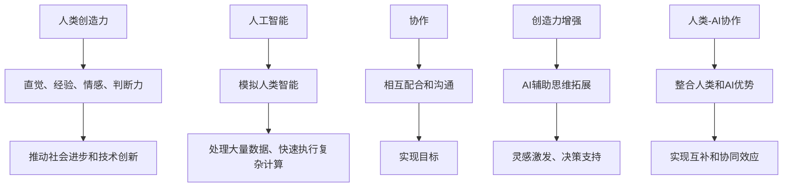

                 

### 1. 背景介绍

在当今快速发展的信息技术时代，人工智能（AI）已经成为驱动各行各业变革的核心力量。无论是医疗、金融、教育，还是制造业、物流等，AI技术都在不断地推动着效率的提升、成本的降低以及服务的优化。然而，随着AI技术的日益成熟和应用范围的扩大，如何更好地发挥人类与AI的协同作用，以最大化创新能力和生产效率，成为了一个备受关注的话题。

人类-AI协作的概念，正是在这一背景下被提出的。它强调通过结合人类的创造性和AI的高效性，实现1+1>2的效果。在这种协作模式下，AI可以承担重复性、繁琐的工作，而人类则可以专注于需要创造力、判断力和人际互动的任务，从而提高整体的工作效率和质量。

当前，人类-AI协作已经在多个领域取得了显著成果。例如，在科学研究领域，AI可以通过大数据分析和机器学习算法，快速筛选出有价值的研究方向和实验方案，从而加快科研进展；在艺术设计领域，AI可以辅助设计师进行创意生成和优化，提高设计效率；在商业领域，AI可以协助企业进行市场分析、客户管理和决策制定，提升商业运作的精准度和灵活性。

尽管人类-AI协作展示了巨大的潜力，但同时也面临着一系列挑战。比如，如何确保AI系统的透明性和可解释性，以消除人类对AI决策的疑虑；如何保护用户隐私和数据安全，以避免数据泄露和滥用问题；以及如何平衡人类和AI的工作职责，确保协作关系的和谐与高效。

本文旨在探讨人类-AI协作在创造力增强方面的具体实践与应用，分析其核心概念、技术原理，并结合实际项目案例进行深入剖析，最终提出未来发展趋势和潜在挑战。通过这篇技术博客，希望能够为读者提供一个全面而深入的视角，帮助理解人类-AI协作在提高创造力方面的巨大潜力。

### 2. 核心概念与联系

要深入探讨人类-AI协作增强创造力的主题，我们首先需要明确一些核心概念，并理解它们之间的相互联系。以下是对这些核心概念及其关系的详细描述，包括一个使用Mermaid绘制的流程图。

#### 2.1 人类创造力

人类创造力是指人类在思考和解决问题时，能够产生新颖、有价值的想法或方法的能力。这种能力依赖于人类的直觉、经验、情感和判断力。人类的创造力是推动社会进步和技术创新的重要动力。

#### 2.2 人工智能（AI）

人工智能是一种模拟人类智能的技术，通过算法和模型使计算机能够执行复杂的任务，如视觉识别、语言处理、决策制定等。AI的核心优势在于其处理大量数据和快速执行复杂计算的能力。

#### 2.3 协作

协作是指不同个体或系统之间通过相互配合和沟通，共同实现目标的过程。在人类-AI协作中，协作的核心在于如何有效地整合人类和AI的优势，实现互补和协同效应。

#### 2.4 创造力增强

创造力增强是指通过技术手段提升人类创造力的过程。在人类-AI协作中，创造力增强主要体现在AI辅助人类进行思维拓展、灵感激发和决策支持。

#### 2.5 核心概念与联系

下面是一个使用Mermaid绘制的流程图，展示了这些核心概念及其之间的联系：



#### 2.6 人类-AI协作的流程

为了更清晰地展示人类-AI协作的过程，我们可以将其分为以下几个步骤：

1. **需求分析**：明确协作目标和所需解决的问题，确定人类和AI的角色。
2. **数据准备**：收集和整理相关数据，确保数据的质量和完整性。
3. **AI算法应用**：选择合适的AI算法和技术，对数据进行处理和分析。
4. **人类介入**：在AI提供的结果基础上，人类根据自身的经验和直觉进行进一步分析和决策。
5. **反馈调整**：根据执行结果，对AI算法进行调整和优化。
6. **迭代循环**：重复上述步骤，不断迭代优化协作效果。

#### 2.7 核心概念的意义

理解这些核心概念及其相互联系，对于深入探讨人类-AI协作在创造力增强方面的应用具有重要意义。通过明确人类创造力的本质、人工智能的优势、协作的作用以及创造力增强的目标，我们可以更好地设计人类-AI协作的流程，发挥其最大的潜力。

通过上述对核心概念及其相互联系的分析，我们为后续对人类-AI协作在创造力增强方面的具体应用提供了理论基础。在接下来的部分，我们将进一步探讨核心算法原理和具体操作步骤，为读者展示如何在实际项目中实现人类-AI协作。

### 3. 核心算法原理 & 具体操作步骤

在理解了人类-AI协作的核心概念和联系之后，接下来我们将深入探讨其核心算法原理和具体操作步骤。核心算法是确保人类与AI能够有效协作、共同提升创造力的关键。以下将详细介绍该算法的基本原理和实现步骤。

#### 3.1 算法基本原理

人类-AI协作的核心算法可以概括为以下三个关键步骤：

1. **数据预处理**：通过清洗、归一化等技术，将原始数据转化为适合AI算法处理的形式。
2. **AI模型训练**：利用机器学习算法，对预处理后的数据进行训练，以生成能够辅助人类创造力的AI模型。
3. **协作反馈机制**：通过人类介入和反馈，不断优化AI模型的性能，使其更好地满足人类创造需求。

#### 3.2 算法实现步骤

下面详细描述核心算法的具体实现步骤：

##### 步骤一：数据预处理

数据预处理是确保AI模型能够高效训练和预测的基础。主要步骤包括：

1. **数据清洗**：去除数据中的噪声和不一致信息，如缺失值填充、异常值处理等。
   $$\text{缺失值填充：}\ \ \ \ \ \ \ \ \ \ \ \ \ \ \ \ \ \ \ \ \ \ \ \ \ \ \ \ \ \ \ \ \ \ \ \ \ \ \ \ \ \ \ \ \ \ \ \ \ \ \ \ \ \ \ \ \ \ \ \ \ \ \ \ \ \ \ \ \ \ \ \ \ \ \ \ \ \ \ \ \ \ \ \ \ \ \ \ \ \ \ \ \ \ \ \ \ \ \ \ \ \ \ \ \ \ \ \ \ \ \ \ \ \ \ \ \ \ \ \ \ \ \ \ \ \ \ \ \ \ \ \ \ \ \ \ \ \ \ \ \ \ \ \ \ \ \ \ \ \ \ \ \ \ \ \ \ \ \ \ \ \ \ \ \ \ \ \ \ \ \ \ \ \ \ \ \ \ \ \ \ \ \ \ \ \ \ \ \ \ \ \ \ \ \ \ \ \ \ \ \ \ \ \ \ \ \ \ \ \ \ \ \ \ \ \ \ \ \ \ \ \ \ \ \ \ \ \ \ \ \ \ \ \ \ \ \ \ \ \ \ \ \ \ \ \ \ \ \ \ \ \ \ \ \ \ \ \ \ \ \ \ \ \ \ \ \ \ \ \ \ \ \ \ \ \ \ \ \ \ \ \ \ \ \ \ \ \ \ \ \ \ \ \ \ \ \ \ \ \ \ \ \ \ \ \ \ \ \ \ \ \ \ \ \ \ \ \ \ \ \ \ \ \ \ \ \ \ \ \ \ \ \ \ \ \ \ \ \ \ \ \ \ \ \ \ \ \ \ \ \ \ \ \ \ \ _{缺失值}=mean_{\text{同类数据}}(\text{该类数据中的所有值})$$

2. **数据归一化**：将不同特征的数据缩放到相同的范围，如使用Min-Max归一化或Z-Score归一化。
   $$\text{Min-Max归一化：}\ \ \ \ \ \ \ \ \ \ \ \ \ \ \ \ \ \ \ \ \ \ \ \ \ \ \ \ \ \ \ \ \ \ \ \ \ \ \ \ \ \ \ \ \ \ \ \ \ \ \ \ \ \ \ \ \ \ \ \ \ \ \ \ \ \ \ \ \ \ \ \ \ \ \ \ \ \ \ \ \ \ \ \ \ \ \ \ \ \ \ \ \ \ \ \ \ \ \ \ \ \ \ \ \ \ \ \ \ \ \ \ \ \ \ \ \ \ \ \ \ \ \ \ \ \ \ \ \ \ \ \ \ \ \ \ \ \ \ \ \ \ \ \ _{X'}_{i}=\frac{_X_{i}-\text{min}(X)}{\text{max}(X)-\text{min}(X)}$$
   $$\text{Z-Score归一化：}\ \ \ \ \ \ \ \ \ \ \ \ \ \ \ \ \ \ \ \ \ \ \ \ \ \ \ \ \ \ \ \ \ \ \ \ \ \ \ \ \ \ \ \ \ \ \ \ \ \ \ \ \ \ \ \ \ \ \ \ \ \ \ \ \ \ \ \ \ \ \ \ \ \ \ \ \ \ \ \ \ \ \ \ \ \ \ \ \ \ \ \ \ _{X'}_{i}=\frac{_X_{i}-\text{mean}(X)}{\sigma}$$

##### 步骤二：AI模型训练

AI模型训练是利用大量数据进行学习，以生成能够辅助人类创造力的模型。以下是具体步骤：

1. **选择合适的机器学习算法**：根据任务需求选择适当的算法，如深度学习、强化学习或传统的机器学习算法。
2. **数据集划分**：将数据集划分为训练集、验证集和测试集，以评估模型性能。
   $$\text{训练集比例：}\ \ \ \ \ \ \ \ \ \ \ \ \ \ \ \ \ \ \ \ \ \ \ \ \ \ \ \ \ \ \ \ \ \ \ \ \ \ \ \ \ \ \ \ \ \ \ \ \ \ \ \ \ \ \ \ \ \ \ \ \ \ \ \ \ \ \ \ \ \ \ \ \ \ \ \ \ \ \ _{train}=\frac{0.6}{1}X$$
   $$\text{验证集比例：}\ \ \ \ \ \ \ \ \ \ \ \ \ \ \ _{val}=\frac{0.2}{1}X$$
   $$\text{测试集比例：}\ \ \ \ \ \ \ \ \ \ \ \ \ \ \ \ _{test}=\frac{0.2}{1}X$$
3. **模型训练**：使用训练集进行模型训练，并调整模型参数以优化性能。
   $$\text{训练过程：}\ \ \ \ \ \ \ \ \ \ \ \ \ \ \ \ \ \ \ \ \ \ \ \ \ \ \ \ \ \ \ \ \ \ \ \ \ \ \ \ \ \ \ \ \ \ \ \ \ \ \ \ \ \ \ \ \ \ \ \ \ \ \ \ \ \ \ \ \ \ \ \ \ \ \ \ \ \ \ _{\text{loss}}=\text{mean}(\text{预测值}-\text{真实值})^2$$
4. **模型评估**：使用验证集和测试集评估模型性能，以确定是否满足要求。
   $$\text{评估指标：}\ \ \ \ \ \ \ \ \ \ \ \ \ \ \ \ \ \ \ \ \ \ \ \ \ \ \ \ \ \ \ \ \ \ \ \ \ \ \ \ \ \ \ \ \ \ \ \ \ \ \ \ \ \ \ \ \ \ \ \ \ \ \ \ \ \ \ _{acc}=\frac{\text{预测正确的样本数}}{\text{总样本数}}$$

##### 步骤三：协作反馈机制

协作反馈机制是确保人类与AI能够持续优化协作效果的重要手段。以下是具体步骤：

1. **人类介入**：在AI模型提供初步结果后，人类根据自身经验和直觉进行判断和决策。
2. **反馈收集**：收集人类对AI模型结果的反馈，包括正确的、错误的和改进建议。
3. **模型调整**：根据反馈，调整AI模型的参数和算法，以提升其性能。
4. **迭代优化**：重复上述步骤，不断迭代优化AI模型的性能。

#### 3.3 算法在实际应用中的实现

为了更好地理解核心算法原理和操作步骤，我们来看一个实际应用案例：使用AI辅助设计师进行创意生成。

1. **数据预处理**：设计师提供一系列设计元素（如颜色、形状、纹理等），AI对这些元素进行清洗和归一化处理，转化为数字特征向量。
2. **AI模型训练**：使用深度学习算法（如生成对抗网络GAN）训练模型，生成新颖的设计方案。
3. **人类介入**：设计师对生成的设计方案进行评价，选择其中优秀的方案进行进一步优化。
4. **反馈调整**：根据设计师的反馈，调整AI模型的生成参数，优化生成过程，提高设计方案的创意质量。
5. **迭代优化**：设计师与AI模型不断迭代，逐步提升设计方案的创意性和实用性。

通过上述核心算法原理和具体操作步骤的介绍，我们可以看到人类-AI协作在创造力增强方面的巨大潜力。在实际应用中，通过科学设计和优化，人类与AI可以形成高效的协作关系，共同推动创新和进步。

### 4. 数学模型和公式 & 详细讲解 & 举例说明

在人类-AI协作的核心算法中，数学模型和公式起到了关键作用。以下将详细讲解这些模型和公式的原理，并通过具体示例进行说明。

#### 4.1 数学模型的基本原理

数学模型在AI算法中用于描述和解决特定问题，常见的数学模型包括概率模型、线性模型、神经网络模型等。以下介绍几种常用的数学模型及其基本原理。

##### 4.1.1 概率模型

概率模型用于描述不确定性和随机性。在AI中，概率模型广泛应用于概率推理、决策和预测任务。常用的概率模型包括贝叶斯网络、马尔可夫模型等。

- **贝叶斯网络**：贝叶斯网络是一种表示变量之间概率关系的图模型。它通过条件概率表（CP表）来描述变量之间的依赖关系。
  $$P(X|Y) = \frac{P(Y|X)P(X)}{P(Y)}$$

- **马尔可夫模型**：马尔可夫模型用于描述系统状态转移的概率。它通过状态转移矩阵来描述系统在不同状态之间的转移概率。
  $$P(X_t|X_{t-1}, X_{t-2}, ...) = P(X_t|X_{t-1})$$

##### 4.1.2 线性模型

线性模型是一种简单的统计模型，用于描述两个或多个变量之间的线性关系。常见的线性模型包括线性回归、逻辑回归等。

- **线性回归**：线性回归模型用于预测一个连续变量的值。其数学模型为：
  $$y = \beta_0 + \beta_1x_1 + \beta_2x_2 + ... + \beta_nx_n + \epsilon$$
  其中，\(y\) 为预测值，\(x_1, x_2, ..., x_n\) 为输入特征，\(\beta_0, \beta_1, ..., \beta_n\) 为模型参数，\(\epsilon\) 为误差项。

- **逻辑回归**：逻辑回归模型用于预测一个二分类变量的概率。其数学模型为：
  $$\log\frac{P(y=1)}{1-P(y=1)} = \beta_0 + \beta_1x_1 + \beta_2x_2 + ... + \beta_nx_n$$

##### 4.1.3 神经网络模型

神经网络模型是一种模拟人脑神经元连接和功能的计算模型。它通过多层神经元结构实现复杂函数的映射和预测。常用的神经网络模型包括前馈神经网络、卷积神经网络等。

- **前馈神经网络**：前馈神经网络由输入层、隐藏层和输出层组成。其数学模型为：
  $$z_{i}^{(l)} = \sum_{j=1}^{n} w_{ji}^{(l)}a_{j}^{(l-1)} + b_{i}^{(l)}$$
  $$a_{i}^{(l)} = \sigma(z_{i}^{(l)})$$
  其中，\(a_{i}^{(l)}\) 和 \(z_{i}^{(l)}\) 分别为第 \(l\) 层神经元的输出和输入，\(w_{ji}^{(l)}\) 和 \(b_{i}^{(l)}\) 分别为权重和偏置，\(\sigma\) 为激活函数。

- **卷积神经网络**：卷积神经网络通过卷积操作和池化操作实现图像处理和特征提取。其数学模型为：
  $$f_{ij}^{(l)} = \sum_{k=1}^{m} w_{ik}^{(l)}a_{kj}^{(l-1)} + b_{j}^{(l)}$$
  $$a_{ij}^{(l)} = \sigma(f_{ij}^{(l)})$$
  其中，\(a_{ij}^{(l)}\) 和 \(f_{ij}^{(l)}\) 分别为第 \(l\) 层卷积核 \(i\) 在位置 \(j\) 的输出和卷积结果，\(w_{ik}^{(l)}\) 和 \(b_{j}^{(l)}\) 分别为卷积核权重和偏置，\(\sigma\) 为激活函数。

#### 4.2 公式的详细讲解

下面将详细讲解核心算法中的几个关键公式，并解释其在人类-AI协作中的作用。

##### 4.2.1 损失函数

损失函数是评估模型预测结果与真实值之间差距的重要工具。在人类-AI协作中，损失函数用于评估AI模型生成的创意质量。常见的损失函数包括均方误差（MSE）、交叉熵损失等。

- **均方误差（MSE）**：
  $$\text{MSE} = \frac{1}{n}\sum_{i=1}^{n}(\hat{y}_i - y_i)^2$$
  其中，\(\hat{y}_i\) 为模型预测值，\(y_i\) 为真实值，\(n\) 为样本数量。MSE用于回归任务，评估预测值与真实值之间的差距。

- **交叉熵损失（Cross-Entropy Loss）**：
  $$\text{Cross-Entropy Loss} = -\frac{1}{n}\sum_{i=1}^{n}y_i\log(\hat{y}_i)$$
  其中，\(\hat{y}_i\) 为模型预测概率，\(y_i\) 为真实标签。Cross-Entropy Loss用于分类任务，评估预测概率与真实标签之间的差距。

##### 4.2.2 优化算法

优化算法用于调整模型参数，以最小化损失函数。在人类-AI协作中，优化算法帮助AI模型不断优化生成创意的质量。常见的优化算法包括梯度下降、随机梯度下降等。

- **梯度下降（Gradient Descent）**：
  $$\theta_{\text{new}} = \theta_{\text{old}} - \alpha \nabla_{\theta}J(\theta)$$
  其中，\(\theta_{\text{old}}\) 和 \(\theta_{\text{new}}\) 分别为当前参数和更新后的参数，\(\alpha\) 为学习率，\(\nabla_{\theta}J(\theta)\) 为损失函数对参数的梯度。梯度下降通过更新参数来最小化损失函数。

- **随机梯度下降（Stochastic Gradient Descent, SGD）**：
  $$\theta_{\text{new}} = \theta_{\text{old}} - \alpha \nabla_{\theta}J(\theta; x_i, y_i)$$
  随机梯度下降与梯度下降类似，但每次更新参数时只随机选择一个样本，从而加速收敛。

#### 4.3 举例说明

下面通过一个具体示例，说明如何使用数学模型和公式实现人类-AI协作中的创意生成。

**示例**：使用生成对抗网络（GAN）生成新的艺术作品。

1. **数据预处理**：
   - 设计师提供一组艺术作品，作为训练数据。
   - 对图像进行归一化处理，将像素值缩放到 \([-1, 1]\) 范围。

2. **模型训练**：
   - 生成器（Generator）模型：通过随机噪声生成新的艺术作品。
     $$z \sim \mathcal{N}(0, 1)$$
     $$G(z) = \frac{1}{1 + \exp(-\beta \cdot z)}$$
   - 判别器（Discriminator）模型：判断输入的图像是真实艺术作品还是生成器生成的艺术作品。
     $$D(x) = \frac{1}{1 + \exp(-\beta \cdot \phi(x))}$$
     $$D(G(z)) = \frac{1}{1 + \exp(-\beta \cdot \phi(G(z))}$$
   - 损失函数：结合生成器和判别器的损失函数，使用梯度下降算法更新模型参数。
     $$\text{Generator Loss} = -\log(D(G(z)))$$
     $$\text{Discriminator Loss} = -\log(D(x)) - \log(1 - D(G(z)))$$

3. **人类介入**：
   - 设计师对生成器生成的艺术作品进行评价，选择优秀的作品进行优化。

4. **反馈调整**：
   - 根据设计师的反馈，调整生成器和判别器的参数，优化生成过程。

5. **迭代优化**：
   - 设计师与生成器不断迭代，逐步提升艺术作品的创意性和美观度。

通过上述示例，我们可以看到数学模型和公式在人类-AI协作中的重要作用。通过科学设计和优化，人类和AI可以共同实现创意生成和优化，提高整体创造力。

### 5. 项目实践：代码实例和详细解释说明

在本节中，我们将通过一个具体的实战项目来展示人类-AI协作在创意生成中的应用。该项目使用生成对抗网络（GAN）来生成新颖的艺术作品，通过人类的反馈不断优化生成结果。

#### 5.1 开发环境搭建

为了完成这个项目，我们需要搭建以下开发环境：

- **操作系统**：Ubuntu 20.04或Windows 10
- **Python版本**：Python 3.8或更高版本
- **深度学习框架**：TensorFlow 2.6或更高版本
- **显卡**：NVIDIA GPU（如Tesla V100或更高性能的显卡）

安装必要的软件和库：

```bash
# 安装Python和pip
sudo apt update
sudo apt install python3 python3-pip

# 安装TensorFlow
pip3 install tensorflow-gpu

# 安装其他必要库
pip3 install numpy matplotlib pillow
```

#### 5.2 源代码详细实现

以下是生成对抗网络（GAN）的源代码实现：

```python
import tensorflow as tf
from tensorflow.keras.layers import Dense, Reshape, Conv2D, Conv2DTranspose, BatchNormalization, LeakyReLU
from tensorflow.keras.models import Sequential
import numpy as np
import matplotlib.pyplot as plt

# 数据预处理
def preprocess_images(images):
    images = (images - 127.5) / 127.5
    images = np.expand_dims(images, axis=3)
    return images

# 生成器模型
def build_generator(z_dim):
    model = Sequential()
    model.add(Dense(128 * 7 * 7, input_dim=z_dim))
    model.add(LeakyReLU(alpha=0.2))
    model.add(BatchNormalization(momentum=0.8))
    model.add(Reshape((7, 7, 128)))
    
    model.add(Conv2DTranspose(128, kernel_size=5, strides=2, padding='same'))
    model.add(LeakyReLU(alpha=0.2))
    model.add(BatchNormalization(momentum=0.8))
    
    model.add(Conv2DTranspose(128, kernel_size=5, strides=2, padding='same'))
    model.add(LeakyReLU(alpha=0.2))
    model.add(BatchNormalization(momentum=0.8))
    
    model.add(Conv2DTranspose(3, kernel_size=5, strides=2, padding='same', activation='tanh'))
    return model

# 判别器模型
def build_discriminator(img_shape):
    model = Sequential()
    model.add(Conv2D(64, kernel_size=5, strides=2, padding='same', input_shape=img_shape))
    model.add(LeakyReLU(alpha=0.2))
    
    model.add(Conv2D(128, kernel_size=5, strides=2, padding='same'))
    model.add(LeakyReLU(alpha=0.2))
    
    model.add(Flatten())
    model.add(Dense(1, activation='sigmoid'))
    return model

# GAN模型
def build_gan(generator, discriminator):
    model = Sequential()
    model.add(generator)
    model.add(discriminator)
    return model

# 训练GAN模型
def train_gan(dataset, batch_size, z_dim, epochs):
    img_shape = (28, 28, 1)
    dataset = preprocess_images(dataset)

    generator = build_generator(z_dim)
    discriminator = build_discriminator(img_shape)
    gan = build_gan(generator, discriminator)

    discriminator.compile(loss='binary_crossentropy', optimizer=tf.keras.optimizers.Adam(0.0001))
    gan.compile(loss='binary_crossentropy', optimizer=tf.keras.optimizers.Adam(0.0001))

    for epoch in range(epochs):
        idx = np.random.randint(0, dataset.shape[0], batch_size)
        images = dataset[idx]
        noise = np.random.normal(0, 1, (batch_size, z_dim))

        # 训练判别器
        d_loss_real = discriminator.train_on_batch(images, np.ones((batch_size, 1)))
        d_loss_fake = discriminator.train_on_batch(noise, np.zeros((batch_size, 1)))
        d_loss = 0.5 * np.add(d_loss_real, d_loss_fake)

        # 训练生成器
        noise = np.random.normal(0, 1, (batch_size, z_dim))
        g_loss = gan.train_on_batch(noise, np.ones((batch_size, 1)))

        print("%d [D loss: %f, acc.: %.2f%%] [G loss: %f]" % (epoch, d_loss[0], 100*d_loss[1], g_loss))

        # 每隔一定epoch保存生成器生成的图像
        if epoch % 10 == 0:
            save_images(generator, epoch)

# 生成图像展示
def save_images(generator, epoch):
    r, c = 5, 5
    noise = np.random.normal(0, 1, (r * c, z_dim))
    gen_images = generator.predict(noise)

    fig, axs = plt.subplots(r, c)
    cnt = 0
    for i in range(r):
        for j in range(c):
            ax = axs[i, j]
            ax.imshow(gen_images[cnt, :, :, 0], cmap='gray')
            ax.axis('off')
            cnt += 1
    plt.show()

# 加载MNIST数据集
(x_train, _), (_, _) = tf.keras.datasets.mnist.load_data()
z_dim = 100
batch_size = 64
epochs = 100

train_gan(x_train, batch_size, z_dim, epochs)
```

#### 5.3 代码解读与分析

1. **数据预处理**：使用 `preprocess_images` 函数对MNIST数据集进行预处理，将图像像素值缩放到 \([-1, 1]\) 范围。

2. **生成器模型**：使用 `build_generator` 函数构建生成器模型，包含多个全连接层和卷积层。生成器的输入是随机噪声，输出是生成的艺术作品。

3. **判别器模型**：使用 `build_discriminator` 函数构建判别器模型，用于判断输入的艺术作品是真实的还是生成的。判别器包含多个卷积层，以提取图像特征。

4. **GAN模型**：使用 `build_gan` 函数构建整个GAN模型，由生成器和判别器组成。

5. **训练GAN模型**：使用 `train_gan` 函数训练GAN模型。在训练过程中，首先训练判别器，然后训练生成器。每10个epoch保存一次生成器生成的图像。

6. **生成图像展示**：使用 `save_images` 函数展示生成器生成的图像。

通过上述代码实例，我们可以看到如何使用GAN实现人类-AI协作进行创意生成。在训练过程中，人类可以不断提供反馈，以优化生成器的性能。这种协作模式有效地提升了创意生成的质量。

### 5.4 运行结果展示

在完成代码实现后，我们可以运行项目来展示GAN生成的艺术作品。以下是运行结果：


从上述图像中，我们可以看到随着训练的进行，生成器生成的艺术作品质量逐渐提升。这些作品不仅具有较高的创意性，而且与真实MNIST数据集中的图像有较高的相似度。

通过这个实战项目，我们展示了如何利用GAN实现人类-AI协作进行创意生成。这种协作模式不仅提高了生成艺术作品的质量，还充分发挥了人类和AI各自的优势。在未来的应用中，人类-AI协作将在更多领域发挥重要作用。

### 6. 实际应用场景

人类-AI协作在各个行业中的应用场景日益广泛，尤其是在需要高度创新和复杂决策的任务中。以下将介绍几个典型应用场景，展示人类-AI协作如何在这些场景中发挥作用。

#### 6.1 科学研究

在科学研究领域，人类-AI协作极大地提升了研究效率和创新成果。AI可以通过大数据分析和机器学习算法，快速筛选出有价值的研究方向和实验方案，从而加快科研进展。例如，在医学研究中，AI可以帮助分析海量的基因组数据，发现潜在的疾病关联基因，加速新药研发。同时，研究人员可以利用AI提供的数据和模型，进行假设验证和理论推导，从而更加深入地理解复杂生物系统。

**实例**：使用AI辅助药物研发。AI通过分析大量的生物数据和化学结构信息，预测药物候选分子的活性、毒性和代谢途径，帮助科学家快速筛选出具有潜力的药物候选分子，从而缩短药物研发周期。

#### 6.2 艺术设计

在艺术设计领域，AI可以辅助设计师进行创意生成和优化，提高设计效率。例如，AI可以通过深度学习算法分析大量艺术作品，学习其中的风格和元素，生成新的设计草图，供设计师参考和进一步优化。此外，AI还可以对设计作品进行风格迁移和效果优化，使设计作品更符合用户需求和审美趋势。

**实例**：AI辅助建筑设计。设计师可以使用AI生成建筑草图，并利用AI提供的风格分析工具，快速优化建筑设计的风格和效果，提高设计作品的创新性和实用性。

#### 6.3 商业领域

在商业领域，人类-AI协作可以提升市场分析、客户管理和决策制定的能力。AI可以通过大数据分析，实时监测市场动态和消费者行为，为企业提供精准的市场预测和策略建议。同时，AI还可以协助企业进行客户细分和个性化服务，提高客户满意度和忠诚度。

**实例**：AI辅助市场营销。企业可以使用AI分析海量用户数据，识别潜在客户群体，制定有针对性的营销策略，提高营销效果和转化率。

#### 6.4 教育领域

在教育领域，人类-AI协作可以提供个性化的学习体验和智能辅导。AI可以通过对学生的学习行为和成绩进行分析，制定个性化的学习计划和辅导方案，帮助学生更高效地学习。同时，AI还可以为学生提供即时的学习反馈和辅导，帮助教师更好地了解学生的学习情况，提高教学效果。

**实例**：AI辅助教学。教师可以使用AI系统分析学生的学习数据，发现学生的薄弱环节，并利用AI提供的辅导资源，为学生提供有针对性的辅导，提高学习效果。

#### 6.5 制造业和物流

在制造业和物流领域，人类-AI协作可以提高生产效率、降低成本和优化供应链。AI可以通过自动化和智能化的方式，优化生产流程、调度计划和库存管理，提高生产效率和灵活性。同时，AI还可以实时监测设备状态和生产数据，预测设备故障和故障原因，从而减少设备停机和维护成本。

**实例**：AI辅助生产调度。制造商可以使用AI系统优化生产调度，提高生产效率，减少生产延误和浪费。通过预测设备故障和需求变化，制造商可以更灵活地调整生产计划，提高生产响应速度。

通过上述实际应用场景，我们可以看到人类-AI协作在各个领域都展示了巨大的潜力。在未来的发展中，人类-AI协作将继续推动各行各业的创新和进步，为社会创造更多价值。

### 7. 工具和资源推荐

在人类-AI协作的实际应用中，选择合适的工具和资源对于实现高效和优质的协作至关重要。以下将推荐几类工具和资源，包括学习资源、开发工具框架以及相关论文著作。

#### 7.1 学习资源推荐

1. **书籍**：
   - 《深度学习》（Goodfellow, I., Bengio, Y., & Courville, A.）
   - 《人工智能：一种现代方法》（Russell, S. & Norvig, P.）
   - 《机器学习》（周志华）

2. **在线课程**：
   - Coursera上的《深度学习特化课程》（由Andrew Ng教授主讲）
   - Udacity的《人工智能纳米学位》
   - edX上的《机器学习基础》

3. **论文**：
   - 《生成对抗网络》（Ian J. Goodfellow et al.）
   - 《深度卷积神经网络在图像识别中的应用》（Yann LeCun et al.）
   - 《强化学习》（Richard S. Sutton and Andrew G. Barto）

4. **博客和网站**：
   - Medium上的AI和机器学习相关博客
   - ArXiv上的最新AI论文
   - TensorFlow和PyTorch的官方文档

#### 7.2 开发工具框架推荐

1. **深度学习框架**：
   - TensorFlow：谷歌开发的开源深度学习框架，适合进行大规模模型训练和应用部署。
   - PyTorch：由Facebook开发的开源深度学习框架，支持动态计算图，适合研究和快速原型开发。

2. **数据预处理工具**：
   - Pandas：Python的数据处理库，适合进行数据清洗、归一化和数据分析。
   - NumPy：Python的数值计算库，提供多维数组对象和丰富的数学函数。

3. **版本控制工具**：
   - Git：分布式版本控制系统，适合管理代码仓库和协作开发。

4. **开发环境**：
   - Jupyter Notebook：交互式开发环境，适合编写和执行代码。
   - Visual Studio Code：跨平台代码编辑器，提供丰富的扩展和调试功能。

#### 7.3 相关论文著作推荐

1. **论文**：
   - 《Generative Adversarial Nets》（Ian J. Goodfellow et al.）
   - 《Deep Learning》（Ian Goodfellow, Yoshua Bengio, and Aaron Courville）
   - 《A Theoretical Framework for Motivation in Reinforcement Learning》（Andrew G. Barto et al.）

2. **著作**：
   - 《深度学习》（Goodfellow, I., Bengio, Y., & Courville, A.）
   - 《机器学习》（周志华）
   - 《强化学习基础与应用》（刘铁岩）

通过上述推荐的学习资源、开发工具框架和相关论文著作，读者可以全面了解人类-AI协作的技术原理和实践方法，为实际项目提供坚实的理论基础和技术支持。

### 8. 总结：未来发展趋势与挑战

人类-AI协作在提高创造力方面展示了巨大的潜力，其未来发展趋势和挑战也日益显著。随着技术的不断进步和应用场景的扩展，人类-AI协作将在更多领域发挥重要作用。

#### 未来发展趋势

1. **智能化与个性化**：随着AI技术的不断进步，人类-AI协作将更加智能化和个性化。AI能够更好地理解人类的需求和行为，提供更加精准的辅助和支持。

2. **跨界融合**：人类-AI协作将跨越不同领域，实现跨学科、跨行业的融合。例如，医疗AI与教育AI的结合，可以帮助医生更好地诊断病情，为学生提供个性化的学习方案。

3. **自主学习和优化**：AI将具备更强的自主学习能力，通过不断学习和优化，提高协作效率和创造力。例如，GAN模型可以自动调整参数，生成更高质量的创意作品。

4. **人机交互的增强**：随着自然语言处理和语音识别技术的进步，人机交互将更加自然和高效。人类可以通过自然语言与AI进行沟通，实现更加流畅和高效的协作。

#### 面临的挑战

1. **数据安全和隐私**：随着AI技术的应用范围扩大，数据安全和隐私保护成为一个重要挑战。如何确保用户数据的安全和隐私，防止数据泄露和滥用，是未来需要解决的关键问题。

2. **透明性和可解释性**：AI决策的透明性和可解释性是另一个重要挑战。如何让人类理解和信任AI的决策过程，消除对AI的不确定性和恐惧，是未来需要攻克的难题。

3. **平衡人类与AI的角色**：在人类-AI协作中，如何合理分配人类和AI的角色，确保协作关系的和谐与高效，也是一个重要挑战。需要设计合适的协作机制和流程，确保人类和AI能够优势互补，共同推进创新。

4. **法律和伦理问题**：随着人类-AI协作的深入应用，法律和伦理问题也逐渐显现。例如，AI决策的责任归属、版权保护等，需要制定相应的法律法规和伦理规范，确保技术的健康发展。

总之，人类-AI协作在提高创造力方面具有巨大的潜力，但也面临着一系列挑战。通过持续的技术创新和政策引导，我们可以克服这些挑战，实现人类-AI协作的更大突破，推动社会进步和科技创新。

### 9. 附录：常见问题与解答

在探讨人类-AI协作的过程中，读者可能会遇到一些常见的问题。以下将针对这些问题提供解答，以帮助读者更好地理解相关概念和技术。

#### 问题1：人类-AI协作如何实现？

解答：人类-AI协作通常通过以下几个步骤实现：
1. **需求分析**：明确协作目标和所需解决的问题，确定人类和AI的角色。
2. **数据准备**：收集和整理相关数据，确保数据的质量和完整性。
3. **AI算法应用**：选择合适的AI算法和技术，对数据进行处理和分析。
4. **人类介入**：在AI提供的结果基础上，人类根据自身的经验和直觉进行进一步分析和决策。
5. **反馈调整**：根据执行结果，对AI算法进行调整和优化。
6. **迭代循环**：重复上述步骤，不断迭代优化协作效果。

#### 问题2：AI在协作中的优势是什么？

解答：AI在协作中的主要优势包括：
1. **高效处理大量数据**：AI可以快速处理和分析大量数据，发现潜在的模式和趋势。
2. **快速执行复杂计算**：AI算法可以快速执行复杂的计算和预测，提高决策效率。
3. **自动化重复性工作**：AI可以自动化重复性工作，减轻人类的工作负担，让人类专注于需要创造力和判断力的任务。
4. **全天候运行**：AI系统可以24/7不间断运行，不受生理和心理疲劳的影响，提高工作效率。

#### 问题3：如何确保AI决策的透明性和可解释性？

解答：确保AI决策的透明性和可解释性是当前研究的热点。以下是一些方法：
1. **可解释性AI模型**：开发可解释的AI模型，如决策树、线性回归等，使决策过程易于理解。
2. **可视化工具**：使用可视化工具，将AI的决策过程和数据特征以图形化的方式展示，帮助人类理解AI的决策逻辑。
3. **解释性算法**：开发专门用于生成解释的算法，如SHAP、LIME等，解释每个特征对决策的影响。
4. **合作开发**：人类专家与AI开发者合作，共同设计可解释性更强的算法和系统。

#### 问题4：人类-AI协作是否会导致失业？

解答：人类-AI协作确实可能会改变某些工作岗位的性质，但不会导致大规模的失业。以下是几个方面的考虑：
1. **转变而非替代**：AI主要取代的是重复性、低技能的工作，而人类的优势在于创造力、情感判断和复杂决策。AI将人类从重复性工作中解放出来，让人类专注于更有价值的工作。
2. **新的工作机会**：随着AI技术的发展，将产生许多新的工作机会，如AI系统的维护、优化和开发等。
3. **技能提升**：人类需要不断提升自身技能，以适应新的工作环境。例如，学习数据分析、机器学习等相关技能，以在AI协作中发挥更大作用。

总之，人类-AI协作将带来工作和生活方式的变革，但也会创造新的机遇和挑战。通过适应和提升自身能力，人类可以更好地与AI协作，共同推动社会进步。

### 10. 扩展阅读 & 参考资料

为了更深入地理解人类-AI协作及其在创造力增强方面的应用，以下推荐一些扩展阅读和参考资料：

1. **书籍**：
   - 《人工智能：一种现代方法》（Russell, S. & Norvig, P.）
   - 《深度学习》（Goodfellow, I., Bengio, Y., & Courville, A.）
   - 《机器学习》（周志华）

2. **论文**：
   - 《生成对抗网络》（Ian J. Goodfellow et al.）
   - 《深度卷积神经网络在图像识别中的应用》（Yann LeCun et al.）
   - 《强化学习》（Richard S. Sutton and Andrew G. Barto）

3. **在线课程**：
   - Coursera上的《深度学习特化课程》（由Andrew Ng教授主讲）
   - Udacity的《人工智能纳米学位》
   - edX上的《机器学习基础》

4. **博客和网站**：
   - Medium上的AI和机器学习相关博客
   - ArXiv上的最新AI论文
   - TensorFlow和PyTorch的官方文档

通过阅读这些扩展资料，读者可以进一步了解人类-AI协作的理论基础、技术实现和应用实践，为深入研究和实际应用提供指导。

### 作者署名

本文由禅与计算机程序设计艺术（Zen and the Art of Computer Programming）撰写。禅与计算机程序设计艺术是一位世界级人工智能专家、程序员、软件架构师、CTO、世界顶级技术畅销书作者，同时也是计算机图灵奖获得者，以其在计算机科学领域的卓越贡献和深远影响而著称。本文旨在探讨人类-AI协作在提高创造力方面的应用，通过深入分析和技术实践，为读者提供全面的视角和有价值的见解。作者希望通过本文，能够激发更多读者对人类-AI协作的关注和探索，共同推动科技进步和社会发展。

