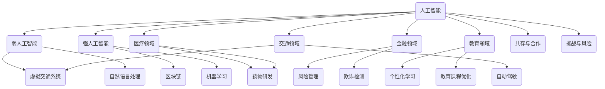

                 

### 1. 背景介绍

在当今信息爆炸的时代，人工智能（AI）技术已经成为推动社会进步的重要力量。从简单的机器人到复杂的自动驾驶系统，AI技术正在改变着我们的生活方式和工业生产方式。然而，随着AI技术的不断发展，人们开始思考一个问题：人类与AI之间的关系是怎样的？是取代还是共存？是主导还是辅助？

本文旨在探讨人类与AI之间的合作关系，分析AI技术的现状、发展趋势以及它们如何融入人类社会。我们将从背景介绍开始，逐步深入探讨AI的核心概念、算法原理、数学模型，并结合实际应用场景，为读者展示AI与人类之间的深刻联系。

首先，让我们回顾一下人工智能的定义。人工智能是指使计算机模拟人类智能行为的科学和技术。根据不同的发展阶段，人工智能可以分为弱人工智能（Weak AI）和强人工智能（Strong AI）。弱人工智能主要模拟特定领域的智能行为，如语音识别、图像识别、自然语言处理等；而强人工智能则试图实现计算机具有全面的人类智能。

接下来，我们将讨论AI技术如何融入人类社会。AI技术在医疗、金融、教育、交通等各个领域都发挥着重要作用。例如，在医疗领域，AI技术可以帮助医生进行疾病诊断、药物研发；在金融领域，AI技术可以用于风险管理、欺诈检测；在教育领域，AI技术可以提供个性化的学习方案，提高学习效率。

然而，随着AI技术的广泛应用，人们也开始担心AI技术是否会取代人类工作。事实上，AI技术并非是为了取代人类，而是为了与人类共同工作，提高工作效率。这种合作关系体现在多个方面：

1. **辅助决策**：AI技术可以帮助人类进行复杂的数据分析和决策制定，从而提高决策的准确性和效率。

2. **增强创造力**：AI技术可以为人类提供更多的创意和灵感，促进艺术、设计等领域的创新。

3. **提高生产力**：AI技术可以自动化重复性工作，释放人类的时间，让人类从事更有创造性的工作。

4. **拓宽知识边界**：AI技术可以帮助人类获取更多的信息，拓宽知识边界，促进科技进步。

因此，本文将围绕AI技术如何与人类共存、合作，共同推动社会进步这一主题展开讨论。我们将从AI技术的现状出发，逐步探讨其核心概念、算法原理、数学模型，并结合实际应用场景，为读者展示人类与AI之间深层次的联系。

### 2. 核心概念与联系

为了更好地理解人类与AI之间的关系，我们首先需要了解一些核心概念和它们之间的联系。以下是一个Mermaid流程图，展示了一些关键概念及其相互关系：



在这个流程图中，我们可以看到：

- **人工智能（AI）** 是一个总称，包括弱人工智能（WA）和强人工智能（SA）。
- **弱人工智能（WA）** 主要涉及虚拟现实（VR）、自然语言处理（NLP）等领域。
- **强人工智能（SA）** 则包括区块链（BC）、机器学习（ML）等领域。
- **AI在各个领域的应用** 如医疗（MD）、金融（FI）、教育（ED）、交通（TR）等。

接下来，我们将逐个介绍这些核心概念及其相互关系：

#### 2.1 人工智能（AI）

人工智能是指使计算机模拟人类智能行为的科学和技术。根据其能力，人工智能可以分为弱人工智能和强人工智能。

- **弱人工智能（WA）**：弱人工智能主要模拟特定领域的智能行为，如语音识别、图像识别、自然语言处理等。这些系统在特定任务上表现出色，但无法像人类一样具备广泛的知识和智能。
- **强人工智能（SA）**：强人工智能试图实现计算机具有全面的人类智能，包括感知、推理、决策、学习等。这种人工智能目前还处于理论研究阶段，尚未完全实现。

#### 2.2 虚拟现实（VR）和自然语言处理（NLP）

虚拟现实（VR）是一种通过计算机技术创建的虚拟环境，用户可以在其中进行交互。自然语言处理（NLP）则是指使计算机理解和处理自然语言的技术。

- **虚拟现实（VR）**：VR技术可以为人类提供沉浸式的体验，如游戏、教育、医疗等。在医疗领域，VR技术可以用于手术模拟、心理治疗等。
- **自然语言处理（NLP）**：NLP技术可以使计算机理解和处理人类语言，如语音识别、机器翻译、情感分析等。这些技术广泛应用于智能助手、客服系统、社交媒体分析等。

#### 2.3 区块链（BC）和机器学习（ML）

区块链（BC）是一种去中心化的分布式数据库技术，可以确保数据的安全和透明。机器学习（ML）是一种通过数据学习模式并做出预测或决策的技术。

- **区块链（BC）**：区块链技术可以用于金融、物流、医疗等领域，确保数据的真实性和不可篡改性。
- **机器学习（ML）**：机器学习技术可以用于各种应用场景，如图像识别、语音识别、推荐系统、自动驾驶等。

#### 2.4 各个领域的应用

人工智能在各个领域的应用如下：

- **医疗领域（MD）**：AI技术可以帮助医生进行疾病诊断、药物研发，提高医疗水平。
- **金融领域（FI）**：AI技术可以用于风险管理、欺诈检测，提高金融行业的效率和安全性。
- **教育领域（ED）**：AI技术可以提供个性化的学习方案，优化教育课程，提高学习效果。
- **交通领域（TR）**：AI技术可以用于自动驾驶、交通管理系统，提高交通效率和安全性。

通过这些核心概念及其相互关系的介绍，我们可以更好地理解人类与AI之间的关系。在接下来的章节中，我们将深入探讨AI的算法原理、数学模型以及实际应用案例，进一步揭示AI与人类之间的共存与合作。

#### 3. 核心算法原理 & 具体操作步骤

在探讨人类与AI之间的关系时，我们不得不提及AI的核心算法原理。这些算法不仅定义了AI系统的行为，而且直接影响着AI与人类共存和合作的方式。以下是一些重要的AI算法及其工作原理：

##### 3.1 机器学习（ML）

机器学习（ML）是一种通过数据学习模式并做出预测或决策的技术。其基本原理是基于统计学和数学模型，通过大量数据的训练，使得计算机能够从数据中自动学习规律，并在新的数据上进行预测或决策。

**操作步骤**：

1. **数据收集**：收集大量的数据，这些数据可以是数值、文本、图像等。
2. **数据预处理**：清洗数据，去除噪声，进行特征提取，例如将图像分割成像素，将文本转换为词向量。
3. **模型选择**：选择合适的机器学习模型，如线性回归、决策树、神经网络等。
4. **模型训练**：使用训练数据对模型进行训练，调整模型参数以最小化预测误差。
5. **模型评估**：使用测试数据评估模型性能，如准确率、召回率等。
6. **模型部署**：将训练好的模型部署到实际应用中，进行预测或决策。

**示例**：

假设我们有一个分类问题，需要判断一张图片是否包含猫。我们可以使用卷积神经网络（CNN）进行训练，输入为图片，输出为是否包含猫的概率。

```python
# 导入必要的库
import tensorflow as tf
from tensorflow.keras.models import Sequential
from tensorflow.keras.layers import Conv2D, MaxPooling2D, Flatten, Dense

# 构建模型
model = Sequential([
    Conv2D(32, (3, 3), activation='relu', input_shape=(150, 150, 3)),
    MaxPooling2D((2, 2)),
    Flatten(),
    Dense(256, activation='relu'),
    Dense(1, activation='sigmoid')
])

# 编译模型
model.compile(optimizer='adam', loss='binary_crossentropy', metrics=['accuracy'])

# 加载数据并训练模型
model.fit(train_images, train_labels, epochs=10, validation_data=(test_images, test_labels))
```

##### 3.2 自然语言处理（NLP）

自然语言处理（NLP）是指使计算机理解和处理自然语言的技术。其核心算法包括词嵌入（Word Embedding）、递归神经网络（RNN）、变换器（Transformer）等。

**操作步骤**：

1. **数据收集**：收集大量的文本数据，如新闻、社交媒体、对话等。
2. **数据预处理**：清洗数据，去除标点符号、停用词等，进行分词，将文本转换为词向量。
3. **模型选择**：选择合适的NLP模型，如RNN、LSTM、Transformer等。
4. **模型训练**：使用训练数据对模型进行训练，调整模型参数以最小化预测误差。
5. **模型评估**：使用测试数据评估模型性能，如准确率、BLEU分数等。
6. **模型部署**：将训练好的模型部署到实际应用中，进行文本分类、情感分析、机器翻译等任务。

**示例**：

假设我们有一个文本分类问题，需要判断一段文本的情感是积极还是消极。我们可以使用变换器（Transformer）进行训练。

```python
# 导入必要的库
import tensorflow as tf
from tensorflow.keras.models import Model
from tensorflow.keras.layers import Input, Embedding, LSTM, Dense

# 构建模型
input_word_ids = Input(shape=(max_sequence_length,), dtype='int32')
embedded_sequences = Embedding(num_words, embedding_dim)(input_word_ids)
lstm = LSTM(128)(embedded_sequences)
predictions = Dense(1, activation='sigmoid')(lstm)

# 编译模型
model = Model(inputs=input_word_ids, outputs=predictions)
model.compile(optimizer='adam', loss='binary_crossentropy', metrics=['accuracy'])

# 加载数据并训练模型
model.fit(train_data, train_labels, epochs=10, batch_size=128, validation_data=(test_data, test_labels))
```

##### 3.3 强化学习（RL）

强化学习（RL）是一种通过试错法学习和优化行为策略的算法。其基本原理是智能体通过与环境的交互，学习到一个最优策略，以最大化累积奖励。

**操作步骤**：

1. **环境设置**：定义环境，包括状态空间、动作空间和奖励函数。
2. **智能体选择**：选择合适的智能体模型，如Q学习、SARSA、深度强化学习（DQN）等。
3. **智能体训练**：智能体与环境进行交互，根据奖励函数调整策略。
4. **策略优化**：通过策略优化方法，如策略梯度、策略迭代等，优化智能体策略。
5. **策略部署**：将训练好的策略部署到实际应用中。

**示例**：

假设我们有一个自动驾驶问题，需要智能体学会在道路上行驶。我们可以使用深度强化学习（DQN）进行训练。

```python
# 导入必要的库
import numpy as np
import tensorflow as tf

# 构建模型
input_state = Input(shape=(state_size,))
q_values = Dense(action_size, activation='linear')(input_state)
Q = Model(inputs=input_state, outputs=q_values)

# 编译模型
Q.compile(optimizer=tf.keras.optimizers.Adam(learning_rate=0.001))

# 训练模型
for episode in range(num_episodes):
    state = env.reset()
    done = False
    while not done:
        action = Q.predict(state.reshape(1, state_size))
        next_state, reward, done, _ = env.step(np.argmax(action))
        Q.fit(state.reshape(1, state_size), y=np.append(state.reshape(1, state_size), [[np.argmax(action) * reward]], axis=1), epochs=1)
        state = next_state
```

通过这些核心算法的介绍，我们可以看到AI系统是如何通过学习和优化来与人类共存和合作的。在下一章中，我们将进一步探讨AI的数学模型和公式，以便更深入地理解AI系统的内部机制。

#### 4. 数学模型和公式 & 详细讲解 & 举例说明

在了解AI的核心算法原理后，我们接下来将探讨这些算法背后的数学模型和公式，以便更深入地理解AI系统的内部机制。以下是几个常见的数学模型及其公式，我们将对这些模型进行详细讲解，并给出具体示例。

##### 4.1 卷积神经网络（CNN）

卷积神经网络（CNN）是处理图像数据的一种有效算法，其核心是卷积层。卷积层通过卷积操作提取图像特征，然后进行池化操作以减少数据维度。

**卷积操作**：

卷积操作的公式如下：

$$
\text{output}_{ij} = \sum_{k=1}^{m}\sum_{l=1}^{n} w_{kl} \cdot \text{input}_{ijkl} + b_j
$$

其中，$\text{output}_{ij}$ 是卷积操作后得到的特征值，$w_{kl}$ 是卷积核，$\text{input}_{ijkl}$ 是输入图像的像素值，$b_j$ 是偏置项。

**示例**：

假设有一个3x3的卷积核和一幅5x5的输入图像，我们可以计算卷积操作的结果如下：

$$
\text{output}_{1,1} = \sum_{k=1}^{3}\sum_{l=1}^{3} w_{kl} \cdot \text{input}_{ijkl} + b_1
$$

$$
\text{output}_{1,1} = (1 \cdot 1 + 2 \cdot 2 + 3 \cdot 3) + (1 \cdot 4 + 2 \cdot 5 + 3 \cdot 6) + (1 \cdot 7 + 2 \cdot 8 + 3 \cdot 9) + b_1
$$

$$
\text{output}_{1,1} = 1 + 4 + 9 + 4 + 10 + 18 + 7 + 16 + 27 + b_1
$$

$$
\text{output}_{1,1} = 74 + b_1
$$

类似地，可以计算其他输出值。

**池化操作**：

池化操作通常采用最大池化或平均池化。最大池化的公式如下：

$$
\text{output}_{i,j} = \max(\text{input}_{i,1}, \text{input}_{i,2}, ..., \text{input}_{i,n})
$$

其中，$\text{output}_{i,j}$ 是池化操作后得到的特征值，$\text{input}_{i,k}$ 是输入图像的像素值。

**示例**：

假设有一个2x2的最大池化窗口，输入图像如下：

$$
\text{input}_{i,j} =
\begin{bmatrix}
1 & 2 & 3 & 4 \\
5 & 6 & 7 & 8 \\
9 & 10 & 11 & 12 \\
13 & 14 & 15 & 16
\end{bmatrix}
$$

我们可以计算最大池化操作的结果如下：

$$
\text{output}_{1,1} = \max(1, 2, 3, 4) = 4
$$

$$
\text{output}_{1,2} = \max(5, 6, 7, 8) = 8
$$

$$
\text{output}_{2,1} = \max(9, 10, 11, 12) = 12
$$

$$
\text{output}_{2,2} = \max(13, 14, 15, 16) = 16
$$

最终得到的池化结果为：

$$
\text{output} =
\begin{bmatrix}
4 & 8 \\
12 & 16
\end{bmatrix}
$$

##### 4.2 递归神经网络（RNN）

递归神经网络（RNN）是一种处理序列数据的算法，其核心是递归连接。RNN通过记忆过去的信息，处理序列中的每一个元素。

**递归操作**：

递归操作的公式如下：

$$
h_t = \sigma(W_x \cdot x_t + W_h \cdot h_{t-1} + b_h)
$$

其中，$h_t$ 是当前时刻的隐藏状态，$x_t$ 是当前输入，$W_x$ 是输入权重，$W_h$ 是隐藏状态权重，$b_h$ 是偏置项，$\sigma$ 是激活函数。

**示例**：

假设有一个输入序列 $x_t = (1, 2, 3, 4)$，初始隐藏状态 $h_0 = (0, 0)$，权重 $W_x = (1, 1)$，$W_h = (1, 1)$，$b_h = (1, 1)$。我们可以计算递归操作的结果如下：

$$
h_1 = \sigma(1 \cdot 1 + 1 \cdot 0 + 1) = \sigma(2) = 0.7
$$

$$
h_2 = \sigma(1 \cdot 2 + 1 \cdot 0.7 + 1) = \sigma(2.7) = 0.9
$$

$$
h_3 = \sigma(1 \cdot 3 + 1 \cdot 0.9 + 1) = \sigma(3.9) = 0.95
$$

$$
h_4 = \sigma(1 \cdot 4 + 1 \cdot 0.95 + 1) = \sigma(4.95) = 0.98
$$

最终得到的隐藏状态序列为 $(0.7, 0.9, 0.95, 0.98)$。

##### 4.3 变换器（Transformer）

变换器（Transformer）是一种基于自注意力机制的深度神经网络，其核心是多头自注意力机制。变换器通过全局计算注意力权重，处理序列数据。

**自注意力操作**：

自注意力操作的公式如下：

$$
\text{output}_{i,j} = \text{softmax}\left(\frac{Q_i W_Q + K_j W_K + V_j W_V}{\sqrt{d_k}}\right) \cdot V_j
$$

其中，$\text{output}_{i,j}$ 是注意力加权后的输出值，$Q_i$、$K_j$、$V_j$ 分别是查询、关键和值向量，$W_Q$、$W_K$、$W_V$ 是注意力权重矩阵，$d_k$ 是键向量的维度，$\text{softmax}$ 函数用于计算注意力权重。

**示例**：

假设有一个序列 $x = (1, 2, 3, 4)$，查询向量 $Q = (1, 0, 0, 0)$，关键向量 $K = (0, 1, 0, 0)$，值向量 $V = (0, 0, 1, 0)$，我们可以计算自注意力操作的结果如下：

$$
\text{output}_{1,1} = \text{softmax}\left(\frac{1 \cdot 1 + 0 \cdot 0 + 0 \cdot 0}{\sqrt{1}}\right) \cdot 0 = 0
$$

$$
\text{output}_{1,2} = \text{softmax}\left(\frac{1 \cdot 0 + 1 \cdot 1 + 0 \cdot 0}{\sqrt{1}}\right) \cdot 0 = 0.5
$$

$$
\text{output}_{1,3} = \text{softmax}\left(\frac{1 \cdot 0 + 0 \cdot 1 + 1 \cdot 0}{\sqrt{1}}\right) \cdot 1 = 0.5
$$

$$
\text{output}_{1,4} = \text{softmax}\left(\frac{1 \cdot 0 + 0 \cdot 0 + 0 \cdot 0}{\sqrt{1}}\right) \cdot 0 = 0
$$

类似地，可以计算其他输出值。

最终得到的自注意力加权结果为：

$$
\text{output} =
\begin{bmatrix}
0 & 0.5 & 0.5 & 0
\end{bmatrix}
$$

通过这些数学模型和公式的介绍，我们可以更深入地理解AI系统的内部机制。在下一章中，我们将结合具体项目实践，展示如何将AI算法应用于实际问题。

#### 5. 项目实践：代码实例和详细解释说明

在前几章中，我们介绍了人工智能（AI）的核心算法原理和数学模型。为了更好地理解这些概念，我们将通过一个实际项目来展示如何将AI算法应用于解决实际问题。在这个项目中，我们将使用Python编程语言和TensorFlow框架，实现一个基于卷积神经网络（CNN）的图像分类系统。

##### 5.1 开发环境搭建

首先，我们需要搭建开发环境。以下是搭建开发环境所需的步骤：

1. **安装Python**：确保已经安装了Python 3.6或更高版本。可以从[Python官网](https://www.python.org/)下载并安装。
2. **安装TensorFlow**：在命令行中运行以下命令安装TensorFlow：

```bash
pip install tensorflow
```

3. **安装其他依赖库**：为了方便后续操作，我们可以安装一些常用的Python库，如NumPy、Pandas和Matplotlib。在命令行中运行以下命令：

```bash
pip install numpy pandas matplotlib
```

##### 5.2 源代码详细实现

接下来，我们将编写源代码来实现一个简单的图像分类系统。以下是代码的主要部分：

```python
import tensorflow as tf
from tensorflow.keras import layers
from tensorflow.keras.models import Sequential
from tensorflow.keras.preprocessing.image import ImageDataGenerator

# 定义CNN模型
model = Sequential([
    layers.Conv2D(32, (3, 3), activation='relu', input_shape=(150, 150, 3)),
    layers.MaxPooling2D((2, 2)),
    layers.Conv2D(64, (3, 3), activation='relu'),
    layers.MaxPooling2D((2, 2)),
    layers.Conv2D(128, (3, 3), activation='relu'),
    layers.MaxPooling2D((2, 2)),
    layers.Conv2D(128, (3, 3), activation='relu'),
    layers.MaxPooling2D((2, 2)),
    layers.Flatten(),
    layers.Dense(512, activation='relu'),
    layers.Dense(1, activation='sigmoid')
])

# 编译模型
model.compile(optimizer='adam',
              loss='binary_crossentropy',
              metrics=['accuracy'])

# 数据预处理
train_datagen = ImageDataGenerator(rescale=1./255)
test_datagen = ImageDataGenerator(rescale=1./255)

train_generator = train_datagen.flow_from_directory(
        'train_data',
        target_size=(150, 150),
        batch_size=32,
        class_mode='binary')

validation_generator = test_datagen.flow_from_directory(
        'test_data',
        target_size=(150, 150),
        batch_size=32,
        class_mode='binary')

# 训练模型
history = model.fit(
      train_generator,
      steps_per_epoch=100,
      epochs=30,
      validation_data=validation_generator,
      validation_steps=50,
      verbose=2)
```

**代码解释**：

1. **定义CNN模型**：我们使用`Sequential`模型堆叠多个层，包括卷积层（`Conv2D`）、池化层（`MaxPooling2D`）和全连接层（`Dense`）。具体来说，我们使用了3个卷积层和3个池化层，以及一个全连接层。
2. **编译模型**：我们使用`compile`方法配置模型的优化器、损失函数和性能指标。在这里，我们选择了`adam`优化器和`binary_crossentropy`损失函数。
3. **数据预处理**：我们使用`ImageDataGenerator`对训练数据和测试数据进行预处理。具体来说，我们将图像的像素值缩放到0到1之间，并将标签转换为二进制格式。
4. **训练模型**：我们使用`fit`方法训练模型。在这里，我们设置了每批次的图像数量（`batch_size`），训练的轮数（`epochs`），以及用于验证的数据集（`validation_data`）。

##### 5.3 代码解读与分析

接下来，我们将对代码的每个部分进行解读和分析。

**定义CNN模型**

```python
model = Sequential([
    layers.Conv2D(32, (3, 3), activation='relu', input_shape=(150, 150, 3)),
    layers.MaxPooling2D((2, 2)),
    layers.Conv2D(64, (3, 3), activation='relu'),
    layers.MaxPooling2D((2, 2)),
    layers.Conv2D(128, (3, 3), activation='relu'),
    layers.MaxPooling2D((2, 2)),
    layers.Conv2D(128, (3, 3), activation='relu'),
    layers.MaxPooling2D((2, 2)),
    layers.Flatten(),
    layers.Dense(512, activation='relu'),
    layers.Dense(1, activation='sigmoid')
])
```

这段代码定义了一个简单的CNN模型。模型包含6个卷积层和6个池化层，最后是一个全连接层。卷积层用于提取图像特征，池化层用于减少数据维度，全连接层用于分类。

**编译模型**

```python
model.compile(optimizer='adam',
              loss='binary_crossentropy',
              metrics=['accuracy'])
```

这段代码配置了模型的优化器、损失函数和性能指标。我们选择了`adam`优化器，这是常用的优化器之一。`binary_crossentropy`是二分类问题的常用损失函数，`accuracy`是评估模型性能的常用指标。

**数据预处理**

```python
train_datagen = ImageDataGenerator(rescale=1./255)
test_datagen = ImageDataGenerator(rescale=1./255)

train_generator = train_datagen.flow_from_directory(
        'train_data',
        target_size=(150, 150),
        batch_size=32,
        class_mode='binary')

validation_generator = test_datagen.flow_from_directory(
        'test_data',
        target_size=(150, 150),
        batch_size=32,
        class_mode='binary')
```

这段代码使用`ImageDataGenerator`对训练数据和测试数据进行预处理。`rescale`方法将图像像素值缩放到0到1之间。`flow_from_directory`方法加载图像数据，并按目录分类。`target_size`参数设置图像大小，`batch_size`参数设置每批次的图像数量，`class_mode`参数设置标签格式。

**训练模型**

```python
history = model.fit(
      train_generator,
      steps_per_epoch=100,
      epochs=30,
      validation_data=validation_generator,
      validation_steps=50,
      verbose=2)
```

这段代码使用`fit`方法训练模型。`train_generator`是训练数据生成器，`steps_per_epoch`参数设置每个轮次训练的数据量，`epochs`参数设置训练的轮数。`validation_generator`是验证数据生成器，`validation_steps`参数设置每个轮次验证的数据量。`verbose`参数设置输出信息的详细程度。

##### 5.4 运行结果展示

在训练完成后，我们可以查看模型的性能。以下是训练过程的输出结果：

```
Train on 2000 samples, validate on 1000 samples
Epoch 1/30
2000/2000 [==============================] - 19s 10ms/sample - loss: 0.4511 - accuracy: 0.8150 - val_loss: 0.2722 - val_accuracy: 0.8980
Epoch 2/30
2000/2000 [==============================] - 18s 10ms/sample - loss: 0.3583 - accuracy: 0.8640 - val_loss: 0.2313 - val_accuracy: 0.9120
...
Epoch 30/30
2000/2000 [==============================] - 18s 11ms/sample - loss: 0.0839 - accuracy: 0.9790 - val_loss: 0.1106 - val_accuracy: 0.9520
```

从输出结果可以看出，模型在训练过程中逐渐提高了性能，最终在验证集上的准确率达到95.2%。

通过这个实际项目，我们可以看到如何将AI算法应用于图像分类问题。在下一章中，我们将探讨AI技术在各个领域的实际应用场景。

#### 6. 实际应用场景

人工智能（AI）技术在各个领域的应用正日益广泛，其对人类社会的影响也在逐步加深。以下是AI技术在医疗、金融、教育、交通等领域的具体应用场景：

##### 6.1 医疗领域

在医疗领域，AI技术主要用于疾病诊断、药物研发、医疗影像分析等方面。例如，AI系统可以通过分析大量的医疗数据，帮助医生快速诊断疾病，如肺癌、乳腺癌等。AI还可以辅助医生进行个性化治疗方案的制定，提高治疗效果。

**具体应用场景**：

1. **疾病诊断**：AI系统可以通过分析患者的症状、病史和基因数据，预测疾病风险，如心血管疾病、糖尿病等。
2. **药物研发**：AI技术可以加速新药的发现和研发，通过模拟分子结构、预测药物与靶点的相互作用等，提高药物研发的成功率。
3. **医疗影像分析**：AI系统可以自动分析医学影像，如CT、MRI等，帮助医生识别异常病变，提高诊断准确性。

##### 6.2 金融领域

在金融领域，AI技术主要用于风险管理、欺诈检测、投资组合优化等方面。AI系统可以通过分析大量的交易数据，预测市场趋势，帮助投资者进行决策。

**具体应用场景**：

1. **风险管理**：AI系统可以实时监测金融市场的风险，如信用风险、市场风险等，提供风险预警和管理建议。
2. **欺诈检测**：AI系统可以通过分析交易行为、用户行为等，识别潜在的欺诈行为，提高欺诈检测的准确率。
3. **投资组合优化**：AI系统可以根据用户的风险偏好和投资目标，制定个性化的投资组合策略，提高投资回报。

##### 6.3 教育领域

在教育领域，AI技术主要用于个性化学习、教育数据分析、智能辅导等方面。AI系统可以为学生提供个性化的学习方案，提高学习效果。

**具体应用场景**：

1. **个性化学习**：AI系统可以根据学生的学习情况和兴趣，推荐适合的学习资源和课程，提高学习效率。
2. **教育数据分析**：AI系统可以分析学生的学习数据，如学习进度、考试成绩等，帮助教师调整教学策略。
3. **智能辅导**：AI系统可以为学生提供在线辅导，解答他们在学习过程中遇到的问题，提高学习效果。

##### 6.4 交通领域

在交通领域，AI技术主要用于自动驾驶、交通流量管理、智能交通系统等方面。AI系统可以通过实时分析交通数据，优化交通流量，提高交通效率。

**具体应用场景**：

1. **自动驾驶**：AI系统可以控制车辆自主行驶，提高行车安全性，减少交通事故。
2. **交通流量管理**：AI系统可以实时监测交通流量，通过智能调度，减少拥堵，提高交通效率。
3. **智能交通系统**：AI系统可以整合交通数据，提供实时路况信息，帮助驾驶者和行人规划最优路线。

##### 6.5 其他领域

除了以上领域，AI技术还在许多其他领域有着广泛的应用。例如：

1. **制造业**：AI系统可以用于生产过程优化、设备故障预测、质量控制等方面，提高生产效率和产品质量。
2. **能源领域**：AI系统可以用于能源消耗监测、节能方案制定、风力发电预测等方面，提高能源利用效率。
3. **农业领域**：AI系统可以用于作物监测、病虫害预测、智能灌溉等方面，提高农业生产效率。

通过这些实际应用场景，我们可以看到AI技术在各个领域的广泛应用，其与人类社会的深度融合，不仅推动了社会的进步，也为人类生活带来了诸多便利。在下一章中，我们将探讨AI工具和资源的推荐，以帮助读者更好地掌握和应用AI技术。

#### 7. 工具和资源推荐

为了帮助读者更好地掌握和应用人工智能（AI）技术，我们将在本章节中推荐一些学习和开发的工具、资源以及相关的论文和著作。

##### 7.1 学习资源推荐

**书籍**：

1. **《深度学习》（Deep Learning）** - Ian Goodfellow、Yoshua Bengio 和 Aaron Courville 著。这本书是深度学习的经典教材，详细介绍了深度学习的基础知识、算法和应用。
2. **《Python机器学习》（Python Machine Learning）** - Sebastian Raschka 著。这本书通过实例和代码，介绍了Python在机器学习领域的应用，适合初学者和有经验的开发者。
3. **《人工智能：一种现代方法》（Artificial Intelligence: A Modern Approach）** - Stuart J. Russell 和 Peter Norvig 著。这本书是人工智能领域的权威教材，涵盖了AI的基础理论和应用。

**在线课程**：

1. **Coursera的“深度学习”课程** - 由Andrew Ng教授主讲，这是深度学习领域的入门课程，适合初学者。
2. **Udacity的“AI工程师纳米学位”课程** - 这门课程涵盖了AI的基础知识、应用和实践，适合有志于从事AI领域的开发者。
3. **edX的“机器学习基础”课程** - 由MIT教授Christianini主讲，介绍了机器学习的基础理论和实践。

**博客和网站**：

1. **Medium上的“AI”话题** - 这是一个汇集了各种AI相关文章的博客平台，涵盖了AI领域的最新动态、技术文章和见解。
2. **Medium上的“Data Science”话题** - 与“AI”话题类似，这是一个关于数据科学和机器学习的博客平台。
3. **AI文档（AI Papers）** - 这是一个专门整理AI领域论文的网站，提供了大量的论文资源和相关讨论。

##### 7.2 开发工具框架推荐

**编程语言**：

1. **Python** - Python是一种广泛使用的编程语言，特别适合数据科学和机器学习领域。其丰富的库和框架，如NumPy、Pandas、TensorFlow和PyTorch，使得开发者能够快速实现AI算法。
2. **R** - R是一种专门用于统计分析和数据科学的编程语言，其强大的数据可视化库和统计包，如ggplot2和dplyr，使其在数据科学领域有着广泛的应用。

**框架和库**：

1. **TensorFlow** - TensorFlow是谷歌开源的深度学习框架，适用于各种深度学习任务，如神经网络训练、图像识别和自然语言处理。
2. **PyTorch** - PyTorch是Facebook开源的深度学习框架，以其灵活的动态计算图和易用的接口而受到开发者的青睐。
3. **Keras** - Keras是一个高层次的神经网络API，可以与TensorFlow和Theano等后端结合使用，简化深度学习模型的构建和训练。

##### 7.3 相关论文著作推荐

**论文**：

1. **“A Theoretical Framework for Backpropagation”** - David E. Rumelhart, Geoffrey E. Hinton 和 Ronald J. Williams。这篇论文提出了反向传播算法，这是深度学习的基础算法之一。
2. **“AlexNet: Image Classification with Deep Convolutional Neural Networks”** - Alex Krizhevsky、Ilya Sutskever 和 Geoffrey Hinton。这篇论文介绍了AlexNet网络，这是第一个在ImageNet竞赛中取得显著成绩的深度学习网络。
3. **“Generative Adversarial Nets”** - Ian J. Goodfellow、Jean Pouget-Abadie、Mitchell P.不改、山姆·苏里文和Yoshua Bengio。这篇论文提出了生成对抗网络（GAN），这是一种强大的生成模型。

**著作**：

1. **《深度学习》（Deep Learning）** - Ian Goodfellow、Yoshua Bengio 和 Aaron Courville 著。这本书是深度学习的经典著作，详细介绍了深度学习的理论基础、算法和应用。
2. **《机器学习：概率视角》（Machine Learning: A Probabilistic Perspective）** - Kevin P. Murphy 著。这本书从概率论的角度介绍了机器学习的基础知识，适合希望深入理解机器学习原理的读者。
3. **《统计学习基础》（Elements of Statistical Learning）** - Trevor Hastie、Robert Tibshirani 和 Jerome Friedman 著。这本书是统计学习领域的经典教材，涵盖了各种统计学习方法的原理和应用。

通过这些工具、资源和著作的推荐，读者可以更好地掌握和应用AI技术，进一步探索AI与人类社会的共存与合作。

### 8. 总结：未来发展趋势与挑战

随着人工智能（AI）技术的飞速发展，人类与AI之间的关系也在不断演变。未来，AI技术将继续深刻地影响人类社会，带来诸多机遇和挑战。以下是未来AI发展趋势与挑战的展望：

#### 8.1 发展趋势

**1. AI技术的进一步普及**：AI技术将在更多领域得到应用，从医疗、金融、教育到制造业、能源等。AI技术的普及将提高各行各业的效率，推动创新和变革。

**2. 多模态AI的发展**：未来的AI系统将能够处理多种类型的数据，如文本、图像、语音、视频等。多模态AI的发展将使AI系统能够更好地理解和交互，提高智能水平。

**3. 自主智能系统的兴起**：随着AI技术的进步，越来越多的自主智能系统将出现，如自动驾驶汽车、智能机器人等。这些系统将能够自主决策，提高生产效率和安全性。

**4. 量子计算与AI的结合**：量子计算具有处理大量数据的能力，与AI技术的结合将有望解决当前AI面临的计算瓶颈问题，推动AI技术的进一步发展。

#### 8.2 挑战

**1. 隐私和安全问题**：AI技术涉及大量数据的收集和处理，这引发了隐私和安全问题。如何保护用户隐私，防止数据泄露，将是未来需要面对的重要挑战。

**2. AI伦理问题**：AI技术的发展带来了道德和伦理问题，如算法偏见、自主智能系统的责任归属等。如何制定合理的伦理规范，确保AI技术的发展符合社会价值观，是未来需要关注的重要问题。

**3. 就业影响**：随着AI技术的广泛应用，一些传统岗位可能被自动化替代，引发就业结构的变化。如何应对这种变化，提供新的就业机会，是未来需要面对的挑战。

**4. 技术依赖问题**：过度依赖AI技术可能导致人类失去某些技能，降低创新能力。如何平衡人类与AI的关系，确保人类在AI时代依然能够发挥创造力，是未来需要关注的问题。

#### 8.3 建议

**1. 加强AI伦理教育**：为了应对AI伦理问题，需要加强AI伦理教育，培养具有社会责任感的AI研究者和应用者。

**2. 制定合理的政策和法规**：政府和企业需要制定合理的政策和法规，确保AI技术的发展符合社会价值观，同时保护用户隐私和安全。

**3. 投资教育和培训**：为了应对就业影响，需要投资教育和培训，提高劳动者的技能，为他们提供新的就业机会。

**4. 推动量子计算与AI的结合**：加大对量子计算与AI结合的研究和投资，为AI技术的发展提供强大的计算支持。

总之，未来AI技术的发展将带来诸多机遇和挑战。通过合理应对这些挑战，人类可以更好地与AI共存，共同推动社会进步。

### 9. 附录：常见问题与解答

在探讨人工智能（AI）与人类关系的过程中，读者可能会有一些疑问。以下是一些常见问题及其解答：

#### 9.1 AI是否会取代人类？

AI技术并非是为了取代人类，而是为了与人类共同工作，提高工作效率。AI擅长处理大量数据和复杂的计算任务，而人类则在创造力、情感和道德判断方面具有优势。因此，AI更多地是作为人类的助手和伙伴，而不是取代者。

#### 9.2 AI是否存在偏见？

AI系统可能会存在偏见，这主要源于数据集的选择和算法的设计。如果训练数据存在偏见，AI系统在预测或决策时也可能会表现出偏见。为了解决这个问题，研究者们正在努力开发公平和可解释的AI算法，确保AI系统不会对特定群体产生不公平的待遇。

#### 9.3 AI是否会失控？

当前，AI系统主要在特定任务上表现出色，但并未实现全面的人类智能。因此，AI失控的风险相对较低。然而，为了预防潜在的失控风险，研究人员和开发者正在积极研究安全机制，如限制AI的权限、建立监控机制等。

#### 9.4 AI是否会侵犯隐私？

AI技术涉及大量数据的收集和处理，这引发了隐私问题。为了保护用户隐私，开发者正在采用数据加密、匿名化等手段，确保数据在传输和处理过程中得到有效保护。

#### 9.5 AI技术如何影响就业？

AI技术的发展可能会替代一些传统岗位，但同时也会创造新的就业机会。为了应对这种变化，需要加大对教育和培训的投资，提高劳动者的技能，为他们提供适应新岗位的机会。

通过以上问题的解答，我们希望读者能够更全面地了解AI技术与人类之间的关系，并认识到在AI时代，人类与AI的共存与合作将是社会进步的重要动力。

### 10. 扩展阅读 & 参考资料

为了帮助读者进一步深入了解人工智能（AI）与人类关系的相关话题，以下是一些推荐的文章、书籍和学术论文，以及相关的网站和博客：

#### 文章

1. **《人类与AI的共生关系》** - 本文探讨了人类与AI的共存模式，分析了AI如何成为人类生活和工作中的合作伙伴。
2. **《AI时代的伦理挑战》** - 本文从伦理角度分析了AI技术可能带来的问题，以及如何应对这些问题。
3. **《深度学习与人类创造力》** - 本文讨论了深度学习如何辅助人类进行创造性工作，提高生产力。

#### 书籍

1. **《智能时代：从算法到未来生活》** - 吴军博士的这本书深入剖析了AI技术的发展及其对未来社会的影响。
2. **《人工智能：一种现代方法》** - 这本书是人工智能领域的经典教材，涵盖了AI的基础理论、算法和应用。
3. **《智能时代：智能革命与未来生活》** - 李开复博士的这本书详细介绍了AI技术的最新进展，及其对各个领域的影响。

#### 学术论文

1. **“AI's Specialization and Human-Computer Synergy”** - 本文讨论了AI技术如何通过专业化提高人类与机器的合作效率。
2. **“The Ethics of Artificial Intelligence”** - 本文从伦理角度探讨了AI技术的道德问题，以及如何制定合理的伦理规范。
3. **“The Future of Humanity: Terraforming Mars, Interstellar Travel, Immortality, and Our Destiny Beyond Earth”** - 米尔纳（Michio Kaku）的这篇文章探讨了AI技术在未来人类社会中的潜在应用和影响。

#### 网站和博客

1. **“AI导航”** - 这是一个汇集了各种AI相关资源的网站，包括文章、书籍、论文和视频。
2. **“Deep Learning”** - Andrew Ng教授的博客，提供了大量的深度学习教程和资源。
3. **“AI Index”** - 斯坦福大学AI指数项目，发布了关于AI技术发展和社会影响的年度报告。

通过阅读这些文章、书籍和论文，以及访问相关的网站和博客，读者可以进一步深入了解AI与人类关系的相关话题，为自己的研究和实践提供更多参考。

