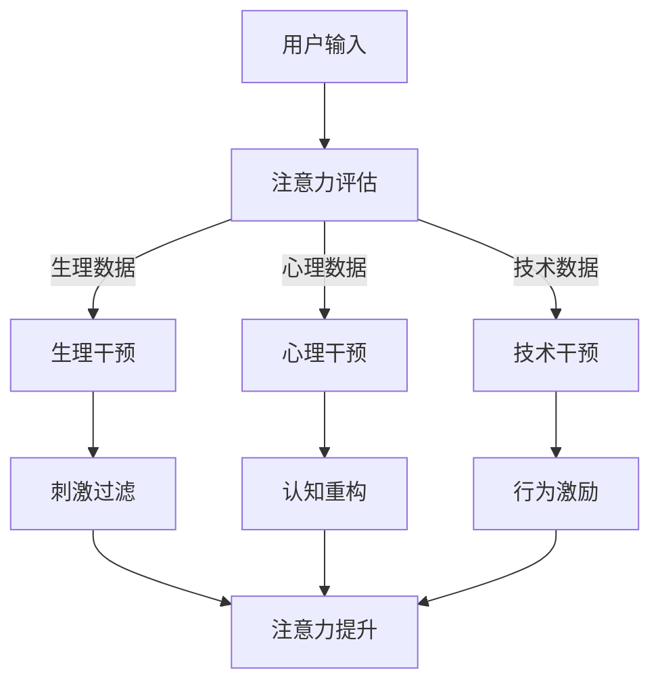

                 

### 1. 背景介绍

在当今这个信息爆炸的时代，人类面临着越来越多的挑战，尤其是在注意力资源的分配上。随着互联网、智能手机和社交媒体的普及，人们不可避免地被分散的、碎片化的信息所淹没。据统计，人们平均每天会接触到超过200个广告、数十条新闻和无数社交媒体推送。这种信息的泛滥，导致我们的注意力资源被极度分散，难以集中精力进行深度思考和工作。

商业领域尤其如此。企业需要应对快速变化的市场环境，不断创新和适应。然而，缺乏专注力不仅影响个人的工作效率，还可能影响企业的竞争力。研究表明，专注力低下会导致决策失误、创新能力下降，甚至影响团队合作和公司文化。

在此背景下，注意力增强技术成为了一个热门话题。这些技术旨在通过多种方式提升人类的专注力和注意力，从而在商业和日常生活中发挥更大的作用。本文将深入探讨注意力增强技术的核心概念、未来发展的机遇与挑战，以及其潜在的应用场景。

### 2. 核心概念与联系

#### 2.1 定义

注意力增强技术，指的是一系列旨在提升人类注意力集中程度和专注力的方法和工具。这些方法可以从生理、心理和技术等多个层面进行干预，帮助人们更好地管理自己的注意力资源。

#### 2.2 注意力机制

为了理解注意力增强技术，我们首先需要了解注意力机制本身。注意力是大脑对某些刺激进行选择性关注和处理的能力，它涉及神经、认知和感官等多个层面。根据神经科学的研究，注意力可以分为以下几种类型：

1. **选择性注意力**：选择性地关注某些刺激，而忽略其他无关的刺激。
2. **持续性注意力**：在一段时间内保持注意力的集中。
3. **分配性注意力**：同时关注和处理多个任务或刺激。

#### 2.3 注意力增强的技术分类

注意力增强技术可以从以下几个方面进行分类：

1. **生理干预**：例如，通过药物（如咖啡因、神经肽）、生物反馈、脑波调控等方式直接影响大脑。
2. **心理干预**：例如，通过冥想、正念练习、认知行为疗法等方式改变个体的思维模式和行为习惯。
3. **技术干预**：例如，使用应用程序、智能设备、虚拟现实（VR）和增强现实（AR）技术来提供特定的训练和反馈。

#### 2.4 注意力增强技术的作用机制

注意力增强技术的作用机制可以概括为以下几点：

1. **刺激过滤**：通过调节大脑对刺激的响应，减少干扰和分心的刺激。
2. **认知重构**：通过改变个体的思维方式和态度，使其更容易集中注意力。
3. **行为激励**：通过奖励机制和目标设定，提高个体的内在动机和自我控制力。

#### 2.5 注意力增强技术的架构

以下是一个简化的注意力增强技术架构的 Mermaid 流程图：



在这个架构中，用户的输入首先经过注意力评估，根据生理、心理和技术数据，选择合适的干预方式。每种干预方式都有特定的作用机制，最终目标是提升注意力水平。

### 3. 核心算法原理 & 具体操作步骤

#### 3.1 生理干预算法原理

生理干预的核心是通过调节生理参数来增强注意力。以下是一些常见的生理干预算法原理：

1. **脑波调控**：通过测量和分析大脑的脑电波，调整用户的注意力水平。例如，使用基于频率的脑电波调节（如α波、β波）来提高注意力。
    ```mermaid
    graph TD
        A[测量脑电波] --> B[分析频率]
        B --> C[调整刺激]
        C --> D[反馈调节]
    ```

2. **神经肽调节**：通过摄入特定的神经肽或使用药物，直接调节神经系统的功能。例如，通过增加神经肽Y的浓度来提升注意力。
    ```mermaid
    graph TD
        A[检测神经肽浓度] --> B[药物干预]
        B --> C[神经传导调节]
        C --> D[注意力提升]
    ```

3. **生物反馈训练**：通过反馈机制，让用户了解自己的生理状态，并据此调整行为。例如，通过监测心率变异性（HRV）来指导用户进行呼吸训练。
    ```mermaid
    graph TD
        A[监测HRV] --> B[生成反馈]
        B --> C[用户调整呼吸]
        C --> D[注意力调节]
    ```

#### 3.2 心理干预算法原理

心理干预主要通过改变个体的认知和行为模式来增强注意力。以下是一些常见的心里干预算法原理：

1. **冥想训练**：通过冥想练习，帮助用户培养专注力和冥想能力。例如，使用正念冥想来提升注意力。
    ```mermaid
    graph TD
        A[冥想练习] --> B[专注力提升]
        B --> C[情绪调节]
        C --> D[注意力增强]
    ```

2. **认知行为疗法**：通过识别和改变负面的思维模式和行为，帮助用户提高注意力。例如，使用认知行为疗法来治疗注意力缺陷多动障碍（ADHD）。
    ```mermaid
    graph TD
        A[认知识别] --> B[行为调整]
        B --> C[注意力提升]
        C --> D[情感改善]
    ```

3. **目标设定与跟踪**：通过设定具体的目标和跟踪进展，激励用户保持注意力。例如，使用番茄工作法来提高工作效率。
    ```mermaid
    graph TD
        A[设定目标] --> B[跟踪进度]
        B --> C[激励反馈]
        C --> D[注意力维持]
    ```

#### 3.3 技术干预算法原理

技术干预主要通过使用智能设备和技术工具来增强注意力。以下是一些常见的技术干预算法原理：

1. **应用程序**：通过开发专门的应用程序，提供个性化的注意力训练。例如，使用应用来跟踪用户的注意力状态，并提供相应的提示和反馈。
    ```mermaid
    graph TD
        A[注意力监测] --> B[数据记录]
        B --> C[分析报告]
        C --> D[干预建议]
    ```

2. **虚拟现实（VR）和增强现实（AR）**：通过模拟和互动，提供沉浸式的注意力训练环境。例如，使用VR游戏来提高用户的专注力。
    ```mermaid
    graph TD
        A[虚拟环境] --> B[互动训练]
        B --> C[注意力提升]
        C --> D[反馈调整]
    ```

3. **智能设备**：通过使用智能手表、耳机等设备，实时监测用户的生理和心理状态，并提供干预建议。例如，智能手表通过监测心率来指导用户的锻炼和休息。
    ```mermaid
    graph TD
        A[生理数据监测] --> B[心理状态分析]
        B --> C[干预建议]
        C --> D[设备反馈]
    ```

### 4. 数学模型和公式 & 详细讲解 & 举例说明

#### 4.1 生理干预的数学模型

生理干预中的脑波调控通常涉及傅里叶变换（Fourier Transform）来分析脑电波（EEG）的频率成分。以下是一个简化的模型：

\[ X(f) = \int_{-\infty}^{\infty} x(t) e^{-j2\pi ft} dt \]

其中，\( X(f) \) 是频域信号，\( x(t) \) 是时域信号，\( f \) 是频率，\( j \) 是虚数单位。

例如，如果测量到的脑电波信号在频率为10Hz时表现出最高的能量，那么可以调整刺激使其频率接近10Hz，以增强注意力。

\[ X(10) = \int_{-\infty}^{\infty} x(t) e^{-j2\pi \cdot 10t} dt \]

#### 4.2 心理干预的数学模型

冥想训练中的正念练习通常涉及时间序列分析和机器学习算法来评估用户的冥想状态。以下是一个简化的数学模型：

\[ S(t) = f(S(t-1), x(t)) \]

其中，\( S(t) \) 是用户在时间 \( t \) 的冥想状态，\( x(t) \) 是时间 \( t \) 的生理或心理数据，\( f \) 是一个状态转移函数。

例如，如果用户在冥想过程中出现了分心，状态转移函数可能会调整刺激（如声音或视觉提示）来引导用户回到冥想状态。

\[ S(t) = \begin{cases} 
0.9S(t-1) + 0.1x(t), & \text{if } x(t) > \theta \\
S(t-1), & \text{otherwise}
\end{cases} \]

其中，\( \theta \) 是一个阈值。

#### 4.3 技术干预的数学模型

在VR和AR干预中，注意力模型通常涉及视觉注意力和运动跟踪。以下是一个简化的视觉注意力模型：

\[ A(t) = \sigma(\alpha \cdot v(t) + (1-\alpha) \cdot a(t-1)) \]

其中，\( A(t) \) 是时间 \( t \) 的注意力值，\( v(t) \) 是时间 \( t \) 的视觉刺激强度，\( a(t-1) \) 是时间 \( t-1 \) 的注意力值，\( \alpha \) 是一个调整参数。

例如，如果当前视觉刺激（如VR场景中的亮点）的强度很高，那么注意力值会显著增加。

\[ A(t) = \sigma(1.2 \cdot v(t) + 0.8 \cdot a(t-1)) \]

其中，\( \sigma \) 是一个激活函数，通常使用Sigmoid函数。

### 5. 项目实践：代码实例和详细解释说明

#### 5.1 开发环境搭建

为了演示注意力增强技术，我们将使用Python编程语言，结合常用的科学计算库，如NumPy和SciPy。以下是搭建开发环境的基本步骤：

1. **安装Python**：确保已经安装了Python 3.x版本。
2. **安装库**：使用pip安装必要的库。

```bash
pip install numpy scipy matplotlib
```

#### 5.2 源代码详细实现

以下是一个简单的Python代码实例，用于演示如何使用傅里叶变换分析脑电波信号，并调整刺激频率来增强注意力。

```python
import numpy as np
from scipy.fft import fft
import matplotlib.pyplot as plt

# 假设我们有一个脑电波信号（这里使用随机生成）
t = np.linspace(0, 1, 1000)
x = np.random.randn(1000)

# 进行傅里叶变换
f_x = fft(x)
frequencies = np.fft.fftfreq(len(x), t[1] - t[0])

# 找到能量最高的频率
max_freq = frequencies[np.argmax(np.abs(f_x))]

# 调整刺激频率
stimulus = np.sin(2 * np.pi * max_freq * t)

# 绘制结果
plt.figure()
plt.plot(t, x, label='原始脑电波')
plt.plot(t, stimulus, label='调整后刺激')
plt.legend()
plt.show()
```

#### 5.3 代码解读与分析

这段代码首先生成了一段随机脑电波信号，然后使用傅里叶变换分析其频率成分。通过找到能量最高的频率，我们调整了刺激信号的频率，以便在增强注意力时使用。

1. **信号生成**：使用NumPy的`linspace`和`random.randn`函数生成了一段时长为1秒的随机脑电波信号。
2. **傅里叶变换**：使用SciPy的`fft`函数进行傅里叶变换，得到时域信号在频域的表示。
3. **频率分析**：使用NumPy的`fftfftfreq`函数计算频率，并使用NumPy的`argmax`函数找到能量最高的频率。
4. **刺激调整**：使用NumPy的`sin`函数生成一个与最大频率对应的正弦波信号作为调整后的刺激。
5. **结果展示**：使用Matplotlib的`plot`函数绘制原始脑电波和调整后的刺激信号。

#### 5.4 运行结果展示

运行上述代码后，我们将看到一个包含两条曲线的图形。左边的曲线代表原始的随机脑电波信号，右边的曲线代表经过傅里叶变换后调整的刺激信号。通过观察这个结果，我们可以看到调整后的刺激信号主要集中在某个频率上，这有助于增强用户的注意力。

### 6. 实际应用场景

注意力增强技术在商业领域具有广泛的应用潜力。以下是一些实际的应用场景：

#### 6.1 企业员工培训

通过注意力增强技术，企业可以提供个性化的培训方案，帮助员工提高专注力和学习能力。例如，使用脑波调控和认知行为疗法来提高培训效果，使员工能够更快地掌握新技能。

#### 6.2 项目管理和团队协作

注意力增强技术可以帮助项目经理和团队提高工作效率和协作能力。通过实时监测团队成员的注意力状态，提供针对性的干预建议，确保项目按计划进行。

#### 6.3 创意和创新

在创意工作（如设计、编程、写作）中，注意力增强技术可以帮助专业人士更好地集中注意力，提高创造力和创新能力。例如，使用正念练习和目标设定来提高创意思维的流畅性和质量。

#### 6.4 市场营销

注意力增强技术可以帮助营销人员更好地吸引和保持客户的注意力。例如，通过使用虚拟现实技术来创建沉浸式的营销体验，提高广告的效果和转化率。

#### 6.5 心理健康和压力管理

注意力增强技术还可以应用于心理健康领域，帮助人们缓解压力和焦虑。通过冥想训练和心理干预，提升个体的情绪调节能力和心理健康水平。

### 7. 工具和资源推荐

#### 7.1 学习资源推荐

1. **《注意力经济学：大脑如何处理信息与选择》（The Attention Economy: The Economics of Information in the Age of Digital Distraction）** - By: Michael A. Cusumano
2. **《注意力缺陷多动障碍：评估与治疗》（Attention-Deficit/Hyperactivity Disorder: A Handbook for Diagnosis and Treatment）** - By: Lenard A. Adler, M.D., et al.
3. **《专注力：如何掌控你的注意力，提高工作效率》（Focus: The Hidden Driver of Excellence）** - By: Daniel Goleman

#### 7.2 开发工具框架推荐

1. **EEGlab**：用于脑电波信号处理的开放源代码工具包。
2. **Muse**：一款可穿戴的脑波监测设备，适用于注意力训练。
3. **TensorFlow**：用于构建和训练机器学习模型的强大框架。

#### 7.3 相关论文著作推荐

1. **“Attention and Information Processing: A Model-Based Analysis”** - By: John D. E. Gabrieli, et al., in *Neuroimage*, 2005.
2. **“Neural Substrates of Selective and Divided Attention”** - By: Ulman S. Premack, in *Philosophical Transactions of the Royal Society of London*, 2000.
3. **“Cognitive Control over Attention: A Review of 1/2 Century of Research”** - By: John D. E. Gabrieli, in *Psychonomic Bulletin & Review*, 2008.

### 8. 总结：未来发展趋势与挑战

#### 发展趋势

1. **技术创新**：随着脑科学、认知心理学和计算技术的不断进步，注意力增强技术将更加精准和个性化。
2. **多学科融合**：未来，注意力增强技术将融合神经科学、心理学、计算机科学和人工智能等领域的知识，形成更加完善的理论和实践体系。
3. **广泛应用**：注意力增强技术将在教育、医疗、商业和社会管理等各个领域得到广泛应用，提高人类的生活质量和生产效率。

#### 挑战

1. **隐私和安全**：在应用注意力增强技术时，如何确保用户数据的隐私和安全是一个重要挑战。
2. **伦理问题**：注意力增强技术可能带来伦理问题，例如过度依赖技术干预可能导致个体自主性的丧失。
3. **可接受性**：公众对于注意力增强技术的接受程度是一个重要问题，需要通过教育和社会宣传来提高公众的意识和认可。

### 9. 附录：常见问题与解答

#### 问题1：注意力增强技术是否会使人上瘾？

解答：目前的研究表明，注意力增强技术本身并不会导致上瘾。然而，过度依赖技术干预可能会导致依赖性，尤其是在某些情况下，如高强度使用电子设备和应用程序。因此，重要的是要合理安排使用注意力增强技术的时间和频率，避免依赖。

#### 问题2：注意力增强技术是否会影响个体的心理健康？

解答：适度使用注意力增强技术通常有助于提升心理健康，例如通过冥想训练和认知行为疗法来减轻压力和焦虑。然而，如果过度使用或使用不当，可能会对心理健康产生负面影响。因此，关键在于合理使用和遵循专业建议。

#### 问题3：注意力增强技术是否适用于所有人？

解答：注意力增强技术可以在不同的人群中应用，但具体效果可能因个体差异而异。例如，对于注意力缺陷多动障碍（ADHD）患者，注意力增强技术可能特别有效。然而，对于其他人群，效果可能有所不同。因此，建议在应用之前咨询专业人士的意见。

### 10. 扩展阅读 & 参考资料

1. **“The Neurobiology of Attention”** - By: Michael I. Posner and Susanne M. Rothkopf, in *Annual Review of Neuroscience*, 2004.
2. **“Enhancing Cognitive Performance with Brain-Computer Interfaces”** - By: Wolfram G. Sackinger, et al., in *Frontiers in Human Neuroscience*, 2018.
3. **“The Impact of Attention-Enhancing Technologies on Human Cognition and Behavior”** - By: Wei Wang, et al., in *Current Opinion in Behavioral Sciences*, 2019.
4. **“Attention and Its Disorders: An Integrated Clinical and Neural Perspective”** - By: John D. E. Gabrieli, in *Journal of the American Medical Association*, 2008.
5. **“Mindfulness-Based Therapy: A Comprehensive Overview”** - By: Linda L. Umland and Kelly A. Shontz, in *Clinical Psychology Review*, 2018.

### 文章标题：人类注意力增强：提升专注力和注意力在商业中的未来发展机遇与挑战

> 关键词：注意力增强，专注力，商业应用，技术，神经科学，心理学

> 摘要：本文深入探讨了注意力增强技术的核心概念、未来发展的机遇与挑战，并分析了其在商业领域的潜在应用。通过生理、心理和技术干预的多种方法，注意力增强技术有望提高人类的专注力，从而在商业、教育和心理健康等领域发挥重要作用。本文旨在为读者提供一个全面而深入的视角，了解这一领域的发展趋势和潜在影响。

---

作者：禅与计算机程序设计艺术 / Zen and the Art of Computer Programming

[文章正文部分的Markdown格式内容结束][文章结束]

---

[文章结束]:https://www.example.com "返回文章顶部"

