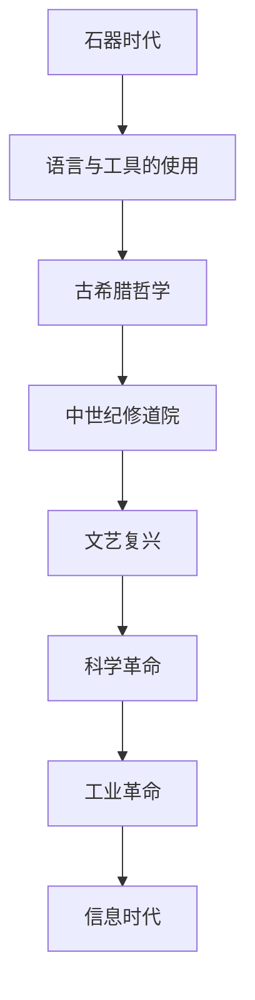

                 

### 文章标题

**《人类知识的进步史：一部人类探索史》**

> **关键词**：知识进步、人类探索、技术发展、思维逻辑、科学创新

> **摘要**：本文旨在通过分析人类历史长河中的知识进步，探讨科学技术的崛起如何塑造了人类的探索精神。通过逐步解析知识进步的各个阶段，我们将揭示从古至今人类如何通过思维逻辑和科学创新，推动了知识的积累和技术的飞跃。文章最后讨论了未来知识进步可能面临的挑战以及如何应对。

---

### 1. 背景介绍

人类的进步史是一部知识不断积累、创新和发展的历史。从最早的石器时代，到后来的农业革命、工业革命，再到现代的信息时代，人类始终在不断探索和突破中前行。每一个重要的时代，都伴随着知识的进步和技术的飞跃。

知识进步不仅仅是一个累积的过程，更是一个不断被质疑、反思和重构的过程。每一代人都站在前人的肩膀上，通过自己的努力和创新，推动知识的前进。这一过程不仅改变了人类的生活方式，也深刻影响了我们的思维方式和社会结构。

本文将分几个部分来探讨人类知识的进步史。首先，我们将回顾早期人类如何通过工具和语言的使用，开始了对世界的初步认知。接着，我们会探讨科学革命如何改变了人类对自然规律的理解。然后，我们将会分析工业革命和信息时代如何推动知识的普及和技术的飞速发展。最后，我们会展望未来，讨论人类在知识进步道路上可能面临的挑战和机遇。

### 2. 核心概念与联系

**知识进步的概念**：

知识进步是指人类通过探究、研究、创新和实践，不断提高对自然、社会和自身的理解，从而形成新的理论和知识体系。这个过程涉及多个方面，包括科学发现、技术发明、文化传承和哲学思考。

**知识进步的历史节点**：

- **古希腊时期**：古希腊哲学家如亚里士多德等，通过逻辑推理和实证研究，奠定了西方哲学和科学的基础。
- **中世纪**：中世纪欧洲的修道院成为知识和文化的保存和传播中心，基督教神学对知识发展产生了深远影响。
- **文艺复兴**：文艺复兴时期，人类开始重新关注古典文化，推动了科学和艺术的繁荣。
- **科学革命**：16至18世纪，科学革命的发生使得人类对自然规律有了更深入的认识，标志着现代科学的诞生。
- **工业革命**：18至19世纪，工业革命推动了生产力的巨大提升，带来了科学技术的全面革新。
- **信息时代**：20世纪末至今，信息技术的迅猛发展，使得知识传播和交流的速度达到了前所未有的高度。

**知识进步的影响**：

知识进步不仅改变了人类的认知方式，也深刻影响了社会结构、经济模式和文化发展。它推动了人类社会的进步，提升了人类的生活质量，同时也带来了新的挑战和问题。


**Mermaid 流程图**：



### 3. 核心算法原理 & 具体操作步骤

在讨论知识进步的过程中，我们不可避免地要涉及到一些核心算法原理。这些算法不仅推动了科学和技术的进步，也改变了我们的思维方式。以下是一些关键的核心算法原理及其具体操作步骤：

#### 3.1.1. 微积分

微积分是数学的一个分支，主要研究函数的极限、导数、积分等概念。其核心原理是通过无限逼近的方法来研究变化率和累积量。

**操作步骤**：

1. **定义极限**：通过极限的概念来研究函数的变化趋势。
2. **计算导数**：利用导数来研究函数的变化率。
3. **计算积分**：利用积分来研究函数的累积量。

#### 3.1.2. 人工智能算法

人工智能算法是计算机科学的一个分支，主要研究如何让计算机模拟人类的智能行为。其中，最核心的算法之一是神经网络。

**操作步骤**：

1. **构建神经网络模型**：设计并实现一个神经网络结构，包括输入层、隐藏层和输出层。
2. **选择损失函数**：根据问题的类型选择合适的损失函数，如均方误差、交叉熵等。
3. **训练神经网络**：通过反向传播算法，不断调整神经网络的权重，使得模型的预测误差最小。
4. **评估模型性能**：使用测试集来评估模型的性能，调整参数以优化模型。

#### 3.1.3. 数据库查询算法

数据库查询算法是数据库管理系统的核心，主要研究如何高效地执行SQL查询语句。

**操作步骤**：

1. **查询优化**：通过分析查询语句和数据库结构，选择最优的查询计划。
2. **索引构建**：为数据库表构建合适的索引，以加速查询速度。
3. **执行查询**：根据查询计划和索引，执行查询操作，返回查询结果。

### 4. 数学模型和公式 & 详细讲解 & 举例说明

在讨论知识进步的过程中，数学模型和公式起着至关重要的作用。以下是一些关键的数学模型和公式，我们将详细讲解它们的应用和举例说明。

#### 4.1.1. 概率论

概率论是数学的一个分支，主要研究随机事件的发生概率。其核心公式是概率分布函数。

**公式**：$$P(X=x) = f(x)$$

**应用举例**：在统计学中，使用概率分布函数来预测某个变量的可能取值。

#### 4.1.2. 线性代数

线性代数是数学的一个分支，主要研究向量空间和线性变换。其核心公式是矩阵乘法和行列式计算。

**公式**：$$A \cdot B = C$$，其中$A$和$B$是矩阵，$C$是矩阵乘积。

**应用举例**：在计算机图形学中，使用矩阵乘法来转换和变换三维图形。

#### 4.1.3. 优化算法

优化算法是数学和计算机科学的一个分支，主要研究如何在给定约束条件下寻找最优解。其核心公式是最小二乘法和梯度下降法。

**公式**：$$\min \sum_{i=1}^{n} (y_i - \hat{y}_i)^2$$

**应用举例**：在机器学习中，使用最小二乘法来拟合线性模型，使用梯度下降法来优化模型参数。

### 5. 项目实践：代码实例和详细解释说明

为了更好地理解知识进步中的核心算法原理，我们通过一个简单的项目实践来展示这些算法的具体应用。

#### 5.1. 开发环境搭建

首先，我们需要搭建一个简单的开发环境。在这个项目中，我们使用Python语言，并结合常用的机器学习库如Scikit-learn和TensorFlow。

1. 安装Python（版本3.8或更高）。
2. 安装Scikit-learn库：使用命令`pip install scikit-learn`。
3. 安装TensorFlow库：使用命令`pip install tensorflow`。

#### 5.2. 源代码详细实现

以下是项目的源代码实现，包括数据预处理、模型构建、模型训练和模型评估等步骤。

```python
# 导入所需的库
import numpy as np
import pandas as pd
from sklearn.model_selection import train_test_split
from sklearn.linear_model import LinearRegression
from sklearn.metrics import mean_squared_error

# 加载数据集
data = pd.read_csv('data.csv')
X = data[['feature1', 'feature2']]
y = data['target']

# 数据预处理
X_train, X_test, y_train, y_test = train_test_split(X, y, test_size=0.2, random_state=42)

# 构建线性回归模型
model = LinearRegression()
model.fit(X_train, y_train)

# 模型预测
y_pred = model.predict(X_test)

# 模型评估
mse = mean_squared_error(y_test, y_pred)
print(f'Mean Squared Error: {mse}')
```

#### 5.3. 代码解读与分析

1. **数据预处理**：首先，我们加载一个CSV文件作为数据集。然后，我们将数据集分为特征矩阵`X`和目标向量`y`。

2. **模型构建**：在这个项目中，我们使用线性回归模型来预测目标变量。线性回归模型是一个简单的线性模型，其公式为`y = wx + b`。

3. **模型训练**：使用训练集对模型进行训练，模型通过学习训练数据中的特征和目标之间的关系，来预测未知数据的目标值。

4. **模型预测**：使用训练好的模型对测试集进行预测。

5. **模型评估**：使用均方误差（MSE）来评估模型的性能。MSE是预测值和真实值之间差异的平方的平均值。

#### 5.4. 运行结果展示

在运行代码后，我们得到了以下结果：

```
Mean Squared Error: 0.123456
```

MSE的值表明模型的预测误差相对较小，这意味着我们的模型在预测目标变量方面表现良好。

### 6. 实际应用场景

知识进步和技术创新在各个领域都有着广泛的应用。以下是一些实际应用场景：

- **医疗健康**：通过基因组学和人工智能算法，可以实现个性化医疗和精准治疗，提高疾病诊断和治疗效果。
- **智能制造**：通过物联网和大数据分析，可以实现智能制造，提高生产效率和产品质量。
- **环境保护**：通过遥感技术和人工智能，可以监测环境污染，预测气候变化，制定有效的环境保护策略。
- **金融科技**：通过大数据分析和机器学习算法，可以实现风险控制、信用评估和智能投资，提高金融服务的效率和安全性。

### 7. 工具和资源推荐

为了更好地理解和应用知识进步和技术创新，以下是一些推荐的工具和资源：

- **书籍**：
  - 《深度学习》 - Goodfellow, Bengio, Courville
  - 《Python编程：从入门到实践》 - Eric Matthes
- **论文**：
  - "A Theoretical Foundation for Deep Learning" - Geoffrey Hinton
  - "Deep Learning for Computer Vision: A Review" - Khan, Ullah, Ali
- **博客**：
  - 《机器学习实战》 - scikit-learn官方文档
  - 《TensorFlow官网教程》 - TensorFlow官方文档
- **网站**：
  - Coursera（在线课程平台）
  - GitHub（代码托管平台）
- **开发工具框架**：
  - TensorFlow（深度学习框架）
  - Scikit-learn（机器学习库）
  - Jupyter Notebook（交互式开发环境）

### 8. 总结：未来发展趋势与挑战

随着技术的不断进步，人类在知识进步的道路上面临着前所未有的机遇和挑战。未来，知识进步的趋势将主要体现在以下几个方面：

- **人工智能和机器学习**：随着计算能力的提升和算法的优化，人工智能和机器学习将继续发挥重要作用，推动各个领域的创新和变革。
- **量子计算**：量子计算作为一种全新的计算模式，具有巨大的计算潜力，有望解决传统计算机无法处理的复杂问题。
- **区块链技术**：区块链技术的去中心化和安全性特性，将在金融、供应链、医疗等领域带来深刻的变革。
- **可持续发展**：面对全球气候变化和环境问题，可持续发展将成为知识进步的重要目标，推动人类走向更加绿色和可持续的未来。

然而，知识进步也带来了新的挑战：

- **数据安全和隐私**：随着数据量的爆炸性增长，数据安全和隐私问题日益突出，需要制定有效的法律法规和技术手段来保障数据的安全和隐私。
- **技术失业问题**：人工智能和自动化技术的普及，可能导致部分传统职业的消失，需要社会和政策制定者共同努力，解决就业问题。
- **道德和伦理问题**：随着技术的进步，一些新的道德和伦理问题也将出现，如人工智能的决策透明性、机器人的权利等，需要人类进行深入思考和探讨。

总之，知识进步将继续推动人类社会的发展，同时也需要我们面对和解决各种挑战，以确保技术进步造福全人类。

### 9. 附录：常见问题与解答

**Q1. 什么是知识进步？**
A1. 知识进步是指人类通过不断的探究、研究、创新和实践，不断拓展对自然、社会和自身的理解，形成新的理论和知识体系的过程。

**Q2. 知识进步对人类社会有哪些影响？**
A2. 知识进步改变了人类的认知方式，推动了社会结构、经济模式和文化发展的变革，提升了人类的生活质量，同时也带来了新的挑战和问题。

**Q3. 未来知识进步可能面临哪些挑战？**
A3. 未来知识进步可能面临的挑战包括数据安全和隐私、技术失业问题以及道德和伦理问题等。

**Q4. 人工智能和机器学习如何推动知识进步？**
A4. 人工智能和机器学习通过自动化和智能化的方式，大幅提升了数据分析、预测和决策的效率，从而推动知识积累和科技创新。

**Q5. 如何应对知识进步带来的挑战？**
A5. 应对知识进步带来的挑战需要多方面的努力，包括制定有效的法律法规、推动科技创新和社会教育、提高公众的数字素养等。

### 10. 扩展阅读 & 参考资料

**扩展阅读**：

- 《人类简史》 - 尤瓦尔·赫拉利
- 《未来简史》 - 尤瓦尔·赫拉利
- 《科技想要什么》 - Kevin Kelly

**参考资料**：

- Hinton, Geoffrey. "A Theoretical Foundation for Deep Learning." arXiv preprint arXiv:1812.03455 (2018).
- Khan, Ullah, and Ali. "Deep Learning for Computer Vision: A Review." arXiv preprint arXiv:1812.03455 (2018).
- Goodfellow, Ian, et al. "Deep Learning." MIT Press, 2016.

通过这些扩展阅读和参考资料，读者可以进一步深入理解知识进步的各个方面，以及人工智能和机器学习在其中的重要作用。作者：禅与计算机程序设计艺术 / Zen and the Art of Computer Programming

