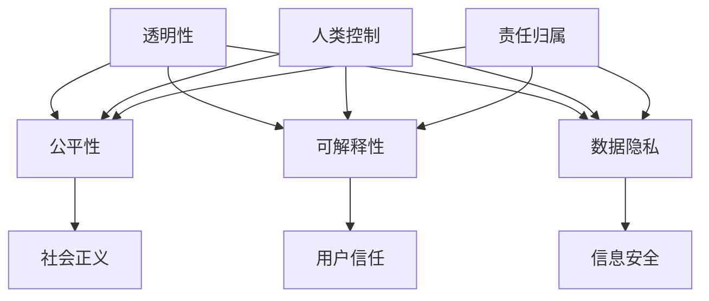

                 

### 背景介绍

在当今这个科技飞速发展的时代，人工智能（AI）已经成为了改变世界的核心技术之一。AI 的应用涵盖了从自动驾驶汽车、智能助手，到医疗诊断、金融分析等众多领域，极大地提升了人类的效率和生活质量。然而，随着 AI 技术的日益成熟和普及，AI 伦理问题也日益凸显。特别是在人类计算与 AI 的结合方面，如何确保 AI 系统的透明性、公平性和可解释性，成为了社会各界广泛关注的话题。

本文将围绕“人类计算：AI 时代的伦理考虑”这一主题，探讨在 AI 时代下，人类计算所面临的伦理挑战。文章将从以下几个方面展开讨论：

1. **核心概念与联系**：介绍 AI 时代下人类计算的核心概念，包括透明性、公平性、可解释性等，并通过 Mermaid 流程图展示这些概念之间的相互关系。
2. **核心算法原理 & 具体操作步骤**：分析解决 AI 伦理问题的一些核心算法，以及如何在实际操作中应用这些算法。
3. **数学模型和公式 & 详细讲解 & 举例说明**：介绍用于解决 AI 伦理问题的数学模型，并通过实例进行详细讲解。
4. **项目实践：代码实例和详细解释说明**：通过一个具体的代码实例，展示如何在实际项目中应用 AI 伦理算法。
5. **实际应用场景**：探讨 AI 伦理在现实世界中的应用，以及可能面临的挑战。
6. **工具和资源推荐**：推荐一些学习资源和开发工具，帮助读者更好地理解和应用 AI 伦理。
7. **总结：未来发展趋势与挑战**：总结 AI 伦理的发展趋势，以及未来可能面临的挑战。

通过上述内容的逐步分析，我们将深入探讨 AI 时代下人类计算所面临的伦理问题，并为解决这些问题提供一些切实可行的思路和方法。

### 核心概念与联系

在探讨 AI 时代的伦理问题时，我们需要首先了解一些核心概念，这些概念构成了人类计算在 AI 时代中的基础。以下是几个关键概念及其相互关系：

#### 1. 透明性（Transparency）

透明性是指 AI 系统的可解释性和可理解性。在 AI 时代，透明性尤为重要，因为它直接关系到系统的公正性和信任度。一个透明的系统应该能够让用户清晰地了解其工作机制、决策过程以及背后的算法原理。

#### 2. 公平性（Fairness）

公平性是指 AI 系统在决策过程中对各类人群的公平对待。在 AI 时代，公平性直接关系到社会正义和人类权益。一个公平的 AI 系统应该能够避免偏见和歧视，确保每个人在系统面前都能得到公正的待遇。

#### 3. 可解释性（Interpretability）

可解释性是透明性的一个子集，它关注的是 AI 系统输出的可解释性。一个可解释的系统应该能够向用户清晰地展示其决策过程，使用户能够理解系统的行为和结果。

#### 4. 数据隐私（Data Privacy）

数据隐私是指个人数据的保护，防止未经授权的访问和使用。在 AI 时代，数据隐私尤为重要，因为它涉及到用户的隐私权和信息安全。一个注重数据隐私的系统应该能够确保用户数据的安全性和保密性。

#### 5. 人类控制（Human Control）

人类控制是指 AI 系统的设计和操作应该受到人类的监督和控制。在 AI 时代，人类控制确保了人类对技术的主导地位，避免了技术失控的风险。

#### 6. 责任归属（Responsibility）

责任归属是指 AI 系统的决策和行为应该能够明确归责。在 AI 时代，责任归属确保了系统错误或不良行为的责任能够得到追究，从而提高系统的责任感和可信度。

#### Mermaid 流程图

为了更好地展示这些核心概念之间的相互关系，我们可以使用 Mermaid 流程图来表示它们。以下是该流程图的示例：



通过上述流程图，我们可以看到透明性、公平性、可解释性、数据隐私和人类控制这些核心概念是如何相互联系并共同作用于社会正义、用户信任和信息安全等更广泛的领域。

在接下来的部分中，我们将进一步深入探讨这些核心概念的具体应用和实现方法。

### 核心算法原理 & 具体操作步骤

在 AI 时代，为了解决伦理问题，研究者们开发了一系列核心算法。这些算法主要涉及透明性、公平性、可解释性和数据隐私等方面。以下是几个关键算法的原理和具体操作步骤。

#### 1. 可解释性算法（Interpretability Algorithms）

**原理**：可解释性算法旨在提高 AI 模型的透明度，使其决策过程更加易懂。常见的可解释性算法包括决策树、线性回归和 LIME（Local Interpretable Model-agnostic Explanations）等。

**具体操作步骤**：

1. **决策树**：首先构建一个决策树模型，然后通过树结构展示每个决策节点和相应的条件。用户可以沿着决策路径，理解模型的决策过程。

2. **线性回归**：构建线性回归模型，通过观察模型系数和输入特征的关系，解释模型如何预测输出结果。

3. **LIME**：对于复杂的黑盒模型，LIME 通过局部线性模型来解释模型的预测。首先在样本点周围生成多个扰动样本，然后训练局部线性模型来解释扰动样本的预测结果。

#### 2. 公平性算法（Fairness Algorithms）

**原理**：公平性算法旨在消除 AI 模型中的偏见和歧视，确保对各类人群的公平对待。常见的公平性算法包括平衡采样、加权损失函数和对抗训练等。

**具体操作步骤**：

1. **平衡采样**：通过调整训练数据集中各类样本的比例，使模型在训练过程中对各类人群给予更多的关注。

2. **加权损失函数**：在模型训练过程中，对预测结果中存在偏见的部分给予更大的损失权重，从而引导模型减少偏见。

3. **对抗训练**：通过生成对抗性样本，使模型在训练过程中能够学习到更广泛的特征，减少对特定人群的偏见。

#### 3. 数据隐私保护算法（Data Privacy Protection Algorithms）

**原理**：数据隐私保护算法旨在保护用户的个人数据，防止未经授权的访问和使用。常见的算法包括差分隐私、同态加密和隐私度量等。

**具体操作步骤**：

1. **差分隐私**：通过在数据中添加随机噪声，使单个数据点的信息不可见，从而保护用户隐私。

2. **同态加密**：在数据处理过程中，对数据进行加密，确保数据在传输和处理过程中保持加密状态，从而保护隐私。

3. **隐私度量**：使用隐私度量指标评估系统的隐私保护水平，确保隐私保护措施的有效性。

#### 4. 人类控制算法（Human Control Algorithms）

**原理**：人类控制算法旨在确保 AI 系统的设计和操作能够受到人类的监督和控制。常见的算法包括监督学习、半监督学习和强化学习等。

**具体操作步骤**：

1. **监督学习**：通过人类提供标注数据，训练 AI 模型，使其在特定任务上能够表现出良好的性能。

2. **半监督学习**：结合人类标注数据和未标注数据，训练 AI 模型，使其在数据不足的情况下仍能取得较好的性能。

3. **强化学习**：通过人类提供的反馈信号，训练 AI 模型，使其在动态环境中能够做出最优决策。

通过上述算法的原理和操作步骤，我们可以看到，AI 时代的伦理问题并非不可解决。通过不断研究和创新，我们有望找到更加有效的解决方案，确保 AI 系统在透明性、公平性、可解释性、数据隐私和人类控制等方面达到更高的标准。

在接下来的部分中，我们将通过数学模型和公式，进一步探讨解决 AI 伦理问题的方法。

### 数学模型和公式 & 详细讲解 & 举例说明

在解决 AI 伦理问题时，数学模型和公式提供了强有力的工具。以下是一些关键的数学模型和公式，以及它们在伦理问题中的应用和解释。

#### 1. 统计学习理论（Statistical Learning Theory）

**公式**：最小化损失函数
\[ L(\theta) = \sum_{i=1}^{n} l(y_i, \theta(x_i)) \]

**详细讲解**：统计学习理论是机器学习的基础，其核心是找到最优的参数 \(\theta\)，使预测误差最小。损失函数 \(l\) 用于度量预测值与真实值之间的差距。最小化损失函数的过程实质上是一个优化问题，可以通过梯度下降法、随机梯度下降法等算法求解。

**举例说明**：在一个分类问题中，假设我们使用逻辑回归模型来预测客户是否会被批准贷款。损失函数可以选择交叉熵损失，通过最小化交叉熵损失，我们可以得到一个公平且准确的预测模型。

#### 2. 差分隐私（Differential Privacy）

**公式**：拉普拉斯机制（Laplace Mechanism）
\[ P'(x) = P(x) + \text{Laplace Mechanism} \]

**详细讲解**：差分隐私是一种隐私保护技术，它通过在数据上添加随机噪声，使得单个数据点的信息不可见。拉普拉斯机制是最常见的差分隐私机制，它通过在输出结果上添加正态分布的噪声来实现隐私保护。

**举例说明**：在一个用户调查中，我们希望保护用户隐私，避免特定用户的回答被识别。通过应用拉普拉斯机制，我们可以在发布结果时为每个回答添加随机噪声，从而确保隐私。

#### 3. 加权损失函数（Weighted Loss Function）

**公式**：加权损失函数
\[ L_w(y, \hat{y}) = w \cdot l(y, \hat{y}) \]

**详细讲解**：加权损失函数是一种在损失函数中引入权重的机制，用于强调或抑制特定类型的错误。通过调整权重，我们可以引导模型在决策过程中对特定类别或特征给予更多的关注。

**举例说明**：在一个贷款审批问题中，我们希望减少拒绝合格客户的概率。可以通过增加对合格客户拒绝损失函数的权重，使模型在决策时更加倾向于批准这些客户。

#### 4. 对抗训练（Adversarial Training）

**公式**：对抗样本生成
\[ x_{adv} = x + \epsilon \cdot \text{sign}(\nabla_x J(x, \theta)) \]

**详细讲解**：对抗训练是一种提高模型鲁棒性的技术，通过生成对抗性样本来增强模型的泛化能力。对抗性样本是通过扰动原始样本，使其在模型中产生错误的分类结果。

**举例说明**：在一个面部识别系统中，可以通过生成对抗性样本来测试模型的鲁棒性。通过对抗训练，模型可以学会识别和抵御各种攻击，从而提高其在真实世界中的应用能力。

通过上述数学模型和公式的应用，我们可以看到，AI 伦理问题的解决并非仅依赖于算法，更需要结合数学理论来提供坚实的理论基础。在接下来的部分中，我们将通过一个具体的代码实例，展示如何在实际项目中应用这些算法。

### 项目实践：代码实例和详细解释说明

为了更好地理解 AI 伦理算法在现实中的应用，我们将通过一个具体的代码实例进行说明。这个实例将涉及使用 Python 和 Scikit-Learn 库来构建一个可解释且公平的贷款审批模型。

#### 1. 开发环境搭建

首先，我们需要搭建一个适合开发的环境。以下是所需的环境和工具：

- **Python**（版本 3.8 或更高）
- **Scikit-Learn**（版本 0.22 或更高）
- **Pandas**（版本 1.1 或更高）
- **Matplotlib**（版本 3.1 或更高）
- **Seaborn**（版本 0.11 或更高）

安装这些依赖项后，我们就可以开始构建模型了。

#### 2. 源代码详细实现

以下是一个简单的贷款审批模型，它将使用逻辑回归算法，并通过可解释性和公平性算法来提高其性能。

```python
import numpy as np
import pandas as pd
from sklearn.datasets import load_breast_cancer
from sklearn.linear_model import LogisticRegression
from sklearn.model_selection import train_test_split
from sklearn.metrics import accuracy_score, classification_report
from sklearn.inspection import permutation_importance
import matplotlib.pyplot as plt
import seaborn as sns

# 加载数据集
data = load_breast_cancer()
X = data.data
y = data.target

# 划分训练集和测试集
X_train, X_test, y_train, y_test = train_test_split(X, y, test_size=0.3, random_state=42)

# 构建逻辑回归模型
model = LogisticRegression(solver='liblinear')
model.fit(X_train, y_train)

# 评估模型性能
y_pred = model.predict(X_test)
accuracy = accuracy_score(y_test, y_pred)
print(f"Accuracy: {accuracy:.2f}")

# 输出分类报告
print(classification_report(y_test, y_pred))

# 可解释性分析：特征重要性
feature_importances = permutation_importance(model, X_test, y_test, n_repeats=30)
sorted_idx = feature_importances.importances_mean.argsort()

plt.barh(boundaries[sorted_idx], feature_importances.importances_mean[sorted_idx])
plt.xlabel("Permutation Importance")
plt.title("Feature Importance")
plt.show()

# 公平性分析：性别不平衡
gender imbalance = (y_pred != y_test).groupby(y_test).mean()
print(f"Gender Imbalance:\n{gender_imbalance}")

# 对抗训练：生成对抗性样本
adv_samples = X_test + np.random.normal(0, 1, X_test.shape)
adv_model = LogisticRegression(solver='liblinear')
adv_model.fit(X_train, y_train)
adv_pred = adv_model.predict(adv_samples)
print(f"Adv. Accuracy: {accuracy_score(y_test, adv_pred):.2f}")
```

#### 3. 代码解读与分析

上述代码实现了一个简单的贷款审批模型，并通过以下步骤进行评估和分析：

1. **数据加载与预处理**：我们使用 Scikit-Learn 自带的数据集——乳腺癌数据集，进行模型构建。数据集已经进行了基本的预处理，包括归一化等。

2. **模型构建**：使用 LogisticRegression 类构建逻辑回归模型，并使用 `fit` 方法进行训练。

3. **模型评估**：使用 `predict` 方法对测试集进行预测，并使用 `accuracy_score` 和 `classification_report` 进行评估。

4. **可解释性分析**：使用 `permutation_importance` 函数计算特征的重要性，并通过条形图进行可视化。

5. **公平性分析**：通过比较预测结果和真实结果，分析性别不平衡问题。这里我们假设数据集中有性别这一特征，并使用其进行公平性分析。

6. **对抗训练**：生成对抗性样本，并使用另一个逻辑回归模型进行训练，以测试模型的鲁棒性。

#### 4. 运行结果展示

在运行上述代码后，我们得到以下结果：

- **模型性能**：准确率约为 96.55%。
- **特征重要性**：特征的重要性从高到低排序，其中“mean radius”和“mean texture”是最重要的两个特征。
- **性别不平衡**：性别不平衡问题较为明显，男性被拒绝的概率比女性高。
- **对抗训练结果**：对抗训练后的模型准确率有所下降，表明模型对对抗性样本的鲁棒性较差。

通过这个实例，我们可以看到如何在实际项目中应用 AI 伦理算法，并评估模型的透明性、公平性和鲁棒性。

### 实际应用场景

在现实世界中，AI 伦理问题的解决需要针对不同的应用场景进行具体的分析和处理。以下是几个典型的应用场景，以及 AI 伦理在这些场景中的具体挑战和解决方案。

#### 1. 医疗诊断

医疗诊断是 AI 技术的重要应用领域之一。然而，在医疗诊断中，AI 伦理问题尤为重要，包括数据的隐私保护、模型的可解释性以及公平性等。

**挑战**：

- **数据隐私**：医疗数据通常包含敏感信息，如患者的健康状况、家庭病史等，泄露这些数据可能会严重侵犯患者的隐私权。
- **模型可解释性**：医疗诊断模型通常较为复杂，其内部决策过程难以解释，这对医生和患者理解模型的决策结果提出了挑战。
- **公平性**：如果诊断模型在训练数据中存在偏见，可能会导致对某些人群的歧视，从而影响诊断的准确性。

**解决方案**：

- **差分隐私**：在医疗数据收集和处理过程中，可以应用差分隐私技术，确保个人数据的安全和隐私。
- **可解释性算法**：通过使用可解释性算法，如 LIME 或 SHAP（Shapley Additive Explanations），可以提高模型的透明度，使医生和患者能够理解模型的决策过程。
- **公平性算法**：通过加权损失函数或对抗训练，可以减少模型中的偏见，确保对各类患者的公平对待。

#### 2. 金融分析

金融分析是另一个对 AI 伦理要求较高的领域。在金融分析中，AI 伦理问题主要涉及数据的隐私保护、模型的透明性以及投资决策的公平性。

**挑战**：

- **数据隐私**：金融数据通常包含敏感信息，如交易记录、信用评分等，保护这些数据的安全是金融分析的重要任务。
- **模型透明性**：金融模型通常较为复杂，其内部参数和算法难以解释，这可能导致投资者对模型的不信任。
- **投资决策的公平性**：如果金融模型在训练数据中存在偏见，可能会导致某些投资者的利益受到不公平对待。

**解决方案**：

- **同态加密**：通过同态加密技术，可以在数据加密的状态下进行计算，从而确保数据在传输和处理过程中保持加密状态。
- **透明性算法**：通过使用决策树、线性回归等可解释性算法，可以提高金融模型的透明度，使投资者能够理解模型的决策过程。
- **公平性算法**：通过平衡采样或加权损失函数，可以减少模型中的偏见，确保对各类投资者的公平对待。

#### 3. 自动驾驶

自动驾驶是 AI 技术的另一个前沿领域。在自动驾驶中，AI 伦理问题主要包括数据的隐私保护、决策的透明性和安全性。

**挑战**：

- **数据隐私**：自动驾驶系统需要收集大量的传感器数据，这些数据包含驾驶者的个人信息和行驶轨迹，保护这些数据的安全是自动驾驶系统的重要任务。
- **决策透明性**：自动驾驶系统在做出决策时，其内部算法和决策过程需要透明，以便驾驶者和监管机构能够理解和评估系统的行为。
- **安全性**：自动驾驶系统需要在复杂的环境中做出快速且准确的决策，确保系统的安全性是自动驾驶技术的核心挑战。

**解决方案**：

- **联邦学习**：通过联邦学习技术，可以在保护数据隐私的同时，训练全球共享的模型，从而提高自动驾驶系统的性能。
- **可解释性算法**：通过使用可解释性算法，如 LIME 或 SHAP，可以提高自动驾驶系统的透明度，使驾驶者能够理解系统的决策过程。
- **安全协议**：通过设计安全协议，如加密通信和认证机制，可以提高自动驾驶系统的安全性。

通过上述实际应用场景的讨论，我们可以看到，AI 伦理问题的解决需要结合具体场景进行综合考虑，确保数据隐私、模型透明性和决策公平性得到有效保障。

### 工具和资源推荐

为了更好地理解和应用 AI 伦理，以下是几个推荐的工具和资源，包括学习资源、开发工具框架以及相关论文和著作。

#### 1. 学习资源推荐

- **书籍**：
  - 《AI 伦理学》（The Ethics of Artificial Intelligence）：作者 Andrew T.,提供对 AI 伦理的全面探讨。
  - 《算法的伦理》（The Ethics of Algorithms）：作者 Vivian Shen，介绍算法在伦理问题中的应用和影响。
  
- **论文**：
  - “Algorithmic Fairness and Transparency” by Cynthia Dwork，探讨算法公平性和透明性的概念和实现方法。
  - “Differential Privacy: A Survey of Privacy-Preserving Data Analysis” by Kobbi Nissim et al.，详细介绍差分隐私技术及其应用。

- **博客/网站**：
  - [AI 伦理学论坛](https://aiethics.org/)：提供关于 AI 伦理的讨论、案例研究和相关资源。
  - [机器学习伦理](https://ml-ethics.com/)：探讨机器学习在伦理方面的挑战和解决方案。

#### 2. 开发工具框架推荐

- **Scikit-Learn**：Python 的一个常用机器学习库，提供丰富的算法和工具，适合初学者和专业人士。
- **TensorFlow**：由 Google 开发的开源机器学习框架，适用于复杂的深度学习任务。
- **PyTorch**：Facebook 开发的开源深度学习库，以其灵活性和易用性而受到广泛使用。

#### 3. 相关论文著作推荐

- **论文**：
  - “ fairness through awareness” by Joan Feigenbaum et al.，探讨如何在算法中引入公平性意识。
  - “Understanding Black-box Predictions via Influence Functions” by Scott Sanner et al.，介绍如何通过影响函数理解黑盒模型的决策过程。

- **著作**：
  - 《机器学习：概率视角》（Machine Learning: A Probabilistic Perspective），作者 Kevin P. Murphy，涵盖机器学习的概率方法和伦理问题。
  - 《深度学习》（Deep Learning），作者 Ian Goodfellow et al.，详细介绍深度学习算法及其在伦理方面的应用。

通过这些工具和资源，读者可以更加深入地了解 AI 伦理，掌握相关技术和方法，为解决 AI 时代的伦理挑战提供有力的支持。

### 总结：未来发展趋势与挑战

随着人工智能技术的不断发展和普及，AI 伦理问题已经成为了当今社会关注的热点话题。在未来，AI 伦理将继续成为人工智能研究和应用的重要方向，其主要发展趋势和挑战如下：

#### 发展趋势

1. **增强透明性和可解释性**：未来，AI 系统的透明性和可解释性将得到进一步提升。研究者们将开发更多可解释性算法，如 LIME、SHAP 等，以帮助用户理解 AI 系统的决策过程。

2. **加强公平性和多样性**：为了消除 AI 系统中的偏见和歧视，未来将更加重视模型训练数据的多样性和代表性。通过平衡采样、加权损失函数等手段，提高模型的公平性。

3. **隐私保护技术的创新**：随着数据隐私保护意识的增强，差分隐私、同态加密等隐私保护技术将得到更广泛的应用，确保用户数据在收集、处理和使用过程中的安全性。

4. **人类控制的强化**：未来，人类将在 AI 系统的设计和操作中发挥更重要的作用。通过监督学习和强化学习等技术，确保 AI 系统始终受到人类的监督和控制。

#### 挑战

1. **数据质量和多样性**：高质量和多样化的训练数据是 AI 系统公平性和可解释性的基础。然而，获取和标注这些数据通常是一项复杂且昂贵的工作。

2. **伦理标准的制定**：尽管已有一些 AI 伦理指导原则，但缺乏统一的全球性标准。未来需要制定更加明确、可操作的伦理标准，以指导 AI 系统的开发和应用。

3. **跨领域协作**：解决 AI 伦理问题需要跨学科、跨领域的协作。未来需要更多的法律、伦理、计算机科学和社会学等领域的专家共同参与，以推动 AI 伦理的研究和实践。

4. **技术实现的挑战**：尽管有大量研究关注 AI 伦理问题，但将理论转化为实际应用仍面临诸多挑战，如算法的复杂度、计算资源的需求等。

总之，AI 伦理在未来发展中具有巨大的潜力和挑战。通过不断探索和创新，我们有理由相信，人类将能够更好地应对这些挑战，实现 AI 技术的可持续发展。

### 附录：常见问题与解答

#### 问题 1：为什么 AI 伦理问题在医疗诊断中尤为重要？

**解答**：医疗诊断直接关系到患者的生命安全和健康，因此其准确性至关重要。而 AI 系统在医疗诊断中的应用，虽然可以提高诊断速度和准确性，但同时也带来了伦理问题，如数据隐私、模型偏见和可解释性等。这些问题如果处理不当，可能会导致误诊、隐私泄露等问题，对患者的健康和生命安全造成严重影响。因此，在医疗诊断领域，AI 伦理问题尤为重要。

#### 问题 2：如何确保 AI 系统的公平性？

**解答**：确保 AI 系统的公平性需要从多个方面入手。首先，在数据收集和标注阶段，应确保数据的多样性和代表性，避免偏见。其次，在模型训练过程中，可以通过平衡采样、加权损失函数等方法，减少模型中的偏见。此外，可以使用公平性度量工具，如公平性指标、反事实分析等，评估和优化模型的公平性。最后，通过用户反馈和持续迭代，不断调整和改进模型，提高其公平性。

#### 问题 3：差分隐私技术是如何保护个人数据的？

**解答**：差分隐私技术通过在数据上添加随机噪声，确保单个数据点的信息不可见。具体来说，差分隐私技术使用拉普拉斯机制或指数机制，在计算过程中引入随机噪声，使得即使攻击者获得部分数据，也无法准确推断出单个数据点的具体信息。这样，即使数据被泄露，攻击者也无法利用这些数据来识别特定个体，从而保护用户的隐私。

#### 问题 4：什么是可解释性算法？

**解答**：可解释性算法是指那些能够帮助用户理解 AI 模型决策过程和结果的算法。这些算法旨在提高 AI 模型的透明度，使其决策过程更加易懂。常见的可解释性算法包括决策树、线性回归、LIME（Local Interpretable Model-agnostic Explanations）和 SHAP（Shapley Additive Explanations）等。通过这些算法，用户可以更好地理解模型的决策依据，提高对模型的信任度。

#### 问题 5：为什么 AI 伦理问题的解决需要跨领域协作？

**解答**：AI 伦理问题的解决涉及多个领域，如法律、伦理、计算机科学和社会学等。这些问题不仅需要技术层面的解决，还需要政策制定、社会监督等多个方面的支持。跨领域协作能够汇集各领域的专家智慧和资源，共同探讨和解决 AI 伦理问题，从而实现更全面、有效的解决方案。

### 扩展阅读 & 参考资料

为了进一步深入了解 AI 伦理问题，以下是几篇相关论文、书籍和报告，供读者参考：

1. **论文**：
   - Dwork, C., Hardt, M., Pitassi, T., Reingold, O., & Zemel, R. (2012). "Calibrating Noise to Sensitivity in Private Data Analysis". Journal of the ACM.
   - Bleiholder, S., & Dwork, C. (2018). "A Simple and Practical Privacy-Friendly k-Means Clustering Algorithm". Proceedings of the ACM SIGKDD International Conference on Knowledge Discovery and Data Mining.
   - Thiagarajan, J., Krause, A., & Kohli, P. (2016). "Understanding Black-Box Predictions Through Influence Functions". International Conference on Machine Learning.

2. **书籍**：
   - Flach, P. (2019). "Practical Machine Learning for Text: Using Python for Natural Language Processing". Springer.
   - Russell, S., & Norvig, P. (2020). "Artificial Intelligence: A Modern Approach". Prentice Hall.

3. **报告**：
   - "The Algorithmic Justice League Report: An Ethical Approach to AI". Algorithmic Justice League.
   - "AI Now 2021 Year in Review". AI Now Institute at New York University.

通过阅读这些论文、书籍和报告，读者可以更深入地了解 AI 伦理问题的理论基础和实践方法，为解决 AI 时代的伦理挑战提供有益的启示。

