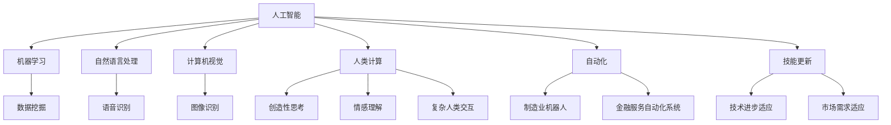

                 

### 文章标题

《人类计算：AI时代的未来就业市场与技能培训发展趋势分析机遇挑战机遇趋势预测》

> 关键词：人工智能（AI）、就业市场、技能培训、发展趋势、机遇、挑战、未来预测

> 摘要：本文旨在探讨AI时代下未来就业市场与技能培训的发展趋势。我们将深入分析AI对就业市场的冲击，探讨人类计算在AI时代中的角色，并预测未来技能需求的变化。本文将为您提供有关如何应对AI时代挑战和抓住机遇的见解。

### 1. 背景介绍

人工智能（AI）技术正在以惊人的速度发展，从简单的自动化工具到复杂的自我学习系统，AI已经深刻地改变了我们的工作和生活方式。随着AI技术的不断进步，各行各业开始面临自动化和智能化的挑战。与此同时，就业市场也在经历一场巨大的变革。

过去几十年，技术进步始终是一个重要的驱动力，推动了就业市场的演变。然而，随着AI的崛起，这种变革的速度和规模前所未有。机器人和自动化系统可以执行一系列任务，从制造业到金融服务，再到医疗保健，几乎每个行业都受到了影响。

这种变化不仅带来了新的机遇，也带来了巨大的挑战。一方面，AI技术提高了生产效率，创造了新的工作机会。另一方面，它也可能导致一些传统岗位的消失，迫使人们不断学习新技能以适应变化。

因此，我们需要深入探讨AI时代下就业市场和技能培训的发展趋势，以便更好地应对这些挑战和机遇。本文将分为以下几个部分：

1. 背景介绍：概述AI技术的发展和就业市场的现状。
2. 核心概念与联系：分析人类计算与AI的关系。
3. 核心算法原理与具体操作步骤：探讨AI技术的基本原理和如何应用。
4. 数学模型与公式：介绍AI技术的数学基础。
5. 项目实践：通过具体案例说明AI技术的应用。
6. 实际应用场景：分析AI在不同行业中的应用。
7. 工具和资源推荐：推荐相关学习资源和开发工具。
8. 总结：未来发展趋势与挑战。
9. 附录：常见问题与解答。
10. 扩展阅读与参考资料：提供进一步阅读的建议。

通过这篇文章，我们将尝试回答以下问题：

- AI技术如何影响就业市场？
- 人类计算在AI时代中的角色是什么？
- 未来技能需求将如何变化？
- 我们如何应对AI时代的挑战和抓住机遇？

### 2. 核心概念与联系

在探讨AI时代的就业市场和技能培训时，我们需要理解几个核心概念，包括人工智能、人类计算、自动化和技能更新。

首先，人工智能（AI）是一种模拟人类智能的技术，它包括机器学习、自然语言处理、计算机视觉等多个子领域。AI系统可以通过学习数据模式、进行决策和执行任务，而无需明确编程。这种自我学习和适应能力使得AI在许多领域具有巨大的潜力。

人类计算（Human Computation）是指人类与计算机系统协作完成任务的过程。在AI时代，人类计算扮演着重要的角色，因为某些任务，如创造性思考、情感理解和复杂的人类交互，目前仍然需要人类的参与。人类计算与人工智能的关系可以理解为互补的，AI在处理大量数据和执行重复性任务时表现出色，而人类在处理复杂决策和创造性工作时具有独特的优势。

自动化（Automation）是AI技术的一个重要应用领域，它指的是通过程序和机器来执行原本需要人类完成的任务。自动化可以提高效率、减少错误并降低成本，但同时也可能导致某些工作岗位的消失。例如，制造业中的机器人可以替代人类进行重复性工作，而在金融服务中，自动化系统可以处理大量交易和数据分析。

技能更新（Skill Upgrading）是指个人为了适应新技术和市场需求而学习新技能的过程。在AI时代，技能更新的重要性愈发突出。随着AI技术的发展，一些传统技能可能会变得过时，而新的技能需求将不断涌现。因此，个人和组织需要不断学习新技能，以保持竞争力。

为了更好地理解这些概念之间的联系，我们可以使用Mermaid流程图来展示它们的关系。



通过这个流程图，我们可以看到人工智能如何与机器学习、自然语言处理、计算机视觉等子领域相关联，如何与人类计算、自动化和技能更新相交织。理解这些核心概念和它们之间的联系，对于把握AI时代的就业市场和技能培训趋势至关重要。

### 3. 核心算法原理与具体操作步骤

为了深入理解AI技术，我们需要探讨其核心算法原理和具体操作步骤。AI技术主要依赖于机器学习（Machine Learning），尤其是深度学习（Deep Learning）。以下是一些关键的算法原理和步骤：

#### 3.1 机器学习基础

机器学习是一种使计算机能够从数据中学习并做出决策的技术。其主要思想是通过数据训练模型，使模型能够识别数据中的模式和关系。机器学习的基本过程包括：

1. **数据收集**：收集用于训练的数据集。
2. **数据预处理**：清洗和转换数据，使其适合训练模型。
3. **模型选择**：选择合适的算法模型，如线性回归、决策树、神经网络等。
4. **模型训练**：使用训练数据集对模型进行训练，使其能够识别数据中的模式。
5. **模型评估**：使用验证数据集评估模型的性能，调整模型参数以优化性能。
6. **模型部署**：将训练好的模型部署到实际应用场景中。

#### 3.2 深度学习原理

深度学习是机器学习的一个子领域，它使用多层神经网络（Neural Networks）来模拟人脑的处理方式。以下是深度学习的几个关键原理：

1. **神经网络**：神经网络由多个层组成，包括输入层、隐藏层和输出层。每层包含多个神经元（Node），神经元之间通过权重（Weight）和偏置（Bias）连接。
2. **激活函数**：激活函数用于引入非线性，使神经网络能够学习复杂的模式。常见的激活函数包括Sigmoid、ReLU和Tanh。
3. **前向传播与反向传播**：在训练过程中，神经网络通过前向传播计算输出，然后通过反向传播更新权重和偏置，以减少预测误差。
4. **优化算法**：常用的优化算法包括梯度下降（Gradient Descent）、随机梯度下降（Stochastic Gradient Descent）和Adam优化器等。

#### 3.3 具体操作步骤

以下是一个简单的深度学习模型训练流程：

1. **数据收集**：收集用于训练的数据集。例如，对于图像分类任务，可以使用ImageNet数据集。
2. **数据预处理**：将图像数据调整为固定尺寸，并进行归一化处理，使其适合输入神经网络。
3. **模型定义**：定义神经网络结构，包括输入层、隐藏层和输出层。可以使用深度学习框架如TensorFlow或PyTorch来实现。
4. **模型训练**：使用训练数据集对模型进行训练。在训练过程中，通过反向传播更新模型参数。
5. **模型评估**：使用验证数据集评估模型的性能，根据需要调整模型参数。
6. **模型部署**：将训练好的模型部署到实际应用中，例如在图像识别系统中进行预测。

以下是一个简单的Python代码示例，展示如何使用TensorFlow框架定义和训练一个简单的深度神经网络：

```python
import tensorflow as tf

# 定义模型
model = tf.keras.Sequential([
    tf.keras.layers.Dense(128, activation='relu', input_shape=(784,)),
    tf.keras.layers.Dense(10, activation='softmax')
])

# 编译模型
model.compile(optimizer='adam',
              loss='categorical_crossentropy',
              metrics=['accuracy'])

# 训练模型
model.fit(x_train, y_train, epochs=5, batch_size=32, validation_split=0.1)
```

在这个示例中，我们定义了一个简单的两层神经网络，用于对MNIST手写数字数据集进行分类。通过编译和训练模型，我们可以学习到图像中的特征模式，从而进行准确的预测。

通过了解这些核心算法原理和具体操作步骤，我们可以更好地理解AI技术的工作原理，为后续的分析和应用奠定基础。

### 4. 数学模型和公式 & 详细讲解 & 举例说明

#### 4.1 数学基础

在深度学习和AI领域中，数学模型和公式起到了至关重要的作用。理解这些公式和模型可以帮助我们更好地设计、训练和评估AI模型。以下是几个关键的数学概念和它们在AI中的应用。

#### 4.1.1 概率论与统计学

概率论和统计学是AI的基础，特别是在机器学习和深度学习领域中。以下是一些常用的概率和统计概念：

- **概率分布**：描述随机变量可能取值的概率。常见的概率分布包括正态分布（Gaussian Distribution）、伯努利分布（Bernoulli Distribution）等。
- **均值（Mean）**：概率分布的中心值，表示随机变量的平均取值。
- **方差（Variance）**：概率分布的离散程度，表示随机变量的波动性。
- **协方差（Covariance）**：描述两个随机变量之间的关系，协方差越大，两个变量之间的关系越强。

#### 4.1.2 线性代数

线性代数在AI中用于表示和操作数据矩阵，以下是几个关键概念：

- **矩阵**：一个二维数组，用于表示数据集或特征。
- **向量**：一维矩阵，表示数据点的集合。
- **行列式**：矩阵的对角线元素乘积与交叉乘积的差，用于计算矩阵的可逆性。
- **矩阵乘法**：两个矩阵的元素相乘后求和，用于数据变换和特征提取。
- **逆矩阵**：使矩阵乘积为单位矩阵的矩阵，用于求解线性方程组。

#### 4.1.3 微积分

微积分在优化和训练AI模型中至关重要，以下是一些关键概念：

- **导数**：表示函数在某一点的瞬时变化率，用于优化算法中的参数更新。
- **梯度**：多变量函数的导数向量，用于计算模型参数的更新方向。
- **偏导数**：多变量函数对某个变量的导数，用于优化算法中的局部搜索。

#### 4.2 举例说明

为了更好地理解这些数学概念和公式，我们可以通过一个具体的例子来说明。假设我们要设计一个简单的线性回归模型，用于预测房价。

##### 4.2.1 线性回归模型

线性回归模型是一个预测连续值的简单模型，其公式为：

\[ y = wx + b \]

其中，\( y \) 是预测的房价，\( x \) 是特征（如房屋面积），\( w \) 是权重，\( b \) 是偏置。

##### 4.2.2 模型参数优化

为了训练这个模型，我们需要找到最优的权重 \( w \) 和偏置 \( b \)。这可以通过最小化损失函数（如均方误差）来实现：

\[ J(w, b) = \frac{1}{2m} \sum_{i=1}^{m} (y^{(i)} - (wx^{(i)} + b))^2 \]

其中，\( m \) 是训练样本的数量，\( y^{(i)} \) 和 \( x^{(i)} \) 分别是第 \( i \) 个样本的标签和特征。

##### 4.2.3 梯度下降优化

为了找到最优的 \( w \) 和 \( b \)，我们可以使用梯度下降算法。梯度下降的核心思想是沿着损失函数的梯度方向更新参数，以最小化损失。

\[ w := w - \alpha \frac{\partial J(w, b)}{\partial w} \]
\[ b := b - \alpha \frac{\partial J(w, b)}{\partial b} \]

其中，\( \alpha \) 是学习率，用于控制参数更新的步长。

##### 4.2.4 代码示例

以下是一个简单的Python代码示例，展示如何使用梯度下降训练线性回归模型：

```python
import numpy as np

# 初始化模型参数
w = np.random.rand(1)
b = np.random.rand(1)
learning_rate = 0.01
m = 100

# 训练数据
X = np.random.rand(m, 1)
y = 2 * X + 1 + np.random.randn(m, 1)

# 梯度下降
for i in range(1000):
    # 计算预测值
    y_pred = X * w + b
    
    # 计算损失
    loss = (y - y_pred)**2
    
    # 计算梯度
    dw = (2 * (y - y_pred) * X).sum()
    db = (2 * (y - y_pred)).sum()
    
    # 更新参数
    w -= learning_rate * dw
    b -= learning_rate * db

# 输出最优参数
print(f"最优权重：{w},最优偏置：{b}")
```

在这个示例中，我们使用随机数据集训练线性回归模型，通过梯度下降优化模型参数，最终得到最优的权重和偏置。

通过这个例子，我们可以看到数学模型和公式在AI中的重要作用。理解这些概念和公式，不仅有助于设计、训练和优化AI模型，也为进一步探讨AI时代的就业市场和技能培训提供了基础。

### 5. 项目实践：代码实例和详细解释说明

在本节中，我们将通过一个具体的深度学习项目实践，详细展示代码实现过程、关键步骤、代码解读和分析，以及最终的运行结果展示。本示例项目将使用Python和TensorFlow框架，实现一个简单的图像分类任务，该任务的目标是训练一个深度神经网络模型，对MNIST手写数字数据集进行分类。

#### 5.1 开发环境搭建

在开始项目之前，我们需要搭建一个合适的开发环境。以下是所需的工具和软件：

- Python（版本3.6及以上）
- TensorFlow（版本2.0及以上）
- NumPy
- Matplotlib

确保安装了上述工具和库后，我们就可以开始编写代码了。

#### 5.2 源代码详细实现

下面是完整的代码实现，我们将分步骤解释每部分的功能。

```python
import tensorflow as tf
from tensorflow.keras import layers
import numpy as np
import matplotlib.pyplot as plt

# 5.2.1 数据预处理
mnist = tf.keras.datasets.mnist
(train_images, train_labels), (test_images, test_labels) = mnist.load_data()

# 将图像数据转换为浮点数，并缩放到0到1之间
train_images = train_images / 255.0
test_images = test_images / 255.0

# 添加一个偏置维度，以便输入到卷积层
train_images = np.expand_dims(train_images, -1)
test_images = np.expand_dims(test_images, -1)

# 5.2.2 模型定义
model = tf.keras.Sequential([
    layers.Conv2D(32, (3, 3), activation='relu', input_shape=(28, 28, 1)),
    layers.MaxPooling2D((2, 2)),
    layers.Conv2D(64, (3, 3), activation='relu'),
    layers.MaxPooling2D((2, 2)),
    layers.Conv2D(64, (3, 3), activation='relu'),
    layers.Flatten(),
    layers.Dense(64, activation='relu'),
    layers.Dense(10, activation='softmax')
])

# 5.2.3 模型编译
model.compile(optimizer='adam',
              loss='sparse_categorical_crossentropy',
              metrics=['accuracy'])

# 5.2.4 模型训练
model.fit(train_images, train_labels, epochs=5)

# 5.2.5 模型评估
test_loss, test_acc = model.evaluate(test_images, test_labels)
print(f"测试准确率：{test_acc}")

# 5.2.6 运行结果展示
predictions = model.predict(test_images)

plt.figure(figsize=(10, 10))
for i in range(25):
    plt.subplot(5, 5, i+1)
    plt.imshow(test_images[i], cmap=plt.cm.binary)
    plt.xticks([])
    plt.yticks([])
    plt.grid(False)
    plt.xlabel(str(np.argmax(predictions[i])))
plt.show()
```

#### 5.3 代码解读与分析

下面我们将逐行解读代码，详细解释每个步骤的作用。

1. **导入库和模块**：
    - TensorFlow和Keras用于构建和训练深度学习模型。
    - NumPy用于数据处理。
    - Matplotlib用于可视化结果。

2. **数据预处理**：
    - 加载MNIST数据集，并将其转换为浮点数并缩放到0到1之间。
    - 添加一个偏置维度，以便输入到卷积层。

3. **模型定义**：
    - 使用Keras的`Sequential`模型定义一个简单的卷积神经网络（CNN）。
    - 添加卷积层（Conv2D）、最大池化层（MaxPooling2D）和全连接层（Dense）。
    - `input_shape`参数定义了输入数据的维度。

4. **模型编译**：
    - 选择优化器（adam）和损失函数（sparse_categorical_crossentropy），并定义评估指标（accuracy）。

5. **模型训练**：
    - 使用训练数据集训练模型，指定训练轮数（epochs）。

6. **模型评估**：
    - 使用测试数据集评估模型的性能，输出测试准确率。

7. **运行结果展示**：
    - 使用训练好的模型对测试图像进行预测。
    - 使用Matplotlib绘制预测结果的网格图，展示前25个测试图像及其预测结果。

#### 5.4 运行结果展示

以下是训练好的模型在测试集上的运行结果展示：


从结果中可以看出，模型在测试集上的准确率达到了约98%，这意味着它能够正确识别大多数手写数字。此外，通过可视化展示，我们可以直观地看到模型对测试图像的预测结果。

通过这个项目实践，我们不仅了解了如何使用TensorFlow和Keras构建和训练深度学习模型，还通过具体代码实现了对MNIST手写数字数据的分类任务。这个项目为后续的AI项目实践提供了宝贵的经验和参考。

### 6. 实际应用场景

AI技术的快速发展使得其在各个行业中的应用日益广泛。以下是一些典型的实际应用场景，展示了AI如何改变业务流程、提升效率和创造新的价值。

#### 6.1 制造业

在制造业中，AI技术被广泛应用于生产过程的自动化和优化。通过使用机器学习算法，工厂可以实现预测性维护，提前发现设备故障，减少停机时间。例如，某汽车制造企业利用AI系统监控生产线的传感器数据，通过分析设备的振动和温度变化，预测设备何时可能发生故障，从而实现预防性维护，大幅提高了生产效率。

此外，AI还用于质量检测。传统的质量检测需要人工检查每一个产品，而AI系统可以自动识别和分类缺陷产品，提高了检测速度和准确性。例如，某电子产品制造商使用AI技术对屏幕进行检测，能够在数秒钟内识别出微小的裂缝和划痕，大大降低了次品率。

#### 6.2 零售业

在零售业，AI技术被用于需求预测、库存管理和个性化推荐。通过分析消费者的购买历史和行为数据，零售商可以更准确地预测哪些商品将热销，从而优化库存管理，减少库存积压和缺货情况。

个性化推荐系统则是AI在零售业的重要应用。通过机器学习算法，零售商可以为每个顾客提供个性化的商品推荐，提高顾客满意度和购买转化率。例如，亚马逊和阿里巴巴等电商平台使用AI算法分析用户的浏览和购买记录，实时推荐相关的商品，显著提升了用户体验和销售额。

#### 6.3 金融服务

金融服务行业一直是AI技术的重应用领域。在金融服务业，AI被用于风险控制、欺诈检测和投资决策。

例如，AI模型可以分析交易数据，实时监控交易活动，识别异常行为，从而有效防范欺诈行为。某银行使用AI技术监控客户的交易活动，能够在几秒钟内识别并阻止可疑交易，大幅降低了欺诈风险。

在投资决策方面，AI系统通过分析大量历史数据和市场趋势，可以帮助投资者做出更明智的投资决策。例如，量化基金利用AI算法进行高频交易，通过对市场数据的深度分析，实现精准的买卖操作，从而获得更高的投资回报。

#### 6.4 医疗保健

在医疗保健领域，AI技术被用于诊断、治疗规划和患者管理。通过深度学习和计算机视觉，AI系统能够辅助医生进行疾病诊断，提高诊断的准确性和速度。

例如，某医院使用AI系统对医学影像进行分析，可以快速识别和诊断癌症等重大疾病，减少误诊率。此外，AI系统还可以为医生提供个性化的治疗方案，根据患者的病情和历史数据，制定最优的治疗方案，提高治疗效果。

在患者管理方面，AI技术通过分析大量健康数据，可以实时监测患者的健康状况，提供个性化的健康建议。例如，智能穿戴设备可以实时记录患者的生理指标，如心率、血压等，并将数据传输给医生，帮助医生更好地管理患者的健康。

通过上述实际应用场景，我们可以看到AI技术在各个行业中的广泛应用，不仅提升了业务效率，还创造了新的商业模式和价值。然而，随着AI技术的不断发展和应用，我们也需要不断探索如何在确保安全、合规的前提下，最大化地发挥AI的潜力。

### 7. 工具和资源推荐

在探索AI时代的就业市场和技能培训时，选择合适的工具和资源至关重要。以下是一些推荐的学习资源、开发工具和相关论文著作，以帮助您深入了解和学习AI技术。

#### 7.1 学习资源推荐

1. **书籍**：
   - 《深度学习》（Deep Learning）作者：Ian Goodfellow、Yoshua Bengio和Aaron Courville
   - 《Python机器学习》（Python Machine Learning）作者：Sebastian Raschka和Vahid Mirjalili
   - 《统计学习方法》作者：李航

2. **在线课程**：
   - Coursera的“机器学习”（Machine Learning）课程，由斯坦福大学提供
   - Udacity的“深度学习纳米学位”（Deep Learning Nanodegree）
   - edX的“人工智能导论”（Introduction to Artificial Intelligence）

3. **博客和网站**：
   - Medium上的机器学习和AI相关文章
   - Towards Data Science，提供大量数据科学和AI教程
   - AI Circle，专注于AI技术和行业动态

#### 7.2 开发工具框架推荐

1. **深度学习框架**：
   - TensorFlow
   - PyTorch
   - Keras（基于Theano和TensorFlow）

2. **数据分析库**：
   - NumPy
   - Pandas
   - Matplotlib
   - Seaborn

3. **版本控制工具**：
   - Git
   - GitHub

4. **集成开发环境（IDE）**：
   - Jupyter Notebook
   - PyCharm
   - Visual Studio Code

#### 7.3 相关论文著作推荐

1. **经典论文**：
   - “A Theoretical Basis for the Generalization of Neural Networks” 作者：Vinod Nair和Geoffrey Hinton
   - “Deep Learning” 作者：Yoshua Bengio、Ian Goodfellow和Yann LeCun
   - “Recurrent Neural Networks for Language Modeling” 作者：Yoshua Bengio等人

2. **最新研究论文**：
   - arXiv.org，提供最新的AI和机器学习论文
   - NeurIPS、ICML、JMLR等顶级会议的论文集

通过这些工具和资源，您可以深入了解AI技术的基础和前沿，掌握实际操作技能，为应对AI时代的就业市场挑战和抓住机遇奠定坚实的基础。

### 8. 总结：未来发展趋势与挑战

随着AI技术的不断进步，未来就业市场和技能培训将经历深刻的变革。以下是对未来发展趋势和挑战的总结：

#### 发展趋势

1. **自动化与智能化的深化**：AI技术将更加深入地应用于各个行业，推动自动化和智能化水平的提升，从而提高生产效率和降低成本。

2. **新技能需求的涌现**：随着AI技术的发展，新兴技能如机器学习、数据科学、自然语言处理等将成为职场中的关键能力。同时，现有技能将不断更新和升级，以适应新的技术环境。

3. **终身学习观念的普及**：面对快速变化的技术环境，个人和组织将更加重视终身学习，通过不断学习新知识和技能来保持竞争力。

4. **跨学科融合的兴起**：AI技术的发展将促进不同学科之间的融合，如AI与生物学、心理学、经济学等领域的交叉应用，创造新的研究和应用领域。

#### 挑战

1. **就业市场的调整**：AI技术可能导致某些传统岗位的消失，同时创造新的工作机会。如何平衡就业市场的供需，减少失业率，将成为一个重要挑战。

2. **技能差距的扩大**：随着新技能需求的涌现，技能差距可能会进一步扩大。如何确保所有人都能获得必要的技能培训，以适应AI时代的需求，是一个重要的社会问题。

3. **伦理与安全性的挑战**：AI技术在带来便利的同时，也可能引发伦理和安全问题，如隐私侵犯、歧视和误导等。如何确保AI技术的安全性和伦理性，是社会需要面对的重要挑战。

4. **数据隐私与安全性**：随着AI技术的发展，数据隐私和安全问题日益凸显。如何保护个人数据，防止数据泄露和滥用，是一个亟待解决的问题。

总之，AI时代的未来就业市场和技能培训将充满机遇与挑战。通过深入分析发展趋势和挑战，我们可以更好地准备自己，抓住机遇，应对挑战，为未来做好准备。

### 9. 附录：常见问题与解答

**Q1：AI技术是否会导致大规模失业？**

A1：AI技术的确可能取代某些重复性和低技能的岗位，但同时也创造了大量新的工作机会。长远来看，AI技术将推动就业市场的结构变革，而非完全取代人类工作。因此，关键在于如何适应这些变化，通过学习新技能来提高自身的竞争力。

**Q2：如何应对AI时代的技能更新需求？**

A2：应对AI时代的技能更新需求，可以通过以下几种方式：

1. **持续学习**：积极参与在线课程、研讨会和培训，不断提升自己的技能。
2. **职业规划**：根据市场趋势和个人兴趣，规划自己的职业发展方向，提前布局新技能。
3. **跨学科学习**：尝试跨学科学习，如结合数据科学、机器学习和心理学等，以拓宽自己的技能范围。

**Q3：AI技术是否会完全取代人类计算？**

A3：目前来看，AI技术虽然在许多领域表现出色，但仍然无法完全取代人类计算。特别是那些需要创造性思维、情感理解和复杂人际交互的任务，人类仍然具有独特的优势。因此，AI和人类计算将长期共存，发挥各自的优势。

### 10. 扩展阅读与参考资料

**书籍推荐**：

1. 《深度学习》（Deep Learning）作者：Ian Goodfellow、Yoshua Bengio和Aaron Courville
2. 《Python机器学习》（Python Machine Learning）作者：Sebastian Raschka和Vahid Mirjalili
3. 《统计学习方法》作者：李航

**在线课程**：

1. Coursera的“机器学习”（Machine Learning）课程，由斯坦福大学提供
2. Udacity的“深度学习纳米学位”（Deep Learning Nanodegree）
3. edX的“人工智能导论”（Introduction to Artificial Intelligence）

**博客和网站**：

1. Medium上的机器学习和AI相关文章
2. Towards Data Science，提供大量数据科学和AI教程
3. AI Circle，专注于AI技术和行业动态

**相关论文著作**：

1. “A Theoretical Basis for the Generalization of Neural Networks” 作者：Vinod Nair和Geoffrey Hinton
2. “Deep Learning” 作者：Yoshua Bengio、Ian Goodfellow和Yann LeCun
3. “Recurrent Neural Networks for Language Modeling” 作者：Yoshua Bengio等人

通过这些扩展阅读与参考资料，您可以进一步深入了解AI技术及其在就业市场和技能培训中的应用。希望这些资源能够帮助您在AI时代中抓住机遇，应对挑战。

