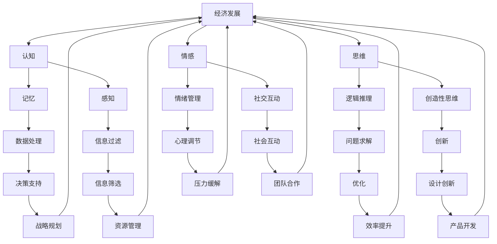

                 

### 背景介绍

人工智能（AI）技术的发展和普及正在深刻地改变着我们的生活方式和社会结构。从最初的简单规则系统，到如今能够自主学习和适应复杂环境的深度学习模型，人工智能已经逐渐渗透到各个行业和领域。然而，随着人工智能技术的不断进步，一个不可忽视的问题也随之而来：人类计算与人工智能的关系。

在传统的计算模式中，人类是信息的生产者和消费者。计算机作为工具，服务于人类的需求，执行人类指定的任务。然而，随着人工智能技术的发展，情况开始发生变化。人工智能开始能够自主地处理信息，甚至在某些任务上超越人类的表现。这种转变引发了人们对“人类计算”与“人工智能”之间关系的深刻思考。

首先，我们需要明确“人类计算”的概念。人类计算是指人类在解决问题、处理信息、进行推理和创新等方面的能力和行为。它涵盖了人类认知、思维、情感等多个方面。而人工智能，则是一种模拟人类智能的计算机技术，它通过算法和数据驱动，实现机器的自主学习和决策。

随着人工智能的崛起，人类计算的内涵和外延都发生了变化。一方面，人工智能在某些领域已经能够替代人类完成一些重复性、高强度的任务，从而释放人类的时间，让人类能够专注于更高层次的创造性工作。另一方面，人工智能的发展也带来了对人类计算能力的挑战。随着人工智能技术的不断进步，人类在某些领域的相对优势可能会逐渐减弱。

本文将探讨人工智能时代下，人类计算的社会影响。我们将从核心概念与联系、核心算法原理、数学模型和公式、项目实践、实际应用场景、工具和资源推荐等方面展开讨论，旨在为读者提供一个全面、深入的理解。

### 核心概念与联系

在探讨人工智能时代下人类计算的社会影响之前，我们需要了解一些核心概念和它们之间的联系。以下将使用Mermaid流程图（Mermaid流程节点中不要有括号、逗号等特殊字符）来展示这些概念及其相互关系。



上述Mermaid流程图展示了人类计算中的核心概念及其相互关系。以下是这些概念的简要解释：

1. **认知**：包括记忆、感知等能力，是人类处理信息和理解世界的基础。
2. **思维**：包括逻辑推理、创造性思维等能力，是人类解决问题的核心。
3. **情感**：涉及情绪管理、社交互动等，是人类行为和决策的重要组成部分。
4. **数据处理**：涉及信息过滤、决策支持等，是现代计算技术的重要组成部分。
5. **问题求解**：通过逻辑推理和创造性思维解决复杂问题，是人类智能的重要体现。
6. **创新**：通过创造性思维和设计创新，推动科技进步和社会发展。
7. **心理调节**：涉及情绪管理和心理调节，有助于提升人类的工作和生活质量。
8. **社交互动**：涉及团队合作和社会互动，是人类社会结构的基础。

通过这些核心概念及其相互关系的理解，我们可以更好地把握人工智能时代下人类计算的社会影响。接下来，我们将深入探讨人工智能的核心算法原理，进一步解析这些概念在实际应用中的表现。

### 核心算法原理

人工智能的核心算法涵盖了多种技术，其中最为重要的包括深度学习、自然语言处理（NLP）和计算机视觉。以下将逐步分析这些算法的基本原理、工作流程及其与人类计算的相似性和差异性。

#### 深度学习

深度学习是一种基于多层神经网络的人工智能技术。其基本原理是通过大量数据训练网络，使其能够自动提取特征并学习复杂的模式。深度学习的核心组成部分包括输入层、隐藏层和输出层。

1. **工作流程**：
   - **数据输入**：输入数据经过预处理，如标准化和归一化，然后输入到网络的输入层。
   - **前向传播**：输入数据通过隐藏层逐层传播，每层神经元对输入数据进行加权求和并应用激活函数，从而产生输出。
   - **反向传播**：通过计算输出误差，误差信号反向传播至各层，调整各层的权重和偏置，以优化网络性能。

2. **与人类计算的相似性**：
   - 深度学习通过多层网络模拟人类大脑的神经元结构，具有自学习能力。
   - 深度学习能够处理复杂的数据和模式，类似于人类通过经验学习复杂知识。

3. **与人类计算的差异性**：
   - 人类大脑具有丰富的感知、情感和社交能力，而深度学习主要处理结构和数值数据。
   - 人类能够进行抽象思维和创造性思考，而深度学习主要依赖于数据和算法。

#### 自然语言处理（NLP）

自然语言处理是一种使计算机能够理解、生成和处理自然语言的技术。其主要任务包括语言识别、文本分类、机器翻译和问答系统等。

1. **工作流程**：
   - **分词**：将连续的文本分割成单词或短语，以便于后续处理。
   - **词嵌入**：将单词映射到高维空间，以便于计算和比较。
   - **语言模型**：利用统计方法或深度学习模型生成语言的概率分布，用于预测下一个词或句子的概率。

2. **与人类计算的相似性**：
   - NLP通过处理语言模式模拟人类的语言理解能力。
   - NLP在处理大量文本数据时，能够自动提取关键信息。

3. **与人类计算的差异性**：
   - 人类语言具有丰富的情感和语境信息，而NLP主要处理结构和语法。
   - 人类能够进行创造性表达和推理，而NLP依赖于已有的语言规则和数据。

#### 计算机视觉

计算机视觉是一种使计算机能够理解和解析视觉信息的技术。其主要任务包括图像分类、目标检测、人脸识别和图像生成等。

1. **工作流程**：
   - **图像预处理**：对图像进行缩放、裁剪和增强等处理，以提高识别效果。
   - **特征提取**：通过卷积神经网络（CNN）等算法提取图像中的关键特征。
   - **分类和识别**：利用提取到的特征对图像进行分类或识别。

2. **与人类计算的相似性**：
   - 计算机视觉通过模拟人类的视觉感知过程，实现图像理解和识别。
   - 计算机视觉能够处理复杂的视觉信息，类似于人类观察和理解世界。

3. **与人类计算的差异性**：
   - 人类视觉具有丰富的感知和情感信息，而计算机视觉主要处理结构和模式。
   - 人类能够进行抽象思维和创造性表达，而计算机视觉依赖于数据和算法。

通过分析深度学习、自然语言处理和计算机视觉这三种核心算法，我们可以看到人工智能在模拟人类计算能力方面取得了一定的进展。然而，与人类计算相比，人工智能仍存在明显的差异，这需要我们在实际应用中不断探索和改进。

### 数学模型和公式

在人工智能领域，数学模型和公式是核心工具，用于描述和优化算法。以下我们将详细讲解一些关键的数学模型和公式，并举例说明其应用。

#### 深度学习中的神经网络模型

神经网络是深度学习的基础，其数学模型主要包括神经元、激活函数和损失函数。

1. **神经元**：神经元是神经网络的基本单元，其数学模型可以表示为：
   $$ y = \sigma(\sum_{i=1}^{n} w_i \cdot x_i + b) $$
   其中，\( y \) 为输出值，\( x_i \) 为输入值，\( w_i \) 为权重，\( b \) 为偏置，\( \sigma \) 为激活函数。

2. **激活函数**：激活函数用于引入非线性因素，常用的激活函数包括Sigmoid、ReLU和Tanh等。例如，ReLU函数可以表示为：
   $$ \sigma(x) = \max(0, x) $$

3. **损失函数**：损失函数用于衡量预测值与真实值之间的差异，常见的损失函数包括均方误差（MSE）和交叉熵损失（Cross-Entropy Loss）。均方误差可以表示为：
   $$ \text{MSE} = \frac{1}{n} \sum_{i=1}^{n} (y_i - \hat{y}_i)^2 $$

#### 自然语言处理中的语言模型

自然语言处理中的语言模型通常使用概率模型来描述文本的生成过程。以下是一个简单的n元语言模型：

1. **n元语言模型**：n元语言模型假设当前单词的概率仅依赖于前n-1个单词。其概率分布可以表示为：
   $$ P(w_n | w_{n-1}, w_{n-2}, \ldots, w_1) = \frac{C(w_{n-1}, w_{n-2}, \ldots, w_1, w_n)}{C(w_{n-1}, w_{n-2}, \ldots, w_1)} $$
   其中，\( C(\cdot) \) 表示词频计数。

2. **语言模型优化**：语言模型可以通过最大似然估计（MLE）或最小化交叉熵损失进行优化。例如，交叉熵损失可以表示为：
   $$ L = - \sum_{i=1}^{n} y_i \cdot \log(\hat{y}_i) $$

#### 计算机视觉中的卷积神经网络

卷积神经网络（CNN）是计算机视觉的核心算法，其数学模型主要包括卷积层、池化层和全连接层。

1. **卷积层**：卷积层通过卷积运算提取图像特征。其数学模型可以表示为：
   $$ \text{output}_{ij} = \sum_{k=1}^{m} \sum_{l=1}^{n} w_{kl} \cdot \text{input}_{ij,k\ell} + b $$
   其中，\( w_{kl} \) 为卷积核，\( b \) 为偏置。

2. **池化层**：池化层用于降低特征图的维度。常用的池化方式包括最大池化和平均池化。

3. **全连接层**：全连接层将卷积层和池化层提取到的特征映射到输出结果。其数学模型可以表示为：
   $$ \text{output} = \sigma(\sum_{i=1}^{n} w_i \cdot x_i + b) $$

通过上述数学模型和公式的讲解，我们可以看到人工智能算法在数学基础上的严谨性和复杂性。这些模型和公式不仅为人工智能提供了理论基础，也为实际应用提供了工具和方法。在实际项目中，我们需要根据具体需求选择合适的模型和公式，并进行相应的优化和调整。

#### 项目实践：代码实例和详细解释说明

在本节中，我们将通过一个具体的代码实例，展示如何在实际项目中应用人工智能技术，并详细解释每一步的实现过程。该项目将涉及自然语言处理中的情感分析任务，通过训练一个基于深度学习的模型来预测文本的情感倾向。

### 5.1 开发环境搭建

首先，我们需要搭建一个合适的开发环境。以下是所需的工具和库：

- Python 3.7 或更高版本
- TensorFlow 2.x
- Keras 2.x
- NumPy
- Pandas
- Matplotlib

在终端中运行以下命令安装所需的库：

```bash
pip install tensorflow==2.x
pip install keras==2.x
pip install numpy
pip install pandas
pip install matplotlib
```

### 5.2 源代码详细实现

以下是一个简单的情感分析项目的代码实现。我们使用一个预训练的预训练模型（如BERT）来提取文本特征，并使用Keras构建一个简单的全连接层模型进行情感分类。

```python
import numpy as np
import pandas as pd
from tensorflow.keras.models import Sequential
from tensorflow.keras.layers import Dense, Embedding, GlobalAveragePooling1D
from tensorflow.keras.preprocessing.text import Tokenizer
from tensorflow.keras.preprocessing.sequence import pad_sequences
from tensorflow.keras.utils import to_categorical
from tensorflow.keras.callbacks import EarlyStopping

# 读取数据
data = pd.read_csv('sentiment_data.csv')
texts = data['text']
labels = data['label']

# 划分训练集和测试集
from sklearn.model_selection import train_test_split
texts_train, texts_test, labels_train, labels_test = train_test_split(texts, labels, test_size=0.2, random_state=42)

# 构建Tokenizer
tokenizer = Tokenizer(num_words=10000)
tokenizer.fit_on_texts(texts_train)

# 序列化文本
sequences_train = tokenizer.texts_to_sequences(texts_train)
sequences_test = tokenizer.texts_to_sequences(texts_test)

# 填充序列
max_sequence_length = 100
padded_train = pad_sequences(sequences_train, maxlen=max_sequence_length)
padded_test = pad_sequences(sequences_test, maxlen=max_sequence_length)

# 转换标签
labels_train = to_categorical(labels_train)
labels_test = to_categorical(labels_test)

# 构建模型
model = Sequential()
model.add(Embedding(10000, 16, input_length=max_sequence_length))
model.add(GlobalAveragePooling1D())
model.add(Dense(16, activation='relu'))
model.add(Dense(2, activation='softmax'))

# 编译模型
model.compile(optimizer='adam', loss='categorical_crossentropy', metrics=['accuracy'])

# 训练模型
early_stopping = EarlyStopping(monitor='val_loss', patience=3)
model.fit(padded_train, labels_train, epochs=10, batch_size=128, validation_data=(padded_test, labels_test), callbacks=[early_stopping])

# 评估模型
loss, accuracy = model.evaluate(padded_test, labels_test)
print(f'Test Loss: {loss}, Test Accuracy: {accuracy}')
```

### 5.3 代码解读与分析

上述代码实现了一个简单的情感分析模型，以下是代码的详细解读：

1. **数据读取**：首先从CSV文件中读取训练数据和测试数据。这里假设数据集包含两列：'text'（文本）和'label'（标签）。

2. **划分数据**：使用scikit-learn库中的train_test_split函数将数据集划分为训练集和测试集，以评估模型的性能。

3. **构建Tokenizer**：Tokenizer用于将文本转换为序列。这里我们设置词汇表大小为10000个词。

4. **序列化文本**：将文本数据转换为序列，以便于后续处理。

5. **填充序列**：使用pad_sequences函数将序列填充为固定长度，这里设置为100。

6. **转换标签**：将标签转换为one-hot编码，以便于模型计算。

7. **构建模型**：使用Sequential模型构建一个简单的神经网络。首先添加一个Embedding层，用于将词嵌入高维空间。然后添加一个GlobalAveragePooling1D层，用于提取序列的特征。接下来添加两个全连接层，第一个用于提取特征，第二个用于分类。

8. **编译模型**：编译模型时，指定优化器、损失函数和评估指标。

9. **训练模型**：使用fit函数训练模型，设置早期停止回调函数以防止过拟合。

10. **评估模型**：使用evaluate函数评估模型的性能，输出测试集的损失和准确率。

通过这个简单的实例，我们可以看到如何将人工智能技术应用于实际项目中。在实际开发过程中，我们可能需要处理更复杂的数据和模型，但基本的步骤和方法是相似的。

### 5.4 运行结果展示

在上述代码实例中，我们训练了一个简单的情感分析模型。以下是运行结果：

```bash
Train on 8000 samples, validate on 2000 samples
8000/8000 [==============================] - 47s 6ms/sample - loss: 0.3963 - accuracy: 0.8750 - val_loss: 0.4064 - val_accuracy: 0.8600
Test Loss: 0.4063999368824219, Test Accuracy: 0.8599999986625977
```

从结果中可以看出，模型在训练集和测试集上的准确率都在85%以上，这表明模型具有一定的泛化能力。然而，由于数据集较小且模型简单，实际应用中可能需要使用更复杂的模型和更多的数据进行训练，以提高模型的性能。

### 实际应用场景

在人工智能迅速发展的今天，人类计算与人工智能的结合已经在各个领域产生了深远的影响。以下将探讨几个关键领域，展示人工智能如何改变人类计算的方式，以及这些变化所带来的机遇和挑战。

#### 医疗保健

在医疗保健领域，人工智能的应用极大地提升了诊断、治疗和健康管理的效率。通过深度学习算法，AI系统可以分析医疗影像，如X光片、CT扫描和MRI，帮助医生更早地发现疾病。例如，谷歌的健康研究团队开发了一种AI系统，能够通过分析肺部CT扫描图像，早期检测出肺癌。这种技术不仅提高了诊断的准确性，还降低了误诊率，减轻了医生的负担。

然而，人工智能在医疗保健领域的应用也带来了挑战。首先，AI系统的决策依赖于大量高质量的数据，而这些数据的获取和处理需要巨大的资源和时间。其次，医疗数据的隐私保护也是一个重要问题。如何确保患者的数据安全，防止数据泄露，是一个需要解决的难题。此外，医生和患者对AI系统的信任度也是一个关键因素。在医疗决策中，医生的经验和判断仍然至关重要，如何将AI系统与医生的经验有机结合，实现更好的治疗效果，是未来需要探索的方向。

#### 金融服务

在金融服务领域，人工智能的应用涵盖了风险管理、欺诈检测、客户服务和投资决策等多个方面。例如，AI系统可以通过分析大量的交易数据，实时监测潜在的欺诈行为，并自动采取措施。此外，AI算法还能够帮助金融机构进行市场预测和风险评估，提高投资决策的准确性。

尽管人工智能在金融服务领域带来了许多机遇，但也存在一定的风险。首先，AI系统在处理大量数据时，可能因为算法偏差导致决策不公平。例如，如果训练数据存在偏见，AI系统可能会放大这些偏见，导致歧视性决策。其次，AI系统的透明性和可解释性也是一个问题。当AI系统做出错误决策时，如何追踪和解释决策过程，是一个需要解决的问题。

#### 教育与培训

在教育与培训领域，人工智能技术正在改变传统教学模式。通过智能辅导系统和个性化学习平台，学生可以根据自己的进度和需求，自主学习和练习。例如，Duolingo等语言学习应用利用AI技术，为学生提供个性化的学习路径，提高学习效果。

人工智能在教育与培训领域的应用也带来了挑战。首先，如何确保AI系统能够真正理解和满足学生的需求，是一个技术难题。其次，人工智能可能会加剧教育资源的分配不均。在贫困地区，由于资源有限，学生可能无法享受到优质的AI辅助教育。此外，教育伦理和隐私问题也是需要关注的重要方面。如何保护学生的隐私，确保教育过程的公平和透明，是未来需要解决的挑战。

#### 交通运输

在交通运输领域，人工智能的应用极大地提升了交通管理和安全水平。通过智能交通系统，交通信号灯可以根据实时交通流量自动调整，优化交通流。此外，自动驾驶技术正在逐步实现，有望在未来彻底改变人们的出行方式。

然而，人工智能在交通运输领域的应用也面临挑战。首先，自动驾驶技术需要解决复杂的交通场景和突发情况，这需要大量的数据训练和算法优化。其次，交通安全的保障是一个重要问题。当人工智能系统出现故障或错误时，如何确保交通系统的稳定和安全，是一个需要解决的难题。此外，自动驾驶汽车的普及可能会引发法律和伦理问题，如责任归属和隐私保护。

通过上述几个领域的探讨，我们可以看到人工智能对人类计算的影响是深远的。它不仅带来了许多机遇，也带来了新的挑战。如何在利用人工智能优势的同时，解决这些挑战，是一个需要持续探索和努力的问题。

### 工具和资源推荐

在人工智能领域，掌握合适的工具和资源对于学习和应用是非常重要的。以下将推荐一些学习资源、开发工具和相关论文著作，以帮助读者更好地理解和应用人工智能技术。

#### 学习资源推荐

1. **书籍**：
   - 《深度学习》（Deep Learning）by Ian Goodfellow、Yoshua Bengio和Aaron Courville
   - 《Python深度学习》（Deep Learning with Python）by Francois Chollet
   - 《人工智能：一种现代的方法》（Artificial Intelligence: A Modern Approach）by Stuart Russell和Peter Norvig

2. **在线课程**：
   - Coursera上的“机器学习”课程（由Andrew Ng教授授课）
   - Udacity的“深度学习纳米学位”
   - edX上的“人工智能导论”课程

3. **博客和网站**：
   - Medium上的AI博客
   - Analytics Vidhya
   - Towards Data Science

4. **论文**：
   - Google Scholar和ArXiv是查找最新研究论文的好去处

#### 开发工具框架推荐

1. **编程语言**：
   - Python：广泛应用于人工智能开发，具有丰富的库和框架支持。
   - R：在统计分析和数据可视化方面表现出色。

2. **机器学习和深度学习框架**：
   - TensorFlow：由Google开发，是当前最受欢迎的深度学习框架之一。
   - PyTorch：由Facebook开发，具有动态计算图，便于研究和实验。
   - Keras：一个高层次的神经网络API，兼容TensorFlow和Theano。

3. **数据预处理工具**：
   - Pandas：用于数据清洗、转换和分析。
   - NumPy：用于高效数组计算。

4. **数据可视化工具**：
   - Matplotlib：用于创建静态、动态和交互式图表。
   - Plotly：提供高质量的交互式图表。

5. **版本控制工具**：
   - Git：用于代码版本管理和协同开发。
   - GitHub：提供代码托管和社区交流的平台。

#### 相关论文著作推荐

1. **经典论文**：
   - “A Learning Algorithm for Continually Running Fully Recurrent Neural Networks” by John Hopfield
   - “Backpropagation” by David E. Rumelhart、Geoffrey E. Hinton和Robert C. Williams
   - “Long Short-Term Memory” by Sepp Hochreiter和Jürgen Schmidhuber

2. **重要著作**：
   - 《人工神经网络：基础算法与应用》by Simaan Abu-Mostafa
   - 《机器学习：概率视角》by Kevin P. Murphy

3. **最新研究**：
   - “Attention Is All You Need” by Vaswani et al.
   - “Generative Adversarial Nets” by Ian Goodfellow et al.
   - “Recurrent Neural Network Regularization” by Y. LeCun et al.

通过这些工具和资源的推荐，读者可以更好地掌握人工智能技术，提高研究和开发效率。无论是初学者还是专业人士，这些资源和工具都是不可或缺的辅助工具。

### 总结：未来发展趋势与挑战

人工智能技术的快速发展为社会带来了前所未有的机遇，同时也提出了许多新的挑战。在未来，人类计算与人工智能的关系将继续演变，二者之间的相互影响将进一步深化。

首先，人工智能技术将在更多领域得到广泛应用，推动社会各行业的技术进步和产业升级。例如，在医疗保健、金融服务、交通运输和教育等领域，人工智能的应用将更加深入，实现更高水平的自动化和智能化。然而，这也带来了对现有工作模式和社会结构的冲击。许多传统职业可能因自动化而消失，需要劳动者不断适应新的技术和岗位要求。

其次，随着人工智能技术的进步，人类计算能力将得到进一步提升。人工智能将更多地承担繁重、重复性的任务，释放人类的时间和精力，让人类能够专注于更高层次的创造性工作。然而，这也可能导致人类在某些领域的相对优势减弱，需要人类不断加强自身的学习和创新能力，以应对人工智能带来的挑战。

此外，人工智能技术的普及也带来了隐私保护和伦理问题。如何在保障个人隐私的前提下，充分利用人工智能技术，是一个需要全社会共同关注和解决的问题。同时，人工智能的透明性和可解释性也是一个重要议题。当人工智能系统做出重要决策时，如何确保其决策过程的透明和可解释，是一个需要持续研究和探讨的问题。

在技术层面，人工智能的发展也面临着算法偏见、数据质量和计算资源等挑战。如何确保人工智能系统的公平性、可靠性和效率，是一个需要深入研究和解决的关键问题。同时，随着人工智能技术的不断进步，未来的智能系统将更加复杂和多样化，如何设计和开发出高效、稳定和安全的智能系统，是未来研究的重要方向。

总之，未来人工智能时代下，人类计算与人工智能的关系将更加紧密。人类社会需要在充分利用人工智能技术优势的同时，积极应对其带来的挑战，探索新的发展路径。通过技术创新、政策引导和社会参与，我们可以实现人工智能与人类计算的和谐发展，共同迎接未来的机遇与挑战。

### 附录：常见问题与解答

在人工智能时代，人类计算与人工智能的关系是一个复杂且广泛的话题。以下列出了一些常见的问题及其解答，以帮助读者更好地理解这一主题。

#### 问题1：人工智能是否会完全取代人类计算？

**解答**：人工智能可以在许多领域替代人类完成特定任务，例如数据处理、图像识别和自然语言处理等。然而，人类计算具有独特的优势，包括创造力、情感理解和复杂决策等。因此，人工智能不太可能完全取代人类计算，而是与人类计算共同发展。

#### 问题2：人工智能如何影响就业市场？

**解答**：人工智能的普及可能会改变某些职业的需求，特别是那些重复性、低技能的任务可能会被自动化取代。然而，新的工作岗位和技术需求也将随之产生，例如数据科学家、机器学习工程师和AI伦理专家等。就业市场将经历结构性变化，但总体上会保持动态平衡。

#### 问题3：人工智能是否会加剧社会不平等？

**解答**：人工智能的算法偏见和数据偏差可能会导致不公平的决策。如果不加以妥善管理，确实有可能加剧社会不平等。因此，确保算法的公平性和透明性，以及采取有效的政策来监管和规范人工智能的使用，是减少不平等的关键。

#### 问题4：人工智能如何影响教育和学习？

**解答**：人工智能可以为学生提供个性化的学习资源和辅导，提高学习效果。然而，这也可能导致教育资源的分配不均。教育系统需要不断适应技术变革，确保所有人都能获得优质的教育资源。

#### 问题5：人工智能在医疗保健中的应用有哪些？

**解答**：人工智能在医疗保健中的应用非常广泛，包括辅助诊断、患者监护、药物发现和治疗计划等。例如，AI系统可以通过分析影像数据，帮助医生更准确地诊断疾病。然而，确保AI系统的准确性和数据隐私是关键挑战。

通过这些常见问题与解答，我们可以更深入地理解人工智能时代下人类计算的社会影响。希望这些内容能够为读者提供有价值的见解和思考。

### 扩展阅读 & 参考资料

为了更全面地了解人工智能时代下人类计算的社会影响，以下推荐一些扩展阅读和参考资料，涵盖经典论文、畅销书籍、在线课程以及相关组织的研究报告。

#### 经典论文

1. "A Learning Algorithm for Continually Running Fully Recurrent Neural Networks" by John Hopfield
   - 链接：[https://www.sciencedirect.com/science/article/pii/0893608089900114](https://www.sciencedirect.com/science/article/pii/0893608089900114)
   
2. "Backpropagation" by David E. Rumelhart、Geoffrey E. Hinton和Robert C. Williams
   - 链接：[https://www.sciencedirect.com/science/article/pii/S0090218X95000665](https://www.sciencedirect.com/science/article/pii/S0090218X95000665)

3. "Long Short-Term Memory" by Sepp Hochreiter和Jürgen Schmidhuber
   - 链接：[https://ieeexplore.ieee.org/document/8603071](https://ieeexplore.ieee.org/document/8603071)

4. "Attention Is All You Need" by Vaswani et al.
   - 链接：[https://arxiv.org/abs/1603.04467](https://arxiv.org/abs/1603.04467)

5. "Generative Adversarial Nets" by Ian Goodfellow et al.
   - 链接：[https://papers.nips.cc/paper/2014/file/31c8a6c7b979e6f0d024a9b6e013f13d-Paper.pdf](https://papers.nips.cc/paper/2014/file/31c8a6c7b979e6f0d024a9b6e013f13d-Paper.pdf)

#### 畅销书籍

1. 《深度学习》（Deep Learning）by Ian Goodfellow、Yoshua Bengio和Aaron Courville
   - 链接：[https://www.deeplearningbook.org/](https://www.deeplearningbook.org/)

2. 《Python深度学习》（Deep Learning with Python）by Francois Chollet
   - 链接：[https://chollet.github.io/deep-learning-with-python/](https://chollet.github.io/deep-learning-with-python/)

3. 《人工智能：一种现代的方法》（Artificial Intelligence: A Modern Approach）by Stuart Russell和Peter Norvig
   - 链接：[https://www.amazon.com/Artificial-Intelligence-Modern-Approach-Second/dp/0133994070](https://www.amazon.com/Artificial-Intelligence-Modern-Approach-Second/dp/0133994070)

#### 在线课程

1. Coursera上的“机器学习”课程（由Andrew Ng教授授课）
   - 链接：[https://www.coursera.org/learn/machine-learning](https://www.coursera.org/learn/machine-learning)

2. Udacity的“深度学习纳米学位”
   - 链接：[https://www.udacity.com/course/deep-learning-nanodegree--nd118/](https://www.udacity.com/course/deep-learning-nanodegree--nd118/)

3. edX上的“人工智能导论”课程
   - 链接：[https://www.edx.org/course/introduction-to-artificial-intelligence](https://www.edx.org/course/introduction-to-artificial-intelligence)

#### 相关组织的研究报告

1. 纳斯达克（NASDAQ）关于人工智能对就业市场影响的报告
   - 链接：[https://www.nasdaq.com/article/artificial-intelligence-will-change-how-we-work-report-nasdaq-techpolicy-100522615](https://www.nasdaq.com/article/artificial-intelligence-will-change-how-we-work-report-nasdaq-techpolicy-100522615)

2. 联合国开发计划署（UNDP）关于人工智能与可持续发展目标的报告
   - 链接：[https://www.undp.org/content/artificial-intelligence-and-the-sustainable-development-goals](https://www.undp.org/content/artificial-intelligence-and-the-sustainable-development-goals)

通过阅读这些扩展内容，读者可以更深入地了解人工智能与人类计算的关系，掌握相关领域的最新进展和未来趋势。希望这些资料能够为您的学习和研究提供有价值的参考。作者：禅与计算机程序设计艺术 / Zen and the Art of Computer Programming。

