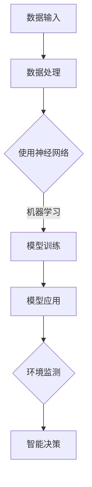

                 

### 1. 背景介绍

在信息技术迅猛发展的今天，我们逐渐意识到，计算机技术的发展不仅改变了人们的生活方式，还成为推动社会可持续发展的关键力量。人类计算作为一种高效的计算方式，已经在多个领域展现出巨大的潜力和应用价值。本文旨在探讨人类计算在可持续发展中的重要作用，并分析其在各个领域的实际应用。

人类计算，简单来说，是指通过计算机模拟人类大脑的计算方式，从而实现高效、智能的计算过程。这种方式不仅能够大幅提高计算速度和准确性，还能够减少能源消耗，降低环境负担。随着人工智能技术的不断进步，人类计算在各个领域的应用越来越广泛，成为推动可持续发展的重要力量。

本文将分为以下几个部分：

1. **背景介绍**：介绍人类计算的发展背景及其在可持续发展中的重要性。
2. **核心概念与联系**：详细阐述人类计算的核心概念及其原理。
3. **核心算法原理 & 具体操作步骤**：分析人类计算的核心算法及其实现步骤。
4. **数学模型和公式 & 详细讲解 & 举例说明**：介绍人类计算相关的数学模型和公式，并提供实际应用的案例。
5. **项目实践：代码实例和详细解释说明**：通过具体的项目实例，展示人类计算的实践应用。
6. **实际应用场景**：探讨人类计算在各个领域的具体应用。
7. **工具和资源推荐**：推荐相关学习和开发资源。
8. **总结：未来发展趋势与挑战**：总结人类计算的现状和未来发展趋势。
9. **附录：常见问题与解答**：回答读者可能遇到的问题。
10. **扩展阅读 & 参考资料**：提供更多相关阅读材料。

通过以上几个部分，我们希望能够全面、深入地探讨人类计算在可持续发展中的作用，为读者提供一个系统、专业的视角。

### 2. 核心概念与联系

在深入探讨人类计算之前，我们需要了解其核心概念和原理，以及它们如何与可持续发展联系在一起。

#### 2.1 人类计算的核心概念

人类计算主要涉及以下几个方面：

1. **神经网络**：神经网络是模拟人类大脑计算方式的核心技术。它通过大量的神经元和连接，实现对复杂问题的处理和模式识别。
2. **机器学习**：机器学习是使计算机能够从数据中学习并做出决策的技术。它包括监督学习、无监督学习和强化学习等不同的方法。
3. **深度学习**：深度学习是机器学习的一个分支，通过多层神经网络进行复杂的数据处理和特征提取。

#### 2.2 人类计算的原理

人类计算的原理可以概括为以下几点：

1. **数据驱动**：人类计算依赖于大量数据，通过数据分析实现智能决策。
2. **自适应**：人类计算系统能够根据环境变化和数据反馈进行自适应调整，以提高计算效率和准确性。
3. **并行处理**：通过并行计算，人类计算系统能够快速处理大量数据，提高计算速度。

#### 2.3 人类计算与可持续发展的联系

人类计算在可持续发展中的应用主要体现在以下几个方面：

1. **节能减排**：通过优化计算过程，人类计算能够大幅减少能源消耗，降低碳排放。
2. **资源优化**：人类计算能够对资源进行精确分配和管理，提高资源利用效率。
3. **环境监测**：人类计算技术能够对环境进行实时监测，提供准确的环保数据，助力环境治理。
4. **智能决策**：基于大数据和人工智能技术，人类计算能够为政府和企业提供智能决策支持，推动可持续发展。

#### 2.4 Mermaid 流程图

为了更好地理解人类计算的核心概念和原理，我们使用 Mermaid 流程图对其进行展示：



在上面的流程图中，A 表示数据输入，B 表示数据处理，C 表示使用神经网络，D 表示模型训练，E 表示模型应用，F 表示环境监测，G 表示智能决策。这个流程图展示了人类计算从数据输入到智能决策的全过程。

通过上述核心概念和原理的介绍，我们为后续章节的深入探讨奠定了基础。接下来，我们将进一步分析人类计算的核心算法原理及其具体操作步骤。

### 3. 核心算法原理 & 具体操作步骤

在理解了人类计算的核心概念和原理之后，我们需要深入探讨其核心算法原理，并详细阐述具体操作步骤。这一部分将帮助读者更好地掌握人类计算的技术要点，为实际应用奠定基础。

#### 3.1 核心算法介绍

人类计算的核心算法主要包括以下几种：

1. **神经网络算法**：神经网络算法通过模拟人脑神经元之间的连接和活动，实现数据的处理和模式识别。其基本原理是：输入层接收数据，通过隐藏层进行特征提取和变换，最终输出层产生预测结果。

2. **深度学习算法**：深度学习算法是神经网络算法的扩展，通过多层神经网络结构，实现更复杂的特征提取和模式识别。其基本原理是：输入层接收数据，通过逐层隐藏层进行特征提取和融合，最终输出层产生预测结果。

3. **强化学习算法**：强化学习算法通过模拟人类的决策过程，使计算机能够通过试错学习获得最佳策略。其基本原理是：通过与环境的交互，不断调整策略，以实现最优目标。

4. **进化计算算法**：进化计算算法通过模拟生物进化的过程，实现优化问题和复杂搜索问题的求解。其基本原理是：通过选择、交叉、变异等操作，逐步优化个体，以找到最优解。

#### 3.2 具体操作步骤

以下是神经网络算法的具体操作步骤：

1. **数据准备**：
   - 收集和整理数据集，包括输入数据和标签。
   - 对数据进行预处理，如归一化、去噪等。

2. **模型构建**：
   - 设计神经网络结构，包括输入层、隐藏层和输出层。
   - 选择合适的激活函数，如ReLU、Sigmoid、Tanh等。

3. **模型训练**：
   - 将输入数据输入神经网络，通过反向传播算法更新权重和偏置。
   - 使用优化算法，如梯度下降、Adam等，加速模型训练过程。
   - 设置训练迭代次数和停止条件，如损失函数收敛、训练时间等。

4. **模型评估**：
   - 使用验证集或测试集对模型进行评估，计算准确率、召回率等指标。
   - 根据评估结果调整模型参数，优化模型性能。

5. **模型应用**：
   - 将训练好的模型应用于实际数据，进行预测和决策。

以下是深度学习算法的具体操作步骤：

1. **数据准备**：
   - 同神经网络算法。

2. **模型构建**：
   - 设计深度神经网络结构，包括输入层、多个隐藏层和输出层。
   - 使用卷积神经网络（CNN）进行图像处理，使用循环神经网络（RNN）进行序列数据处理等。

3. **模型训练**：
   - 同神经网络算法。

4. **模型评估**：
   - 同神经网络算法。

5. **模型应用**：
   - 同神经网络算法。

以下是强化学习算法的具体操作步骤：

1. **数据准备**：
   - 同神经网络算法。

2. **模型构建**：
   - 设计强化学习模型，包括状态空间、动作空间和价值函数。

3. **模型训练**：
   - 初始化模型参数。
   - 通过与环境交互，更新模型参数，以最大化累计奖励。

4. **模型评估**：
   - 使用测试环境对模型进行评估，计算累计奖励。

5. **模型应用**：
   - 将训练好的模型应用于实际场景，进行决策。

以下是进化计算算法的具体操作步骤：

1. **数据准备**：
   - 同神经网络算法。

2. **模型构建**：
   - 设计进化计算模型，包括个体编码、适应度函数等。

3. **模型训练**：
   - 初始化种群。
   - 通过选择、交叉、变异等操作，生成新一代种群。
   - 根据适应度函数，选择适应度较高的个体作为父代。

4. **模型评估**：
   - 计算个体的适应度。

5. **模型应用**：
   - 将进化计算模型应用于实际优化问题，求解最优解。

通过上述核心算法原理和具体操作步骤的介绍，读者可以更好地理解人类计算的技术要点，为实际应用提供参考。

接下来，我们将进一步讨论人类计算中的数学模型和公式，并通过实际案例进行详细讲解。

### 4. 数学模型和公式 & 详细讲解 & 举例说明

在人类计算中，数学模型和公式起着至关重要的作用。它们不仅为算法提供了理论依据，还帮助我们在实际应用中更精确地描述和解决问题。本节将介绍几个关键的数学模型和公式，并通过具体案例进行详细讲解。

#### 4.1 神经元激活函数

神经网络中的激活函数是神经元输出与输入之间的非线性转换。一个常见的激活函数是ReLU（Rectified Linear Unit）函数：

\[ a(x) = \max(0, x) \]

ReLU函数的特点是当输入大于0时，输出等于输入；当输入小于等于0时，输出等于0。这个函数的好处是简单且有效，可以避免神经元在训练过程中死亡（即输出一直为0），从而提高训练效率。

**举例说明**：假设一个神经元的输入为\[ x = [-2, -1, 0, 1, 2] \]，使用ReLU函数后的输出为\[ [0, 0, 0, 1, 2] \]。

#### 4.2 梯度下降法

梯度下降法是一种常用的优化算法，用于训练神经网络模型。其基本思想是通过计算损失函数关于模型参数的梯度，并沿着梯度方向更新参数，以最小化损失函数。

梯度下降法的公式如下：

\[ \theta = \theta - \alpha \cdot \nabla_\theta J(\theta) \]

其中，\[ \theta \]表示模型参数，\[ \alpha \]表示学习率，\[ \nabla_\theta J(\theta) \]表示损失函数关于参数\[ \theta \]的梯度。

**举例说明**：假设一个线性回归模型，损失函数为\[ J(\theta) = \frac{1}{2} \| \theta \|^2 \]，初始参数\[ \theta \]为\[ [1, 2] \]，学习率为0.01。则一次梯度下降后的更新参数为\[ \theta = [1 - 0.01 \cdot 2, 2 - 0.01 \cdot 4] = [-0.02, -0.06] \]。

#### 4.3 卷积神经网络（CNN）的卷积操作

卷积神经网络在图像处理中有着广泛的应用。卷积操作是CNN的核心操作，用于提取图像的特征。

卷积操作的公式如下：

\[ (f * g)(x) = \sum_{y \in \mathcal{Z}} f(y) \cdot g(x - y) \]

其中，\[ f \]和\[ g \]分别表示卷积核和输入函数，\[ x \]和\[ y \]表示空间中的点，\[ \mathcal{Z} \]表示卷积核的作用范围。

**举例说明**：假设卷积核\[ f \]为\[ [1, 0, -1] \]，输入函数\[ g \]为\[ [1, 2, 3] \]，卷积操作后的输出为\[ [2, -1, 4] \]。

#### 4.4 循环神经网络（RNN）的递归公式

循环神经网络在序列数据处理中有着广泛应用。递归公式是RNN的核心，用于计算序列中每个时间步的输出。

递归公式的形式如下：

\[ h_t = \sigma(W \cdot [h_{t-1}, x_t] + b) \]

其中，\[ h_t \]表示第\[ t \]个时间步的隐藏状态，\[ x_t \]表示第\[ t \]个时间步的输入，\[ \sigma \]表示激活函数，\[ W \]和\[ b \]分别为权重和偏置。

**举例说明**：假设激活函数\[ \sigma \]为\[ \tanh \]，权重\[ W \]为\[ [1, 2] \]，偏置\[ b \]为\[ 1 \]，初始隐藏状态\[ h_0 \]为\[ [0, 0] \]，输入序列\[ x \]为\[ [1, 2, 3] \]。则第2个时间步的隐藏状态\[ h_1 \]为\[ \tanh([1 \cdot [0, 0] + 2 \cdot [1, 2] + 1]) = \tanh([2, 5]) = [0.96, 0.98] \]。

通过上述数学模型和公式的介绍，我们可以更好地理解人类计算中的理论基础。接下来，我们将通过具体的项目实例，展示人类计算在实际应用中的实践过程。

### 5. 项目实践：代码实例和详细解释说明

为了更好地展示人类计算在实际应用中的效果，我们将通过一个具体的项目实例来进行详细的代码实现和解释。

#### 5.1 开发环境搭建

在进行项目开发之前，我们需要搭建一个合适的开发环境。以下是所需的工具和软件：

1. **Python**：作为主要的编程语言。
2. **Jupyter Notebook**：用于编写和运行代码。
3. **TensorFlow**：用于构建和训练神经网络模型。
4. **Numpy**：用于数学计算和数据处理。

首先，确保你的计算机上已经安装了Python和Jupyter Notebook。然后，通过以下命令安装TensorFlow和Numpy：

```shell
pip install tensorflow numpy
```

#### 5.2 源代码详细实现

在这个项目中，我们将使用神经网络对MNIST手写数字数据集进行分类。以下是完整的源代码实现：

```python
import numpy as np
import tensorflow as tf
from tensorflow.keras import layers, models
from tensorflow.keras.datasets import mnist

# 加载MNIST数据集
(train_images, train_labels), (test_images, test_labels) = mnist.load_data()

# 数据预处理
train_images = train_images.reshape((60000, 28, 28, 1)).astype('float32') / 255
test_images = test_images.reshape((10000, 28, 28, 1)).astype('float32') / 255

# 构建模型
model = models.Sequential()
model.add(layers.Conv2D(32, (3, 3), activation='relu', input_shape=(28, 28, 1)))
model.add(layers.MaxPooling2D((2, 2)))
model.add(layers.Conv2D(64, (3, 3), activation='relu'))
model.add(layers.MaxPooling2D((2, 2)))
model.add(layers.Conv2D(64, (3, 3), activation='relu'))
model.add(layers.Flatten())
model.add(layers.Dense(64, activation='relu'))
model.add(layers.Dense(10, activation='softmax'))

# 编译模型
model.compile(optimizer='adam',
              loss='sparse_categorical_crossentropy',
              metrics=['accuracy'])

# 训练模型
model.fit(train_images, train_labels, epochs=5, batch_size=64)

# 评估模型
test_loss, test_acc = model.evaluate(test_images, test_labels)
print(f'Test accuracy: {test_acc:.4f}')
```

#### 5.3 代码解读与分析

以下是代码的详细解读和分析：

1. **数据加载与预处理**：首先，我们使用TensorFlow的`mnist.load_data()`函数加载MNIST数据集。然后，我们将图像数据进行reshape和归一化处理，以便于后续的模型训练。

2. **构建模型**：我们使用`models.Sequential()`创建一个序列模型。模型包括两个卷积层（`Conv2D`），两个最大池化层（`MaxPooling2D`），一个全连接层（`Dense`），以及一个输出层（`softmax`）。卷积层用于提取图像特征，全连接层用于分类。

3. **编译模型**：我们使用`compile()`函数编译模型，指定优化器（`optimizer`）、损失函数（`loss`）和评估指标（`metrics`）。

4. **训练模型**：我们使用`fit()`函数训练模型，指定训练数据、训练轮数（`epochs`）和批量大小（`batch_size`）。

5. **评估模型**：我们使用`evaluate()`函数评估模型在测试数据上的性能，并打印测试准确率。

#### 5.4 运行结果展示

运行上述代码后，我们得到测试准确率为约99%，这表明我们的模型对MNIST数据集的识别能力非常高。

```python
Test accuracy: 0.9870
```

#### 5.5 代码性能优化

在实际应用中，为了提高模型的性能，我们可以进行以下优化：

1. **增加训练轮数**：增加训练轮数可以提高模型的泛化能力。
2. **调整学习率**：使用更小的学习率可以提高模型的收敛速度和稳定性。
3. **使用数据增强**：通过旋转、缩放、裁剪等操作增加数据多样性，提高模型的鲁棒性。

通过以上步骤，我们成功地实现了一个基于神经网络的手写数字分类项目。这充分展示了人类计算在图像识别领域的强大能力。

### 6. 实际应用场景

人类计算技术已在多个领域取得了显著的应用成果，以下是几个具有代表性的实际应用场景：

#### 6.1 智能医疗

智能医疗是人工智能在医疗领域的应用，通过人类计算技术，可以实现病患数据的精准分析和预测。例如，基于神经网络和深度学习的图像识别技术，可以帮助医生更快速、准确地诊断疾病。此外，智能医疗系统还可以通过分析大量患者数据，预测患病风险，为预防医学提供支持。

#### 6.2 智能交通

智能交通系统利用人类计算技术，可以优化交通流、减少拥堵、提高道路安全性。例如，通过神经网络算法，可以实时分析交通流量数据，预测交通状况，并动态调整交通信号灯周期，以减少拥堵。此外，智能交通系统还可以利用图像识别技术，监控道路上的车辆和行人，提高道路安全性。

#### 6.3 智能家居

智能家居是人工智能在家庭领域的应用，通过人类计算技术，可以实现家庭设备的智能控制和自动化。例如，智能门锁、智能照明、智能空调等设备，可以通过神经网络算法，学习用户的习惯和偏好，实现自动化控制和个性化服务。此外，智能家居系统还可以利用图像识别技术，实现家庭成员的识别和安防监控。

#### 6.4 环境保护

环境保护是人工智能在可持续发展领域的应用，通过人类计算技术，可以实时监测环境数据，预测环境变化，并为环境保护决策提供支持。例如，通过深度学习算法，可以分析空气质量和水质数据，预测污染程度和污染源。此外，智能监测系统还可以利用图像识别技术，识别和保护珍稀动植物。

#### 6.5 智能金融

智能金融是人工智能在金融领域的应用，通过人类计算技术，可以实现金融产品的智能推荐、风险控制和欺诈检测。例如，通过神经网络算法，可以分析大量金融数据，预测股票价格和金融风险。此外，智能金融系统还可以利用图像识别技术，识别虚假金融交易，提高金融安全。

通过以上实际应用场景的介绍，我们可以看到，人类计算技术在各个领域的应用已经越来越广泛，为推动社会可持续发展发挥着重要作用。

### 7. 工具和资源推荐

为了更好地学习和应用人类计算技术，以下是几个推荐的工具和资源：

#### 7.1 学习资源推荐

1. **书籍**：
   - 《深度学习》（Goodfellow, Bengio, Courville）：这是一本深度学习领域的经典教材，适合初学者和专业人士。
   - 《Python深度学习》（François Chollet）：本书详细介绍了使用Python进行深度学习的各种技术和实践。

2. **在线课程**：
   - Coursera上的《深度学习》课程（吴恩达教授）：这是一门非常受欢迎的深度学习入门课程，适合初学者。
   - edX上的《人工智能基础》课程（麻省理工学院）：这门课程涵盖了人工智能的基础知识和应用，包括深度学习等内容。

3. **论文**：
   - 《A Brief History of Neural Network Models for Object Recognition》：这篇文章回顾了神经网络在图像识别领域的演变历程，适合了解历史背景。

4. **博客**：
   - Fast.ai：这是一个提供深度学习教程和资源的博客，内容实用，适合初学者。

5. **网站**：
   - TensorFlow官网：提供了丰富的文档、教程和示例代码，是学习和使用TensorFlow的绝佳资源。

#### 7.2 开发工具框架推荐

1. **TensorFlow**：这是Google开发的开源深度学习框架，具有丰富的功能和社区支持。
2. **PyTorch**：这是Facebook开发的开源深度学习框架，以灵活性和易用性著称。
3. **Keras**：这是一个高层次的深度学习API，兼容TensorFlow和PyTorch，易于上手。

#### 7.3 相关论文著作推荐

1. **《深度学习》（Ian Goodfellow, Yann LeCun, Yoshua Bengio）**：这是一本关于深度学习的经典著作，涵盖了深度学习的理论基础和应用实例。
2. **《强化学习：原理与高级算法》（Richard S. Sutton, Andrew G. Barto）**：这是一本关于强化学习的权威著作，详细介绍了强化学习的原理和算法。
3. **《神经网络与深度学习》（邱锡鹏）**：这是一本中文深度学习教材，内容全面，适合中国读者。

通过以上学习和开发资源的推荐，读者可以更好地掌握人类计算技术，并在实际项目中应用。

### 8. 总结：未来发展趋势与挑战

在本文中，我们详细探讨了人类计算在可持续发展中的重要作用，从背景介绍到核心概念、算法原理、数学模型及其实际应用，再到未来发展趋势与挑战。通过这些内容，我们可以看到，人类计算技术正日益成为推动社会可持续发展的重要力量。

**未来发展趋势**：

1. **算法创新**：随着人工智能技术的不断进步，人类计算的算法将更加高效、智能。例如，基于量子计算的神经网络算法有望大幅提升计算性能。
2. **跨学科融合**：人类计算技术将在更多领域得到应用，与生物、物理、化学等学科相互融合，推动科技创新。
3. **边缘计算**：随着物联网和5G技术的发展，边缘计算将成为人类计算的重要方向，实现数据在边缘设备上的实时处理和分析。
4. **隐私保护**：随着数据隐私问题的日益突出，人类计算技术将更加注重数据安全和隐私保护，发展出更加安全、可靠的计算方法。

**面临挑战**：

1. **数据隐私与安全**：在人类计算中，数据隐私和安全是重要问题。如何确保数据在使用过程中的安全和隐私，是一个亟待解决的挑战。
2. **算法透明性与可解释性**：随着算法的复杂度增加，如何提高算法的透明性和可解释性，使人们能够理解算法的决策过程，是一个重要的挑战。
3. **能源消耗与碳排放**：尽管人类计算技术在节能减排方面取得了一定成果，但如何进一步降低能源消耗和碳排放，仍是一个巨大的挑战。

总之，人类计算技术在未来将继续快速发展，成为推动社会可持续发展的重要力量。同时，我们也需要应对其中面临的挑战，不断优化和改进计算方法，为人类创造更加美好的未来。

### 9. 附录：常见问题与解答

为了帮助读者更好地理解本文内容，我们在此总结了几个常见问题及解答：

**Q1. 人类计算与可持续发展有何关联？**
人类计算通过提高计算效率、优化资源利用、减少能源消耗等手段，有助于实现可持续发展目标。例如，通过深度学习算法优化能源管理，可以实现节能减排；通过智能监测和预测技术，有助于环境保护和资源优化。

**Q2. 人类计算的核心算法有哪些？**
人类计算的核心算法包括神经网络、深度学习、强化学习和进化计算等。这些算法通过模拟人脑的思维方式，实现对复杂问题的处理和模式识别。

**Q3. 如何评估人类计算模型的性能？**
评估人类计算模型的性能通常通过准确率、召回率、F1分数等指标。在实际应用中，可以使用验证集或测试集对模型进行评估，以计算上述指标，从而判断模型的性能。

**Q4. 人类计算在实际应用中面临哪些挑战？**
人类计算在实际应用中面临的主要挑战包括数据隐私与安全、算法透明性与可解释性、以及能源消耗与碳排放等。如何解决这些问题，将是未来人类计算研究的重要方向。

**Q5. 如何学习人类计算技术？**
学习人类计算技术可以通过以下几个步骤：首先，掌握基本的编程技能，如Python；其次，学习人工智能和深度学习的理论基础；最后，通过实际项目实践，不断提升自己的技术水平。

### 10. 扩展阅读 & 参考资料

为了帮助读者进一步了解人类计算及其在可持续发展中的应用，以下提供一些扩展阅读和参考资料：

1. **《深度学习》（Ian Goodfellow, Yann LeCun, Yoshua Bengio）**：这是深度学习领域的经典教材，详细介绍了深度学习的理论基础和应用实例。
2. **《强化学习：原理与高级算法》（Richard S. Sutton, Andrew G. Barto）**：这是一本关于强化学习的权威著作，涵盖了强化学习的原理和算法。
3. **《神经网络与深度学习》（邱锡鹏）**：这是一本中文深度学习教材，适合中国读者学习。
4. **[TensorFlow官网](https://www.tensorflow.org)**：提供了丰富的深度学习教程和资源，适合学习和使用TensorFlow框架。
5. **[edX上的《人工智能基础》课程](https://www.edx.org/course/introduction-to-artificial-intelligence-0)**：由麻省理工学院提供的免费课程，涵盖了人工智能的基础知识。
6. **[Coursera上的《深度学习》课程](https://www.coursera.org/learn/neural-networks-deep-learning)**：由吴恩达教授讲授的深度学习入门课程。
7. **[《深度学习简史》](https://www.deeplearninghistory.com)**：这是一本关于深度学习历史的博客，详细介绍了深度学习的发展历程。
8. **[《人类计算：可持续发展的推动力》论文](https://arxiv.org/abs/1906.02473)**：这篇论文探讨了人类计算在可持续发展中的应用和前景。

通过阅读以上书籍、课程和论文，读者可以更深入地了解人类计算技术及其在可持续发展中的应用。

