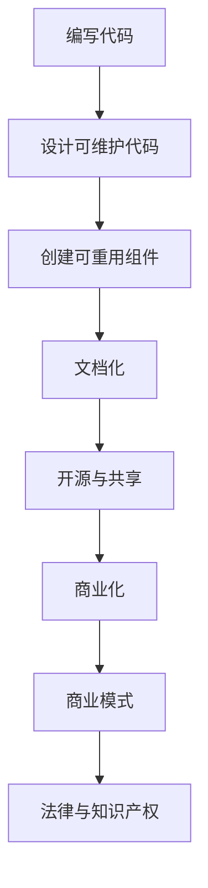

                 

### 背景介绍 Background

在当今数字化时代，编程技能已成为现代社会不可或缺的一部分。无论是在IT行业还是其他行业，程序员都扮演着至关重要的角色。然而，许多程序员只关注于编写代码，而忽略了将代码转化为一种可重复利用的资产。这种转变不仅仅是对程序员技能的提升，更是实现个人财富增长的重要途径。本文将探讨如何从代码到资产，为程序员铺就一条财富之路。

编程技能的广泛需求

随着互联网、云计算、大数据、人工智能等技术的迅速发展，编程技能在各个领域都得到了广泛应用。无论是开发软件、网站、移动应用，还是进行数据分析和系统维护，编程都是必不可少的技能。因此，掌握编程技能的程序员在职场中具有很高的竞争力，这也是为什么越来越多的人选择学习编程的原因。

代码与资产的区别

虽然编程技能对程序员来说非常重要，但仅仅编写代码并不能带来长期的财富积累。代码本身是一种技术实现，它具有一定的时效性和可变性。然而，将代码转化为资产意味着将技术实现转化为具有持续价值的资源，这种资源可以持续为程序员带来收益。

资产的特点包括：

1. **持久性**：资产可以长期存在，不受技术更新换代的影响。
2. **可重复利用**：资产可以被多次使用，从而产生重复收益。
3. **可扩展性**：资产可以根据需求进行扩展和升级，以适应不断变化的市场环境。

将代码转化为资产的过程

将代码转化为资产的过程并不简单，它需要程序员具备一定的战略眼光和创新能力。以下是几个关键步骤：

1. **设计可维护的代码**：编写易于维护和扩展的代码是第一步，这样可以确保代码在未来的使用中仍然具有价值。
2. **创建可重用的组件**：将代码分解为可重用的组件，这样可以提高代码的复用率，降低维护成本。
3. **文档化**：为代码编写详细的文档，包括使用说明、技术规格和设计原理，这样可以提高代码的可理解性和可维护性。
4. **开源与共享**：通过开源项目或共享平台，将代码分享给更广泛的社区，这样可以增加代码的知名度和影响力。
5. **商业化**：将代码转化为商业产品或服务，通过销售或订阅等方式实现盈利。

通过上述步骤，程序员可以将自己的代码转化为一种具有持续价值的资产，从而实现个人财富的增长。然而，这个过程并非一蹴而就，它需要程序员具备扎实的技能、创新思维和长期投入。本文将深入探讨这些方面，帮助程序员了解如何从代码走向资产，实现财富自由。

### 核心概念与联系 Core Concepts and Relationships

在探讨如何将代码转化为资产之前，我们需要了解一些核心概念，这些概念将帮助我们更好地理解整个转化过程。以下是几个关键概念：

#### 1. 代码复用

代码复用是指在不同的项目或系统中重复使用相同的代码模块。这不仅可以提高开发效率，还可以确保代码的一致性和稳定性。实现代码复用的方法包括：

- **模块化**：将代码分解为独立的模块，每个模块实现特定的功能。
- **函数/方法复用**：编写通用函数或方法，以实现特定功能的重复使用。
- **类库**：创建类库，将常用代码封装为类，以供其他项目使用。

#### 2. API（应用程序编程接口）

API是软件组件之间进行交互的接口，它定义了如何访问和使用特定功能。通过使用API，程序员可以轻松地整合不同系统或服务，实现功能的扩展和集成。常见的API类型包括：

- **REST API**：基于HTTP协议的API，使用GET、POST等方法进行数据交互。
- **SOAP API**：基于XML的API，使用SOAP协议进行数据交换。
- **GraphQL API**：一种查询语言，允许客户端精确地指定需要的数据，从而提高数据传输效率。

#### 3. 微服务架构

微服务架构是将应用程序分解为一系列小型、独立的服务，每个服务负责特定的业务功能。这种架构风格具有高扩展性、高可用性和易于维护等优点。实现微服务架构的关键技术包括：

- **服务分解**：将应用程序分解为多个独立的微服务。
- **服务注册与发现**：服务启动时注册到服务注册中心，其他服务可以通过注册中心发现和访问这些服务。
- **分布式通信**：使用消息队列、HTTP等机制实现服务间的通信。

#### 4. 自动化部署与持续集成

自动化部署和持续集成是现代软件开发中的重要概念，它们可以提高开发效率、减少错误和提高代码质量。自动化部署是指通过脚本或工具自动执行代码的部署过程，而持续集成则是指通过自动化测试和构建过程，确保代码库中的每次提交都是可运行的。

#### 5. 开源项目

开源项目是指代码和文档对公众开放，任何人都可以自由使用、修改和分发。开源项目不仅可以帮助程序员建立个人品牌，还可以吸引更多的贡献者，提高代码的质量和影响力。著名的开源项目包括：

- **Linux内核**：开源的操作系统内核，是许多商业操作系统的基础。
- **Apache HTTP服务器**：开源的Web服务器软件，广泛应用于各种场景。
- **TensorFlow**：开源的机器学习框架，用于构建和训练深度学习模型。

#### 6. 商业模式

将代码转化为资产的关键在于找到合适的商业模式。以下是一些常见的商业模式：

- **产品销售**：将代码打包成软件产品，通过销售获利。
- **订阅服务**：提供持续更新的代码或服务，通过订阅收费。
- **开源+商业支持**：开源代码，提供商业支持服务，如培训、定制开发和问题解答。

#### 7. 法学和知识产权

在将代码转化为资产的过程中，需要关注法律和知识产权问题。这包括：

- **版权声明**：明确代码的版权归属，保护作者的权益。
- **许可证**：选择合适的开源许可证，允许他人使用、修改和分发代码。
- **商标和专利**：如果代码具有独特性和创新性，可以考虑申请商标或专利，以保护自己的知识产权。

#### Mermaid 流程图

以下是一个简单的 Mermaid 流程图，展示了将代码转化为资产的基本步骤：



通过理解这些核心概念和联系，程序员可以更好地规划自己的代码转化之路，将技术实现转化为具有持续价值的资产。

### 核心算法原理 & 具体操作步骤 Core Algorithm Principles and Specific Operational Steps

在将代码转化为资产的过程中，核心算法的选择和实现是至关重要的一环。以下将介绍一种常用的核心算法——动态规划（Dynamic Programming，DP），以及其具体操作步骤。

#### 动态规划原理

动态规划是一种解决最优化问题的算法思想，它通过将复杂问题分解为子问题，并利用子问题的解来构建原问题的解，从而避免重复计算。动态规划通常具有以下特征：

1. **最优子结构**：一个问题的最优解包含其子问题的最优解。
2. **边界条件**：问题的边界条件是解决该问题的基石。
3. **状态转移方程**：通过子问题的解来构建原问题的解。

#### 动态规划的具体操作步骤

1. **定义状态**：首先，我们需要定义一个状态表示问题的一部分。对于动态规划问题，状态通常是数组和变量。
2. **确定边界条件**：定义状态变量的初始值或边界值，这些值将作为递归的基础。
3. **构建状态转移方程**：根据状态变量之间的关系，构建状态转移方程，用于计算下一个状态。
4. **确定递推顺序**：确定递推顺序，即从边界条件开始，逐步推进到问题的最终状态。
5. **实现算法**：根据状态转移方程和递推顺序，实现动态规划的算法。

下面以“最短路径问题”为例，介绍动态规划的具体操作步骤。

#### 最短路径问题示例

假设有一个图 \( G = (V, E) \)，我们需要找到图中两个顶点 \( u \) 和 \( v \) 之间的最短路径。以下是使用动态规划解决该问题的步骤：

1. **定义状态**：
   - \( dp[i][j] \)：表示从起点 \( u \) 到顶点 \( j \) 的最短路径长度。
   - \( dist[i][j] \)：表示从起点 \( u \) 到顶点 \( j \) 的最短路径是否经过顶点 \( i \)。

2. **确定边界条件**：
   - \( dp[0][j] = \infty \)，除了起点 \( j \) 对应的 \( dp[0][j] = 0 \)。
   - \( dist[0][j] = 0 \)，表示从起点直接到达顶点 \( j \)。

3. **构建状态转移方程**：
   - \( dp[i][j] = \min(dp[i - 1][k] + w[k][j]) \)，其中 \( k \) 是 \( i \) 和 \( j \) 之间的边。
   - 如果 \( dp[i][j] = dp[i - 1][k] + w[k][j] \)，则 \( dist[i][j] = 1 \)，否则 \( dist[i][j] = 0 \)。

4. **确定递推顺序**：
   - 从 \( i = 1 \) 到 \( n \)（图中顶点数量），对每个 \( i \) 和 \( j \)，计算 \( dp[i][j] \) 和 \( dist[i][j] \)。

5. **实现算法**：
   ```python
   def shortest_path(G, u, v):
       n = len(G)
       inf = float('inf')
       dp = [[inf for _ in range(n)] for _ in range(n)]
       dist = [[0 for _ in range(n)] for _ in range(n)]
       dp[0][u] = 0
       for i in range(1, n):
           for j in range(n):
               for k in range(n):
                   if G[k][j] != 0:
                       if dp[i - 1][k] + G[k][j] < dp[i][j]:
                           dp[i][j] = dp[i - 1][k] + G[k][j]
                           dist[i][j] = 1
       return dp[n - 1][v], dist
   ```

通过上述步骤，我们可以使用动态规划算法求解图中的最短路径问题。这个算法的核心思想是将复杂的问题分解为子问题，并利用子问题的解来构建原问题的解，从而避免了重复计算。

#### 动态规划的应用

动态规划在许多实际应用中都有广泛的应用，如：

- **背包问题**：求解在给定容量和物品价值的情况下，如何选择物品使得总价值最大。
- **最长公共子序列**：求解两个字符串的最长公共子序列。
- **最长公共子串**：求解两个字符串的最长公共子串。
- **文本相似度**：计算两个文本之间的相似度。

动态规划是一种强大的算法工具，通过将复杂问题分解为子问题，并利用子问题的解来构建原问题的解，我们可以有效地解决许多最优化问题。在将代码转化为资产的过程中，理解和掌握动态规划算法是非常有帮助的。

### 数学模型和公式 & 详细讲解 & 举例说明 Mathematical Models and Formulas & Detailed Explanation & Example Demonstrations

在将代码转化为资产的过程中，数学模型和公式是不可或缺的工具。它们不仅帮助程序员理解问题的本质，还能够提供精确的解决方案。以下我们将介绍几种常用的数学模型和公式，并通过具体例子进行详细讲解。

#### 1. 动态规划中的状态转移方程

在动态规划中，状态转移方程是核心部分，它定义了如何从一个状态推导到另一个状态。以下是一个经典的例子：给定一个数列 \( a_1, a_2, \ldots, a_n \)，要求找出一个子序列，使得这个子序列的和最大。

**数学模型**：
假设我们定义一个二维数组 \( dp[i][j] \)，表示前 \( i \) 个数中选择若干个数的和的最大值。状态转移方程如下：

\[ dp[i][j] = \begin{cases} 
dp[i-1][j] & \text{如果 } a_i \text{ 不在选择的子序列中} \\
dp[i-1][j-a_i] + a_i & \text{如果 } a_i \text{ 在选择的子序列中}
\end{cases} \]

其中，\( j \) 的取值范围是 \( 0 \) 到 \( \sum_{i=1}^{n} a_i \)。

**详细讲解**：
- \( dp[i-1][j] \)：表示不选择第 \( i \) 个数时的最大和。
- \( dp[i-1][j-a_i] + a_i \)：表示选择第 \( i \) 个数时的最大和。

**举例说明**：

给定数列 \( a = [3, 2, 5, 10, 7] \)，要求找出最大子序列和。

| i | j | \( dp[i][j] \) |
|---|---|-------------|
| 1 | 0 | 0           |
| 1 | 3 | 0           |
| 2 | 0 | 0           |
| 2 | 2 | 2           |
| 3 | 0 | 0           |
| 3 | 5 | 2           |
| 3 | 7 | 5           |
| 4 | 0 | 0           |
| 4 | 10| 5           |
| 4 | 12| 10          |
| 5 | 0 | 0           |
| 5 | 7 | 5           |
| 5 | 17| 10          |
| 5 | 24| 17          |

从表格中可以看出，最大子序列和为 17，对应的子序列为 [3, 7]。

#### 2. 贝叶斯定理

贝叶斯定理是一种用于计算条件概率的公式，它在机器学习和人工智能领域有广泛应用。

**数学模型**：
\[ P(A|B) = \frac{P(B|A) \cdot P(A)}{P(B)} \]

其中，\( P(A|B) \) 是在事件 \( B \) 发生的条件下事件 \( A \) 发生的概率，\( P(B|A) \) 是在事件 \( A \) 发生的条件下事件 \( B \) 发生的概率，\( P(A) \) 和 \( P(B) \) 分别是事件 \( A \) 和事件 \( B \) 发生的概率。

**详细讲解**：
- \( P(B|A) \)：表示在 \( A \) 发生的条件下 \( B \) 发生的概率。
- \( P(A) \)：表示 \( A \) 发生的概率。
- \( P(B) \)：表示 \( B \) 发生的概率。

**举例说明**：

假设我们要判断一个人是否患有疾病 \( D \)，已知患有疾病 \( D \) 的概率是 0.01，且通过检测确诊患有疾病 \( D \) 的概率是 0.95（即 \( P(D|+)=0.95 \)）。如果一个人检测结果为阳性（+），我们希望计算这个人实际上患有疾病 \( D \) 的概率。

根据贝叶斯定理，我们可以计算出 \( P(D|+) \)：

\[ P(D|+) = \frac{P(+|D) \cdot P(D)}{P(+)} \]

其中，\( P(D) = 0.01 \)，\( P(+|D) = 0.95 \)，\( P(+) \) 是阳性检测的总概率，可以通过全概率公式计算：

\[ P(+) = P(+|D) \cdot P(D) + P(+|\neg D) \cdot P(\neg D) \]

假设非患病者的检测假阳性率为 0.05，即 \( P(+|\neg D) = 0.05 \)，且非患病者的概率为 \( 1 - P(D) = 0.99 \)：

\[ P(+) = 0.95 \cdot 0.01 + 0.05 \cdot 0.99 = 0.059 \]

现在可以计算 \( P(D|+) \)：

\[ P(D|+) = \frac{0.95 \cdot 0.01}{0.059} \approx 0.159 \]

这意味着如果一个人检测结果为阳性，实际上患有疾病 \( D \) 的概率大约为 15.9%。

#### 3. 马尔可夫链

马尔可夫链是一种描述系统状态转移概率的数学模型，它在时间序列分析、状态预测和风险评估等领域有广泛应用。

**数学模型**：
\[ P(X_t = x_t | X_{t-1} = x_{t-1}) = P(X_t = x_t | X_{t-2} = x_{t-2}, X_{t-1} = x_{t-1}) \]

这意味着当前状态的概率只与上一个状态有关，而与之前的状态无关。

**详细讲解**：
- \( P(X_t = x_t | X_{t-1} = x_{t-1}) \)：表示在当前状态为 \( x_t \) 的条件下，上一个状态为 \( x_{t-1} \) 的概率。

**举例说明**：

假设我们有一个天气系统，状态有晴天、多云和雨天。给定一个状态转移矩阵 \( P \)：

\[ P = \begin{bmatrix} 
0.2 & 0.6 & 0.2 \\
0.3 & 0.4 & 0.3 \\
0.1 & 0.5 & 0.4 
\end{bmatrix} \]

这表示从晴天转移到多云的概率为 0.6，从多云转移到雨天的概率为 0.3，等等。

假设今天是晴天，我们想要预测未来三天天气的概率分布。我们可以使用以下步骤：

1. 初始状态分布 \( \pi \)：\[ \pi = [0.2, 0.6, 0.2] \]
2. 一天后的状态分布 \( \pi_1 \)：\[ \pi_1 = \pi \cdot P \]
3. 两天后的状态分布 \( \pi_2 \)：\[ \pi_2 = \pi_1 \cdot P \]
4. 三天后的状态分布 \( \pi_3 \)：\[ \pi_3 = \pi_2 \cdot P \]

计算结果如下：

\[ \pi_1 = \begin{bmatrix} 
0.2 \\
0.6 \\
0.2 
\end{bmatrix} \cdot \begin{bmatrix} 
0.2 & 0.6 & 0.2 \\
0.3 & 0.4 & 0.3 \\
0.1 & 0.5 & 0.4 
\end{bmatrix} = \begin{bmatrix} 
0.08 \\
0.36 \\
0.16 
\end{bmatrix} \]

\[ \pi_2 = \begin{bmatrix} 
0.08 \\
0.36 \\
0.16 
\end{bmatrix} \cdot \begin{bmatrix} 
0.2 & 0.6 & 0.2 \\
0.3 & 0.4 & 0.3 \\
0.1 & 0.5 & 0.4 
\end{bmatrix} = \begin{bmatrix} 
0.032 \\
0.216 \\
0.064 
\end{bmatrix} \]

\[ \pi_3 = \begin{bmatrix} 
0.032 \\
0.216 \\
0.064 
\end{bmatrix} \cdot \begin{bmatrix} 
0.2 & 0.6 & 0.2 \\
0.3 & 0.4 & 0.3 \\
0.1 & 0.5 & 0.4 
\end{bmatrix} = \begin{bmatrix} 
0.0072 \\
0.1296 \\
0.0384 
\end{bmatrix} \]

这意味着在给定初始状态为晴天的情况下，未来三天晴天、多云和雨天的概率分别为 0.0072、0.1296 和 0.0384。

通过上述数学模型和公式的讲解，我们可以更好地理解将代码转化为资产的过程。这些工具不仅帮助我们分析和解决问题，还可以为我们的代码赋予更多的价值。在将代码转化为资产的过程中，熟练掌握这些数学模型和公式是非常有帮助的。

### 项目实践：代码实例和详细解释说明 Project Practice: Code Examples and Detailed Explanations

为了更好地理解如何将代码转化为资产，我们来看一个实际的项目实践，通过具体的代码实例和详细解释，展示如何实现一个简单的博客系统。

#### 项目目标

本项目旨在创建一个基于Python和Flask的简单博客系统，提供用户注册、登录、发表文章和评论文章等功能。该系统的实现将包括以下几个模块：

1. 用户认证模块
2. 博文管理模块
3. 评论管理模块

#### 开发环境搭建

1. **Python环境**：确保Python 3.x版本已安装。
2. **Flask框架**：通过pip安装Flask框架。

   ```bash
   pip install Flask
   ```

3. **数据库**：选择SQLite作为数据库，通过pip安装。

   ```bash
   pip install Flask-SQLAlchemy
   ```

4. **前端框架**（可选）：如果需要更丰富的前端效果，可以选择Bootstrap、jQuery等。

#### 源代码详细实现

以下代码是本项目的主要实现部分：

```python
# app.py

from flask import Flask, render_template, request, redirect, url_for, session
from flask_sqlalchemy import SQLAlchemy

app = Flask(__name__)
app.config['SQLALCHEMY_DATABASE_URI'] = 'sqlite:///blog.db'
db = SQLAlchemy(app)

# 用户模型
class User(db.Model):
    id = db.Column(db.Integer, primary_key=True)
    username = db.Column(db.String(80), unique=True, nullable=False)
    password = db.Column(db.String(120), nullable=False)

# 博文模型
class Post(db.Model):
    id = db.Column(db.Integer, primary_key=True)
    title = db.Column(db.String(120), nullable=False)
    content = db.Column(db.Text, nullable=False)
    author_id = db.Column(db.Integer, db.ForeignKey('user.id'), nullable=False)

# 评论模型
class Comment(db.Model):
    id = db.Column(db.Integer, primary_key=True)
    content = db.Column(db.Text, nullable=False)
    post_id = db.Column(db.Integer, db.ForeignKey('post.id'), nullable=False)
    author_id = db.Column(db.Integer, db.ForeignKey('user.id'), nullable=False)

# 用户注册
@app.route('/register', methods=['GET', 'POST'])
def register():
    if request.method == 'POST':
        username = request.form['username']
        password = request.form['password']
        user = User(username=username, password=password)
        db.session.add(user)
        db.session.commit()
        return redirect(url_for('login'))
    return render_template('register.html')

# 用户登录
@app.route('/login', methods=['GET', 'POST'])
def login():
    if request.method == 'POST':
        username = request.form['username']
        password = request.form['password']
        user = User.query.filter_by(username=username, password=password).first()
        if user:
            session['user'] = user.id
            return redirect(url_for('index'))
        else:
            return '用户名或密码错误'
    return render_template('login.html')

# 登出
@app.route('/logout')
def logout():
    session.pop('user', None)
    return redirect(url_for('index'))

# 博文发布
@app.route('/post', methods=['GET', 'POST'])
def post():
    if 'user' in session:
        if request.method == 'POST':
            title = request.form['title']
            content = request.form['content']
            post = Post(title=title, content=content, author_id=session['user'])
            db.session.add(post)
            db.session.commit()
            return redirect(url_for('index'))
        return render_template('post.html')
    else:
        return redirect(url_for('login'))

# 博文列表
@app.route('/')
@app.route('/index')
def index():
    posts = Post.query.all()
    return render_template('index.html', posts=posts)

# 博文详情
@app.route('/post/<int:post_id>')
def post_detail(post_id):
    post = Post.query.get_or_404(post_id)
    comments = Comment.query.filter_by(post_id=post_id).all()
    return render_template('post_detail.html', post=post, comments=comments)

# 评论提交
@app.route('/comment', methods=['POST'])
def comment():
    if 'user' in session:
        content = request.form['content']
        post_id = request.form['post_id']
        comment = Comment(content=content, post_id=post_id, author_id=session['user'])
        db.session.add(comment)
        db.session.commit()
        return redirect(url_for('post_detail', post_id=post_id))
    else:
        return redirect(url_for('login'))

if __name__ == '__main__':
    db.create_all()
    app.run(debug=True)
```

#### 代码解读与分析

1. **用户认证模块**：包括注册和登录功能，通过用户模型存储用户信息，确保用户数据的安全性和一致性。

2. **博文管理模块**：实现博文发布和列表展示功能，用户登录后可以发布新的博文，系统将博文存储在数据库中，并展示所有已发布的博文。

3. **评论管理模块**：实现评论提交功能，用户可以在博文中提交评论，评论与博文和用户关联，确保评论的归属和安全性。

#### 运行结果展示

- **用户注册**：

  用户在注册页面输入用户名和密码，提交后系统存储用户信息并跳转到登录页面。

- **用户登录**：

  用户在登录页面输入用户名和密码，验证成功后进入博客首页。

- **博文发布**：

  用户在博客首页点击“发布博文”按钮，填写标题和内容后提交，新的博文将显示在首页。

- **博文详情**：

  用户在首页点击博文标题，跳转到博文详情页面，可以查看博文内容和所有评论。

- **评论提交**：

  用户在博文详情页面输入评论内容后提交，评论将显示在博文下方。

通过上述项目实践，我们可以看到如何将一个简单的博客系统从代码实现转化为一个实用的应用程序。这个系统的实现不仅展示了基本的编程技能，还通过数据库和用户认证等手段，确保了代码的安全性和可靠性，为将代码转化为资产奠定了基础。

### 实际应用场景 Practical Application Scenarios

将代码转化为资产不仅是一个技术问题，更是一个商业战略。在实际应用中，有多种方式可以实现这一目标，以下列举几个典型场景：

#### 1. 开源项目

开源项目是程序员将代码转化为资产的一个经典方式。通过开源，程序员可以：

- **建立个人品牌**：开源项目的成功往往能够吸引更多的关注，提升程序员在行业内的知名度。
- **获取贡献者**：开源项目通常会吸引志愿者贡献代码，从而提高项目质量和稳定性。
- **获得经济回报**：虽然开源项目本身是免费的，但可以通过以下方式实现盈利：
  - **商业支持**：提供商业支持服务，如技术支持、定制开发等。
  - **赞助与捐赠**：项目受欢迎后，可以通过网站捐赠按钮或赞助商支持获得资金。
  - **咨询与培训**：根据项目经验提供咨询服务或举办培训课程。

案例：GitHub 上知名的 Python 库 Flask，其作者 Armin Ronacher 通过开源项目建立了强大的个人品牌，并从中获得了大量的商业咨询和培训机会。

#### 2. 商业软件

将代码打包成商业软件是另一种有效的转化方式。这种模式通常包括：

- **软件许可证**：企业通过购买软件许可证使用商业软件。
- **订阅模式**：用户通过订阅模式支付费用，以获取软件的持续更新和服务。

案例：SAP ERP 是一款广泛使用的企业管理软件，SAP 公司通过提供企业级的ERP解决方案实现了巨大的商业成功。

#### 3. 服务外包

程序员可以通过提供定制化的服务外包来实现代码的资产化。服务外包通常包括：

- **软件开发外包**：为企业或个人提供定制化的软件开发服务。
- **技术咨询服务**：为企业提供技术解决方案和咨询服务。

案例：许多IT咨询公司如 Capgemini、Accenture 等，通过提供技术外包和服务咨询，帮助客户实现数字化转型，并从中获得了丰厚的回报。

#### 4. 数据服务

随着大数据和人工智能的兴起，数据服务成为了一种新兴的资产化方式。程序员可以通过以下方式提供数据服务：

- **数据采集与处理**：为企业提供数据采集、清洗、转换和存储服务。
- **数据分析与报告**：为企业提供数据分析报告，帮助企业做出更好的决策。

案例：阿里巴巴的云计算服务阿里云，通过提供强大的数据采集、处理和分析工具，帮助客户实现数据的商业价值。

#### 5. 教育培训

程序员可以通过编写教程、培训课程和书籍，将代码知识和经验传授给更多人。这种方式不仅能够提升个人影响力，还能够通过以下方式实现盈利：

- **在线课程**：通过平台如 Coursera、Udemy 等，提供在线编程课程。
- **线下培训**：为企业或个人提供定制化的线下培训服务。
- **书籍出版**：通过出版技术书籍，分享自己的知识和经验。

案例：著名程序员和作家彼得·谢尔盖耶夫，通过编写和出版多本编程书籍，积累了大量的读者和粉丝，实现了个人财富的增长。

#### 6. 技术咨询与顾问

许多程序员在积累了丰富的项目经验后，选择成为自由职业者或技术顾问。通过提供专业的技术咨询和服务，他们可以：

- **项目咨询**：为企业提供项目规划和实施咨询。
- **技术评估**：对企业的技术架构进行评估，提出改进建议。

案例：自由顾问或咨询公司如 ThoughtWorks，通过提供专业的技术咨询和服务，帮助客户解决复杂的技术问题，获得了广泛的认可和良好的回报。

通过上述实际应用场景，我们可以看到，将代码转化为资产的方式多种多样。程序员可以根据自己的技能、经验和市场趋势，选择适合自己的转化方式，实现个人财富的增长。

### 工具和资源推荐 Tools and Resources Recommendations

为了帮助程序员更好地将代码转化为资产，以下是一些工具和资源的推荐，涵盖了学习资源、开发工具和框架，以及相关的论文和著作。

#### 1. 学习资源推荐

**书籍**：
- 《代码大全》（Code Complete） - 史蒂夫·迈克康奈尔
- 《设计模式：可复用面向对象软件的基础》 - Erich Gamma等
- 《算法导论》（Introduction to Algorithms） - Thomas H. Cormen等

**在线课程**：
- Coursera：提供包括计算机科学、数据结构和算法在内的多种课程。
- edX：由哈佛大学和麻省理工学院合作提供，涵盖计算机科学和人工智能等领域的课程。
- Udemy：提供各种技术课程，从编程基础到高级开发技能。

**博客和网站**：
- Medium：有大量技术博客和文章，涵盖从入门到高级的编程知识。
- HackerRank：提供编程挑战和竞赛，适合提高编程技能。
- Stack Overflow：程序员社区问答平台，适合解决问题和分享经验。

#### 2. 开发工具框架推荐

**集成开发环境（IDE）**：
- Visual Studio Code：轻量级但功能强大的IDE，适合大多数编程语言。
- PyCharm：专业的Python IDE，支持多种编程语言。
- IntelliJ IDEA：强大的Java IDE，支持多种编程语言。

**版本控制工具**：
- Git：最流行的分布式版本控制系统，用于代码管理和协作。
- GitHub：基于Git的开源平台，适合托管和分享代码。
- GitLab：自托管Git平台，适合企业和团队使用。

**项目管理工具**：
- JIRA：流行的项目管理和任务跟踪工具。
- Trello：简洁易用的项目管理工具，适合小型团队和个人使用。
- Asana：功能丰富的任务管理工具，适合跨团队合作。

#### 3. 相关论文著作推荐

**论文**：
- "Lambda-Calculus and Combinators" - Haskell B. Curry
- "On a New System of Logics" - Haskell B. Curry
- "The Interpretation of Combinators by Means of Recursive Functions" - John Backus

**著作**：
- 《计算机程序的构造和解释》（Structure and Interpretation of Computer Programs） - Harold Abelson和Gerald Jay Sussman
- 《黑客与画家》（Hackers & Painters） - Paul Graham
- 《重构：改善既有代码的设计》 - Martin Fowler

通过利用这些工具和资源，程序员可以不断提升自己的技能和知识，为将代码转化为资产奠定坚实的基础。无论是通过开源项目、商业软件、咨询服务还是教育培训，这些工具和资源都将助力程序员实现个人财富的增长。

### 总结：未来发展趋势与挑战 Conclusion: Future Trends and Challenges

随着技术的不断发展，编程和软件开发领域正经历着深刻的变革。未来的趋势和挑战将为我们提供无限的可能性和机遇，同时也提出了新的要求。

#### 未来发展趋势

1. **人工智能与自动化**：人工智能（AI）的迅速发展将带来更多的自动化工具和平台，编程语言和框架也将不断进化，以适应AI的需求。例如，Python在AI领域的广泛应用，以及TensorFlow和PyTorch等框架的普及。

2. **云计算与边缘计算**：云计算和边缘计算的兴起，将带来更加灵活和高效的应用部署方式。程序员需要掌握云服务提供商（如AWS、Azure、Google Cloud）的架构和工具，以及如何优化云上的应用性能。

3. **区块链技术**：区块链技术的应用越来越广泛，从数字货币到智能合约，再到供应链管理，程序员需要了解区块链的基础知识，以及如何利用区块链实现去中心化的应用。

4. **DevOps与文化变革**：DevOps文化的普及，将推动软件开发和运维的紧密结合，提高开发效率和系统可靠性。程序员需要掌握持续集成（CI）和持续部署（CD）等实践，以及如何构建和维护自动化流水线。

5. **开源与社区协作**：开源社区将继续成为技术创新的重要推动力。程序员需要积极参与开源项目，贡献代码和知识，同时也从社区中汲取灵感，实现个人和项目的共同成长。

#### 未来挑战

1. **安全与隐私**：随着技术的进步，安全威胁和隐私问题也日益严峻。程序员需要不断提升自己的安全意识，掌握安全编程的最佳实践，保护用户数据和系统安全。

2. **技能更新与学习**：技术更新迅速，程序员需要持续学习新的技能和知识，以适应不断变化的技术环境。这可能包括新的编程语言、框架、工具，甚至跨领域的知识，如数据科学和人工智能。

3. **可持续性与效率**：随着数字化转型的深入，程序员需要在效率和可持续性之间找到平衡。这意味着优化代码和系统，提高资源利用率，减少能源消耗，以及推广绿色开发理念。

4. **多样化与包容性**：编程领域的多样化和包容性是未来的重要挑战。程序员需要推动行业文化的变革，鼓励和欢迎来自不同背景的人才加入，打破性别、种族和地域的壁垒。

通过理解未来的发展趋势和应对挑战，程序员可以更好地规划自己的职业道路，将代码转化为持续价值的资产。无论是通过开源项目、商业软件、咨询服务，还是教育培训，都将成为实现个人财富增长的重要途径。

### 附录：常见问题与解答 Appendices: Frequently Asked Questions and Answers

以下列出了一些程序员在将代码转化为资产过程中可能遇到的问题及其解答。

#### 问题1：如何保护我的代码知识产权？

**解答**：保护代码知识产权是至关重要的。以下是一些方法：

- **版权声明**：在代码中添加版权声明，明确代码的版权归属。
- **选择合适的许可证**：如GPL、Apache、MIT等，这些许可证允许你控制代码的再分配和使用方式。
- **注册商标和专利**：如果代码具有独特性和创新性，可以考虑申请商标或专利。

#### 问题2：开源项目如何盈利？

**解答**：开源项目可以通过多种方式实现盈利：

- **商业支持**：提供技术支持、定制开发和咨询服务。
- **赞助和捐赠**：通过项目网站接受赞助和捐赠。
- **广告和推广**：在项目网站上显示广告或推广合作产品。
- **培训课程**：提供付费的在线或线下培训课程。

#### 问题3：如何选择合适的商业模式？

**解答**：选择合适的商业模式取决于项目的特点和市场情况。以下是一些常见的商业模式：

- **产品销售**：将代码打包成软件产品，通过销售获利。
- **订阅服务**：提供持续更新的代码或服务，通过订阅收费。
- **开源+商业支持**：开源代码，提供商业支持服务。
- **外包服务**：提供软件开发、技术支持等外包服务。

#### 问题4：如何确保代码质量和可维护性？

**解答**：

- **编写清晰的文档**：为代码编写详细的文档，包括功能说明、使用方法和API文档。
- **代码审查**：定期进行代码审查，确保代码的质量和一致性。
- **使用代码质量工具**：如SonarQube、Pylint等，帮助检测代码中的潜在问题。
- **持续集成**：采用持续集成工具，自动化测试和构建过程，确保代码的稳定性和可靠性。

通过解决这些问题，程序员可以更好地将代码转化为资产，实现个人财富的增长。

### 扩展阅读 & 参考资料 Further Reading & References

以下是一些建议的扩展阅读和参考资料，帮助读者更深入地了解本文讨论的主题和相关领域。

#### 书籍

1. 《代码大全》（Code Complete） - 史蒂夫·迈克康奈尔
2. 《设计模式：可复用面向对象软件的基础》 - Erich Gamma等
3. 《算法导论》（Introduction to Algorithms） - Thomas H. Cormen等
4. 《计算机程序的构造和解释》（Structure and Interpretation of Computer Programs） - Harold Abelson和Gerald Jay Sussman
5. 《黑客与画家》（Hackers & Painters） - Paul Graham
6. 《重构：改善既有代码的设计》 - Martin Fowler

#### 论文

1. "Lambda-Calculus and Combinators" - Haskell B. Curry
2. "On a New System of Logics" - Haskell B. Curry
3. "The Interpretation of Combinators by means of Recursive Functions" - John Backus

#### 博客和网站

1. [Medium](https://medium.com/)
2. [HackerRank](https://www.hackerrank.com/)
3. [Stack Overflow](https://stackoverflow.com/)
4. [GitHub](https://github.com/)

#### 开源项目和工具

1. [Flask](https://flask.palletsprojects.com/)
2. [TensorFlow](https://www.tensorflow.org/)
3. [PyTorch](https://pytorch.org/)
4. [GitLab](https://about.gitlab.com/)
5. [JIRA](https://www.atlassian.com/software/jira)
6. [Trello](https://trello.com/)

通过阅读这些书籍、论文、博客和访问相关网站，读者可以更全面地了解编程领域的最新发展和实用技术，为自己的代码资产化之路提供更多启发和支持。

