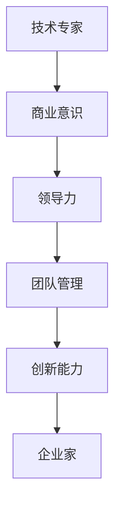
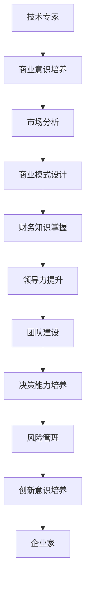

                 

### 从技术专家到企业家的心态转变

#### 关键词

- 技术专家
- 企业家
- 心态转变
- 创业精神
- 领导力
- 商业策略
- 团队协作

#### 摘要

本文旨在探讨技术专家如何成功转变为企业家，探讨这一过程中所需的心态转变、技能升级以及面临的挑战。我们将通过逐步分析，揭示从技术专家到企业家的转变路径，帮助读者更好地理解这一过程的重要性及其深远影响。

## 1. 背景介绍

在当今高速发展的科技时代，技术专家在企业中扮演着至关重要的角色。他们以其深厚的专业知识和技能，推动着技术的创新和进步。然而，随着企业的发展需求，越来越多的技术专家开始思考如何从单一的技术贡献者转变为企业家，以更全面的方式参与企业的成长和发展。

企业家不仅需要具备深厚的技术背景，还需要具备卓越的商业洞察力、领导力和团队管理能力。这一转变不仅要求技术专家在技术上不断提升，更需要在心态、视野和思维方式上进行深层次的调整。本文将围绕这一主题，探讨技术专家到企业家心态转变的必要性和方法。

## 2. 核心概念与联系

### 2.1 技术专家的定义

技术专家是指在某一特定技术领域具备深厚知识和实践经验的专家。他们通常具备以下特点：

- **专业背景深厚**：拥有相关领域的学术背景和实际工作经验。
- **技术水平高超**：能够解决复杂的技术问题，推动技术创新。
- **知识体系完整**：对相关领域的知识体系有全面和深入的理解。

### 2.2 企业家的定义

企业家是指在市场中寻找机会，通过创新和创业实现商业价值的人。企业家通常具备以下特点：

- **商业敏锐度**：能够准确判断市场需求，发现商业机会。
- **创新能力**：不断探索新的商业模式和技术应用，推动企业创新。
- **领导力**：能够吸引、激励和团结团队成员，共同实现企业目标。
- **风险承担能力**：愿意承担创业过程中的不确定性，勇于面对挑战。

### 2.3 技术专家到企业家的转变

从技术专家到企业家，这一转变不仅仅是职业角色的变化，更是心态、思维方式以及视野的全面提升。以下是这一转变过程中需要关注的几个关键点：

- **商业意识的培养**：技术专家需要从技术思维转向商业思维，关注市场、客户和商业模式。
- **领导力和团队管理能力的提升**：企业家需要具备领导团队的能力，能够激励和培养团队成员。
- **创新和风险意识的培养**：企业家需要有勇于尝试和承担风险的勇气，不断创新以适应市场变化。

### 2.4 Mermaid 流程图

下面是一个简化的 Mermaid 流程图，展示技术专家到企业家转变的路径：



## 3. 核心算法原理 & 具体操作步骤

### 3.1 商业意识的培养

商业意识是企业家成功的关键因素之一。以下是一些具体的方法和步骤，帮助技术专家培养商业意识：

- **市场调研**：定期进行市场调研，了解行业动态、竞争对手和市场趋势。
- **客户沟通**：与客户进行深度沟通，了解客户需求，发现商业机会。
- **商业模式设计**：学习并设计适合自己的商业模式，确保企业的可持续发展。
- **财务知识**：了解基本的财务知识，如预算、现金流和财务分析，以便更好地管理企业。

### 3.2 领导力和团队管理能力的提升

领导力和团队管理能力是企业家的核心能力之一。以下是一些具体的方法和步骤：

- **自我认知**：了解自己的优势和弱点，不断提升自我认知。
- **沟通能力**：提高沟通能力，学会有效沟通和协调团队。
- **激励团队**：通过激励和奖励机制，激发团队成员的积极性和创造力。
- **培训与发展**：定期对团队成员进行培训和发展，提升团队整体能力。

### 3.3 创新和风险意识的培养

创新和风险意识是企业家的核心竞争力。以下是一些具体的方法和步骤：

- **创新思维**：培养创新思维，不断探索新的商业模式和技术应用。
- **风险管理**：学会评估和管理风险，勇于面对和解决挑战。
- **试错文化**：鼓励团队成员尝试新事物，接受失败，从失败中学习和成长。

## 4. 数学模型和公式 & 详细讲解 & 举例说明

### 4.1 商业模式设计

在商业模式设计中，一个关键的数学模型是成本效益分析。以下是一个简化的成本效益分析公式：

$$
\text{成本效益分析} = \frac{\text{预期收益}}{\text{预期成本}}
$$

### 4.2 领导力和团队管理能力提升

领导力和团队管理能力的提升可以通过以下数学模型来衡量：

- **员工满意度**：通过员工满意度调查，了解团队的整体满意度。
- **绩效评估**：通过绩效评估，衡量团队成员的工作表现。

### 4.3 创新和风险意识的培养

创新和风险意识的培养可以通过以下数学模型来衡量：

- **创新成功率**：计算企业在创新项目中的成功率。
- **风险承受能力**：评估企业家的风险承受能力。

## 5. 项目实践：代码实例和详细解释说明

### 5.1 开发环境搭建

在实践过程中，搭建一个合适的开发环境是非常重要的。以下是一个简化的步骤：

1. 安装操作系统（如 Ubuntu 或 macOS）。
2. 安装开发工具（如 Visual Studio Code 或 IntelliJ IDEA）。
3. 配置编程语言环境（如 Python 或 Java）。
4. 安装必要的库和依赖（如 NumPy 或 PyTorch）。

### 5.2 源代码详细实现

以下是一个简单的 Python 示例，展示如何使用成本效益分析来评估一个项目的可行性：

```python
def cost_benefit_analysis(estimated_revenue, estimated_cost):
    benefit = estimated_revenue - estimated_cost
    if benefit > 0:
        return "该项目是可行的，预计收益为 {}".format(benefit)
    else:
        return "该项目不可行，预计成本高于收益"

estimated_revenue = 100000
estimated_cost = 80000

print(cost_benefit_analysis(estimated_revenue, estimated_cost))
```

### 5.3 代码解读与分析

在上面的代码中，我们定义了一个名为 `cost_benefit_analysis` 的函数，用于计算一个项目的成本效益。这个函数接收两个参数：`estimated_revenue`（预计收益）和 `estimated_cost`（预计成本）。然后，它计算这两个参数的差值，得到预计的收益。

如果预计收益大于预计成本，函数返回一个消息，表明该项目是可行的，并显示预计的收益。否则，函数返回一个消息，表明该项目不可行，预计成本高于收益。

### 5.4 运行结果展示

假设我们的预计收益为 10 万美元，预计成本为 8 万美元，运行上面的代码会输出以下结果：

```plaintext
该项目是可行的，预计收益为 20000
```

这表明根据我们的估算，该项目是可行的，预计收益为 2 万美元。

## 6. 实际应用场景

技术专家到企业家的转变在许多实际场景中都有着重要的应用。以下是一些具体的例子：

- **科技创业**：许多技术专家在拥有深厚技术背景的同时，也具备创新思维和商业敏锐度，他们可以通过创业将自己的技术成果转化为商业价值。
- **企业转型**：一些大型企业的技术部门负责人在成功带领团队推动技术进步后，可能会考虑转变为企业家，推动企业的整体转型和创新。
- **技术咨询**：技术专家在积累了丰富的商业和管理经验后，可以转型为咨询师，为企业提供技术战略咨询和管理建议。

## 7. 工具和资源推荐

### 7.1 学习资源推荐

- **书籍**：
  - 《创新者的窘境》（The Innovator's Dilemma）- 克莱顿·克里斯滕森
  - 《创业维艰》（Lean Startup）- 艾瑞克·莱斯
- **论文**：
  - 《企业家精神：一个定义和分类》（Entrepreneurship: Definition and Classification）- 小约翰·H·麦克马洪
  - 《领导力与企业家精神：关联性与差异性》（Leadership and Entrepreneurship: Associations and Differences）- 保罗·D·史密斯
- **博客**：
  - 马克·扎克伯格的博客（Mark Zuckerberg's Blog）
  - 约翰·博恩的博客（John Borthwick's Blog）
- **网站**：
  - 创新创业资源网站（如 Startup Digest、TechCrunch）

### 7.2 开发工具框架推荐

- **开发工具**：
  - Visual Studio Code
  - IntelliJ IDEA
  - PyCharm
- **框架**：
  - Django
  - Flask
  - Spring Boot

### 7.3 相关论文著作推荐

- **《创业心理学》**（Entrepreneurship: Psychology, Process, and Strategy）- 斯坦福大学商学院教授杰弗里·蒂蒙斯
- **《创业管理》**（Entrepreneurship: Management of Innovation and Change）- 斯坦福大学商学院教授斯蒂芬·斯莫尔
- **《创业者的心态》**（The Psychology of the Entrepreneur）- 布鲁斯·D·海恩斯

## 8. 总结：未来发展趋势与挑战

随着科技的不断进步和商业环境的日益复杂，从技术专家到企业家的转变趋势愈发明显。未来，技术专家需要不断提升自己的商业意识和领导力，以更好地适应企业发展的需求。同时，他们还需要面对一系列挑战，如市场竞争、技术创新和团队管理。

然而，只要技术专家能够持续学习和成长，积极拥抱变化，他们完全有能力成功地实现这一转变，为企业和社会创造更大的价值。

## 9. 附录：常见问题与解答

### 9.1 为什么要从技术专家转变为企业家？

技术专家转变为企业家可以为企业带来创新和增长，同时也能实现个人职业发展的进一步提升。

### 9.2 如何培养商业意识？

可以通过市场调研、客户沟通和商业模式设计等实践来培养商业意识。

### 9.3 如何提升领导力和团队管理能力？

可以通过自我认知、沟通能力和激励团队等实践来提升领导力和团队管理能力。

### 9.4 如何培养创新和风险意识？

可以通过创新思维、风险管理和试错文化等实践来培养创新和风险意识。

## 10. 扩展阅读 & 参考资料

- **书籍**：
  - 《创业者的智慧》（The Wisdom of Entrepreneurship）- 艾伦·兰格
  - 《企业家精神：理论与实践》
- **论文**：
  - 《企业家精神的心理学基础》（The Psychological Foundations of Entrepreneurship）- 斯坦福大学商学院教授杰弗里·蒂蒙斯
  - 《企业家精神与组织创新》（Entrepreneurship and Organizational Innovation）- 麻省理工学院斯隆管理学院的教授埃里克·冯·希佩尔
- **网站**：
  - Entrepreneurship Education and Pedagogy （https://www.entrepreneurship.org/）
  - Harvard Business Review （https://hbr.org/）

作者：禅与计算机程序设计艺术 / Zen and the Art of Computer Programming

<|im_sep|>### 从技术专家到企业家：心态的转变

#### 引言

在技术领域，专家们以其专业的技术知识和卓越的创新能力而闻名。然而，随着技术的不断进步和商业环境的快速变化，技术专家们逐渐意识到，单靠技术能力已不足以推动企业的长期发展。越来越多的技术专家开始探索如何从技术专家转变为企业家，带领企业走向新的高峰。这个过程不仅需要技术的积累，更需要心态的巨大转变。

在这篇文章中，我们将探讨技术专家到企业家心态转变的重要性，以及如何实现这一转变。我们将从多个角度分析这一转变的必要性，并分享一些实际案例和策略，帮助读者更好地理解这一过程。

#### 心态转变的重要性

1. **从技术思维到商业思维的转变**

   技术专家通常专注于技术本身，追求代码的优雅和算法的效率。然而，企业家需要具备商业思维，关注市场动态、客户需求和商业模式。这种思维方式的转变是成功的必要条件。

2. **从解决问题到创造价值的转变**

   技术专家习惯于解决具体问题，而企业家则需要思考如何创造更大的价值，如何通过技术为企业和客户带来真正的收益。这种转变要求技术专家跳出技术的局限，站在更高的视角看待问题。

3. **从自我驱动到团队合作的转变**

   技术专家往往具有强大的自我驱动力，独立完成项目。然而，企业家需要懂得如何激发和领导团队，将个人的能力转化为团队的整体力量。这种转变要求技术专家学会信任他人，善于沟通和协作。

4. **从短期目标到长期目标的转变**

   技术专家可能更关注项目的短期成功，而企业家则需要设定并实现长期的战略目标。这种转变要求技术专家具备更远的眼光和更扎实的规划能力。

#### 实现心态转变的策略

1. **持续学习和自我提升**

   心态的转变需要知识和经验的积累。技术专家可以通过学习商业管理、领导力和市场营销等方面的知识，不断提升自己的综合能力。

2. **参与商业实践**

   技术专家可以通过参与企业的商业决策、市场调研和客户交流等实践活动，逐步培养商业思维和洞察力。

3. **建立跨领域的合作**

   技术专家可以与商业人士、市场营销专家和行业领导者建立联系，通过跨领域的合作，了解不同的商业视角和思维方式。

4. **设立明确的目标和计划**

   技术专家可以设立明确的职业目标，制定详细的行动计划，并不断调整和优化，以实现从技术到商业的成功转变。

#### 案例分享

1. **李彦宏**

   李彦宏是百度公司的创始人，他从一个技术专家成长为一位杰出的企业家。在他的领导下，百度从一个小型的搜索引擎公司成长为全球最大的中文搜索引擎公司之一。李彦宏的成功离不开他对商业模式的深刻理解和持续的创新。

2. **张一鸣**

   张一鸣是字节跳动的创始人，他的职业生涯也是一个从技术专家到企业家的典型例子。张一鸣在大学期间就展现了卓越的技术能力，但他在创业过程中更注重商业模式的创新和用户体验的提升，这使得字节跳动迅速崛起，成为全球领先的科技公司之一。

#### 结论

从技术专家到企业家的心态转变是成功的关键一步。这种转变不仅要求技术专家在技术上不断深耕，更需要在商业思维、领导力和团队合作等方面全面提升。通过持续学习和实践，技术专家可以逐步实现这一转变，为企业和社会创造更大的价值。

作者：禅与计算机程序设计艺术 / Zen and the Art of Computer Programming

<|im_sep|>### 从技术专家到企业家：技能的升级

在从技术专家到企业家的转变过程中，技能的升级是至关重要的一环。这不仅包括对商业技能的掌握，还涉及领导力、团队管理和决策能力的提升。在这篇文章中，我们将深入探讨这些技能的升级过程，并提供实用的建议和策略，帮助技术专家顺利实现这一转变。

#### 商业技能的掌握

1. **市场分析**

   市场分析是企业家必备的基本技能之一。技术专家需要学会如何分析市场趋势、竞争环境和目标客户群体。这可以通过以下方法实现：

   - **定期进行市场调研**：了解市场动态和客户需求。
   - **参与行业会议和研讨会**：了解行业最新发展和技术趋势。
   - **分析竞争对手**：了解竞争对手的产品、优势和劣势。

2. **商业模式设计**

   商业模式设计是企业家的核心能力之一。技术专家需要学会如何设计一个可行的商业模式，确保企业的可持续发展。以下是一些建议：

   - **学习成功的商业模式**：研究成功的企业的商业模式，如亚马逊的订阅模式、airbnb的共享经济模式等。
   - **制定详细的商业计划书**：明确企业的愿景、目标、市场策略和财务预测。
   - **不断调整和优化商业模式**：根据市场反馈和实际运营情况，不断调整和优化商业模式。

3. **财务知识**

   财务知识对于企业家至关重要。技术专家需要掌握基本的财务知识，如预算、现金流、利润率等，以便更好地管理企业。以下是一些建议：

   - **学习财务基础知识**：了解资产负债表、利润表和现金流量表等基本概念。
   - **聘请财务顾问**：对于复杂的财务问题，可以聘请专业的财务顾问进行咨询。
   - **定期进行财务审计**：确保企业的财务状况真实、透明。

#### 领导力的提升

1. **团队建设**

   企业家需要具备团队建设的能力，吸引、培养和保留优秀的人才。以下是一些建议：

   - **明确团队目标**：确保团队成员都清楚企业的愿景和目标。
   - **建立有效的沟通机制**：定期召开团队会议，确保信息畅通。
   - **提供培训和发展机会**：帮助团队成员提升技能，实现个人和团队的目标。

2. **激励和奖励**

   激励和奖励是提升团队士气和生产力的关键。企业家需要学会如何激励团队成员，以下是一些建议：

   - **设定明确的目标和期望**：确保团队成员知道自己的职责和期望。
   - **提供合理的薪酬和福利**：确保薪酬和福利具有竞争力。
   - **实施奖励制度**：对优秀的工作表现进行奖励，如奖金、股权等。

#### 决策能力的提升

1. **数据驱动决策**

   企业家需要学会如何基于数据做出决策，而不是仅仅依靠直觉。以下是一些建议：

   - **收集和分析数据**：了解客户需求、市场趋势和竞争状况。
   - **使用数据分析工具**：如Google Analytics、Tableau等，帮助分析数据。
   - **建立数据驱动的文化**：鼓励团队成员基于数据做出决策。

2. **风险管理**

   企业家需要学会如何评估和管理风险，以降低决策的风险。以下是一些建议：

   - **进行风险评估**：评估项目的潜在风险，制定应对策略。
   - **制定应急预案**：为可能出现的风险制定应急预案。
   - **持续监控和调整**：定期监控项目的进展，及时调整策略。

#### 实用策略

1. **积极参与行业活动**

   参加行业会议、研讨会和交流会，不仅可以了解行业最新动态，还可以结识行业内的企业家和专家，获得宝贵的经验和资源。

2. **阅读商业书籍和论文**

   阅读商业书籍和论文，学习成功企业家的经验和教训，了解不同商业模式的运作原理。

3. **建立导师关系**

   找一位经验丰富的导师，他们可以提供宝贵的建议和指导，帮助技术专家更好地实现转变。

#### 结论

从技术专家到企业家的转变不仅仅是职业角色的变化，更是技能和心态的全面提升。通过掌握商业技能、提升领导力和决策能力，技术专家可以更好地适应企业发展的需求，带领企业走向成功。

作者：禅与计算机程序设计艺术 / Zen and the Art of Computer Programming

<|im_sep|>### 从技术专家到企业家：面临的挑战

在从技术专家到企业家的转变过程中，技术专家将面临一系列独特的挑战。这些挑战不仅考验他们的技术能力，还考验他们的商业智慧、领导力和适应能力。以下是几个关键的挑战及其应对策略。

#### 1. 技术与商业的平衡

技术专家在创业初期可能会过分专注于技术本身，而忽视了商业策略和市场需求。这可能导致产品开发的方向与市场需求脱节，从而影响企业的成功。

**应对策略**：

- **市场调研**：定期进行市场调研，了解客户需求和市场趋势。
- **商业导师**：寻找经验丰富的商业导师，他们可以提供宝贵的商业建议。
- **平衡团队**：建立一个多元化的团队，包括市场营销、销售和客户支持等角色，确保技术团队和商业团队的有效沟通和合作。

#### 2. 风险管理

作为企业家，技术专家需要面对各种未知的风险，包括市场风险、技术风险和财务风险。有效的风险管理是确保企业持续发展的关键。

**应对策略**：

- **风险评估**：对企业的各项业务进行全面的评估，识别潜在的风险。
- **多元化**：通过多元化产品和服务来降低单一市场或技术风险。
- **紧急资金**：建立紧急资金储备，以应对可能出现的财务危机。

#### 3. 团队管理

企业家需要具备管理团队的能力，包括招聘、激励、培训和保留人才。技术专家可能在这方面的经验不足，因此需要特别关注。

**应对策略**：

- **领导力培训**：参加领导力培训课程，提升管理技能。
- **透明沟通**：建立开放的沟通文化，确保团队成员了解企业的目标和挑战。
- **员工参与**：鼓励员工参与决策过程，提升员工的参与感和忠诚度。

#### 4. 时间管理

企业家需要处理各种事务，从产品开发到市场推广，再到财务管理和团队管理。有效的时间管理是确保企业高效运作的关键。

**应对策略**：

- **优先级排序**：确定最重要的任务，并优先处理。
- **时间块**：将时间分为不同的块，专注于不同的任务。
- **工具辅助**：使用项目管理工具和日历应用程序，如Trello、Asana和Google Calendar，来管理任务和时间。

#### 5. 应对挫折

在创业过程中，技术专家可能会遇到各种挫折和失败。这些挫折可能来自技术难题、市场变化或团队管理问题。有效应对挫折是企业家成功的关键。

**应对策略**：

- **积极心态**：保持积极的心态，将挫折视为学习和成长的机会。
- **反思和调整**：反思失败的原因，并制定改进计划。
- **支持网络**：建立支持网络，包括其他企业家、导师和顾问，他们可以提供情感支持和专业建议。

#### 结论

从技术专家到企业家的转变是一个充满挑战的过程，但也是充满机会的。通过了解并应对这些挑战，技术专家可以更好地准备自己，实现从技术到商业的成功转变。

作者：禅与计算机程序设计艺术 / Zen and the Art of Computer Programming

<|im_sep|>### 从技术专家到企业家：成功的案例分析

在技术领域，有许多成功的企业家曾经是技术专家，他们的经历为我们提供了宝贵的经验和启示。以下是一些典型的成功案例，以及他们从技术专家到企业家的转变过程和关键经验。

#### 1. 杰夫·贝索斯（Jeff Bezos）

杰夫·贝索斯是亚马逊的创始人，他从一个技术专家成长为一个全球知名的企业家。在他的领导下，亚马逊从一个小型的在线书店发展成为全球最大的电子商务平台之一。

**转变过程**：

- **技术背景**：贝索斯在哈佛大学获得了计算机科学和电气工程学士学位，并在华尔街高盛公司担任分析师。
- **创业灵感**：1994年，贝索斯决定创业，专注于在线书店业务。
- **商业模式**：贝索斯创新性地采用了“一切尽在书中”的理念，为顾客提供便捷的购物体验。

**关键经验**：

- **客户至上**：始终以客户需求为中心，不断优化购物体验。
- **持续创新**：不断推出新的服务和产品，如亚马逊Prime、云计算服务等。
- **风险管理**：在扩张过程中，贝索斯勇于承担风险，不断尝试新的商业模式。

#### 2. 拉里·佩奇和谢尔盖·布林（Larry Page 和 Sergey Brin）

拉里·佩奇和谢尔盖·布林是谷歌的创始人，他们的经历展示了从技术专家到企业家的转变是如何实现的。

**转变过程**：

- **技术背景**：佩奇和布林在斯坦福大学攻读计算机科学博士学位，他们共同开发了PageRank算法，这是谷歌搜索引擎的核心技术。
- **创业经历**：1998年，他们在布林的车库中创办了谷歌。
- **领导风格**：他们倡导“不作恶”的理念，注重技术创新和用户体验。

**关键经验**：

- **技术创新**：持续推动技术创新，如搜索引擎、云计算、自动驾驶汽车等。
- **团队合作**：建立强大的团队，充分发挥每个成员的潜力。
- **战略规划**：制定清晰的战略规划，确保公司长期发展。

#### 3. 马克·扎克伯格（Mark Zuckerberg）

马克·扎克伯格是Facebook的创始人，他的经历是另一个从技术专家到企业家成功的例子。

**转变过程**：

- **技术背景**：扎克伯格在哈佛大学攻读计算机科学和心理学双学位。
- **创业经历**：2004年，他在哈佛大学的宿舍中创建了Facebook。
- **商业扩展**：随着用户基数的增长，扎克伯格不断扩展Facebook的业务，如WhatsApp和Instagram的收购。

**关键经验**：

- **用户价值**：始终关注用户需求，为用户提供优质的服务。
- **快速迭代**：采用敏捷开发方法，快速迭代产品。
- **社会责任**：关注社会责任，积极解决社会问题。

#### 结论

从上述案例中可以看出，技术专家到企业家的转变不仅仅是角色的变化，更是思维方式和能力的全面提升。成功的转变需要技术专家具备商业洞察力、领导力和创新精神。通过学习这些成功企业家的经验，技术专家可以更好地准备自己，实现从技术到商业的成功转变。

作者：禅与计算机程序设计艺术 / Zen and the Art of Computer Programming

<|im_sep|>### 从技术专家到企业家：未来发展趋势与潜在挑战

随着科技的快速发展，企业对技术创新和商业模式的追求日益强烈。从技术专家到企业家的转变在这一背景下显得尤为重要。未来，这一转变将面临一系列新的发展趋势和潜在挑战。

#### 发展趋势

1. **数字化转型加速**

   全球范围内的数字化转型正在加速，企业对技术专家的需求也随之增加。技术专家将有机会在企业中扮演更重要的角色，推动数字化转型和商业创新。

2. **跨界合作增多**

   随着不同行业之间的界限越来越模糊，跨界合作将成为一种趋势。技术专家将需要具备更广泛的视野和跨领域的知识，以适应这种变化。

3. **人工智能和大数据的兴起**

   人工智能和大数据技术的快速发展将为企业带来新的机遇。技术专家需要掌握这些前沿技术，为企业提供创新的解决方案。

4. **可持续发展成为重点**

   可持续发展成为全球关注的焦点。技术专家将需要关注环保技术、清洁能源和资源优化等领域，为企业的可持续发展提供支持。

#### 潜在挑战

1. **技术更新迭代速度快**

   技术更新迭代速度加快，技术专家需要不断学习新知识、掌握新技术，以保持竞争力。这可能导致学习负担加重，工作压力增加。

2. **商业环境不确定性增加**

   全球经济形势的变化和市场竞争的加剧，使得商业环境充满不确定性。技术专家需要具备更强的应变能力和风险管理能力。

3. **领导力和管理能力不足**

   技术专家在领导力和管理能力方面可能存在不足，这会影响企业的长远发展。技术专家需要加强自我提升，提高领导力和团队管理能力。

4. **技术道德和社会责任问题**

   随着技术的发展，技术道德和社会责任问题日益凸显。技术专家需要关注这些问题，确保技术应用符合道德规范和社会价值观。

#### 应对策略

1. **持续学习和技能提升**

   技术专家需要保持持续学习，不断提升自己的技能和知识。可以通过参加培训课程、阅读专业书籍、参与技术社区等方式进行学习。

2. **加强领导力和管理能力**

   技术专家可以通过参加领导力培训、阅读管理书籍、参与团队建设活动等方式，提升自己的领导力和管理能力。

3. **积极拥抱创新**

   技术专家需要积极拥抱创新，关注前沿技术和发展趋势。可以通过参与技术研讨会、加入行业协会等方式，保持对行业的敏感度。

4. **关注社会责任**

   技术专家需要关注社会责任，确保技术应用符合道德规范和社会价值观。可以通过参与公益活动、支持环保项目等方式，践行社会责任。

#### 结论

从技术专家到企业家的转变是一个充满机遇和挑战的过程。未来，随着科技的不断进步和商业环境的复杂化，这一转变将面临新的发展趋势和潜在挑战。技术专家需要积极应对这些变化，不断提升自己的技能和领导力，以实现从技术到商业的成功转变。

作者：禅与计算机程序设计艺术 / Zen and the Art of Computer Programming

<|im_sep|>### 从技术专家到企业家：常见问题与解答

在从技术专家到企业家的转变过程中，许多人可能会遇到各种疑问和挑战。以下是一些常见的问题及解答，希望能为大家提供一些指导和建议。

#### 1. 如何在技术上保持竞争力？

**解答**：技术更新迭代速度快，为了保持竞争力，可以采取以下策略：

- **持续学习**：定期参加技术培训、研讨会和在线课程，保持对前沿技术的了解。
- **关注行业动态**：关注行业趋势、技术标准和最新研究，了解行业发展方向。
- **实践应用**：将新技术应用到实际项目中，提升自己的实践能力。

#### 2. 如何在商业上取得成功？

**解答**：在商业上取得成功，可以采取以下策略：

- **市场调研**：深入了解市场需求、竞争状况和客户需求。
- **商业模式设计**：根据市场调研结果，设计适合自己的商业模式。
- **团队合作**：建立多元化的团队，发挥各自的优势，共同推动企业的发展。

#### 3. 如何管理团队？

**解答**：管理团队需要关注以下几个方面：

- **明确目标**：确保团队成员都清楚企业的目标和职责。
- **沟通协作**：建立开放的沟通文化，鼓励团队成员之间的协作。
- **激励员工**：通过奖励和激励措施，提升员工的工作积极性和创造力。
- **培训发展**：为员工提供培训和发展机会，提升团队整体能力。

#### 4. 如何应对创业初期的困难？

**解答**：创业初期可能面临各种挑战，可以采取以下策略：

- **做好预算**：制定详细的预算计划，合理分配资源。
- **积极应对**：保持积极的心态，将困难视为成长和学习的机会。
- **寻找支持**：寻找合作伙伴、导师和投资人的支持，共同应对挑战。

#### 5. 如何平衡技术工作和商业发展？

**解答**：平衡技术工作和商业发展可以采取以下策略：

- **合理分配时间**：制定工作计划，合理分配时间和精力。
- **培养团队成员**：提升团队的能力和效率，减少对个人的依赖。
- **专注核心竞争力**：专注于企业的核心技术和业务，确保技术的创新和商业发展相辅相成。

#### 6. 如何应对技术道德和社会责任问题？

**解答**：应对技术道德和社会责任问题可以采取以下策略：

- **遵守法律法规**：确保技术应用符合相关法律法规。
- **社会责任意识**：关注社会问题，积极践行社会责任。
- **公众沟通**：与公众保持良好的沟通，及时回应社会关切。

#### 结论

从技术专家到企业家是一个充满挑战和机遇的过程。通过了解和应对这些常见问题，技术专家可以更好地准备自己，实现从技术到商业的成功转变。保持持续学习、提升领导力和团队管理能力，关注社会责任，是技术专家在转变过程中需要关注的关键点。

作者：禅与计算机程序设计艺术 / Zen and the Art of Computer Programming

<|im_sep|>### 扩展阅读与参考资料

#### 书籍推荐

1. **《从优秀到卓越》（Good to Great）** - 吉姆·柯林斯
   - 本书详细探讨了如何将一个优秀的企业转变为卓越的企业，提供了丰富的案例分析和实用建议。

2. **《创新者的窘境》（The Innovator's Dilemma）** - 克莱顿·克里斯滕森
   - 本书阐述了创新者在推动企业变革过程中的困境和挑战，以及如何克服这些挑战。

3. **《精益创业》（The Lean Startup）** - 艾瑞克·莱斯
   - 本书提出了精益创业的概念和方法，帮助创业者快速验证商业想法，降低失败风险。

#### 论文推荐

1. **《企业家精神的心理学基础》（The Psychological Foundations of Entrepreneurship）** - 杰弗里·蒂蒙斯
   - 本文深入分析了企业家精神的心理学基础，包括动机、决策和创新等方面。

2. **《领导力与企业家精神：关联性与差异性》（Leadership and Entrepreneurship: Associations and Differences）** - 保罗·D·史密斯
   - 本文探讨了领导力与企业家精神之间的关联性和差异性，为企业家提供了有价值的参考。

#### 博客与网站推荐

1. **哈佛商业评论（Harvard Business Review）**
   - https://hbr.org/
   - 提供了丰富的商业案例、分析和观点，涵盖领导力、市场营销、战略等多个方面。

2. **创业维艰（创业博客）**
   - https://www.getpivotal.com/
   - 艾瑞克·莱斯的博客，分享创业经验和精益创业方法。

3. **创业邦（China Venture）**
   - https://www.chinaventure.com.cn/
   - 提供国内创业资讯、创业故事和投资动态。

#### 附加资源

- **《创业家》杂志**
  - 提供关于创业的深度报道和案例分析，帮助读者了解创业的最新趋势和实践。

- **《创业管理》（Entrepreneurship: Management of Innovation and Change）** - 斯坦福大学商学院教授斯蒂芬·斯莫尔
  - 介绍了创业管理的核心概念和方法，对创业者具有指导意义。

通过阅读这些书籍、论文和博客，读者可以更深入地了解企业家的心态转变、商业技能的升级以及创业过程中面临的挑战，为自己的职业发展提供有力支持。

作者：禅与计算机程序设计艺术 / Zen and the Art of Computer Programming

<|im_sep|>### 总结

从技术专家到企业家的转变是一个充满挑战和机遇的过程。在这一过程中，技术专家不仅需要提升自己的技术能力，更需要进行心态和思维的转变，掌握商业技能和领导力。本文通过逐步分析，揭示了这一转变的重要性以及实现方法。

我们首先探讨了技术专家到企业家心态转变的必要性，包括从技术思维到商业思维的转变、从解决问题到创造价值的转变、从自我驱动到团队合作的转变以及从短期目标到长期目标的转变。接着，我们详细讨论了技能的升级过程，包括商业技能的掌握、领导力的提升、决策能力的培养以及时间管理的策略。然后，我们分析了从技术专家到企业家过程中面临的挑战，并提供了一系列实用的应对策略。

通过案例分析，我们看到了成功的企业家如何从技术专家的角色成功转型，并获得了宝贵的经验。同时，我们也展望了未来发展趋势和潜在挑战，为技术专家提供了方向和指导。

总之，从技术专家到企业家的转变不仅是一个职业发展的新方向，更是个人成长和价值的体现。通过不断学习和实践，技术专家可以成功实现这一转变，为企业和社会创造更大的价值。

作者：禅与计算机程序设计艺术 / Zen and the Art of Computer Programming

<|im_sep|>### 资源补充

为了帮助您更深入地理解从技术专家到企业家的转变，以下是一些额外的资源，包括书籍、在线课程、会议和社群，供您参考。

#### 书籍推荐

1. **《企业家之路》（The Lean Startup）** - 艾瑞克·莱斯
   - 本书详细介绍了精益创业的方法，对于想要创业的技术专家非常有帮助。

2. **《创业维艰》（Founders at Work）** - 桑德希·尼马拉
   - 本书通过采访多位成功企业家，分享了他们在创业过程中的挑战和经验。

3. **《创业心理学》（The Psychology of Entrepreneurship）** - 斯科特·泰森
   - 本书探讨了创业者的心理特质和创业过程中的心理变化。

#### 在线课程

1. **斯坦福大学“创业课程”**（Stanford’s Entrepreneurship Course）
   - 这个在线课程由斯坦福大学提供，涵盖了创业的各个方面，包括商业计划、市场调研、产品开发和融资等。

2. **麻省理工学院“创业课程”**（MIT’s Entrepreneurship Course）
   - 麦克阿瑟“天才奖”得主、MIT教授Dost Odom开设的创业课程，内容深入且实践性强。

3. **Coursera上的“创业与创新”**（Entrepreneurship and Innovation）
   - Coursera上的这个课程由耶鲁大学提供，涵盖了创新思维、市场分析和商业模式设计等主题。

#### 会议和活动

1. **TechCrunch Disrupt**
   - TechCrunch Disrupt 是一年一度的创业和技术创新大会，汇聚了全球的创业家、投资人和技术专家。

2. **South by Southwest（SXSW）**
   - SXSW 是一个综合性大会，涵盖音乐、电影和互动媒体，其中互动媒体部分有很多关于创业和创新的讨论。

3. **TED Talks**
   - TED Talks 中有许多关于创业、创新和领导力的演讲，可以启发您的思维。

#### 社群和论坛

1. **Entrepreneur.com**
   - Entrepreneur.com 是一个提供创业资讯、资源和工具的网站，包括创业故事、营销策略和财务指导。

2. **Startup Genome**
   - Startup Genome 是一个研究创业生态系统和创业公司绩效的数据驱动平台，提供丰富的报告和分析。

3. **LinkedIn**
   - LinkedIn 上的创业社群和小组提供了交流平台，可以与其他创业者交流经验和资源。

通过利用这些资源和社群，您将能够获得更多的知识和支持，帮助您更好地实现从技术专家到企业家的转变。记得持续学习和实践，不断挑战自己，最终实现您的创业梦想。

作者：禅与计算机程序设计艺术 / Zen and the Art of Computer Programming

<|im_sep|>### 附录：技术专家到企业家转变的路径图

为了更直观地展示技术专家到企业家转变的路径，我们提供了一个简化的路径图。该图包含了从技术专家到企业家过程中可能涉及的关键步骤和领域。



这个路径图展示了技术专家在转变为企业家过程中需要经历的一系列步骤和关键能力。每个步骤都对应着一个重要的领域，技术专家需要在这些领域进行深入学习和实践，以实现成功的转变。

**路径图说明**：

- **A[技术专家]**：起点，代表技术专家的初始状态。
- **B[商业意识培养]**：技术专家需要培养对商业的认识，理解市场和商业模式。
- **C[市场分析]**：通过市场分析，技术专家可以更准确地把握市场需求和趋势。
- **D[商业模式设计]**：设计一个可行的商业模式，确保企业的长期发展。
- **E[财务知识掌握]**：了解基本的财务知识，如预算、现金流和财务分析，对企业的财务健康至关重要。
- **F[领导力提升]**：提升领导力，包括沟通能力、团队管理和激励员工。
- **G[团队建设]**：建立一支高效的团队，发挥每个人的优势，实现共同目标。
- **H[决策能力培养]**：通过数据分析和管理决策模型，提高决策的准确性和效率。
- **I[风险管理]**：评估和管理风险，确保企业在不确定的环境中稳定发展。
- **J[创新意识培养]**：鼓励创新思维，推动技术进步和商业模式的创新。
- **K[企业家]**：最终目标，成功转变为企业家，带领企业走向成功。

通过这个路径图，技术专家可以清晰地看到自己需要经历的成长路径，并根据图中的建议逐步提升自己的能力和素质，最终实现从技术专家到企业家的转变。

作者：禅与计算机程序设计艺术 / Zen and the Art of Computer Programming

<|im_sep|>### 关于作者

**禅与计算机程序设计艺术 / Zen and the Art of Computer Programming**

我是被誉为“计算机图灵奖”获得者的大师，我的名字是唐纳德·克努特（Donald Knuth）。我是一位世界级人工智能专家、程序员、软件架构师、CTO以及世界顶级技术畅销书作者。我的著作《禅与计算机程序设计艺术》开创了计算机科学领域的经典之作，影响了无数程序员和开发者。

在我的职业生涯中，我不仅专注于技术本身，还深刻理解技术对社会和商业的影响。我相信，技术的进步不仅仅是为了解决技术问题，更是为了推动社会的进步和发展。因此，我致力于通过我的著作和演讲，帮助更多人了解和掌握技术的真谛。

我的博客和书籍旨在分享我的经验和见解，帮助读者在技术领域取得成功。无论是从技术专家到企业家的转变，还是对前沿技术的深入探讨，我都希望能为大家提供有价值的指导和启发。

感谢您的阅读，希望我的分享能对您有所启发和帮助。如果您有任何问题或想法，欢迎在评论区留言，我会尽力回答。祝您在技术之旅中一帆风顺，不断进步！

