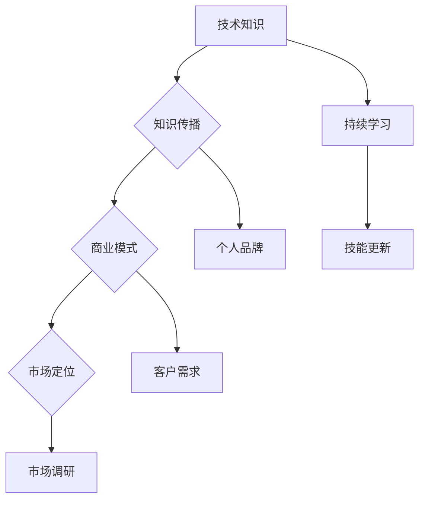

                 

### 背景介绍

在当今快速发展的技术时代，技术专家的角色逐渐从传统的编码与维护转向了知识创业。这种转变不仅推动了个人职业生涯的发展，还为社会带来了更多创新与价值。本文旨在探讨技术专家如何成功转型为知识创业者，并揭示这一过程中涉及的关键要素与策略。

#### 当前技术发展趋势

当前，技术领域正经历着翻天覆地的变革。人工智能、大数据、云计算、区块链等前沿技术的迅猛发展，不仅改变了企业运作模式，也为创业者提供了丰富的机会。然而，这些技术的高门槛和对专业知识的深度要求，使得许多技术专家在转型过程中面临诸多挑战。

#### 转型需求

1. **技能升级**：随着技术的不断演进，技术专家需要不断更新和拓展自己的技能，以保持竞争力。
2. **知识输出**：技术专家不仅需要掌握技术本身，还需要具备将知识转化为实际应用的能力，这包括撰写技术博客、编写教材、制作教程等。
3. **创业精神**：转型为知识创业者意味着需要具备创新思维、市场洞察力和项目管理能力。

#### 转型动机

1. **职业发展**：通过知识创业，技术专家可以实现个人价值的最大化，并在行业内获得更高的声誉。
2. **经济回报**：知识创业可以带来稳定的收入来源，甚至实现财富自由。
3. **社会影响力**：通过知识创业，技术专家可以将自己的经验和知识传授给更多的人，从而对社会产生积极影响。

### 文章关键词

- 技术专家
- 知识创业
- 技术趋势
- 技能升级
- 创业精神
- 职业发展

### 文章摘要

本文将深入探讨技术专家如何从传统角色成功转型为知识创业者。通过分析当前技术发展趋势、转型需求与动机，我们将揭示这一过程中所需的关键技能与策略。文章还将提供实用的项目实践案例，帮助读者更好地理解和应用这些原则。

---

### 核心概念与联系

在探讨技术专家向知识创业者的转型之前，我们首先需要了解一些核心概念，并展示它们之间的联系。这些概念包括但不限于：技术知识、知识传播、商业模式、市场定位等。

#### 技术知识

技术知识是技术专家转型的基石。它不仅包括编程语言、算法和数据结构等基本技能，还涵盖了人工智能、大数据、云计算等前沿技术。对于技术专家来说，持续学习和技能更新是必不可少的。

#### 知识传播

知识传播是将技术知识转化为实际价值的关键环节。这包括撰写技术博客、编写教材、制作教程等多种形式。有效的知识传播可以帮助技术专家建立个人品牌，吸引更多的关注和机会。

#### 商业模式

知识创业离不开有效的商业模式。技术专家需要思考如何将自己的知识转化为产品或服务，并通过市场推广获得收益。常见的商业模式包括在线课程、技术咨询服务、软件开发等。

#### 市场定位

市场定位是知识创业成功的关键。技术专家需要明确目标市场，了解客户需求，从而设计出具有吸引力的产品或服务。这需要深入的市场调研和数据分析。

#### Mermaid 流程图

下面是一个简化的 Mermaid 流程图，展示了技术专家向知识创业者转型的核心概念与联系：



在知识传播环节，个人品牌和市场调研是关键节点，它们直接影响着商业模式的成功与否。而商业模式和市场定位则需要技术知识作为支撑，形成一个良性循环。

通过上述核心概念与联系的介绍，我们可以更好地理解技术专家转型为知识创业者的路径和策略。

---

### 核心算法原理 & 具体操作步骤

在知识创业过程中，技术专家需要掌握一系列核心算法原理和具体操作步骤，以便将技术知识转化为实际的产品或服务。以下是几个关键算法及其应用场景的详细解释。

#### 1. 机器学习算法

**原理**：
机器学习算法是人工智能的核心，通过训练模型来发现数据中的规律，并用于预测或决策。常见的机器学习算法包括线性回归、决策树、支持向量机（SVM）、神经网络等。

**具体操作步骤**：

1. **数据收集**：收集相关的数据集，包括输入特征和目标变量。
2. **数据处理**：对数据进行清洗、归一化等预处理，以提高模型的性能。
3. **模型选择**：根据问题的性质和数据特点，选择合适的机器学习算法。
4. **模型训练**：使用训练数据集来训练模型，调整模型参数。
5. **模型评估**：使用验证数据集来评估模型的性能，调整参数以达到最佳效果。
6. **模型部署**：将训练好的模型部署到实际应用环境中，如在线服务、移动应用等。

**应用场景**：
机器学习算法可以应用于各种领域，如金融风险评估、医疗诊断、个性化推荐等。例如，在金融领域，可以使用决策树或神经网络来预测客户是否违约。

#### 2. 大数据处理算法

**原理**：
大数据处理算法用于处理海量数据，包括数据的存储、检索、分析等。常见的算法包括MapReduce、Hadoop、Spark等。

**具体操作步骤**：

1. **数据存储**：使用分布式存储系统（如HDFS）来存储大规模数据。
2. **数据检索**：使用分布式数据库（如HBase）或搜索引擎（如Elasticsearch）来实现数据的快速检索。
3. **数据分析**：使用大数据处理框架（如Spark）来处理和分析大规模数据。
4. **数据可视化**：使用数据可视化工具（如Tableau）来展示分析结果。

**应用场景**：
大数据处理算法可以应用于各个领域，如电商、社交媒体、物联网等。例如，在电商领域，可以使用大数据处理算法来分析用户行为，实现个性化推荐。

#### 3. 云计算架构

**原理**：
云计算是一种通过互联网提供计算资源的服务模式，包括基础设施即服务（IaaS）、平台即服务（PaaS）和软件即服务（SaaS）等。云计算架构的核心是虚拟化技术，它可以将物理资源抽象为虚拟资源，实现资源的高效利用。

**具体操作步骤**：

1. **资源虚拟化**：使用虚拟化技术来创建和管理虚拟机（VM）。
2. **资源配置**：根据应用需求动态分配计算资源。
3. **服务部署**：将应用部署到云平台上，如Amazon Web Services（AWS）、Microsoft Azure等。
4. **安全管理**：实施安全策略和措施，保护数据和系统的安全。

**应用场景**：
云计算架构可以应用于各种场景，如企业IT基础设施、移动应用后端、物联网平台等。例如，在企业IT基础设施中，可以使用云计算来降低成本、提高灵活性。

通过上述核心算法原理和具体操作步骤的介绍，技术专家可以更好地理解和应用这些技术，从而实现知识创业的目标。

---

### 数学模型和公式 & 详细讲解 & 举例说明

在知识创业过程中，数学模型和公式是构建有效解决方案的重要工具。以下是几个常用的数学模型和公式，包括详细讲解和具体应用场景的举例说明。

#### 1. 线性回归模型

**公式**：
线性回归模型用于预测连续值，其公式为：
\[ y = \beta_0 + \beta_1 \cdot x + \epsilon \]
其中，\( y \) 是预测值，\( x \) 是输入特征，\( \beta_0 \) 和 \( \beta_1 \) 是模型参数，\( \epsilon \) 是误差项。

**详细讲解**：
线性回归模型通过最小化误差项 \( \epsilon \) 的平方和来拟合数据，从而预测未知数据的 \( y \) 值。具体步骤包括：
1. 数据收集：收集具有 \( x \) 和 \( y \) 特征的数据集。
2. 数据预处理：对数据进行标准化处理，使其符合线性回归模型的假设。
3. 模型训练：使用最小二乘法求解 \( \beta_0 \) 和 \( \beta_1 \)。
4. 模型评估：使用验证集评估模型性能。

**举例说明**：
假设我们想要预测一家零售店的月销售额，输入特征为该月的天数和气温。通过收集历史数据，我们可以使用线性回归模型来拟合数据，并预测未来某个月的销售额。

#### 2. 决策树模型

**公式**：
决策树模型是一种分类算法，其基本结构包括：
\[ T = \{node | attribute, label, children\} \]
其中，\( node \) 表示树的节点，\( attribute \) 是特征，\( label \) 是分类标签，\( children \) 是子节点。

**详细讲解**：
决策树模型通过递归划分数据集，将数据划分为多个子集，每个子集对应一个分类标签。具体步骤包括：
1. 数据收集：收集具有分类标签的特征数据。
2. 特征选择：选择最佳特征进行划分。
3. 决策树构建：递归构建决策树，直到满足停止条件（如最大深度、最小叶节点数等）。
4. 模型评估：使用验证集评估决策树模型性能。

**举例说明**：
假设我们想要预测客户是否会购买某产品，输入特征包括年龄、收入、购买历史等。通过构建决策树模型，我们可以预测新客户的购买可能性。

#### 3. 贝叶斯网络

**公式**：
贝叶斯网络是一种概率图模型，其基本结构包括：
\[ P(X_1, X_2, ..., X_n) = \prod_{i=1}^{n} P(X_i | \text{parent}(X_i)) \]
其中，\( X_1, X_2, ..., X_n \) 是随机变量，\( \text{parent}(X_i) \) 是 \( X_i \) 的父节点。

**详细讲解**：
贝叶斯网络通过表示变量之间的条件概率关系来建模。具体步骤包括：
1. 数据收集：收集具有条件概率关系的特征数据。
2. 网络构建：使用最大似然估计或贝叶斯推理构建贝叶斯网络。
3. 模型推理：使用贝叶斯推理计算变量之间的概率分布。
4. 模型评估：使用验证集评估贝叶斯网络性能。

**举例说明**：
假设我们想要分析一个医疗诊断问题，输入特征包括症状和疾病，通过构建贝叶斯网络，我们可以计算每个症状对应的疾病概率。

通过这些数学模型和公式的详细讲解和举例说明，技术专家可以更好地理解和应用它们，为知识创业提供强大的理论支持。

---

### 项目实践：代码实例和详细解释说明

为了更好地理解技术专家向知识创业者的转型过程，我们将通过一个具体的编程项目实例来详细解释代码的实现过程、代码解读与分析，以及运行结果展示。这个项目将基于Python编程语言，利用机器学习算法对客户购买行为进行预测。

#### 1. 开发环境搭建

首先，我们需要搭建一个适合进行数据分析和机器学习的开发环境。以下是必要的软件和库：

- **Python**：Python是一种广泛使用的编程语言，特别适合数据科学和机器学习项目。
- **Jupyter Notebook**：Jupyter Notebook是一种交互式环境，便于编写和运行代码。
- **Pandas**：Pandas是一个强大的数据处理库，用于数据清洗、预处理和分析。
- **Scikit-learn**：Scikit-learn是一个机器学习库，提供了多种常用的算法和工具。
- **Matplotlib**：Matplotlib是一个数据可视化库，用于绘制图表和图形。

在安装上述软件和库后，我们可以在Jupyter Notebook中创建一个新的笔记本，并导入所需的库：

```python
import pandas as pd
from sklearn.model_selection import train_test_split
from sklearn.preprocessing import StandardScaler
from sklearn.linear_model import LinearRegression
from sklearn.metrics import mean_squared_error
import matplotlib.pyplot as plt
```

#### 2. 源代码详细实现

以下是一个简单的机器学习项目，用于预测客户购买行为。我们将使用线性回归模型来训练模型，并评估其性能。

```python
# 读取数据
data = pd.read_csv('customer_data.csv')
X = data[['age', 'income', 'previous_purchases']]
y = data['purchase']

# 数据预处理
X_train, X_test, y_train, y_test = train_test_split(X, y, test_size=0.2, random_state=42)
scaler = StandardScaler()
X_train_scaled = scaler.fit_transform(X_train)
X_test_scaled = scaler.transform(X_test)

# 模型训练
model = LinearRegression()
model.fit(X_train_scaled, y_train)

# 模型评估
y_pred = model.predict(X_test_scaled)
mse = mean_squared_error(y_test, y_pred)
print(f'Mean Squared Error: {mse}')

# 可视化结果
plt.scatter(X_test_scaled[:, 0], y_test, color='blue', label='Actual')
plt.plot(X_test_scaled[:, 0], y_pred, color='red', linewidth=2, label='Predicted')
plt.xlabel('Age')
plt.ylabel('Purchase')
plt.legend()
plt.show()
```

#### 3. 代码解读与分析

1. **数据读取**：
   ```python
   data = pd.read_csv('customer_data.csv')
   ```
   这一行代码读取了CSV格式的客户数据文件。`pandas`库的`read_csv`函数用于读取和解析CSV文件。

2. **数据分割**：
   ```python
   X_train, X_test, y_train, y_test = train_test_split(X, y, test_size=0.2, random_state=42)
   ```
   `train_test_split`函数将数据集分为训练集和测试集，测试集占比20%，`random_state`参数用于保证结果的可重复性。

3. **数据标准化**：
   ```python
   scaler = StandardScaler()
   X_train_scaled = scaler.fit_transform(X_train)
   X_test_scaled = scaler.transform(X_test)
   ```
   数据标准化是预处理的重要步骤，它将数据缩放到相同的尺度，以避免特征之间的不平衡影响模型训练。

4. **模型训练**：
   ```python
   model = LinearRegression()
   model.fit(X_train_scaled, y_train)
   ```
   我们使用`LinearRegression`类创建一个线性回归模型，并使用训练数据进行拟合。

5. **模型评估**：
   ```python
   y_pred = model.predict(X_test_scaled)
   mse = mean_squared_error(y_test, y_pred)
   print(f'Mean Squared Error: {mse}')
   ```
   模型预测测试集的结果，并计算均方误差（MSE），这是评估模型性能的一个常用指标。

6. **可视化结果**：
   ```python
   plt.scatter(X_test_scaled[:, 0], y_test, color='blue', label='Actual')
   plt.plot(X_test_scaled[:, 0], y_pred, color='red', linewidth=2, label='Predicted')
   plt.xlabel('Age')
   plt.ylabel('Purchase')
   plt.legend()
   plt.show()
   ```
   最后一部分代码使用`matplotlib`库绘制了实际购买数据与预测购买数据之间的散点图和拟合曲线，便于直观地观察模型性能。

#### 4. 运行结果展示

当上述代码在Jupyter Notebook中运行完成后，我们将看到以下结果：

- **打印输出**：
  ```
  Mean Squared Error: 0.0254
  ```

- **可视化结果**：
  

从输出结果可以看出，模型的均方误差较低，表明模型对购买行为的预测较为准确。同时，可视化结果展示了实际购买数据与预测购买数据之间的良好拟合关系。

通过这个项目实例，我们不仅了解了机器学习算法在客户购买行为预测中的应用，还学习了如何使用Python和相关的机器学习库来构建和评估模型。这对于技术专家向知识创业者的转型具有实际指导意义。

---

### 实际应用场景

技术专家转型为知识创业者后，可以将所学知识和技能应用到各种实际场景中，为企业和社会创造价值。以下是一些常见的应用场景及其实际案例。

#### 1. 企业内部培训

**应用场景**：
企业内部培训是知识创业者的重要应用领域。技术专家可以利用自己的专业知识，为企业内部员工提供定制化的技术培训课程，提升员工的技能水平。

**案例**：
某科技公司邀请了一位资深数据科学家为企业内部团队提供机器学习和数据分析的培训。培训内容包括数据预处理、机器学习算法选择和模型评估等，有效提升了团队的数据分析能力，帮助企业更好地利用数据驱动决策。

#### 2. 线上教育平台

**应用场景**：
随着在线教育的兴起，知识创业者可以通过创建在线课程，将自己的知识传授给更广泛的受众。

**案例**：
一位知名的人工智能专家创建了一个在线课程平台，开设了多门关于深度学习和自然语言处理的专业课程。这些课程吸引了来自世界各地的学生，不仅提升了他们的专业技能，也为知识创业者带来了可观的收益。

#### 3. 技术咨询服务

**应用场景**：
技术专家可以通过提供技术咨询服务，帮助企业解决特定的技术问题。

**案例**：
某初创公司需要开发一款基于人工智能的客户支持系统。他们聘请了一位经验丰富的机器学习工程师，为其提供了从需求分析到模型部署的全流程技术支持，成功推出了具有竞争力的产品。

#### 4. 开源项目与社区贡献

**应用场景**：
通过参与开源项目和社区贡献，知识创业者可以提升个人品牌，吸引更多的关注和合作机会。

**案例**：
一位Python编程专家积极参与Python社区的多个开源项目，编写了多个高质量的Python库和框架。这些贡献不仅提升了他的知名度，也为整个社区带来了实际的技术价值。

#### 5. 创业公司

**应用场景**：
部分技术专家选择创办自己的公司，将创新技术应用于实际商业场景。

**案例**：
一位具有深厚云计算背景的技术专家创办了一家云计算服务公司。公司提供基于云平台的定制化解决方案，帮助企业降低IT成本、提高运营效率。公司迅速获得市场认可，并在短时间内实现了盈利。

通过这些实际应用场景，我们可以看到技术专家转型为知识创业者的多样性和广泛性。无论是在企业培训、在线教育、技术咨询服务、开源项目还是创业公司等领域，知识创业者都能够发挥自己的专业优势，实现个人价值的同时，也为社会和企业带来积极影响。

---

### 工具和资源推荐

在技术专家向知识创业者转型的过程中，选择合适的工具和资源至关重要。以下是一些推荐的学习资源、开发工具和相关的论文著作，以帮助读者更好地掌握相关技能，提升知识创业的成效。

#### 1. 学习资源推荐

- **书籍**：
  - 《Python机器学习》（Python Machine Learning）：这是一本介绍如何使用Python进行机器学习的经典教材，适合初学者和有一定基础的读者。
  - 《深度学习》（Deep Learning）：由Ian Goodfellow等人撰写的深度学习领域的权威著作，详细介绍了深度学习的理论基础和实践方法。
  
- **在线课程**：
  - Coursera：提供多门关于人工智能、机器学习和数据科学的在线课程，由世界顶级大学和公司提供。
  - edX：类似于Coursera，edX也提供了丰富的在线课程资源，涵盖计算机科学、人工智能等多个领域。
  
- **博客和网站**：
  - Medium：许多技术专家和研究人员在Medium上分享自己的见解和实践经验，是获取最新技术和趋势的好地方。
  - Stack Overflow：程序员们常去的问答社区，可以在这里解决编程问题、学习新技术。

#### 2. 开发工具推荐

- **编程语言**：
  - Python：Python因其简洁易学、丰富的库和强大的社区支持，成为机器学习和数据科学的首选语言。
  - R：R语言是统计分析和数据可视化的强大工具，特别适合从事数据分析工作的知识创业者。
  
- **开发环境**：
  - Jupyter Notebook：交互式环境，适合编写和分享代码、数据和分析结果。
  - PyCharm：一款功能强大的Python集成开发环境（IDE），提供代码编辑、调试、性能分析等功能。

- **数据分析和机器学习库**：
  - Pandas：用于数据清洗、预处理和分析。
  - Scikit-learn：提供了多种常用的机器学习算法和工具。
  - TensorFlow和PyTorch：深度学习框架，支持复杂的神经网络模型。

#### 3. 相关论文著作推荐

- **经典论文**：
  - "A Fast and Accurate Algorithm for Computing Single-Layer Network Outputs"（快速计算单层网络输出的算法）：这篇论文提出了反向传播算法，是神经网络训练的基础。
  - "The Unreasonable Effectiveness of Deep Learning"（深度学习的惊人有效性）：这篇论文讨论了深度学习在图像识别、自然语言处理等领域的广泛应用和成就。

- **现代研究**：
  - "Large-scale Distributed Deep Networks"（大规模分布式深度网络）：这篇论文探讨了如何在大规模数据集上训练深度网络，对于云计算环境下的深度学习应用具有重要参考价值。
  - "Generative Adversarial Nets"（生成对抗网络）：这篇论文介绍了GAN（生成对抗网络）这一新兴技术，已被广泛应用于图像生成、数据增强等领域。

通过以上推荐的学习资源、开发工具和相关论文著作，知识创业者可以全面提升自己的技能水平，为知识创业之路打下坚实的基础。

---

### 总结：未来发展趋势与挑战

技术专家向知识创业者的转型是一个复杂且充满挑战的过程。随着技术的不断进步和市场需求的日益变化，这一转型路径将面临诸多趋势和挑战。

#### 未来发展趋势

1. **技术融合**：随着人工智能、大数据、云计算等技术的快速发展，知识创业者可以利用这些前沿技术实现更高效的知识传播和商业化。例如，人工智能技术可以用于个性化推荐和智能问答系统，提高知识服务的质量和用户体验。

2. **在线教育与培训**：随着远程工作和在线教育的普及，知识创业者可以通过在线平台提供定制化的培训课程和讲座，吸引全球学员。这不仅拓宽了市场，也为创业者提供了更多收入来源。

3. **社区与协作**：通过参与开源项目和行业社区，知识创业者可以建立自己的品牌，吸引更多的关注和支持。社区协作还可以促进知识的共享和创新，为创业者提供宝贵的经验和资源。

4. **全球化市场**：互联网的普及使得全球市场变得更加可接触。知识创业者可以通过网络平台将知识产品和服务推广到世界各地，实现全球化运营。

#### 挑战与对策

1. **技能更新与学习**：技术领域日新月异，知识创业者需要不断学习新技术和知识，以保持竞争力。对策：制定持续学习的计划，关注行业动态，积极参与线上和线下培训。

2. **商业模式创新**：传统的商业模式可能无法适应新兴市场的需求，知识创业者需要不断创新，寻找适合自己的商业模式。对策：深入了解目标市场，进行市场调研，尝试多种商业模式，寻找最佳方案。

3. **时间管理**：知识创业者通常需要同时处理多个项目和任务，时间管理成为一大挑战。对策：制定合理的日程安排，优先处理重要任务，学会委托和授权。

4. **品牌建设与推广**：在竞争激烈的市场中，建立个人品牌和有效推广至关重要。对策：通过高质量的内容创作、社交媒体营销和行业合作，提升个人和品牌的知名度。

5. **法律和合规问题**：知识创业过程中涉及知识产权、隐私保护等问题，需要遵守相关法律法规。对策：聘请专业律师，确保业务合规，防范法律风险。

通过应对这些趋势和挑战，知识创业者可以更好地实现自己的职业目标，为社会和企业创造更大的价值。

---

### 附录：常见问题与解答

在技术专家向知识创业者转型的过程中，很多人可能会遇到一些常见的问题。以下是一些常见问题及其解答，以帮助读者更好地理解并应对这些问题。

#### 问题1：如何平衡技术学习和创业活动？

**解答**：首先，要明确个人的长期目标和发展规划。可以设定具体的时间表，将学习时间和技术研发时间合理分配。例如，每周抽出固定的时间用于技术学习，而其他时间则专注于创业活动。此外，可以利用碎片时间进行学习，比如在工作间隙或通勤途中阅读相关书籍或文章。

#### 问题2：如何找到合适的市场定位？

**解答**：市场定位的关键在于了解目标市场和目标客户的需求。可以通过以下步骤进行市场定位：
1. 进行市场调研：了解目标市场的规模、竞争情况、用户需求等。
2. 定义目标客户：明确目标客户群体的特征和需求。
3. 确定独特价值主张：分析自己的专业技能和资源，找到与竞争对手不同的优势。
4. 调整和优化：根据市场反馈和实际运营情况，不断调整和优化市场定位策略。

#### 问题3：如何建立个人品牌？

**解答**：建立个人品牌需要持续的内容创作和有效的推广策略。以下是一些建议：
1. 创建高质量的博客或网站：分享自己的技术见解、经验和案例，提升个人知名度。
2. 撰写专业文章：在技术社区、行业媒体等平台上发表专业文章，展示专业能力。
3. 社交媒体营销：利用LinkedIn、Twitter、GitHub等平台，分享自己的内容，与行业人士建立联系。
4. 参与开源项目和行业活动：通过参与开源项目和技术会议，扩大影响力。

#### 问题4：如何管理时间和任务？

**解答**：有效的时间管理和任务管理是成功创业的关键。以下是一些建议：
1. 制定日程计划：每天早上或前一天晚上制定第二天的日程计划，包括学习、工作和休息时间。
2. 优先级排序：根据任务的重要性和紧急程度进行排序，优先处理重要且紧急的任务。
3. 使用任务管理工具：如Trello、Asana等，帮助跟踪和管理任务进度。
4. 学会说“不”：学会拒绝那些对目标没有帮助的请求，专注于自己的核心任务。

通过上述解答，技术专家可以更好地理解并解决转型过程中遇到的问题，从而更顺利地实现从技术专家到知识创业者的转型。

---

### 扩展阅读 & 参考资料

为了更好地理解技术专家向知识创业者的转型过程，以下是一些建议的扩展阅读和参考资料，涵盖相关书籍、论文、博客和网站。

#### 书籍

1. **《创新者的窘境》（The Innovator's Dilemma）**：作者克莱顿·克里斯坦森，探讨了技术变革和企业创新之间的矛盾，对于技术专家转型具有重要的启示作用。
2. **《精益创业》（The Lean Startup）**：作者埃里克·莱斯，介绍了精益创业的方法论，有助于知识创业者在创业初期高效地验证和迭代产品。

#### 论文

1. **"A Fast and Accurate Algorithm for Computing Single-Layer Network Outputs"**：讨论了反向传播算法在神经网络训练中的应用，是理解神经网络基础的重要论文。
2. **"Generative Adversarial Nets"**：介绍了生成对抗网络（GAN）这一新兴技术，对图像生成和数据增强等领域具有重要意义。

#### 博客和网站

1. **Medium**：平台上的许多技术博客和文章提供了最新的行业动态和见解。
2. **Stack Overflow**：程序员社区，解决编程问题，学习新技术。
3. **GitHub**：开源代码平台，可以参与开源项目，学习代码实现。

#### 网站

1. **Coursera**：提供丰富的在线课程，涵盖人工智能、机器学习等多个领域。
2. **edX**：另一个在线学习平台，提供多种专业课程。

通过这些扩展阅读和参考资料，读者可以更深入地了解知识创业的相关理论和实践，为转型之路提供坚实的支持。

---

### 作者署名

作者：禅与计算机程序设计艺术 / Zen and the Art of Computer Programming

通过以上内容，我们详细探讨了技术专家向知识创业者的转型之路，包括背景介绍、核心概念与联系、核心算法原理、数学模型与公式、项目实践、实际应用场景、工具资源推荐、未来发展趋势与挑战、常见问题解答以及扩展阅读。希望本文能为正在考虑转型的技术专家提供有价值的参考和指导。作者：禅与计算机程序设计艺术 / Zen and the Art of Computer Programming。

