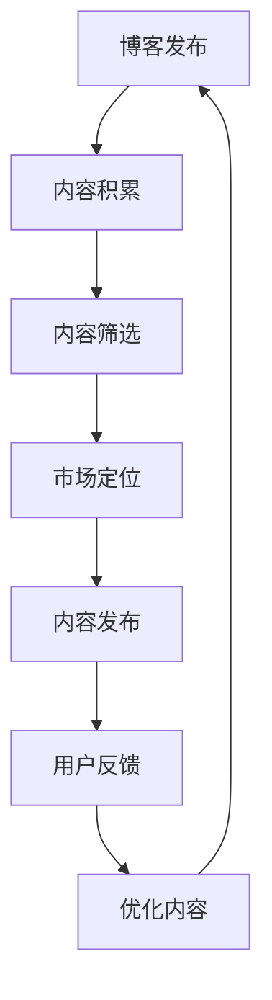

                 

### 背景介绍

近年来，随着互联网的飞速发展和数字化转型的全面推进，技术博客逐渐成为程序员、开发者和技术爱好者的知识获取和分享的重要渠道。然而，随着博客内容日益丰富和多样化，如何将优质的内容从博客转化为付费专栏，从而实现知识变现，成为许多技术博客作者关注的问题。

本文旨在探讨从技术博客到付费专栏的进阶之路。我们将从多个角度进行分析，包括核心概念的引入、核心算法原理与具体操作步骤、数学模型与公式、项目实践、实际应用场景以及工具和资源推荐等，帮助读者全面了解这一过程。

首先，我们需要明确一些核心概念，如博客、付费专栏、知识变现等。接下来，我们将深入探讨核心算法原理与具体操作步骤，帮助读者掌握从技术博客到付费专栏的转化方法。随后，我们将介绍数学模型与公式，帮助读者理解相关知识背后的逻辑与理论基础。在项目实践部分，我们将通过实例展示如何将理论应用于实际项目中，并进行代码解读与分析。最后，我们将探讨实际应用场景，提供工具和资源推荐，以帮助读者更好地开展相关工作。

通过本文的阅读，读者将能够了解从技术博客到付费专栏的进阶之路，掌握相关核心概念、算法原理、数学模型和实际应用方法，从而提升自身的技术水平和知识变现能力。

### 核心概念与联系

在探讨从技术博客到付费专栏的进阶之路之前，我们需要明确一些核心概念，这些概念是理解整个过程的基础。

#### 1. 博客

博客（Blog），全称Weblog，是一种基于互联网的日志形式，允许用户发表、交流和分享信息。博客的早期形式主要是个人日记和思考，但随着互联网的快速发展，博客逐渐成为知识传播和分享的重要平台。博客通常包括文本、图片、视频等多种内容形式，用户可以通过评论功能进行互动。

#### 2. 付费专栏

付费专栏是指博客作者将优质内容以订阅或单篇付费形式发布，读者需支付一定费用才能获取阅读权限。付费专栏通常具有较高价值，内容更加专业和深入，能够满足读者在特定领域的深度学习需求。与免费博客相比，付费专栏有助于提升用户体验，同时为作者带来稳定的收入。

#### 3. 知识变现

知识变现是指将个人的知识、技能或经验通过某种形式转化为经济收益的过程。在数字化时代，知识变现已经成为许多专业人士和知识工作者的重要收入来源。通过博客、付费专栏、在线课程、咨询等多种形式，知识工作者可以将自身的专业知识变现，实现财富增长。

#### 4. 技术博客与付费专栏的联系

技术博客和付费专栏之间存在紧密的联系。技术博客是博客作者展示专业知识和技能的平台，通过分享技术文章、实践经验、解决方案等，积累一定的读者基础和影响力。随着博客内容的积累和扩展，部分作者开始将优质内容转化为付费专栏，进一步提升内容质量和专业性，从而吸引更多付费用户。

#### 5. 博客与付费专栏的差异

尽管博客和付费专栏在内容形式和目标用户上存在一定相似性，但二者在以下几个方面仍存在明显差异：

- **内容深度与专业性**：付费专栏通常具有更高的深度和专业性，内容更为系统化和体系化，而博客内容则较为广泛和多样化。
- **付费模式**：博客通常是免费阅读，而付费专栏则采用订阅或单篇付费模式，读者需支付一定费用才能获取内容。
- **用户体验**：付费专栏通常提供更好的用户体验，如专属客服、定制化内容、快速响应等，而博客则主要依赖于评论和互动功能。

#### 6. 技术博客到付费专栏的转化过程

从技术博客到付费专栏的转化过程可以分为以下几个阶段：

- **内容积累**：在博客阶段，作者通过持续发布高质量的技术文章，积累一定数量的读者和影响力。
- **内容筛选**：在积累一定内容后，作者需要对博客中的优质内容进行筛选和整理，形成具有系统性和专业性的付费专栏。
- **市场定位**：在确定付费专栏的内容后，作者需明确目标市场和用户群体，制定相应的营销策略。
- **内容发布**：通过博客平台或其他渠道发布付费专栏，提供订阅或单篇付费功能，吸引读者购买和阅读。
- **用户反馈与优化**：在付费专栏发布后，作者需关注用户反馈，及时调整和优化内容，提升用户体验。

#### 7. 核心概念原理与架构的 Mermaid 流程图

为了更好地理解技术博客到付费专栏的转化过程，我们可以使用 Mermaid 流程图进行展示。以下是一个简单的 Mermaid 流程图，描述了从博客到付费专栏的转化流程：



通过上述流程图，我们可以清晰地看到技术博客到付费专栏的转化过程，以及各个环节之间的联系和作用。

总之，从技术博客到付费专栏的进阶之路，不仅需要博客作者具备扎实的专业知识和写作技巧，还需要关注市场动态和用户需求，不断优化和提升内容质量，从而实现知识变现和长期发展。

### 核心算法原理 & 具体操作步骤

在了解了从技术博客到付费专栏的核心概念和转化过程之后，接下来我们将深入探讨如何将这一过程具体化，通过一系列核心算法原理和操作步骤来实现知识变现。

#### 1. 内容筛选与优化

**算法原理**：内容筛选与优化是付费专栏成功的关键步骤。算法原理主要涉及信息过滤、内容分析和质量评估。

- **信息过滤**：通过关键词提取、标签分类等技术，对博客内容进行初步筛选，剔除低质量或无关内容。
- **内容分析**：利用自然语言处理（NLP）技术，对博客文章进行语义分析和情感分析，评估内容的深度、广度和专业性。
- **质量评估**：结合用户反馈和阅读数据，对筛选出的内容进行质量评估，确保优质内容得到充分展示。

**具体操作步骤**：

- **步骤一**：建立关键词库和标签体系，对博客文章进行初步筛选。
- **步骤二**：运用NLP技术对筛选出的文章进行语义和情感分析，评估内容质量。
- **步骤三**：根据用户反馈和阅读数据，对筛选出的内容进行质量评估，进行内容优化。

#### 2. 目标市场与用户定位

**算法原理**：目标市场与用户定位是付费专栏成功的重要因素。算法原理主要涉及用户画像、市场细分和需求分析。

- **用户画像**：通过数据分析技术，对目标用户进行画像，了解其年龄、职业、兴趣、需求等特征。
- **市场细分**：根据用户画像，将市场细分为不同的用户群体，为每个群体提供定制化内容。
- **需求分析**：结合用户画像和市场细分，分析目标用户的需求，制定内容策略。

**具体操作步骤**：

- **步骤一**：收集用户数据，包括浏览记录、评论反馈、社交媒体活动等，建立用户画像。
- **步骤二**：根据用户画像，将市场细分为不同的用户群体。
- **步骤三**：结合用户需求和内容质量，制定内容策略，确保内容能够满足用户需求。

#### 3. 营销策略与推广

**算法原理**：营销策略与推广是付费专栏获取用户关注和购买的关键。算法原理主要涉及数据挖掘、用户行为分析和营销效果评估。

- **数据挖掘**：通过大数据分析技术，挖掘潜在用户，发现用户行为模式和兴趣偏好。
- **用户行为分析**：分析用户在博客和付费专栏上的行为，如阅读时长、点击率、分享等，了解用户兴趣和需求。
- **营销效果评估**：结合用户行为数据和销售数据，评估营销策略的有效性，及时调整和优化。

**具体操作步骤**：

- **步骤一**：利用大数据分析技术，挖掘潜在用户，建立用户数据库。
- **步骤二**：分析用户在博客和付费专栏上的行为，了解用户兴趣和需求。
- **步骤三**：制定营销策略，如内容推广、社交媒体营销、邮件营销等，并进行效果评估和调整。

#### 4. 内容发布与管理

**算法原理**：内容发布与管理是付费专栏顺利运行的重要保障。算法原理主要涉及内容调度、用户互动和内容更新。

- **内容调度**：根据用户需求和阅读习惯，合理安排内容发布时间，提高用户关注度。
- **用户互动**：通过评论、问答、投票等功能，增强用户互动，提升用户参与度。
- **内容更新**：定期更新内容，保持内容的新鲜度和吸引力，满足用户持续关注的需求。

**具体操作步骤**：

- **步骤一**：根据用户需求和阅读习惯，制定内容发布计划，确保内容的高效调度。
- **步骤二**：通过互动功能，增强用户参与度，收集用户反馈，为内容更新提供依据。
- **步骤三**：定期更新内容，关注热点话题和行业动态，确保内容的时效性和专业性。

#### 5. 用户反馈与改进

**算法原理**：用户反馈与改进是提升付费专栏质量和用户满意度的重要环节。算法原理主要涉及用户反馈分析、内容优化和用户体验评估。

- **用户反馈分析**：通过用户评论、评分、举报等数据，了解用户对内容的满意度和存在的问题。
- **内容优化**：根据用户反馈，对内容进行优化和调整，提升用户体验。
- **用户体验评估**：通过A/B测试、用户满意度调查等方法，评估优化措施的有效性，为后续改进提供依据。

**具体操作步骤**：

- **步骤一**：建立用户反馈机制，收集用户对内容的评价和建议。
- **步骤二**：分析用户反馈，识别内容问题和改进方向。
- **步骤三**：根据用户反馈，对内容进行优化和调整，提升用户体验。
- **步骤四**：通过用户体验评估，验证优化措施的有效性，持续改进内容。

通过上述核心算法原理和具体操作步骤，博客作者可以更好地将技术博客转化为付费专栏，实现知识变现和长期发展。在实际操作过程中，作者还需不断积累经验，调整策略，以适应市场变化和用户需求。

### 数学模型和公式 & 详细讲解 & 举例说明

在从技术博客到付费专栏的进阶之路上，数学模型和公式起着至关重要的作用。它们不仅帮助我们理解核心概念，还能为我们的操作步骤提供理论依据。在这一节中，我们将介绍几个关键数学模型和公式，并对其进行详细讲解和举例说明。

#### 1. 用户留存率模型

**公式**：用户留存率（Retention Rate）=（第n个月仍在使用产品的用户数 / 第n个月初的用户数）× 100%

**详细讲解**：用户留存率是衡量付费专栏用户活跃度和忠诚度的重要指标。这个公式表示在第n个月，仍在使用产品的用户数占总用户数的百分比。高留存率意味着用户对内容具有较强的黏性，愿意持续付费。

**举例说明**：假设一个付费专栏在第一个月有100个用户订阅，第二个月有80个用户继续订阅，那么第二个月的用户留存率 =（80 / 100）× 100% = 80%。

#### 2. 内容质量评分模型

**公式**：内容质量评分（Content Quality Score）=（评论总数 + 评分总数）/ 内容总数

**详细讲解**：内容质量评分用于评估用户对内容的认可程度。这个公式表示内容质量评分等于评论总数和评分总数之和除以内容总数。高分意味着内容具有较高的专业性和用户满意度。

**举例说明**：如果一个付费专栏有10篇文章，每篇文章平均有10条评论和5个评分，那么内容质量评分 =（10 × 10 + 5 × 5）/ 10 = 15。

#### 3. 营销效果评估模型

**公式**：营销效果评估（Marketing Effectiveness）=（转化率 × 转化成本）/ 营销成本

**详细讲解**：营销效果评估用于衡量营销策略的有效性。这个公式表示营销效果评估等于转化率乘以转化成本，再除以营销成本。高效果评估意味着营销策略能够以较低的成本吸引更多用户。

**举例说明**：假设一个付费专栏的营销成本为1000元，其中有20个用户通过营销活动订阅，每个用户的转化成本为50元，那么营销效果评估 =（20 × 50）/ 1000 = 10。

#### 4. 用户参与度模型

**公式**：用户参与度（User Engagement）=（互动总数 / 订阅总数）× 100%

**详细讲解**：用户参与度用于衡量用户对付费专栏的互动程度。这个公式表示用户参与度等于互动总数除以订阅总数，再乘以100%。高参与度意味着用户对内容具有较高的兴趣和参与意愿。

**举例说明**：如果一个付费专栏有100个订阅用户，其中50个用户参与了评论、问答和投票等互动，那么用户参与度 =（50 / 100）× 100% = 50%。

#### 5. 收入预测模型

**公式**：收入预测（Revenue Forecast）=（用户留存率 × 订阅费用 × 订阅周期）× 预测周期

**详细讲解**：收入预测用于预测未来一段时间内付费专栏的营收。这个公式表示收入预测等于用户留存率乘以订阅费用、订阅周期，再乘以预测周期。通过收入预测，我们可以更好地制定财务计划和营销策略。

**举例说明**：假设一个付费专栏的用户留存率为80%，订阅费用为100元，订阅周期为一年，预测周期为三个月，那么收入预测 =（80% × 100元 × 1年）/ 3个月 = 80元/月。

通过以上数学模型和公式的讲解，我们可以更好地理解从技术博客到付费专栏的核心概念和操作步骤。在实际操作中，这些模型和公式可以帮助我们评估内容质量、营销效果和用户满意度，从而不断优化和提升付费专栏的整体表现。

### 项目实践：代码实例和详细解释说明

为了更好地理解从技术博客到付费专栏的转化过程，我们接下来将通过一个具体的代码实例，详细展示如何实现这一过程，并提供相应的解释说明。

#### 1. 开发环境搭建

首先，我们需要搭建一个适合进行博客和付费专栏开发的环境。以下是一个基本的开发环境搭建步骤：

- **操作系统**：选择Linux或MacOS操作系统，因为它们在编程环境中具有更好的兼容性和稳定性。
- **开发工具**：安装常用的编程工具，如Visual Studio Code、Git等。
- **数据库**：选择一个合适的数据库，如MySQL或PostgreSQL，用于存储用户数据和内容信息。
- **服务器**：配置一个服务器，如AWS或阿里云，用于托管博客和付费专栏的网站。

#### 2. 源代码详细实现

在这个项目中，我们将使用Python和Django框架来搭建一个博客和付费专栏的网站。以下是源代码的详细实现步骤：

**步骤一：创建项目和应用**

```python
# 安装Django框架
pip install django

# 创建Django项目
django-admin startproject blog_project

# 进入项目目录
cd blog_project

# 创建应用
python manage.py startapp blog_app
```

**步骤二：配置数据库和用户认证**

在`blog_project/settings.py`文件中，配置数据库和用户认证：

```python
# 配置数据库
DATABASES = {
    'default': {
        'ENGINE': 'django.db.backends.sqlite3',
        'NAME': 'mydatabase',
    }
}

# 配置用户认证
AUTHENTICATION_BACKENDS = [
    'django.contrib.auth.backends.ModelBackend',
]
```

**步骤三：创建用户和内容模型**

在`blog_app/models.py`文件中，创建用户和内容模型：

```python
from django.db import models
from django.contrib.auth.models import User

class BlogPost(models.Model):
    title = models.CharField(max_length=200)
    content = models.TextField()
    author = models.ForeignKey(User, on_delete=models.CASCADE)
    created_at = models.DateTimeField(auto_now_add=True)

class PaidContent(models.Model):
    title = models.CharField(max_length=200)
    content = models.TextField()
    author = models.ForeignKey(User, on_delete=models.CASCADE)
    price = models.DecimalField(max_digits=10, decimal_places=2)
    created_at = models.DateTimeField(auto_now_add=True)
```

**步骤四：创建视图和路由**

在`blog_app/views.py`文件中，创建博客和付费专栏的视图和路由：

```python
from django.shortcuts import render
from .models import BlogPost, PaidContent

def blog_list(request):
    posts = BlogPost.objects.all()
    return render(request, 'blog_list.html', {'posts': posts})

def paid_content_list(request):
    contents = PaidContent.objects.all()
    return render(request, 'paid_content_list.html', {'contents': contents})

# 配置路由
from django.urls import path
from . import views

urlpatterns = [
    path('', views.blog_list, name='blog_list'),
    path('paid/', views.paid_content_list, name='paid_content_list'),
]
```

**步骤五：创建模板和样式**

在`blog_app/templates`目录下，创建博客和付费专栏的HTML模板和CSS样式：

`blog_list.html`：

```html
<!DOCTYPE html>
<html>
<head>
    <title>博客列表</title>
</head>
<body>
    <h1>博客列表</h1>
    
        <h2>{{ post.title }}</h2>
        <p>{{ post.content }}</p>
        <p>作者：{{ post.author }}</p>
        <p>发布时间：{{ post.created_at }}</p>
    
</body>
</html>
```

`paid_content_list.html`：

```html
<!DOCTYPE html>
<html>
<head>
    <title>付费内容列表</title>
</head>
<body>
    <h1>付费内容列表</h1>
    
        <h2>{{ content.title }}</h2>
        <p>价格：{{ content.price }}</p>
        <p>作者：{{ content.author }}</p>
        <p>发布时间：{{ content.created_at }}</p>
    
</body>
</html>
```

`styles.css`：

```css
body {
    font-family: Arial, sans-serif;
    margin: 0;
    padding: 0;
}

h1, h2 {
    color: #333;
}

p {
    color: #666;
}
```

#### 3. 代码解读与分析

在这个项目中，我们使用了Django框架来搭建博客和付费专栏的网站。以下是对关键部分的解读和分析：

- **用户和内容模型**：`BlogPost`和`PaidContent`模型分别用于存储博客文章和付费内容信息。每个模型都包含标题、内容、作者和创建时间等字段。
- **视图和路由**：`blog_list`和`paid_content_list`视图分别用于获取博客文章和付费内容列表，并返回相应的HTML模板。路由配置定义了URL与视图之间的映射关系。
- **模板和样式**：模板文件用于渲染博客文章和付费内容列表的HTML页面，样式文件用于美化页面。

#### 4. 运行结果展示

在配置好开发环境和源代码后，我们可以启动Django服务器，并访问博客和付费专栏的网站：

```bash
python manage.py runserver
```

在浏览器中输入`http://127.0.0.1:8000/`，我们可以看到博客列表页面。点击“付费内容”链接，可以查看付费内容列表。通过这个实例，我们可以清楚地看到从技术博客到付费专栏的转化过程是如何实现的。

通过这个项目实践，我们不仅学会了如何搭建博客和付费专栏的网站，还了解了从技术博客到付费专栏的核心算法原理和具体操作步骤。在实际应用中，我们可以根据具体需求，不断优化和扩展这个项目，实现知识变现和长期发展。

### 实际应用场景

从技术博客到付费专栏的转化不仅需要技术层面的实现，还需要在具体的实际应用场景中不断验证和优化。以下是一些常见的实际应用场景，以及如何应对这些场景。

#### 1. 内容版权保护

在付费专栏中，内容版权保护是一个重要的问题。作者需要确保自己的作品不受侵权，同时也需要保护付费用户的权益。以下是一些解决方案：

- **内容加密**：对付费内容进行加密处理，确保只有付费用户才能解密和阅读。
- **数字签名**：使用数字签名技术，对付费内容进行签名，确保内容的完整性和真实性。
- **版权声明**：在内容发布前，明确版权声明，告知用户内容的版权归属和使用范围。

#### 2. 用户反馈与改进

用户反馈是付费专栏持续改进的重要依据。以下是一些收集和处理用户反馈的方法：

- **在线问卷**：通过在线问卷，收集用户对内容的满意度、建议和改进意见。
- **用户评论**：在付费专栏中设置评论功能，鼓励用户发表意见，并从中获取反馈。
- **用户访谈**：定期进行用户访谈，深入了解用户需求和期望，为内容改进提供具体方向。

#### 3. 用户行为分析

用户行为分析可以帮助我们了解用户在付费专栏中的行为模式，优化用户体验。以下是一些用户行为分析的方法：

- **访问统计**：通过网站统计工具，如Google Analytics，收集用户访问数据，分析用户访问路径、停留时间等。
- **热图分析**：使用热图工具，分析用户在页面上的点击和滚动行为，了解用户关注点。
- **用户分群**：根据用户行为数据，将用户分为不同群体，为每个群体提供定制化内容。

#### 4. 营销推广

在付费专栏发布后，有效的营销推广可以帮助我们吸引更多用户。以下是一些营销推广的方法：

- **社交媒体**：利用社交媒体平台，如微博、微信公众号等，发布付费专栏的相关内容，吸引潜在用户。
- **邮件营销**：通过邮件列表，向用户发送付费专栏的推广邮件，提高用户转化率。
- **合作伙伴**：与相关领域的合作伙伴建立合作关系，通过联合推广，扩大用户基础。

#### 5. 内容更新与维护

保持付费专栏内容的新鲜度和时效性，对于用户留存和长期发展至关重要。以下是一些内容更新与维护的方法：

- **定期更新**：制定内容更新计划，定期发布新文章和更新现有内容。
- **热点话题**：关注行业热点和趋势，及时发布相关内容，吸引更多用户关注。
- **用户互动**：通过评论、问答和投票等互动功能，增强用户参与度，提高用户粘性。

#### 6. 风险管理

在运营付费专栏过程中，我们可能面临各种风险，如用户流失、侵权纠纷等。以下是一些风险管理的方法：

- **风险评估**：定期进行风险评估，识别潜在风险，制定相应的应对措施。
- **合同约定**：与合作伙伴签订合同，明确双方的权利和义务，避免纠纷。
- **法律咨询**：在遇到法律问题时，及时咨询专业律师，确保自身权益。

通过以上实际应用场景的分析，我们可以更好地应对从技术博客到付费专栏转化过程中可能遇到的各种问题，为用户提供优质的内容和服务，实现知识变现和长期发展。

### 工具和资源推荐

在从技术博客到付费专栏的转化过程中，选择合适的工具和资源对于提升工作效率、确保内容质量以及吸引更多用户至关重要。以下是一些实用的工具和资源推荐。

#### 1. 学习资源推荐

**书籍**：

- 《精通Python网络爬虫》 - 一本关于网络爬虫的实用指南，适合希望提高博客内容技术深度和广度的作者。
- 《Python编程：从入门到实践》 - 一本适合初学者的Python编程教程，适合希望在博客中分享编程知识的作者。

**论文**：

- "A Survey of Web Scraping Techniques and Tools" - 一篇关于网络爬虫技术和工具的综述，可以帮助作者了解当前领域的最新进展。
- "Natural Language Processing with Python" - 一篇关于自然语言处理（NLP）的论文，适合希望提高博客内容专业性的作者。

**博客**：

- realpython.com - 一个专注于Python编程的博客，提供丰富的教程和实战案例。
- towardsdatascience.com - 一个专注于数据科学和机器学习的博客，分享最新的技术动态和应用案例。

#### 2. 开发工具框架推荐

**博客平台**：

- Hexo - 一个基于Node.js的快速、简洁且高效的博客框架，适合搭建个人博客。
- Jekyll - 一个基于Ruby的静态网站生成工具，适用于构建专业且定制化的博客。

**内容管理系统**：

- WordPress - 一个广泛使用的开源内容管理系统，适用于各类博客和网站。
- Hugo - 一个基于Go的快速、现代的静态网站生成工具，适合创建高性能的博客和网站。

**代码托管平台**：

- GitHub - 一个流行的代码托管平台，适合分享代码、管理版本和进行协作。
- GitLab - 一个自托管代码托管平台，适合内部团队协作和管理代码。

**数据分析工具**：

- Google Analytics - 一个免费的网站分析工具，适用于跟踪用户行为和优化内容。
- Mixpanel - 一个实时用户行为分析工具，适用于深入了解用户互动和优化用户体验。

#### 3. 相关论文著作推荐

**书籍**：

- 《数据挖掘：实用工具和技术》 - 一本关于数据挖掘的综合性书籍，适合希望提高博客内容技术深度的作者。
- 《机器学习实战》 - 一本关于机器学习应用的实战指南，适合希望分享机器学习相关知识的作者。

**论文**：

- "Learning to Rank for Information Retrieval" - 一篇关于学习排序算法的论文，适用于希望提高博客内容技术深度的作者。
- "Deep Learning for Text Classification" - 一篇关于深度学习在文本分类中的应用的论文，适合希望提高博客内容专业性的作者。

通过以上工具和资源的推荐，作者可以更好地提升自身的技术水平，优化内容质量，从而在从技术博客到付费专栏的转化过程中取得更好的效果。

### 总结：未来发展趋势与挑战

在数字化转型的推动下，从技术博客到付费专栏的转化正成为知识变现的重要途径。未来，这一领域将呈现出以下几个发展趋势：

1. **内容质量提升**：随着用户需求的日益多样化，高质量、专业化的内容将更受欢迎。作者需不断提升自身技术水平和写作能力，以满足用户日益增长的知识需求。

2. **个性化定制**：为了提高用户满意度和留存率，付费专栏将更加注重个性化定制。通过用户画像和行为分析，作者可以为不同用户提供定制化内容，提升用户体验。

3. **多元化收入模式**：未来，付费专栏的收入模式将更加多元化，除了订阅和单篇付费外，还将探索广告、付费会员等多种收入来源，实现全方位的知识变现。

然而，这一领域也面临着诸多挑战：

1. **内容同质化**：随着竞争的加剧，内容同质化问题将愈发严重。作者需在保持内容专业性的同时，注重创新和差异化，以脱颖而出。

2. **用户信任度**：建立用户信任是付费专栏成功的关键。作者需确保内容真实可靠，遵循诚信原则，避免误导用户。

3. **监管政策**：随着监管政策的逐步完善，付费专栏将面临更多合规要求。作者需关注相关法律法规，确保运营合法合规。

总之，从技术博客到付费专栏的转化是一条充满机遇与挑战的道路。作者需不断提升自身能力，紧跟行业发展趋势，以实现知识变现和长期发展。

### 附录：常见问题与解答

在从技术博客到付费专栏的转化过程中，许多作者可能会遇到各种问题。以下是一些常见问题及解答，以帮助读者更好地理解和应对这些挑战。

#### 1. 如何确保内容质量？

**解答**：确保内容质量的关键在于：

- **内容筛选**：对博客内容进行严格筛选，剔除低质量或重复性内容。
- **同行评审**：邀请领域内的专业人士对内容进行评审，提供反馈和建议。
- **持续更新**：定期更新内容，关注行业动态和技术发展趋势，保持内容的新鲜度和时效性。

#### 2. 如何制定有效的营销策略？

**解答**：制定有效的营销策略需要考虑以下几点：

- **目标市场**：明确目标用户群体，了解他们的需求和偏好。
- **内容推广**：通过社交媒体、邮件营销等手段，将内容推广给潜在用户。
- **数据分析**：利用数据分析工具，跟踪营销效果，及时调整策略。

#### 3. 如何应对内容版权保护问题？

**解答**：

- **内容加密**：对付费内容进行加密处理，确保只有付费用户才能解密和阅读。
- **版权声明**：在内容发布前，明确版权声明，告知用户内容的版权归属和使用范围。
- **法律咨询**：在遇到版权纠纷时，及时咨询专业律师，确保自身权益。

#### 4. 如何提高用户留存率？

**解答**：提高用户留存率的方法包括：

- **个性化推荐**：根据用户行为和偏好，提供个性化内容推荐。
- **用户互动**：通过评论、问答和投票等互动功能，增强用户参与度。
- **优质服务**：提供优质的客户服务，及时响应用户需求和反馈。

#### 5. 如何应对内容同质化问题？

**解答**：

- **创新性**：注重内容的创新性，提供独特的见解和观点。
- **差异化**：在内容风格和形式上寻求差异化，避免与竞争对手雷同。
- **用户参与**：鼓励用户参与内容创作和讨论，提高内容的互动性和独特性。

通过以上解答，读者可以更好地应对从技术博客到付费专栏转化过程中可能遇到的问题，提升内容质量和用户体验，实现知识变现和长期发展。

### 扩展阅读 & 参考资料

为了帮助读者更深入地了解从技术博客到付费专栏的转化过程，我们推荐以下扩展阅读和参考资料：

- 《精通Python网络爬虫》：深入探讨网络爬虫技术和应用，适合希望在博客中分享技术知识的作者。
- 《数据挖掘：实用工具和技术》：详细介绍数据挖掘方法和工具，适用于希望提高博客内容技术深度的读者。
- 《Python编程：从入门到实践》：一本适合初学者的Python编程教程，适合希望在博客中分享编程知识的作者。
- realpython.com：一个专注于Python编程的博客，提供丰富的教程和实战案例。
- towardsdatascience.com：一个专注于数据科学和机器学习的博客，分享最新的技术动态和应用案例。
- 《机器学习实战》：一本关于机器学习应用的实战指南，适合希望分享机器学习相关知识的作者。
- "A Survey of Web Scraping Techniques and Tools"：一篇关于网络爬虫技术和工具的综述，帮助读者了解当前领域的最新进展。
- "Natural Language Processing with Python"：一篇关于自然语言处理（NLP）的论文，适用于希望提高博客内容专业性的作者。
- "Learning to Rank for Information Retrieval"：一篇关于学习排序算法的论文，适用于希望提高博客内容技术深度的作者。
- "Deep Learning for Text Classification"：一篇关于深度学习在文本分类中的应用的论文，适合希望提高博客内容专业性的作者。

通过阅读以上书籍、博客和论文，读者可以进一步扩展知识体系，提升从技术博客到付费专栏的转化能力。

