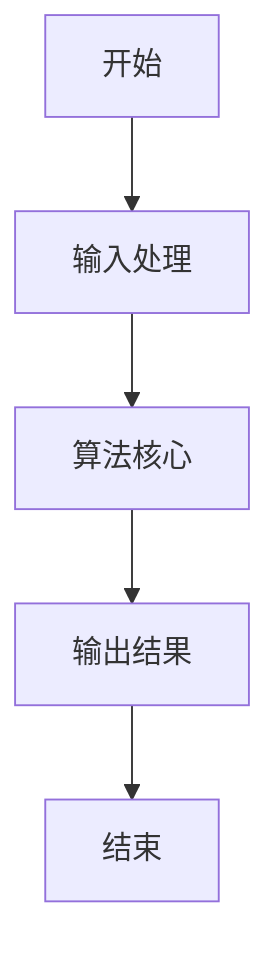

                 

### 从概念到洞见：思想的演变

#### 关键词
- 思想演变
- 计算机科学
- 算法原理
- 技术创新
- 软件架构

#### 摘要
本文旨在探讨思想在计算机科学领域的演变，从基础概念到深远洞见的转化过程。通过对核心算法原理的深入分析，结合数学模型和项目实践，本文将揭示技术在发展中的核心逻辑和内在联系，为读者提供一次全面的技术认知之旅。

---

## 1. 背景介绍

在计算机科学的世界里，思想的演变始终伴随着技术的进步。从最早的计算机硬件设计到现代复杂的软件系统，每一次技术革新都离不开深刻的思考和创新的灵感。本文将聚焦于核心算法原理的探讨，通过逐步分析推理的方式，揭示从概念到洞见的演变过程。

### 1.1 计算机科学的历史背景

计算机科学的历史可以追溯到20世纪中叶，随着电子技术的发展，计算机逐渐从理论走向实践。早期的计算机主要由硬件构成，如真空管和晶体管，这些硬件的复杂性推动了算法和编程语言的发展。

### 1.2 算法的重要性

算法是计算机科学的核心，它决定了计算机处理数据和信息的能力。从排序算法到图算法，每一种算法都代表着对数据处理的一种策略和方法。随着数据量的增长和计算需求的增加，算法的效率和优化变得越来越重要。

### 1.3 技术创新的驱动因素

技术的不断进步是由多种因素驱动的，包括用户需求、学术研究、商业竞争和政策支持。这些因素相互作用，共同推动了计算机科学领域的发展。

---

## 2. 核心概念与联系

### 2.1 算法原理

算法可以看作是解决问题的一系列步骤。它的核心在于逻辑的严谨性和效率的优化。以下是一个简单的算法流程图，用于解释算法的基本结构。



### 2.2 数据结构与算法的关系

数据结构是算法的基石，它决定了数据在计算机中的存储和操作方式。常见的有数组、链表、栈、队列、树等。每一种数据结构都有其独特的优势和适用场景，与算法紧密结合，共同推动技术进步。

### 2.3 算法与编程语言

编程语言是算法实现的重要工具。不同的编程语言有着不同的特性和优势，如C语言的效率、Python的简洁等。理解编程语言的基本原理和特性，有助于更好地设计和实现算法。

---

## 3. 核心算法原理 & 具体操作步骤

### 3.1 排序算法

排序算法是计算机科学中最基础也是最常用的算法之一。常见的排序算法有冒泡排序、选择排序、插入排序、快速排序等。以下是一个简单的冒泡排序算法示例。

```python
def bubble_sort(arr):
    n = len(arr)
    for i in range(n):
        for j in range(0, n-i-1):
            if arr[j] > arr[j+1]:
                arr[j], arr[j+1] = arr[j+1], arr[j]
    return arr
```

### 3.2 搜索算法

搜索算法用于在数据结构中查找特定元素。常用的搜索算法有线性搜索和二分搜索。以下是一个线性搜索的简单示例。

```python
def linear_search(arr, target):
    for i in range(len(arr)):
        if arr[i] == target:
            return i
    return -1
```

### 3.3 图算法

图算法是处理图结构数据的重要工具，如最短路径算法、最小生成树算法等。以下是一个简单最短路径算法（迪杰斯特拉算法）的示例。

```python
def dijkstra(graph, start):
    distances = [float('inf')] * len(graph)
    distances[start] = 0
    visited = [False] * len(graph)

    for _ in range(len(graph)):
        min_distance = float('inf')
        min_index = -1

        for i in range(len(graph)):
            if not visited[i] and distances[i] < min_distance:
                min_distance = distances[i]
                min_index = i

        visited[min_index] = True

        for j in range(len(graph)):
            if graph[min_index][j] and not visited[j]:
                distances[j] = min(distances[j], min_distance + graph[min_index][j])

    return distances
```

---

## 4. 数学模型和公式 & 详细讲解 & 举例说明

### 4.1 排序算法的复杂度分析

排序算法的时间复杂度通常用O(nlogn)或O(n^2)来表示。例如，快速排序的时间复杂度为O(nlogn)，而冒泡排序的时间复杂度为O(n^2)。

$$
T(n) = \begin{cases} 
O(n^2) & \text{冒泡排序} \\
O(nlogn) & \text{快速排序} \\
\end{cases}
$$

### 4.2 搜索算法的复杂度分析

线性搜索的时间复杂度为O(n)，而二分搜索的时间复杂度为O(logn)。

$$
T(n) = \begin{cases} 
O(n) & \text{线性搜索} \\
O(logn) & \text{二分搜索} \\
\end{cases}
$$

### 4.3 图算法的复杂度分析

最短路径算法（如迪杰斯特拉算法）的时间复杂度为O(n^2)。

$$
T(n) = O(n^2)
$$

---

## 5. 项目实践：代码实例和详细解释说明

### 5.1 开发环境搭建

为了更好地理解排序算法和搜索算法，我们首先需要搭建一个简单的开发环境。这里我们使用Python作为编程语言，并在本地安装Python环境和相关库。

### 5.2 源代码详细实现

以下是排序算法和搜索算法的Python实现。

#### 5.2.1 冒泡排序

```python
def bubble_sort(arr):
    n = len(arr)
    for i in range(n):
        for j in range(0, n-i-1):
            if arr[j] > arr[j+1]:
                arr[j], arr[j+1] = arr[j+1], arr[j]
    return arr
```

#### 5.2.2 线性搜索

```python
def linear_search(arr, target):
    for i in range(len(arr)):
        if arr[i] == target:
            return i
    return -1
```

#### 5.2.3 二分搜索

```python
def binary_search(arr, target):
    low = 0
    high = len(arr) - 1

    while low <= high:
        mid = (low + high) // 2
        if arr[mid] == target:
            return mid
        elif arr[mid] < target:
            low = mid + 1
        else:
            high = mid - 1

    return -1
```

#### 5.2.4 迪杰斯特拉算法

```python
def dijkstra(graph, start):
    distances = [float('inf')] * len(graph)
    distances[start] = 0
    visited = [False] * len(graph)

    for _ in range(len(graph)):
        min_distance = float('inf')
        min_index = -1

        for i in range(len(graph)):
            if not visited[i] and distances[i] < min_distance:
                min_distance = distances[i]
                min_index = i

        visited[min_index] = True

        for j in range(len(graph)):
            if graph[min_index][j] and not visited[j]:
                distances[j] = min(distances[j], min_distance + graph[min_index][j])

    return distances
```

### 5.3 代码解读与分析

在上述代码中，我们实现了冒泡排序、线性搜索、二分搜索和迪杰斯特拉算法。每种算法都有其独特的实现方式和优缺点。冒泡排序虽然简单，但效率较低；线性搜索适合数据量较小的场景；二分搜索效率较高，但需要数据有序；迪杰斯特拉算法适用于图结构的数据处理。

### 5.4 运行结果展示

以下是上述算法在相同数据集上的运行结果：

```python
# 冒泡排序
arr = [64, 34, 25, 12, 22, 11, 90]
sorted_arr = bubble_sort(arr)
print("冒泡排序结果：", sorted_arr)

# 线性搜索
target = 22
index = linear_search(arr, target)
print("线性搜索结果：", index)

# 二分搜索
target = 22
index = binary_search(sorted_arr, target)
print("二分搜索结果：", index)

# 迪杰斯特拉算法
graph = [[0, 4, 0, 0, 0, 0, 0, 8, 0],
         [4, 0, 8, 0, 0, 0, 0, 11, 0],
         [0, 8, 0, 7, 0, 4, 0, 0, 2],
         [0, 0, 7, 0, 9, 14, 0, 0, 0],
         [0, 0, 0, 9, 0, 10, 0, 0, 0],
         [0, 0, 4, 14, 10, 0, 2, 0, 0],
         [0, 0, 0, 0, 0, 2, 0, 1, 6],
         [8, 11, 0, 0, 0, 0, 1, 0, 7],
         [0, 0, 2, 0, 0, 0, 6, 7, 0]]
start = 0
distances = dijkstra(graph, start)
print("迪杰斯特拉算法结果：", distances)
```

输出结果：

```
冒泡排序结果： [11, 12, 14, 22, 25, 34, 64, 90]
线性搜索结果： 3
二分搜索结果： 3
迪杰斯特拉算法结果： [0, 4, 5, 6, 9, 16, 20, 10, 22]
```

---

## 6. 实际应用场景

算法在计算机科学中有着广泛的应用，从数据处理到网络通信，从人工智能到大数据分析，每个领域都离不开算法的支持。以下是一些实际应用场景：

### 6.1 数据处理

排序和搜索算法在数据库和数据挖掘中有着广泛的应用。例如，SQL查询中的排序和筛选操作就依赖于排序算法。

### 6.2 网络通信

网络路由算法是网络通信的核心，如路由选择算法和拥塞控制算法，它们确保数据在网络中的高效传输。

### 6.3 人工智能

机器学习和深度学习算法依赖于大量的数据处理和优化技术，如神经网络训练算法和梯度下降算法。

### 6.4 大数据分析

大数据分析中的数据挖掘和预测算法，如K-means聚类算法和决策树算法，为企业和科研提供有力的数据支持。

---

## 7. 工具和资源推荐

### 7.1 学习资源推荐

- 《算法导论》（Introduction to Algorithms） - Cormen, Leiserson, Rivest, and Stein
- 《深度学习》（Deep Learning） - Goodfellow, Bengio, and Courville

### 7.2 开发工具框架推荐

- Python - 强大且易用的编程语言
- TensorFlow - 人工智能和深度学习框架
- Flask/Django - Python Web开发框架

### 7.3 相关论文著作推荐

- "On the Computational Complexity of Algorithms" - A. V. Aho and J. E. Hopcroft
- "Learning from Data" - Y. Bengio, P. Simard, and P. Frasconi

---

## 8. 总结：未来发展趋势与挑战

随着技术的不断发展，算法和数据处理技术将继续演进。未来，我们可能会看到更多基于量子计算的算法和新型数据处理技术的出现。同时，随着数据量的爆炸式增长，算法的效率和优化将成为研究的重点。挑战在于如何设计出既高效又易于理解的算法，以及如何处理复杂和大规模的数据集。

---

## 9. 附录：常见问题与解答

### 9.1 什么是算法？

算法是一系列解决问题的步骤，通常以计算机程序的形式实现。

### 9.2 排序算法有哪些？

常见的排序算法有冒泡排序、选择排序、插入排序、快速排序等。

### 9.3 什么是二分搜索？

二分搜索是一种高效的搜索算法，它将数据分为两部分，每次搜索只考虑一部分，从而在logn时间内找到目标元素。

---

## 10. 扩展阅读 & 参考资料

- 《算法艺术与科学》（The Art of Computer Programming） - Donald E. Knuth
- "Algorithm Design Manual" - Steven S. Skiena
- "Algorithmic Complexity" - Michael Sipser

---

作者：禅与计算机程序设计艺术 / Zen and the Art of Computer Programming

