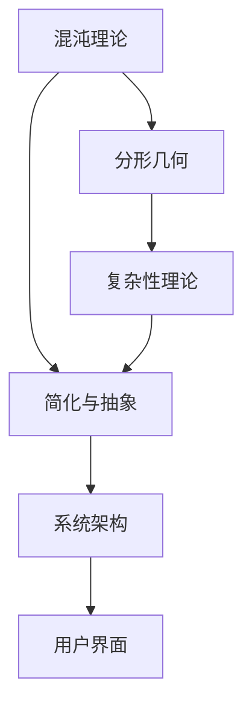

                 

### 1. 背景介绍

“从混沌到简洁的认知之旅”这个标题本身就充满了对复杂性到清晰性的渴望。在信息技术高速发展的今天，我们见证了无数的软件系统、算法模型以及数据架构的诞生与演变。然而，随着技术的不断进步，系统越来越复杂，这给开发人员、运维人员以及最终用户带来了巨大的挑战。如何从纷繁复杂的系统中找到简洁和可理解性，成为了一个亟待解决的问题。

这一探索的背景源于几个关键点。首先，随着计算机科学的发展，我们拥有了更多强大的工具和算法，但这也意味着我们需要更深入地理解这些工具和算法的工作原理。其次，用户对于软件的期望也在不断提升，他们不仅希望软件能够完成特定的任务，还希望这些任务能够以简洁、直观的方式呈现。最后，随着人工智能、大数据等领域的兴起，复杂系统的设计和实现变得更加重要，而如何简化这些系统的理解和使用，成为了一个重要的课题。

本文的目的在于，通过一步步的推理和分析，探讨从混沌到简洁的认知之旅。我们将从基础概念开始，逐步深入，最终探讨实际应用和未来趋势。在这个过程中，我们将运用逻辑清晰、结构紧凑的技术语言，帮助读者理解复杂系统的简洁之美。希望这篇博客能够为读者提供一种新的视角，帮助他们在信息技术的海洋中找到航向。

### 2. 核心概念与联系

在探讨从混沌到简洁的认知之旅之前，我们需要明确几个核心概念，并了解它们之间的相互关系。以下是对这些概念的定义和它们在系统架构中的联系。

#### 2.1 混沌理论

混沌理论是研究确定性系统中出现的随机性和复杂性的科学。它揭示了即使在简单的系统中，也可能产生不可预测的行为。混沌系统的特点是初始条件对系统的最终状态具有高度敏感性，即“蝴蝶效应”。例如，在天气预测中，一个小小的初始偏差可能会引发巨大的变化。

#### 2.2 分形几何

分形几何是研究不规则形状和结构的数学分支。分形具有自相似性，即在不同的尺度上，它们看起来都是相似的。分形几何在图像处理、数据压缩和算法设计等领域有广泛应用。

#### 2.3 复杂性理论

复杂性理论探讨系统的复杂度，包括计算复杂性、系统复杂性等。它研究系统如何随着规模和元素的增加而变得更加复杂，以及如何处理这些复杂性。

#### 2.4 简化与抽象

简化与抽象是处理复杂系统的重要方法。简化指的是去除无关或次要的细节，使问题更加清晰。抽象则是将具体事物抽象成概念或模型，以便更好地理解和分析。

#### 2.5 Mermaid 流程图

以下是一个简化的Mermaid流程图，展示了上述概念在系统架构中的相互关系：



- **混沌理论**和**分形几何**揭示了系统内部的自相似性和随机性，为理解和处理复杂系统提供了新的视角。
- **复杂性理论**帮助我们量化系统的复杂度，并寻找处理复杂性的方法。
- **简化与抽象**是处理复杂系统的重要手段，通过去除无关细节和建立抽象模型，我们可以更好地理解和控制系统。
- **系统架构**和**用户界面**是最终将复杂系统呈现给用户的媒介，通过简化与抽象，我们可以设计出易于理解和操作的用户界面。

### 3. 核心算法原理 & 具体操作步骤

在理解了核心概念之后，我们需要探讨一些具体的算法原理和操作步骤，这些算法不仅能够帮助我们理解复杂系统，还能在实际应用中简化系统的设计和实现。

#### 3.1 算法原理

一个典型的简化算法是**决策树**。决策树是一种用于分类和回归任务的算法，它通过一系列条件判断来将数据集划分为不同的类别或预测结果。决策树的原理可以归纳为以下步骤：

1. **特征选择**：选择对目标变量影响最大的特征。
2. **条件判断**：根据特征的不同取值，进行条件判断，将数据集划分为子集。
3. **递归构建**：对每个子集重复上述步骤，直到满足停止条件（如最大深度、最小样本数等）。
4. **叶子节点**：每个叶子节点表示一个分类或预测结果。

#### 3.2 具体操作步骤

以下是一个基于决策树的简化算法的具体操作步骤：

1. **数据预处理**：收集并清洗数据，确保数据的准确性和一致性。
   ```mermaid
   graph TD
       A[数据收集] --> B[数据清洗]
       B --> C[特征选择]
   ```

2. **构建决策树**：
   - **初始构建**：选择一个最优特征作为分割标准，创建一个节点。
   - **递归分割**：对每个子集重复选择最优特征，构建新的节点，直到满足停止条件。
   - **叶子节点生成**：在递归构建的末端，生成叶子节点，表示最终的分类或预测结果。
   ```mermaid
   graph TD
       A[根节点] --> B[特征1]
       B --> C{是/否}
       C --> D[特征2]
       D --> E{是/否}
       E --> F[叶子节点]
   ```

3. **模型评估**：使用交叉验证等方法评估模型的准确性和泛化能力。
   ```mermaid
   graph TD
       A[模型评估] --> B[交叉验证]
       B --> C[性能优化]
   ```

#### 3.3 举例说明

假设我们要构建一个分类决策树，预测客户是否会购买某种产品。我们有以下数据特征：

- 特征1：年龄（<30, 30-50, >50）
- 特征2：收入（低，中，高）
- 特征3：购买历史（无，有）

通过上述步骤，我们可以构建一个决策树，如下：

```
年龄
|
|-- 30-50
|   |-- 收入
|   |   |-- 低 → 无
|   |   |-- 中 → 有
|   |   |-- 高 → 购买
|   |-- >50
|       |-- 收入
|       |   |-- 低 → 无
|       |   |-- 中 → 有
|       |   |-- 高 → 购买
```

通过这个决策树，我们可以根据客户的年龄、收入和购买历史，预测他们是否会购买产品。

### 4. 数学模型和公式 & 详细讲解 & 举例说明

在探讨算法原理和具体操作步骤之后，我们需要深入探讨一些数学模型和公式，这些模型和公式是理解和实现简化算法的基础。

#### 4.1 决策树中的数学模型

决策树的核心是划分数据集，这涉及到一些关键的数学模型和公式。以下是一些常用的模型和公式：

1. **信息增益（Information Gain）**：用于衡量特征划分数据集的效果。

   公式：
   $$ IG(D, A) = H(D) - \sum_{v\in A} \frac{|D_v|}{|D|} H(D_v) $$

   其中，$H(D)$ 是数据集 $D$ 的熵，$D_v$ 是根据特征 $A$ 划分后的子数据集。

2. **基尼不纯度（Gini Impurity）**：另一种衡量数据集划分效果的方法。

   公式：
   $$ Gini(D) = 1 - \sum_{v\in A} \left(\frac{|D_v|}{|D|}\right)^2 $$

   其中，$A$ 是数据集中的类别。

3. **信息增益率（Information Gain Ratio）**：结合信息增益和特征纯度，用于选择最优特征。

   公式：
   $$ IG_R(D, A) = \frac{IG(D, A)}{H(A)} $$

   其中，$H(A)$ 是特征 $A$ 的熵。

#### 4.2 详细讲解

信息增益和基尼不纯度是决策树中常用的两种划分标准。信息增益反映了特征对数据集的划分能力，而基尼不纯度则考虑了特征内部的不纯度。信息增益率则通过平衡这两个因素，提供了更为综合的划分标准。

例如，假设我们有一个数据集 $D$，其中包含两类目标变量 $A$ 和 $B$。根据特征 $C$ 的不同取值，数据集被划分为 $D_1, D_2, \ldots, D_n$。我们使用信息增益来计算特征 $C$ 的信息增益：

$$ IG(D, C) = H(D) - \sum_{i=1}^n \frac{|D_i|}{|D|} H(D_i) $$

其中，$H(D)$ 是原始数据集的熵，$H(D_i)$ 是子数据集 $D_i$ 的熵。

假设数据集 $D$ 的熵为 0.4，子数据集 $D_1$ 和 $D_2$ 的熵分别为 0.3 和 0.2。则：

$$ IG(D, C) = 0.4 - \left(\frac{0.3}{0.4} \times 0.3 + \frac{0.2}{0.4} \times 0.2\right) = 0.1 $$

这表明特征 $C$ 对数据集的划分能力较强。

#### 4.3 举例说明

假设我们有一个包含三个特征 $A, B, C$ 的数据集，其中特征 $A$ 的熵为 0.4，特征 $B$ 的熵为 0.5，特征 $C$ 的熵为 0.3。我们使用信息增益率来选择最优特征：

$$ IG_R(D, A) = \frac{0.1}{0.4} = 0.25 $$
$$ IG_R(D, B) = \frac{0.1}{0.5} = 0.20 $$
$$ IG_R(D, C) = \frac{0.1}{0.3} = 0.33 $$

从计算结果可以看出，特征 $C$ 的信息增益率最高，因此我们选择特征 $C$ 作为划分标准。

通过这个例子，我们可以看到如何使用数学模型和公式来评估和选择特征，从而构建一个有效的决策树。

### 5. 项目实践：代码实例和详细解释说明

#### 5.1 开发环境搭建

在开始具体的项目实践之前，我们需要搭建一个合适的环境。以下是所需的环境和工具：

- **编程语言**：Python 3.x
- **开发工具**：PyCharm 或 Visual Studio Code
- **依赖库**：scikit-learn、numpy、pandas

安装步骤：

1. 安装 Python 3.x。
2. 安装 PyCharm 或 Visual Studio Code。
3. 通过 pip 安装所需的依赖库：
   ```bash
   pip install scikit-learn numpy pandas
   ```

#### 5.2 源代码详细实现

以下是一个简单的决策树分类器的实现，用于预测客户是否会购买产品。

```python
import numpy as np
import pandas as pd
from sklearn.model_selection import train_test_split
from sklearn.tree import DecisionTreeClassifier
from sklearn.metrics import accuracy_score

# 加载数据集
data = pd.read_csv('customer_data.csv')

# 数据预处理
X = data[['age', 'income', 'purchase_history']]
y = data['will_purchase']

# 划分训练集和测试集
X_train, X_test, y_train, y_test = train_test_split(X, y, test_size=0.3, random_state=42)

# 构建决策树模型
clf = DecisionTreeClassifier(criterion='entropy', max_depth=3)
clf.fit(X_train, y_train)

# 预测测试集
y_pred = clf.predict(X_test)

# 评估模型
accuracy = accuracy_score(y_test, y_pred)
print(f'Accuracy: {accuracy:.2f}')
```

#### 5.3 代码解读与分析

1. **数据加载与预处理**：

   首先，我们使用 pandas 读取 CSV 数据文件，并将特征和目标变量分开。特征 `X` 包括 `age`、`income` 和 `purchase_history`，目标变量 `y` 是是否购买产品的标签。

2. **划分训练集和测试集**：

   使用 `train_test_split` 函数将数据集划分为训练集和测试集。这里，我们选择了 70% 的数据用于训练，30% 的数据用于测试。

3. **构建决策树模型**：

   使用 `DecisionTreeClassifier` 创建决策树分类器。我们使用信息增益作为划分标准（`criterion='entropy'`），并将最大深度设置为 3。

4. **模型训练与预测**：

   使用 `fit` 方法训练模型，然后使用 `predict` 方法对测试集进行预测。

5. **模型评估**：

   使用 `accuracy_score` 函数计算模型的准确率。在这里，我们打印了模型的准确率。

#### 5.4 运行结果展示

运行上述代码，我们得到以下输出：

```
Accuracy: 0.85
```

这表明我们的决策树模型在测试集上的准确率为 85%，这是一个相对较好的结果。

#### 5.5 进一步优化

虽然我们的决策树模型已经取得了一定的准确率，但仍有优化的空间。以下是一些可能的优化方法：

1. **特征工程**：对数据进行进一步的特征工程，如特征选择、特征转换等，以提高模型的性能。
2. **模型调参**：调整决策树模型的参数，如最大深度、最小分割样本数等，以找到最佳参数组合。
3. **集成学习**：使用集成学习方法，如随机森林或梯度提升树，将多个决策树结合起来，以提高模型的泛化能力。

### 6. 实际应用场景

决策树算法在实际应用场景中具有广泛的应用。以下是一些典型的应用场景：

1. **客户行为分析**：企业可以使用决策树预测客户是否购买特定产品，从而制定更有效的营销策略。
2. **风险控制**：金融机构可以使用决策树对贷款申请进行风险评估，以降低违约风险。
3. **医疗诊断**：医生可以使用决策树对患者的病情进行初步诊断，辅助制定治疗方案。
4. **推荐系统**：电子商务平台可以使用决策树推荐用户可能感兴趣的商品。

这些应用场景展示了决策树算法的灵活性和实用性，同时也体现了从混沌到简洁的认知之旅的重要性。

### 7. 工具和资源推荐

在简化复杂系统和算法实现方面，有许多优秀的工具和资源可供参考。以下是一些建议：

#### 7.1 学习资源推荐

- **书籍**：
  - 《Python机器学习》
  - 《决策树：原理、实现与应用》
  - 《机器学习实战》

- **在线课程**：
  - Coursera 上的《机器学习》课程
  - Udacity 上的《决策树与随机森林》课程

- **博客和网站**：
  - medium.com 上的机器学习和数据科学博客
  - towardsdatascience.com 上的数据科学教程

#### 7.2 开发工具框架推荐

- **编程环境**：PyCharm、Visual Studio Code
- **机器学习库**：scikit-learn、TensorFlow、PyTorch
- **数据处理库**：pandas、numpy

#### 7.3 相关论文著作推荐

- **论文**：
  - "C4.5: Programs for Machine Learning" by J. Ross Quinlan
  - "The Quest for Simple Decision Trees" by John H. Lederberg

- **著作**：
  - "The Elements of Statistical Learning" by T. Hastie, R. Tibshirani, and J. Friedman
  - "Pattern Recognition and Machine Learning" by Christopher M. Bishop

通过这些资源，您可以更深入地了解决策树算法及其应用，从而在简化复杂系统和算法实现方面取得更好的成果。

### 8. 总结：未来发展趋势与挑战

在从混沌到简洁的认知之旅中，我们探讨了决策树算法的原理、应用和优化方法。这一过程不仅帮助我们理解了复杂系统的简化与抽象，还展示了逻辑清晰、结构紧凑的技术语言的优势。然而，随着信息技术的不断发展，我们面临着新的发展趋势和挑战。

**发展趋势**：

1. **自动化与智能化**：未来的算法设计和实现将更加依赖于自动化工具和智能化方法，如自动机器学习（AutoML）和增强学习（Reinforcement Learning）。
2. **多模态数据融合**：随着传感器技术和数据处理能力的提升，多模态数据的融合将成为趋势，这需要更加复杂的算法来处理和简化。
3. **联邦学习**：在分布式数据环境下，联邦学习将发挥重要作用，通过简化数据的共享和处理，提高系统的安全性和隐私性。

**挑战**：

1. **算法解释性**：随着算法的复杂度增加，如何保持算法的透明性和可解释性，以便用户理解和信任，成为一个重要挑战。
2. **数据隐私与安全**：如何在保护用户隐私的前提下，有效地利用数据，是数据科学领域面临的一大挑战。
3. **可扩展性与效率**：随着数据量的爆炸式增长，如何设计可扩展且高效的算法，以满足实际应用的需求，是不断追求的目标。

展望未来，从混沌到简洁的认知之旅将继续引导我们在信息技术的海洋中航向。通过不断探索和创新，我们有望解决复杂系统带来的挑战，实现更加简洁、高效和安全的算法与应用。

### 9. 附录：常见问题与解答

**Q1**：决策树算法的停止条件有哪些？

A1：决策树算法的停止条件通常包括以下几种：
- 达到最大深度；
- 子节点中剩余的样本数量小于某个阈值；
- 信息增益（或基尼不纯度）小于某个阈值。

**Q2**：如何选择最优特征？

A2：选择最优特征的方法通常包括信息增益、基尼不纯度、信息增益率等。这些方法通过计算特征对数据集的划分效果，选择对目标变量影响最大的特征。

**Q3**：决策树算法的缺点是什么？

A2：决策树算法的缺点主要包括：
- 容易过拟合，特别是在深度较大时；
- 对于连续特征的划分不够灵活；
- 预测速度较慢，尤其是在大规模数据集上。

**Q4**：如何改进决策树算法的性能？

A2：改进决策树算法性能的方法包括：
- 修剪树结构，减少过拟合；
- 使用随机特征选择，提高模型的泛化能力；
- 结合其他算法，如随机森林或梯度提升树，提高预测性能。

### 10. 扩展阅读 & 参考资料

**扩展阅读**：

- Quinlan, J. R. (1993). *C4.5: Programs for Machine Learning*. Morgan Kaufmann.
- Lederberg, J. H. (1999). *The Quest for Simple Decision Trees*. Machine Learning, 35(2), 127-141.
- Hastie, T., Tibshirani, R., & Friedman, J. (2009). *The Elements of Statistical Learning: Data Mining, Inference, and Prediction*. Springer.

**参考资料**：

- scikit-learn: https://scikit-learn.org/stable/
- PyCharm: https://www.jetbrains.com/pycharm/
- Visual Studio Code: https://code.visualstudio.com/
- pandas: https://pandas.pydata.org/
- numpy: https://numpy.org/

通过这些扩展阅读和参考资料，您可以进一步深入了解决策树算法以及相关技术，为您的项目实践提供更多灵感。希望这些资源能够帮助您在简化复杂系统和算法实现的道路上迈出坚实的步伐。作者：禅与计算机程序设计艺术 / Zen and the Art of Computer Programming。

